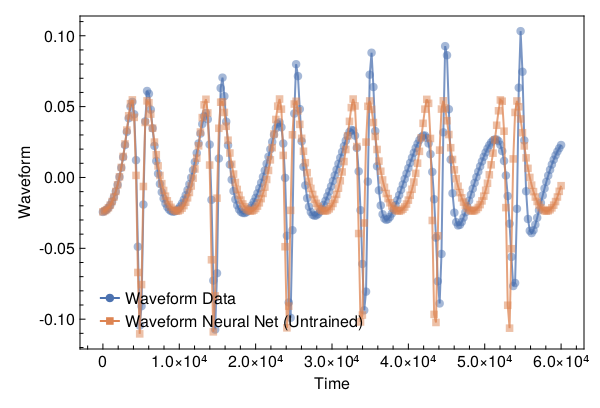
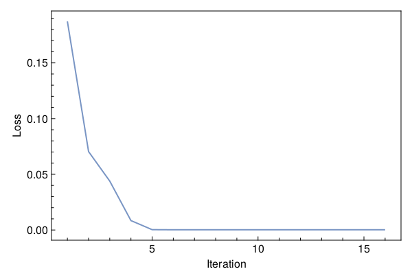
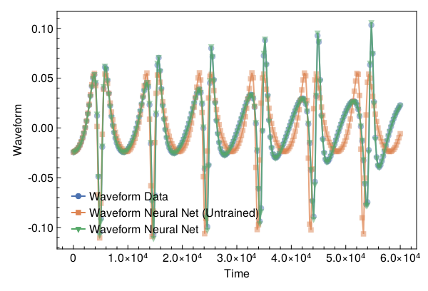

<a id='Training-a-Neural-ODE-to-Model-Gravitational-Waveforms'></a>

# Training a Neural ODE to Model Gravitational Waveforms


This code is adapted from [Astroinformatics/ScientificMachineLearning](https://github.com/Astroinformatics/ScientificMachineLearning/blob/c93aac3a460d70b4cce98836b677fd9b732e94b7/neuralode_gw.ipynb)


The code has been minimally adapted from [Keith et. al. 2021](https://arxiv.org/abs/2102.12695) which originally used Flux.jl


<a id='Package-Imports'></a>

## Package Imports


```julia
using Lux, ComponentArrays, LineSearches, LuxAMDGPU, LuxCUDA, OrdinaryDiffEq,
    Optimization, OptimizationOptimJL, Random, SciMLSensitivity
using CairoMakie, MakiePublication
CUDA.allowscalar(false)
```


<a id='Define-some-Utility-Functions'></a>

## Define some Utility Functions


::: tip


This section can be skipped. It defines functions to simulate the model, however, from a scientific machine learning perspective, isn't super relevant.


:::


We need a very crude 2-body path. Assume the 1-body motion is a newtonian 2-body position vector $r = r_1 - r_2$ and use Newtonian formulas to get $r_1$, $r_2$ (e.g. Theoretical Mechanics of Particles and Continua 4.3)


```julia
function one2two(path, m₁, m₂)
    M = m₁ + m₂
    r₁ = m₂ / M .* path
    r₂ = -m₁ / M .* path
    return r₁, r₂
end
```


```
one2two (generic function with 1 method)
```


Next we define a function to perform the change of variables: $(\chi(t),\phi(t)) \mapsto (x(t),y(t))$


```julia
@views function soln2orbit(soln, model_params=nothing)
    @assert size(soln, 1) ∈ [2, 4] "size(soln,1) must be either 2 or 4"

    if size(soln, 1) == 2
        χ = soln[1, :]
        ϕ = soln[2, :]

        @assert length(model_params)==3 "model_params must have length 3 when size(soln,2) = 2"
        p, M, e = model_params
    else
        χ = soln[1, :]
        ϕ = soln[2, :]
        p = soln[3, :]
        e = soln[4, :]
    end

    r = p ./ (1 .+ e .* cos.(χ))
    x = r .* cos.(ϕ)
    y = r .* sin.(ϕ)

    orbit = vcat(x', y')
    return orbit
end
```


```
soln2orbit (generic function with 2 methods)
```


This function uses second-order one-sided difference stencils at the endpoints; see https://doi.org/10.1090/S0025-5718-1988-0935077-0


```julia
function d_dt(v::AbstractVector, dt)
    a = -3 / 2 * v[1] + 2 * v[2] - 1 / 2 * v[3]
    b = (v[3:end] .- v[1:(end - 2)]) / 2
    c = 3 / 2 * v[end] - 2 * v[end - 1] + 1 / 2 * v[end - 2]
    return [a; b; c] / dt
end
```


```
d_dt (generic function with 1 method)
```


This function uses second-order one-sided difference stencils at the endpoints; see https://doi.org/10.1090/S0025-5718-1988-0935077-0


```julia
function d2_dt2(v::AbstractVector, dt)
    a = 2 * v[1] - 5 * v[2] + 4 * v[3] - v[4]
    b = v[1:(end - 2)] .- 2 * v[2:(end - 1)] .+ v[3:end]
    c = 2 * v[end] - 5 * v[end - 1] + 4 * v[end - 2] - v[end - 3]
    return [a; b; c] / (dt^2)
end
```


```
d2_dt2 (generic function with 1 method)
```


Now we define a function to compute the trace-free moment tensor from the orbit


```julia
function orbit2tensor(orbit, component, mass=1)
    x = orbit[1, :]
    y = orbit[2, :]

    Ixx = x .^ 2
    Iyy = y .^ 2
    Ixy = x .* y
    trace = Ixx .+ Iyy

    if component[1] == 1 && component[2] == 1
        tmp = Ixx .- trace ./ 3
    elseif component[1] == 2 && component[2] == 2
        tmp = Iyy .- trace ./ 3
    else
        tmp = Ixy
    end

    return mass .* tmp
end

function h_22_quadrupole_components(dt, orbit, component, mass=1)
    mtensor = orbit2tensor(orbit, component, mass)
    mtensor_ddot = d2_dt2(mtensor, dt)
    return 2 * mtensor_ddot
end

function h_22_quadrupole(dt, orbit, mass=1)
    h11 = h_22_quadrupole_components(dt, orbit, (1, 1), mass)
    h22 = h_22_quadrupole_components(dt, orbit, (2, 2), mass)
    h12 = h_22_quadrupole_components(dt, orbit, (1, 2), mass)
    return h11, h12, h22
end

function h_22_strain_one_body(dt::T, orbit) where {T}
    h11, h12, h22 = h_22_quadrupole(dt, orbit)

    h₊ = h11 - h22
    hₓ = T(2) * h12

    scaling_const = √(T(π) / 5)
    return scaling_const * h₊, -scaling_const * hₓ
end

function h_22_quadrupole_two_body(dt, orbit1, mass1, orbit2, mass2)
    h11_1, h12_1, h22_1 = h_22_quadrupole(dt, orbit1, mass1)
    h11_2, h12_2, h22_2 = h_22_quadrupole(dt, orbit2, mass2)
    h11 = h11_1 + h11_2
    h12 = h12_1 + h12_2
    h22 = h22_1 + h22_2
    return h11, h12, h22
end

function h_22_strain_two_body(dt::T, orbit1, mass1, orbit2, mass2) where {T}
    # compute (2,2) mode strain from orbits of BH 1 of mass1 and BH2 of mass 2

    @assert abs(mass1 + mass2 - 1.0)<1e-12 "Masses do not sum to unity"

    h11, h12, h22 = h_22_quadrupole_two_body(dt, orbit1, mass1, orbit2, mass2)

    h₊ = h11 - h22
    hₓ = T(2) * h12

    scaling_const = √(T(π) / 5)
    return scaling_const * h₊, -scaling_const * hₓ
end

function compute_waveform(dt::T, soln, mass_ratio, model_params=nothing) where {T}
    @assert mass_ratio≤1 "mass_ratio must be <= 1"
    @assert mass_ratio≥0 "mass_ratio must be non-negative"

    orbit = soln2orbit(soln, model_params)
    if mass_ratio > 0
        m₂ = inv(T(1) + mass_ratio)
        m₁ = mass_ratio * m₂

        orbit₁, orbit₂ = one2two(orbit, m₁, m₂)
        waveform = h_22_strain_two_body(dt, orbit1, mass1, orbit2, mass2)
    else
        waveform = h_22_strain_one_body(dt, orbit)
    end
    return waveform
end
```


```
compute_waveform (generic function with 2 methods)
```


<a id='Simulating-the-True-Model'></a>

## Simulating the True Model


`RelativisticOrbitModel` defines system of odes which describes motion of point like particle in schwarzschild background, uses


$$
u[1] = \chi
$$


$$
u[2] = \phi
$$


where, $p$, $M$, and $e$ are constants


```julia
function RelativisticOrbitModel(u, (p, M, e), t)
    χ, ϕ = u

    numer = (p - 2 - 2 * e * cos(χ)) * (1 + e * cos(χ))^2
    denom = sqrt((p - 2)^2 - 4 * e^2)

    χ̇ = numer * sqrt(p - 6 - 2 * e * cos(χ)) / (M * (p^2) * denom)
    ϕ̇ = numer / (M * (p^(3 / 2)) * denom)

    return [χ̇, ϕ̇]
end

mass_ratio = 0.0         # test particle
u0 = Float64[π, 0.0]     # initial conditions
datasize = 250
tspan = (0.0f0, 6.0f4)   # timespace for GW waveform
tsteps = range(tspan[1], tspan[2]; length=datasize)  # time at each timestep
dt_data = tsteps[2] - tsteps[1]
dt = 100.0
const ode_model_params = [100.0, 1.0, 0.5]; # p, M, e
```


Let's simulate the true model and plot the results using `OrdinaryDiffEq.jl`


```julia
prob = ODEProblem(RelativisticOrbitModel, u0, tspan, ode_model_params)
soln = Array(solve(prob, RK4(); saveat=tsteps, dt, adaptive=false))
waveform = first(compute_waveform(dt_data, soln, mass_ratio, ode_model_params))

fig = with_theme(theme_web()) do
    fig = Figure()
    ax = CairoMakie.Axis(fig[1, 1]; xlabel="Time", ylabel="Waveform")

    l = lines!(ax, tsteps, waveform; linewidth=2, alpha=0.75)
    s = scatter!(ax, tsteps, waveform; markershape=:circle, markeralpha=0.25, alpha=0.5)

    axislegend(ax, [[l, s]], ["Waveform Data"])

    return fig
end
```


<a id='Defiing-a-Neural-Network-Model'></a>

## Defiing a Neural Network Model


Next, we define the neural network model that takes 1 input (time) and has two outputs. We'll make a function `ODE_model` that takes the initial conditions, neural network parameters and a time as inputs and returns the derivatives.


It is typically never recommended to use globals but incase you do use them, make sure to mark them as `const`.


We will deviate from the standard Neural Network initialization and use `WeightInitializers.jl`,


```julia
const nn = Chain(Base.Fix1(broadcast, cos),
    Dense(1 => 32, cos; init_weight=truncated_normal(; std=1e-4)),
    Dense(32 => 32, cos; init_weight=truncated_normal(; std=1e-4)),
    Dense(32 => 2; init_weight=truncated_normal(; std=1e-4)))
ps, st = Lux.setup(MersenneTwister(), nn)
```


```
((layer_1 = NamedTuple(), layer_2 = (weight = Float32[8.1196624f-5; 0.0001172367; -2.0625592f-5; 0.000102182945; -7.864545f-5; -0.000112358925; 0.00012665898; -1.0645128f-6; -0.000118263044; 6.2862564f-5; 0.00011139981; -6.5364955f-5; 0.00015732007; -4.138621f-5; 9.500271f-5; -0.00010914575; 8.014839f-5; -0.00012908378; -0.00014198468; -3.371936f-5; -3.9425246f-5; 7.9899095f-5; 0.0002754154; 7.182741f-5; 9.042918f-5; 0.00018149293; 9.512835f-5; -3.9131908f-5; -0.00027770322; 8.160198f-6; -0.00018616236; 2.9463012f-5;;], bias = Float32[0.0; 0.0; 0.0; 0.0; 0.0; 0.0; 0.0; 0.0; 0.0; 0.0; 0.0; 0.0; 0.0; 0.0; 0.0; 0.0; 0.0; 0.0; 0.0; 0.0; 0.0; 0.0; 0.0; 0.0; 0.0; 0.0; 0.0; 0.0; 0.0; 0.0; 0.0; 0.0;;]), layer_3 = (weight = Float32[0.00010427454 -1.1607572f-5 0.0001308002 4.456357f-5 -0.00010766216 2.5913845f-5 -9.443973f-5 -6.947645f-5 -0.000116921634 -0.00012342099 0.00017656444 0.00012407888 1.3397889f-5 -0.00010285688 -0.00012443324 -0.00011335843 4.9181494f-5 -0.00014967172 0.00019801933 -8.57873f-5 -3.56731f-5 3.0022546f-5 0.00010725305 -0.00018674613 -3.34154f-5 4.5980112f-5 0.000109445595 0.0001167117 4.0147097f-6 0.00016021896 -4.470159f-5 0.000112611735; -6.84524f-6 -1.1440986f-5 2.8420352f-5 3.5561283f-5 0.00016923211 0.00019552986 6.928817f-5 4.584805f-6 0.00016303126 -5.060836f-5 4.2532083f-5 -0.0001642358 4.767801f-5 2.9138802f-5 7.447753f-5 8.452195f-5 0.000113271206 -5.969869f-5 -7.689509f-5 -8.835193f-5 -3.6393332f-5 3.0476924f-5 -0.0002022071 -3.6768062f-5 0.00010348565 4.9671504f-5 0.00011968648 5.4658467f-5 0.00010725294 -3.61804f-7 -1.5116492f-5 -0.000144556; -6.356119f-5 8.802862f-5 -8.297155f-5 -7.054714f-5 -7.698127f-5 0.00012775148 -9.9867204f-5 0.00022636978 4.529759f-5 4.1492684f-5 -4.90534f-7 3.9665483f-5 4.7710622f-5 8.149102f-5 -6.1728366f-5 3.826341f-5 2.8120863f-5 0.0002713076 -3.7552552f-5 -5.456398f-5 4.239762f-5 2.7840573f-5 8.148715f-6 -1.18446005f-5 -0.00015474515 3.0529723f-6 0.00018789349 2.3506787f-5 1.7185306f-5 0.000110781555 0.00010143556 4.839131f-5; -6.5011554f-5 -6.803009f-6 3.417802f-5 0.00018020715 -5.124144f-5 6.443505f-5 -0.00010352899 9.19578f-5 3.3910714f-5 0.00010374433 -4.2089738f-5 -0.000116040326 -0.00024565437 -5.9539034f-5 9.396514f-5 8.062767f-5 -2.8717388f-5 4.934238f-5 -0.00019185706 0.00017818245 -9.130921f-5 -6.649782f-5 -5.969023f-5 8.965812f-5 -7.0856106f-5 5.722991f-5 -0.00011253555 3.914278f-5 0.00025885593 -9.369483f-5 3.2223503f-5 -0.000108719345; 1.4358732f-5 2.2266742f-5 1.7182578f-5 -0.00017783554 -5.672161f-5 -3.645799f-5 -5.137137f-5 0.00011732752 0.00010021581 -4.4304037f-5 -0.00014149919 -0.00018928721 -3.3947905f-5 1.012142f-5 9.48372f-5 7.910332f-6 -5.680105f-5 5.2390973f-5 9.8404835f-6 8.9398345f-5 -1.8028895f-5 2.2925835f-5 -3.6536243f-5 5.8609206f-5 -4.494297f-5 0.00017086705 -0.00032402526 -0.00012234382 0.000121737736 -4.7081674f-5 -0.00015582982 -5.3351996f-5; -5.2131774f-5 -0.000110901296 6.7705754f-5 0.00021900931 -3.8481485f-5 -0.00012777116 -0.00026454512 -6.130117f-5 -3.2108113f-5 1.4209756f-5 -8.2485377f-7 -0.00015737468 0.00023861932 3.8743674f-6 6.967618f-5 -2.7272492f-6 -3.4590896f-5 3.826521f-5 -3.385008f-5 3.9527356f-5 1.0353496f-5 6.202727f-5 -4.999663f-5 -0.000119527496 0.000103226994 -9.407798f-5 -1.6439659f-6 4.5474895f-5 -0.00015946427 7.9264864f-5 -2.6157644f-5 -0.00021462659; -3.2655436f-5 9.509754f-5 -0.00014205882 4.9079176f-6 3.8200433f-5 -1.9184858f-5 6.870108f-5 5.1670933f-5 -7.901625f-5 -7.620465f-5 -0.00021375804 7.2265125f-6 4.7785437f-5 0.00016247398 0.00024403217 0.00013560744 -4.3178774f-5 0.00020453912 -3.639975f-5 7.923157f-5 0.00012207552 9.85485f-5 -7.671184f-6 0.00016649955 1.7853554f-6 0.00020268442 3.064208f-5 5.9806498f-5 2.9086428f-5 1.1792243f-5 -3.0612988f-5 7.000157f-5; 0.00011495645 0.0002019318 -0.00011935413 -0.00017742235 -1.37211455f-5 7.677747f-6 0.00021043417 -1.6059519f-6 0.00019205188 0.00011279732 -4.2010575f-5 -0.00017265446 -0.000110628025 -1.910923f-5 -3.5554724f-5 -8.184153f-6 0.00011643263 1.4428628f-5 8.2751256f-5 -3.054094f-5 1.7068018f-5 0.000117744436 8.20378f-5 -5.624746f-5 3.422621f-5 9.776195f-5 3.6026f-5 0.0001706835 8.019565f-6 -0.00013080412 0.0001299348 1.1898797f-5; 4.984442f-5 4.5053574f-5 1.9338158f-5 1.6656628f-6 0.000114283335 -7.0740425f-5 -6.278005f-5 -5.4511762f-5 2.9080195f-5 0.00010277471 -0.00010360051 -1.32460655f-5 -0.00015655061 -0.00029373594 -8.753506f-5 -3.4656317f-5 -7.137221f-5 8.166674f-6 8.7774846f-5 4.1325246f-5 -2.071409f-5 3.292844f-5 -6.1180144f-6 8.8959714f-5 0.0001896841 -0.00013540349 9.343236f-5 6.8962334f-5 3.9259587f-5 -0.0001133961 -7.9804937f-7 0.00010734641; -0.00010185456 -4.147705f-5 -2.6663793f-5 2.2002225f-5 6.885792f-5 1.1546866f-5 -7.966302f-5 -4.714027f-5 -6.30669f-6 8.492359f-5 0.00013929939 9.05937f-6 0.00010895453 9.317261f-5 2.6905714f-6 1.7699939f-6 -0.00011901145 9.803216f-5 6.710605f-5 -0.0001410869 -0.00014033317 5.1810344f-5 3.3189317f-6 -4.715543f-5 -5.3407493f-6 -0.00011306095 7.4211275f-5 -0.00014908238 -4.869424f-5 -8.124986f-5 9.013678f-5 5.0519935f-5; -4.057116f-6 1.2415417f-6 -0.00017342831 4.4772263f-5 8.789034f-5 5.4322194f-5 -0.00011301278 -0.0001173098 7.0979026f-5 3.8830694f-6 1.6643027f-5 0.00016939825 0.00014311362 -0.00019927118 -1.7860575f-5 -9.438677f-5 -4.6995538f-6 -3.931627f-5 -1.8940604f-5 8.355429f-5 1.414447f-5 -0.00016801289 -2.5940806f-6 -1.3497152f-5 2.3885827f-6 -0.00015780155 -0.00014083729 -8.0725484f-5 -0.000103535276 8.32598f-5 -4.9584003f-5 6.697167f-5; 8.3950836f-5 -4.4851888f-8 3.6134174f-5 -0.00020121897 -0.00013602551 1.1284926f-6 6.165897f-5 3.6545156f-5 -4.2218377f-5 0.00016481956 1.6641481f-5 -5.656627f-5 3.853217f-5 0.00018871532 0.00023200565 -5.4792406f-5 -7.589334f-5 -0.00011752514 0.00017674966 0.000112589536 4.613667f-5 -7.7863675f-5 0.00011030703 -0.0001332498 0.00014212704 7.0393275f-5 2.6999733f-5 7.862103f-6 0.00018757652 0.00017625003 -0.0001257875 0.00011370942; 9.847879f-5 7.4866664f-5 -6.1903443f-6 4.453212f-5 4.7398356f-5 -0.00014829992 -4.129589f-5 7.402679f-5 7.944894f-6 0.00013589577 0.00015668914 -0.000100831305 -0.00017151849 9.093668f-5 -6.971408f-5 4.9613944f-5 -0.00013496751 7.4304617f-6 -2.3731183f-5 -8.473552f-5 0.00012245348 0.00026520842 0.00015173342 -0.00012561065 -0.00010043759 -5.1570973f-5 -0.000114456954 2.9254415f-6 -2.3116105f-5 0.00010516271 8.405923f-5 -2.7747187f-6; -7.40363f-5 -6.168398f-5 6.221932f-7 -1.4450187f-5 -2.7646394f-5 0.0001645666 -0.00016527722 1.6824752f-5 7.182652f-5 0.00011100299 -0.00014751677 0.00017551695 0.00013356368 -6.6868946f-5 2.1925514f-5 -9.5122625f-5 0.00017517472 5.1738356f-5 2.3773753f-5 5.0808576f-5 -1.0046126f-5 7.367935f-5 -5.3133906f-5 -4.96524f-6 -1.1150064f-5 0.00016950637 0.0001092137 -4.6558325f-5 2.0707037f-5 -9.082902f-5 0.00023892014 -5.356189f-5; 5.0320825f-5 0.00019716732 8.504725f-5 -2.69924f-6 -0.000112999536 0.0001617014 -0.00017172437 -7.243784f-5 1.2448887f-6 -2.3877752f-5 -0.00013793833 -0.00010584874 0.0001836907 5.9781236f-5 2.464248f-5 -4.466319f-5 -0.00010754791 5.0914687f-6 -9.71628f-5 -4.7948524f-5 1.9113702f-5 -2.2351905f-5 -4.513197f-5 8.60288f-5 -3.9716208f-5 -0.00013945605 -0.00015301489 5.2875308f-5 0.00012899282 -7.012368f-5 2.9008226f-5 1.2654284f-5; 0.000119549535 2.6169364f-5 0.000100698955 -2.5165355f-5 -5.1549745f-5 0.00013119358 -3.3525725f-5 5.033619f-5 -2.6816635f-6 -8.359149f-5 6.970212f-5 -0.00014570805 0.00012364234 -1.0142054f-5 -8.418344f-5 -4.334428f-5 -8.368641f-5 4.67909f-5 -3.6023765f-5 -0.00012435473 -0.0001926434 -0.00017799948 -3.1167703f-5 1.6274655f-5 9.07644f-5 -1.3974205f-5 -3.4149354f-5 -1.779849f-5 4.227996f-5 2.9547978f-6 -4.1526393f-5 0.00016998875; 0.00015382776 0.00025175774 5.1165098f-5 -7.422273f-5 2.5180714f-5 -0.00021955045 -1.6445637f-6 -1.5355068f-5 -7.9674655f-6 -3.6481943f-5 0.0001993219 0.000101790276 -0.00014500668 -4.464754f-5 1.52071725f-5 0.00011613294 0.0001554511 -1.5904021f-5 1.9331217f-5 0.00015683495 4.7245285f-5 -3.2463995f-5 -0.00016080604 -2.0428968f-5 -0.00014980676 7.5061966f-5 7.889235f-5 -5.205614f-5 5.4914177f-5 5.7230296f-5 5.8935515f-5 -0.0001010127; -2.8239105f-5 -6.640265f-5 2.0827396f-5 -4.7989557f-5 -9.180389f-5 -0.00017987382 3.3437518f-5 4.7543475f-5 4.132541f-5 -1.0522707f-5 -2.0097448f-6 7.6159813f-6 7.546965f-5 -2.6115255f-5 -3.6713715f-5 -6.1717954f-5 1.603661f-5 -5.4003405f-5 0.00013686957 -1.286679f-5 1.39071f-5 4.6433746f-5 -1.6324193f-5 -5.8240395f-5 -6.3196785f-5 1.839447f-5 4.9084967f-5 -2.2700355f-5 -1.9086285f-5 6.9705355f-5 6.510138f-5 4.221697f-5; -0.00013453682 4.165274f-5 -8.5360756f-5 7.622386f-5 8.217129f-5 2.1298656f-5 -0.00013895653 6.132457f-5 4.2952917f-5 -0.00015233029 5.5932298f-5 7.281212f-5 5.0250474f-6 -1.2659404f-5 -2.816137f-5 -0.00018549447 7.505935f-5 0.000100482976 8.8935434f-5 6.07934f-5 2.6710331f-5 0.00010222294 1.5902326f-5 -6.374891f-5 -5.3972362f-5 -5.904746f-5 9.493793f-5 -3.0031611f-5 0.000116089555 8.260961f-5 4.5423178f-5 0.00015319654; 0.0001489158 -4.8450324f-6 -0.00013438924 4.4229157f-5 4.562993f-5 -3.5299174f-5 7.938245f-5 -9.225426f-6 6.8746226f-6 -1.1450912f-5 0.00011336024 -0.00012503286 0.00019353254 -1.3778972f-5 -9.915803f-5 -4.268224f-5 -7.587505f-5 -6.052212f-5 -6.446959f-5 -6.135382f-5 -3.267378f-5 -0.00017472701 0.00025198798 -0.00014098253 9.479954f-5 4.208714f-6 -7.5650664f-6 8.229186f-6 5.5617336f-5 -2.8559922f-5 -7.877061f-5 -8.418923f-5; -0.00014508137 -2.0868836f-5 0.00014821203 -9.638794f-5 8.6792425f-5 -7.661524f-5 1.4273539f-5 0.00027624695 -7.576586f-5 7.9494705f-5 0.00018134621 -0.00012991305 -0.00013162466 -2.0042022f-5 -7.6090887f-6 -0.0001398465 -0.00011356678 -6.838411f-6 3.000898f-5 -5.2389158f-5 0.0001995715 -7.8302066f-5 -4.6738834f-5 -0.00019224572 -0.0002245383 7.4044533f-6 -6.5698023f-6 5.139314f-7 -0.00016692794 8.32811f-5 2.6769017f-5 3.5471658f-5; -1.1586724f-5 -6.0667135f-5 5.8143945f-5 -6.638738f-5 -0.00013898408 4.24931f-5 -0.00016729216 5.3309694f-5 -0.00015875553 -8.4137326f-5 9.9793775f-5 8.95172f-6 1.3812337f-5 -9.085357f-5 -1.19172155f-5 -6.08898f-5 5.49573f-5 -2.6623532f-6 -5.6706413f-5 2.6863834f-5 1.834606f-5 0.00012334877 0.00012936206 1.0410968f-5 -3.588252f-5 -0.00016597378 2.1644402f-5 -0.00013015537 -9.5347554f-5 -7.349829f-5 -2.3785064f-5 -8.107822f-6; 6.1568506f-5 -0.000186303 -0.0002444089 6.445955f-5 6.418107f-5 0.00012129388 -5.0633018f-5 4.82436f-6 5.5915632f-5 -7.284426f-5 0.00013176641 -2.9703729f-6 7.7994846f-5 0.000115734285 -0.00016825805 9.0949914f-5 -7.427319f-5 -8.860239f-5 7.972385f-5 3.7819238f-5 -5.751902f-5 0.00010261685 7.566195f-5 -0.00019509134 7.9224985f-5 0.00016959115 -0.00013350224 -2.5521655f-5 7.408977f-5 -7.820458f-5 -0.00011792835 2.3751161f-5; 6.8936794f-7 8.611873f-5 3.6952148f-5 3.8296046f-5 0.00015702104 -1.9972698f-5 6.9927795f-5 8.561452f-5 6.273329f-5 2.5228248f-5 0.0001265131 1.0757281f-8 0.00010641821 9.447082f-5 -7.6271775f-5 -4.5151096f-6 7.933557f-5 -4.5782686f-5 6.8983376f-5 8.8102686f-5 4.087112f-6 0.00012624096 0.00020045401 -3.3325055f-6 9.389287f-5 2.8045797f-5 1.4026304f-7 2.2682909f-5 0.000107010805 -0.00022703919 -6.407599f-5 9.713205f-5; 5.4535303f-5 -4.2969106f-5 1.2645277f-5 -9.577627f-5 5.8289508f-5 6.0973336f-5 -7.965277f-6 0.00014627611 0.00020843987 6.274508f-5 -0.0001252377 -0.00011878007 9.5479874f-5 0.00012275786 -0.00011117257 3.910936f-5 -0.00022206374 2.37034f-5 -5.044825f-5 -7.783414f-5 -2.2942953f-5 -5.230866f-5 -1.0796447f-5 -9.6719225f-5 9.2258124f-5 4.8515172f-5 -0.00011522091 -2.8497334f-5 -1.7906696f-5 -9.58595f-5 5.3393273f-5 6.0556755f-5; -0.00023177486 -5.446282f-5 -4.117822f-5 -0.000103827384 -6.2996856f-5 3.4650704f-5 -0.00018296839 -0.000167373 -8.2123006f-5 7.618559f-6 -7.414301f-5 8.1310485f-5 -1.6703929f-5 1.1788f-5 -1.5720056f-5 -3.1668835f-5 8.504309f-6 2.6920685f-5 -2.353941f-5 -0.000101952035 -3.4640994f-5 1.9462452f-5 1.627732f-5 2.9582212f-5 4.7479447f-5 5.7727513f-5 -0.0001668107 5.219172f-6 -0.0001232503 4.7129586f-5 -1.2286102f-5 -6.318409f-5; -3.857823f-5 -1.6716443f-5 3.992643f-5 2.9309946f-5 -0.00014415054 -0.000102993195 4.7565725f-5 0.00016351101 0.00011618944 -2.3491551f-5 0.00010066552 -4.7385016f-5 1.707857f-5 -1.4801716f-5 9.7699274f-5 -0.00012230953 -5.320012f-6 2.7720662f-5 0.00026330882 -0.00020760561 0.000102946586 0.00010902759 0.00020594826 -8.2428625f-5 -6.11579f-5 -0.00013446173 7.141744f-5 -0.00011343123 8.14301f-5 -2.065276f-6 -6.0507766f-5 6.422425f-5; -6.480988f-5 -5.3257587f-5 -8.6309126f-5 7.391444f-5 9.462982f-5 5.6699922f-5 0.000102822756 3.6436115f-5 -1.8897344f-5 -2.445392f-5 1.1481441f-5 -1.8581286f-5 0.00012677535 -8.305615f-5 3.392176f-5 9.867071f-5 6.219186f-5 -6.6275454f-5 1.8316492f-5 0.00011621292 -4.5208826f-6 -4.0913998f-5 9.4261544f-5 -0.00016876467 0.00012298563 -9.01952f-5 0.00020002847 -0.00012862634 0.00013094745 0.00024040487 0.0002073231 0.00019203222; 5.971994f-5 6.4349646f-5 8.273258f-5 7.116774f-5 -4.13602f-5 -0.00010407404 4.191105f-5 4.6140693f-5 -2.5790754f-5 -5.780791f-5 3.2364285f-5 0.00010724402 -2.6314046f-5 -0.00024850052 4.8066955f-5 2.8532906f-5 -5.7737114f-5 -7.660887f-5 -1.7116592f-5 -0.00010995276 0.00011884998 -2.7743952f-5 -3.3828754f-5 0.00010080369 -6.583812f-5 8.6786895f-5 4.7146783f-5 7.5419804f-5 6.698689f-5 4.0949024f-5 9.911866f-5 0.0001385868; -2.9835952f-5 -7.5808595f-5 3.4990702f-5 0.0001493851 0.00022965684 -2.404424f-5 -4.252878f-5 9.3174174f-5 1.0233065f-5 -0.00014570243 1.0324416f-5 0.00012656514 3.0699055f-5 9.68024f-5 0.00018220299 7.246251f-5 8.210727f-5 -0.0001544817 -0.0001114092 -5.9055215f-5 -0.00016819961 -0.00011812347 -0.00012957602 0.00017370093 -9.074496f-5 -5.5932156f-5 -0.000100670084 -0.00021664506 7.3846524f-5 0.0001344508 1.12729285f-5 3.3030665f-5; 2.1172493f-5 -4.8950533f-6 -0.00024931657 0.00017464499 6.861957f-5 0.00012995009 0.0003123453 -8.2415325f-5 -3.8684284f-5 -7.755754f-5 2.0212263f-5 -3.9219925f-5 -0.000103906714 5.8247795f-5 0.0001567466 -0.00015038117 2.7780101f-5 4.5738423f-5 6.986252f-5 -0.00012290545 -0.00017256274 -3.1662017f-5 7.322477f-5 0.0001318362 -0.000105680876 0.00012390454 0.00010467051 -5.247634f-5 0.00011305008 0.00013122906 -0.00013459874 3.998854f-5; 0.00025173926 -2.830852f-5 0.00020114504 -8.013665f-5 9.69506f-5 -7.3270334f-5 -1.08584845f-5 5.5874163f-5 -8.826054f-5 -1.46370885f-5 -0.000108622975 3.6797763f-5 -5.2738895f-5 -5.447242f-5 2.7735598f-5 0.00016124998 1.7492468f-5 0.00020381813 -4.931734f-5 -9.8059216f-5 9.436679f-6 -0.0001270827 5.9789203f-5 -9.2472226f-5 -4.9540824f-5 -2.6250184f-6 0.00012361116 0.00023508442 0.000118362565 0.00019295064 0.00012295743 -0.00016654439], bias = Float32[0.0; 0.0; 0.0; 0.0; 0.0; 0.0; 0.0; 0.0; 0.0; 0.0; 0.0; 0.0; 0.0; 0.0; 0.0; 0.0; 0.0; 0.0; 0.0; 0.0; 0.0; 0.0; 0.0; 0.0; 0.0; 0.0; 0.0; 0.0; 0.0; 0.0; 0.0; 0.0;;]), layer_4 = (weight = Float32[-6.498907f-5 -7.488742f-5 5.5238805f-5 4.0840092f-5 2.4545096f-5 3.5411013f-5 3.3544846f-5 -2.800465f-5 5.5798977f-5 0.000103688966 -0.0001319379 -6.9796383f-6 -7.308107f-5 -2.2763777f-6 0.00015818975 -1.4529785f-5 4.1234332f-5 0.00011563848 -0.00011150652 0.00013243333 -6.760628f-5 -1.0763747f-5 0.00023122117 9.663368f-5 -5.3098738f-5 5.99408f-5 -2.6572061f-5 -0.00010626762 0.00017653704 -5.722002f-5 0.00014114012 1.2675489f-5; 9.97405f-6 -6.366094f-6 0.00019554482 -5.120403f-5 -0.00012221823 -2.556784f-5 6.742298f-5 -0.0001307321 0.000157137 -2.3065837f-5 -0.00014249218 0.0001525532 3.7871207f-5 0.0001274352 -7.1203045f-5 2.7426473f-5 -0.00016222875 7.6027034f-5 -5.5409814f-6 2.698929f-5 1.3833726f-5 -2.4357534f-5 5.0556846f-6 0.00013461914 2.5544561f-5 -3.9329894f-5 -6.456552f-5 -0.00017184408 5.4797372f-5 0.00013650097 -0.00010193913 -4.6637568f-5], bias = Float32[0.0; 0.0;;])), (layer_1 = NamedTuple(), layer_2 = NamedTuple(), layer_3 = NamedTuple(), layer_4 = NamedTuple()))
```


Similar to most DL frameworks, Lux defaults to using `Float32`, however, in this case we need Float64


```julia
const params = ComponentArray{Float64}(ps)
```


```
ComponentVector{Float64}(layer_1 = Float64[], layer_2 = (weight = [8.119662379613146e-5; 0.00011723669740604237; -2.0625591787393205e-5; 0.00010218294482911006; -7.864544750191271e-5; -0.00011235892452532426; 0.00012665898248087615; -1.0645128440955887e-6; -0.00011826304398709908; 6.286256393650547e-5; 0.0001113998077926226; -6.536495493492112e-5; 0.0001573200715938583; -4.1386210796190426e-5; 9.500270971329883e-5; -0.00010914575250353664; 8.014839113457128e-5; -0.00012908378266729414; -0.00014198468124959618; -3.371935963514261e-5; -3.942524563171901e-5; 7.989909499883652e-5; 0.00027541539748199284; 7.182740955613554e-5; 9.04291810002178e-5; 0.00018149292736779898; 9.512835094938055e-5; -3.913190812454559e-5; -0.0002777032204903662; 8.160198376572225e-6; -0.00018616236047819257; 2.9463011742336676e-5;;], bias = [0.0; 0.0; 0.0; 0.0; 0.0; 0.0; 0.0; 0.0; 0.0; 0.0; 0.0; 0.0; 0.0; 0.0; 0.0; 0.0; 0.0; 0.0; 0.0; 0.0; 0.0; 0.0; 0.0; 0.0; 0.0; 0.0; 0.0; 0.0; 0.0; 0.0; 0.0; 0.0;;]), layer_3 = (weight = [0.00010427454253658652 -1.160757165052928e-5 0.00013080019562039524 4.456357055460103e-5 -0.0001076621629181318 2.591384509287309e-5 -9.443973249290138e-5 -6.947645306354389e-5 -0.000116921633889433 -0.00012342099216766655 0.00017656444106251001 0.00012407888425514102 1.3397889233601745e-5 -0.0001028568804031238 -0.00012443323794286698 -0.00011335843009874225 4.9181493523065e-5 -0.00014967171591706574 0.00019801933376584202 -8.578730194130912e-5 -3.567309977370314e-5 3.0022545615793206e-5 0.00010725305037340149 -0.00018674612510949373 -3.341539922985248e-5 4.598011219059117e-5 0.00010944559471681714 0.00011671170068439096 4.014709702460095e-6 0.00016021895862650126 -4.4701588194584474e-5 0.00011261173494858667; -6.845240022812504e-6 -1.1440985872468445e-5 2.8420352464308962e-5 3.556128285708837e-5 0.0001692321093287319 0.00019552986486814916 6.928817310836166e-5 4.584805083140964e-6 0.00016303126176353544 -5.060835974290967e-5 4.253208317095414e-5 -0.0001642357965465635 4.767801146954298e-5 2.9138802347006276e-5 7.447753159794956e-5 8.45219474285841e-5 0.00011327120591886342 -5.969869016553275e-5 -7.689509220654145e-5 -8.83519314811565e-5 -3.639333226601593e-5 3.047692371183075e-5 -0.00020220709848217666 -3.6768062273040414e-5 0.00010348564683226869 4.9671503802528605e-5 0.00011968648323090747 5.465846697916277e-5 0.00010725294123403728 -3.6180401252750016e-7 -1.5116492249944713e-5 -0.0001445560046704486; -6.356118683470413e-5 8.802861702861264e-5 -8.297155000036582e-5 -7.054713933030143e-5 -7.698126864852384e-5 0.00012775148206856102 -9.986720397137105e-5 0.00022636978246737272 4.5297590986592695e-5 4.149268352193758e-5 -4.905339778815687e-7 3.9665483200224116e-5 4.771062231156975e-5 8.149102359311655e-5 -6.172836583573371e-5 3.826340980594978e-5 2.812086313497275e-5 0.0002713075955398381 -3.7552552385022864e-5 -5.456398139358498e-5 4.239761983626522e-5 2.7840573238790967e-5 8.14871509646764e-6 -1.1844600521726534e-5 -0.00015474515384994447 3.0529722607752774e-6 0.00018789348541758955 2.350678732909728e-5 1.7185306205647066e-5 0.0001107815551222302 0.00010143555846298113 4.839130997424945e-5; -6.501155439764261e-5 -6.803009000577731e-6 3.4178021451225504e-5 0.00018020714924205095 -5.124144081491977e-5 6.44350511720404e-5 -0.00010352898971177638 9.195780148729682e-5 3.3910713682416826e-5 0.00010374432895332575 -4.208973768982105e-5 -0.00011604032624745741 -0.00024565437342971563 -5.9539033827604726e-5 9.396514360560104e-5 8.062767301453277e-5 -2.871738797693979e-5 4.9342379497829825e-5 -0.00019185706332791597 0.0001781824539648369 -9.130920807365328e-5 -6.649782153544948e-5 -5.969022822682746e-5 8.965811866801232e-5 -7.085610559443012e-5 5.7229910453315824e-5 -0.00011253554839640856 3.914277840522118e-5 0.00025885592913255095 -9.36948272283189e-5 3.222350278520025e-5 -0.00010871934500755742; 1.435873218724737e-5 2.226674223493319e-5 1.7182577721541747e-5 -0.00017783553630579263 -5.672160841641016e-5 -3.645799006335437e-5 -5.137137122801505e-5 0.00011732752318494022 0.00010021580965258181 -4.4304037146503106e-5 -0.00014149918570183218 -0.0001892872096505016 -3.3947904739761725e-5 1.0121420018549543e-5 9.4837203505449e-5 7.910331987659447e-6 -5.6801050959620625e-5 5.2390972996363416e-5 9.840483471634798e-6 8.939834515331313e-5 -1.802889528335072e-5 2.2925834855413996e-5 -3.6536242987494916e-5 5.860920646227896e-5 -4.4942971726413816e-5 0.00017086704610846937 -0.0003240252553950995 -0.00012234381574671715 0.00012173773575341329 -4.7081673983484507e-5 -0.00015582982450723648 -5.335199602995999e-5; -5.2131774282315746e-5 -0.00011090129555668682 6.770575419068336e-5 0.00021900930732954293 -3.848148480756208e-5 -0.00012777115625794977 -0.0002645451168064028 -6.130117253633216e-5 -3.210811337339692e-5 1.4209756045602262e-5 -8.248537710642267e-7 -0.00015737468493171036 0.00023861932277213782 3.874367394018918e-6 6.967617810005322e-5 -2.7272492388874525e-6 -3.459089566604234e-5 3.826521060545929e-5 -3.385007948963903e-5 3.952735642087646e-5 1.0353495781600941e-5 6.202726945048198e-5 -4.999662996851839e-5 -0.00011952749628107995 0.00010322699381504208 -9.40779791562818e-5 -1.643965902076161e-6 4.5474895159713924e-5 -0.0001594642671989277 7.926486432552338e-5 -2.615764424263034e-5 -0.00021462659060489386; -3.2655436370987445e-5 9.509753726888448e-5 -0.0001420588232576847 4.907917627861025e-6 3.820043275482021e-5 -1.9184857592335902e-5 6.870108336443081e-5 5.16709333169274e-5 -7.901625212980434e-5 -7.620464748470113e-5 -0.00021375804499257356 7.22651247997419e-6 4.778543734573759e-5 0.0001624739816179499 0.00024403216957580298 0.00013560743536800146 -4.317877392168157e-5 0.0002045391156570986 -3.639974966063164e-5 7.923156954348087e-5 0.00012207552208565176 9.854850213741884e-5 -7.671183993807063e-6 0.00016649955068714917 1.7853553799795918e-6 0.00020268441585358232 3.06420806737151e-5 5.980649802950211e-5 2.908642818510998e-5 1.179224273073487e-5 -3.061298775719479e-5 7.000157347647473e-5; 0.00011495644866954535 0.00020193180534988642 -0.0001193541320390068 -0.00017742234922479838 -1.3721145478484686e-5 7.677746907575056e-6 0.00021043416927568614 -1.6059518657129956e-6 0.00019205188436899334 0.00011279732279945165 -4.2010575270978734e-5 -0.00017265445785596967 -0.00011062802514061332 -1.9109229469904676e-5 -3.5554723581299186e-5 -8.18415264802752e-6 0.00011643263133009896 1.442862776457332e-5 8.275125583168119e-5 -3.054094122489914e-5 1.706801776890643e-5 0.00011774443555623293 8.203779725590721e-5 -5.624745972454548e-5 3.422621011850424e-5 9.776194929145277e-5 3.602599826990627e-5 0.00017068350280169398 8.019565029826481e-6 -0.0001308041246375069 0.00012993479322176427 1.1898797311005183e-5; 4.984442057320848e-5 4.505357355810702e-5 1.933815838128794e-5 1.665662807681656e-6 0.00011428333527874202 -7.074042514432222e-5 -6.278004730120301e-5 -5.451176184578799e-5 2.908019450842403e-5 0.00010277471301378682 -0.0001036005123751238 -1.3246065464045387e-5 -0.00015655060997232795 -0.0002937359386123717 -8.753505971981212e-5 -3.465631743893027e-5 -7.137221109587699e-5 8.166673978848848e-6 8.777484617894515e-5 4.132524554734118e-5 -2.0714089259854518e-5 3.292844121460803e-5 -6.118014425737783e-6 8.895971404854208e-5 0.00018968409858644009 -0.0001354034902760759 9.343236160930246e-5 6.896233389852569e-5 3.925958662875928e-5 -0.00011339609773131087 -7.980493705872505e-7 0.00010734640818554908; -0.00010185455903410912 -4.1477051127003506e-5 -2.6663792596082203e-5 2.200222479586955e-5 6.885791663080454e-5 1.1546865607670043e-5 -7.966301927808672e-5 -4.714027090813033e-5 -6.306690011115279e-6 8.492358756484464e-5 0.0001392993872286752 9.05937031348003e-6 0.00010895453306147829 9.317260992247611e-5 2.6905713639280293e-6 1.7699939007798093e-6 -0.00011901144898729399 9.80321565293707e-5 6.710604793624952e-5 -0.00014108690083958209 -0.0001403331698384136 5.1810344302793965e-5 3.318931703688577e-6 -4.7155430365819484e-5 -5.3407493396662176e-6 -0.00011306095257168636 7.421127520501614e-5 -0.0001490823779022321 -4.869424083153717e-5 -8.124986197799444e-5 9.01367820915766e-5 5.05199350300245e-5; -4.05711580242496e-6 1.2415416676958557e-6 -0.000173428314155899 4.4772263208869845e-5 8.789033745415509e-5 5.432219404610805e-5 -0.00011301277845632285 -0.00011730979895219207 7.097902562236413e-5 3.883069439325482e-6 1.6643027265672572e-5 0.00016939824854489416 0.00014311361883301288 -0.0001992711768252775 -1.7860575098893605e-5 -9.438677079742774e-5 -4.6995537559269e-6 -3.9316269976552576e-5 -1.8940603695227765e-5 8.355428872164339e-5 1.4144469787424896e-5 -0.0001680128916632384 -2.5940805699065095e-6 -1.3497152394847944e-5 2.3885827431513462e-6 -0.00015780155081301928 -0.0001408372918376699 -8.072548371274024e-5 -0.00010353527613915503 8.325980161316693e-5 -4.9584003136260435e-5 6.697166827507317e-5; 8.3950835687574e-5 -4.485188753733382e-8 3.613417356973514e-5 -0.00020121896523050964 -0.00013602551189251244 1.128492613133858e-6 6.165896775200963e-5 3.654515603557229e-5 -4.221837662043981e-5 0.00016481956117786467 1.6641481124679558e-5 -5.6566270359326154e-5 3.8532169128302485e-5 0.0001887153193820268 0.00023200565192382783 -5.479240644490346e-5 -7.589333836222067e-5 -0.00011752513819374144 0.00017674965783953667 0.0001125895360019058 4.6136668970575556e-5 -7.786367496009916e-5 0.00011030703171854839 -0.0001332498068222776 0.0001421270426362753 7.03932746546343e-5 2.699973265407607e-5 7.862103302613832e-6 0.00018757651560008526 0.00017625003238208592 -0.00012578749738167971 0.00011370942229405046; 9.847879118751734e-5 7.486666436307132e-5 -6.19034426563303e-6 4.453212022781372e-5 4.739835640066303e-5 -0.00014829992142040282 -4.129589069634676e-5 7.402679329970852e-5 7.94489369582152e-6 0.00013589576701633632 0.000156689144205302 -0.00010083130473503843 -0.00017151849169749767 9.093667904380709e-5 -6.97140785632655e-5 4.96139437018428e-5 -0.00013496751489583403 7.430461664625909e-6 -2.3731183318886906e-5 -8.473551861243322e-5 0.00012245347897987813 0.0002652084222063422 0.00015173341671470553 -0.00012561064795590937 -0.00010043758811661974 -5.1570972573244944e-5 -0.00011445695417933166 2.9254415494506247e-6 -2.31161047850037e-5 0.00010516271140659228 8.40592329041101e-5 -2.7747187232307624e-6; -7.403630297631025e-5 -6.168398249428719e-5 6.221932267180819e-7 -1.4450187336478848e-5 -2.7646394300973043e-5 0.00016456660523544997 -0.0001652772189117968 1.6824751583044417e-5 7.18265218893066e-5 0.00011100299161626026 -0.00014751676644664258 0.00017551695054862648 0.00013356367708183825 -6.686894630547613e-5 2.1925514374743216e-5 -9.512262477073818e-5 0.00017517471860628575 5.1738355978159234e-5 2.377375312789809e-5 5.080857590655796e-5 -1.0046125680673867e-5 7.367935177171603e-5 -5.313390647643246e-5 -4.965239895682316e-6 -1.1150063983222935e-5 0.00016950636927504092 0.0001092137026716955 -4.6558325266232714e-5 2.070703703793697e-5 -9.082901669899002e-5 0.00023892013996373862 -5.356188921723515e-5; 5.032082481193356e-5 0.00019716731912922114 8.50472497404553e-5 -2.6992399853043025e-6 -0.00011299953621346503 0.00016170140588656068 -0.0001717243721941486 -7.243784057209268e-5 1.2448887218852178e-6 -2.387775202805642e-5 -0.0001379383320454508 -0.00010584873962216079 0.00018369070312473923 5.9781235904665664e-5 2.4642480639158748e-5 -4.466318932827562e-5 -0.00010754790855571628 5.091468665341381e-6 -9.716280328575522e-5 -4.7948524297680706e-5 1.9113702364847995e-5 -2.2351905499817804e-5 -4.513196836342104e-5 8.602879825048149e-5 -3.9716207538731396e-5 -0.00013945605314802378 -0.00015301488747354597 5.287530802888796e-5 0.00012899281864520162 -7.012367859715596e-5 2.9008226192672737e-5 1.2654283636948094e-5; 0.00011954953515669331 2.6169363991357386e-5 0.00010069895506603643 -2.5165354600176215e-5 -5.1549744966905564e-5 0.00013119357754476368 -3.3525724575156346e-5 5.033619163441472e-5 -2.68166354544519e-6 -8.359149069292471e-5 6.970211688894778e-5 -0.00014570805069524795 0.00012364234135020524 -1.0142053724848665e-5 -8.418344077654183e-5 -4.33442801295314e-5 -8.368641283595935e-5 4.679090125137009e-5 -3.602376455091871e-5 -0.00012435473036020994 -0.00019264340517111123 -0.0001779994781827554 -3.1167703127721325e-5 1.6274654626613483e-5 9.076439891941845e-5 -1.397420510329539e-5 -3.414935417822562e-5 -1.7798489352571778e-5 4.227996032568626e-5 2.9547977646871004e-6 -4.152639303356409e-5 0.00016998875071294606; 0.00015382775745820254 0.00025175773771479726 5.116509782965295e-5 -7.422272756230086e-5 2.5180714146699756e-5 -0.0002195504494011402 -1.6445636674689013e-6 -1.5355068171629682e-5 -7.96746553533012e-6 -3.6481942515820265e-5 0.0001993219048017636 0.0001017902759485878 -0.00014500667748507112 -4.464753874344751e-5 1.5207172509690281e-5 0.00011613294191192836 0.000155451096361503 -1.5904020983725786e-5 1.933121711772401e-5 0.00015683495439589024 4.724528480437584e-5 -3.246399501222186e-5 -0.0001608060410944745 -2.0428968127816916e-5 -0.00014980675769038498 7.506196561735123e-5 7.889234984759241e-5 -5.205614070291631e-5 5.491417687153444e-5 5.7230296079069376e-5 5.893551497138105e-5 -0.00010101270163431764; -2.8239104722160846e-5 -6.640265200985596e-5 2.0827395928790793e-5 -4.798955706064589e-5 -9.1803893155884e-5 -0.00017987382307182997 3.34375181409996e-5 4.754347537527792e-5 4.13254092563875e-5 -1.0522707270865794e-5 -2.0097447759326315e-6 7.615981303388253e-6 7.546965207438916e-5 -2.6115254513570108e-5 -3.671371450764127e-5 -6.171795394038782e-5 1.603661075932905e-5 -5.400340523920022e-5 0.0001368695666315034 -1.2866789802501444e-5 1.3907099855714478e-5 4.6433746319962665e-5 -1.632419298402965e-5 -5.824039544677362e-5 -6.319678504951298e-5 1.8394470316707157e-5 4.9084967031376436e-5 -2.2700354747939855e-5 -1.908628473756835e-5 6.97053546900861e-5 6.510138337034732e-5 4.221696872264147e-5; -0.00013453682186082006 4.1652740037534386e-5 -8.536075620213524e-5 7.622386328876019e-5 8.217128925025463e-5 2.1298656065482646e-5 -0.00013895652955397964 6.132457201601937e-5 4.295291728340089e-5 -0.00015233029262162745 5.593229798250832e-5 7.281212310772389e-5 5.025047357776202e-6 -1.2659404092119075e-5 -2.8161370210000314e-5 -0.00018549447122495621 7.505935354856774e-5 0.00010048297554021701 8.893543417798355e-5 6.0793401644332334e-5 2.6710331439971924e-5 0.00010222294076811522 1.590232568560168e-5 -6.374890654115006e-5 -5.3972362366039306e-5 -5.904745921725407e-5 9.493793186265975e-5 -3.003161145898048e-5 0.00011608955537667498 8.260960748884827e-5 4.542317765299231e-5 0.00015319653903134167; 0.000148915802128613 -4.845032435696339e-6 -0.00013438923633657396 4.422915662871674e-5 4.5629931264556944e-5 -3.529917375999503e-5 7.93824510765262e-5 -9.225425856129732e-6 6.8746226133953314e-6 -1.1450912097643595e-5 0.00011336024181218818 -0.00012503286416176707 0.00019353254174347967 -1.3778972061118111e-5 -9.915803093463182e-5 -4.268224074621685e-5 -7.587504660477862e-5 -6.052212120266631e-5 -6.446959014283493e-5 -6.135382136562839e-5 -3.26737790601328e-5 -0.00017472701438236982 0.0002519879781175405 -0.00014098253450356424 9.479954314883798e-5 4.208714017295279e-6 -7.565066425740952e-6 8.229186278185807e-6 5.5617336329305544e-5 -2.8559921702253632e-5 -7.87706085247919e-5 -8.418923243880272e-5; -0.00014508137246593833 -2.0868836145382375e-5 0.0001482120278524235 -9.638794290367514e-5 8.679242455400527e-5 -7.661523704882711e-5 1.4273538909037597e-5 0.00027624695212580264 -7.576586358482018e-5 7.949470455059782e-5 0.0001813462149584666 -0.00012991305266041309 -0.00013162466348148882 -2.004202178795822e-5 -7.609088697790867e-6 -0.0001398464955855161 -0.00011356677714502439 -6.838411081844242e-6 3.000897959282156e-5 -5.238915764493868e-5 0.00019957149925176054 -7.830206595826894e-5 -4.673883449868299e-5 -0.0001922457158798352 -0.0002245382929686457 7.40445329938666e-6 -6.569802280864678e-6 5.139314112057036e-7 -0.00016692794451955706 8.328109834110364e-5 2.6769017495098524e-5 3.547165761119686e-5; -1.1586724212975241e-5 -6.0667134675895795e-5 5.814394535264e-5 -6.638737977482378e-5 -0.00013898407632950693 4.249309859005734e-5 -0.00016729216440580785 5.330969361239113e-5 -0.00015875553071964532 -8.413732575718313e-5 9.979377500712872e-5 8.951719792094082e-6 1.3812336874252651e-5 -9.085357305593789e-5 -1.1917215488210786e-5 -6.088980080676265e-5 5.49573014723137e-5 -2.662353153937147e-6 -5.670641257893294e-5 2.6863834136747755e-5 1.8346059732721187e-5 0.00012334877101238817 0.0001293620589422062 1.0410967661300674e-5 -3.588252002373338e-5 -0.00016597377543803304 2.164440229535103e-5 -0.00013015537115279585 -9.534755372442305e-5 -7.349828956648707e-5 -2.3785063604009338e-5 -8.107822395686526e-6; 6.156850577099249e-5 -0.00018630300473887473 -0.00024440890410915017 6.445954932132736e-5 6.41810693196021e-5 0.00012129388051107526 -5.063301796326414e-5 4.8243600758723915e-6 5.591563240159303e-5 -7.284426101250574e-5 0.00013176641368772835 -2.970372861454962e-6 7.799484592396766e-5 0.00011573428491828963 -0.0001682580477790907 9.094991401070729e-5 -7.427319360431284e-5 -8.860239177010953e-5 7.972385355969891e-5 3.781923805945553e-5 -5.75190206291154e-5 0.00010261684656143188 7.566194835817441e-5 -0.00019509134290274233 7.922498480184004e-5 0.0001695911487331614 -0.00013350223889574409 -2.552165460656397e-5 7.408976671285927e-5 -7.820458267815411e-5 -0.00011792834993684664 2.375116127950605e-5; 6.893679369568417e-7 8.61187290865928e-5 3.695214763865806e-5 3.82960461138282e-5 0.0001570210442878306 -1.9972698282799684e-5 6.992779526626691e-5 8.561451977584511e-5 6.273329199757427e-5 2.5228247977793217e-5 0.00012651309953071177 1.075728128796527e-8 0.00010641820699675009 9.447082265978679e-5 -7.627177546964958e-5 -4.5151095946494024e-6 7.933557208161801e-5 -4.578268635668792e-5 6.89833759679459e-5 8.810268627712503e-5 4.087111847184133e-6 0.00012624096416402608 0.00020045401470270008 -3.332505457365187e-6 9.389287151861936e-5 2.804579708026722e-5 1.4026304029357561e-7 2.2682908820570447e-5 0.00010701080464059487 -0.00022703918511979282 -6.407598993973807e-5 9.713204781292006e-5; 5.453530320664868e-5 -4.296910628909245e-5 1.2645276910916436e-5 -9.577626769896597e-5 5.8289508160669357e-5 6.097333607613109e-5 -7.965277291077655e-6 0.0001462761138100177 0.00020843987294938415 6.274507904890925e-5 -0.00012523769692052156 -0.00011878007353516296 9.547987428959459e-5 0.00012275786139070988 -0.00011117257236037403 3.9109359931899235e-5 -0.0002220637397840619 2.3703400074737146e-5 -5.0448248657630756e-5 -7.783414184814319e-5 -2.2942953364690766e-5 -5.230866008787416e-5 -1.079644698620541e-5 -9.671922452980652e-5 9.225812391377985e-5 4.8515172238694504e-5 -0.00011522090790094808 -2.8497333914856426e-5 -1.790669557522051e-5 -9.585949737811461e-5 5.3393272537505254e-5 6.0556754760909826e-5; -0.00023177485854830593 -5.446282011689618e-5 -4.117822027183138e-5 -0.00010382738400949165 -6.299685628619045e-5 3.465070403763093e-5 -0.00018296838970854878 -0.00016737300029490143 -8.212300599552691e-5 7.618558811373077e-6 -7.414301217067987e-5 8.131048525683582e-5 -1.670392884989269e-5 1.1787999937951099e-5 -1.5720055671408772e-5 -3.166883470839821e-5 8.50430933496682e-6 2.6920684831566177e-5 -2.3539410904049873e-5 -0.00010195203503826633 -3.46409942721948e-5 1.9462451746221632e-5 1.6277319446089678e-5 2.958221193694044e-5 4.747944694827311e-5 5.772751319454983e-5 -0.0001668106997385621 5.2191721806593705e-6 -0.0001232502982020378 4.7129586164373904e-5 -1.2286101991776377e-5 -6.318408850347623e-5; -3.857822957797907e-5 -1.6716443496989086e-5 3.9926431782078e-5 2.9309945603017695e-5 -0.00014415054465644062 -0.00010299319546902552 4.7565725253662094e-5 0.00016351100930478424 0.00011618943972280249 -2.349155147385318e-5 0.00010066552204079926 -4.738501593237743e-5 1.70785697264364e-5 -1.4801716133661103e-5 9.769927419256419e-5 -0.00012230953143443912 -5.320011950971093e-6 2.7720661819330417e-5 0.0002633088151924312 -0.00020760561164934188 0.00010294658568454906 0.0001090275909518823 0.00020594826492015272 -8.242862531915307e-5 -6.115790165495127e-5 -0.00013446173397824168 7.141743844840676e-5 -0.00011343123333062977 8.1430102000013e-5 -2.0652760213124566e-6 -6.050776573829353e-5 6.422425212804228e-5; -6.480987940449268e-5 -5.3257586841937155e-5 -8.630912634544075e-5 7.39144379622303e-5 9.462981688557193e-5 5.669992242474109e-5 0.00010282275616191328 3.643611489678733e-5 -1.8897344489232637e-5 -2.4453920559608378e-5 1.1481441106298007e-5 -1.8581285985419527e-5 0.0001267753541469574 -8.305614755954593e-5 3.392175858607516e-5 9.867070912150666e-5 6.219185888767242e-5 -6.62754537188448e-5 1.831649205996655e-5 0.00011621291923802346 -4.520882612268906e-6 -4.0913997509051114e-5 9.426154429093003e-5 -0.0001687646727077663 0.00012298562796786427 -9.019520075526088e-5 0.00020002847304567695 -0.00012862634321209043 0.0001309474464505911 0.0002404048718744889 0.00020732310076709837 0.00019203222473151982; 5.9719939599744976e-5 6.434964598156512e-5 8.273257844848558e-5 7.116774213500321e-5 -4.136019924771972e-5 -0.00010407403897261247 4.1911051084753126e-5 4.61406925751362e-5 -2.579075407993514e-5 -5.780790888820775e-5 3.236428528907709e-5 0.00010724402091000229 -2.6314046408515424e-5 -0.000248500524321571 4.806695505976677e-5 2.853290607163217e-5 -5.7737113820621744e-5 -7.66088705859147e-5 -1.7116592061938718e-5 -0.00010995275806635618 0.00011884998093592003 -2.7743952159653418e-5 -3.382875365787186e-5 0.0001008036924758926 -6.583811773452908e-5 8.678689482621849e-5 4.714678289019503e-5 7.541980448877439e-5 6.698688957840204e-5 4.094902396900579e-5 9.911866072798148e-5 0.0001385867944918573; -2.9835951863788068e-5 -7.580859528388828e-5 3.499070226098411e-5 0.00014938510139472783 0.00022965684183873236 -2.4044240490184166e-5 -4.25287798861973e-5 9.317417425336316e-5 1.0233065040665679e-5 -0.0001457024336559698 1.0324415598006453e-5 0.0001265651371795684 3.069905505981296e-5 9.680240327725187e-5 0.00018220298807136714 7.246251334436238e-5 8.210726809920743e-5 -0.00015448170597665012 -0.00011140920105390251 -5.905521538807079e-5 -0.00016819960728753358 -0.0001181234692921862 -0.00012957601575180888 0.0001737009297357872 -9.074495756067336e-5 -5.593215610133484e-5 -0.00010067008406622335 -0.00021664505766239017 7.384652417385951e-5 0.00013445080548990518 1.1272928531980142e-5 3.30306647811085e-5; 2.117249277944211e-5 -4.895053280051798e-6 -0.00024931656662374735 0.0001746449852362275 6.861957081127912e-5 0.00012995008728466928 0.00031234530615620315 -8.241532486863434e-5 -3.868428393616341e-5 -7.755753904348239e-5 2.021226282522548e-5 -3.9219925383804366e-5 -0.0001039067137753591 5.824779509566724e-5 0.0001567465951666236 -0.0001503811654401943 2.7780100936070085e-5 4.5738423068542033e-5 6.986252265051007e-5 -0.00012290544691495597 -0.00017256273713428527 -3.166201713611372e-5 7.322477176785469e-5 0.0001318362046731636 -0.00010568087600404397 0.00012390453775878996 0.000104670507425908 -5.247634180705063e-5 0.00011305008229101077 0.00013122905511409044 -0.00013459874026011676 3.998853935627267e-5; 0.00025173925678245723 -2.830851917678956e-5 0.00020114504150114954 -8.013664773898199e-5 9.695059998193756e-5 -7.327033381443471e-5 -1.0858484529308043e-5 5.587416308117099e-5 -8.826053817756474e-5 -1.4637088497693185e-5 -0.00010862297494895756 3.679776273202151e-5 -5.273889473755844e-5 -5.44724207429681e-5 2.773559754132293e-5 0.00016124997637234628 1.7492468032287434e-5 0.00020381812646519393 -4.931733928970061e-5 -9.805921581573784e-5 9.436678737984039e-6 -0.00012708270514849573 5.9789203078253195e-5 -9.247222624253482e-5 -4.9540823965799063e-5 -2.6250183964293683e-6 0.00012361115659587085 0.00023508441518060863 0.00011836256453534588 0.00019295063975732774 0.0001229574263561517 -0.00016654438513796777], bias = [0.0; 0.0; 0.0; 0.0; 0.0; 0.0; 0.0; 0.0; 0.0; 0.0; 0.0; 0.0; 0.0; 0.0; 0.0; 0.0; 0.0; 0.0; 0.0; 0.0; 0.0; 0.0; 0.0; 0.0; 0.0; 0.0; 0.0; 0.0; 0.0; 0.0; 0.0; 0.0;;]), layer_4 = (weight = [-6.498907168861479e-5 -7.488742267014459e-5 5.523880463442765e-5 4.0840091969585046e-5 2.454509558447171e-5 3.541101250448264e-5 3.354484579176642e-5 -2.800464972096961e-5 5.579897697316483e-5 0.00010368896619183943 -0.00013193789345677942 -6.979638328630244e-6 -7.308107160497457e-5 -2.2763776996725937e-6 0.00015818975225556642 -1.4529785403283313e-5 4.123433245695196e-5 0.00011563848238438368 -0.00011150651698699221 0.0001324333279626444 -6.760627729818225e-5 -1.0763747013697866e-5 0.0002312211727257818 9.663368109613657e-5 -5.30987381353043e-5 5.9940801293123513e-5 -2.6572060960461386e-5 -0.00010626761650200933 0.000176537039806135 -5.722001878893934e-5 0.00014114011719357222 1.2675489415414631e-5; 9.974050044547766e-6 -6.366094112308929e-6 0.00019554482423700392 -5.1204031478846446e-5 -0.00012221823271829635 -2.5567840566509403e-5 6.742298137396574e-5 -0.00013073210720904171 0.00015713699394837022 -2.306583701283671e-5 -0.00014249217929318547 0.00015255319885909557 3.7871206586714834e-5 0.00012743519619107246 -7.120304508134723e-5 2.7426473025116138e-5 -0.00016222875274252146 7.60270340833813e-5 -5.540981419471791e-6 2.6989289835910313e-5 1.3833726370648947e-5 -2.4357534130103886e-5 5.055684596300125e-6 0.00013461914204526693 2.5544561140122823e-5 -3.9329894207185134e-5 -6.456551636802033e-5 -0.00017184407624881715 5.479737228597514e-5 0.00013650096661876887 -0.00010193912748945877 -4.6637567720608786e-5], bias = [0.0; 0.0;;]))
```


Now we define a system of odes which describes motion of point like particle with Newtonian physics, uses


$$
u[1] = \chi
$$


$$
u[2] = \phi
$$


where, $p$, $M$, and $e$ are constants


```julia
function ODE_model(u, nn_params, t)
    χ, ϕ = u
    p, M, e = ode_model_params

    # In this example we know that `st` is am empty NamedTuple hence we can safely ignore
    # it, however, in general, we should use `st` to store the state of the neural network.
    y = 1 .+ first(nn([first(u)], nn_params, st))

    numer = (1 + e * cos(χ))^2
    denom = M * (p^(3 / 2))

    χ̇ = (numer / denom) * y[1]
    ϕ̇ = (numer / denom) * y[2]

    return [χ̇, ϕ̇]
end
```


```
ODE_model (generic function with 1 method)
```


Let us now simulate the neural network model and plot the results. We'll use the untrained neural network parameters to simulate the model.


```julia
prob_nn = ODEProblem(ODE_model, u0, tspan, params)
soln_nn = Array(solve(prob_nn, RK4(); u0, p=params, saveat=tsteps, dt, adaptive=false))
waveform_nn = first(compute_waveform(dt_data, soln_nn, mass_ratio, ode_model_params))

fig = with_theme(theme_web()) do
    fig = Figure()
    ax = CairoMakie.Axis(fig[1, 1]; xlabel="Time", ylabel="Waveform")

    l1 = lines!(ax, tsteps, waveform; linewidth=2, alpha=0.75)
    s1 = scatter!(ax, tsteps, waveform; markershape=:circle, markeralpha=0.25, alpha=0.5)

    l2 = lines!(ax, tsteps, waveform_nn; linewidth=2, alpha=0.75)
    s2 = scatter!(ax, tsteps, waveform_nn; markershape=:circle, markeralpha=0.25, alpha=0.5)

    axislegend(ax, [[l1, s1], [l2, s2]],
        ["Waveform Data", "Waveform Neural Net (Untrained)"]; position=:lb)

    return fig
end
```





<a id='Setting-Up-for-Training-the-Neural-Network'></a>

## Setting Up for Training the Neural Network


Next, we define the objective (loss) function to be minimized when training the neural differential equations.


```julia
function loss(θ)
    pred = Array(solve(prob_nn, RK4(); u0, p=θ, saveat=tsteps, dt, adaptive=false))
    pred_waveform = first(compute_waveform(dt_data, pred, mass_ratio, ode_model_params))
    loss = sum(abs2, waveform .- pred_waveform)
    return loss, pred_waveform
end
```


```
loss (generic function with 1 method)
```


Warmup the loss function


```julia
loss(params)
```


```
(0.18725224293420173, [-0.024275000214286264, -0.023489427544463006, -0.022703854874639554, -0.021376453962962835, -0.019479395444979293, -0.01697227789232085, -0.013802045210059755, -0.009900008272058586, -0.005184106659624257, 0.0004414455052324557, 0.007076910605892488, 0.014805918561599364, 0.023647398780385714, 0.0334258665180839, 0.04348973781221433, 0.05204482790307631, 0.054744751244043065, 0.042405146262443655, 0.0014394745922874496, -0.06704324696319384, -0.11036829439344875, -0.07560122493625701, -0.006368698496445543, 0.038805639234674984, 0.05406178972226077, 0.05274201736087498, 0.04471388346432199, 0.03478361905404906, 0.02496820015349636, 0.016023229236254585, 0.008165856266836679, 0.0013990070401383764, -0.00435410777234111, -0.009191184390932364, -0.01320770982429511, -0.016485668122402805, -0.019094891814306736, -0.02108990136610194, -0.022511999271738546, -0.023390091833269063, -0.02374160516478883, -0.023572787501880212, -0.022879913021818767, -0.02164694881497425, -0.019847536051587168, -0.017442629393977088, -0.014379621827989965, -0.010591679621368474, -0.005996826247668792, -0.0004993425034536061, 0.0060028107930738305, 0.013601952268941557, 0.02233132607158701, 0.032058217911384586, 0.04222144078002776, 0.05123170721613267, 0.055167965627457884, 0.04552957854480078, 0.008763830210509811, -0.05807730462701768, -0.1089410924526616, -0.08357161510301438, -0.014616845944687594, 0.034711289990233984, 0.0530964925337949, 0.05330938887434684, 0.04588740846135947, 0.03612746320961869, 0.026292416034940556, 0.0172524299973428, 0.009268978704551326, 0.0023743782923060165, -0.003508653916142236, -0.008464634414562258, -0.012597296973194947, -0.015981510320705158, -0.01869494078416093, -0.020786716880427672, -0.022304668639290978, -0.023274708962037843, -0.023718011532211345, -0.02364081878089842, -0.023039574965259747, -0.021901167250043933, -0.02020012553913585, -0.017895417721714334, -0.014941406854509563, -0.011265158009496101, -0.006793332010061786, -0.0014221889467552224, 0.004944202717606543, 0.012411758308567675, 0.021021509044460332, 0.030684331135445227, 0.040914605196308886, 0.05031500700816154, 0.055355472923577356, 0.04820396102018292, 0.015565774269453929, -0.0488715540238486, -0.10611839156744386, -0.09079243237046872, -0.02322707726881418, 0.030101898534385853, 0.05182325870666248, 0.05373269380293704, 0.04700241226486016, 0.03745307388385524, 0.027620390419944817, 0.018489230075852858, 0.010390169771246767, 0.0033620922625612246, -0.0026426593325891462, -0.007724535168823664, -0.011967330002792586, -0.015463648020947188, -0.0182764792424751, -0.02046933500769455, -0.022080143227777488, -0.02314431718157797, -0.023678436428517535, -0.02369251194876755, -0.023184323123380052, -0.022139210857324888, -0.020535655889257924, -0.018332472435280373, -0.015485314939659394, -0.011922357757211097, -0.007571543270866969, -0.00232857190567117, 0.00390289121065824, 0.011234690756192487, 0.019721332281439696, 0.02930494817197527, 0.03957667591533271, 0.04930636290562663, 0.05532601387512845, 0.05045828649649571, 0.021816568483180067, -0.03957367995224298, -0.10198121934880335, -0.09709172050665732, -0.03211528649815599, 0.024962339005830135, 0.05021935541383001, 0.05399501380482916, 0.04805106706993703, 0.03875872665651051, 0.02894365737018397, 0.0197405172997853, 0.011521483592707268, 0.004369499155484258, -0.001766206872534603, -0.006962033705114848, -0.011323948246633037, -0.014926854386208657, -0.017845638820686315, -0.020132631312027405, -0.021841295589490613, -0.022997526874709174, -0.023623409702117924, -0.023728668745803802, -0.023312454765584256, -0.022362086154323807, -0.020852831894382227, -0.018755109397707484, -0.016011376041013325, -0.012561319718251645, -0.008333074962738716, -0.0032188602905373178, 0.0028795946262523144, 0.010073749392523819, 0.018429108837836796, 0.027924039190434617, 0.038212293089890076, 0.04821569636600385, 0.055103526845562696, 0.052314609199296924, 0.02751474438011349, -0.030340600254473365, -0.09662367989747105, -0.10231875254121481, -0.041180538085584764, 0.01929185754164825, 0.048252380044533104, 0.05408273658721079, 0.04902430364203717, 0.040035957995728504, 0.030270366263262224, 0.02099503456748902, 0.012667521073245413, 0.00538852872248136, -0.0008652302717809979, -0.006188680058905945, -0.010663096502869465, -0.01437611322736942, -0.017393116075712232, -0.019783717712134958, -0.021585974577914866, -0.02283538624600322, -0.023551926193785485, -0.02374923402755749, -0.02342476587488488, -0.022567024254376285, -0.021158161508624325, -0.019157573974249872, -0.01652135443012867, -0.0131839196101854, -0.009075953010370738, -0.00409028159407606, 0.0018726231292674417, 0.008926707000454368, 0.0171497529038867, 0.026544009004699724, 0.03682536587373249, 0.04705388545565598, 0.05470395409901585, 0.053803862298297075, 0.03265312300439132, -0.021287972720926477, -0.09018418491089664, -0.10634439400903359, -0.05029076540295742, 0.013082381924878456, 0.04590381070096037, 0.05397454275181226, 0.0499125285285633, 0.04128446463031887, 0.031588105328756506, 0.022258568024478616, 0.013825765360528465, 0.0064249075021046995, 4.7286864423425554e-5, -0.0053968285571034435, -0.009985683210818547, -0.013807569514577905, -0.016927775245567517, -0.01941722546383624, -0.02131486533629525, -0.02265724670732223, -0.023465210259973095, -0.02375376040692788, -0.023521162999374703, -0.0227571170771685, -0.021444609630148333, -0.019544673612101087, -0.017014215570349454, -0.0137891338629089, -0.00980115195343988, -0.005813170043971081])
```


Now let us define a callback function to store the loss over time


```julia
const losses = Float64[]

function callback(θ, l, pred_waveform)
    push!(losses, l)
    println("Training || Iteration: $(length(losses)) || Loss: $(l)")
    return false
end
```


```
callback (generic function with 1 method)
```


<a id='Training-the-Neural-Network'></a>

## Training the Neural Network


Training uses the BFGS optimizers. This seems to give good results because the Newtonian model seems to give a very good initial guess


```julia
adtype = Optimization.AutoZygote()
optf = Optimization.OptimizationFunction((x, p) -> loss(x), adtype)
optprob = Optimization.OptimizationProblem(optf, params)
res = Optimization.solve(optprob,
    BFGS(; initial_stepnorm=0.01, linesearch=LineSearches.BackTracking());
    callback, maxiters=1000)
```


```
u: ComponentVector{Float64}(layer_1 = Float64[], layer_2 = (weight = [8.119662379599754e-5; 0.00011723669740581032; -2.0625591787408512e-5; 0.00010218294482911091; -7.864544750180122e-5; -0.00011235892452529524; 0.0001266589824804631; -1.064512844093677e-6; -0.00011826304398698443; 6.286256393648393e-5; 0.00011139980779262063; -6.536495493488837e-5; 0.00015732007159386811; -4.138621079613421e-5; 9.50027097131457e-5; -0.00010914575250338255; 8.014839113441954e-5; -0.00012908378266716325; -0.00014198468124938145; -3.37193596351189e-5; -3.94252456316828e-5; 7.989909499873277e-5; 0.00027541539748163825; 7.182740955617366e-5; 9.042918100019543e-5; 0.00018149292736744193; 9.512835094897775e-5; -3.913190812449181e-5; -0.0002777032204893966; 8.160198376562562e-6; -0.00018616236047784757; 2.9463011742283838e-5;;], bias = [1.5288272743928203e-16; 2.6245862406258044e-16; 1.7425913626660365e-17; 4.561063048657097e-19; -1.2740792539797077e-16; -3.1713484669088877e-17; 4.729059185867709e-16; -2.142805192066729e-18; -1.3024663659052045e-16; 2.352653837509256e-17; 3.029234682949119e-18; -3.5546670943255943e-17; -1.4694592328140908e-17; -6.278145760195834e-17; 1.7267243818963542e-16; -1.7676856360532e-16; 1.7330787229390754e-16; -1.4571980883540251e-16; -2.4380594085269317e-16; -2.6568262491705012e-17; -4.0506902862819626e-17; 1.1731288369685757e-16; 3.997494250568091e-16; -4.545854107007801e-17; 2.6583960779638737e-17; 4.0106549806632704e-16; 4.601433326779641e-16; -6.094305655617037e-17; -1.1016713292761627e-15; 1.1210533494957273e-17; -3.986418013343017e-16; 5.972436562389734e-17;;]), layer_3 = (weight = [0.00010427520729365917 -1.1606906893458175e-5 0.00013080086037746926 4.456423531167285e-5 -0.00010766149816105907 2.591450984994444e-5 -9.443906773583077e-5 -6.947578830646979e-5 -0.00011692096913236192 -0.00012342032741059327 0.0001765651058195814 0.00012407954901221422 1.339855399067046e-5 -0.00010285621564605008 -0.00012443257318579487 -0.00011335776534167074 4.918215828013769e-5 -0.00014967105115999528 0.00019801999852291172 -8.578663718423529e-5 -3.5672435016629395e-5 3.002321037286591e-5 0.0001072537151304591 -0.00018674546035242072 -3.3414734472780164e-5 4.598077694765811e-5 0.00010944625947388927 0.0001167123654414647 4.015374459517438e-6 0.00016021962338357533 -4.4700923437517915e-5 0.00011261239970566058; -6.842506980818061e-6 -1.1438252830480388e-5 2.8423085506308914e-5 3.5564015899079376e-5 0.0001692348423707267 0.00019553259791013823 6.929090615034766e-5 4.587538125141291e-6 0.00016303399480552326 -5.060562670091286e-5 4.25348162129434e-5 -0.00016423306350456699 4.768074451152122e-5 2.914153538900508e-5 7.448026463994186e-5 8.452468047057379e-5 0.00011327393896085801 -5.96959571235473e-5 -7.689235916455912e-5 -8.834919843915719e-5 -3.6390599224016986e-5 3.0479656753825383e-5 -0.00020220436544024406 -3.676532923104469e-5 0.00010348837987426172 4.967423684449954e-5 0.00011968921627289973 5.4661200021161734e-5 0.00010725567427596876 -3.59070970527231e-7 -1.5113759207975324e-5 -0.00014455327162844905; -6.355727296192101e-5 8.803253090138661e-5 -8.296763612757483e-5 -7.054322545752325e-5 -7.697735477574018e-5 0.0001277553959413364 -9.986329009860005e-5 0.00022637369634016425 4.530150485936635e-5 4.149659739472407e-5 -4.866201051058986e-7 3.966939707301021e-5 4.7714536184329627e-5 8.149493746590593e-5 -6.17244519629537e-5 3.8267323678726086e-5 2.8124777007756083e-5 0.0002713115094126082 -3.75486385122571e-5 -5.4560067520794876e-5 4.240153370905479e-5 2.784448711157435e-5 8.152628969162129e-6 -1.1840686648941589e-5 -0.00015474123997716337 3.0568861335246784e-6 0.0001878973992903695 2.3510701201886872e-5 1.7189220078339942e-5 0.00011078546899502168 0.00010143947233572831 4.839522384703989e-5; -6.501211414107376e-5 -6.8035687440075815e-6 3.417746170779323e-5 0.00018020658949862047 -5.1242000558351e-5 6.443449142861034e-5 -0.00010352954945520581 9.195724174386447e-5 3.391015393898701e-5 0.00010374376920989413 -4.209029743325115e-5 -0.00011604088599088897 -0.0002456549331731435 -5.9539593571036764e-5 9.396458386217035e-5 8.062711327110259e-5 -2.8717947720370968e-5 4.93418197544005e-5 -0.00019185762307134466 0.00017818189422140476 -9.130976781708535e-5 -6.649838127888065e-5 -5.969078797024602e-5 8.965755892458093e-5 -7.085666533786096e-5 5.722935070988946e-5 -0.00011253610813983925 3.9142218661789114e-5 0.0002588553693891327 -9.369538697175124e-5 3.2222943041774205e-5 -0.00010871990475098961; 1.4355709439158162e-5 2.2263719486850984e-5 1.717955497344649e-5 -0.00017783855905387807 -5.6724631164499775e-5 -3.6461012811437683e-5 -5.1374393976095007e-5 0.00011732450043684454 0.00010021278690449985 -4.430705989459491e-5 -0.0001415022084499157 -0.0001892902323985931 -3.395092748783313e-5 1.0118397270455551e-5 9.483418075736216e-5 7.907309239575452e-6 -5.680407370771e-5 5.238795024828408e-5 9.837460723558887e-6 8.939532240521856e-5 -1.803191803144487e-5 2.292281210732458e-5 -3.6539265735516244e-5 5.860618371418835e-5 -4.4945994474501464e-5 0.000170864023360406 -0.00032402827814318635 -0.00012234683849481133 0.0001217347130053932 -4.7084696731580116e-5 -0.00015583284725529818 -5.3355018778054815e-5; -5.2134390762615536e-5 -0.00011090391203698052 6.770313771037832e-5 0.0002190066908492464 -3.8484101287862225e-5 -0.00012777377273824443 -0.00026454773328669456 -6.130378901663755e-5 -3.2110729853690426e-5 1.420713956530023e-5 -8.274702513590687e-7 -0.00015737730141201212 0.0002386167062918535 3.871750913714979e-6 6.967356161975548e-5 -2.7298657191827166e-6 -3.4593512146342275e-5 3.8262594125168056e-5 -3.3852695969927285e-5 3.952473994057203e-5 1.0350879301296869e-5 6.202465297018201e-5 -4.9999246448759295e-5 -0.00011953011276138095 0.00010322437733474361 -9.40805956365592e-5 -1.6465823823738605e-6 4.547227867940983e-5 -0.0001594668836791675 7.926224784521804e-5 -2.6160260722906264e-5 -0.00021462920708519853; -3.26499223495058e-5 9.510305129035326e-5 -0.000142053309236192 4.913431649335748e-6 3.820594677630259e-5 -1.91793435708651e-5 6.870659738589546e-5 5.167644733842089e-5 -7.901073810833598e-5 -7.619913346321472e-5 -0.00021375253097110242 7.23202650146e-6 4.7790951367186604e-5 0.0001624794956394403 0.00024403768359728027 0.00013561294938947352 -4.3173259900199616e-5 0.0002045446296785621 -3.639423563917438e-5 7.923708356497234e-5 0.00012208103610714243 9.855401615890086e-5 -7.665669972449906e-6 0.00016650506470863337 1.790869401458384e-6 0.00020268992987501662 3.064759469519233e-5 5.981201205099285e-5 2.9091942206464864e-5 1.1797756752228241e-5 -3.060747373576358e-5 7.000708749796664e-5; 0.00011496015520200943 0.00020193551188234186 -0.00011935042550653528 -0.00017741864269233892 -1.371743894602012e-5 7.681453440031872e-6 0.00021043787580813885 -1.6022453332409808e-6 0.00019205559090144852 0.00011280102933191891 -4.200686873852167e-5 -0.0001726507513235028 -0.00011062431860817107 -1.910552293743472e-5 -3.555101704883803e-5 -8.180446115569848e-6 0.00011643633786256325 1.4432334297025273e-5 8.275496236412894e-5 -3.053723469242849e-5 1.7071724301376576e-5 0.00011774814208869728 8.204150378828788e-5 -5.6243753192079666e-5 3.422991665096641e-5 9.776565582388512e-5 3.60297048023674e-5 0.00017068720933416417 8.023271562205651e-6 -0.00013080041810503495 0.00012993849975419456 1.1902503843476152e-5; 4.984395728577849e-5 4.505311027067811e-5 1.9337695093857003e-5 1.6651995202522364e-6 0.00011428287199131195 -7.07408884317513e-5 -6.278051058863157e-5 -5.451222513321899e-5 2.9079731220995145e-5 0.00010277424972635643 -0.00010360097566255292 -1.324652875147574e-5 -0.00015655107325975522 -0.00029373640189980235 -8.753552300724176e-5 -3.4656780726359465e-5 -7.137267438330702e-5 8.166210691420371e-6 8.777438289151719e-5 4.132478225991035e-5 -2.0714552547285275e-5 3.2927977927178e-5 -6.118477713157308e-6 8.895925076111187e-5 0.0001896836352990103 -0.00013540395356350193 9.343189832187283e-5 6.896187061109493e-5 3.9259123341339954e-5 -0.00011339656101874186 -7.98512658013007e-7 0.00010734594489811823; -0.00010185532319653645 -4.147781528942906e-5 -2.666455675851106e-5 2.2001460633443178e-5 6.885715246837711e-5 1.1546101445244211e-5 -7.966378344051172e-5 -4.714103507055929e-5 -6.3074541735407745e-6 8.492282340241665e-5 0.00013929862306624933 9.05860615105213e-6 0.00010895376889905545 9.317184576004759e-5 2.6898072015013053e-6 1.7692297383538006e-6 -0.00011901221314972136 9.803139236694586e-5 6.710528377382555e-5 -0.0001410876650020108 -0.0001403339340008422 5.1809580140366585e-5 3.31816754127841e-6 -4.715619452824716e-5 -5.341513502093152e-6 -0.00011306171673410716 7.42105110425894e-5 -0.0001490831420646607 -4.869500499394703e-5 -8.125062614042339e-5 9.013601792915624e-5 5.051917086759575e-5; -4.059961276885615e-6 1.2386961932418336e-6 -0.0001734311596303653 4.476941773441276e-5 8.788749197969405e-5 5.431934857165299e-5 -0.00011301562393077476 -0.00011731264442665885 7.097618014791035e-5 3.880223964862375e-6 1.664018179121731e-5 0.00016939540307043136 0.00014311077335856903 -0.0001992740222997427 -1.7863420573352e-5 -9.438961627188348e-5 -4.702399230387714e-6 -3.9319115451003894e-5 -1.8943449169675837e-5 8.355144324717765e-5 1.4141624312959566e-5 -0.00016801573713769922 -2.5969260443029135e-6 -1.349999786930993e-5 2.3857372686921597e-6 -0.00015780439628745548 -0.0001408401373121283 -8.07283291872056e-5 -0.00010353812161355025 8.325695613870021e-5 -4.9586848610695063e-5 6.69688228006072e-5; 8.395523446855176e-5 -4.04531065698807e-8 3.613857235072178e-5 -0.00020121456644953744 -0.0001360211131115341 1.1328913941029235e-6 6.166336653297378e-5 3.654955481655954e-5 -4.221397783947271e-5 0.0001648239599588462 1.6645879905648934e-5 -5.6561871578345055e-5 3.85365679092541e-5 0.00018871971816301157 0.00023201005070480206 -5.478800766393336e-5 -7.588893958124267e-5 -0.0001175207394127782 0.00017675405662049488 0.00011259393478289142 4.614106775156058e-5 -7.78592761791211e-5 0.00011031143049942644 -0.0001332454080412978 0.00014213144141725075 7.039767343557412e-5 2.700413143505029e-5 7.86650208359887e-6 0.00018758091438096145 0.00017625443116307306 -0.0001257830986007424 0.00011371382107503645; 9.84801791603944e-5 7.486805233594512e-5 -6.188956292753176e-6 4.453350820068903e-5 4.7399744373540276e-5 -0.00014829853344752852 -4.1294502723473996e-5 7.402818127258856e-5 7.946281668695219e-6 0.00013589715498921455 0.0001566905321781764 -0.0001008299167621603 -0.00017151710372462884 9.093806701668637e-5 -6.971269059038955e-5 4.961533167471744e-5 -0.00013496612692295693 7.431849637498392e-6 -2.372979534601601e-5 -8.473413063955369e-5 0.00012245486695275744 0.00026520981017921937 0.00015173480468755118 -0.00012560925998303168 -0.0001004362001437434 -5.156958460037986e-5 -0.00011445556620645572 2.926829522329977e-6 -2.3114716812158657e-5 0.0001051640993794723 8.406062087697442e-5 -2.7733307503511084e-6; -7.403330566845118e-5 -6.168098518643512e-5 6.251905345832072e-7 -1.4447190028623541e-5 -2.7643396993113557e-5 0.00016456960254330316 -0.000165274221603947 1.682774889090996e-5 7.182951919715846e-5 0.00011100598892412193 -0.0001475137691387892 0.00017551994785648784 0.00013356667438967955 -6.686594899761227e-5 2.1928511682599914e-5 -9.51196274628843e-5 0.00017517771591414502 5.1741353286008444e-5 2.3776750435743874e-5 5.08115732144224e-5 -1.004312837280985e-5 7.36823490795753e-5 -5.313090916864125e-5 -4.9622425878218304e-6 -1.114706667536541e-5 0.00016950936658287417 0.00010921669997955216 -4.655532795836867e-5 2.0710034345726926e-5 -9.082601939112453e-5 0.00023892313727157019 -5.3558891909370454e-5; 5.0319479161508537e-5 0.0001971659734787992 8.504590409002758e-5 -2.7005856357276556e-6 -0.00011300088186389023 0.00016170006023613823 -0.00017172571784456955 -7.243918622252059e-5 1.2435430714634067e-6 -2.3879097678482598e-5 -0.00013793967769587333 -0.00010585008527258683 0.0001836893574743221 5.977989025423851e-5 2.4641134988734783e-5 -4.466453497869833e-5 -0.00010754925420614138 5.090123014920733e-6 -9.716414893617435e-5 -4.794986994810811e-5 1.9112356714420774e-5 -2.2353251150242917e-5 -4.513331401381595e-5 8.602745260005583e-5 -3.971755318915573e-5 -0.0001394573987984374 -0.00015301623312396993 5.287396237846073e-5 0.0001289914729948073 -7.012502424758384e-5 2.9006880542259915e-5 1.2652937986520581e-5; 0.00011954847132211088 2.616830015677743e-5 0.00010069789123145184 -2.5166418434757315e-5 -5.1550808801488145e-5 0.00013119251371018333 -3.3526788409735504e-5 5.0335127799829996e-5 -2.682727380025061e-6 -8.359255452750807e-5 6.970105305436738e-5 -0.0001457091145298312 0.0001236412775156291 -1.0143117559432796e-5 -8.418450461112343e-5 -4.3345343964112e-5 -8.368747667054184e-5 4.678983741679113e-5 -3.602482838549644e-5 -0.00012435579419479433 -0.00019264446900569545 -0.00017800054201733796 -3.1168766962279734e-5 1.6273590792030543e-5 9.076333508483657e-5 -1.3975268937868683e-5 -3.415041801280721e-5 -1.7799553187155968e-5 4.22788964911283e-5 2.9537339301023993e-6 -4.152745686813679e-5 0.00016998768687836159; 0.00015383017211128625 0.0002517601523678754 5.1167512482741506e-5 -7.422031290922016e-5 2.518312879978382e-5 -0.0002195480347480612 -1.6421490143925496e-6 -1.5352653518540788e-5 -7.96505088225216e-6 -3.6479527862734474e-5 0.00019932431945484278 0.00010179269060167335 -0.0001450042628320016 -4.464512409035996e-5 1.5209587162772116e-5 0.00011613535656500793 0.0001554535110145869 -1.5901606330649916e-5 1.933363177079714e-5 0.00015683736904897823 4.724769945746353e-5 -3.246158035913795e-5 -0.00016080362644144489 -2.0426553474732056e-5 -0.00014980434303730247 7.506438027041439e-5 7.889476450067423e-5 -5.205372604982861e-5 5.491659152456307e-5 5.723271073215822e-5 5.893792962444286e-5 -0.00010101028698122944; -2.8239612672265296e-5 -6.640315995995924e-5 2.0826887978685316e-5 -4.799006501074972e-5 -9.180440110598853e-5 -0.00017987433102193348 3.34370101908967e-5 4.7542967425172374e-5 4.132490130628426e-5 -1.0523215220970691e-5 -2.010252726036131e-6 7.615473353283411e-6 7.546914412428772e-5 -2.611576246367537e-5 -3.671422245774532e-5 -6.17184618904914e-5 1.6036102809224574e-5 -5.4003913189303016e-5 0.0001368690586814012 -1.2867297752606803e-5 1.3906591905609184e-5 4.643323836985818e-5 -1.632470093412267e-5 -5.824090339687832e-5 -6.319729299961719e-5 1.8393962366607047e-5 4.908445908127239e-5 -2.270086269804515e-5 -1.9086792687661164e-5 6.970484673998055e-5 6.51008754202475e-5 4.221646077253607e-5; -0.00013453475993896295 4.1654801959386625e-5 -8.5358694280274e-5 7.622592521061466e-5 8.2173351172112e-5 2.1300717987335655e-5 -0.0001389544676321289 6.13266339378809e-5 4.295497920525298e-5 -0.00015232823069976858 5.593435990436147e-5 7.281418502958254e-5 5.027109279621031e-6 -1.2657342170258706e-5 -2.8159308288144876e-5 -0.00018549240930310274 7.506141547042493e-5 0.00010048503746206733 8.893749609983148e-5 6.0795463566193085e-5 2.67123933618324e-5 0.00010222500268997245 1.5904387607412044e-5 -6.374684461929202e-5 -5.39703004441833e-5 -5.9045397295414776e-5 9.493999378451518e-5 -3.0029549537119985e-5 0.00011609161729848449 8.261166941070976e-5 4.5425239574830446e-5 0.00015319860095320263; 0.00014891473108721913 -4.846103477087732e-6 -0.00013439030737796997 4.42280855873242e-5 4.562886022316292e-5 -3.5300244801386814e-5 7.938138003513561e-5 -9.226496897525899e-6 6.873551572004023e-6 -1.1451983139038391e-5 0.00011335917077079633 -0.00012503393520316177 0.0001935314707020921 -1.3780043102513687e-5 -9.915910197602485e-5 -4.268331178760887e-5 -7.587611764617254e-5 -6.052319224405669e-5 -6.44706611842241e-5 -6.135489240702416e-5 -3.2674850101528436e-5 -0.00017472808542376376 0.0002519869070761706 -0.00014098360554495862 9.479847210744467e-5 4.2076429759105535e-6 -7.566137467133975e-6 8.228115236790169e-6 5.561626528793616e-5 -2.856099274364978e-5 -7.877167956617603e-5 -8.419030348019858e-5; -0.000145083816720446 -2.0871280399884352e-5 0.0001482095835979109 -9.639038715817976e-5 8.678998029949724e-5 -7.661768130333e-5 1.4271094654537458e-5 0.0002762445078712897 -7.576830783932197e-5 7.949226029608803e-5 0.00018134377070396353 -0.00012991549691492263 -0.000131627107735982 -2.004446604246981e-5 -7.6115329522966114e-6 -0.00013984893984001954 -0.00011356922139953221 -6.840855336343887e-6 3.000653533832471e-5 -5.239160189945072e-5 0.00019956905499724886 -7.830451021277679e-5 -4.6741278753135366e-5 -0.00019224816013434405 -0.00022454073722315214 7.402009044900013e-6 -6.572246535370404e-6 5.114871566939729e-7 -0.00016693038877400843 8.327865408659073e-5 2.6766573240613243e-5 3.5469213356684596e-5; -1.1590161702565215e-5 -6.067057216547777e-5 5.8140507863043126e-5 -6.639081726440947e-5 -0.00013898751381909735 4.248966110047412e-5 -0.0001672956018953872 5.330625612279377e-5 -0.00015875896820922699 -8.414076324677607e-5 9.979033751754525e-5 8.948282302501511e-6 1.3808899384683001e-5 -9.085701054553332e-5 -1.1920652977798037e-5 -6.089323829634667e-5 5.495386398272353e-5 -2.665790643515851e-6 -5.670985006850773e-5 2.686039664715167e-5 1.8342622243125574e-5 0.00012334533352279797 0.00012935862145269377 1.0407530171709096e-5 -3.5885957513321574e-5 -0.00016597721292759357 2.1640964805763798e-5 -0.00013015880864239147 -9.535099121393409e-5 -7.350172705608436e-5 -2.37885010935679e-5 -8.111259885282906e-6; 6.156820978789366e-5 -0.00018630330072197284 -0.0002444092000922496 6.445925333822887e-5 6.418077333650325e-5 0.000121293584527977 -5.0633313946362066e-5 4.824064092772929e-6 5.591533641849491e-5 -7.284455699560483e-5 0.00013176611770463013 -2.970668844554016e-6 7.799454994087055e-5 0.00011573398893519033 -0.00016825834376218927 9.094961802760895e-5 -7.427348958741168e-5 -8.86026877532074e-5 7.972355757660138e-5 3.781894207635618e-5 -5.751931661221472e-5 0.00010261655057833304 7.566165237508221e-5 -0.00019509163888584128 7.922468881874136e-5 0.00016959085275006512 -0.00013350253487884266 -2.5521950589663288e-5 7.408947072976718e-5 -7.820487866125358e-5 -0.0001179286459199428 2.375086529640667e-5; 6.954221524630846e-7 8.612478330208493e-5 3.6958201854176475e-5 3.830210032932685e-5 0.00015702709850333766 -1.996664406730534e-5 6.993384948175453e-5 8.562057399136435e-5 6.273934621306593e-5 2.5234302193304667e-5 0.00012651915374620656 1.681149679878651e-8 0.00010642426121222054 9.447687687530267e-5 -7.626572125414811e-5 -4.509055379153652e-6 7.934162629712459e-5 -4.577663214120154e-5 6.89894301834254e-5 8.810874049264205e-5 4.093166062700315e-6 0.00012624701837953277 0.0002004600689180697 -3.3264512418561156e-6 9.38989257341225e-5 2.8051851295721493e-5 1.4631725579497337e-7 2.268896303608667e-5 0.000107016858855962 -0.00022703313090427371 -6.406993572428717e-5 9.713810202843761e-5; 5.453463795998925e-5 -4.296977153575033e-5 1.2644611664255671e-5 -9.577693294562458e-5 5.828884291400983e-5 6.0972670829472976e-5 -7.965942537735027e-6 0.00014627544856335683 0.00020843920770272634 6.274441380224924e-5 -0.00012523836216717975 -0.00011878073878182289 9.547920904293913e-5 0.00012275719614404936 -0.00011117323760703293 3.9108694685240965e-5 -0.0002220644050307214 2.3702734828079917e-5 -5.044891390428723e-5 -7.783480709480376e-5 -2.2943618611351282e-5 -5.2309325334533636e-5 -1.0797112232849784e-5 -9.671988977646627e-5 9.225745866712077e-5 4.8514506992040794e-5 -0.00011522157314760697 -2.849799916151695e-5 -1.7907360821864608e-5 -9.586016262477546e-5 5.339260729085193e-5 6.055608951424914e-5; -0.00023178018359878492 -5.446814516736279e-5 -4.1183545322321e-5 -0.00010383270905996399 -6.30021813366701e-5 3.4645378987162383e-5 -0.0001829737147590114 -0.0001673783253453918 -8.212833104599308e-5 7.6132337608895556e-6 -7.414833722114879e-5 8.130516020635286e-5 -1.6709253900340262e-5 1.1782674887463709e-5 -1.572538072188352e-5 -3.167415975886798e-5 8.49898428448757e-6 2.6915359781104634e-5 -2.354473595450538e-5 -0.00010195736008875474 -3.4646319322682466e-5 1.9457126695742317e-5 1.627199439573045e-5 2.957688688645901e-5 4.747412189779688e-5 5.772218814411641e-5 -0.0001668160247890368 5.213847130171664e-6 -0.00012325562325239488 4.712426111388365e-5 -1.2291427042206826e-5 -6.318941355396511e-5; -3.857664565100499e-5 -1.6714859570018685e-5 3.992801570905527e-5 2.9311529529989794e-5 -0.0001441489607294663 -0.00010299161154205454 4.7567309180631306e-5 0.0001635125932317617 0.00011619102364977277 -2.3489967546877732e-5 0.00010066710596777036 -4.738343200540215e-5 1.708015365340112e-5 -1.4800132206684504e-5 9.770085811953702e-5 -0.00012230794750746782 -5.318428023996925e-6 2.7722245746299307e-5 0.0002633103991193983 -0.000207604027722365 0.00010294816961152576 0.00010902917487885649 0.00020594984884709112 -8.242704139217823e-5 -6.1156317727978e-5 -0.00013446015005128114 7.141902237537957e-5 -0.00011342964940365306 8.143168592695074e-5 -2.0636920943350093e-6 -6.050618181133392e-5 6.422583605501931e-5; -6.480477129930798e-5 -5.325247873676435e-5 -8.630401824024579e-5 7.391954606740858e-5 9.463492499075728e-5 5.670503052991575e-5 0.00010282786426708225 3.644122300198297e-5 -1.8892236384060246e-5 -2.444881245441931e-5 1.148654921147302e-5 -1.857617788023099e-5 0.00012678046225211192 -8.305103945435312e-5 3.39268666912558e-5 9.867581722668251e-5 6.21969669928574e-5 -6.627034561367684e-5 1.8321600165128678e-5 0.00011621802734321723 -4.515774507075846e-6 -4.090888940386608e-5 9.42666523959996e-5 -0.0001687595646025792 0.00012299073607304633 -9.019009265011999e-5 0.00020003358115085754 -0.00012862123510689734 0.00013095255455565852 0.00024040997997968445 0.00020732820887223643 0.00019203733283671396; 5.9722033402661396e-5 6.435173978447669e-5 8.273467225140619e-5 7.116983593791701e-5 -4.1358105444803015e-5 -0.00010407194516970016 4.1913144887663136e-5 4.6142786378057106e-5 -2.5788660277023738e-5 -5.780581508528953e-5 3.236637909198957e-5 0.0001072461147129203 -2.6311952605611322e-5 -0.00024849843051865126 4.806904886268153e-5 2.853499987454498e-5 -5.773502001770521e-5 -7.660677678300512e-5 -1.7114498259031503e-5 -0.00010995066426343606 0.00011885207473883988 -2.7741858356736855e-5 -3.382665985500243e-5 0.00010080578627881001 -6.583602393161373e-5 8.678898862911703e-5 4.714887669310978e-5 7.542189829169425e-5 6.698898338127061e-5 4.095111777192665e-5 9.912075453087886e-5 0.0001385888882947776; -2.983585608348006e-5 -7.58084995035805e-5 3.499079804129231e-5 0.0001493851971750357 0.0002296569376190404 -2.4044144709876344e-5 -4.252868410588959e-5 9.31742700336714e-5 1.0233160820973456e-5 -0.0001457023378756617 1.0324511378314282e-5 0.0001265652329598765 3.0699150840120395e-5 9.680249905756006e-5 0.00018220308385167506 7.246260912467023e-5 8.210736387951545e-5 -0.00015448161019634244 -0.0001114091052735949 -5.905511960776261e-5 -0.00016819951150722542 -0.00011812337351187819 -0.00012957591997150305 0.00017370102551609527 -9.074486178036538e-5 -5.593206032102766e-5 -0.00010066998828591542 -0.000216644961882082 7.38466199541653e-5 0.0001344509012702134 1.1273024312287269e-5 3.303076056141669e-5; 2.1174468464284306e-5 -4.893077595214165e-6 -0.0002493145909389012 0.00017464696092106725 6.862154649612158e-5 0.0001299520629695076 0.00031234728184103937 -8.241334918378792e-5 -3.868230825132593e-5 -7.755556335863852e-5 2.0214238510063967e-5 -3.921794969896068e-5 -0.00010390473809052847 5.824977078051256e-5 0.00015674857085146425 -0.00015037918975535552 2.7782076620912393e-5 4.57403987533778e-5 6.986449833534363e-5 -0.00012290347123011027 -0.00017256076144943984 -3.166004145127138e-5 7.322674745265269e-5 0.0001318381803580067 -0.00010567890031920278 0.00012390651344361533 0.00010467248311074863 -5.247436612220519e-5 0.00011305205797580795 0.0001312310307989368 -0.00013459676457529252 3.999051504111853e-5; 0.00025174286994558573 -2.8304906013669506e-5 0.00020114865466428524 -8.013303457585806e-5 9.695421314506649e-5 -7.326672065131334e-5 -1.0854871366190689e-5 5.5877776244307195e-5 -8.825692501444497e-5 -1.4633475334561627e-5 -0.00010861936178583593 3.6801375895152694e-5 -5.2735281574451305e-5 -5.4468807579833905e-5 2.7739210704448535e-5 0.00016125358953546847 1.7496081195416096e-5 0.00020382173962831056 -4.9313726126588084e-5 -9.805560265260299e-5 9.44029190111841e-6 -0.00012707909198536707 5.97928162413003e-5 -9.246861307940468e-5 -4.953721080267247e-5 -2.6214052333318614e-6 0.0001236147697589964 0.00023508802834374304 0.00011836617769839148 0.00019295425292046388 0.00012296103951924719 -0.00016654077197483262], bias = [6.64757074089352e-10; 2.733042000328708e-9; 3.913872791549463e-9; -5.597434323493811e-10; -3.022748095671717e-9; -2.6164803053957626e-9; 5.514021493490128e-9; 3.706532472016172e-9; -4.632874309993458e-10; -7.641624289604001e-10; -2.8454744667725794e-9; 4.398780987242118e-9; 1.3879728800472307e-9; 2.997307865542689e-9; -1.3456504278923935e-9; -1.0638345847247973e-9; 2.4146530888892024e-9; -5.07950105547507e-10; 2.06192186152303e-9; -1.0710413961669214e-9; -2.4442545129525825e-9; -3.4374895973548606e-9; -2.9598309946261384e-10; 6.054215519248255e-9; -6.652466608574789e-10; -5.325050490351954e-9; 1.5839269774805647e-9; 5.108105195642956e-9; 2.093802920894731e-9; 9.578030821667835e-11; 1.975684846404928e-9; 3.613163136201329e-9;;]), layer_4 = (weight = [-0.0007794202509191103 -0.0007893184687973411 -0.0006591920989585054 -0.0006735910899299554 -0.0006898859265065964 -0.0006790200502673759 -0.0006808857817088985 -0.0007424355844276763 -0.0006586322066510427 -0.0006107422109768735 -0.0008463689270407583 -0.0007214104614720023 -0.0007875122225574184 -0.0007167073967855191 -0.0005562414037371147 -0.0007289609519016576 -0.0006731967505228759 -0.0005987927005695216 -0.0008259376230700465 -0.0005819978392405954 -0.0007820373517690812 -0.0007251947158871587 -0.0004832100133554229 -0.000617796840279654 -0.0007675299173724333 -0.0006544898741145584 -0.0007410032020674554 -0.0008206983135027513 -0.0005378940707466112 -0.000771651206200225 -0.0005732910021348705 -0.0007017554589245056; 0.00024136517381140936 0.00022502498673824438 0.0004269358591143329 0.00018018709314839994 0.00010917284037747824 0.00020582324564601034 0.0002988139272235976 0.00010065893771377468 0.00038852811913169286 0.000208325286088605 8.889889751728791e-5 0.00038394420780147974 0.0002692623212358219 0.00035882626831720236 0.0001601880711904885 0.00025881759268630075 6.916233998690416e-5 0.0003074181590504606 0.00022585011876362812 0.00025838040972332314 0.00024522481635961293 0.00020703352180684805 0.00023644681057189543 0.00036601005365546413 0.0002569356849090556 0.00019206106708912702 0.00016682559510608087 5.954689204303193e-5 0.0002861884739020421 0.0003678920930233599 0.0001294519769583753 0.0001847534815935701], bias = [-0.0007144311875866685; 0.00023139112646113405;;]))
```


<a id='Visualizing-the-Results'></a>

## Visualizing the Results


Let us now plot the loss over time


```julia
fig = with_theme(theme_web()) do
    fig = Figure()
    ax = CairoMakie.Axis(fig[1, 1]; xlabel="Iteration", ylabel="Loss")

    lines!(ax, losses; linewidth=2, alpha=0.75)

    return fig
end
```





Finally let us visualize the results


```julia
prob_nn = ODEProblem(ODE_model, u0, tspan, res.u)
soln_nn = Array(solve(prob_nn, RK4(); u0, p=res.u, saveat=tsteps, dt, adaptive=false))
waveform_nn_trained = first(compute_waveform(dt_data, soln_nn, mass_ratio,
    ode_model_params))

fig = with_theme(theme_web()) do
    fig = Figure()
    ax = CairoMakie.Axis(fig[1, 1]; xlabel="Time", ylabel="Waveform")

    l1 = lines!(ax, tsteps, waveform; linewidth=2, alpha=0.75)
    s1 = scatter!(ax, tsteps, waveform; markershape=:circle, markeralpha=0.25, alpha=0.5)

    l2 = lines!(ax, tsteps, waveform_nn; linewidth=2, alpha=0.75)
    s2 = scatter!(ax, tsteps, waveform_nn; markershape=:circle, markeralpha=0.25, alpha=0.5)

    l3 = lines!(ax, tsteps, waveform_nn_trained; linewidth=2, alpha=0.75)
    s3 = scatter!(ax, tsteps, waveform_nn_trained; markershape=:circle, markeralpha=0.25,
        alpha=0.5)

    axislegend(ax, [[l1, s1], [l2, s2], [l3, s3]],
        ["Waveform Data", "Waveform Neural Net (Untrained)", "Waveform Neural Net"];
        position=:lb)

    return fig
end
```





---


*This page was generated using [Literate.jl](https://github.com/fredrikekre/Literate.jl).*

