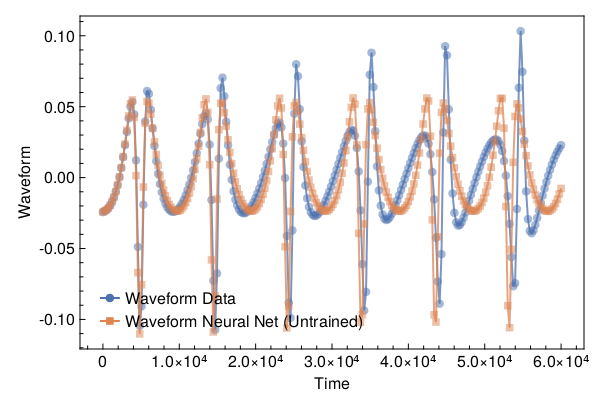
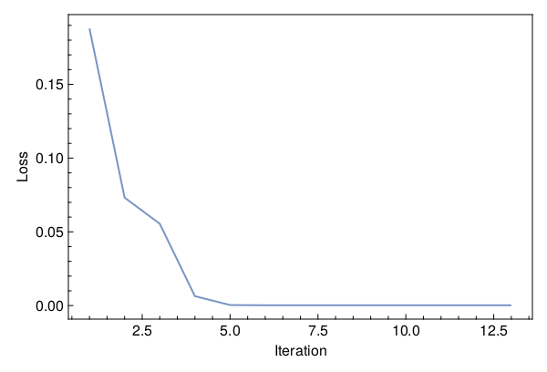
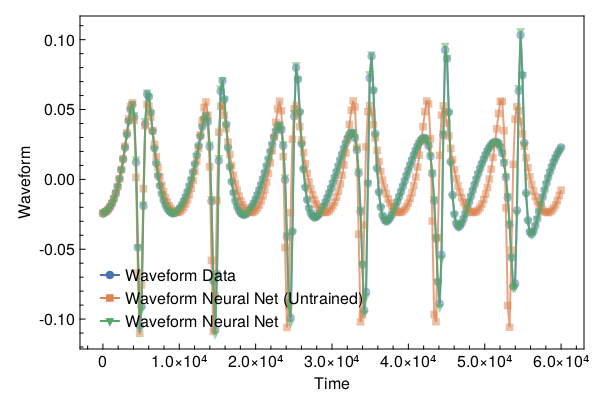

<a id='Training-a-Neural-ODE-to-Model-Gravitational-Waveforms'></a>

# Training a Neural ODE to Model Gravitational Waveforms


This code is adapted from [Astroinformatics/ScientificMachineLearning](https://github.com/Astroinformatics/ScientificMachineLearning/blob/c93aac3a460d70b4cce98836b677fd9b732e94b7/neuralode_gw.ipynb)


The code has been minimally adapted from [Keith et. al. 2021](https://arxiv.org/abs/2102.12695) which originally used Flux.jl


<a id='Package-Imports'></a>

## Package Imports


```julia
using Lux, ComponentArrays, LineSearches, LuxAMDGPU, LuxCUDA, OrdinaryDiffEq,
    Optimization, OptimizationOptimJL, Random, SciMLSensitivity
using CairoMakie, MakiePublication
CUDA.allowscalar(false)
```


<a id='Define-some-Utility-Functions'></a>

## Define some Utility Functions


::: tip


This section can be skipped. It defines functions to simulate the model, however, from a scientific machine learning perspective, isn't super relevant.


:::


We need a very crude 2-body path. Assume the 1-body motion is a newtonian 2-body position vector $r = r_1 - r_2$ and use Newtonian formulas to get $r_1$, $r_2$ (e.g. Theoretical Mechanics of Particles and Continua 4.3)


```julia
function one2two(path, m₁, m₂)
    M = m₁ + m₂
    r₁ = m₂ / M .* path
    r₂ = -m₁ / M .* path
    return r₁, r₂
end
```


```
one2two (generic function with 1 method)
```


Next we define a function to perform the change of variables: $(\chi(t),\phi(t)) \mapsto (x(t),y(t))$


```julia
@views function soln2orbit(soln, model_params=nothing)
    @assert size(soln, 1) ∈ [2, 4] "size(soln,1) must be either 2 or 4"

    if size(soln, 1) == 2
        χ = soln[1, :]
        ϕ = soln[2, :]

        @assert length(model_params)==3 "model_params must have length 3 when size(soln,2) = 2"
        p, M, e = model_params
    else
        χ = soln[1, :]
        ϕ = soln[2, :]
        p = soln[3, :]
        e = soln[4, :]
    end

    r = p ./ (1 .+ e .* cos.(χ))
    x = r .* cos.(ϕ)
    y = r .* sin.(ϕ)

    orbit = vcat(x', y')
    return orbit
end
```


```
soln2orbit (generic function with 2 methods)
```


This function uses second-order one-sided difference stencils at the endpoints; see https://doi.org/10.1090/S0025-5718-1988-0935077-0


```julia
function d_dt(v::AbstractVector, dt)
    a = -3 / 2 * v[1] + 2 * v[2] - 1 / 2 * v[3]
    b = (v[3:end] .- v[1:(end - 2)]) / 2
    c = 3 / 2 * v[end] - 2 * v[end - 1] + 1 / 2 * v[end - 2]
    return [a; b; c] / dt
end
```


```
d_dt (generic function with 1 method)
```


This function uses second-order one-sided difference stencils at the endpoints; see https://doi.org/10.1090/S0025-5718-1988-0935077-0


```julia
function d2_dt2(v::AbstractVector, dt)
    a = 2 * v[1] - 5 * v[2] + 4 * v[3] - v[4]
    b = v[1:(end - 2)] .- 2 * v[2:(end - 1)] .+ v[3:end]
    c = 2 * v[end] - 5 * v[end - 1] + 4 * v[end - 2] - v[end - 3]
    return [a; b; c] / (dt^2)
end
```


```
d2_dt2 (generic function with 1 method)
```


Now we define a function to compute the trace-free moment tensor from the orbit


```julia
function orbit2tensor(orbit, component, mass=1)
    x = orbit[1, :]
    y = orbit[2, :]

    Ixx = x .^ 2
    Iyy = y .^ 2
    Ixy = x .* y
    trace = Ixx .+ Iyy

    if component[1] == 1 && component[2] == 1
        tmp = Ixx .- trace ./ 3
    elseif component[1] == 2 && component[2] == 2
        tmp = Iyy .- trace ./ 3
    else
        tmp = Ixy
    end

    return mass .* tmp
end

function h_22_quadrupole_components(dt, orbit, component, mass=1)
    mtensor = orbit2tensor(orbit, component, mass)
    mtensor_ddot = d2_dt2(mtensor, dt)
    return 2 * mtensor_ddot
end

function h_22_quadrupole(dt, orbit, mass=1)
    h11 = h_22_quadrupole_components(dt, orbit, (1, 1), mass)
    h22 = h_22_quadrupole_components(dt, orbit, (2, 2), mass)
    h12 = h_22_quadrupole_components(dt, orbit, (1, 2), mass)
    return h11, h12, h22
end

function h_22_strain_one_body(dt::T, orbit) where {T}
    h11, h12, h22 = h_22_quadrupole(dt, orbit)

    h₊ = h11 - h22
    hₓ = T(2) * h12

    scaling_const = √(T(π) / 5)
    return scaling_const * h₊, -scaling_const * hₓ
end

function h_22_quadrupole_two_body(dt, orbit1, mass1, orbit2, mass2)
    h11_1, h12_1, h22_1 = h_22_quadrupole(dt, orbit1, mass1)
    h11_2, h12_2, h22_2 = h_22_quadrupole(dt, orbit2, mass2)
    h11 = h11_1 + h11_2
    h12 = h12_1 + h12_2
    h22 = h22_1 + h22_2
    return h11, h12, h22
end

function h_22_strain_two_body(dt::T, orbit1, mass1, orbit2, mass2) where {T}
    # compute (2,2) mode strain from orbits of BH 1 of mass1 and BH2 of mass 2

    @assert abs(mass1 + mass2 - 1.0)<1e-12 "Masses do not sum to unity"

    h11, h12, h22 = h_22_quadrupole_two_body(dt, orbit1, mass1, orbit2, mass2)

    h₊ = h11 - h22
    hₓ = T(2) * h12

    scaling_const = √(T(π) / 5)
    return scaling_const * h₊, -scaling_const * hₓ
end

function compute_waveform(dt::T, soln, mass_ratio, model_params=nothing) where {T}
    @assert mass_ratio≤1 "mass_ratio must be <= 1"
    @assert mass_ratio≥0 "mass_ratio must be non-negative"

    orbit = soln2orbit(soln, model_params)
    if mass_ratio > 0
        m₂ = inv(T(1) + mass_ratio)
        m₁ = mass_ratio * m₂

        orbit₁, orbit₂ = one2two(orbit, m₁, m₂)
        waveform = h_22_strain_two_body(dt, orbit1, mass1, orbit2, mass2)
    else
        waveform = h_22_strain_one_body(dt, orbit)
    end
    return waveform
end
```


```
compute_waveform (generic function with 2 methods)
```


<a id='Simulating-the-True-Model'></a>

## Simulating the True Model


`RelativisticOrbitModel` defines system of odes which describes motion of point like particle in schwarzschild background, uses


$$
u[1] = \chi
$$


$$
u[2] = \phi
$$


where, $p$, $M$, and $e$ are constants


```julia
function RelativisticOrbitModel(u, (p, M, e), t)
    χ, ϕ = u

    numer = (p - 2 - 2 * e * cos(χ)) * (1 + e * cos(χ))^2
    denom = sqrt((p - 2)^2 - 4 * e^2)

    χ̇ = numer * sqrt(p - 6 - 2 * e * cos(χ)) / (M * (p^2) * denom)
    ϕ̇ = numer / (M * (p^(3 / 2)) * denom)

    return [χ̇, ϕ̇]
end

mass_ratio = 0.0         # test particle
u0 = Float64[π, 0.0]     # initial conditions
datasize = 250
tspan = (0.0f0, 6.0f4)   # timespace for GW waveform
tsteps = range(tspan[1], tspan[2]; length=datasize)  # time at each timestep
dt_data = tsteps[2] - tsteps[1]
dt = 100.0
const ode_model_params = [100.0, 1.0, 0.5]; # p, M, e
```


Let's simulate the true model and plot the results using `OrdinaryDiffEq.jl`


```julia
prob = ODEProblem(RelativisticOrbitModel, u0, tspan, ode_model_params)
soln = Array(solve(prob, RK4(); saveat=tsteps, dt, adaptive=false))
waveform = first(compute_waveform(dt_data, soln, mass_ratio, ode_model_params))

fig = with_theme(theme_web()) do
    fig = Figure()
    ax = CairoMakie.Axis(fig[1, 1]; xlabel="Time", ylabel="Waveform")

    l = lines!(ax, tsteps, waveform; linewidth=2, alpha=0.75)
    s = scatter!(ax, tsteps, waveform; markershape=:circle, markeralpha=0.25, alpha=0.5)

    axislegend(ax, [[l, s]], ["Waveform Data"])

    return fig
end
```


<a id='Defiing-a-Neural-Network-Model'></a>

## Defiing a Neural Network Model


Next, we define the neural network model that takes 1 input (time) and has two outputs. We'll make a function `ODE_model` that takes the initial conditions, neural network parameters and a time as inputs and returns the derivatives.


It is typically never recommended to use globals but incase you do use them, make sure to mark them as `const`.


We will deviate from the standard Neural Network initialization and use `WeightInitializers.jl`,


```julia
const nn = Chain(Base.Fix1(broadcast, cos),
    Dense(1 => 32, cos; init_weight=truncated_normal(; std=1e-4)),
    Dense(32 => 32, cos; init_weight=truncated_normal(; std=1e-4)),
    Dense(32 => 2; init_weight=truncated_normal(; std=1e-4)))
ps, st = Lux.setup(MersenneTwister(), nn)
```


```
((layer_1 = NamedTuple(), layer_2 = (weight = Float32[0.00020052603; -2.1190828f-5; 1.167341f-6; 0.000118598284; 9.780043f-6; 0.00016019211; 8.6215405f-5; 3.2050008f-5; -1.0748058f-5; 4.2571504f-5; -0.0001222176; -0.00017853727; -0.00010187238; 0.000105879924; -2.9979255f-5; 4.3153977f-5; 1.89699f-5; 8.303953f-5; 8.016854f-5; 6.610125f-5; -2.473721f-5; 0.00016717531; -0.00016005912; -9.651122f-5; 7.725699f-6; -3.56282f-5; -2.2208851f-5; 4.661383f-6; 4.031425f-5; -2.204628f-5; 0.00016454462; 2.8807828f-5;;], bias = Float32[0.0; 0.0; 0.0; 0.0; 0.0; 0.0; 0.0; 0.0; 0.0; 0.0; 0.0; 0.0; 0.0; 0.0; 0.0; 0.0; 0.0; 0.0; 0.0; 0.0; 0.0; 0.0; 0.0; 0.0; 0.0; 0.0; 0.0; 0.0; 0.0; 0.0; 0.0; 0.0;;]), layer_3 = (weight = Float32[8.2612634f-5 -3.1472468f-5 -0.00017365596 0.00017481495 2.5501713f-5 1.2088349f-5 4.0074232f-5 0.000123053 -9.0806265f-5 9.363858f-5 7.1958384f-5 -4.7763733f-5 1.103386f-5 1.5853939f-5 -2.3353254f-5 -5.7752542f-5 -7.017217f-5 4.827142f-5 7.704904f-5 -8.924005f-5 -5.924664f-5 1.2186843f-5 -0.00014536004 -0.00013987726 3.634889f-5 -8.853976f-5 2.9431807f-5 -8.343293f-5 -3.6630587f-5 4.285997f-5 3.0614992f-5 -0.000104966406; -1.2200089f-5 -0.00014957039 6.5101056f-5 0.00014782455 4.9233535f-5 0.00019938707 3.4128607f-5 -3.6103602f-6 7.722757f-5 -8.068708f-5 0.00016888358 -0.0001245753 -9.002537f-5 1.8628716f-5 8.89607f-6 -0.00010599137 7.513823f-5 0.0001442534 5.8524394f-5 5.905323f-6 4.6331592f-5 -0.0001721038 2.1470105f-5 -1.9455472f-6 5.7918092f-5 1.077129f-5 -7.910108f-5 3.8361166f-5 0.0001268756 9.580057f-5 -6.712626f-5 -2.6784659f-5; -0.00014946258 0.0001620039 0.00014126499 -8.451323f-5 -9.617827f-5 7.0013853f-6 0.00016357201 -9.350765f-5 -0.00014842134 1.6352095f-6 -0.00024316288 8.063963f-5 -4.3540982f-5 6.022972f-5 1.2236697f-5 -8.9549416f-5 3.183707f-6 -9.8192446f-5 -9.781343f-5 -9.448444f-6 -0.00018000639 0.00019122301 -0.00012484277 0.00024696247 -0.00016869172 -8.2269034f-5 2.4094932f-5 6.2154555f-5 8.476714f-5 0.00011005027 -6.195853f-6 -0.00013688025; 0.00013257372 3.933664f-5 -6.926344f-5 -5.3355405f-5 6.241641f-5 -9.555136f-5 -1.5301766f-5 0.00013941956 -0.0003830216 0.000102503385 -4.680247f-5 1.7330434f-5 3.0821364f-5 7.649845f-6 1.7035001f-5 9.323803f-5 3.0303056f-5 -0.00010828379 2.4606777f-6 -0.00019754672 -3.3526103f-5 -0.00010981722 1.8486442f-5 4.9317678f-5 -1.9971624f-6 -1.2846814f-5 -9.010344f-6 0.00012587204 0.00013318355 -5.3148495f-5 -0.00018835817 2.2410242f-5; -0.00012723448 -0.0002031591 4.7297577f-5 0.00015097282 -0.00015586254 -7.0947426f-5 -9.1514135f-5 -8.3032755f-6 9.2315895f-5 -2.9758483f-5 -8.021292f-5 0.00015551384 -2.1376058f-5 4.9721813f-5 -7.471133f-5 4.827595f-5 -6.286959f-5 0.0001160548 3.6384372f-6 -0.000121796686 0.00021486702 0.00025399541 0.00011710188 0.000109264714 6.651341f-5 8.029127f-5 8.116516f-6 -1.0755783f-5 -2.2815993f-5 3.8211558f-5 -1.8479299f-5 -2.2432672f-5; 7.489565f-5 3.5373825f-5 8.153172f-5 -3.4655557f-5 -0.00014992745 0.00015519901 0.00026320847 -9.8295815f-5 -6.2315407f-6 2.1467324f-5 2.4561417f-5 -7.3263494f-5 -0.00012575896 -7.011703f-5 -0.0001327311 -1.7419286f-5 3.5079094f-5 3.0865296f-5 2.1476435f-5 -7.045198f-5 3.6199825f-5 3.476165f-5 -7.200987f-6 7.502268f-5 -5.867035f-5 1.5454643f-5 -1.2452164f-5 8.196135f-5 3.085113f-5 -5.4849184f-5 -0.0001891156 -0.00011260644; -0.00012021301 4.8842692f-5 -0.000116426985 -6.538689f-6 7.719311f-5 -0.00013790686 -9.296324f-5 5.1186827f-5 -3.116146f-5 0.00012713237 -6.3712665f-5 6.264811f-5 -0.00010828079 7.094124f-5 0.00010615044 7.083379f-5 9.016375f-5 4.207413f-5 -0.00023879221 -8.90089f-5 6.7893125f-5 8.039063f-7 -0.00010932954 3.904392f-5 -0.0001442194 9.861943f-5 -0.00012465545 -3.7817277f-5 -0.0001193676 9.453723f-5 -7.409217f-5 -0.00012336015; -1.1696111f-5 -0.0001458981 -5.9782666f-5 -5.5494987f-5 -4.288087f-5 3.6707604f-6 -5.4988443f-5 8.813445f-5 3.3749907f-6 -2.911679f-5 0.000104025625 4.253217f-6 -0.00017301145 4.714064f-5 -2.2361035f-5 -5.572965f-5 -5.8110687f-5 0.00019108817 3.519612f-5 7.13386f-5 0.00010956919 -0.0001412966 -4.084094f-5 -0.00018187477 -9.5724565f-5 0.00013941016 -0.00012259951 -8.083599f-6 9.0381116f-5 -1.161437f-5 4.9673024f-5 2.2597038f-5; 5.0384086f-5 6.698577f-5 -9.140441f-5 -6.857454f-5 4.3237724f-5 6.960226f-5 6.143746f-5 0.00010425957 1.1875716f-5 0.00015877555 -6.887333f-5 6.7037574f-5 -1.8127002f-5 -1.7453145f-5 -7.779192f-5 -9.4802584f-5 8.69985f-5 8.568451f-5 4.5151755f-5 -0.00014671248 2.3729155f-5 -9.9481185f-5 -0.00011001688 2.1713051f-5 4.7732323f-5 1.4891447f-5 3.4524062f-5 -1.5538233f-5 4.630671f-5 2.3100023f-5 1.08280965f-5 -6.60859f-5; 7.361489f-5 -0.00012306625 -4.3452328f-5 -7.8387195f-5 -0.00012491798 0.00015670323 6.609713f-5 -0.00013393584 9.8483935f-5 0.00012896385 7.603346f-5 -4.4646746f-5 -8.890788f-5 -0.00012889558 -5.158408f-5 2.7953252f-5 -2.7058093f-5 -4.1480176f-5 1.066394f-5 -0.00015688107 2.8042068f-5 7.17723f-6 8.143056f-5 -4.8488586f-5 -2.0920359f-5 -0.00023444787 -4.1785283f-5 -8.0438025f-5 -3.1301675f-5 -0.00014515854 -0.0001373557 -0.0002522023; 8.5627f-6 -0.00015312461 9.407083f-7 -0.00014088597 -0.00013597714 0.00016593706 -5.8574973f-5 -8.706728f-5 -0.00014727822 -0.0001102837 6.2221414f-5 -9.349947f-5 9.3394454f-5 -0.00016733396 -8.238809f-5 -0.00023163216 -0.00013408597 2.346111f-5 8.8322755f-5 5.610621f-5 0.00018028177 -3.1259774f-6 -4.0182686f-6 -2.9476494f-5 -7.756715f-5 1.6189937f-5 0.00011053237 -6.0009334f-5 0.00013288268 -1.0011228f-5 -6.080185f-5 -5.0883045f-5; 0.00013798957 0.00012053738 -2.5116533f-5 5.644751f-5 -9.863556f-5 -3.476867f-5 0.0002009725 1.5513826f-5 -7.67715f-5 7.779358f-5 -3.2071934f-5 -6.278125f-5 4.6425957f-5 -2.1120546f-5 1.2285711f-5 8.299267f-5 -0.00012412386 0.00011498625 -0.00015826299 3.4383942f-5 -8.747761f-5 3.7121671f-7 -9.783405f-6 3.902054f-5 -0.00014377094 6.4729866f-5 -0.00022971032 0.00022686608 -0.0001402434 -0.0001715384 -0.00015445845 5.3416705f-5; 7.62094f-5 8.29127f-7 9.263259f-5 0.00014130195 -4.154636f-5 6.174193f-5 1.4930546f-5 -6.952142f-5 7.125226f-5 4.3019416f-5 -0.00013550543 -7.894056f-6 0.00010334634 -1.8964729f-5 0.00026309697 -8.577793f-5 -0.00019693036 -0.00013644977 -1.0722525f-6 9.22787f-5 -8.90566f-5 -7.458033f-5 -0.0002090181 4.178949f-5 2.8627064f-5 -9.4862935f-6 6.6908783f-6 0.00015246429 4.4052736f-5 -3.6317706f-5 -8.9552545f-5 -9.5220144f-5; -9.548669f-6 6.206621f-5 -7.711041f-5 -0.00012047252 8.3055646f-5 9.877777f-6 -0.00015980114 3.708636f-5 1.533717f-5 -0.00019489693 -3.5680136f-5 -0.00015810897 1.2355564f-5 -0.0001035412 -1.5760294f-5 0.00013318028 0.00024585825 7.5725284f-6 -3.7166585f-5 -7.155193f-5 -0.00012848167 0.00018080967 5.4207045f-5 -0.00014981841 -0.00013229743 -9.3354436f-5 6.7558445f-5 1.9302874f-5 0.0001427998 0.00012804865 7.281914f-5 0.00011148293; -7.5558664f-6 5.9354155f-5 2.6243608f-6 2.1123113f-5 8.451772f-5 1.1298701f-5 3.4221266f-5 3.0130814f-5 4.1241976f-5 1.3377688f-5 0.00017096875 -8.592376f-5 -5.097435f-5 -2.7893063f-6 9.112089f-6 -3.6907586f-5 -4.4636545f-5 3.0247593f-5 -0.0002314686 -0.00017082371 -0.00022933529 -7.7183366f-5 -7.8830446f-5 5.5649605f-5 0.00012795962 -8.2760984f-5 5.62472f-6 -6.3375664f-5 0.00017504182 -0.00015353711 -0.00015104953 3.1076466f-5; 5.7404122f-5 8.257536f-5 -0.0001935584 -3.8494098f-5 -7.4364056f-5 -6.393029f-5 9.37479f-6 8.3462735f-5 8.009913f-6 -2.1212098f-5 3.1340904f-5 -0.00019398065 -0.00010538379 -6.355698f-5 0.00013106763 -8.0045145f-5 9.4932446f-5 2.423526f-5 -2.9498933f-5 -9.226293f-7 -1.2845428f-5 -2.9849074f-5 5.55871f-5 -0.00020835835 6.734855f-5 -0.00018328096 -6.643779f-5 0.00010875853 -7.363922f-5 -6.164369f-5 -2.5586149f-5 -2.6976553f-5; -5.6386685f-5 -3.9334577f-6 0.00011713184 -0.00012944773 -3.7874062f-5 -0.00018711254 4.7602567f-5 -1.782566f-5 -8.5402746f-5 0.00017391772 2.200893f-5 -0.00012296863 5.58032f-5 4.21075f-5 -6.396592f-5 -0.00011343988 -0.00012434807 -8.3690225f-5 -0.000108655106 -0.00012658164 9.0856505f-5 -3.80576f-5 9.325146f-5 -6.5562395f-5 1.65791f-5 8.2166094f-5 -9.681539f-5 0.000276209 0.00011962584 7.952196f-5 0.0001292614 6.857885f-5; -9.343527f-5 4.2703352f-5 1.5332604f-5 -0.000118009426 5.169549f-5 7.4891854f-5 1.4047412f-5 -0.00014761281 -2.2703513f-5 5.5751884f-6 3.6611f-5 -5.0193652f-5 0.00017121567 6.00964f-5 -0.00013549907 6.307318f-5 3.608209f-5 -0.00011977699 -8.5998305f-5 -0.00025844492 1.3184212f-5 -4.9373535f-5 0.00010739305 -1.5511194f-5 -1.963009f-5 9.007768f-5 4.223634f-5 6.4346525f-5 0.00012846735 3.0449379f-5 -5.205946f-5 -0.00024190276; 7.383471f-5 8.4924235f-5 2.1812095f-5 5.992156f-5 -0.00016398789 5.6363777f-5 6.6711415f-5 0.00012223344 2.2458718f-5 -9.841295f-6 3.6921407f-5 -0.0001297606 -9.072006f-5 8.394342f-6 -0.00010200788 -0.0001061115 -6.6658155f-5 -0.0001041081 3.406223f-5 5.5090033f-5 -0.00012758623 -2.9881317f-5 -1.8573017f-5 -0.00012214821 6.993424f-5 -8.1322294f-5 9.692761f-5 5.5536402f-5 6.054656f-5 1.7159603f-6 4.13852f-5 3.4417517f-5; 0.00013287234 -2.7116215f-5 -0.00011832542 0.00014879537 6.9166774f-5 -0.0001285486 -3.4417895f-5 -1.1407448f-6 6.0402195f-5 0.00019634642 -4.143374f-5 -0.00012215746 1.455482f-5 9.243745f-5 -0.00011972074 3.422146f-5 -8.5411135f-5 0.0001207092 3.7248243f-5 3.6766212f-6 9.4241885f-5 -4.0408842f-5 8.563839f-6 3.819092f-5 -0.00011572186 6.538197f-5 0.00023713881 -9.134725f-5 6.8615715f-5 4.3931897f-5 5.4663255f-5 -0.00028899848; 3.779933f-6 -5.48396f-5 3.485502f-5 -4.1910396f-5 -4.5619418f-5 -8.3264786f-5 1.5554988f-5 -0.00012296869 3.0113053f-5 -3.7443748f-5 8.2958395f-6 -1.0233456f-5 -7.188721f-5 -0.00017686405 -4.844396f-5 0.00014439995 5.6699128f-6 0.00023311745 -9.8841505f-5 -3.4766952f-5 7.318907f-5 0.0001295747 1.0911208f-5 0.00010761069 8.99833f-5 0.00011038239 -0.0001580204 -0.00030259418 -0.00014195553 0.00019770912 6.8652175f-6 2.7787679f-5; -7.143306f-5 4.556667f-5 -0.00015326179 -9.4296214f-5 -8.3593186f-5 -7.666021f-5 0.00017913751 4.4978013f-5 3.481565f-5 -8.3702485f-5 -5.4432323f-5 -5.028464f-5 -6.15298f-5 -5.3692376f-5 4.8698916f-5 4.3878263f-5 7.954479f-5 2.574309f-5 9.3050774f-5 -0.00010498175 -7.038914f-5 1.30293265f-5 0.00013017692 0.00011883097 1.1142216f-5 0.00016068477 -6.654174f-5 -6.21273f-5 -1.4793318f-5 0.00010222395 0.000106091094 -7.681705f-5; 2.9809304f-5 4.9654875f-5 1.1416172f-5 -0.00011634981 3.6608955f-5 -2.9096997f-5 4.411392f-5 7.01127f-6 0.00018953891 0.00013858508 0.00015248885 7.937918f-5 -0.00024146758 -8.780696f-5 4.4556145f-5 5.8825386f-5 -0.00010440396 -0.00012636954 8.8947374f-5 -9.939846f-6 5.0136383f-5 -3.8887887f-5 0.0002787335 -4.353024f-5 7.965604f-5 0.00014352503 -5.737245f-5 3.13097f-6 0.00012080559 -5.254024f-5 7.8131576f-5 8.489256f-5; 0.00015958778 3.013788f-5 -2.2190201f-5 -2.6212318f-5 -0.00012473822 3.8500213f-5 7.896645f-5 0.000119961536 -6.885727f-5 -3.1114182f-6 9.0496666f-5 -0.000160083 0.00012387596 0.000118155534 0.00021215368 -0.00018311647 6.794713f-6 -7.169138f-5 7.421116f-5 -6.857156f-5 -0.0001106655 0.0001207572 -1.5180149f-5 0.00015695169 -2.228359f-5 -0.000110611 -2.1669854f-5 -8.430505f-5 -2.9139426f-5 -7.160212f-5 -3.0692952f-6 8.454527f-5; 0.00016930021 5.3990923f-5 0.00012239815 -3.985007f-5 9.102547f-6 -5.3029908f-5 4.6420268f-5 0.0001344528 -1.7987593f-5 -0.00013367122 -4.0861825f-5 -0.00024001539 1.8852325f-5 2.6705284f-5 -0.00017414514 -0.00011326048 -0.00011907633 -0.00016599984 3.935737f-5 -7.3178917f-6 7.696911f-7 7.552592f-5 -8.090177f-5 -7.900118f-5 -0.00014812194 4.5461744f-5 0.00015305179 0.00019606257 4.9660383f-5 0.00010183674 0.00012851885 1.32489595f-5; -9.940064f-5 -0.00011107196 -7.572825f-5 -1.4894287f-5 8.551145f-5 0.00013093745 -9.571431f-5 4.2856795f-5 0.00020396287 0.00016719053 6.521381f-6 -2.4743125f-5 -0.00014276445 -6.0603244f-5 -0.00016290194 6.9417394f-5 -0.000102065256 1.125666f-5 2.4042334f-5 9.8792036f-5 2.728201f-5 -4.7607653f-5 -0.00018616489 0.00013299771 -2.9165927f-5 -5.3092685f-5 1.819748f-5 -5.7765043f-5 -7.808682f-5 1.9630852f-5 8.328444f-5 -7.366273f-5; -1.5985399f-5 -0.00019190942 -8.053242f-5 1.8019602f-5 3.355607f-5 0.00014682443 3.4553148f-5 0.000212963 0.00010650932 -4.253035f-5 7.626294f-5 8.189276f-5 -2.2108374f-5 -4.04425f-5 -0.0001020208 -4.2336364f-5 1.8792385f-7 9.1872775f-5 -4.1891244f-6 -8.5414664f-5 0.00010817248 5.316364f-5 3.0512078f-5 -1.34959455f-5 -5.4968597f-5 -1.0145118f-5 -6.940283f-5 -8.762188f-6 6.397175f-5 0.000111940564 0.00012087647 2.6054753f-5; 8.1478276f-5 -3.959993f-5 4.3435055f-5 1.846325f-5 5.6278923f-6 -6.356196f-5 8.8698536f-5 -0.00012982312 -7.6826196f-5 -3.4600762f-5 0.00019228365 2.5542895f-5 -2.782172f-5 4.1117535f-5 2.0748588f-5 -0.00014968023 -0.000112562564 2.6933512f-5 0.000105057115 -0.00014758324 -0.00032109467 1.6014123f-5 -6.045445f-5 0.00013222534 -9.70033f-6 -6.124987f-5 -0.00010656814 0.00015509875 -5.0884577f-5 7.225915f-5 -3.0578856f-5 -8.014913f-5; -0.00012379208 -0.000107424916 1.4535885f-5 -0.000146575 0.00016366305 0.00021498167 -6.092534f-5 -0.00010939807 -0.0001961867 3.5890553f-5 8.496268f-5 -8.834253f-5 -4.7494f-5 4.8299655f-5 8.95517f-6 0.00011525644 -3.3746594f-5 0.00020600112 -0.00014693172 8.200191f-5 -3.598085f-5 -5.6873432f-5 3.0376023f-5 -0.00011240202 -0.00016187882 -3.8222934f-5 4.8164325f-6 -1.1891726f-5 6.6757f-5 9.206996f-5 -7.962198f-5 4.299716f-5; -3.2565717f-5 6.4812426f-5 -0.00010625889 -0.00014669233 -3.109955f-5 -4.691699f-5 1.3709382f-5 6.709422f-5 2.8577382f-5 -6.919162f-6 8.386004f-5 -9.282445f-5 -0.00022208625 5.953768f-5 9.787129f-5 -0.00014898113 -8.744165f-5 -0.00012664979 1.0577635f-5 -3.5284927f-5 -0.00014065337 0.00015746526 5.274178f-5 -5.1192994f-5 -0.00014000366 -6.152315f-5 -4.9778628f-5 -0.00016791285 8.349402f-5 -0.00016877969 -0.0001239683 1.1120959f-5; 5.3027088f-5 0.00011638215 0.00017023753 1.4678771f-5 -3.856722f-5 3.6400706f-5 -8.288427f-5 0.00013990357 4.1417006f-5 0.00015490831 -0.000118107564 7.24206f-5 5.3389344f-5 0.00015710066 -1.7314933f-5 0.00011532352 0.00014290815 -9.6370684f-5 -9.873403f-5 -0.00013089507 -2.0346715f-5 -3.7636575f-5 9.1000315f-5 -4.963858f-5 0.00014985872 3.4839526f-5 -1.9861476f-5 2.3310452f-6 -7.6564036f-5 3.4162786f-5 -1.896762f-5 0.00013714195; -5.6188597f-5 -9.7196964f-5 -8.299626f-5 -2.6367472f-5 8.970284f-5 -8.081298f-5 9.88066f-6 3.411008f-5 0.000106161046 -0.0002550898 -4.2409454f-5 9.0381254f-5 -1.3952389f-5 -0.00012575818 0.000100248544 -0.00012642116 0.00010397189 4.1201736f-5 8.003596f-5 -0.0001335873 2.1942411f-5 -0.0001400458 -0.00017718937 4.9689254f-5 9.629949f-5 9.185496f-5 0.00014217259 0.00011677083 0.00026553893 -0.00020914279 -0.00011614426 0.00017643464], bias = Float32[0.0; 0.0; 0.0; 0.0; 0.0; 0.0; 0.0; 0.0; 0.0; 0.0; 0.0; 0.0; 0.0; 0.0; 0.0; 0.0; 0.0; 0.0; 0.0; 0.0; 0.0; 0.0; 0.0; 0.0; 0.0; 0.0; 0.0; 0.0; 0.0; 0.0; 0.0; 0.0;;]), layer_4 = (weight = Float32[-6.2163913f-6 3.211239f-5 -8.2261446f-5 9.111651f-5 0.000103484424 -0.00026638276 0.0001438412 0.00010757359 5.3937383f-5 0.00011516365 3.629846f-5 1.7167384f-5 0.00014910052 -4.054496f-5 -0.00012534001 -5.037995f-5 0.00015864184 -6.432017f-5 0.00015693346 -0.00015324236 0.00011931893 2.0350346f-5 -5.033602f-5 -1.6245132f-5 8.9292385f-5 -0.00014617332 0.0001733555 0.00028565334 2.4458077f-5 0.00013302667 -9.068597f-5 0.00017350916; -4.5690023f-5 2.0329662f-5 -0.000121511664 0.0001575478 -1.9835115f-5 -3.1642034f-5 -0.00012707668 -3.5564655f-5 1.9003368f-5 -0.00026030565 -0.0001299601 -2.3854385f-5 -0.00011470669 5.485929f-5 -6.848471f-5 -5.321269f-6 -8.588673f-5 7.894555f-5 -0.00011873392 0.00010467397 5.449013f-5 8.357204f-5 -0.0001831905 0.00020478685 9.625817f-5 1.7735772f-5 -0.00026864774 -2.287424f-5 0.00013722978 3.7256603f-5 7.659675f-6 -7.4815376f-5], bias = Float32[0.0; 0.0;;])), (layer_1 = NamedTuple(), layer_2 = NamedTuple(), layer_3 = NamedTuple(), layer_4 = NamedTuple()))
```


Similar to most DL frameworks, Lux defaults to using `Float32`, however, in this case we need Float64


```julia
const params = ComponentArray{Float64}(ps)
```


```
ComponentVector{Float64}(layer_1 = Float64[], layer_2 = (weight = [0.00020052603213116527; -2.119082819262985e-5; 1.1673409971990623e-6; 0.00011859828373417258; 9.780043001228478e-6; 0.00016019211034290493; 8.621540473541245e-5; 3.205000757589005e-5; -1.0748058230092283e-5; 4.2571504309307784e-5; -0.00012221760698594153; -0.00017853727331385016; -0.00010187237785430625; 0.00010587992437649518; -2.9979255486978218e-5; 4.315397745813243e-5; 1.8969900338561274e-5; 8.303952927235514e-5; 8.016853826120496e-5; 6.610125274164602e-5; -2.473720996931661e-5; 0.00016717531252652407; -0.00016005912038963288; -9.651121945353225e-5; 7.725699106231332e-6; -3.562819983926602e-5; -2.220885107817594e-5; 4.661383172788192e-6; 4.0314251236850396e-5; -2.2046280719223432e-5; 0.0001645446172915399; 2.880782813008409e-5;;], bias = [0.0; 0.0; 0.0; 0.0; 0.0; 0.0; 0.0; 0.0; 0.0; 0.0; 0.0; 0.0; 0.0; 0.0; 0.0; 0.0; 0.0; 0.0; 0.0; 0.0; 0.0; 0.0; 0.0; 0.0; 0.0; 0.0; 0.0; 0.0; 0.0; 0.0; 0.0; 0.0;;]), layer_3 = (weight = [8.261263428721577e-5 -3.147246752632782e-5 -0.00017365596431773156 0.00017481495160609484 2.5501713025732897e-5 1.2088348739780486e-5 4.007423194707371e-5 0.0001230530033353716 -9.080626477953047e-5 9.363857680000365e-5 7.195838406914845e-5 -4.776373316417448e-5 1.1033859664166812e-5 1.5853938748477958e-5 -2.3353253709501587e-5 -5.775254248874262e-5 -7.017217285465449e-5 4.8271420382661745e-5 7.704903691774234e-5 -8.924004941945896e-5 -5.9246638556942344e-5 1.2186843378003687e-5 -0.00014536004164256155 -0.00013987725833430886 3.63488907169085e-5 -8.853976032696664e-5 2.9431806979118846e-5 -8.343293302459642e-5 -3.6630586691899225e-5 4.285997056285851e-5 3.0614992283517495e-5 -0.00010496640607016161; -1.2200089258840308e-5 -0.00014957039093133062 6.510105595225468e-5 0.00014782455400563776 4.923353480990045e-5 0.00019938706827815622 3.412860678508878e-5 -3.6103601814829744e-6 7.722756708972156e-5 -8.068708120845258e-5 0.00016888357640709728 -0.0001245752937393263 -9.002537262858823e-5 1.8628716134116985e-5 8.896069630282e-6 -0.00010599137021927163 7.51382322050631e-5 0.0001442533975932747 5.852439426234923e-5 5.9053231780126225e-6 4.633159187505953e-5 -0.00017210379883181304 2.147010491171386e-5 -1.9455471829132875e-6 5.7918092352338135e-5 1.0771290362754371e-5 -7.910108251962811e-5 3.836116593447514e-5 0.00012687560229096562 9.580056939739734e-5 -6.712626054650173e-5 -2.6784658984979615e-5; -0.00014946257579140365 0.00016200389654841274 0.00014126498717814684 -8.451323083136231e-5 -9.617827163310722e-5 7.001385256444337e-6 0.00016357201093342155 -9.350765321869403e-5 -0.00014842134260106832 1.6352095144611667e-6 -0.00024316288181580603 8.063962741289288e-5 -4.354098200565204e-5 6.0229718656046316e-5 1.223669733008137e-5 -8.954941586125642e-5 3.1837068945606006e-6 -9.819244587561116e-5 -9.781342669157311e-5 -9.448443961446173e-6 -0.0001800063910195604 0.00019122300727758557 -0.0001248427724931389 0.000246962474193424 -0.0001686917239567265 -8.226903446484357e-5 2.409493208688218e-5 6.21545550529845e-5 8.476713992422447e-5 0.00011005027045030147 -6.1958530750416685e-6 -0.00013688024773728102; 0.00013257372484076768 3.933663901989348e-5 -6.926344212843105e-5 -5.3355404816102237e-5 6.241640949156135e-5 -9.555136057315394e-5 -1.5301766325137578e-5 0.00013941955694463104 -0.00038302160101011395 0.00010250338527839631 -4.680247002397664e-5 1.7330434275208972e-5 3.0821363907307386e-5 7.649845429114066e-6 1.703500129224267e-5 9.323802805738524e-5 3.030305560969282e-5 -0.00010828379163285717 2.46067770603986e-6 -0.00019754671666305512 -3.3526102924952284e-5 -0.00010981722152791917 1.8486442058929242e-5 4.931767762172967e-5 -1.997162371480954e-6 -1.2846813660871703e-5 -9.010344001580961e-6 0.00012587204400915653 0.00013318355195224285 -5.3148494771448895e-5 -0.00018835817172657698 2.2410242308978923e-5; -0.0001272344816243276 -0.00020315909932833165 4.729757711174898e-5 0.00015097281720954925 -0.00015586253721266985 -7.094742613844573e-5 -9.151413541985676e-5 -8.303275535581633e-6 9.231589501723647e-5 -2.9758482924080454e-5 -8.021292160265148e-5 0.00015551384421996772 -2.137605770258233e-5 4.9721813411451876e-5 -7.471132994396612e-5 4.8275949666276574e-5 -6.286959251156077e-5 0.00011605479812715203 3.6384371924214065e-6 -0.0001217966855620034 0.00021486701734829694 0.0002539954148232937 0.00011710188118740916 0.00010926471441052854 6.651340663665906e-5 8.0291269114241e-5 8.116516255540773e-6 -1.075578256859444e-5 -2.2815993361291476e-5 3.82115576940123e-5 -1.8479298887541518e-5 -2.2432672267314047e-5; 7.489565177820623e-5 3.537382508511655e-5 8.153171802405268e-5 -3.465555710135959e-5 -0.00014992745127528906 0.000155199013534002 0.0002632084651850164 -9.829581540543586e-5 -6.231540737644536e-6 2.146732367691584e-5 2.4561417376389727e-5 -7.326349441427737e-5 -0.00012575896107591689 -7.01170283718966e-5 -0.00013273110380396247 -1.7419286450603977e-5 3.5079094232060015e-5 3.0865296139381826e-5 2.14764349948382e-5 -7.045197708066553e-5 3.619982453528792e-5 3.4761651477310807e-5 -7.200987056421582e-6 7.502268272219226e-5 -5.867034997208975e-5 1.545464328955859e-5 -1.245216390088899e-5 8.196134876925498e-5 3.085112984990701e-5 -5.4849184380145743e-5 -0.00018911559891421348 -0.00011260643805144355; -0.00012021300790365785 4.884269219473936e-5 -0.00011642698518699035 -6.538688921864377e-6 7.719310815446079e-5 -0.00013790685625281185 -9.296323696617037e-5 5.118682747706771e-5 -3.1161460356088355e-5 0.00012713237083517015 -6.371266499627382e-5 6.264811236178502e-5 -0.00010828078666236252 7.094124157447368e-5 0.00010615043720463291 7.083379023242742e-5 9.016374679049477e-5 4.2074130760738626e-5 -0.00023879221407696605 -8.900889952201396e-5 6.789312465116382e-5 8.039062890929927e-7 -0.00010932954319287091 3.904391996911727e-5 -0.00014421940431930125 9.86194281722419e-5 -0.00012465544568840414 -3.7817277188878506e-5 -0.00011936759983655065 9.453723032493144e-5 -7.409216777887195e-5 -0.00012336015061009675; -1.1696110959746875e-5 -0.00014589809870813042 -5.978266563033685e-5 -5.549498746404424e-5 -4.288087075110525e-5 3.670760406748741e-6 -5.498844257090241e-5 8.813445310806856e-5 3.3749906833691057e-6 -2.9116790756233968e-5 0.0001040256247506477 4.253216957295081e-6 -0.00017301144544035196 4.714063834398985e-5 -2.23610350076342e-5 -5.572965164901689e-5 -5.811068695038557e-5 0.00019108816923107952 3.519612073432654e-5 7.133860344765708e-5 0.00010956919140880927 -0.00014129659393802285 -4.08409396186471e-5 -0.00018187476962339133 -9.572456474415958e-5 0.00013941015640739352 -0.0001225995074491948 -8.083598913799506e-6 9.03811160242185e-5 -1.1614370123425033e-5 4.967302447766997e-5 2.2597037968807854e-5; 5.038408562541008e-5 6.698576908092946e-5 -9.140440670307726e-5 -6.857453990960494e-5 4.323772373027168e-5 6.960226164665073e-5 6.143745849840343e-5 0.00010425956861581653 1.187571615446359e-5 0.00015877555415499955 -6.887332710903138e-5 6.703757389914244e-5 -1.8127002476830967e-5 -1.745314511936158e-5 -7.779191946610808e-5 -9.480258449912071e-5 8.699850150151178e-5 8.568450721213594e-5 4.515175533015281e-5 -0.00014671248209197074 2.3729155145701952e-5 -9.948118531610817e-5 -0.00011001688108080998 2.171305095544085e-5 4.773232285515405e-5 1.489144688093802e-5 3.452406235737726e-5 -1.5538233128609136e-5 4.630671173799783e-5 2.310002309968695e-5 1.0828096492332406e-5 -6.60859004710801e-5; 7.361488678725436e-5 -0.00012306624557822943 -4.345232810010202e-5 -7.838719466235489e-5 -0.0001249179767910391 0.00015670323045924306 6.609712727367878e-5 -0.00013393584231380373 9.848393528955057e-5 0.00012896384578198195 7.603345875395462e-5 -4.4646745664067566e-5 -8.890788012649864e-5 -0.00012889558274764568 -5.1584080210886896e-5 2.7953252356383018e-5 -2.7058093110099435e-5 -4.14801761507988e-5 1.0663939974620007e-5 -0.00015688106941524893 2.8042068151989952e-5 7.177230145316571e-6 8.143056038534269e-5 -4.848858588957228e-5 -2.092035902023781e-5 -0.00023444787075277418 -4.178528251941316e-5 -8.043802517931908e-5 -3.1301675335271284e-5 -0.00014515854127239436 -0.00013735570246353745 -0.00025220229872502387; 8.562699804315343e-6 -0.00015312460891436785 9.407082757206808e-7 -0.0001408859679941088 -0.00013597714132629335 0.00016593706095591187 -5.857497308170423e-5 -8.706728112883866e-5 -0.00014727821690030396 -0.0001102836977224797 6.222141382750124e-5 -9.349946776637807e-5 9.339445387013257e-5 -0.00016733395750634372 -8.238809095928445e-5 -0.00023163216246757656 -0.0001340859744232148 2.346111068618484e-5 8.832275489112362e-5 5.6106211559381336e-5 0.000180281771463342 -3.1259774004865903e-6 -4.018268555228133e-6 -2.9476494091795757e-5 -7.756715058349073e-5 1.6189937014132738e-5 0.00011053236812585965 -6.000933353789151e-5 0.00013288267655298114 -1.001122836896684e-5 -6.08018490311224e-5 -5.088304533273913e-5; 0.00013798956933896989 0.00012053737737005576 -2.5116532924585044e-5 5.6447508541168645e-5 -9.863555897027254e-5 -3.4768669138429686e-5 0.0002009724994422868 1.5513825928792357e-5 -7.677150279050693e-5 7.779357838444412e-5 -3.207193367416039e-5 -6.278124783420935e-5 4.642595740733668e-5 -2.1120546080055647e-5 1.2285710909054615e-5 8.29926721053198e-5 -0.0001241238642251119 0.00011498625099193305 -0.0001582629920449108 3.4383941965643317e-5 -8.747760875849053e-5 3.7121671425666136e-7 -9.783405403140932e-6 3.902053867932409e-5 -0.00014377094339579344 6.47298656986095e-5 -0.0002297103201271966 0.00022686607553623617 -0.0001402433990733698 -0.00017153839871753007 -0.0001544584520161152 5.341670475900173e-5; 7.620939868502319e-5 8.29126975077088e-7 9.263258834835142e-5 0.0001413019490428269 -4.154635826125741e-5 6.174192822072655e-5 1.4930546058167238e-5 -6.952141848159954e-5 7.125225965864956e-5 4.301941589801572e-5 -0.0001355054264422506 -7.894055670476519e-6 0.00010334634134778753 -1.8964728951686993e-5 0.00026309696841053665 -8.577793050790206e-5 -0.00019693035574164242 -0.00013644977298099548 -1.0722525303208386e-6 9.227870032191277e-5 -8.905660070013255e-5 -7.458033360308036e-5 -0.0002090180933009833 4.1789491660892963e-5 2.8627064239117317e-5 -9.486293492955156e-6 6.6908783082908485e-6 0.00015246428665705025 4.405273648444563e-5 -3.631770596257411e-5 -8.955254452303052e-5 -9.522014443064108e-5; -9.548669368086848e-6 6.206621037563309e-5 -7.711040962021798e-5 -0.00012047251948388293 8.305564551847056e-5 9.877777301880997e-6 -0.0001598011440364644 3.708635995280929e-5 1.533716931589879e-5 -0.00019489692931529135 -3.568013562471606e-5 -0.00015810897457413375 1.2355563740129583e-5 -0.00010354119876865298 -1.576029353600461e-5 0.00013318027777131647 0.00024585824576206505 7.572528375021648e-6 -3.7166584661463276e-5 -7.155192724894732e-5 -0.00012848166807089 0.00018080967129208148 5.4207044740905985e-5 -0.0001498184137744829 -0.00013229742762632668 -9.335443610325456e-5 6.755844515282661e-5 1.9302873624837957e-5 0.00014279980678111315 0.0001280486467294395 7.281913713086396e-5 0.00011148292833240703; -7.555866432085168e-6 5.935415538260713e-5 2.6243608317599865e-6 2.112311267410405e-5 8.451772009721026e-5 1.1298700883344281e-5 3.4221266105305403e-5 3.013081368408166e-5 4.124197585042566e-5 1.3377688446780667e-5 0.00017096874944400042 -8.592376252636313e-5 -5.097435132483952e-5 -2.789306336126174e-6 9.112089173868299e-6 -3.6907586036249995e-5 -4.463654477149248e-5 3.0247592803789303e-5 -0.00023146859894040972 -0.0001708237105049193 -0.00022933528816793114 -7.71833656472154e-5 -7.883044600021094e-5 5.564960520132445e-5 0.00012795961811207235 -8.276098378701136e-5 5.624719960906077e-6 -6.337566446745768e-5 0.00017504181596450508 -0.00015353711205534637 -0.0001510495349066332 3.107646625721827e-5; 5.7404122344451025e-5 8.257535955635831e-5 -0.00019355840049684048 -3.849409768008627e-5 -7.436405576299876e-5 -6.393028888851404e-5 9.374790352012496e-6 8.346273534698412e-5 8.009912562556565e-6 -2.1212097635725513e-5 3.1340903660748154e-5 -0.000193980653421022 -0.00010538379137869924 -6.355698133120313e-5 0.00013106763071846217 -8.004514529602602e-5 9.493244579061866e-5 2.423525984340813e-5 -2.94989331450779e-5 -9.226292831954197e-7 -1.2845427590946201e-5 -2.9849074053345248e-5 5.5587101087439805e-5 -0.00020835835312027484 6.734854832757264e-5 -0.0001832809648476541 -6.643778760917485e-5 0.00010875853331526741 -7.363921758951619e-5 -6.164368824101985e-5 -2.5586148694856092e-5 -2.6976553272106685e-5; -5.638668517349288e-5 -3.933457719540456e-6 0.00011713184358086437 -0.0001294477260671556 -3.78740624000784e-5 -0.000187112542334944 4.760256706504151e-5 -1.7825659597292542e-5 -8.540274575352669e-5 0.00017391772416885942 2.200892959081102e-5 -0.00012296863133087754 5.580320066655986e-5 4.210749830235727e-5 -6.39659192529507e-5 -0.00011343987716827542 -0.00012434806558303535 -8.369022543774918e-5 -0.0001086551055777818 -0.00012658163905143738 9.08565052668564e-5 -3.805759843089618e-5 9.325145947514102e-5 -6.55623953207396e-5 1.6579100702074356e-5 8.21660942165181e-5 -9.681539086159319e-5 0.00027620900073088706 0.00011962583812419325 7.952196028782055e-5 0.0001292614033445716 6.857884727651253e-5; -9.343527199234813e-5 4.27033519372344e-5 1.533260365249589e-5 -0.00011800942593254149 5.169548967387527e-5 7.489185372833163e-5 1.4047412150830496e-5 -0.0001476128090871498 -2.270351251354441e-5 5.575188424700173e-6 3.661099981400184e-5 -5.019365198677406e-5 0.00017121566634159535 6.009640128468163e-5 -0.0001354990672552958 6.307318108156323e-5 3.608208862715401e-5 -0.0001197769888676703 -8.599830471212044e-5 -0.00025844492483884096 1.3184211638872512e-5 -4.937353514833376e-5 0.000107393047073856 -1.5511193851125427e-5 -1.9630089809652418e-5 9.00776794878766e-5 4.223634095978923e-5 6.434652459574863e-5 0.0001284673489863053 3.0449378755292855e-5 -5.205945853958838e-5 -0.0002419027587166056; 7.383470801869407e-5 8.49242351250723e-5 2.181209492846392e-5 5.9921560023212805e-5 -0.00016398789011873305 5.636377682094462e-5 6.671141454717144e-5 0.00012223343946971 2.245871837658342e-5 -9.84129474090878e-6 3.692140671773814e-5 -0.00012976060679648072 -9.072005923371762e-5 8.394342330575455e-6 -0.00010200787801295519 -0.00010611150355543941 -6.665815453743562e-5 -0.00010410809773020446 3.406222822377458e-5 5.509003312909044e-5 -0.00012758623051922768 -2.9881317459512502e-5 -1.8573016859591007e-5 -0.00012214820890221745 6.993424176471308e-5 -8.132229413604364e-5 9.692760795587674e-5 5.5536402214784175e-5 6.0546561144292355e-5 1.715960252113291e-6 4.1385199438082054e-5 3.4417516872053966e-5; 0.000132872344693169 -2.7116215278510936e-5 -0.00011832542077172548 0.00014879537047818303 6.916677375556901e-5 -0.0001285486068809405 -3.4417895221849903e-5 -1.1407447573219542e-6 6.0402195231290534e-5 0.0001963464164873585 -4.143374098930508e-5 -0.0001221574639203027 1.4554820154444315e-5 9.243744716513902e-5 -0.00011972073843935505 3.422145891818218e-5 -8.541113493265584e-5 0.0001207091991091147 3.7248242733767256e-5 3.6766211906069657e-6 9.424188465345651e-5 -4.040884232381359e-5 8.563839401176665e-6 3.819091944023967e-5 -0.0001157218575826846 6.538197339978069e-5 0.00023713881091680378 -9.134724678006023e-5 6.86157145537436e-5 4.393189738038927e-5 5.46632545592729e-5 -0.0002889984752982855; 3.779932967518107e-6 -5.483959830598906e-5 3.4855020203394815e-5 -4.191039624856785e-5 -4.561941750580445e-5 -8.326478564413264e-5 1.5554987840005197e-5 -0.00012296868953853846 3.0113053071545437e-5 -3.7443747714860365e-5 8.295839506899938e-6 -1.0233456123387441e-5 -7.188721065176651e-5 -0.00017686405044514686 -4.8443958803545684e-5 0.0001443999499315396 5.669912752637174e-6 0.0002331174473511055 -9.8841504950542e-5 -3.476695201243274e-5 7.318906864384189e-5 0.00012957470607943833 1.091120793716982e-5 0.00010761069279396906 8.998330304166302e-5 0.00011038238881155849 -0.00015802039706613868 -0.00030259418417699635 -0.00014195553376339376 0.0001977091160370037 6.865217528684298e-6 2.7787678845925257e-5; -7.143305992940441e-5 4.5566670451080427e-5 -0.00015326178981922567 -9.429621422896162e-5 -8.359318599104881e-5 -7.666020974284038e-5 0.00017913751071318984 4.4978012738283724e-5 3.481564999674447e-5 -8.370248542632908e-5 -5.443232294055633e-5 -5.028464147471823e-5 -6.152979767648503e-5 -5.3692376241087914e-5 4.8698915634304285e-5 4.387826265883632e-5 7.954479224281386e-5 2.5743089281604625e-5 9.305077401222661e-5 -0.00010498175106476992 -7.038914191070944e-5 1.3029326510149986e-5 0.00013017692253924906 0.00011883096885867417 1.1142215953441337e-5 0.00016068476543296129 -6.654173921560869e-5 -6.212729931576177e-5 -1.4793317859584931e-5 0.0001022239521262236 0.00010609109449433163 -7.681705028517172e-5; 2.980930366902612e-5 4.965487460140139e-5 1.1416172128519975e-5 -0.00011634980910457671 3.660895526991226e-5 -2.9096996513544582e-5 4.41139200120233e-5 7.011270099610556e-6 0.00018953891412820667 0.00013858507736586034 0.00015248885028995574 7.937917689559981e-5 -0.0002414675836917013 -8.780696225585416e-5 4.4556145439855754e-5 5.882538607693277e-5 -0.00010440395999467 -0.00012636954488698393 8.894737402442843e-5 -9.93984576780349e-6 5.013638292439282e-5 -3.8887887058081105e-5 0.0002787334960885346 -4.35302390542347e-5 7.965604163473472e-5 0.00014352503058034927 -5.7372450100956485e-5 3.130970071651973e-6 0.00012080559099558741 -5.254023926681839e-5 7.81315757194534e-5 8.489256288157776e-5; 0.00015958778385538608 3.0137880457914434e-5 -2.2190200979821384e-5 -2.6212317607132718e-5 -0.0001247382169822231 3.850021312246099e-5 7.896644819993526e-5 0.00011996153625659645 -6.885726907057688e-5 -3.1114182093006093e-6 9.049666550708935e-5 -0.00016008300008252263 0.00012387595779728144 0.00011815553443739191 0.00021215368178673089 -0.00018311646999791265 6.794713044655509e-6 -7.169137825258076e-5 7.421115878969431e-5 -6.857155676698312e-5 -0.00011066550359828398 0.00012075719860149547 -1.5180148693616502e-5 0.0001569516898598522 -2.2283589714788832e-5 -0.00011061099939979613 -2.1669853595085442e-5 -8.430505113210529e-5 -2.9139426260371692e-5 -7.160211680456996e-5 -3.0692951895616716e-6 8.454526687273756e-5; 0.00016930021229200065 5.399092333391309e-5 0.00012239815259817988 -3.985007060691714e-5 9.102546755457297e-6 -5.302990757627413e-5 4.642026760848239e-5 0.00013445279910229146 -1.798759330995381e-5 -0.00013367121573537588 -4.086182525497861e-5 -0.00024001538986340165 1.8852324501494877e-5 2.6705283744377084e-5 -0.00017414514150004834 -0.00011326048115734011 -0.00011907632870133966 -0.00016599983791820705 3.935736822313629e-5 -7.31789168639807e-6 7.696910984122951e-7 7.552591705461964e-5 -8.090177288977429e-5 -7.900118362158537e-5 -0.00014812193694524467 4.546174386632629e-5 0.0001530517911305651 0.000196062566828914 4.9660382501315325e-5 0.00010183674021391198 0.0001285188482142985 1.3248959476186428e-5; -9.940064046531916e-5 -0.0001110719604184851 -7.572824688395485e-5 -1.4894287232891656e-5 8.551144856028259e-5 0.0001309374492848292 -9.57143129198812e-5 4.2856794607359916e-5 0.0002039628743659705 0.00016719053382985294 6.521380782942288e-6 -2.474312532285694e-5 -0.00014276444562710822 -6.060324449208565e-5 -0.00016290193889290094 6.941739411558956e-5 -0.00010206525621470064 1.125666040024953e-5 2.404233418928925e-5 9.879203571472317e-5 2.728201070567593e-5 -4.7607652959413826e-5 -0.0001861648925114423 0.00013299770944286138 -2.9165927116991952e-5 -5.30926845385693e-5 1.819747922127135e-5 -5.776504258392379e-5 -7.808682130416855e-5 1.9630851966212504e-5 8.328443800564855e-5 -7.366273348452523e-5; -1.598539893166162e-5 -0.00019190942111890763 -8.05324234534055e-5 1.8019602066488005e-5 3.35560689563863e-5 0.00014682442997582257 3.455314799793996e-5 0.00021296300110407174 0.00010650931653799489 -4.253035149304196e-5 7.626294245710596e-5 8.189275831682608e-5 -2.2108373741502874e-5 -4.04425009037368e-5 -0.00010202080011367798 -4.233636354911141e-5 1.8792384537391627e-7 9.187277464661747e-5 -4.1891244109137915e-6 -8.541466377209872e-5 0.00010817247675731778 5.316363967722282e-5 3.0512077501043677e-5 -1.3495945495378692e-5 -5.496859739650972e-5 -1.0145117812498938e-5 -6.940282764844596e-5 -8.762188372202218e-6 6.397174729499966e-5 0.00011194056423846632 0.00012087647337466478 2.605475310701877e-5; 8.14782761153765e-5 -3.959993046009913e-5 4.343505497672595e-5 1.8463249944034033e-5 5.627892278425861e-6 -6.356195808621123e-5 8.869853627402335e-5 -0.00012982312182430178 -7.682619616389275e-5 -3.4600761864567176e-5 0.00019228365272283554 2.5542894945829175e-5 -2.7821719413623214e-5 4.111753514735028e-5 2.074858821288217e-5 -0.00014968022878747433 -0.00011256256402703002 2.6933512344839983e-5 0.00010505711543373764 -0.00014758323959540576 -0.0003210946742910892 1.6014122593333013e-5 -6.04544511588756e-5 0.00013222533743828535 -9.70033033809159e-6 -6.124986975919455e-5 -0.00010656814265530556 0.00015509875083807856 -5.0884576921816915e-5 7.225915032904595e-5 -3.057885624002665e-5 -8.014913328224793e-5; -0.00012379208055790514 -0.00010742491576820612 1.4535885384248104e-5 -0.00014657499559689313 0.00016366304771509022 0.00021498167188838124 -6.092534022172913e-5 -0.0001093980681616813 -0.00019618669466581196 3.5890552680939436e-5 8.496268128510565e-5 -8.834253094391897e-5 -4.7493998863501474e-5 4.8299654736183584e-5 8.955170414992608e-6 0.00011525643640197814 -3.37465935444925e-5 0.00020600111747626215 -0.00014693172124680132 8.200191223295406e-5 -3.598085095291026e-5 -5.687343218596652e-5 3.0376022550626658e-5 -0.00011240202002227306 -0.00016187882283702493 -3.8222933653742075e-5 4.816432465304388e-6 -1.1891725989698898e-5 6.67569984216243e-5 9.206996037391946e-5 -7.962198287714273e-5 4.2997158743673936e-5; -3.256571653764695e-5 6.481242598965764e-5 -0.00010625889262882993 -0.00014669232768937945 -3.109954923274927e-5 -4.691698995884508e-5 1.3709382074011955e-5 6.709421722916886e-5 2.857738218153827e-5 -6.919161933183204e-6 8.38600390125066e-5 -9.282444807467982e-5 -0.0002220862515969202 5.953768049948849e-5 9.787129238247871e-5 -0.00014898112567607313 -8.744165097596124e-5 -0.00012664978567045182 1.0577635293884668e-5 -3.528492743498646e-5 -0.00014065337018109858 0.00015746525605209172 5.274177965475246e-5 -5.119299385114573e-5 -0.00014000365626998246 -6.152314745122567e-5 -4.977862772648223e-5 -0.00016791284724604338 8.349402196472511e-5 -0.00016877969028428197 -0.00012396830425132066 1.11209592432715e-5; 5.302708814269863e-5 0.00011638215073617175 0.00017023753025569022 1.4678770639875438e-5 -3.8567221054108813e-5 3.640070644905791e-5 -8.288426761282608e-5 0.00013990356819704175 4.141700628679246e-5 0.00015490830992348492 -0.0001181075640488416 7.242059655254707e-5 5.3389343520393595e-5 0.00015710065781604499 -1.7314932847511955e-5 0.0001153235207311809 0.00014290814578998834 -9.63706843322143e-5 -9.87340317806229e-5 -0.0001308950741076842 -2.0346715245977975e-5 -3.7636575143551454e-5 9.100031456910074e-5 -4.9638580094324425e-5 0.00014985872257966548 3.483952605165541e-5 -1.9861476175719872e-5 2.33104515245941e-6 -7.65640361350961e-5 3.4162785595981404e-5 -1.8967619325849228e-5 0.00013714194938074797; -5.6188597227446735e-5 -9.719696390675381e-5 -8.299625915242359e-5 -2.636747194628697e-5 8.970283670350909e-5 -8.08129771030508e-5 9.880660400085617e-6 3.411007855902426e-5 0.00010616104555083439 -0.00025508980615995824 -4.240945418132469e-5 9.038125426741317e-5 -1.3952389053883962e-5 -0.00012575817527249455 0.00010024854418588802 -0.00012642116053029895 0.00010397189180366695 4.120173616684042e-5 8.003596303751692e-5 -0.0001335872948402539 2.1942410967312753e-5 -0.0001400457986164838 -0.00017718937306199223 4.9689253501128405e-5 9.629948908695951e-5 9.185496310237795e-5 0.00014217259013094008 0.00011677083239192143 0.0002655389253050089 -0.00020914278866257519 -0.00011614426330197603 0.00017643463797867298], bias = [0.0; 0.0; 0.0; 0.0; 0.0; 0.0; 0.0; 0.0; 0.0; 0.0; 0.0; 0.0; 0.0; 0.0; 0.0; 0.0; 0.0; 0.0; 0.0; 0.0; 0.0; 0.0; 0.0; 0.0; 0.0; 0.0; 0.0; 0.0; 0.0; 0.0; 0.0; 0.0;;]), layer_4 = (weight = [-6.216391284397105e-6 3.211239163647406e-5 -8.226144564105198e-5 9.111651161219925e-5 0.0001034844244713895 -0.0002663827617652714 0.000143841200042516 0.00010757359268609434 5.393738319980912e-5 0.00011516365339048207 3.6298461054684594e-5 1.716738370305393e-5 0.00014910052414052188 -4.054496093885973e-5 -0.0001253400114364922 -5.037994924350642e-5 0.0001586418366059661 -6.432017107727006e-5 0.00015693345631007105 -0.0001532423630123958 0.00011931893095606938 2.0350345948827453e-5 -5.0336020649410784e-5 -1.6245132428593934e-5 8.929238538257778e-5 -0.00014617331908084452 0.00017335549637209624 0.0002856533392332494 2.445807695039548e-5 0.00013302666775416583 -9.068597137229517e-5 0.0001735091645969078; -4.5690023398492485e-5 2.0329662220319733e-5 -0.000121511664474383 0.00015754779451526701 -1.9835115381283686e-5 -3.164203371852636e-5 -0.0001270766806555912 -3.5564655263442546e-5 1.9003367924597114e-5 -0.0002603056491352618 -0.0001299600990023464 -2.385438529017847e-5 -0.00011470668687252328 5.4859290685271844e-5 -6.848471093690023e-5 -5.321268872648943e-6 -8.588672790210694e-5 7.894555164966732e-5 -0.00011873392213601619 0.00010467397078173235 5.449013042380102e-5 8.3572042058222e-5 -0.00018319049559067935 0.0002047868474619463 9.625816892366856e-5 1.773577241692692e-5 -0.00026864773826673627 -2.2874239220982417e-5 0.0001372297847410664 3.725660280906595e-5 7.659675247850828e-6 -7.481537613784894e-5], bias = [0.0; 0.0;;]))
```


Now we define a system of odes which describes motion of point like particle with Newtonian physics, uses


$$
u[1] = \chi
$$


$$
u[2] = \phi
$$


where, $p$, $M$, and $e$ are constants


```julia
function ODE_model(u, nn_params, t)
    χ, ϕ = u
    p, M, e = ode_model_params

    # In this example we know that `st` is am empty NamedTuple hence we can safely ignore
    # it, however, in general, we should use `st` to store the state of the neural network.
    y = 1 .+ first(nn([first(u)], nn_params, st))

    numer = (1 + e * cos(χ))^2
    denom = M * (p^(3 / 2))

    χ̇ = (numer / denom) * y[1]
    ϕ̇ = (numer / denom) * y[2]

    return [χ̇, ϕ̇]
end
```


```
ODE_model (generic function with 1 method)
```


Let us now simulate the neural network model and plot the results. We'll use the untrained neural network parameters to simulate the model.


```julia
prob_nn = ODEProblem(ODE_model, u0, tspan, params)
soln_nn = Array(solve(prob_nn, RK4(); u0, p=params, saveat=tsteps, dt, adaptive=false))
waveform_nn = first(compute_waveform(dt_data, soln_nn, mass_ratio, ode_model_params))

fig = with_theme(theme_web()) do
    fig = Figure()
    ax = CairoMakie.Axis(fig[1, 1]; xlabel="Time", ylabel="Waveform")

    l1 = lines!(ax, tsteps, waveform; linewidth=2, alpha=0.75)
    s1 = scatter!(ax, tsteps, waveform; markershape=:circle, markeralpha=0.25, alpha=0.5)

    l2 = lines!(ax, tsteps, waveform_nn; linewidth=2, alpha=0.75)
    s2 = scatter!(ax, tsteps, waveform_nn; markershape=:circle, markeralpha=0.25, alpha=0.5)

    axislegend(ax, [[l1, s1], [l2, s2]],
        ["Waveform Data", "Waveform Neural Net (Untrained)"]; position=:lb)

    return fig
end
```





<a id='Setting-Up-for-Training-the-Neural-Network'></a>

## Setting Up for Training the Neural Network


Next, we define the objective (loss) function to be minimized when training the neural differential equations.


```julia
function loss(θ)
    pred = Array(solve(prob_nn, RK4(); u0, p=θ, saveat=tsteps, dt, adaptive=false))
    pred_waveform = first(compute_waveform(dt_data, pred, mass_ratio, ode_model_params))
    loss = sum(abs2, waveform .- pred_waveform)
    return loss, pred_waveform
end
```


```
loss (generic function with 1 method)
```


Warmup the loss function


```julia
loss(params)
```


```
(0.18793064606650436, [-0.024257882509010516, -0.023473384059047614, -0.022688885609084466, -0.021363271313375048, -0.019468703455052045, -0.01696476274892304, -0.013798358092684425, -0.00990073601840766, -0.0051897233987903, 0.0004306567283217379, 0.007060980756392488, 0.014785373450054103, 0.023623513250414247, 0.033400927933574236, 0.04346708843407656, 0.05202782573087152, 0.05473268974010653, 0.04238561029317874, 0.001400005019872048, -0.06702502273998959, -0.11018246220673457, -0.07553269588232922, -0.006684674940687047, 0.038321632974220025, 0.05367096080996386, 0.05253602481081495, 0.04468314164627649, 0.034887828224388975, 0.025165785148403633, 0.016279589704075798, 0.00845421922803189, 0.0016991603522811146, -0.004057315668654009, -0.008909129208890806, -0.012948980189613163, -0.016256776494025574, -0.018900801768577235, -0.020934393529517595, -0.022397930332568237, -0.023319568796366645, -0.023716095781715112, -0.02359318050185583, -0.02294649418894084, -0.021759414511223398, -0.02000483087881825, -0.01764280095453468, -0.014619547947769004, -0.010866671208427586, -0.006300052718754697, -0.0008210031925688718, 0.00567664870137884, 0.013290969304399113, 0.02206296679649977, 0.03186977978265646, 0.042160420644736296, 0.05134867723655917, 0.055486910172717355, 0.04597182313145121, 0.009074944723917731, -0.058050086351094515, -0.10879331252281184, -0.08341241489448784, -0.015125718725386473, 0.03377395207431413, 0.052284560564539354, 0.05285944492756701, 0.045800120477609486, 0.03632405614441365, 0.026686166741822174, 0.017770114995251118, 0.009853965665993532, 0.0029840664770368775, -0.0029058824882033764, -0.007892298553596406, -0.012072941614677032, -0.015518215490251959, -0.018302585541505625, -0.020472579791988986, -0.022074240641829328, -0.023131773911251194, -0.023665221140274507, -0.023679461044775776, -0.023169972217438016, -0.022122248903520304, -0.02050948581414097, -0.01828896612222247, -0.015412704423931275, -0.011804924367987668, -0.007388175571924925, -0.0020532294983466536, 0.004303567519225335, 0.01179881075152494, 0.02048795241074146, 0.030300542604055042, 0.04077088012981272, 0.050511512374841534, 0.0559534029832625, 0.04909264982771751, 0.016289177650295507, -0.048760718127927795, -0.10603984167587008, -0.09052321372603682, -0.023839527948859747, 0.028737141601447858, 0.050554615089847536, 0.052984524027901936, 0.04680841983654159, 0.037702949482743726, 0.028182620996167893, 0.01925065273111365, 0.011262277301386259, 0.004278426920895801, -0.0017316168620083163, -0.00685549778706251, -0.011167607043075758, -0.014753694135039958, -0.017671485198183623, -0.01998077749208112, -0.021716301000704867, -0.0229113152380116, -0.023580139326987284, -0.023731273478840142, -0.02336049057338307, -0.022451595845710794, -0.02098073794142411, -0.018904465415145552, -0.01617500292164819, -0.012716458128286895, -0.008450876739686999, -0.003266114998633074, 0.002945196459172359, 0.010310197843922363, 0.01890416587603108, 0.028696390604842196, 0.03930833959880824, 0.04952889095974929, 0.0561479617844219, 0.05176670092026472, 0.02299943169603931, -0.039293780768625594, -0.1019899017842682, -0.09671460085844093, -0.032740633186331365, 0.023211261781069904, 0.04846650850964333, 0.05289572886166675, 0.04769879556289142, 0.03902043892686742, 0.02964457542878874, 0.020725795268567382, 0.012669495949220278, 0.005587991938303098, -0.0005459061912078979, -0.005790947759264158, -0.010240087742134998, -0.013958638127995913, -0.01701442281718983, -0.019454119534253547, -0.0213274741055248, -0.02265684271960032, -0.02346174436949401, -0.023749111233379545, -0.023516374324469153, -0.02274808366360993, -0.021416984625055382, -0.01948995232184905, -0.016905785035382263, -0.013598434854407197, -0.009488643780220716, -0.0044587073523084456, 0.0016038568724430773, 0.00883009433761604, 0.017312095723112646, 0.02706383834440093, 0.03777986772697819, 0.04841237422861266, 0.05609219518397284, 0.054006184100560996, 0.029189018944918713, -0.029800928187498275, -0.09671961719337975, -0.10185557956073597, -0.04173155412176227, 0.017210528444727514, 0.04599724574032487, 0.05258186214536919, 0.04846105948064745, 0.040266098535172136, 0.03107741180481034, 0.022182522215543118, 0.014078255698184468, 0.006903143131739758, 0.0006639331103806535, -0.004711357696187109, -0.009287253914405859, -0.013138975381705408, -0.016322378820232315, -0.018900517864118577, -0.02090587185802067, -0.022369899088500338, -0.023308624297390244, -0.02373334040493075, -0.023638174377964297, -0.023008897948082273, -0.021823948358220355, -0.02003945058364894, -0.017606076085823666, -0.014451857425428441, -0.010498486819777601, -0.005626931654009747, 0.0002794319124800681, 0.007358055428250444, 0.015718964399648882, 0.025407812986856314, 0.036191929580282195, 0.04717453933631662, 0.05580112898041156, 0.055833799219669335, 0.03483427921786703, -0.020397370768758975, -0.09034588672319921, -0.10583338692508691, -0.05068952521795002, 0.01074182211596477, 0.043139177818555315, 0.05202467659381589, 0.04908497884597006, 0.04143730914958522, 0.032466984180270886, 0.023624157440856795, 0.015484208179046792, 0.008227947428068254, 0.0018835554966350168, -0.0036102676751977375, -0.008311016189085684, -0.01229151798475682, -0.015605243962989707, -0.018314923493888323, -0.020452617107374668, -0.022049869616214066, -0.023122699449091545, -0.0236832363001358, -0.023725753783981087, -0.023236710058573404, -0.0221947146967395, -0.02055701841796761, -0.01827423416114377, -0.015274899554477729, -0.011480357177873485, -0.0076858148012695126])
```


Now let us define a callback function to store the loss over time


```julia
const losses = Float64[]

function callback(θ, l, pred_waveform)
    push!(losses, l)
    println("Training || Iteration: $(length(losses)) || Loss: $(l)")
    return false
end
```


```
callback (generic function with 1 method)
```


<a id='Training-the-Neural-Network'></a>

## Training the Neural Network


Training uses the BFGS optimizers. This seems to give good results because the Newtonian model seems to give a very good initial guess


```julia
adtype = Optimization.AutoZygote()
optf = Optimization.OptimizationFunction((x, p) -> loss(x), adtype)
optprob = Optimization.OptimizationProblem(optf, params)
res = Optimization.solve(optprob,
    BFGS(; initial_stepnorm=0.01, linesearch=LineSearches.BackTracking());
    callback, maxiters=1000)
```


```
retcode: Success
u: ComponentVector{Float64}(layer_1 = Float64[], layer_2 = (weight = [0.00020052603213112263; -2.119082819263202e-5; 1.1673409971970728e-6; 0.00011859828373392801; 9.780043001220173e-6; 0.00016019211034295214; 8.621540473546774e-5; 3.205000757584635e-5; -1.0748058230071412e-5; 4.257150430930286e-5; -0.0001222176069860485; -0.00017853727331349322; -0.00010187237785417445; 0.00010587992437637855; -2.997925548698891e-5; 4.3153977458068456e-5; 1.8969900338540288e-5; 8.303952927234081e-5; 8.01685382611112e-5; 6.610125274158466e-5; -2.4737209969272896e-5; 0.0001671753125266131; -0.0001600591203893944; -9.651121945347933e-5; 7.725699106214701e-6; -3.562819983918536e-5; -2.220885107816138e-5; 4.661383172786402e-6; 4.0314251236864714e-5; -2.2046280719188785e-5; 0.0001645446172911222; 2.880782813001551e-5;;], bias = [5.03712376586624e-17; 2.286657793984175e-18; 2.3359609272305597e-18; 2.8623931824255706e-16; 1.0069366070040432e-17; -6.026771699316171e-17; -6.607211272417395e-17; 5.2269854115456545e-17; -2.4545237861004903e-17; 5.9232599458423656e-18; 1.2374612546566336e-16; -4.229032546449124e-16; -1.5257081075499933e-16; 1.3901507072936276e-16; 1.217615491187699e-17; 7.580463606556585e-17; 2.4528521424984296e-17; 1.5936379295931703e-17; 1.1121963428143309e-16; 7.24077241991392e-17; -5.112983190274921e-17; -1.050563333413705e-16; -2.854798223686644e-16; -6.082408794428381e-17; 1.956340988800449e-17; -9.626531052043591e-17; -1.6771246968683987e-17; 2.1264940264589684e-18; -1.6415902538348237e-17; -4.0974492787023856e-17; 4.942168553506028e-16; 8.196151926639392e-17;;]), layer_3 = (weight = [8.261110343811747e-5 -3.1473998375446166e-5 -0.00017365749516685014 0.00017481342075698338 2.5500182176614363e-5 1.2086817890674832e-5 4.007270109795887e-5 0.00012305147248625354 -9.0807795628649e-5 9.3637045950886e-5 7.195685322003739e-5 -4.7765264013277e-5 1.1032328815053458e-5 1.5852407899365028e-5 -2.3354784558619718e-5 -5.775407333786027e-5 -7.017370370377287e-5 4.8269889533546636e-5 7.7047506068627e-5 -8.924158026857533e-5 -5.924816940606062e-5 1.2185312528899186e-5 -0.00014536157249166724 -0.00013987878918342273 3.634735986778994e-5 -8.854129117608458e-5 2.943027613000051e-5 -8.3434463873715e-5 -3.663211754101699e-5 4.285843971374017e-5 3.061346143441255e-5 -0.00010496793691927976; -1.2197472804461747e-5 -0.00014956777447691782 6.510367240666788e-5 0.00014782717046003889 4.923615126431358e-5 0.00019938968473254734 3.413122323949559e-5 -3.607743727070651e-6 7.723018354413466e-5 -8.068446475404093e-5 0.00016888619286149764 -0.00012457267728494055 -9.002275617418395e-5 1.863133258852054e-5 8.898686084694433e-6 -0.00010598875376486002 7.5140848659476e-5 0.00014425601404768204 5.85270107167569e-5 5.907939632422066e-6 4.633420832947222e-5 -0.00017210118237742392 2.1472721366105e-5 -1.942930728508105e-6 5.79207088067513e-5 1.0773906817166484e-5 -7.909846606521533e-5 3.8363782388888335e-5 0.00012687821874537744 9.580318585181013e-5 -6.712364409211184e-5 -2.678204253056712e-5; -0.0001494649965876923 0.0001620014757520924 0.00014126256638182614 -8.451565162767177e-5 -9.61806924294278e-5 6.998964460144113e-6 0.00016356959013710676 -9.351007401501388e-5 -0.00014842376339738893 1.6327887181419286e-6 -0.00024316530261211483 8.063720661659762e-5 -4.3543402801964444e-5 6.0227297859734576e-5 1.2234276533761403e-5 -8.955183665757561e-5 3.1812860982402047e-6 -9.819486667192633e-5 -9.781584748788866e-5 -9.450864757763374e-6 -0.00018000881181588063 0.00019122058648128715 -0.00012484519328943917 0.00024696005339711074 -0.00016869414475304714 -8.227145526116324e-5 2.4092511290561893e-5 6.215213425666385e-5 8.476471912790507e-5 0.00011004784965398118 -6.198273871340765e-6 -0.00013688266853360107; 0.00013257199950086668 3.9334913679969845e-5 -6.926516746835496e-5 -5.3357130156018136e-5 6.241468415163749e-5 -9.555308591306321e-5 -1.530349166505724e-5 0.00013941783160470775 -0.0003830233263500378 0.00010250165993847342 -4.680419536389204e-5 1.7328708935303227e-5 3.08196385673894e-5 7.648120089196554e-6 1.7033275952319285e-5 9.323630271746237e-5 3.030133026976913e-5 -0.00010828551697277713 2.4589523661196234e-6 -0.00019754844200297654 -3.3527828264875826e-5 -0.00010981894686782714 1.8484716719019933e-5 4.931595228181108e-5 -1.9988877114048153e-6 -1.2848539000794873e-5 -9.012069341504577e-6 0.00012587031866923267 0.0001331818266123199 -5.315022011137251e-5 -0.00018835989706648544 2.2408516969055502e-5; -0.0001272323599674573 -0.00020315697767143366 4.729969876864726e-5 0.00015097493886643778 -0.0001558604155557716 -7.094530448156529e-5 -9.151201376296363e-5 -8.301153878684045e-6 9.23180166741347e-5 -2.975636126718341e-5 -8.021079994576355e-5 0.00015551596587684384 -2.1373936045691248e-5 4.972393506834237e-5 -7.470920828706845e-5 4.827807132317357e-5 -6.286747085466272e-5 0.00011605691978404555 3.640558849315235e-6 -0.00012179456390510815 0.00021486913900519483 0.00025399753648017257 0.00011710400284428963 0.00010926683606742035 6.651552829355732e-5 8.02933907711384e-5 8.11863791243873e-6 -1.0753660911696155e-5 -2.2813871704394306e-5 3.821367935091026e-5 -1.847717723066206e-5 -2.2430550610416325e-5; 7.48947374208234e-5 3.537291072772162e-5 8.153080366665762e-5 -3.465647145875037e-5 -0.00014992836563268414 0.00015519809917661473 0.00026320755082762364 -9.829672976283062e-5 -6.232455095039559e-6 2.1466409319521332e-5 2.456050301899921e-5 -7.326440877166275e-5 -0.00012575987543330883 -7.011794272928824e-5 -0.00013273201816135725 -1.7420200807998467e-5 3.507817987466507e-5 3.086438178198887e-5 2.14755206374451e-5 -7.045289143805924e-5 3.6198910177893044e-5 3.4760737119924255e-5 -7.201901413808846e-6 7.502176836480003e-5 -5.86712643294848e-5 1.545372893216392e-5 -1.2453078258283897e-5 8.196043441185994e-5 3.085021549251245e-5 -5.485009873754066e-5 -0.00018911651327160035 -0.00011260735240883836; -0.00012021645090931706 4.883924918903548e-5 -0.00011643042819269473 -6.542131927552955e-6 7.718966514875652e-5 -0.0001379102992584874 -9.296667997186641e-5 5.118338447136448e-5 -3.1164903361792605e-5 0.0001271289278294678 -6.371610800196142e-5 6.264466935611646e-5 -0.00010828422966805525 7.093779856878189e-5 0.00010614699419892953 7.083034722672513e-5 9.016030378479078e-5 4.207068775504199e-5 -0.00023879565708266322 -8.901234252771346e-5 6.788968164546012e-5 8.004632834200148e-7 -0.00010933298619854651 3.904047696342334e-5 -0.00014422284732500552 9.861598516653893e-5 -0.00012465888869410795 -3.7820720194582865e-5 -0.00011937104284225323 9.453378731922759e-5 -7.409561078454591e-5 -0.00012336359361580016; -1.16978468191719e-5 -0.00014589983456757808 -5.9784401489784746e-5 -5.549672332348415e-5 -4.2882606610553097e-5 3.6690245473154365e-6 -5.4990178430346074e-5 8.813271724862123e-5 3.3732548239212666e-6 -2.9118526615680846e-5 0.00010402388889120827 4.251481097865313e-6 -0.00017301318129979396 4.7138902484548324e-5 -2.2362770867081594e-5 -5.573138750846374e-5 -5.811242280983327e-5 0.00019108643337163549 3.51943848748823e-5 7.133686758821165e-5 0.0001095674555493617 -0.00014129832979745485 -4.0842675478080425e-5 -0.00018187650548283395 -9.572630060360745e-5 0.00013940842054794634 -0.00012260124330864243 -8.0853347732474e-6 9.03793801647715e-5 -1.1616105982872664e-5 4.967128861823747e-5 2.259530210936042e-5; 5.0385060484150504e-5 6.698674393968266e-5 -9.140343184432392e-5 -6.857356505085613e-5 4.323869858902498e-5 6.960323650539585e-5 6.143843335715439e-5 0.00010426054347456953 1.1876691013216882e-5 0.00015877652901375228 -6.887235225028283e-5 6.703854875788556e-5 -1.8126027618080968e-5 -1.7452170260611848e-5 -7.779094460735505e-5 -9.480160964036798e-5 8.699947636026501e-5 8.568548207088708e-5 4.515273018890409e-5 -0.00014671150723321883 2.3730130004455082e-5 -9.94802104573638e-5 -0.00011001590622206485 2.171402581419119e-5 4.773329771390736e-5 1.4892421739690941e-5 3.4525037216130425e-5 -1.553725826985581e-5 4.6307686596750634e-5 2.310099795844012e-5 1.0829071351077049e-5 -6.608492561232702e-5; 7.360848057449558e-5 -0.00012307265179107115 -4.345873431294463e-5 -7.839360087516815e-5 -0.00012492438300388157 0.00015669682424645392 6.609072106085168e-5 -0.00013394224852664424 9.847752907670822e-5 0.00012895743956914312 7.602705254114314e-5 -4.465315187684371e-5 -8.891428633931963e-5 -0.0001289019889604649 -5.159048642372762e-5 2.7946846143544296e-5 -2.706449932294129e-5 -4.148658236362702e-5 1.06575337617908e-5 -0.00015688747562808244 2.8035661939148617e-5 7.170823932532231e-6 8.142415417255352e-5 -4.8494992102395455e-5 -2.0926765233080294e-5 -0.0002344542769656142 -4.179168873225474e-5 -8.044443139216165e-5 -3.13080815481105e-5 -0.000145164947485236 -0.00013736210867632361 -0.0002522087049378648; 8.558281213588531e-6 -0.00015312902750515224 9.362896849356411e-7 -0.00014089038658487345 -0.00013598155991707822 0.000165932642365164 -5.8579391672478504e-5 -8.707169971962223e-5 -0.0001472826354910888 -0.00011028811631326213 6.221699523673782e-5 -9.350388635711699e-5 9.339003527936256e-5 -0.00016733837609711252 -8.239250955006819e-5 -0.0002316365810583589 -0.0001340903930139993 2.3456692095409788e-5 8.831833630034788e-5 5.610179296860263e-5 0.00018027735287255787 -3.1303959912311626e-6 -4.022687145976077e-6 -2.9480912682567308e-5 -7.757156917427568e-5 1.6185518423349536e-5 0.00011052794953507532 -6.001375212867651e-5 0.0001328782579621985 -1.0015646959751178e-5 -6.0806267621868236e-5 -5.0887463923522966e-5; 0.00013798817607726284 0.00012053598410833052 -2.511792618631051e-5 5.6446115279449636e-5 -9.863695223199796e-5 -3.477006240014338e-5 0.00020097110618056473 1.5512432667067365e-5 -7.677289605223233e-5 7.779218512271947e-5 -3.2073326935879e-5 -6.278264109592022e-5 4.6424564145615986e-5 -2.1121939341775966e-5 1.2284317647329561e-5 8.299127884359519e-5 -0.00012412525748683724 0.00011498485773021075 -0.00015826438530663333 3.438254870391986e-5 -8.747900202021571e-5 3.698234525440114e-7 -9.784798664854652e-6 3.90191454176029e-5 -0.0001437723366575189 6.472847243688462e-5 -0.0002297117133889219 0.0002268646822745107 -0.00014024479233509452 -0.00017153979197925536 -0.00015445984527782825 5.3415311497276665e-5; 7.620908602590832e-5 8.288143159581574e-7 9.263227568923246e-5 0.00014130163638370935 -4.154667092037638e-5 6.174161556161019e-5 1.493023339904902e-5 -6.95217311407184e-5 7.125194699953062e-5 4.3019103238896926e-5 -0.00013550573910136804 -7.89436832959224e-6 0.00010334602868866961 -1.8965041610804827e-5 0.0002630966557514177 -8.577824316702084e-5 -0.00019693066840076133 -0.00013645008564011374 -1.0725651894391588e-6 9.227838766279424e-5 -8.905691335925145e-5 -7.458064626219649e-5 -0.00020901840596009963 4.178917900177493e-5 2.8626751579998344e-5 -9.486606152074e-6 6.6905656491719224e-6 0.00015246397399793128 4.4052423825326815e-5 -3.631801862169305e-5 -8.955285718214673e-5 -9.522045708975996e-5; -9.549170576393792e-6 6.206570916731956e-5 -7.711091082853159e-5 -0.00012047302069219421 8.305514431015695e-5 9.877276093571637e-6 -0.00015980164524477674 3.7085858744495837e-5 1.5336668107585196e-5 -0.00019489743052360464 -3.56806368330272e-5 -0.0001581094757824421 1.2355062531817694e-5 -0.00010354169997696474 -1.5760794744318073e-5 0.0001331797765630032 0.00024585774455375154 7.572027166709179e-6 -3.716708586977581e-5 -7.155242845726021e-5 -0.0001284821692792035 0.00018080917008377252 5.420654353259661e-5 -0.00014981891498279496 -0.00013229792883464028 -9.335493731156795e-5 6.75579439445131e-5 1.9302372416524346e-5 0.00014279930557279982 0.00012804814552112598 7.281863592255484e-5 0.00011148242712409355; -7.558560836589974e-6 5.935146097806692e-5 2.621666427219379e-6 2.112041826957596e-5 8.451502569266974e-5 1.129600647882652e-5 3.421857170077141e-5 3.012811927954196e-5 4.1239281445885155e-5 1.3374994042241669e-5 0.00017096605503947313 -8.592645693087538e-5 -5.097704572937089e-5 -2.792000740656801e-6 9.109394769328489e-6 -3.691028044078894e-5 -4.463923917603277e-5 3.0244898399254838e-5 -0.00023147129334494463 -0.00017082640490945604 -0.00022933798257247117 -7.718606005173111e-5 -7.883314040472873e-5 5.5646910796792135e-5 0.0001279569237075318 -8.276367819155084e-5 5.6220255563659086e-6 -6.337835887199828e-5 0.0001750391215599659 -0.00015353980645988654 -0.00015105222931114973 3.1073771852678396e-5; 5.7400269393217273e-5 8.257150660507395e-5 -0.00019356225344812538 -3.849795063135328e-5 -7.436790871428355e-5 -6.393414183976632e-5 9.370937400737047e-6 8.345888239570052e-5 8.006059611271807e-6 -2.121595058700811e-5 3.133705070948225e-5 -0.00019398450637226635 -0.00010538764432997093 -6.356083428247379e-5 0.00013106377776717838 -8.004899824730855e-5 9.49285928393342e-5 2.4231406892132e-5 -2.950278609635463e-5 -9.264822344747656e-7 -1.2849280542230326e-5 -2.9852927004594602e-5 5.5583248136187493e-5 -0.00020836220607154795 6.734469537628781e-5 -0.0001832848177989374 -6.644164056045914e-5 0.00010875468036398253 -7.364307054079902e-5 -6.164754119230415e-5 -2.559000164610656e-5 -2.6980406223390533e-5; -5.638692201247927e-5 -3.93369455852992e-6 0.0001171316067418749 -0.00012944796290614402 -3.787429923906789e-5 -0.00018711277917393156 4.760233022605259e-5 -1.7825896436281965e-5 -8.540298259251618e-5 0.00017391748732987003 2.200869275182268e-5 -0.0001229688681698646 5.580296382757117e-5 4.2107261463368645e-5 -6.396615609194012e-5 -0.00011344011400726475 -0.00012434830242202485 -8.369046227673811e-5 -0.00010865534241677078 -0.00012658187589042655 9.085626842786697e-5 -3.805783526988351e-5 9.325122263615351e-5 -6.556263215972837e-5 1.6578863863084862e-5 8.216585737752871e-5 -9.681562770058263e-5 0.00027620876389189755 0.00011962560128520389 7.95217234488311e-5 0.0001292611665055842 6.857861043752311e-5; -9.343700844973425e-5 4.2701615479825434e-5 1.5330867195086662e-5 -0.00011801116238994263 5.16937532164661e-5 7.489011727093717e-5 1.4045675693425548e-5 -0.00014761454554455843 -2.2705248970953565e-5 5.5734519672919934e-6 3.6609263356601224e-5 -5.019538844416494e-5 0.0001712139298841921 6.0094664827278866e-5 -0.00013550080371270453 6.307144462415507e-5 3.608035216974499e-5 -0.00011977872532507555 -8.600004116952596e-5 -0.0002584466612962476 1.3182475181463642e-5 -4.937527160572691e-5 0.00010739131061646151 -1.5512930308529292e-5 -1.9631826267061613e-5 9.00759430304681e-5 4.22346045023803e-5 6.434478813833943e-5 0.00012846561252889699 3.044764229788391e-5 -5.2061194996982024e-5 -0.00024190449517401435; 7.383396061508312e-5 8.492348772145166e-5 2.181134752484317e-5 5.9920812619595484e-5 -0.00016398863752235376 5.636302941733014e-5 6.671066714355251e-5 0.0001222326920660895 2.24579709729627e-5 -9.842042144529084e-6 3.692065931412103e-5 -0.0001297613542000937 -9.072080663733582e-5 8.393594926957442e-6 -0.00010200862541657572 -0.00010611225095905972 -6.66589019410563e-5 -0.00010410884513382353 3.4061480820155404e-5 5.508928572547076e-5 -0.00012758697792284826 -2.988206486312644e-5 -1.857376426320551e-5 -0.00012214895630583588 6.993349436109234e-5 -8.132304153966408e-5 9.692686055225611e-5 5.553565481116344e-5 6.0545813740672004e-5 1.715212848492661e-6 4.138445203446791e-5 3.4416769468433425e-5; 0.0001328737899642063 -2.71147700074545e-5 -0.00011832397550066883 0.0001487968157492329 6.91682190266256e-5 -0.0001285471616098962 -3.441644995079683e-5 -1.1392994862657978e-6 6.040364050234712e-5 0.00019634786175841426 -4.1432295718255614e-5 -0.00012215601864926136 1.4556265425495975e-5 9.243889243619028e-5 -0.00011971929316829882 3.422290418923793e-5 -8.540968966159938e-5 0.00012071064438016804 3.7249688004820814e-5 3.678066461661515e-6 9.424332992451287e-5 -4.040739705277037e-5 8.565284672220999e-6 3.8192364711291844e-5 -0.00011572041231162799 6.538341867083672e-5 0.0002371402561878602 -9.13458015090036e-5 6.861715982479948e-5 4.393334265144569e-5 5.466469983031653e-5 -0.0002889970300272291; 3.77894814814321e-6 -5.484058312537681e-5 3.4854035384006904e-5 -4.19113810679512e-5 -4.562040232519232e-5 -8.326577046351225e-5 1.5554003020619698e-5 -0.00012296967435792606 3.011206825215757e-5 -3.744473253424769e-5 8.294854687516863e-6 -1.0234440942765035e-5 -7.188819547115105e-5 -0.00017686503526453116 -4.8444943622933303e-5 0.0001443989651121523 5.668927933249382e-6 0.00023311646253171983 -9.884248976992782e-5 -3.476793683181923e-5 7.31880838244542e-5 0.00012957372126005942 1.0910223117790201e-5 0.00010760970797458416 8.998231822227513e-5 0.000110381403992171 -0.00015802138188552643 -0.00030259516899638434 -0.00014195651858278112 0.00019770813121761593 6.86423270930515e-6 2.7786694026537623e-5; -7.143277360210856e-5 4.5566956778380065e-5 -0.00015326150349192604 -9.429592790166328e-5 -8.359289966374917e-5 -7.665992341554317e-5 0.0001791377970404888 4.497829906558331e-5 3.481593632404414e-5 -8.370219909902959e-5 -5.443203661325807e-5 -5.028435514742156e-5 -6.152951134918634e-5 -5.36920899137893e-5 4.869920196160388e-5 4.387854898613582e-5 7.954507857011348e-5 2.574337560890365e-5 9.305106033952567e-5 -0.00010498146473747068 -7.038885558340984e-5 1.3029612837447019e-5 0.00013017720886654633 0.00011883125518597295 1.1142502280741006e-5 0.00016068505176026083 -6.654145288830907e-5 -6.212701298846212e-5 -1.479303153228541e-5 0.0001022242384535232 0.00010609138082162873 -7.681676395787213e-5; 2.981349767818102e-5 4.965906861061102e-5 1.1420366137730232e-5 -0.00011634561509538578 3.6613149279122385e-5 -2.909280250436965e-5 4.411811402122332e-5 7.0154641088193975e-6 0.00018954310813741677 0.0001385892713750681 0.0001524930442991454 7.938337090476619e-5 -0.00024146338968250534 -8.780276824665933e-5 4.456033944906478e-5 5.882958008614047e-5 -0.00010439976598546026 -0.0001263653508777832 8.895156803362984e-5 -9.935651758599255e-6 5.0140576933602235e-5 -3.8883693048909325e-5 0.00027873769009770954 -4.352604504503726e-5 7.966023564394487e-5 0.0001435292245895578 -5.7368256091746906e-5 3.1351640808621984e-6 0.00012080978500479544 -5.2536045257608804e-5 7.813576972862637e-5 8.489675689078687e-5; 0.0001595888283027813 3.0138924905323416e-5 -2.218915653241225e-5 -2.6211273159728452e-5 -0.00012473717253481397 3.850125756986124e-5 7.896749264734182e-5 0.00011996258070400523 -6.88562246231678e-5 -3.110373761892096e-6 9.049770995449332e-5 -0.00016008195563512454 0.000123877002244687 0.00011815657888479718 0.0002121547262341397 -0.00018311542555050418 6.795757492064526e-6 -7.1690333805174e-5 7.421220323710122e-5 -6.85705123195755e-5 -0.00011066445915087506 0.00012075824304889493 -1.5179104246216241e-5 0.00015695273430725812 -2.2282545267379718e-5 -0.00011060995495238744 -2.1668809147676477e-5 -8.430400668469617e-5 -2.913838181296312e-5 -7.160107235716099e-5 -3.0682507421619164e-6 8.45463113201464e-5; 0.0001693000726585764 5.3990783700486976e-5 0.0001223980129647538 -3.985021024034263e-5 9.102407122031171e-6 -5.303004720969909e-5 4.6420127975056604e-5 0.00013445265946886541 -1.7987732943379934e-5 -0.00013367135536880188 -4.086196488840405e-5 -0.00024001552949682632 1.8852184868069222e-5 2.6705144110951467e-5 -0.0001741452811334744 -0.00011326062079076616 -0.00011907646833476577 -0.00016599997755163283 3.935722858971046e-5 -7.318031319823998e-6 7.695514649861943e-7 7.55257774211948e-5 -8.090191252319923e-5 -7.900132325501107e-5 -0.00014812207657867075 4.546160423290021e-5 0.00015305165149713906 0.0001960624271954879 4.966024286788927e-5 0.00010183660058048588 0.00012851870858087363 1.3248819842760335e-5; -9.940203304673387e-5 -0.00011107335299991817 -7.572963946538813e-5 -1.4895679814318439e-5 8.551005597884935e-5 0.00013093605670340777 -9.571570550131107e-5 4.285540202592712e-5 0.0002039614817845372 0.0001671891412484205 6.519988201515908e-6 -2.47445179042755e-5 -0.0001427658382085367 -6.0604637073513746e-5 -0.00016290333147433382 6.941600153415715e-5 -0.00010206664879613376 1.1255267818819435e-5 2.4040941607858942e-5 9.879064313329191e-5 2.7280618124242932e-5 -4.76090455408342e-5 -0.00018616628509286376 0.00013299631686143238 -2.91673196984252e-5 -5.309407712000199e-5 1.8196086639838295e-5 -5.776643516535706e-5 -7.808821388560107e-5 1.9629459384779448e-5 8.328304542422778e-5 -7.366412606595813e-5; -1.5982707518209053e-5 -0.00019190672970542032 -8.05297320399178e-5 1.8022293479963416e-5 3.35587603698739e-5 0.00014682712138928787 3.455583941142117e-5 0.0002129656925175586 0.00010651200795148249 -4.252766007955585e-5 7.626563387058062e-5 8.18954497302859e-5 -2.2105682328024237e-5 -4.0439809490258885e-5 -0.00010201810870019103 -4.233367213562534e-5 1.9061525886130558e-7 9.187546606009916e-5 -4.1864329974317035e-6 -8.541197235861482e-5 0.00010817516817080495 5.31663310906861e-5 3.0514768914508995e-5 -1.3493254081899127e-5 -5.496590598302208e-5 -1.0142426399012348e-5 -6.940013623495868e-5 -8.759496958714532e-6 6.397443870848596e-5 0.00011194325565195361 0.00012087916478812883 2.605744452050575e-5; 8.147585474878514e-5 -3.960235182672185e-5 4.343263361010288e-5 1.8460828577422056e-5 5.625470911802866e-6 -6.356437945281406e-5 8.869611490740613e-5 -0.00012982554319092404 -7.682861753051573e-5 -3.460318323118882e-5 0.00019228123135622423 2.5540473579231246e-5 -2.78241407802381e-5 4.1115113780736056e-5 2.0746166846259804e-5 -0.00014968265015409592 -0.00011256498539365283 2.6931090978222352e-5 0.00010505469406711963 -0.00014758566096202542 -0.0003210970956577118 1.601170122673199e-5 -6.045687252547846e-5 0.00013222291607166962 -9.702751704714613e-6 -6.125229112581665e-5 -0.00010657056402192827 0.0001550963294714555 -5.088699828843871e-5 7.225672896242324e-5 -3.058127760662837e-5 -8.015155464887034e-5; -0.00012379375502795774 -0.00010742659023828076 1.453421091417321e-5 -0.00014657667006696024 0.00016366137324501536 0.00021497999741832053 -6.0927014691799916e-5 -0.0001093997426317556 -0.0001961883691358868 3.588887821086553e-5 8.496100681503903e-5 -8.834420541397623e-5 -4.7495673333570614e-5 4.8297980266114905e-5 8.953495944918209e-6 0.00011525476193190428 -3.374826801456719e-5 0.00020599944300619106 -0.00014693339571687265 8.20002377628816e-5 -3.598252542298481e-5 -5.687510665602594e-5 3.0374348080565948e-5 -0.0001124036944923428 -0.0001618804973070998 -3.822460812381627e-5 4.814757995229769e-6 -1.1893400459773782e-5 6.675532395155031e-5 9.206828590384484e-5 -7.962365734720262e-5 4.2995484273599504e-5; -3.257192701663876e-5 6.480621551058479e-5 -0.0001062651031079037 -0.0001466985381684246 -3.110575971182284e-5 -4.6923200437866545e-5 1.3703171594953333e-5 6.708800675009719e-5 2.8571171702464734e-5 -6.92537241225328e-6 8.385382853346328e-5 -9.283065855368862e-5 -0.00022209246207597282 5.953147002043758e-5 9.786508190340679e-5 -0.00014898733615514308 -8.744786145503429e-5 -0.00012665599614951152 1.0571424814823997e-5 -3.529113791405131e-5 -0.00014065958066017113 0.0001574590455730749 5.2735569175730916e-5 -5.119920433020052e-5 -0.00014000986674905615 -6.152935793029687e-5 -4.978483820555499e-5 -0.00016791905772511713 8.348781148565466e-5 -0.0001687859007633548 -0.00012397451473033925 1.1114748764199422e-5; 5.303145151992796e-5 0.00011638651411345845 0.00017024189363297755 1.4683134017142503e-5 -3.8562857676821594e-5 3.640506982630823e-5 -8.287990423554945e-5 0.00013990793157432762 4.1421369664079656e-5 0.00015491267330076965 -0.0001181032006715758 7.24249599297884e-5 5.3393706897665995e-5 0.0001571050211933162 -1.7310569470225887e-5 0.00011532788410846558 0.00014291250916727519 -9.63663209549369e-5 -9.872966840334481e-5 -0.00013089071073040318 -2.034235186869149e-5 -3.7632211766304424e-5 9.10046779463511e-5 -4.9634216717050514e-5 0.0001498630859569527 3.484388942894095e-5 -1.9857112798433215e-5 2.335408529746744e-6 -7.655967275781107e-5 3.416714897326806e-5 -1.8963255948600945e-5 0.00013714631275803412; -5.6188931742087454e-5 -9.719729842139886e-5 -8.299659366706869e-5 -2.6367806460930534e-5 8.970250218886401e-5 -8.081331161769312e-5 9.880325885441324e-6 3.4109744044379265e-5 0.0001061607110361893 -0.0002550901406746031 -4.240978869596817e-5 9.038091975277154e-5 -1.3952723568527934e-5 -0.00012575850978713846 0.00010024820967124302 -0.00012642149504494385 0.0001039715572890219 4.120140165219607e-5 8.003562852287253e-5 -0.00013358762935489855 2.1942076452667714e-5 -0.00014004613313112592 -0.0001771897075766346 4.968891898648431e-5 9.629915457231441e-5 9.185462858773299e-5 0.000142172255616295 0.00011677049787727633 0.00026553859079036395 -0.00020914312317722025 -0.00011614459781661818 0.00017643430346402797], bias = [-1.5308491185806341e-9; 2.6164544132085265e-9; -2.4207963206826605e-9; -1.7253399238955794e-9; 2.1216568983009323e-9; -9.143573950579733e-10; -3.443005704387657e-9; -1.735859447905e-9; 9.74858753328241e-10; -6.4062128426073095e-9; -4.41859078504182e-9; -1.3932617254626483e-9; -3.1265911897650347e-10; -5.012083136099863e-10; -2.694404540608262e-9; -3.8529512849033616e-9; -2.368389894981962e-10; -1.7364574092222979e-9; -7.474036207485194e-10; 1.4452710566502236e-9; -9.848193879077975e-10; 2.8632729967481664e-10; 4.194009210255273e-9; 1.0444474091412811e-9; -1.3963342612893423e-10; -1.3925814332775377e-9; 2.691413487703715e-9; -2.421366623070561e-9; -1.6744700748939231e-9; -6.210479073770444e-9; 4.363377287365587e-9; -3.3451464510558493e-10;;]), layer_4 = (weight = [-0.0007329873055661526 -0.0006946584538491098 -0.0008090323044500853 -0.0006356543932892379 -0.000623286458648635 -0.000993153698157373 -0.0005829295772589195 -0.0006191973127850814 -0.0006728335526829544 -0.0006116067009475845 -0.0006904721952186494 -0.0007096035369103643 -0.0005776704247756145 -0.0007673159073345746 -0.0008521108462506865 -0.0007771506671180331 -0.0005681291129180527 -0.0007910910735795983 -0.0005698374859025861 -0.0008800132792051036 -0.0006074520048601982 -0.0007064206031253917 -0.0007771067006225093 -0.0007430160654865366 -0.000637478564664225 -0.0008729442380798944 -0.0005534153506185966 -0.0004411175281027306 -0.000702312829819673 -0.0005937437082435288 -0.0008174566194942535 -0.0005532617841178363; 0.00020761597949749675 0.000273635641237384 0.0001317943191714646 0.00041085379415372274 0.00023347087669634809 0.00022166397685282292 0.0001262292746879943 0.0002177413445725732 0.00027230937831733957 -6.999840608049845e-6 0.00012334581434131602 0.00022945161980307503 0.00013859932804400284 0.00030816530472716706 0.00018482126438371872 0.0002479846658599427 0.00016741928722544433 0.00033225155045841327 0.0001345720904534815 0.0003579799743429458 0.00030779614079307 0.00033687805702969193 7.011542598852407e-5 0.00045809285687465874 0.00034956418423269894 0.0002710417769519155 -1.5341758732869204e-5 0.00023043174737161996 0.0003905357850293416 0.00029056241884882055 0.00026096558577737137 0.00017849063870875205], bias = [-0.0007267709503427146; 0.0002533060154117491;;]))
```


<a id='Visualizing-the-Results'></a>

## Visualizing the Results


Let us now plot the loss over time


```julia
fig = with_theme(theme_web()) do
    fig = Figure()
    ax = CairoMakie.Axis(fig[1, 1]; xlabel="Iteration", ylabel="Loss")

    lines!(ax, losses; linewidth=2, alpha=0.75)

    return fig
end
```





Finally let us visualize the results


```julia
prob_nn = ODEProblem(ODE_model, u0, tspan, res.u)
soln_nn = Array(solve(prob_nn, RK4(); u0, p=res.u, saveat=tsteps, dt, adaptive=false))
waveform_nn_trained = first(compute_waveform(dt_data, soln_nn, mass_ratio,
    ode_model_params))

fig = with_theme(theme_web()) do
    fig = Figure()
    ax = CairoMakie.Axis(fig[1, 1]; xlabel="Time", ylabel="Waveform")

    l1 = lines!(ax, tsteps, waveform; linewidth=2, alpha=0.75)
    s1 = scatter!(ax, tsteps, waveform; markershape=:circle, markeralpha=0.25, alpha=0.5)

    l2 = lines!(ax, tsteps, waveform_nn; linewidth=2, alpha=0.75)
    s2 = scatter!(ax, tsteps, waveform_nn; markershape=:circle, markeralpha=0.25, alpha=0.5)

    l3 = lines!(ax, tsteps, waveform_nn_trained; linewidth=2, alpha=0.75)
    s3 = scatter!(ax, tsteps, waveform_nn_trained; markershape=:circle, markeralpha=0.25,
        alpha=0.5)

    axislegend(ax, [[l1, s1], [l2, s2], [l3, s3]],
        ["Waveform Data", "Waveform Neural Net (Untrained)", "Waveform Neural Net"];
        position=:lb)

    return fig
end
```





---


*This page was generated using [Literate.jl](https://github.com/fredrikekre/Literate.jl).*

