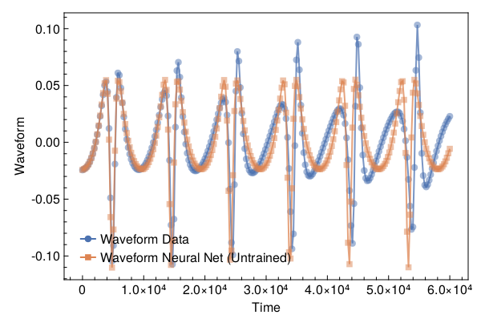
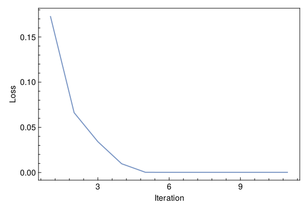
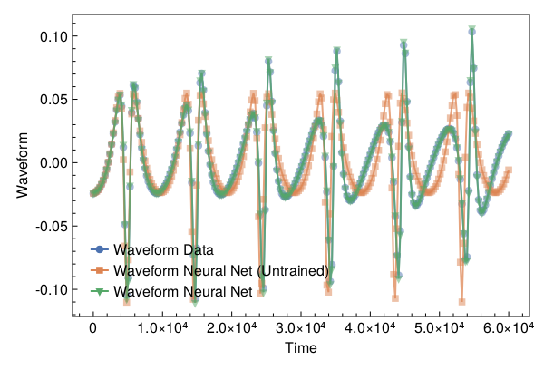

<a id='Training-a-Neural-ODE-to-Model-Gravitational-Waveforms'></a>

# Training a Neural ODE to Model Gravitational Waveforms


This code is adapted from [Astroinformatics/ScientificMachineLearning](https://github.com/Astroinformatics/ScientificMachineLearning/blob/c93aac3a460d70b4cce98836b677fd9b732e94b7/neuralode_gw.ipynb)


The code has been minimally adapted from [Keith et. al. 2021](https://arxiv.org/abs/2102.12695) which originally used Flux.jl


<a id='Package-Imports'></a>

## Package Imports


```julia
using Lux, ComponentArrays, LineSearches, LuxAMDGPU, LuxCUDA, OrdinaryDiffEq,
    Optimization, OptimizationOptimJL, Random, SciMLSensitivity
using CairoMakie, MakiePublication
CUDA.allowscalar(false)
```


<a id='Define-some-Utility-Functions'></a>

## Define some Utility Functions


::: tip


This section can be skipped. It defines functions to simulate the model, however, from a scientific machine learning perspective, isn't super relevant.


:::


We need a very crude 2-body path. Assume the 1-body motion is a newtonian 2-body position vector $r = r_1 - r_2$ and use Newtonian formulas to get $r_1$, $r_2$ (e.g. Theoretical Mechanics of Particles and Continua 4.3)


```julia
function one2two(path, m₁, m₂)
    M = m₁ + m₂
    r₁ = m₂ / M .* path
    r₂ = -m₁ / M .* path
    return r₁, r₂
end
```


```
one2two (generic function with 1 method)
```


Next we define a function to perform the change of variables: $(\chi(t),\phi(t)) \mapsto (x(t),y(t))$


```julia
@views function soln2orbit(soln, model_params=nothing)
    @assert size(soln, 1) ∈ [2, 4] "size(soln,1) must be either 2 or 4"

    if size(soln, 1) == 2
        χ = soln[1, :]
        ϕ = soln[2, :]

        @assert length(model_params)==3 "model_params must have length 3 when size(soln,2) = 2"
        p, M, e = model_params
    else
        χ = soln[1, :]
        ϕ = soln[2, :]
        p = soln[3, :]
        e = soln[4, :]
    end

    r = p ./ (1 .+ e .* cos.(χ))
    x = r .* cos.(ϕ)
    y = r .* sin.(ϕ)

    orbit = vcat(x', y')
    return orbit
end
```


```
soln2orbit (generic function with 2 methods)
```


This function uses second-order one-sided difference stencils at the endpoints; see https://doi.org/10.1090/S0025-5718-1988-0935077-0


```julia
function d_dt(v::AbstractVector, dt)
    a = -3 / 2 * v[1] + 2 * v[2] - 1 / 2 * v[3]
    b = (v[3:end] .- v[1:(end - 2)]) / 2
    c = 3 / 2 * v[end] - 2 * v[end - 1] + 1 / 2 * v[end - 2]
    return [a; b; c] / dt
end
```


```
d_dt (generic function with 1 method)
```


This function uses second-order one-sided difference stencils at the endpoints; see https://doi.org/10.1090/S0025-5718-1988-0935077-0


```julia
function d2_dt2(v::AbstractVector, dt)
    a = 2 * v[1] - 5 * v[2] + 4 * v[3] - v[4]
    b = v[1:(end - 2)] .- 2 * v[2:(end - 1)] .+ v[3:end]
    c = 2 * v[end] - 5 * v[end - 1] + 4 * v[end - 2] - v[end - 3]
    return [a; b; c] / (dt^2)
end
```


```
d2_dt2 (generic function with 1 method)
```


Now we define a function to compute the trace-free moment tensor from the orbit


```julia
function orbit2tensor(orbit, component, mass=1)
    x = orbit[1, :]
    y = orbit[2, :]

    Ixx = x .^ 2
    Iyy = y .^ 2
    Ixy = x .* y
    trace = Ixx .+ Iyy

    if component[1] == 1 && component[2] == 1
        tmp = Ixx .- trace ./ 3
    elseif component[1] == 2 && component[2] == 2
        tmp = Iyy .- trace ./ 3
    else
        tmp = Ixy
    end

    return mass .* tmp
end

function h_22_quadrupole_components(dt, orbit, component, mass=1)
    mtensor = orbit2tensor(orbit, component, mass)
    mtensor_ddot = d2_dt2(mtensor, dt)
    return 2 * mtensor_ddot
end

function h_22_quadrupole(dt, orbit, mass=1)
    h11 = h_22_quadrupole_components(dt, orbit, (1, 1), mass)
    h22 = h_22_quadrupole_components(dt, orbit, (2, 2), mass)
    h12 = h_22_quadrupole_components(dt, orbit, (1, 2), mass)
    return h11, h12, h22
end

function h_22_strain_one_body(dt::T, orbit) where {T}
    h11, h12, h22 = h_22_quadrupole(dt, orbit)

    h₊ = h11 - h22
    hₓ = T(2) * h12

    scaling_const = √(T(π) / 5)
    return scaling_const * h₊, -scaling_const * hₓ
end

function h_22_quadrupole_two_body(dt, orbit1, mass1, orbit2, mass2)
    h11_1, h12_1, h22_1 = h_22_quadrupole(dt, orbit1, mass1)
    h11_2, h12_2, h22_2 = h_22_quadrupole(dt, orbit2, mass2)
    h11 = h11_1 + h11_2
    h12 = h12_1 + h12_2
    h22 = h22_1 + h22_2
    return h11, h12, h22
end

function h_22_strain_two_body(dt::T, orbit1, mass1, orbit2, mass2) where {T}
    # compute (2,2) mode strain from orbits of BH 1 of mass1 and BH2 of mass 2

    @assert abs(mass1 + mass2 - 1.0)<1e-12 "Masses do not sum to unity"

    h11, h12, h22 = h_22_quadrupole_two_body(dt, orbit1, mass1, orbit2, mass2)

    h₊ = h11 - h22
    hₓ = T(2) * h12

    scaling_const = √(T(π) / 5)
    return scaling_const * h₊, -scaling_const * hₓ
end

function compute_waveform(dt::T, soln, mass_ratio, model_params=nothing) where {T}
    @assert mass_ratio≤1 "mass_ratio must be <= 1"
    @assert mass_ratio≥0 "mass_ratio must be non-negative"

    orbit = soln2orbit(soln, model_params)
    if mass_ratio > 0
        m₂ = inv(T(1) + mass_ratio)
        m₁ = mass_ratio * m₂

        orbit₁, orbit₂ = one2two(orbit, m₁, m₂)
        waveform = h_22_strain_two_body(dt, orbit1, mass1, orbit2, mass2)
    else
        waveform = h_22_strain_one_body(dt, orbit)
    end
    return waveform
end
```


```
compute_waveform (generic function with 2 methods)
```


<a id='Simulating-the-True-Model'></a>

## Simulating the True Model


`RelativisticOrbitModel` defines system of odes which describes motion of point like particle in schwarzschild background, uses


$$
u[1] = \chi
$$


$$
u[2] = \phi
$$


where, $p$, $M$, and $e$ are constants


```julia
function RelativisticOrbitModel(u, (p, M, e), t)
    χ, ϕ = u

    numer = (p - 2 - 2 * e * cos(χ)) * (1 + e * cos(χ))^2
    denom = sqrt((p - 2)^2 - 4 * e^2)

    χ̇ = numer * sqrt(p - 6 - 2 * e * cos(χ)) / (M * (p^2) * denom)
    ϕ̇ = numer / (M * (p^(3 / 2)) * denom)

    return [χ̇, ϕ̇]
end

mass_ratio = 0.0         # test particle
u0 = Float64[π, 0.0]     # initial conditions
datasize = 250
tspan = (0.0f0, 6.0f4)   # timespace for GW waveform
tsteps = range(tspan[1], tspan[2]; length=datasize)  # time at each timestep
dt_data = tsteps[2] - tsteps[1]
dt = 100.0
const ode_model_params = [100.0, 1.0, 0.5]; # p, M, e
```


Let's simulate the true model and plot the results using `OrdinaryDiffEq.jl`


```julia
prob = ODEProblem(RelativisticOrbitModel, u0, tspan, ode_model_params)
soln = Array(solve(prob, RK4(); saveat=tsteps, dt, adaptive=false))
waveform = first(compute_waveform(dt_data, soln, mass_ratio, ode_model_params))

fig = with_theme(theme_web()) do
    fig = Figure()
    ax = CairoMakie.Axis(fig[1, 1]; xlabel="Time", ylabel="Waveform")

    l = lines!(ax, tsteps, waveform; linewidth=2, alpha=0.75)
    s = scatter!(ax, tsteps, waveform; markershape=:circle, markeralpha=0.25, alpha=0.5)

    axislegend(ax, [[l, s]], ["Waveform Data"])

    return fig
end
```


<a id='Defiing-a-Neural-Network-Model'></a>

## Defiing a Neural Network Model


Next, we define the neural network model that takes 1 input (time) and has two outputs. We'll make a function `ODE_model` that takes the initial conditions, neural network parameters and a time as inputs and returns the derivatives.


It is typically never recommended to use globals but incase you do use them, make sure to mark them as `const`.


We will deviate from the standard Neural Network initialization and use `WeightInitializers.jl`,


```julia
const nn = Chain(Base.Fix1(broadcast, cos),
    Dense(1 => 32, cos; init_weight=truncated_normal(; std=1e-4)),
    Dense(32 => 32, cos; init_weight=truncated_normal(; std=1e-4)),
    Dense(32 => 2; init_weight=truncated_normal(; std=1e-4)))
ps, st = Lux.setup(MersenneTwister(), nn)
```


```
((layer_1 = NamedTuple(), layer_2 = (weight = Float32[-5.8388552f-5; -0.000106000436; 9.495561f-5; -1.098146f-5; -4.0132232f-5; 0.0001125959; 1.3438504f-5; 6.413137f-5; -7.1073086f-6; 0.00010218929; 6.319372f-5; 8.978835f-5; -1.5760777f-5; 0.0001041945; 0.00016152328; -0.00019478147; -7.4183263f-6; -8.704315f-5; 0.00010134493; -9.097102f-5; 0.00017082486; 8.6009095f-6; 6.969515f-5; -0.00010338203; 6.8778776f-5; 3.7956164f-5; 1.7964452f-5; 8.757465f-5; -8.594218f-5; -7.430792f-5; -6.4036146f-7; -0.00011932569;;], bias = Float32[0.0; 0.0; 0.0; 0.0; 0.0; 0.0; 0.0; 0.0; 0.0; 0.0; 0.0; 0.0; 0.0; 0.0; 0.0; 0.0; 0.0; 0.0; 0.0; 0.0; 0.0; 0.0; 0.0; 0.0; 0.0; 0.0; 0.0; 0.0; 0.0; 0.0; 0.0; 0.0;;]), layer_3 = (weight = Float32[1.6102567f-5 1.83343f-5 0.00012109614 -0.00016687153 5.7305886f-5 2.7044394f-5 -6.704273f-5 -7.2918854f-5 4.1710267f-5 -0.00018907827 0.00017066427 1.3875329f-5 0.00012721252 -0.00010707842 8.714741f-5 3.8621078f-5 -1.2854798f-5 0.00015083743 -2.6643173f-5 -1.396301f-5 0.00012497237 4.692336f-5 -2.5823283f-5 7.009189f-5 -1.534624f-5 -1.2660759f-5 6.232323f-5 0.00022019348 4.3685937f-5 -0.00015035894 -4.2158375f-5 0.00012192923; -0.00016185889 0.00010355571 0.00012597353 1.1397856f-5 -8.45389f-5 -2.5768944f-5 1.6989798f-5 4.1210355f-5 0.00011507259 -0.00027367932 -4.0601382f-5 1.4996058f-5 -0.000105460356 -0.00019693824 -8.170779f-5 8.808881f-5 0.00012275741 -5.946292f-5 -8.2441846f-5 8.072602f-5 1.7809265f-5 -7.965912f-5 1.766432f-5 -2.4213505f-5 -0.00010593474 -4.9104183f-5 -0.0001669773 -0.00018618788 -5.094567f-5 -5.5556757f-6 8.558521f-5 -0.00012528262; -5.82217f-5 -0.00015459514 -0.00021261112 -0.00011489601 -1.9072439f-5 -3.3839901f-6 -6.62433f-5 0.00019625922 -0.000161345 -0.00010264746 4.988178f-5 0.00010123902 3.795989f-5 -4.0834334f-6 -0.00011456684 -1.6798584f-6 -0.00013524403 5.608173f-5 6.551331f-5 -0.00018355442 -6.1270344f-5 -0.0001694747 -4.180172f-5 -2.0441843f-5 1.7427977f-6 4.82117f-5 -5.2050702f-5 0.00019556565 -0.00014489955 9.644431f-6 9.433015f-5 -7.24664f-5; 0.00030651226 4.4195614f-5 -0.0001608203 8.146466f-5 0.0001795588 -8.2374245f-5 4.434439f-6 -8.222369f-5 3.651088f-5 -3.1449832f-5 -0.00022109467 7.048917f-5 -6.016729f-5 7.543986f-5 -5.23469f-5 3.9425602f-5 -6.510042f-5 -1.617468f-5 -2.3442468f-5 -9.829252f-5 -4.081882f-5 0.00012101935 -8.193146f-5 -2.208501f-5 0.00013852422 3.9229024f-5 8.689202f-5 1.3177068f-5 -0.00020122893 0.00018115887 0.00012420584 1.3511557f-6; 5.986443f-5 0.000107735 -0.00018999582 -0.00031658803 0.00013842694 0.00011154108 -1.6473534f-5 -5.5368157f-5 0.00014220561 -5.4950455f-5 -7.2256435f-6 3.9985433f-5 -0.00011257405 -6.6854877f-6 -0.00016128013 9.316403f-5 4.2848016f-5 -4.2244155f-6 8.636999f-5 8.192828f-5 -0.00010851652 6.0714552f-5 0.00010815049 -0.000109106346 -2.6460113f-5 1.286438f-5 -0.00013006077 -9.8544275f-5 6.500579f-5 6.155623f-5 8.659832f-5 -1.6493494f-5; -8.765105f-5 -0.00012814217 -4.9606206f-5 3.6312023f-5 0.00013740621 0.00019182112 0.00011195645 2.9969786f-5 0.00027821396 2.3448334f-5 -0.0001294411 1.5712674f-5 0.00010188935 -7.960061f-6 0.0002515182 -0.00015259406 9.349863f-5 -2.8340557f-5 -6.015365f-5 -5.9290986f-5 5.4573966f-6 0.00017269439 -0.00026450757 5.5639957f-6 0.00014500326 4.801353f-5 -0.000117896496 7.95867f-5 0.00020315721 0.00011861688 -7.390749f-5 6.264535f-5; -0.00014986671 -8.721842f-5 -8.224041f-5 0.00019295333 0.00012546839 -7.6788674f-5 9.108027f-5 0.00016374944 -1.5070825f-5 -4.3580243f-5 -2.2166527f-5 -0.00015420237 -8.157656f-5 1.4817939f-5 -0.00011862111 -9.353024f-5 -6.505397f-5 0.0001012468 6.793953f-5 -8.8148685f-5 6.515573f-5 -6.005903f-6 5.0719213f-5 0.00011720367 0.00015302913 9.6983254f-5 -0.00013344835 0.0002460952 -9.4910596f-5 6.838573f-5 7.4328564f-5 4.1251868f-5; -0.00021683282 1.0750523f-5 3.6137935f-5 -0.00016581666 -2.4133324f-5 6.0437556f-5 -4.5347824f-5 0.00016024798 -0.00012675501 -7.644448f-5 0.00016727195 6.0293532f-5 -5.0237144f-5 0.0001484182 -1.6500946f-5 3.2601798f-5 -7.476823f-5 -1.9996474f-5 0.00018622815 -0.00010404708 4.407368f-5 9.713947f-5 -0.00011495824 4.8452494f-5 -4.3134103f-5 -5.5336775f-5 -9.697083f-5 6.2782994f-5 -6.599102f-5 -6.676025f-5 0.00010534574 -0.00017737046; -9.07247f-5 3.622771f-5 -6.117195f-5 -4.2603173f-5 -1.26641935f-5 3.0349269f-5 -2.1141062f-7 8.27764f-6 -2.781824f-5 0.00017445853 -3.8921826f-5 3.1294836f-5 0.00013096865 -1.0565194f-5 8.1578306f-5 0.00013937005 -7.416068f-5 1.9178924f-5 8.645624f-5 -0.00015855755 -0.00013811674 7.8130644f-5 -9.979554f-5 0.00010940856 -0.00030650242 -4.1373805f-5 0.000113568196 7.499193f-5 -0.00010257284 -1.7809322f-6 -0.00018564309 0.00010455451; -5.9287067f-5 -1.8635192f-5 -3.831923f-5 -0.00018334737 0.00010314181 -2.1716476f-5 0.000100670426 -0.0001098778 -0.00015298252 -9.011304f-6 -7.3542265f-5 -0.00012743108 -7.601826f-5 0.0001627193 3.4849588f-6 4.9897582f-5 0.00015901642 6.8597226f-5 -7.046262f-5 -3.9310357f-6 8.857669f-5 4.244725f-5 0.00013146062 6.9387126f-5 -2.7856595f-6 2.6568068f-5 1.831948f-6 0.00014164734 -4.5714307f-5 -0.00014336703 2.9138584f-5 -6.08305f-5; -0.0001797817 7.397575f-5 1.9773803f-5 0.0001486599 -5.2947107f-5 6.495331f-5 9.206242f-5 -0.0001555966 4.8328133f-5 -5.2054293f-5 -0.00014980473 -2.6445507f-5 -7.814017f-5 3.2765358f-5 4.8835856f-5 -6.426546f-5 7.7247496f-5 7.770926f-6 -7.0438614f-6 -7.1152476f-6 0.00012490846 8.532867f-5 2.2700538f-5 -5.7391335f-5 1.0192604f-5 -0.000121323385 -0.0001122866 0.00014931319 -5.5962908f-5 -2.1577794f-6 1.734554f-5 0.0001248786; -3.959932f-5 -0.00023210229 -6.5986416f-5 4.418662f-5 2.9941908f-5 -0.00020904493 5.995216f-6 -8.175136f-5 -6.32877f-5 -0.000106509004 1.5560643f-5 8.867967f-5 3.5513698f-5 0.00017486373 0.00013937637 -0.00011544137 0.0002102134 5.304301f-5 -5.414992f-6 1.2699075f-5 4.831211f-6 -2.6486387f-5 0.00010857776 -9.608308f-5 7.33077f-5 -0.000254817 -2.6955482f-5 -1.5167846f-5 8.989612f-5 -0.000111342415 -8.459577f-5 -9.01458f-5; 3.717036f-5 4.704816f-5 -0.0001298581 -3.0442056f-5 0.00021440377 -5.6258174f-5 -5.750136f-5 -0.00019181492 -0.0001069822 0.00011117318 8.210387f-6 -0.00010321126 0.00011381124 -7.215413f-5 4.2971333f-5 0.00020195087 -0.00012117824 1.6979392f-6 5.436064f-5 -8.943645f-5 5.819639f-5 9.801655f-5 4.499134f-5 0.00014876899 -9.725319f-5 0.00020232935 3.9744114f-5 -7.9699836f-5 8.3904306f-5 7.5009346f-5 3.8840128f-5 7.291573f-5; 0.00023596354 -6.707304f-5 -0.00014473173 1.7394683f-5 6.0808103f-5 0.00012434508 0.00012614185 1.4250959f-5 -8.119222f-5 -0.00016135971 -5.194158f-5 -0.00018807958 7.707267f-6 9.739483f-5 0.00011893916 -7.552337f-5 -0.00011196305 7.998732f-5 -3.2282587f-5 -8.822579f-5 -3.5837656f-5 0.00013982807 -0.00012084608 5.469764f-5 -9.917054f-6 6.580591f-5 7.0214766f-5 2.4653047f-5 2.666952f-5 -3.6193283f-5 7.6770875f-6 2.6618326f-7; 2.1931575f-5 -7.596613f-5 1.7872022f-5 1.2001243f-5 1.850896f-6 -0.00018662734 -0.00011147409 0.00017238672 7.820203f-5 -0.000120900426 -2.793725f-5 -6.072382f-5 0.0002948206 -0.00018189929 7.267781f-5 0.00010120779 6.209715f-5 -4.8639715f-5 0.000109042594 -5.005752f-5 0.00011202839 8.3233135f-5 -0.00021792663 -0.0002737882 1.9809058f-5 -7.9581085f-5 -4.669471f-5 0.00010197741 -7.264555f-5 -8.770354f-5 0.00020106851 1.4454958f-5; -0.0001521571 -5.8902246f-5 -7.123666f-5 -0.00012128478 -0.00014437013 2.9255612f-5 -0.00010095568 -6.301884f-5 3.7627913f-5 7.272397f-5 -0.0001371901 -7.4889826f-6 8.354306f-5 0.00015989538 -0.0001729833 0.00014588328 2.3747043f-5 9.308197f-5 -8.771337f-6 -4.11295f-5 4.2138618f-5 0.00010959752 6.990025f-5 8.879977f-5 -0.0001419742 7.4020034f-5 -0.00010422536 9.415769f-5 -0.00014774717 -0.00014007288 -6.018865f-6 0.00013826681; 8.72882f-5 6.8988644f-5 -0.00016117403 -0.0001008562 -0.00013082402 -2.0665793f-5 0.000100940015 -3.9964554f-5 -8.451827f-5 -2.90974f-5 -7.085618f-5 4.0783493f-6 -0.0001495994 -7.6027594f-5 9.575443f-5 -3.0327023f-5 -3.262991f-5 -0.000104467836 2.0619855f-5 -0.00015707141 0.0002195215 0.0001398612 7.14856f-6 6.6272216f-5 3.4499168f-5 0.00010036779 4.5944347f-5 4.5446435f-5 -4.2019128f-5 -0.00013649625 -3.271958f-5 -6.9022385f-6; 5.291782f-5 6.653328f-5 -6.453317f-5 0.00013518761 2.6288866f-5 4.612168f-5 6.332829f-6 8.2446924f-5 4.134653f-5 3.2092823f-5 -5.6852463f-5 -0.00019396731 1.8331564f-5 9.164448f-5 -8.952296f-5 8.3242645f-5 -0.00012019941 -1.265585f-5 9.238758f-5 6.605705f-5 -0.00017373133 -6.639613f-5 0.00013531925 0.00022367942 -0.00018913168 1.2021197f-5 -1.231049f-5 -2.1378106f-5 2.6484251f-5 5.5817203f-5 -2.7554821f-5 0.00018013839; -1.0683203f-5 1.904904f-5 -5.9690832f-5 -0.00012297982 2.9284867f-5 0.00017824564 6.170693f-5 0.0001042623 -7.102043f-5 -2.2118571f-5 -5.3176856f-5 4.9223516f-5 0.00012386592 -2.6976368f-5 -7.964361f-5 -0.00025571662 3.715797f-5 2.6957725f-6 -5.3502852f-5 -0.00010257805 9.763505f-5 0.00013053081 0.00014278738 -2.047403f-6 0.00013331692 -7.745356f-5 2.3961204f-5 6.01467f-5 0.00012709611 -9.1973714f-5 -2.7250657f-5 6.177561f-6; -0.00011471436 9.249528f-5 -5.003723f-5 -7.5492055f-5 6.337841f-5 -7.536203f-5 8.1547885f-5 8.812048f-5 2.7108836f-5 -6.8641093f-6 8.1938066f-5 -6.859314f-5 6.383552f-5 9.663521f-5 6.41778f-5 -3.8242128f-5 9.587993f-6 0.00012975541 -2.1215765f-5 0.00011465375 -1.8875777f-5 -0.00014338439 8.334862f-5 7.864708f-5 8.0253616f-5 -0.00016355755 -0.000107153464 -4.5877143f-5 -0.00019513685 -3.6757894f-5 5.729085f-5 3.258538f-5; 3.9720184f-5 -7.685113f-5 -0.00010410409 5.260131f-5 2.4549376f-5 9.725195f-5 4.584362f-5 -2.9537074f-5 9.333703f-6 -0.0001513718 -1.8834957f-5 0.00016953831 6.110935f-5 3.5127843f-5 -2.22034f-5 -1.9630334f-5 7.3231844f-5 4.226679f-5 6.6097535f-5 5.611499f-5 -9.6920056f-5 -2.0511905f-5 0.00013857229 0.00012219434 -2.9840858f-5 0.0002824079 3.5863846f-5 -4.8019567f-5 7.927084f-5 0.00027745686 -3.8102386f-5 -1.1968888f-5; 4.8991486f-5 0.00026283803 -0.00017969438 2.5939612f-6 -7.015758f-5 -1.6485466f-5 -6.0327584f-5 -6.6716755f-5 -0.00023308807 1.0554584f-6 7.984627f-5 -5.308945f-5 -0.00016902803 0.00017487103 0.00016103957 -0.00014551241 3.8320836f-6 0.000113835114 0.00010424485 -0.00022200434 -0.0001416431 0.00025250026 -4.1771753f-5 -5.8399502f-5 -4.6237266f-5 5.006016f-5 0.00012024083 1.0319129f-5 -9.2451926f-5 6.293959f-5 -0.00014563648 0.00010106896; 6.939367f-5 6.584008f-5 0.000105334024 3.057463f-7 5.7720878f-5 1.8517994f-5 -1.0148211f-5 0.00027142034 8.390507f-5 3.2097385f-5 0.00016832798 5.4535362f-6 -0.00015134944 -3.6126643f-5 -3.1354903f-5 -2.5032814f-5 -1.4171846f-5 3.9900933f-5 -5.339472f-5 -1.410608f-5 -7.925905f-5 2.5593683f-5 7.4370237f-6 4.3546108f-5 -1.1621501f-5 -8.522899f-5 -0.0001296703 -8.0286074f-5 1.7387707f-5 5.744112f-5 9.200114f-5 -0.0002213827; -0.0001557123 3.626357f-6 3.0732415f-6 2.9038489f-5 9.015316f-5 2.6373134f-5 0.0001590508 -0.00014274458 -5.1357736f-5 -1.7213177f-5 -0.00014510902 9.994034f-5 9.1015005f-5 5.6738983f-5 8.7070075f-5 -2.13959f-5 3.8655882f-5 4.850818f-5 -2.015255f-5 -0.00012097797 -1.33643925f-5 7.821669f-6 -0.000101699625 5.424093f-5 -7.727021f-5 -8.379992f-5 4.404974f-5 -4.4369313f-5 0.00013969753 7.097499f-5 -4.6347595f-5 0.00011139431; 8.0264545f-5 7.4672666f-5 -0.000113128866 7.1330396f-5 4.70973f-5 8.654926f-6 9.7002245f-5 0.00023165096 3.6084384f-5 -0.00018213593 1.9253162f-5 -6.6983057f-6 -7.116636f-5 6.649883f-5 4.804975f-5 -0.00013657246 -7.7346034f-5 -0.00017132149 -0.00010071012 -0.00020367572 -2.9748924f-5 4.3375006f-5 3.3398526f-5 -7.9318466f-5 -2.1279795f-5 0.00022536101 7.1499795f-5 -0.000119585326 -0.000115166375 0.00013719102 -0.00011819494 7.5902106f-5; -0.00015033934 1.5015096f-5 -1.0575682f-5 -9.613159f-5 -3.5764348f-5 -1.4926557f-5 -0.00016619511 0.000101959675 1.7048726f-6 3.238485f-5 -7.3171024f-5 -7.254576f-5 -0.00020005765 0.000139416 -9.0556176f-5 0.00026656906 -1.2502937f-5 1.2553051f-5 -0.0001292081 0.00011281341 -9.334718f-5 6.217011f-5 0.00011988402 -0.00010159653 4.3835233f-5 -1.2183231f-5 7.688891f-5 0.00013678567 7.423552f-5 2.8384544f-5 -8.669387f-5 6.223668f-5; 5.2674037f-5 -1.3409588f-5 1.6751988f-5 -0.00012183126 -0.00022722797 0.00018851498 6.0805512f-5 5.852402f-6 -0.00011094845 2.6714171f-5 1.1710704f-5 -5.0766585f-6 -4.125229f-5 -0.00015655569 0.00011019816 -8.5023144f-5 0.000103730665 -0.00015271873 -0.00016353125 -0.00011342964 1.0652279f-5 0.00026642016 -6.646915f-6 -1.5585052f-5 -6.174113f-5 9.913463f-5 -5.400686f-5 2.085201f-5 2.8294025f-5 -2.2085378f-5 -0.00034919768 -0.00014046312; 5.993422f-5 -6.905838f-5 -7.0964943f-6 0.00012316986 -0.00015296288 -5.112062f-5 3.7875732f-5 -1.7524964f-5 -0.00013302774 6.222948f-6 6.479186f-5 3.6335132f-5 2.234397f-5 0.00014302996 0.00013976122 6.01183f-6 -0.00014495557 0.0001190861 -0.00015554049 -6.5712698f-6 9.2297734f-5 -5.8953647f-5 -9.229807f-6 8.594611f-5 7.351174f-7 -4.1332958f-5 5.4221477f-5 -0.000119576594 0.00020575458 0.00010514687 0.00019071261 -6.354177f-6; -0.000108094035 8.627708f-5 8.132646f-6 -4.8956652f-5 -4.5573932f-5 3.7345402f-5 4.2223863f-5 -5.212065f-5 -4.8843063f-5 9.733393f-5 8.244189f-5 -3.209059f-5 -0.00014818722 -9.2366376f-5 0.00015515319 7.833041f-5 -0.00016625578 1.3825611f-5 8.0344944f-5 -1.6830178f-5 6.726587f-5 0.00017892441 0.00019654252 1.4706046f-5 3.4727498f-5 -0.00011381513 0.00011136597 4.996721f-5 2.1508575f-5 -9.359152f-5 -2.2278535f-5 0.000105749794; -0.0002015372 2.0446756f-5 1.1717954f-5 4.7261055f-5 -0.00019575612 -0.0001119989 -0.00019641404 -1.6045964f-5 0.00012951206 4.9615497f-5 3.84871f-6 -0.00015353605 1.6923137f-5 1.21773f-5 0.00022148849 0.00016246694 1.1736398f-5 1.39703725f-5 2.3269155f-5 -0.00017291223 5.6804845f-5 5.8697577f-5 0.00022924792 -6.297528f-6 -8.87591f-6 -0.00024507835 -7.273502f-5 -1.3894156f-5 -2.9632101f-5 7.581154f-5 3.982471f-5 -9.172127f-5; 3.8904935f-5 0.00016708474 0.00014854642 -6.420464f-5 -0.00019458545 -4.171949f-5 0.00010723324 8.713933f-5 2.3029567f-7 -9.9977035f-5 -0.00022815485 -8.275071f-5 -0.000116829644 6.319963f-5 -0.00022651955 4.830006f-5 -3.7837242f-5 -0.000252221 5.975866f-5 0.00010027231 -0.00010304578 5.8297795f-5 -0.00019696256 -6.723376f-5 -9.766273f-5 0.00011827218 7.371381f-5 -9.0624184f-5 -5.1639792f-5 0.00016503331 -4.2346954f-5 -4.8961738f-5; 0.00016566715 -0.00011859907 -1.7315571f-5 -4.0435207f-5 -0.000101986814 -0.00012858302 3.320008f-6 -0.0001376901 -3.8502207f-5 4.709336f-6 7.669589f-5 0.00020869922 -4.0552075f-7 3.7736503f-5 6.611341f-5 -8.215792f-5 9.38957f-5 1.8544524f-6 -9.976192f-5 0.00012927876 -0.0001382247 8.106881f-5 -3.889227f-5 -5.32591f-5 1.080327f-5 5.4638604f-6 -2.5088286f-5 0.00013743088 -2.7438542f-5 -6.956119f-5 0.00011410307 9.7001765f-5], bias = Float32[0.0; 0.0; 0.0; 0.0; 0.0; 0.0; 0.0; 0.0; 0.0; 0.0; 0.0; 0.0; 0.0; 0.0; 0.0; 0.0; 0.0; 0.0; 0.0; 0.0; 0.0; 0.0; 0.0; 0.0; 0.0; 0.0; 0.0; 0.0; 0.0; 0.0; 0.0; 0.0;;]), layer_4 = (weight = Float32[-8.920361f-5 -0.00013060888 0.00012743882 -0.00011839303 0.00011924012 -5.7669597f-5 -0.0002457914 0.00021380943 -0.00014323845 -6.442821f-5 0.00014223723 -0.00018628607 -6.889708f-5 -9.425093f-6 -3.2956414f-6 -2.1578987f-6 1.7707238f-5 3.4655495f-5 6.7970206f-5 3.858238f-5 7.926499f-5 -0.0001389337 2.5936435f-5 0.00010579261 0.00010802096 5.3168354f-5 -0.00019130768 -0.00012125442 8.5655694f-5 4.6040936f-5 -2.1064754f-5 -0.000113245274; -0.00010081859 6.303972f-5 -8.4486244f-5 4.733026f-5 -7.941861f-5 0.00016813178 3.5395858f-6 1.105728f-5 0.000102497375 -1.9696747f-5 -0.00024925644 0.00017798971 0.0001957342 -0.00016245016 -0.00014359478 5.416818f-5 5.5415778f-5 -3.2880147f-5 -6.657519f-5 -4.247194f-5 -9.4595875f-5 -0.00010661882 4.579971f-5 -0.00017988948 0.0002776651 8.308278f-5 -1.575627f-5 -0.0001304713 -0.00013764693 -6.132953f-6 4.189399f-5 -1.2239949f-5], bias = Float32[0.0; 0.0;;])), (layer_1 = NamedTuple(), layer_2 = NamedTuple(), layer_3 = NamedTuple(), layer_4 = NamedTuple()))
```


Similar to most DL frameworks, Lux defaults to using `Float32`, however, in this case we need Float64


```julia
const params = ComponentArray{Float64}(ps)
```


```
ComponentVector{Float64}(layer_1 = Float64[], layer_2 = (weight = [-5.838855213369243e-5; -0.0001060004360624589; 9.495561243966222e-5; -1.0981460036418866e-5; -4.0132232243195176e-5; 0.00011259590246481821; 1.3438503629004117e-5; 6.413136725313962e-5; -7.107308647391619e-6; 0.00010218928946414962; 6.319372187135741e-5; 8.978835103334859e-5; -1.5760777387185954e-5; 0.00010419449972687289; 0.00016152327589225024; -0.00019478147441986948; -7.418326276820153e-6; -8.704314677743241e-5; 0.00010134492913493887; -9.097102156374604e-5; 0.00017082486010622233; 8.600909495726228e-6; 6.96951465215534e-5; -0.0001033820299198851; 6.877877603983507e-5; 3.795616430579685e-5; 1.79644521267619e-5; 8.75746482051909e-5; -8.594217797508463e-5; -7.430792175000533e-5; -6.403614634109545e-7; -0.00011932569032069296;;], bias = [0.0; 0.0; 0.0; 0.0; 0.0; 0.0; 0.0; 0.0; 0.0; 0.0; 0.0; 0.0; 0.0; 0.0; 0.0; 0.0; 0.0; 0.0; 0.0; 0.0; 0.0; 0.0; 0.0; 0.0; 0.0; 0.0; 0.0; 0.0; 0.0; 0.0; 0.0; 0.0;;]), layer_3 = (weight = [1.6102567315101624e-5 1.8334299966227263e-5 0.0001210961418109946 -0.00016687152674421668 5.730588600272313e-5 2.704439430090133e-5 -6.70427325530909e-5 -7.291885412996635e-5 4.171026739641093e-5 -0.00018907827325165272 0.00017066426516976207 1.3875329386792146e-5 0.000127212522784248 -0.00010707842011470348 8.714741125004366e-5 3.8621077692369e-5 -1.2854798114858568e-5 0.00015083742619026452 -2.6643172532203607e-5 -1.3963010133011267e-5 0.00012497237185016274 4.6923360059736297e-5 -2.582328306743875e-5 7.009188993833959e-5 -1.5346240616054274e-5 -1.2660759239224717e-5 6.232323357835412e-5 0.00022019348398316652 4.368593727122061e-5 -0.0001503589446656406 -4.215837543597445e-5 0.00012192923168186098; -0.00016185888671316206 0.00010355570702813566 0.00012597352906595916 1.139785581472097e-5 -8.453890040982515e-5 -2.5768944396986626e-5 1.698979758657515e-5 4.121035453863442e-5 0.00011507258750498295 -0.0002736793248914182 -4.0601382352178916e-5 1.4996057871030644e-5 -0.0001054603562806733 -0.0001969382428796962 -8.17077889223583e-5 8.808881102595478e-5 0.0001227574102813378 -5.946292003500275e-5 -8.244184573413804e-5 8.072602213360369e-5 1.7809265045798384e-5 -7.965911936480552e-5 1.7664320694166236e-5 -2.421350473014172e-5 -0.00010593474144116044 -4.9104182835435495e-5 -0.00016697730461601168 -0.00018618788453750312 -5.0945669499924406e-5 -5.555675670620985e-6 8.558521221857518e-5 -0.00012528261868283153; -5.8221699873683974e-5 -0.00015459513815585524 -0.0002126111212419346 -0.00011489600728964433 -1.9072438590228558e-5 -3.383990133443149e-6 -6.624330126214772e-5 0.00019625922141131014 -0.00016134500037878752 -0.00010264745651511475 4.9881778977578506e-5 0.00010123902029590681 3.795988959609531e-5 -4.083433395862812e-6 -0.00011456684296717867 -1.6798584283606033e-6 -0.00013524403038900346 5.6081731599988416e-5 6.551331171067432e-5 -0.00018355442443862557 -6.127034430392087e-5 -0.000169474704307504 -4.18017189076636e-5 -2.0441842934815213e-5 1.7427977354600444e-6 4.821169932256453e-5 -5.205070192459971e-5 0.00019556564802769572 -0.00014489954628515989 9.644430974731222e-6 9.433014929527417e-5 -7.246639870572835e-5; 0.00030651225824840367 4.419561446411535e-5 -0.0001608203019713983 8.146466279868037e-5 0.0001795588032109663 -8.237424481194466e-5 4.434438778844196e-6 -8.222369069699198e-5 3.651087899925187e-5 -3.1449832022190094e-5 -0.00022109466954134405 7.048917177598923e-5 -6.016729093971662e-5 7.543985702795908e-5 -5.23468988831155e-5 3.94256021536421e-5 -6.510042294394225e-5 -1.6174679331015795e-5 -2.3442467863787897e-5 -9.829251939663664e-5 -4.081882070749998e-5 0.0001210193513543345 -8.193145913537592e-5 -2.208501064160373e-5 0.0001385242212563753 3.92290239688009e-5 8.689201786182821e-5 1.3177067557990085e-5 -0.00020122893329244107 0.0001811588736018166 0.0001242058351635933 1.3511556744560949e-6; 5.986442920402624e-5 0.00010773500252980739 -0.00018999581516254693 -0.00031658803345635533 0.00013842694170307368 0.00011154107778565958 -1.647353383305017e-5 -5.5368156608892605e-5 0.00014220560842659324 -5.4950454796198756e-5 -7.225643457786646e-6 3.998543252237141e-5 -0.00011257405276410282 -6.68548773319344e-6 -0.00016128012794069946 9.316403156844899e-5 4.2848016164498404e-5 -4.2244155338266864e-6 8.636998973088339e-5 8.192827954189852e-5 -0.00010851652041310444 6.071455209166743e-5 0.00010815048881340772 -0.00010910634591709822 -2.646011307660956e-5 1.2864379641541746e-5 -0.00013006076915189624 -9.8544274806045e-5 6.500579183921218e-5 6.155623123049736e-5 8.659831655677408e-5 -1.6493493603775278e-5; -8.765105303609744e-5 -0.0001281421718886122 -4.9606205720920116e-5 3.631202343967743e-5 0.00013740621216129512 0.0001918211200973019 0.00011195644765393808 2.9969785828143358e-5 0.00027821396361105144 2.3448334104614332e-5 -0.0001294411049457267 1.5712674212409183e-5 0.00010188935266342014 -7.960061338962987e-6 0.00025151821319013834 -0.00015259406063705683 9.349863103125244e-5 -2.8340557037154213e-5 -6.015364851919003e-5 -5.929098551860079e-5 5.4573965826421045e-6 0.0001726943883113563 -0.0002645075728651136 5.563995728152804e-6 0.00014500325778499246 4.801353134098463e-5 -0.00011789649579441175 7.958670175867155e-5 0.00020315720757935196 0.00011861688108183444 -7.390748942270875e-5 6.264534749789163e-5; -0.00014986671158112586 -8.721841732040048e-5 -8.224041084758937e-5 0.00019295333186164498 0.00012546838843263686 -7.67886740504764e-5 9.1080270067323e-5 0.00016374944243580103 -1.507082470197929e-5 -4.3580243072938174e-5 -2.2166526832734235e-5 -0.0001542023674119264 -8.157655975082889e-5 1.4817938790656626e-5 -0.00011862110841320828 -9.353023779112846e-5 -6.50539732305333e-5 0.00010124679829459637 6.793953070882708e-5 -8.81486848811619e-5 6.515572749776766e-5 -6.005902832839638e-6 5.071921259514056e-5 0.00011720367183443159 0.00015302913379855454 9.698325447971001e-5 -0.00013344835315365344 0.0002460952091496438 -9.491059608990327e-5 6.838572880951688e-5 7.432856364175677e-5 4.125186751480214e-5; -0.0002168328210245818 1.0750522960734088e-5 3.613793523982167e-5 -0.00016581665840931237 -2.413332367723342e-5 6.0437556385295466e-5 -4.534782419796102e-5 0.00016024797514546663 -0.00012675501056946814 -7.644447759957984e-5 0.00016727195179555565 6.029353244230151e-5 -5.023714402341284e-5 0.000148418199387379 -1.6500946003361605e-5 3.2601798011455685e-5 -7.476822793250903e-5 -1.999647429329343e-5 0.00018622814968694001 -0.00010404708154965192 4.407368032843806e-5 9.713946928968653e-5 -0.00011495823855511844 4.845249350182712e-5 -4.313410317990929e-5 -5.533677540370263e-5 -9.697082714410499e-5 6.278299406403676e-5 -6.599102198379114e-5 -6.676025077467784e-5 0.00010534573812037706 -0.00017737045709509403; -9.072470129467547e-5 3.6227709642844275e-5 -6.117195152910426e-5 -4.260317291482352e-5 -1.2664193491218612e-5 3.0349268854479305e-5 -2.1141062234164565e-7 8.27763960842276e-6 -2.781823968689423e-5 0.00017445853154640645 -3.8921825762372464e-5 3.129483593511395e-5 0.00013096864859107882 -1.0565194315859117e-5 8.15783059806563e-5 0.00013937005132902414 -7.41606781957671e-5 1.9178924048901536e-5 8.645623893244192e-5 -0.0001585575519129634 -0.00013811673852615058 7.813064439687878e-5 -9.979554306482896e-5 0.00010940856009256095 -0.0003065024211537093 -4.137380528845824e-5 0.00011356819595675915 7.49919272493571e-5 -0.0001025728415697813 -1.780932166184357e-6 -0.00018564308993518353 0.00010455450683366507; -5.9287067415425554e-5 -1.8635191736393608e-5 -3.831923095276579e-5 -0.00018334736523684114 0.00010314180690329522 -2.1716476112487726e-5 0.00010067042603623122 -0.00010987780115101486 -0.00015298252401407808 -9.011304427986033e-6 -7.35422654543072e-5 -0.00012743107799906284 -7.601825927849859e-5 0.0001627192978048697 3.4849588246288477e-6 4.989758235751651e-5 0.00015901641745585948 6.859722634544596e-5 -7.046262180665508e-5 -3.931035735149635e-6 8.857669308781624e-5 4.2447249143151566e-5 0.00013146061974111944 6.938712613191456e-5 -2.78565948974574e-6 2.6568068278720602e-5 1.8319479977435549e-6 0.00014164733875077218 -4.571430690702982e-5 -0.00014336702588479966 2.913858406827785e-5 -6.0830501752207056e-5; -0.00017978169489651918 7.397575245704502e-5 1.9773802705458365e-5 0.00014865990669932216 -5.294710717862472e-5 6.495331035694107e-5 9.206242248183116e-5 -0.00015559660096187145 4.83281328342855e-5 -5.205429260968231e-5 -0.00014980473497416824 -2.6445506591699086e-5 -7.814016862539575e-5 3.276535790064372e-5 4.883585643256083e-5 -6.426546315196902e-5 7.724749593762681e-5 7.770925549266394e-6 -7.043861387501238e-6 -7.115247626643395e-6 0.00012490845983847976 8.532866922905669e-5 2.2700538465869613e-5 -5.73913348489441e-5 1.0192604349867906e-5 -0.00012132338451920077 -0.00011228660150663927 0.00014931318582966924 -5.5962907936191186e-5 -2.1577793631877284e-6 1.7345539163216017e-5 0.00012487859930843115; -3.959931927965954e-5 -0.0002321022911928594 -6.598641630262136e-5 4.418662138050422e-5 2.9941907996544614e-5 -0.00020904492703266442 5.995215815346455e-6 -8.175135735655203e-5 -6.32876981399022e-5 -0.00010650900367181748 1.556064307806082e-5 8.867966971592978e-5 3.551369809429161e-5 0.00017486372962594032 0.00013937636686023325 -0.00011544136941665784 0.0002102134021697566 5.304301157593727e-5 -5.414991846919293e-6 1.2699075341515709e-5 4.831210844713496e-6 -2.6486386559554376e-5 0.00010857776214834303 -9.608308027964085e-5 7.330770313274115e-5 -0.0002548169868532568 -2.695548209885601e-5 -1.516784595878562e-5 8.989612251752988e-5 -0.00011134241503896192 -8.45957692945376e-5 -9.014579700306058e-5; 3.717036088346504e-5 4.704816092271358e-5 -0.00012985810462851077 -3.044205550395418e-5 0.0002144037716789171 -5.6258173572132364e-5 -5.750135824200697e-5 -0.00019181492098141462 -0.00010698220285121351 0.00011117318354081362 8.21038702270016e-6 -0.00010321126319468021 0.00011381124204490334 -7.215412915684283e-5 4.297133273212239e-5 0.00020195086835883558 -0.00012117823644075543 1.697939183031849e-6 5.43606402061414e-5 -8.943644934333861e-5 5.819639045512304e-5 9.801654960028827e-5 4.49913386546541e-5 0.000148768987855874 -9.725319250719622e-5 0.00020232934912201017 3.97441144741606e-5 -7.969983562361449e-5 8.39043059386313e-5 7.500934589188546e-5 3.8840127672301605e-5 7.291573274414986e-5; 0.00023596354003529996 -6.707303691655397e-5 -0.00014473173359874636 1.7394682799931616e-5 6.080810271669179e-5 0.00012434508244041353 0.00012614185106940567 1.4250958884076681e-5 -8.119222184177488e-5 -0.0001613597123650834 -5.194158075028099e-5 -0.0001880795753095299 7.707267286605202e-6 9.739483357407153e-5 0.00011893916234839708 -7.552337046945468e-5 -0.00011196304694749415 7.99873232608661e-5 -3.228258719900623e-5 -8.82257882039994e-5 -3.583765646908432e-5 0.00013982807286083698 -0.00012084608169971034 5.469764073495753e-5 -9.91705383057706e-6 6.580590707017109e-5 7.021476631052792e-5 2.4653047148603946e-5 2.666952059371397e-5 -3.6193283449392766e-5 7.67708752391627e-6 2.6618326387506386e-7; 2.193157524743583e-5 -7.596612704219297e-5 1.787202199921012e-5 1.2001242794212885e-5 1.8508959556129412e-6 -0.00018662733782548457 -0.0001114740880439058 0.00017238671716768295 7.820202881703153e-5 -0.00012090042582713068 -2.7937250706600025e-5 -6.07238216616679e-5 0.0002948206092696637 -0.00018189928960055113 7.267780893016607e-5 0.00010120779188582674 6.20971477474086e-5 -4.863971480517648e-5 0.00010904259397648275 -5.0057518819812685e-5 0.00011202839232282713 8.323313522851095e-5 -0.0002179266302846372 -0.00027378820232115686 1.980905835807789e-5 -7.95810847193934e-5 -4.6694709453731775e-5 0.0001019774135784246 -7.264554733410478e-5 -8.770354179432616e-5 0.00020106851297896355 1.4454957636189647e-5; -0.00015215709572657943 -5.89022456551902e-5 -7.123666000552475e-5 -0.00012128477828809991 -0.00014437013305723667 2.925561238953378e-5 -0.00010095567995449528 -6.30188369541429e-5 3.762791311601177e-5 7.272396760527045e-5 -0.00013719010166823864 -7.488982646464137e-6 8.35430619190447e-5 0.0001598953822394833 -0.0001729833020363003 0.00014588328485842794 2.3747043087496422e-5 9.308197331847623e-5 -8.771336979407351e-6 -4.1129500459646806e-5 4.2138617573073134e-5 0.00010959751671180129 6.990024849073961e-5 8.879976667230949e-5 -0.00014197420387063175 7.402003393508494e-5 -0.00010422535706311464 9.415768727194518e-5 -0.0001477471669204533 -0.0001400728797307238 -6.018864951329306e-6 0.00013826681242790073; 8.728820102987811e-5 6.898864376125857e-5 -0.00016117402992676944 -0.00010085620306199417 -0.00013082401710562408 -2.0665793272200972e-5 0.00010094001481775194 -3.996455416199751e-5 -8.451827306998894e-5 -2.909740032919217e-5 -7.085617835400626e-5 4.0783493204799015e-6 -0.00014959939289838076 -7.602759433211759e-5 9.57544325501658e-5 -3.032702261407394e-5 -3.262990867369808e-5 -0.00010446783562656492 2.061985469481442e-5 -0.00015707140846643597 0.000219521505641751 0.00013986119301989675 7.148560143832583e-6 6.627221591770649e-5 3.449916766840033e-5 0.00010036778985522687 4.594434722093865e-5 4.5446435251506045e-5 -4.2019128159154207e-5 -0.00013649625179823488 -3.2719581213314086e-5 -6.902238510519965e-6; 5.291782144922763e-5 6.653327727690339e-5 -6.453316746046767e-5 0.00013518761261366308 2.6288866138202138e-5 4.612168049789034e-5 6.332828888844233e-6 8.244692435255274e-5 4.1346531361341476e-5 3.209282294847071e-5 -5.6852462876122445e-5 -0.00019396730931475759 1.833156420616433e-5 9.164447692455724e-5 -8.952296047937125e-5 8.324264490511268e-5 -0.00012019940913887694 -1.2655849786824547e-5 9.23875777516514e-5 6.605705129913986e-5 -0.00017373132868669927 -6.639613275183365e-5 0.00013531924923881888 0.00022367942437995225 -0.00018913167878054082 1.2021197107969783e-5 -1.2310490092204418e-5 -2.1378105884650722e-5 2.6484251065994613e-5 5.5817203246988356e-5 -2.7554820917430334e-5 0.0001801383914425969; -1.0683203072403558e-5 1.9049039110541344e-5 -5.9690832131309435e-5 -0.00012297982175368816 2.928486719611101e-5 0.00017824563838075846 6.170693086460233e-5 0.00010426229709992185 -7.102043309714645e-5 -2.211857099609915e-5 -5.317685645422898e-5 4.922351581626572e-5 0.00012386591697577387 -2.6976367735187523e-5 -7.964360702317208e-5 -0.0002557166153565049 3.715796992764808e-5 2.6957725367537932e-6 -5.3502852097153664e-5 -0.00010257805115543306 9.763504931470379e-5 0.00013053081056568772 0.00014278737944550812 -2.047403086180566e-6 0.00013331692025531083 -7.74535583332181e-5 2.3961203623912297e-5 6.014669997966848e-5 0.00012709610746242106 -9.197371400659904e-5 -2.725065678532701e-5 6.1775608628522605e-6; -0.00011471436300780624 9.249527647625655e-5 -5.0037229812005535e-5 -7.549205474788323e-5 6.337840750347823e-5 -7.536203338531777e-5 8.15478852018714e-5 8.812048326944932e-5 2.710883563850075e-5 -6.864109309390187e-6 8.19380657048896e-5 -6.859313725726679e-5 6.38355195405893e-5 9.663520904723555e-5 6.417780241463333e-5 -3.824212762992829e-5 9.587993190507405e-6 0.0001297554117627442 -2.121576471836306e-5 0.00011465374700492248 -1.8875776731874794e-5 -0.0001433843863196671 8.334861922776327e-5 7.864707731641829e-5 8.02536160335876e-5 -0.00016355754632968456 -0.00010715346434153616 -4.587714283843525e-5 -0.00019513684674166143 -3.675789412227459e-5 5.729085023631342e-5 3.258537981309928e-5; 3.972018384956755e-5 -7.685113087063655e-5 -0.00010410408867755905 5.260131001705304e-5 2.4549375666538253e-5 9.725194831844419e-5 4.58436188637279e-5 -2.953707371489145e-5 9.333703019365203e-6 -0.0001513718016212806 -1.883495679066982e-5 0.0001695383107289672 6.110934918979183e-5 3.5127843148075044e-5 -2.2203399566933513e-5 -1.9630333554232493e-5 7.323184399865568e-5 4.226679084240459e-5 6.609753472730517e-5 5.611499000224285e-5 -9.692005551187322e-5 -2.051190494967159e-5 0.0001385722862323746 0.00012219433847349137 -2.984085767820943e-5 0.00028240791289135814 3.5863846278516576e-5 -4.801956674782559e-5 7.927083788672462e-5 0.00027745685656554997 -3.8102385587990284e-5 -1.1968888429692015e-5; 4.899148552794941e-5 0.0002628380316309631 -0.00017969438340514898 2.5939611987269018e-6 -7.015757728368044e-5 -1.648546640353743e-5 -6.032758392393589e-5 -6.671675510006025e-5 -0.00023308806703425944 1.0554583695920883e-6 7.984627154655755e-5 -5.30894503754098e-5 -0.00016902803326956928 0.00017487103468738496 0.00016103957023005933 -0.00014551241474691778 3.832083621091442e-6 0.00011383511446183547 0.00010424484935356304 -0.00022200433886609972 -0.00014164310414344072 0.0002525002637412399 -4.1771752876229584e-5 -5.8399502449901775e-5 -4.6237266360549256e-5 5.0060159992426634e-5 0.00012024083116557449 1.0319128705305047e-5 -9.245192632079124e-5 6.293958722380921e-5 -0.00014563648437615484 0.0001010689593385905; 6.939366721780971e-5 6.584008224308491e-5 0.00010533402382861823 3.0574631182389567e-7 5.7720877521205693e-5 1.851799424912315e-5 -1.0148211003979668e-5 0.00027142034377902746 8.390506991418079e-5 3.2097384973894805e-5 0.00016832798428367823 5.453536232380429e-6 -0.0001513494353275746 -3.612664295360446e-5 -3.135490260319784e-5 -2.5032813937286846e-5 -1.4171845577948261e-5 3.990093318861909e-5 -5.339472045307048e-5 -1.410608001606306e-5 -7.925905083538964e-5 2.559368294896558e-5 7.437023668899201e-6 4.354610791779123e-5 -1.1621500561886933e-5 -8.522898860974237e-5 -0.00012967029761057347 -8.028607408050448e-5 1.7387706975569017e-5 5.744112058891915e-5 9.20011370908469e-5 -0.0002213826955994591; -0.0001557123032398522 3.626357056418783e-6 3.0732414870726643e-6 2.903848871937953e-5 9.015316027216613e-5 2.6373134460300207e-5 0.0001590508036315441 -0.0001427445822628215 -5.135773608344607e-5 -1.7213176761288196e-5 -0.00014510902110487223 9.994034189730883e-5 9.101500472752377e-5 5.673898340319283e-5 8.70700750965625e-5 -2.1395899238996208e-5 3.8655882235616446e-5 4.8508180043427274e-5 -2.015255086007528e-5 -0.00012097797298338264 -1.3364392543735448e-5 7.821668987162411e-6 -0.0001016996247926727 5.424092887551524e-5 -7.727021147729829e-5 -8.37999177747406e-5 4.404973878990859e-5 -4.436931340023875e-5 0.0001396975276293233 7.097498746588826e-5 -4.6347595343831927e-5 0.00011139430716866627; 8.026454452192411e-5 7.467266550520435e-5 -0.00011312886636005715 7.133039616746828e-5 4.7097299102460966e-5 8.654926205053926e-6 9.700224472908303e-5 0.0002316509635420516 3.608438419178128e-5 -0.00018213593284599483 1.9253162463428453e-5 -6.698305696772877e-6 -7.116635970305651e-5 6.649883289355785e-5 4.804975105798803e-5 -0.00013657246017828584 -7.73460342315957e-5 -0.00017132148786913604 -0.00010071011638501659 -0.00020367572142276913 -2.974892413476482e-5 4.3375006498536095e-5 3.339852628414519e-5 -7.931846630526707e-5 -2.127979496435728e-5 0.00022536101459991187 7.14997950126417e-5 -0.00011958532559219748 -0.00011516637459862977 0.00013719101843889803 -0.00011819494102383032 7.590210589114577e-5; -0.00015033934323582798 1.5015096323622856e-5 -1.057568169926526e-5 -9.613158908905461e-5 -3.576434755814262e-5 -1.4926557014405262e-5 -0.0001661951100686565 0.00010195967479376122 1.7048726022039773e-6 3.238485078327358e-5 -7.317102426895872e-5 -7.254575757542625e-5 -0.00020005764963570982 0.00013941600627731532 -9.055617556441575e-5 0.000266569055384025 -1.2502937352110166e-5 1.2553051419672556e-5 -0.00012920809967909008 0.00011281340994173661 -9.334718197351322e-5 6.217011105036363e-5 0.00011988401820417494 -0.00010159653174923733 4.383523264550604e-5 -1.2183230865048245e-5 7.688890764256939e-5 0.00013678567484021187 7.42355186957866e-5 2.838454383891076e-5 -8.669387170812115e-5 6.22366787865758e-5; 5.267403685138561e-5 -1.340958806395065e-5 1.6751988368923776e-5 -0.000121831260912586 -0.00022722796711605042 0.00018851498316507787 6.080551247578114e-5 5.85240195505321e-6 -0.00011094845103798434 2.671417132660281e-5 1.1710703802236822e-5 -5.076658453617711e-6 -4.1252289520343766e-5 -0.00015655568859074265 0.00011019816156476736 -8.502314449287951e-5 0.00010373066470492631 -0.00015271872689481825 -0.0001635312510188669 -0.00011342963989591226 1.0652279343048576e-5 0.00026642016018740833 -6.646915153396549e-6 -1.5585052096867003e-5 -6.174112786538899e-5 9.913463145494461e-5 -5.400686131906696e-5 2.0852010493399575e-5 2.8294025469222106e-5 -2.2085378077463247e-5 -0.0003491976822260767 -0.0001404631184414029; 5.9934220189461485e-5 -6.90583765390329e-5 -7.096494300640188e-6 0.0001231698552146554 -0.00015296287892851979 -5.112061990075745e-5 3.7875732232350856e-5 -1.752496427798178e-5 -0.00013302774459589273 6.222947831702186e-6 6.479185685748234e-5 3.633513188106008e-5 2.2343969249050133e-5 0.000143029959872365 0.00013976122136227787 6.011830009811092e-6 -0.0001449555711587891 0.00011908610031241551 -0.00015554048877675086 -6.571269750565989e-6 9.229773422703147e-5 -5.89536466577556e-5 -9.229806892108172e-6 8.594610699219629e-5 7.351173962888424e-7 -4.133295806241222e-5 5.422147660283372e-5 -0.00011957659444306046 0.00020575457892846316 0.0001051468716468662 0.00019071261340286583 -6.354177003231598e-6; -0.00010809403465827927 8.627708302810788e-5 8.132646144076716e-6 -4.8956651880871505e-5 -4.557393185677938e-5 3.7345402233768255e-5 4.222386269248091e-5 -5.212064934312366e-5 -4.884306326857768e-5 9.73339265328832e-5 8.244188938988373e-5 -3.209058922948316e-5 -0.00014818721683695912 -9.236637561116368e-5 0.00015515318955294788 7.83304130891338e-5 -0.00016625577700324357 1.3825610949425027e-5 8.034494385356084e-5 -1.6830177628435194e-5 6.726587162120268e-5 0.00017892441246658564 0.00019654251809697598 1.4706046385981608e-5 3.472749813226983e-5 -0.00011381512740626931 0.00011136596731375903 4.996720963390544e-5 2.1508574718609452e-5 -9.359152318211272e-5 -2.2278534743236378e-5 0.00010574979387456551; -0.0002015372010646388 2.044675602519419e-5 1.1717954293999355e-5 4.7261055442504585e-5 -0.0001957561180461198 -0.00011199890286661685 -0.00019641403923742473 -1.6045964002842084e-5 0.0001295120600843802 4.961549711879343e-5 3.848710093734553e-6 -0.0001535360497655347 1.6923137081903405e-5 1.2177300050097983e-5 0.00022148848802316934 0.00016246693849097937 1.1736397937056608e-5 1.3970372492622118e-5 2.3269154553418048e-5 -0.00017291223048232496 5.680484537151642e-5 5.869757660548203e-5 0.00022924791846890002 -6.2975282162369695e-6 -8.875909770722501e-6 -0.00024507835041731596 -7.273501978488639e-5 -1.3894155927118845e-5 -2.963210135931149e-5 7.581154204672202e-5 3.9824710256652907e-5 -9.172126738121733e-5; 3.890493462677114e-5 0.0001670847414061427 0.00014854641631245613 -6.420464342227206e-5 -0.00019458544556982815 -4.1719489672686905e-5 0.00010723323794081807 8.71393276611343e-5 2.3029566875720775e-7 -9.997703455155715e-5 -0.00022815485135652125 -8.275071013486013e-5 -0.00011682964395731688 6.319962994894013e-5 -0.00022651955077890307 4.830005855183117e-5 -3.7837242416571826e-5 -0.00025222101248800755 5.975865860818885e-5 0.00010027230746345595 -0.00010304577881470323 5.829779547639191e-5 -0.0001969625591300428 -6.723376282025129e-5 -9.766272705746815e-5 0.0001182721825898625 7.37138107069768e-5 -9.062418394023553e-5 -5.16397922183387e-5 0.00016503331426065415 -4.2346953705418855e-5 -4.896173777524382e-5; 0.00016566715203225613 -0.00011859906953759491 -1.73155713127926e-5 -4.043520675622858e-5 -0.00010198681411566213 -0.00012858302216045558 3.320008090668125e-6 -0.00013769010547548532 -3.850220673484728e-5 4.709335826191818e-6 7.669589103898033e-5 0.0002086992171825841 -4.0552075120103837e-7 3.773650314542465e-5 6.611341086681932e-5 -8.215792331611738e-5 9.389570186613128e-5 1.8544524209573865e-6 -9.976192086469382e-5 0.00012927876377943903 -0.00013822469918522984 8.10688070487231e-5 -3.889227082254365e-5 -5.3259100241120905e-5 1.080327001545811e-5 5.463860361487605e-6 -2.508828583813738e-5 0.0001374308776576072 -2.7438542019808665e-5 -6.956118886591867e-5 0.00011410307342885062 9.70017645158805e-5], bias = [0.0; 0.0; 0.0; 0.0; 0.0; 0.0; 0.0; 0.0; 0.0; 0.0; 0.0; 0.0; 0.0; 0.0; 0.0; 0.0; 0.0; 0.0; 0.0; 0.0; 0.0; 0.0; 0.0; 0.0; 0.0; 0.0; 0.0; 0.0; 0.0; 0.0; 0.0; 0.0;;]), layer_4 = (weight = [-8.920361142372712e-5 -0.0001306088815908879 0.00012743881961796433 -0.00011839302896987647 0.00011924011778319255 -5.766959657194093e-5 -0.00024579139426350594 0.00021380942780524492 -0.0001432384451618418 -6.442821177188307e-5 0.00014223722973838449 -0.00018628606630954891 -6.889708311064169e-5 -9.425092684978154e-6 -3.2956413633655757e-6 -2.157898734367336e-6 1.7707237930153497e-5 3.465549525571987e-5 6.797020614612848e-5 3.8582380511797965e-5 7.926498801680282e-5 -0.00013893369759898633 2.5936435122275725e-5 0.00010579261288512498 0.00010802096221596003 5.316835449775681e-5 -0.00019130768487229943 -0.00012125442299293354 8.565569441998377e-5 4.604093555826694e-5 -2.1064754037070088e-5 -0.00011324527440592647; -0.00010081859363708645 6.30397189524956e-5 -8.44862443045713e-5 4.733026071335189e-5 -7.941861258586869e-5 0.00016813178081065416 3.539585804901435e-6 1.1057280062232167e-5 0.00010249737533740699 -1.9696746676345356e-5 -0.00024925643811002374 0.00017798971384763718 0.0001957342028617859 -0.00016245016013272107 -0.00014359477791003883 5.4168180213309824e-5 5.5415777751477435e-5 -3.2880147045943886e-5 -6.657518679276109e-5 -4.24719401053153e-5 -9.459587454330176e-5 -0.00010661881970008835 4.57997084595263e-5 -0.0001798894809326157 0.0002776650944724679 8.308277756441385e-5 -1.5756269931443967e-5 -0.0001304712932324037 -0.00013764692994300276 -6.132952876214404e-6 4.1893988964147866e-5 -1.2239948773640208e-5], bias = [0.0; 0.0;;]))
```


Now we define a system of odes which describes motion of point like particle with Newtonian physics, uses


$$
u[1] = \chi
$$


$$
u[2] = \phi
$$


where, $p$, $M$, and $e$ are constants


```julia
function ODE_model(u, nn_params, t)
    χ, ϕ = u
    p, M, e = ode_model_params

    # In this example we know that `st` is am empty NamedTuple hence we can safely ignore
    # it, however, in general, we should use `st` to store the state of the neural network.
    y = 1 .+ first(nn([first(u)], nn_params, st))

    numer = (1 + e * cos(χ))^2
    denom = M * (p^(3 / 2))

    χ̇ = (numer / denom) * y[1]
    ϕ̇ = (numer / denom) * y[2]

    return [χ̇, ϕ̇]
end
```


```
ODE_model (generic function with 1 method)
```


Let us now simulate the neural network model and plot the results. We'll use the untrained neural network parameters to simulate the model.


```julia
prob_nn = ODEProblem(ODE_model, u0, tspan, params)
soln_nn = Array(solve(prob_nn, RK4(); u0, p=params, saveat=tsteps, dt, adaptive=false))
waveform_nn = first(compute_waveform(dt_data, soln_nn, mass_ratio, ode_model_params))

fig = with_theme(theme_web()) do
    fig = Figure()
    ax = CairoMakie.Axis(fig[1, 1]; xlabel="Time", ylabel="Waveform")

    l1 = lines!(ax, tsteps, waveform; linewidth=2, alpha=0.75)
    s1 = scatter!(ax, tsteps, waveform; markershape=:circle, markeralpha=0.25, alpha=0.5)

    l2 = lines!(ax, tsteps, waveform_nn; linewidth=2, alpha=0.75)
    s2 = scatter!(ax, tsteps, waveform_nn; markershape=:circle, markeralpha=0.25, alpha=0.5)

    axislegend(ax, [[l1, s1], [l2, s2]],
        ["Waveform Data", "Waveform Neural Net (Untrained)"]; position=:lb)

    return fig
end
```





<a id='Setting-Up-for-Training-the-Neural-Network'></a>

## Setting Up for Training the Neural Network


Next, we define the objective (loss) function to be minimized when training the neural differential equations.


```julia
function loss(θ)
    pred = Array(solve(prob_nn, RK4(); u0, p=θ, saveat=tsteps, dt, adaptive=false))
    pred_waveform = first(compute_waveform(dt_data, pred, mass_ratio, ode_model_params))
    loss = sum(abs2, waveform .- pred_waveform)
    return loss, pred_waveform
end
```


```
loss (generic function with 1 method)
```


Warmup the loss function


```julia
loss(params)
```


```
(0.17315636247090896, [-0.02424332755081682, -0.023459784360467428, -0.022676241170118332, -0.021352319302216333, -0.019460340315480943, -0.016960126865375708, -0.013798928872099242, -0.009908462833418471, -0.005207173157641679, 0.0004001287496293347, 0.0070130937938537785, 0.014714969326836098, 0.023525170804793633, 0.03327131462990289, 0.04331187306467664, 0.05188026589174345, 0.05469696279336057, 0.042702721546687396, 0.0023661214079228722, -0.06580489231036107, -0.11019783216335106, -0.07670163139751497, -0.0073352453560156065, 0.03848908263267414, 0.05412109602018097, 0.0529095218792394, 0.044869058259957316, 0.03489057911781286, 0.02502541926169807, 0.016040330705174605, 0.008154534383828358, 0.0013699170572430187, -0.0043921854227177695, -0.009231357997360787, -0.01324473434728499, -0.016515679258170785, -0.01911516211138464, -0.021098658428384313, -0.022508294738580698, -0.023373720419548476, -0.02371307008426344, -0.023533307403642744, -0.02283147443867548, -0.02159239976431696, -0.019790740025843346, -0.01738867106307631, -0.014335093591998301, -0.010565036526880737, -0.0059988226072374366, -0.0005434967638762554, 0.005899900175965212, 0.013420812910509956, 0.02205161717395889, 0.03166538515236932, 0.04172566944629917, 0.05071684135298692, 0.05490424248543094, 0.046158101159766374, 0.0112016525459254, -0.05434675931319857, -0.10785663721433915, -0.08664917098667957, -0.017815639732409218, 0.03345656060125892, 0.05312316740812587, 0.053777245253883076, 0.0463863149683963, 0.03651842432717411, 0.02655161960532065, 0.017396369714844522, 0.009324471740800207, 0.0023677223540886742, -0.003555015221118214, -0.00853260386547486, -0.012672763338274513, -0.01605370913405616, -0.018755869726778937, -0.0208306669222915, -0.022327838452374432, -0.02327498730338013, -0.023694794117220325, -0.023594987500571048, -0.022973497201462075, -0.021818847981747054, -0.020107405776009193, -0.01780032381000708, -0.014854600960067866, -0.011200558614202506, -0.006768850093470697, -0.0014605706295536215, 0.004814675601617102, 0.01215735456951312, 0.020605584657766577, 0.030076803368418528, 0.04011945203762789, 0.04944277414648912, 0.05479399304271426, 0.048922684312210134, 0.019119128151067904, -0.04268654823026502, -0.10327816608801953, -0.0952766010585295, -0.02891952826897213, 0.02754867612302812, 0.05164289477897986, 0.054453035611776134, 0.0478500933494967, 0.03814933442956278, 0.02810451273010827, 0.018779685325700037, 0.010527745722609857, 0.0033888968822080572, -0.0026898653152668743, -0.0078158190581701, -0.012079089548115337, -0.015577707045338434, -0.018379143101514363, -0.02055057828568972, -0.022133034190411193, -0.023164542362519833, -0.0236640723036762, -0.023643843107685796, -0.02310389301384645, -0.022031912765630393, -0.02040905184845473, -0.018197208246761583, -0.015355756336767806, -0.011817442378870075, -0.007515788553357759, -0.0023533478730633065, 0.003758346065882554, 0.010922980296789501, 0.01918966253603611, 0.028506346478707315, 0.03850323083452136, 0.048078671715794184, 0.054408431470675866, 0.051067925793338784, 0.026099773059786224, -0.031133142442671423, -0.09668077430188289, -0.10222227472144194, -0.040447084347378336, 0.02072283930152159, 0.049619710748042126, 0.05490069922885093, 0.04924553696420352, 0.039779795263468, 0.029675871710755326, 0.020198012745596558, 0.01175731986266245, 0.004441678210533167, -0.0018061206014788568, -0.007071547923883684, -0.011469382272934106, -0.015082089201441887, -0.01799081683709762, -0.020253081582069888, -0.021926598430472614, -0.02304092987894674, -0.023621382504176974, -0.023680724851138306, -0.02322102631520449, -0.022232747772950274, -0.020694583765283797, -0.018580922369336735, -0.01583896395129751, -0.012414195161614855, -0.008241864141080628, -0.0032229123521851214, 0.002730745691227812, 0.00971971320473272, 0.017801340421564324, 0.026957702624170778, 0.0368834684449369, 0.04664191231208134, 0.05379094195938012, 0.052655904349405785, 0.03216753867798992, -0.019967851201603336, -0.0883429976892255, -0.10718674924053291, -0.0521436398767713, 0.012965868073521054, 0.04697944183122639, 0.05508445019759589, 0.05055484536013903, 0.041398931197958504, 0.031273794208225424, 0.021640852931256678, 0.01301877666642023, 0.00551883352490145, -0.0008889309064987648, -0.006310739689796082, -0.010839102779921755, -0.014571437014656336, -0.017581318109869407, -0.019945046469733146, -0.02170623648345631, -0.022905082405908744, -0.023565727848567038, -0.023705556449456096, -0.023325773178855674, -0.0224187029300351, -0.020970711826750487, -0.01894597654500838, -0.016306327038090415, -0.012993154271986603, -0.008945668116694895, -0.004067211943986408, 0.0017293175372418736, 0.008544413184794515, 0.016444538915807657, 0.025432912044822654, 0.035265239961386474, 0.04514897383237378, 0.05297448441954618, 0.05375280190115681, 0.037354262180038, -0.009391392464384965, -0.07862112435713582, -0.10994778446076417, -0.06368811603472233, 0.0042745387953865835, 0.04366210568245993, 0.05495666766411398, 0.05175783788338591, 0.04300319342609472, 0.03288557238623282, 0.023114706385755822, 0.014310489047288606, 0.006627006111086659, 4.9478278269821305e-5, -0.005525115963968882, -0.010188629296893684, -0.014041510312628524, -0.017159176039594545, -0.01962088302110627, -0.021472467137990302, -0.022756266337450745, -0.023498236049012813, -0.023717922561504755, -0.02341809499277142, -0.02259299144433972, -0.02123056824708946, -0.019297425531436256, -0.016757155937560442, -0.013553721708992366, -0.00962871883916403, -0.00570371596933582])
```


Now let us define a callback function to store the loss over time


```julia
const losses = Float64[]

function callback(θ, l, pred_waveform)
    push!(losses, l)
    println("Training || Iteration: $(length(losses)) || Loss: $(l)")
    return false
end
```


```
callback (generic function with 1 method)
```


<a id='Training-the-Neural-Network'></a>

## Training the Neural Network


Training uses the BFGS optimizers. This seems to give good results because the Newtonian model seems to give a very good initial guess


```julia
adtype = Optimization.AutoZygote()
optf = Optimization.OptimizationFunction((x, p) -> loss(x), adtype)
optprob = Optimization.OptimizationProblem(optf, params)
res = Optimization.solve(optprob,
    BFGS(; initial_stepnorm=0.01, linesearch=LineSearches.BackTracking());
    callback, maxiters=1000)
```


```
retcode: Success
u: ComponentVector{Float64}(layer_1 = Float64[], layer_2 = (weight = [-5.8388552133638754e-5; -0.00010600043606250163; 9.495561243968856e-5; -1.0981460036404989e-5; -4.013223224310216e-5; 0.00011259590246472845; 1.3438503628996831e-5; 6.413136725320441e-5; -7.107308647385269e-6; 0.0001021892894640603; 6.319372187133674e-5; 8.978835103334568e-5; -1.5760777387168993e-5; 0.00010419449972684228; 0.00016152327589205614; -0.00019478147441995972; -7.418326276824855e-6; -8.704314677731205e-5; 0.00010134492913494044; -9.097102156368945e-5; 0.00017082486010619655; 8.600909495723873e-6; 6.969514652152404e-5; -0.00010338202991972568; 6.877877603976485e-5; 3.7956164305766936e-5; 1.7964452126749284e-5; 8.757464820515828e-5; -8.594217797492555e-5; -7.430792174992334e-5; -6.403614634105942e-7; -0.00011932569032049098;;], bias = [-6.088193429672365e-17; 4.890156843372993e-17; -2.9795271622349446e-17; -1.5823551125863303e-17; -1.0555154606559967e-16; 1.0025861715145029e-16; 8.291332205212907e-18; -7.31632738186294e-17; -7.139490525824364e-18; 9.951600558283075e-17; 2.426648551598179e-17; 3.800232470601991e-18; -1.919522800254644e-17; 3.7079232030895345e-17; 2.1898321323407915e-16; 1.019930731524363e-16; 5.488280372566136e-18; -1.3827407985506755e-16; -1.3234153946021543e-18; -6.450394596461203e-17; 3.09391748479202e-17; 2.5115710399055913e-18; 3.4517972551360163e-17; -1.8220795105475072e-16; 7.996424302368984e-17; 3.3764448252020903e-17; 1.4563391671846807e-17; 3.7875793273514853e-17; -1.8026733992350401e-16; -9.296797965357039e-17; -4.246964471679024e-19; -2.3062523789576775e-16;;]), layer_3 = (weight = [1.6105007173181244e-5 1.8336739824300646e-5 0.00012109858166906975 -0.0001668690868861344 5.730832586080419e-5 2.7046834158973566e-5 -6.70402926950087e-5 -7.291641427188728e-5 4.1712707254493235e-5 -0.0001890758333935787 0.00017066670502784127 1.387776924486806e-5 0.00012721496264233017 -0.0001070759802566298 8.714985110810519e-5 3.862351755042107e-5 -1.2852358256776264e-5 0.0001508398660483408 -2.6640732674129455e-5 -1.3960570274935522e-5 0.00012497481170822182 4.6925799917818584e-5 -2.5820843209360283e-5 7.00943297964134e-5 -1.5343800757975704e-5 -1.2658319381143519e-5 6.232567343643621e-5 0.00022019592384124272 4.368837712929707e-5 -0.00015035650480756268 -4.21559355778921e-5 0.00012193167153993196; -0.0001618627658058778 0.00010355182793542988 0.00012596964997325057 1.1393976722000987e-5 -8.454277950254322e-5 -2.577282348969055e-5 1.6985918493855247e-5 4.1206475445919544e-5 0.00011506870841226287 -0.00027368320398412504 -4.060526144489395e-5 1.4992178778320816e-5 -0.00010546423537339312 -0.00019694212197240245 -8.171166801504506e-5 8.808493193328317e-5 0.00012275353118861772 -5.9466799127713204e-5 -8.244572482684503e-5 8.072214304089414e-5 1.7805385953115563e-5 -7.966299845752557e-5 1.766044160145231e-5 -2.421738382284819e-5 -0.00010593862053387453 -4.910806192815378e-5 -0.00016698118370873138 -0.00018619176363021342 -5.0949548592635094e-5 -5.559554763334063e-6 8.558133312585505e-5 -0.00012528649777553347; -5.822570244509502e-5 -0.00015459914072725613 -0.00021261512381333836 -0.00011490000986105963 -1.9076441161641935e-5 -3.387992704842169e-6 -6.624730383356295e-5 0.00019625521883989997 -0.00016134900295020294 -0.00010265145908651669 4.9877776406168215e-5 0.00010123501772450181 3.7955887024680166e-5 -4.087435967264196e-6 -0.00011457084553856028 -1.6838609997268478e-6 -0.00013524803296041885 5.6077729028582774e-5 6.550930913927215e-5 -0.00018355842701003026 -6.127434687529847e-5 -0.00016947870687891936 -4.1805721479072764e-5 -2.0445845506216816e-5 1.738795164050713e-6 4.820769675115092e-5 -5.205470449601476e-5 0.00019556164545629024 -0.0001449035488565657 9.640428403322918e-6 9.432614672385871e-5 -7.247040127712534e-5; 0.0003065133698750261 4.419672609073488e-5 -0.00016081919034477795 8.146577442530397e-5 0.00017955991483758934 -8.237313318532566e-5 4.435550405467775e-6 -8.222257907036983e-5 3.651199062587548e-5 -3.144872039557026e-5 -0.00022109355791472183 7.049028340260992e-5 -6.016617931309308e-5 7.544096865457874e-5 -5.23457872565014e-5 3.9426713780251855e-5 -6.509931131731861e-5 -1.6173567704394923e-5 -2.3441356237168014e-5 -9.829140777001603e-5 -4.081770908088702e-5 0.00012102046298095813 -8.193034750875406e-5 -2.2083899014984007e-5 0.00013852533288299723 3.923013559542402e-5 8.689312948845176e-5 1.3178179184610922e-5 -0.0002012278216658201 0.00018115998522843827 0.00012420694679021694 1.3522673010745266e-6; 5.9863984328104024e-5 0.0001077345576538863 -0.00018999626003846838 -0.00031658847833227805 0.0001384264968271512 0.00011154063290973872 -1.6473978708972853e-5 -5.5368601484814716e-5 0.0001422051635506705 -5.495089967211995e-5 -7.226088333708779e-6 3.998498764644987e-5 -0.0001125744976400255 -6.685932609114583e-6 -0.00016128057281661844 9.316358669253176e-5 4.2847571288575716e-5 -4.224860409748302e-6 8.636954485496217e-5 8.192783466597699e-5 -0.00010851696528902294 6.071410721574474e-5 0.00010815004393748572 -0.00010910679079301939 -2.6460557952531583e-5 1.2863934765619244e-5 -0.0001300612140278189 -9.85447196819666e-5 6.500534696329054e-5 6.155578635457547e-5 8.659787168085136e-5 -1.649393847969593e-5; -8.764755727760294e-5 -0.0001281386761301267 -4.960270996243209e-5 3.631551919817572e-5 0.00013740970791979167 0.0001918246158557857 0.00011195994341243631 2.997328158663704e-5 0.0002782174593695498 2.3451829863100712e-5 -0.00012943760918723287 1.571616997089831e-5 0.00010189284842191828 -7.956565580477083e-6 0.0002515217089486067 -0.00015259056487860215 9.35021267897508e-5 -2.8337061278664533e-5 -6.015015276070345e-5 -5.928748976011192e-5 5.460892341106878e-6 0.00017269788406985463 -0.00026450407710662077 5.5674914866389e-6 0.00014500675354348544 4.8017027099481396e-5 -0.0001178930000359137 7.959019751716113e-5 0.0002031607033378419 0.00011862037684032648 -7.390399366421032e-5 6.264884325637365e-5; -0.00014986542997118325 -8.721713571046115e-5 -8.22391292376491e-5 0.000192954613471589 0.00012546967004258027 -7.67873924405377e-5 9.108155167726698e-5 0.00016375072404574336 -1.5069543092035234e-5 -4.3578961462998526e-5 -2.2165245222791843e-5 -0.00015420108580198574 -8.157527814088493e-5 1.4819220400596101e-5 -0.00011861982680327527 -9.352895618120045e-5 -6.505269162058926e-5 0.00010124807990453724 6.794081231876681e-5 -8.814740327122133e-5 6.515700910769936e-5 -6.004621222895591e-6 5.072049420508258e-5 0.00011720495344437115 0.00015303041540849663 9.698453608965347e-5 -0.00013344707154370954 0.00024609649075958456 -9.490931447996232e-5 6.838701041945861e-5 7.432984525170084e-5 4.125314912474019e-5; -0.00021683407094255636 1.0749273042762694e-5 3.6136685321849394e-5 -0.00016581790832728826 -2.4134573595208707e-5 6.043630646732466e-5 -4.53490741159369e-5 0.00016024672522749233 -0.00012675626048744406 -7.644572751755156e-5 0.0001672707018775813 6.0292282524328834e-5 -5.0238393941388695e-5 0.0001484169494694074 -1.6502195921326985e-5 3.26005480934951e-5 -7.476947785048496e-5 -1.999772421126631e-5 0.0001862268997689682 -0.00010404833146762452 4.407243041047393e-5 9.713821937171062e-5 -0.00011495948847309241 4.8451243583855506e-5 -4.3135353097883316e-5 -5.5338025321678e-5 -9.697207706208079e-5 6.278174414606391e-5 -6.599227190176409e-5 -6.676150069265154e-5 0.00010534448820240111 -0.0001773717070130642; -9.072533354256513e-5 3.622707739495627e-5 -6.117258377699273e-5 -4.2603805162713844e-5 -1.2664825739108627e-5 3.0348636606591605e-5 -2.120428702319575e-7 8.27700736053327e-6 -2.781887193478457e-5 0.0001744578992985183 -3.892245801026197e-5 3.129420368722529e-5 0.00013096801634318855 -1.05658265637472e-5 8.157767373277139e-5 0.00013936941908114167 -7.416131044365744e-5 1.917829180101276e-5 8.645560668455372e-5 -0.000158558184160852 -0.00013811737077403487 7.813001214898845e-5 -9.979617531271831e-5 0.00010940792784467284 -0.00030650305340159864 -4.1374437536348285e-5 0.00011356756370886887 7.499129500146836e-5 -0.0001025734738176701 -1.7815644140735535e-6 -0.00018564372218307385 0.0001045538745857777; -5.928713668320629e-5 -1.8635261004174166e-5 -3.8319300220546404e-5 -0.00018334743450462194 0.00010314173763551447 -2.1716545380268246e-5 0.00010067035676845043 -0.00010987787041879556 -0.00015298259328185888 -9.011373695766603e-6 -7.35423347220879e-5 -0.00012743114726684345 -7.601832854627938e-5 0.00016271922853708915 3.484889556848632e-6 4.989751308973655e-5 0.00015901634818807868 6.859715707766534e-5 -7.046269107443564e-5 -3.931105002930255e-6 8.857662382003609e-5 4.244717987537076e-5 0.00013146055047333878 6.9387056864134e-5 -2.7857287575264414e-6 2.656799901093982e-5 1.831878729962754e-6 0.00014164726948299154 -4.571437617481047e-5 -0.00014336709515258035 2.913851480049704e-5 -6.0830571019987546e-5; -0.00017978159052046305 7.397585683310094e-5 1.977390708151433e-5 0.00014866001107537844 -5.294700280256851e-5 6.495341473299694e-5 9.206252685788744e-5 -0.00015559649658581533 4.8328237210341764e-5 -5.205418823362639e-5 -0.00014980463059811213 -2.6445402215643094e-5 -7.814006424933947e-5 3.276546227669962e-5 4.8835960808616224e-5 -6.426535877591406e-5 7.72476003136831e-5 7.771029925322409e-6 -7.043757011445314e-6 -7.115143250587404e-6 0.00012490856421453506 8.532877360511297e-5 2.2700642841925717e-5 -5.739123047288819e-5 1.0192708725924016e-5 -0.00012132328014314453 -0.000112286497130583 0.00014931329020572524 -5.5962803560135164e-5 -2.1576749871316443e-6 1.7345643539272287e-5 0.0001248787036844869; -3.960124453239862e-5 -0.00023210421644559353 -6.598834155535685e-5 4.418469612776305e-5 2.993998274380438e-5 -0.00020904685228539762 5.9932905626053144e-6 -8.175328260929068e-5 -6.328962339264342e-5 -0.00010651092892455206 1.555871782532212e-5 8.867774446319368e-5 3.5511772841550514e-5 0.000174861804373206 0.00013937444160750864 -0.00011544329466937484 0.00021021147691701534 5.304108632320086e-5 -5.416917099653984e-6 1.2697150088779743e-5 4.82928559199089e-6 -2.6488311812295586e-5 0.00010857583689560487 -9.608500553237528e-5 7.330577788000291e-5 -0.0002548189121059972 -2.695740735159706e-5 -1.5169771211521975e-5 8.989419726479332e-5 -0.00011134434029169967 -8.459769454727886e-5 -9.014772225579272e-5; 3.717240602294249e-5 4.705020606218574e-5 -0.00012985605948903715 -3.044001036447451e-5 0.00021440581681839575 -5.625612843266118e-5 -5.749931310252734e-5 -0.0001918128758419377 -0.00010698015771173379 0.00011117522868028631 8.212432162177213e-6 -0.00010320921805520591 0.00011381328718438293 -7.215208401737042e-5 4.297337787158452e-5 0.0002019529134982897 -0.00012117619130127572 1.6999843225064835e-6 5.4362685345614216e-5 -8.943440420386446e-5 5.819843559458308e-5 9.801859473976798e-5 4.499338379413057e-5 0.00014877103299534652 -9.725114736771964e-5 0.00020233139426148895 3.974615961364013e-5 -7.969779048413994e-5 8.390635107810605e-5 7.50113910313615e-5 3.884217281178136e-5 7.291777788362e-5; 0.00023596379557480493 -6.707278137704965e-5 -0.00014473147805924184 1.7394938339436862e-5 6.080835825619691e-5 0.00012434533797991772 0.0001261421066089109 1.4251214423581595e-5 -8.119196630226962e-5 -0.00016135945682557904 -5.194132521077607e-5 -0.00018807931977002533 7.707522826110434e-6 9.739508911357588e-5 0.00011893941788790017 -7.552311492995256e-5 -0.00011196279140798889 7.998757880037073e-5 -3.2282331659501824e-5 -8.822553266449485e-5 -3.5837400929581495e-5 0.0001398283284003422 -0.00012084582616020547 5.46978962744619e-5 -9.9167982910722e-6 6.580616260967623e-5 7.021502185003315e-5 2.465330268810856e-5 2.6669776133218605e-5 -3.6193027909887974e-5 7.677343063421525e-6 2.664388033791347e-7; 2.1930947971183392e-5 -7.59667543184438e-5 1.7871394722958826e-5 1.2000615517959774e-5 1.8502686793601346e-6 -0.0001866279651017351 -0.0001114747153201589 0.00017238608989143068 7.820140154077842e-5 -0.00012090105310338168 -2.7937877982852345e-5 -6.0724448937919395e-5 0.00029481998199341056 -0.00018189991687680206 7.267718165391826e-5 0.00010120716460958132 6.209652047115548e-5 -4.864034208142807e-5 0.0001090419667002317 -5.005814609606414e-5 0.00011202776504657995 8.323250795225783e-5 -0.00021792725756088934 -0.0002737888295974078 1.9808431081825724e-5 -7.958171199564625e-5 -4.669533672998485e-5 0.00010197678630217302 -7.264617461035643e-5 -8.770416907057819e-5 0.0002010678857027104 1.4454330359939416e-5; -0.00015215842823162085 -5.8903578160228225e-5 -7.123799251056375e-5 -0.00012128611079314276 -0.0001443714655622789 2.925427988449639e-5 -0.0001009570124595381 -6.302016945918402e-5 3.762658061096886e-5 7.272263510023206e-5 -0.00013719143417327982 -7.490315151503542e-6 8.354172941400191e-5 0.00015989404973444513 -0.0001729846345413318 0.00014588195235340162 2.374571058245352e-5 9.308064081343661e-5 -8.77266948444579e-6 -4.113083296468612e-5 4.213728506804295e-5 0.00010959618420675843 6.98989159856988e-5 8.879843416727123e-5 -0.0001419755363756726 7.401870143004267e-5 -0.00010422668956815739 9.415635476690559e-5 -0.00014774849942549305 -0.00014007421223576432 -6.020197456372229e-6 0.00013826547992286403; 8.728681660409706e-5 6.898725933548104e-5 -0.00016117541435254793 -0.00010085758748777673 -0.00013082540153140597 -2.066717769797783e-5 0.00010093863039196942 -3.996593858777825e-5 -8.451965749577151e-5 -2.909878475497004e-5 -7.085756277978704e-5 4.0769648947009494e-6 -0.00014960077732416324 -7.602897875789529e-5 9.575304812439502e-5 -3.0328407039839353e-5 -3.263129309948066e-5 -0.0001044692200523441 2.061847026903647e-5 -0.00015707279289221482 0.00021952012121598157 0.00013985980859411418 7.14717571805218e-6 6.627083149192871e-5 3.449778324261987e-5 0.00010036640542944491 4.59429627951562e-5 4.544505082572692e-5 -4.202051258493346e-5 -0.00013649763622401498 -3.2720965639096684e-5 -6.903622936296117e-6; 5.291950787835935e-5 6.65349637060308e-5 -6.453148103133904e-5 0.0001351892990427966 2.6290552567334832e-5 4.6123366927016954e-5 6.334515317977713e-6 8.244861078168404e-5 4.134821779047503e-5 3.209450937759855e-5 -5.685077644699107e-5 -0.00019396562288562846 1.8333250635297773e-5 9.164616335368485e-5 -8.952127405025201e-5 8.324433133422539e-5 -0.0001201977227097434 -1.2654163357695136e-5 9.238926418077934e-5 6.605873772826888e-5 -0.0001737296422575817 -6.639444632270011e-5 0.00013532093566794983 0.00022368111080907992 -0.00018912999235140985 1.2022883537102568e-5 -1.2308803663071016e-5 -2.137641945552136e-5 2.648593749512413e-5 5.581888967611888e-5 -2.755313448829676e-5 0.00018014007787172263; -1.0682172904416578e-5 1.9050069278525698e-5 -5.9689801963324325e-5 -0.00012297879158570008 2.928589736409859e-5 0.00017824666854874237 6.170796103259042e-5 0.00010426332726790859 -7.101940292915833e-5 -2.211754082811453e-5 -5.317582628624219e-5 4.922454598425114e-5 0.0001238669471437619 -2.6975337567203047e-5 -7.96425768551927e-5 -0.0002557155851885294 3.715900009563618e-5 2.6968027047393753e-6 -5.350182192916899e-5 -0.0001025770209874477 9.763607948268214e-5 0.0001305318407336758 0.0001427884096134946 -2.0463729181960265e-6 0.00013331795042329737 -7.745252816523043e-5 2.3962233791900307e-5 6.014773014765403e-5 0.0001270971376304067 -9.197268383861278e-5 -2.7249626617338895e-5 6.17859103083561e-6; -0.00011471404471171577 9.249559477234619e-5 -5.003691151591566e-5 -7.549173645179243e-5 6.337872579956887e-5 -7.536171508922828e-5 8.154820349796219e-5 8.812080156553971e-5 2.7109153934591572e-5 -6.863791013300447e-6 8.193838400098e-5 -6.859281896117681e-5 6.38358378366801e-5 9.663552734332524e-5 6.417812071072146e-5 -3.82418093338414e-5 9.588311486598222e-6 0.00012975573005883425 -2.12154464222733e-5 0.00011465406530101244 -1.8875458435786994e-5 -0.00014338406802357625 8.334893752385358e-5 7.864739561250801e-5 8.025393432967792e-5 -0.00016355722803359387 -0.00010715314604544539 -4.587682454234523e-5 -0.00019513652844557134 -3.6757575826184336e-5 5.729116853240423e-5 3.258569810918863e-5; 3.9724164631483604e-5 -7.68471500887306e-5 -0.00010410010789565023 5.260529079897334e-5 2.4553356448456634e-5 9.725592910034827e-5 4.584759964564813e-5 -2.9533092932976303e-5 9.337683801285605e-6 -0.00015136782083937362 -1.8830976008754513e-5 0.00016954229151087724 6.111332997171198e-5 3.513182392998148e-5 -2.2199418785046773e-5 -1.9626352772361068e-5 7.323582478057607e-5 4.2270771624315265e-5 6.610151550921237e-5 5.6118970784152623e-5 -9.691607472999047e-5 -2.0507924167751216e-5 0.0001385762670142888 0.00012219831925539804 -2.983687689629508e-5 0.0002824118936732767 3.586782706043662e-5 -4.801558596591503e-5 7.927481866863554e-5 0.00027746083734746333 -3.809840480606983e-5 -1.1964907647789956e-5; 4.899077915519681e-5 0.00026283732525821243 -0.00017969508977790024 2.593254825973547e-6 -7.015828365643345e-5 -1.648617277628788e-5 -6.032829029668922e-5 -6.67174614728127e-5 -0.00023308877340701283 1.054751996841124e-6 7.984556517380507e-5 -5.309015674816131e-5 -0.00016902873964232262 0.00017487032831463412 0.000161038863857312 -0.0001455131211196624 3.831377248338072e-6 0.00011383440808908384 0.000104244142980812 -0.00022200504523885113 -0.00014164381051618737 0.0002524995573684866 -4.1772459248981847e-5 -5.840020882265269e-5 -4.6237972733301546e-5 5.005945361967359e-5 0.00012024012479282118 1.0318422332553439e-5 -9.245263269354292e-5 6.293888085105709e-5 -0.0001456371907489082 0.00010106825296584043; 6.939448761603198e-5 6.584090264130509e-5 0.00010533484422683901 3.065667100470617e-7 5.772169791942845e-5 1.8518814647342942e-5 -1.0147390605756518e-5 0.00027142116417724953 8.390589031240396e-5 3.2098205372115205e-5 0.0001683288046819004 5.454356630601464e-6 -0.00015134861492935146 -3.6125822555384175e-5 -3.135408220498164e-5 -2.503199353907383e-5 -1.4171025179725077e-5 3.9901753586840245e-5 -5.339390005485003e-5 -1.4105259617842084e-5 -7.925823043717427e-5 2.5594503347188758e-5 7.437844067121095e-6 4.354692831601156e-5 -1.1620680163665006e-5 -8.522816821151956e-5 -0.00012966947721235032 -8.028525368228334e-5 1.7388527373790234e-5 5.744194098714086e-5 9.200195748907009e-5 -0.00022138187520123973; -0.00015571183990691084 3.626820389358971e-6 3.073704820013184e-6 2.9038952052321384e-5 9.015362360510777e-5 2.6373597793240178e-5 0.00015905126696448595 -0.00014274411892988023 -5.13572727505042e-5 -1.721271342834789e-5 -0.00014510855777193093 9.994080523024947e-5 9.101546806046561e-5 5.6739446736133085e-5 8.707053842950048e-5 -2.139543590606002e-5 3.865634556855832e-5 4.850864337636801e-5 -2.0152087527134943e-5 -0.00012097750965044201 -1.336392921079795e-5 7.822132320104271e-6 -0.00010169916145973156 5.424139220845551e-5 -7.726974814435714e-5 -8.379945444179896e-5 4.405020212285041e-5 -4.436885006729804e-5 0.00013969799096226408 7.097545079882931e-5 -4.6347132010890055e-5 0.000111394770501606; 8.026387338580893e-5 7.467199436909088e-5 -0.00011312953749617109 7.132972503135237e-5 4.709662796634538e-5 8.654255068940779e-6 9.700157359296714e-5 0.00023165029240593656 3.6083713055665356e-5 -0.00018213660398210847 1.925249132731339e-5 -6.698976832887042e-6 -7.11670308391724e-5 6.64981617574443e-5 4.8049079921877845e-5 -0.0001365731313143934 -7.734670536771163e-5 -0.00017132215900525027 -0.00010071078752113026 -0.00020367639255888323 -2.9749595270874327e-5 4.337433536242017e-5 3.3397855148030315e-5 -7.931913744138064e-5 -2.1280466100472183e-5 0.00022536034346379625 7.149912387652583e-5 -0.00011958599672831173 -0.00011516704573474408 0.0001371903473027833 -0.00011819561215994627 7.590143475503298e-5; -0.00015033956517341389 1.5014874386037488e-5 -1.057590363685079e-5 -9.61318110266408e-5 -3.576456949572868e-5 -1.4926778951990527e-5 -0.00016619533200624268 0.00010195945285617532 1.7046506646177946e-6 3.2384628845688155e-5 -7.317124620654462e-5 -7.254597951301188e-5 -0.000200057871573296 0.00013941578433972993 -9.055639750200006e-5 0.0002665688334464415 -1.2503159289696351e-5 1.255282948208692e-5 -0.00012920832161667553 0.00011281318800415099 -9.33474039110973e-5 6.216988911277744e-5 0.00011988379626658909 -0.00010159675368682274 4.3835010707920203e-5 -1.2183452802634328e-5 7.688868570498323e-5 0.00013678545290262624 7.423529675820092e-5 2.838432190132497e-5 -8.669409364570734e-5 6.223645684899062e-5; 5.2671000150904616e-5 -1.3412624764423811e-5 1.6748951668448388e-5 -0.00012183429761307031 -0.00022723100381653324 0.0001885119464646061 6.080247577529691e-5 5.849365254572917e-6 -0.00011095148773846872 2.6711134626128857e-5 1.1707667101756407e-5 -5.07969515409405e-6 -4.125532622082792e-5 -0.0001565587252912162 0.00011019512486430906 -8.502618119332596e-5 0.00010372762800444195 -0.0001527217635952951 -0.00016353428771934104 -0.0001134326765963884 1.064924264259338e-5 0.00026641712348692405 -6.649951853876095e-6 -1.558808879734071e-5 -6.174416456586865e-5 9.913159475446165e-5 -5.4009898019551046e-5 2.0848973792922842e-5 2.8290988768745088e-5 -2.2088414777942132e-5 -0.00034920071892656116 -0.00014046615514187304; 5.9936143146067763e-5 -6.905645358243155e-5 -7.094571344037437e-6 0.00012317177817126372 -0.00015296095597191236 -5.1118696944157e-5 3.7877655188959175e-5 -1.7523041321375945e-5 -0.00013302582163928435 6.224870788304039e-6 6.479377981408826e-5 3.633705483766344e-5 2.23458922056584e-5 0.00014303188282896657 0.00013976314431886987 6.013752966395646e-6 -0.00014495364820218073 0.00011908802326901918 -0.00015553856582014891 -6.569346793962771e-6 9.229965718362152e-5 -5.895172370114722e-5 -9.227883935502805e-6 8.594802994879797e-5 7.370403528942902e-7 -4.13310351058047e-5 5.422339955944194e-5 -0.00011957467148645684 0.00020575650188506693 0.00010514879460347116 0.00019071453635947423 -6.352254046632132e-6; -0.00010809221767485391 8.627890001152863e-5 8.134463127498766e-6 -4.8954834897444215e-5 -4.557211487335297e-5 3.734721921718815e-5 4.222567967590816e-5 -5.2118832359698715e-5 -4.884124628515035e-5 9.733574351630442e-5 8.244370637330875e-5 -3.2088772246060544e-5 -0.00014818539985353196 -9.23645586277427e-5 0.00015515500653635986 7.833223007253881e-5 -0.00016625396001981627 1.3827427932847922e-5 8.034676083698217e-5 -1.6828360645012713e-5 6.726768860461286e-5 0.0001789262294500129 0.00019654433508040046 1.470786336940267e-5 3.47293151156944e-5 -0.00011381331042284282 0.00011136778429718622 4.996902661732828e-5 2.151039170203246e-5 -9.358970619868863e-5 -2.2276717759809018e-5 0.00010575161085798446; -0.00020153845494640772 2.0445502143428483e-5 1.1716700412232739e-5 4.7259801560734334e-5 -0.00019575737192788946 -0.00011200015674838197 -0.00019641529311919495 -1.6047217884610708e-5 0.00012951080620260993 4.9614243237027386e-5 3.8474562119658815e-6 -0.0001535373036473017 1.6921883200133202e-5 1.2176046168332122e-5 0.0002214872341414097 0.0001624656846092246 1.1735144055286328e-5 1.3969118610854914e-5 2.3267900671651944e-5 -0.00017291348436409187 5.680359148975805e-5 5.8696322723711756e-5 0.00022924666458713173 -6.298782098002903e-6 -8.877163652490873e-6 -0.00024507960429908564 -7.273627366665657e-5 -1.389540980888601e-5 -2.963335524107878e-5 7.581028816495398e-5 3.982345637488261e-5 -9.172252126298182e-5; 3.890192844811775e-5 0.00016708173522749704 0.0001485434101338083 -6.420764960092868e-5 -0.00019458845174848334 -4.172249585133116e-5 0.00010723023176216152 8.713632148248157e-5 2.272894901005173e-7 -9.998004073020358e-5 -0.00022815785753517405 -8.275371631350893e-5 -0.00011683265013597336 6.319662377029411e-5 -0.00022652255695753407 4.8297052373211815e-5 -3.784024859522851e-5 -0.0002522240186666568 5.975565242954223e-5 0.00010026930128480736 -0.00010304878499333124 5.829478929773524e-5 -0.00019696556530869475 -6.723676899889748e-5 -9.766573323612024e-5 0.00011826917641120718 7.371080452832039e-5 -9.062719011888473e-5 -5.164279839698816e-5 0.00016503030808200287 -4.2349959884075596e-5 -4.896474395388653e-5; 0.00016566757802118353 -0.00011859864354866861 -1.731514532386599e-5 -4.0434780767300726e-5 -0.0001019863881267345 -0.00012858259617152948 3.3204340795959733e-6 -0.000137689679486558 -3.8501780745919416e-5 4.709761815118229e-6 7.669631702790764e-5 0.00020869964317151088 -4.050947622731992e-7 3.7736929134351e-5 6.611383685574355e-5 -8.215749732719481e-5 9.389612785505915e-5 1.8548784098842e-6 -9.97614948757674e-5 0.00012927918976836578 -0.00013822427319630607 8.106923303765096e-5 -3.889184483361646e-5 -5.325867425219453e-5 1.0803696004385322e-5 5.464286350415276e-6 -2.5087859849209546e-5 0.00013743130364653403 -2.7438116030881826e-5 -6.956076287699158e-5 0.0001141034994177785 9.700219050480638e-5], bias = [2.4398580823475642e-9; -3.879092720137717e-9; -4.002571415468688e-9; 1.1116266236437284e-9; -4.448759227090691e-10; 3.4957584984186568e-9; 1.2816099440778267e-9; -1.2499179759442117e-9; -6.322478903495827e-10; -6.926778080827339e-11; 1.0437605626986606e-10; -1.925252741256755e-9; 2.045139479752655e-9; 2.555395052540993e-10; -6.272762531354824e-10; -1.3325050429244247e-9; -1.384425782604382e-9; 1.6864291335795896e-9; 1.03016798812061e-9; 3.182960908232408e-10; 3.980781920465739e-9; -7.063727533821051e-10; 8.203982231983508e-10; 4.633329418708322e-10; -6.711361159440161e-10; -2.219375861861782e-10; -3.036700484409829e-9; 1.922956608424125e-9; 1.8169834273576452e-9; -1.2538817703045425e-9; -3.0061786567402403e-9; 4.2598892787385247e-10;;]), layer_4 = (weight = [-0.0007695535910946217 -0.0008109586225529793 -0.0005529109402524799 -0.0007987431242479358 -0.0005611100044178552 -0.000738019414126498 -0.0009261414773821324 -0.00046654066381899596 -0.000823588561559643 -0.0007447783384025936 -0.0005381128967679299 -0.0008666360944975162 -0.0007492471032000966 -0.0006897752178796678 -0.0006836457587424365 -0.0006825079821218214 -0.000662642842342268 -0.0006456945637269224 -0.0006123798957245997 -0.0006417677438299932 -0.0006010847700530713 -0.0008192838118020115 -0.0006544136753750979 -0.0005745575089695609 -0.000572329153654695 -0.0006271817710682962 -0.0008716575722899004 -0.0008016044576572811 -0.0005946943561117885 -0.0006343091537538217 -0.0007014146589121307 -0.0007935953965788812; 0.00014260562208815317 0.0003064638495987581 0.00015893789305195452 0.0002907545176438402 0.00016400565394019854 0.00041155593874689204 0.0002469638384034337 0.0002544815356866132 0.00034592163979547247 0.00022372752142887385 -5.832170049160299e-6 0.000421413946867484 0.00043915843299105115 8.09741074606263e-5 9.982948689742537e-5 0.0002975924329040559 0.00029884002933152953 0.00021054409694490266 0.00017684907248607988 0.00020095232718396212 0.00014882826217737559 0.00013680544397582124 0.0002892239708137135 6.353478547002273e-5 0.0005210893587416517 0.0003265070452900974 0.00022766791291973137 0.00011295294209490645 0.00010577731103444728 0.00023729130192591901 0.0002853181780239687 0.00023118431774274165], bias = [-0.0006803501267494409; 0.00024342426814754156;;]))
```


<a id='Visualizing-the-Results'></a>

## Visualizing the Results


Let us now plot the loss over time


```julia
fig = with_theme(theme_web()) do
    fig = Figure()
    ax = CairoMakie.Axis(fig[1, 1]; xlabel="Iteration", ylabel="Loss")

    lines!(ax, losses; linewidth=2, alpha=0.75)

    return fig
end
```





Finally let us visualize the results


```julia
prob_nn = ODEProblem(ODE_model, u0, tspan, res.u)
soln_nn = Array(solve(prob_nn, RK4(); u0, p=res.u, saveat=tsteps, dt, adaptive=false))
waveform_nn_trained = first(compute_waveform(dt_data, soln_nn, mass_ratio,
    ode_model_params))

fig = with_theme(theme_web()) do
    fig = Figure()
    ax = CairoMakie.Axis(fig[1, 1]; xlabel="Time", ylabel="Waveform")

    l1 = lines!(ax, tsteps, waveform; linewidth=2, alpha=0.75)
    s1 = scatter!(ax, tsteps, waveform; markershape=:circle, markeralpha=0.25, alpha=0.5)

    l2 = lines!(ax, tsteps, waveform_nn; linewidth=2, alpha=0.75)
    s2 = scatter!(ax, tsteps, waveform_nn; markershape=:circle, markeralpha=0.25, alpha=0.5)

    l3 = lines!(ax, tsteps, waveform_nn_trained; linewidth=2, alpha=0.75)
    s3 = scatter!(ax, tsteps, waveform_nn_trained; markershape=:circle, markeralpha=0.25,
        alpha=0.5)

    axislegend(ax, [[l1, s1], [l2, s2], [l3, s3]],
        ["Waveform Data", "Waveform Neural Net (Untrained)", "Waveform Neural Net"];
        position=:lb)

    return fig
end
```





---


*This page was generated using [Literate.jl](https://github.com/fredrikekre/Literate.jl).*

