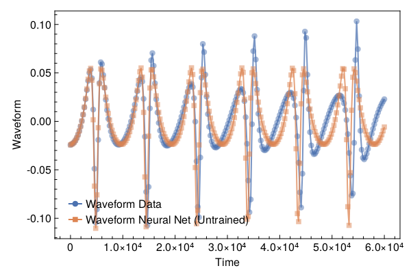
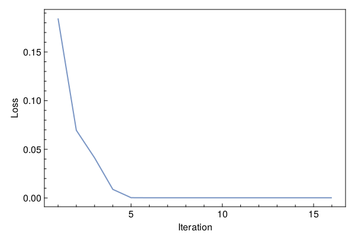
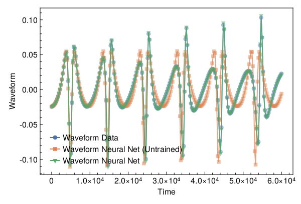

<a id='Training-a-Neural-ODE-to-Model-Gravitational-Waveforms'></a>

# Training a Neural ODE to Model Gravitational Waveforms


This code is adapted from [Astroinformatics/ScientificMachineLearning](https://github.com/Astroinformatics/ScientificMachineLearning/blob/c93aac3a460d70b4cce98836b677fd9b732e94b7/neuralode_gw.ipynb)


The code has been minimally adapted from [Keith et. al. 2021](https://arxiv.org/abs/2102.12695) which originally used Flux.jl


<a id='Package-Imports'></a>

## Package Imports


```julia
using Lux, ComponentArrays, LineSearches, LuxAMDGPU, LuxCUDA, OrdinaryDiffEq,
    Optimization, OptimizationOptimJL, Random, SciMLSensitivity
using CairoMakie, MakiePublication
CUDA.allowscalar(false)
```


<a id='Define-some-Utility-Functions'></a>

## Define some Utility Functions


::: tip


This section can be skipped. It defines functions to simulate the model, however, from a scientific machine learning perspective, isn't super relevant.


:::


We need a very crude 2-body path. Assume the 1-body motion is a newtonian 2-body position vector $r = r_1 - r_2$ and use Newtonian formulas to get $r_1$, $r_2$ (e.g. Theoretical Mechanics of Particles and Continua 4.3)


```julia
function one2two(path, m₁, m₂)
    M = m₁ + m₂
    r₁ = m₂ / M .* path
    r₂ = -m₁ / M .* path
    return r₁, r₂
end
```


```
one2two (generic function with 1 method)
```


Next we define a function to perform the change of variables: $(\chi(t),\phi(t)) \mapsto (x(t),y(t))$


```julia
@views function soln2orbit(soln, model_params=nothing)
    @assert size(soln, 1) ∈ [2, 4] "size(soln,1) must be either 2 or 4"

    if size(soln, 1) == 2
        χ = soln[1, :]
        ϕ = soln[2, :]

        @assert length(model_params)==3 "model_params must have length 3 when size(soln,2) = 2"
        p, M, e = model_params
    else
        χ = soln[1, :]
        ϕ = soln[2, :]
        p = soln[3, :]
        e = soln[4, :]
    end

    r = p ./ (1 .+ e .* cos.(χ))
    x = r .* cos.(ϕ)
    y = r .* sin.(ϕ)

    orbit = vcat(x', y')
    return orbit
end
```


```
soln2orbit (generic function with 2 methods)
```


This function uses second-order one-sided difference stencils at the endpoints; see https://doi.org/10.1090/S0025-5718-1988-0935077-0


```julia
function d_dt(v::AbstractVector, dt)
    a = -3 / 2 * v[1] + 2 * v[2] - 1 / 2 * v[3]
    b = (v[3:end] .- v[1:(end - 2)]) / 2
    c = 3 / 2 * v[end] - 2 * v[end - 1] + 1 / 2 * v[end - 2]
    return [a; b; c] / dt
end
```


```
d_dt (generic function with 1 method)
```


This function uses second-order one-sided difference stencils at the endpoints; see https://doi.org/10.1090/S0025-5718-1988-0935077-0


```julia
function d2_dt2(v::AbstractVector, dt)
    a = 2 * v[1] - 5 * v[2] + 4 * v[3] - v[4]
    b = v[1:(end - 2)] .- 2 * v[2:(end - 1)] .+ v[3:end]
    c = 2 * v[end] - 5 * v[end - 1] + 4 * v[end - 2] - v[end - 3]
    return [a; b; c] / (dt^2)
end
```


```
d2_dt2 (generic function with 1 method)
```


Now we define a function to compute the trace-free moment tensor from the orbit


```julia
function orbit2tensor(orbit, component, mass=1)
    x = orbit[1, :]
    y = orbit[2, :]

    Ixx = x .^ 2
    Iyy = y .^ 2
    Ixy = x .* y
    trace = Ixx .+ Iyy

    if component[1] == 1 && component[2] == 1
        tmp = Ixx .- trace ./ 3
    elseif component[1] == 2 && component[2] == 2
        tmp = Iyy .- trace ./ 3
    else
        tmp = Ixy
    end

    return mass .* tmp
end

function h_22_quadrupole_components(dt, orbit, component, mass=1)
    mtensor = orbit2tensor(orbit, component, mass)
    mtensor_ddot = d2_dt2(mtensor, dt)
    return 2 * mtensor_ddot
end

function h_22_quadrupole(dt, orbit, mass=1)
    h11 = h_22_quadrupole_components(dt, orbit, (1, 1), mass)
    h22 = h_22_quadrupole_components(dt, orbit, (2, 2), mass)
    h12 = h_22_quadrupole_components(dt, orbit, (1, 2), mass)
    return h11, h12, h22
end

function h_22_strain_one_body(dt::T, orbit) where {T}
    h11, h12, h22 = h_22_quadrupole(dt, orbit)

    h₊ = h11 - h22
    hₓ = T(2) * h12

    scaling_const = √(T(π) / 5)
    return scaling_const * h₊, -scaling_const * hₓ
end

function h_22_quadrupole_two_body(dt, orbit1, mass1, orbit2, mass2)
    h11_1, h12_1, h22_1 = h_22_quadrupole(dt, orbit1, mass1)
    h11_2, h12_2, h22_2 = h_22_quadrupole(dt, orbit2, mass2)
    h11 = h11_1 + h11_2
    h12 = h12_1 + h12_2
    h22 = h22_1 + h22_2
    return h11, h12, h22
end

function h_22_strain_two_body(dt::T, orbit1, mass1, orbit2, mass2) where {T}
    # compute (2,2) mode strain from orbits of BH 1 of mass1 and BH2 of mass 2

    @assert abs(mass1 + mass2 - 1.0)<1e-12 "Masses do not sum to unity"

    h11, h12, h22 = h_22_quadrupole_two_body(dt, orbit1, mass1, orbit2, mass2)

    h₊ = h11 - h22
    hₓ = T(2) * h12

    scaling_const = √(T(π) / 5)
    return scaling_const * h₊, -scaling_const * hₓ
end

function compute_waveform(dt::T, soln, mass_ratio, model_params=nothing) where {T}
    @assert mass_ratio≤1 "mass_ratio must be <= 1"
    @assert mass_ratio≥0 "mass_ratio must be non-negative"

    orbit = soln2orbit(soln, model_params)
    if mass_ratio > 0
        m₂ = inv(T(1) + mass_ratio)
        m₁ = mass_ratio * m₂

        orbit₁, orbit₂ = one2two(orbit, m₁, m₂)
        waveform = h_22_strain_two_body(dt, orbit1, mass1, orbit2, mass2)
    else
        waveform = h_22_strain_one_body(dt, orbit)
    end
    return waveform
end
```


```
compute_waveform (generic function with 2 methods)
```


<a id='Simulating-the-True-Model'></a>

## Simulating the True Model


`RelativisticOrbitModel` defines system of odes which describes motion of point like particle in schwarzschild background, uses


$$
u[1] = \chi
$$


$$
u[2] = \phi
$$


where, $p$, $M$, and $e$ are constants


```julia
function RelativisticOrbitModel(u, (p, M, e), t)
    χ, ϕ = u

    numer = (p - 2 - 2 * e * cos(χ)) * (1 + e * cos(χ))^2
    denom = sqrt((p - 2)^2 - 4 * e^2)

    χ̇ = numer * sqrt(p - 6 - 2 * e * cos(χ)) / (M * (p^2) * denom)
    ϕ̇ = numer / (M * (p^(3 / 2)) * denom)

    return [χ̇, ϕ̇]
end

mass_ratio = 0.0         # test particle
u0 = Float64[π, 0.0]     # initial conditions
datasize = 250
tspan = (0.0f0, 6.0f4)   # timespace for GW waveform
tsteps = range(tspan[1], tspan[2]; length=datasize)  # time at each timestep
dt_data = tsteps[2] - tsteps[1]
dt = 100.0
const ode_model_params = [100.0, 1.0, 0.5]; # p, M, e
```


Let's simulate the true model and plot the results using `OrdinaryDiffEq.jl`


```julia
prob = ODEProblem(RelativisticOrbitModel, u0, tspan, ode_model_params)
soln = Array(solve(prob, RK4(); saveat=tsteps, dt, adaptive=false))
waveform = first(compute_waveform(dt_data, soln, mass_ratio, ode_model_params))

fig = with_theme(theme_web()) do
    fig = Figure()
    ax = CairoMakie.Axis(fig[1, 1]; xlabel="Time", ylabel="Waveform")

    l = lines!(ax, tsteps, waveform; linewidth=2, alpha=0.75)
    s = scatter!(ax, tsteps, waveform; markershape=:circle, markeralpha=0.25, alpha=0.5)

    axislegend(ax, [[l, s]], ["Waveform Data"])

    return fig
end
```


<a id='Defiing-a-Neural-Network-Model'></a>

## Defiing a Neural Network Model


Next, we define the neural network model that takes 1 input (time) and has two outputs. We'll make a function `ODE_model` that takes the initial conditions, neural network parameters and a time as inputs and returns the derivatives.


It is typically never recommended to use globals but incase you do use them, make sure to mark them as `const`.


We will deviate from the standard Neural Network initialization and use `WeightInitializers.jl`,


```julia
const nn = Chain(Base.Fix1(broadcast, cos),
    Dense(1 => 32, cos; init_weight=truncated_normal(; std=1e-4)),
    Dense(32 => 32, cos; init_weight=truncated_normal(; std=1e-4)),
    Dense(32 => 2; init_weight=truncated_normal(; std=1e-4)))
ps, st = Lux.setup(MersenneTwister(), nn)
```


```
((layer_1 = NamedTuple(), layer_2 = (weight = Float32[0.000101632635; 5.2334974f-5; -0.00017696594; -0.00025145398; -0.00019044407; 1.3506138f-5; 4.590075f-5; 9.852524f-6; 5.0006754f-5; 5.369393f-5; -0.000182656; 2.6127776f-5; 1.5689744f-5; 8.520892f-5; -8.346113f-5; 5.3749438f-5; -4.7080404f-5; 1.6488497f-5; -5.9236096f-5; -8.552739f-5; -5.0650986f-5; -5.680428f-5; -2.2173142f-5; -0.00013959652; 4.738465f-5; -4.3289503f-5; -0.00013299756; 2.016237f-5; -2.4074261f-5; 1.3647609f-5; -4.3923803f-5; -0.000102781654;;], bias = Float32[0.0; 0.0; 0.0; 0.0; 0.0; 0.0; 0.0; 0.0; 0.0; 0.0; 0.0; 0.0; 0.0; 0.0; 0.0; 0.0; 0.0; 0.0; 0.0; 0.0; 0.0; 0.0; 0.0; 0.0; 0.0; 0.0; 0.0; 0.0; 0.0; 0.0; 0.0; 0.0;;]), layer_3 = (weight = Float32[-0.00012499814 -5.5174354f-5 0.00025222244 -0.0001181956 0.00018368811 -0.00015394932 5.6970795f-5 9.756226f-5 6.4186286f-5 -7.7385936f-5 7.164363f-5 6.941013f-5 -0.0002666547 9.401483f-5 -0.000100155245 4.0150047f-5 -0.00019633533 2.8400409f-5 -2.1570106f-5 9.289817f-5 -2.8815895f-5 -9.134036f-5 0.00010371936 -0.00014500626 -6.1563594f-5 1.8953715f-5 -1.4008756f-5 1.3725941f-5 0.0001005367 2.7678372f-5 -8.469111f-5 -5.2260526f-5; -1.3294088f-5 6.404015f-5 -2.6005542f-5 -9.78059f-5 -0.00016061364 -6.05017f-5 -7.831835f-5 6.242251f-5 -8.248891f-5 -0.00012481892 2.4185227f-5 5.9856244f-5 5.9899106f-5 4.643155f-5 0.00019483149 -6.283613f-5 -0.00011991952 -0.00017630853 -4.6644946f-6 -1.0901919f-5 -8.310025f-5 -0.000106461644 -6.981718f-5 -8.105656f-5 2.1667314f-5 -7.7608616f-5 2.5112648f-5 1.3528363f-5 -5.5219454f-5 -6.218149f-5 2.23406f-5 1.4615373f-5; 3.9064074f-5 -2.2611508f-5 -7.812866f-5 3.0758918f-5 -5.3719956f-5 6.555932f-5 3.0416766f-5 -3.5834794f-6 0.000114384784 2.706172f-5 -4.3638047f-5 -7.864455f-5 3.9201757f-5 4.7885882f-5 -9.12516f-5 -0.00016784437 -0.00013246523 1.0527455f-5 -3.8680515f-5 -1.1631699f-5 0.00013962795 -2.0326643f-5 -9.7707656f-5 -0.00011942068 -8.681603f-5 8.130218f-6 -2.2642425f-6 -0.00012546564 2.0894857f-5 -1.5739115f-5 5.2294028f-5 -8.044674f-5; -0.00016109906 -3.872583f-5 -7.4892014f-5 2.22487f-5 -0.0001976031 -9.319992f-5 -4.9939787f-5 0.00011237168 -2.3953207f-5 8.284627f-5 0.000107994616 -0.00014720269 2.8781977f-5 2.4001612f-5 3.6668458f-5 3.958009f-5 -1.5364774f-5 -0.00023974628 0.00011140926 -4.394493f-5 -6.307176f-5 -6.184776f-6 -7.0376016f-5 3.8718903f-5 5.121197f-5 -0.0001458091 -6.87636f-5 -0.00015616164 0.00015205563 -6.637695f-5 -1.5565483f-5 -0.00010938432; 0.0001251193 -0.0002612378 0.00017592302 -7.072228f-5 3.5289253f-5 2.6418771f-5 -2.4075152f-5 6.7944734f-6 -3.4832065f-5 1.8971057f-5 4.9405942f-5 -7.8441204f-5 0.00010160895 -0.00014767662 -3.8817896f-5 0.000110890905 -7.812578f-5 -2.5629994f-5 -5.96134f-5 7.2323846f-6 -5.879466f-5 3.1814834f-5 -0.00016070259 0.00013459082 2.4506695f-5 7.089586f-5 0.000134714 3.0395393f-5 -0.00013970316 0.00014788241 3.4534023f-5 8.853317f-5; 4.6115034f-5 3.180239f-6 6.4729276f-5 -0.00017189146 -0.00012473132 -2.9152676f-5 -0.00012324633 4.3641663f-5 2.8381339f-5 -6.9304246f-5 3.3780852f-5 0.0001751344 -0.00015308264 9.868469f-6 -0.00012914608 0.0001771212 -0.00014107348 -6.464334f-5 5.526094f-5 -2.2818294f-5 3.509406f-5 0.00013084132 0.00014396953 4.7502694f-5 -7.257834f-5 -1.300552f-5 -2.5813304f-5 -6.594779f-5 -3.4352084f-5 -9.600001f-6 -8.204131f-5 -9.1877955f-6; 4.889101f-5 7.92719f-5 5.1575273f-5 -0.000116798365 -0.00014494258 -9.241226f-5 7.4279924f-5 -0.00011744006 -4.0818104f-5 -0.00013260906 -5.75278f-5 6.3570515f-6 9.167559f-5 3.9489427f-5 -0.00016099567 6.978138f-5 -6.003957f-6 2.3288333f-6 -0.00014454463 6.560697f-5 1.5576916f-5 7.224972f-5 4.7260753f-5 -1.2572658f-5 0.00014721179 -0.00011231293 3.7444453f-5 8.553669f-5 -4.2762313f-5 6.372595f-5 -0.00022963597 5.193618f-5; -2.7551407f-5 3.9847033f-5 -0.00012700495 0.00016535737 -2.4106116f-6 1.3821779f-5 -9.380756f-5 -9.8260556f-5 3.728293f-5 6.7604815f-5 1.3288752f-5 8.390474f-6 -9.893511f-5 6.41857f-5 -0.00014514208 9.026272f-5 4.5636563f-5 0.0001479396 1.2356546f-6 -7.727887f-6 0.00026890787 -2.9121313f-5 -6.4253785f-5 -4.4148474f-5 -0.00011313714 2.5300557f-7 -0.00011580583 -7.974192f-5 -5.0394232f-5 0.00014576128 -5.8180183f-5 -8.279853f-5; 4.1715546f-5 0.00011801962 0.00013543078 -0.00015902836 6.793332f-5 -5.5400553f-5 8.949678f-5 -0.000105300416 -0.00010124301 7.948872f-5 9.073602f-5 -5.935993f-5 -7.219988f-5 0.00015938259 -2.9585459f-5 0.0002790709 -2.5603285f-5 -0.00010098115 1.9860074f-5 -1.5773727f-5 6.765214f-5 0.00019247989 -6.996172f-5 4.9749506f-5 2.315668f-5 -5.0114733f-5 3.878434f-6 6.5891974f-5 -4.891482f-5 -2.121873f-5 -9.5947384f-5 -0.00014044742; -0.000102500104 -8.5975465f-5 2.3712251f-5 1.530101f-5 7.2777846f-5 -4.6829042f-5 -2.781675f-5 8.035336f-5 -8.600583f-5 -0.000104385355 1.8660032f-5 -2.0101688f-5 0.00010739682 9.538673f-6 0.00010947937 -6.8754514f-7 -2.7179181f-5 4.9450377f-5 0.00016462103 3.709119f-5 9.5840005f-5 0.00018727331 -6.9825684f-5 0.000238537 -0.00015266657 9.329393f-5 -2.9408155f-5 6.8396184f-5 -0.0001022248 -9.978768f-5 7.758188f-6 -2.3054788f-5; -7.5089993f-6 0.00016092548 -5.53287f-5 0.00011047244 9.649379f-5 0.00015378123 5.006805f-5 -5.5777193f-5 -7.3030424f-5 -0.00011610843 5.3694515f-5 -0.000119497716 -2.6641594f-5 -1.9687699f-5 -4.0457482f-5 -3.971139f-5 -8.0409125f-5 -0.00012648363 4.2245883f-5 -5.2569605f-5 -0.00014918022 -3.213152f-5 3.295109f-5 6.840478f-6 0.00012216289 5.3552783f-5 -0.000103290244 -2.4311162f-6 0.00010493054 2.3201892f-5 -2.558297f-5 -0.000115981; 0.0001672694 -4.2973694f-5 -0.00016662372 -0.000119023585 0.00013643825 -8.860673f-5 0.00013377336 7.694981f-5 -0.00011051371 1.0156591f-5 2.7903945f-5 -4.168885f-5 -7.4698946f-6 -0.00010053977 -6.1418f-5 -5.2696523f-5 -5.458399f-5 -4.4012242f-5 -6.1630424f-5 2.5473037f-5 1.9319252f-5 0.0001556612 0.00011186294 -4.4772827f-5 1.270754f-5 3.598866f-5 2.9404473f-5 -0.00016609271 -1.6373011f-5 -1.4631022f-6 -2.9120689f-5 -7.204218f-5; -5.681204f-5 -4.382086f-5 -8.269707f-5 -0.00014945253 0.00016316707 -0.00012468541 -8.961869f-5 0.00013331743 7.190408f-7 -0.00016548391 0.00016236737 -0.00012945816 6.886719f-5 -9.592253f-5 -0.000103711165 9.977878f-5 0.00019597563 -3.389274f-5 7.762255f-5 6.923006f-5 4.5942354f-5 -6.265531f-5 0.00013068163 -0.000100480946 -8.509634f-5 2.5508165f-5 0.000215742 -0.00014330291 0.00029883636 7.973847f-5 -7.9375f-5 9.944654f-5; 0.00013040882 6.8616832f-6 -5.7820413f-5 -6.493562f-6 -9.1950045f-5 -8.715275f-6 0.00010186756 -0.00016918597 0.00017763268 4.3541935f-5 -3.71435f-5 -8.959561f-5 0.00018555712 -8.879977f-5 3.1757412f-5 4.0750336f-5 -5.1699928f-5 4.1603143f-5 7.626658f-5 -8.139481f-6 -8.7277665f-5 -5.286046f-5 1.319883f-5 -5.836053f-5 8.238289f-5 0.00017117699 -4.4243593f-6 0.000111154506 -5.884084f-5 -8.6404834f-5 -0.00013256898 -7.8856545f-5; -3.5093075f-5 0.00010770997 0.00012072492 0.00014673677 -0.00010515856 -6.609315f-5 -0.00014090241 -8.428708f-6 1.7777511f-5 -0.00012052218 7.046649f-5 -1.7326278f-5 6.168639f-6 -3.0381967f-5 -0.0001105059 -5.7402183f-5 -0.000114732655 4.522072f-5 6.1016985f-6 6.561204f-5 -9.9991616f-5 8.202802f-6 -0.00010541415 4.4781547f-5 -2.6129725f-5 -0.00011503477 1.7361617f-5 -0.00015446378 -7.899743f-5 -9.131039f-5 6.467435f-5 -4.1701693f-5; 5.1447798f-5 -3.9246195f-5 6.671839f-5 -8.8951725f-5 1.50354645f-5 2.4880439f-5 -0.00010382466 -2.891496f-5 3.635269f-5 -1.7313215f-6 -0.000120721954 -1.2275535f-5 4.018085f-5 4.874111f-5 4.0645486f-5 -0.00011572489 -2.5500292f-5 -7.5109936f-5 0.00014090976 0.00010362868 -4.840497f-7 -9.6669435f-5 -5.072754f-5 0.00012395026 0.0002083094 1.4643945f-5 -0.00010114184 -4.6489968f-5 -5.1066086f-6 4.760946f-5 0.00010709486 -2.4369447f-6; 3.9397568f-5 -0.000102482874 5.0238805f-6 -0.00010057822 -1.259085f-5 -2.1038755f-5 1.85162f-5 -8.415082f-5 0.00010896368 -6.963048f-5 4.1990013f-5 3.1318872f-5 6.967724f-5 -8.859983f-5 3.028416f-5 -8.209521f-5 7.019691f-5 -2.3964001f-5 -0.00016505257 5.794552f-5 -9.0228954f-5 -0.00010954931 -9.570217f-5 1.5201611f-5 -0.00023947311 -9.475043f-5 9.382575f-5 -2.979634f-5 0.00014207579 -2.2440823f-5 1.8828174f-5 -8.052541f-6; 1.9641697f-5 4.8046197f-5 1.387711f-5 -6.6250536f-6 3.286318f-5 0.0001499178 1.2949738f-6 4.4376302f-5 -0.00020187309 0.00015892423 1.8754117f-5 2.2712988f-5 0.00012838868 -5.696714f-5 0.000112177 -9.128572f-5 1.8531826f-5 4.107302f-5 -3.4984445f-5 -7.652543f-6 6.761755f-5 -0.00019888964 0.00020391242 -3.8663256f-5 -6.631048f-5 -8.5815045f-6 -0.00018426697 7.0608745f-5 0.00010104376 -0.0001553138 2.8209035f-5 2.2230659f-5; 7.264637f-5 -4.774893f-5 -2.3298196f-6 1.8809744f-5 1.33715075f-5 4.182993f-6 -0.000108908294 -7.875855f-5 5.7036286f-5 9.460275f-5 0.00019018892 -0.00012676635 -0.00020355436 -0.00015077427 -4.896777f-5 -3.0004667f-5 8.156906f-5 0.00017081779 -3.938423f-5 -0.00010676744 -1.9607975f-5 -5.1707306f-5 -6.458263f-5 -0.00017026898 -0.00013729709 -4.3440214f-5 -3.0494859f-5 -0.000106474494 -0.0002001849 3.7813556f-5 6.600206f-5 -0.0001422494; 4.6361038f-5 -0.00013779434 7.519455f-5 0.00014481916 -1.2490402f-7 -0.0001288831 -6.9574395f-5 7.5317424f-5 1.9972758f-5 6.932324f-5 2.833639f-5 0.0001291031 -9.5736235f-5 6.475286f-8 0.00025226056 -9.5876814f-5 4.645405f-5 0.00012551896 0.00014226953 -7.916316f-5 -7.152275f-5 7.336798f-6 -0.000113013004 8.107822f-6 2.4153967f-5 5.826893f-5 9.0880574f-5 0.00016213402 -1.371819f-5 -0.00020219786 -2.2979093f-5 -0.00010233249; -8.143851f-5 8.936845f-5 -0.000112330956 -0.00018441994 1.0449905f-5 3.404871f-5 -0.00015988476 -7.435669f-5 -0.00021131201 1.8368f-5 5.5734226f-6 0.00014844032 -9.753523f-5 -0.00011979524 8.5781474f-5 4.9170398f-5 -0.00015794899 3.283098f-5 3.0765244f-5 -5.3598626f-5 3.272598f-5 0.00013257106 -8.1533966f-5 -6.698551f-5 4.400365f-5 4.8415972f-5 4.3747124f-5 0.0001244512 -4.376383f-6 1.9782701f-5 -2.9888253f-5 -0.00018697628; -0.0001791262 2.5796653f-5 -7.021258f-5 -0.00014891707 -7.3247116f-5 -3.8218983f-5 0.0002715752 -3.4545315f-5 2.3023951f-5 -6.110888f-5 -3.0543728f-5 -0.0001427493 9.590095f-6 0.0001051057 0.00020728237 -8.0003985f-5 -4.4440403f-6 -6.7756795f-5 -1.0081594f-5 -0.00013333531 -3.9402188f-5 8.194349f-5 6.254543f-5 -0.00028697142 8.955245f-5 2.8434944f-5 -7.07306f-5 4.0113005f-6 -4.452529f-5 5.7559464f-5 -0.00013328466 2.7371716f-5; 2.9682747f-5 0.0002155153 0.00014365463 -6.5110915f-5 -0.000107835695 1.2586664f-5 2.173104f-5 4.4459706f-5 -0.00011138475 5.2345014f-5 0.00012483704 -6.0271273f-6 3.103128f-5 6.410454f-5 -0.00010702171 0.00028511148 -2.5458992f-5 0.00035796626 -0.000103936094 -0.00012919308 -0.00013109748 0.00018684687 0.00012318147 6.999527f-5 -3.814875f-5 0.00022615299 -5.8908394f-5 -0.00012312502 -0.000115921364 -6.6883484f-5 7.388453f-6 2.9072651f-5; -5.0127914f-5 0.00012520413 6.997325f-5 -5.715636f-5 -2.4090288f-5 1.8334087f-5 -3.227566f-5 -5.491477f-5 -4.123996f-5 -0.0001112004 7.614093f-6 -1.6180795f-5 -1.5700029f-5 3.2492848f-5 -1.3313171f-5 2.7750846f-5 -5.7635374f-5 4.4322856f-6 4.632627f-5 -0.000103416045 0.00013504065 -8.5187705f-5 -2.382681f-5 3.3713222f-5 0.00012349828 -0.00010870909 -7.2068215f-5 -4.2717067f-5 -0.00013613193 -2.6210957f-5 -1.48142535f-5 -0.00012995259; -0.0001230051 -4.078709f-5 0.00016450991 0.00018732563 -2.404907f-5 -4.8449724f-6 2.5507918f-5 8.2164835f-5 -7.778011f-5 3.8021844f-5 0.00015479692 2.1217324f-5 -0.000179932 0.00020794479 1.4134343f-6 -5.226473f-6 -3.0367197f-5 -1.0795816f-5 1.3038792f-6 -0.00013208158 -3.0598272f-5 7.4338177f-6 8.347941f-5 -0.00015114939 4.8326187f-5 2.5778027f-5 0.0001713163 0.0001485014 0.00012576133 -3.514329f-5 2.3084955f-5 2.1371747f-5; 1.545304f-5 -9.764482f-5 3.005787f-5 -0.0001494278 -0.00014123209 -9.353556f-5 1.7139878f-6 0.00011855489 -9.883966f-5 1.6530905f-5 2.2795384f-5 -0.00014989851 -6.803862f-5 -2.11009f-5 5.5285975f-5 0.00010450187 0.00013949351 -1.4607414f-6 -4.8982693f-5 0.00017861971 8.644729f-6 -4.6586967f-5 0.00013943804 -3.5483972f-5 5.001654f-5 -1.2843108f-5 2.2551765f-5 -0.00019517176 9.0507965f-5 -2.6583793f-5 3.1756532f-5 -2.7771435f-5; 1.3294751f-5 -3.493445f-5 -7.0575086f-5 -0.0001230402 2.1024582f-5 -1.925517f-5 0.00011024737 -0.00021601847 -1.9014138f-5 -2.8290573f-5 7.0152f-5 -0.00010282038 9.866132f-5 1.6100268f-5 -6.087491f-5 -3.000148f-6 0.00011216601 0.00020711517 2.3125742f-5 -0.00010458197 4.5308647f-5 0.00012111873 2.562366f-6 4.865068f-5 4.8036334f-5 6.927909f-5 0.00018455432 -0.00010039643 4.7416375f-5 -3.7694957f-5 -8.836191f-6 9.9982644f-5; 0.00021948594 2.133772f-5 3.6972655f-5 -0.00015673129 2.4946585f-5 4.853708f-6 -2.2883778f-5 -9.4486466f-5 0.00014112782 4.5672146f-5 7.492125f-5 -5.765026f-5 8.227427f-5 -4.8764265f-5 7.026956f-5 -9.5348914f-5 -6.703817f-5 -2.1525639f-5 2.6896922f-5 8.127684f-5 -0.00018530915 -5.6385845f-5 -6.220829f-5 -1.5526408f-5 0.00021880983 -0.00012883575 -3.7746806f-5 0.00019213508 -3.789952f-5 2.1979235f-5 -6.396486f-5 2.2171826f-5; -2.004156f-6 2.2635133f-7 9.397044f-5 0.00019881627 -6.677104f-5 9.761492f-7 0.00022620776 -0.00018222719 -7.3937495f-5 0.0001514998 -0.00011451415 0.0001717855 -0.000120083736 1.23456275f-5 -9.731516f-5 -0.00021925726 -0.000115670446 5.134255f-6 -0.00016302257 -5.1751405f-5 -7.761673f-5 6.4828244f-5 -0.00011258002 -3.6565823f-5 5.2758434f-5 0.000113246126 6.115484f-5 0.00011461051 1.7754319f-5 5.3254455f-5 2.9256455f-5 -9.493671f-5; -9.4020405f-5 0.00026144774 -3.559948f-5 5.4331093f-5 0.000100270525 1.2988644f-5 5.9385555f-5 0.0001242633 -5.362085f-6 -0.00013077313 -2.2014165f-5 0.00017273742 -2.754601f-6 -6.1746374f-5 7.815871f-5 6.406157f-5 -5.4233697f-5 -4.3871223f-5 -0.00017182197 3.8807426f-5 -0.0002005296 0.000101963895 -0.00014317081 2.6169055f-5 -0.000132981 2.5095193f-5 0.00013239161 -6.9523803f-6 2.4903924f-5 5.2957042f-5 -2.1739148f-5 -6.599303f-5; 7.845153f-5 -8.885009f-5 -5.3683125f-5 5.8424524f-5 -0.00022591885 -9.097785f-5 0.0001604792 -8.1157326f-5 0.00016101281 -8.0501806f-5 7.0572365f-5 -0.00011070708 -0.000108197964 5.353671f-5 6.0426188f-5 -9.8733006f-5 8.3647865f-5 2.1595279f-5 -0.00011171916 -6.4878427f-6 -9.349253f-5 0.00018887283 6.643804f-5 -9.2515766f-5 -7.896318f-5 0.00014020283 6.251181f-6 -9.1120404f-5 8.547812f-5 0.00016991516 -0.0001090048 -4.4834207f-5; -9.157038f-6 4.8120426f-5 8.4912965f-5 -0.0001501353 9.94434f-5 -0.00010267793 -0.00012074673 5.494653f-5 -4.272964f-5 5.5126762f-5 -0.00010256703 -2.7567485f-5 8.8160894f-5 9.589612f-5 -1.2061741f-5 -0.00012204607 -7.3742245f-5 7.2417024f-5 -3.9846676f-5 1.757634f-5 0.00016453872 -3.2435615f-5 -8.201759f-5 -2.0529787f-5 2.2926111f-5 -3.886046f-5 -5.5284025f-5 -8.24013f-6 -1.8656898f-6 -0.00024281046 -0.000102258775 -5.8850328f-5], bias = Float32[0.0; 0.0; 0.0; 0.0; 0.0; 0.0; 0.0; 0.0; 0.0; 0.0; 0.0; 0.0; 0.0; 0.0; 0.0; 0.0; 0.0; 0.0; 0.0; 0.0; 0.0; 0.0; 0.0; 0.0; 0.0; 0.0; 0.0; 0.0; 0.0; 0.0; 0.0; 0.0;;]), layer_4 = (weight = Float32[4.0948213f-5 1.4518521f-5 7.287629f-5 3.133918f-5 -0.000100520505 0.00015240432 -7.577789f-5 0.00013981783 8.723404f-6 -0.00010795303 -0.00012404333 8.135399f-5 0.00010114921 -2.0810388f-5 7.3555144f-5 -0.00014858831 0.00016867685 5.825073f-5 5.4522232f-5 0.00014576051 1.3052171f-7 -3.9260653f-5 2.8382428f-5 2.8275022f-5 1.9140758f-5 0.00014024589 -2.315146f-5 5.2135198f-5 -6.770722f-5 -9.714024f-5 -6.087786f-5 -8.021111f-5; -6.509397f-7 -5.266958f-6 -0.00012477928 -2.3199744f-5 -5.0088274f-5 -4.0840125f-5 7.160212f-5 0.00012150754 -0.00020954083 -0.00016585708 -0.00013203255 0.00014842278 -0.000106793064 4.695946f-5 0.00025498247 0.00023510525 -1.2280051f-5 2.8274899f-5 -4.6153455f-5 -3.9639235f-5 2.6834157f-5 0.00011869807 -7.8644225f-5 -4.5641355f-6 4.854277f-5 0.00012315754 -0.00012420623 3.3654494f-5 3.118223f-5 -4.6030636f-5 -5.4865715f-5 -4.563915f-5], bias = Float32[0.0; 0.0;;])), (layer_1 = NamedTuple(), layer_2 = NamedTuple(), layer_3 = NamedTuple(), layer_4 = NamedTuple()))
```


Similar to most DL frameworks, Lux defaults to using `Float32`, however, in this case we need Float64


```julia
const params = ComponentArray{Float64}(ps)
```


```
ComponentVector{Float64}(layer_1 = Float64[], layer_2 = (weight = [0.00010163263505091891; 5.2334973588585854e-5; -0.00017696594295557588; -0.00025145398103632033; -0.00019044407235924155; 1.3506138202501461e-5; 4.5900749682914466e-5; 9.85252427199157e-6; 5.000675446353853e-5; 5.369392965803854e-5; -0.00018265600374434143; 2.6127776436624117e-5; 1.5689744031988084e-5; 8.520892151864246e-5; -8.346112736035138e-5; 5.374943793867715e-5; -4.708040432888083e-5; 1.6488496839883737e-5; -5.923609569435939e-5; -8.552739018341526e-5; -5.0650985940592363e-5; -5.680428148480132e-5; -2.217314249719493e-5; -0.0001395965227857232; 4.738464849651791e-5; -4.328950308263302e-5; -0.0001329975639237091; 2.016236976487562e-5; -2.4074261091300286e-5; 1.3647609193867538e-5; -4.3923802877543494e-5; -0.00010278165427735075;;], bias = [0.0; 0.0; 0.0; 0.0; 0.0; 0.0; 0.0; 0.0; 0.0; 0.0; 0.0; 0.0; 0.0; 0.0; 0.0; 0.0; 0.0; 0.0; 0.0; 0.0; 0.0; 0.0; 0.0; 0.0; 0.0; 0.0; 0.0; 0.0; 0.0; 0.0; 0.0; 0.0;;]), layer_3 = (weight = [-0.00012499814329203218 -5.5174354201881215e-5 0.0002522224385756999 -0.00011819560313597322 0.00018368811288382858 -0.00015394932415802032 5.697079541278072e-5 9.75622606347315e-5 6.418628618121147e-5 -7.738593558315188e-5 7.164363341871649e-5 6.94101327098906e-5 -0.00026665470795705914 9.40148311201483e-5 -0.00010015524458140135 4.0150047425413504e-5 -0.0001963353279279545 2.8400409064488485e-5 -2.1570105673163198e-5 9.289816807722673e-5 -2.8815895348088816e-5 -9.13403564481996e-5 0.00010371935786679387 -0.0001450062554795295 -6.156359449960291e-5 1.8953714970848523e-5 -1.4008755897521041e-5 1.3725941244047135e-5 0.00010053670121124014 2.767837213468738e-5 -8.469111344311386e-5 -5.226052599027753e-5; -1.3294087693793699e-5 6.40401485725306e-5 -2.600554216769524e-5 -9.780590335140005e-5 -0.00016061363567132503 -6.050170122762211e-5 -7.831834955140948e-5 6.242250674404204e-5 -8.248890662798658e-5 -0.00012481892190407962 2.4185226720874198e-5 5.985624375171028e-5 5.9899106418015435e-5 4.643154898076318e-5 0.00019483148935250938 -6.283613038249314e-5 -0.00011991951760137454 -0.00017630853108130395 -4.664494554162957e-6 -1.0901919267780613e-5 -8.31002471386455e-5 -0.00010646164446370676 -6.981717888265848e-5 -8.105656161205843e-5 2.1667314285878092e-5 -7.760861626593396e-5 2.511264756321907e-5 1.3528362615033984e-5 -5.521945422515273e-5 -6.218149064807221e-5 2.2340600480674766e-5 1.4615373402193654e-5; 3.906407437170856e-5 -2.261150802951306e-5 -7.812865806045011e-5 3.075891800108366e-5 -5.3719955758424476e-5 6.55593175906688e-5 3.041676609427668e-5 -3.5834793834510492e-6 0.00011438478395575657 2.7061720174970105e-5 -4.3638046918204054e-5 -7.864455255912617e-5 3.920175731764175e-5 4.7885881940601394e-5 -9.125159704126418e-5 -0.0001678443659329787 -0.00013246522576082498 1.0527454833209049e-5 -3.8680514990119264e-5 -1.1631698725977913e-5 0.00013962795492261648 -2.0326642697909847e-5 -9.770765609573573e-5 -0.00011942067794734612 -8.681602776050568e-5 8.130217793222982e-6 -2.264242539240513e-6 -0.0001254656381206587 2.0894856788800098e-5 -1.5739115042379126e-5 5.2294028137112036e-5 -8.044674177654088e-5; -0.0001610990584595129 -3.87258296541404e-5 -7.489201379939914e-5 2.224869967903942e-5 -0.00019760310533456504 -9.319991659140214e-5 -4.993978654965758e-5 0.00011237167927902192 -2.395320734649431e-5 8.284627256216481e-5 0.00010799461597343907 -0.00014720269246026874 2.8781976652680896e-5 2.400161247351207e-5 3.666845805128105e-5 3.958008892368525e-5 -1.5364774299087003e-5 -0.00023974628129508346 0.00011140925926156342 -4.3944928620476276e-5 -6.307176226982847e-5 -6.184775884321425e-6 -7.037601608317345e-5 3.8718902942491695e-5 5.121196954860352e-5 -0.00014580909919459373 -6.876359839225188e-5 -0.0001561616372782737 0.00015205562522169203 -6.637695332756266e-5 -1.5565483408863656e-5 -0.00010938431660179049; 0.00012511930253822356 -0.00026123778661713004 0.00017592302174307406 -7.072227890603244e-5 3.528925299178809e-5 2.641877108544577e-5 -2.4075152396108024e-5 6.794473392801592e-6 -3.483206455712207e-5 1.897105721582193e-5 4.940594226354733e-5 -7.844120409572497e-5 0.00010160895180888474 -0.0001476766192354262 -3.881789598381147e-5 0.00011089090548921376 -7.812577678123489e-5 -2.562999361543916e-5 -5.9613401390379295e-5 7.232384632516187e-6 -5.8794659707928076e-5 3.181483407388441e-5 -0.00016070259152911603 0.00013459082401823252 2.4506694899173453e-5 7.089586142683402e-5 0.00013471400598064065 3.0395392968785018e-5 -0.00013970315922051668 0.00014788241242058575 3.453402314335108e-5 8.853316830936819e-5; 4.611503391060978e-5 3.1802389912627405e-6 6.472927634604275e-5 -0.0001718914572848007 -0.00012473131937440485 -2.915267577918712e-5 -0.00012324632552918047 4.3641663069138303e-5 2.838133877958171e-5 -6.930424569873139e-5 3.378085239091888e-5 0.00017513439524918795 -0.00015308264119084924 9.86846862360835e-6 -0.00012914607941638678 0.00017712119733914733 -0.00014107348397374153 -6.464334001066163e-5 5.5260941735468805e-5 -2.281829438288696e-5 3.509406087687239e-5 0.0001308413193328306 0.00014396953338291496 4.7502693632850423e-5 -7.257833931362256e-5 -1.3005519576836377e-5 -2.58133040915709e-5 -6.594778824364766e-5 -3.4352084185229614e-5 -9.600001249054912e-6 -8.204131154343486e-5 -9.187795512843877e-6; 4.889100819127634e-5 7.927190017653629e-5 5.157527266419493e-5 -0.0001167983646155335 -0.00014494257629849017 -9.241225779987872e-5 7.427992386510596e-5 -0.0001174400604213588 -4.0818104025674984e-5 -0.00013260905689094216 -5.7527799071976915e-5 6.357051461236551e-6 9.167558891931549e-5 3.948942685383372e-5 -0.00016099566710181534 6.97813811711967e-5 -6.003956968925195e-6 2.3288332613446983e-6 -0.00014454462507274002 6.560696783708408e-5 1.5576915757264942e-5 7.224972068797797e-5 4.7260753490263596e-5 -1.2572658306453377e-5 0.00014721178740728647 -0.000112312933197245 3.744445348274894e-5 8.553668885724619e-5 -4.276231265976094e-5 6.372595089487731e-5 -0.00022963597439229488 5.193617835175246e-5; -2.7551406674319878e-5 3.984703289461322e-5 -0.00012700495426543057 0.00016535737086087465 -2.4106116143229883e-6 1.3821779248246457e-5 -9.380756091559306e-5 -9.826055611483753e-5 3.7282930861692876e-5 6.76048148307018e-5 1.3288751688378397e-5 8.390474249608815e-6 -9.893511014524847e-5 6.418569682864472e-5 -0.00014514208305627108 9.026272164192051e-5 4.563656329992227e-5 0.00014793960144743323 1.2356546221781173e-6 -7.727887350483797e-6 0.00026890786830335855 -2.9121312763891183e-5 -6.425378523999825e-5 -4.414847353473306e-5 -0.00011313713912386447 2.5300556671936647e-7 -0.0001158058294095099 -7.974191976245493e-5 -5.039423194830306e-5 0.00014576128160115331 -5.8180183259537444e-5 -8.279852772830054e-5; 4.171554610366002e-5 0.00011801961954915896 0.0001354307751171291 -0.00015902836457826197 6.793331704102457e-5 -5.5400552810169756e-5 8.949678158387542e-5 -0.00010530041618039832 -0.00010124300752067938 7.948871643748134e-5 9.073602268472314e-5 -5.935992885497399e-5 -7.219988037832081e-5 0.00015938258729875088 -2.958545883302577e-5 0.0002790708967950195 -2.5603285394026898e-5 -0.00010098115308210254 1.9860073734889738e-5 -1.5773726772749797e-5 6.765213765902445e-5 0.00019247988529969007 -6.996172305662185e-5 4.974950570613146e-5 2.3156679162639193e-5 -5.011473331251182e-5 3.878434199577896e-6 6.589197437278926e-5 -4.891481876256876e-5 -2.121872967109084e-5 -9.594738367013633e-5 -0.0001404474169248715; -0.00010250010382151231 -8.597546548116952e-5 2.37122512771748e-5 1.5301009625545703e-5 7.277784607140347e-5 -4.682904182118364e-5 -2.7816749934572726e-5 8.035336213652045e-5 -8.600582805229351e-5 -0.00010438535537105054 1.866003185568843e-5 -2.010168827837333e-5 0.00010739682329585776 9.538673111819662e-6 0.00010947936971206218 -6.875451390442322e-7 -2.717918141570408e-5 4.945037653669715e-5 0.00016462102939840406 3.709119118866511e-5 9.584000508766621e-5 0.000187273311894387 -6.982568447710946e-5 0.00023853700258769095 -0.00015266657283063978 9.329392923973501e-5 -2.940815465990454e-5 6.839618436060846e-5 -0.00010222480341326445 -9.978767775464803e-5 7.758188075968064e-6 -2.3054788471199572e-5; -7.508999260608107e-6 0.00016092548321466893 -5.532869909075089e-5 0.00011047244333894923 9.649379353504628e-5 0.00015378123498521745 5.0068050768459216e-5 -5.577719275606796e-5 -7.303042366402224e-5 -0.00011610842921072617 5.3694515372626483e-5 -0.0001194977157865651 -2.664159364940133e-5 -1.968769902305212e-5 -4.0457482100464404e-5 -3.971139085479081e-5 -8.040912507567555e-5 -0.00012648363190237433 4.224588337820023e-5 -5.2569605031749234e-5 -0.00014918022498022765 -3.2131520129041746e-5 3.295109127066098e-5 6.840477908554021e-6 0.00012216289178468287 5.3552783356281e-5 -0.00010329024371458218 -2.431116172374459e-6 0.0001049305428750813 2.320189196325373e-5 -2.5582969101378694e-5 -0.00011598099808907136; 0.0001672694052103907 -4.2973693780368194e-5 -0.00016662372217979282 -0.00011902358528459445 0.0001364382478641346 -8.860672824084759e-5 0.0001337733556283638 7.694980740780011e-5 -0.00011051371257053688 1.0156591088161804e-5 2.79039450106211e-5 -4.168885061517358e-5 -7.469894626410678e-6 -0.00010053977166535333 -6.14180025877431e-5 -5.269652319839224e-5 -5.4583990277023986e-5 -4.4012242142343894e-5 -6.163042417028919e-5 2.5473036657785997e-5 1.9319251805427484e-5 0.00015566119691357017 0.0001118629370466806 -4.4772827095584944e-5 1.270754000870511e-5 3.5988661693409085e-5 2.9404473025351763e-5 -0.0001660927082411945 -1.6373011021642014e-5 -1.4631021940658684e-6 -2.9120688850525767e-5 -7.2042181272991e-5; -5.681204129359685e-5 -4.382085899123922e-5 -8.269707177532837e-5 -0.00014945253496989608 0.0001631670747883618 -0.00012468540808185935 -8.961869025370106e-5 0.00013331742957234383 7.19040826879791e-7 -0.00016548391431570053 0.0001623673742869869 -0.00012945815979037434 6.886719347676262e-5 -9.592252899892628e-5 -0.0001037111651385203 9.977877925848588e-5 0.00019597563368733972 -3.3892738429130986e-5 7.762254972476512e-5 6.923006003489718e-5 4.5942353608552366e-5 -6.265530828386545e-5 0.0001306816266151145 -0.00010048094554804265 -8.50963406264782e-5 2.5508164981147274e-5 0.00021574199490714818 -0.00014330291014630347 0.0002988363557960838 7.97384709585458e-5 -7.937500049592927e-5 9.944653720594943e-5; 0.00013040882186032832 6.861683232273208e-6 -5.782041262136772e-5 -6.493562068499159e-6 -9.19500453164801e-5 -8.715274816495366e-6 0.00010186756117036566 -0.00016918596520554274 0.0001776326826075092 4.35419351560995e-5 -3.714350168593228e-5 -8.959561091614887e-5 0.00018555711722001433 -8.879976667230949e-5 3.175741221639328e-5 4.075033575645648e-5 -5.1699928008019924e-5 4.1603143472457305e-5 7.626658043591306e-5 -8.13948099676054e-6 -8.727766544325277e-5 -5.2860461437376216e-5 1.3198829947214108e-5 -5.83605287829414e-5 8.238288864959031e-5 0.00017117698735091835 -4.424359303811798e-6 0.00011115450615761802 -5.88408402109053e-5 -8.640483429189771e-5 -0.00013256898091640323 -7.885654486017302e-5; -3.509307498461567e-5 0.0001077099732356146 0.00012072492245351896 0.00014673676923848689 -0.00010515855683479458 -6.609314732486382e-5 -0.00014090241165831685 -8.428707587881945e-6 1.7777510947780684e-5 -0.00012052217789459974 7.046649261610582e-5 -1.732627788442187e-5 6.168639174575219e-6 -3.0381967007997446e-5 -0.00011050589819205925 -5.7402183301746845e-5 -0.0001147326547652483 4.522072049439885e-5 6.101698545535328e-6 6.561203917954117e-5 -9.999161557061598e-5 8.202801836887375e-6 -0.00010541414667386562 4.478154733078554e-5 -2.6129724574275315e-5 -0.00011503476707730442 1.736161721055396e-5 -0.00015446377801708877 -7.899742922745645e-5 -9.131038677878678e-5 6.467435014201328e-5 -4.170169268036261e-5; 5.144779788679443e-5 -3.9246195228770375e-5 6.671839219052345e-5 -8.895172504708171e-5 1.5035464457469061e-5 2.4880439013941213e-5 -0.00010382466280134395 -2.8914959329995327e-5 3.63526887667831e-5 -1.731321503939398e-6 -0.00012072195386281237 -1.2275534572836477e-5 4.018085019197315e-5 4.8741108912508935e-5 4.064548556925729e-5 -0.00011572489165700972 -2.5500292395008728e-5 -7.510993600590155e-5 0.00014090976037550718 0.0001036286776070483 -4.840496785618598e-7 -9.666943515185267e-5 -5.0727539928629994e-5 0.00012395025987643749 0.00020830940047744662 1.4643945178249851e-5 -0.00010114184260601178 -4.648996764444746e-5 -5.106608568894444e-6 4.760946103488095e-5 0.00010709485650295392 -2.436944669170771e-6; 3.9397567888954654e-5 -0.00010248287435388193 5.023880476073828e-6 -0.00010057821782538667 -1.2590850019478239e-5 -2.1038755221525207e-5 1.8516200725571252e-5 -8.415082265855744e-5 0.00010896367894019932 -6.963047781027853e-5 4.199001341476105e-5 3.1318872061092407e-5 6.967724038986489e-5 -8.859983063302934e-5 3.0284159947768785e-5 -8.209521183744073e-5 7.019691111054271e-5 -2.396400122961495e-5 -0.00016505256644450128 5.79455190745648e-5 -9.022895392263308e-5 -0.00010954931349260733 -9.570216934662312e-5 1.520161094958894e-5 -0.00023947311274241656 -9.475043043494225e-5 9.382575080962852e-5 -2.979633973154705e-5 0.00014207579079084098 -2.2440823158831336e-5 1.8828173779184e-5 -8.052540579228662e-6; 1.9641696781036444e-5 4.8046196752693504e-5 1.3877110177418217e-5 -6.625053629250033e-6 3.286317951278761e-5 0.00014991780335549265 1.294973799303989e-6 4.4376301957527176e-5 -0.00020187308837193996 0.00015892423107288778 1.8754117263597436e-5 2.271298762934748e-5 0.00012838868133258075 -5.696713924407959e-5 0.00011217699648113921 -9.12857212824747e-5 1.853182584454771e-5 4.107302083866671e-5 -3.498444493743591e-5 -7.652542990399525e-6 6.761754775652662e-5 -0.00019888964015990496 0.00020391242287587374 -3.866325641865842e-5 -6.631048017879948e-5 -8.5815045167692e-6 -0.00018426697351969779 7.060874486342072e-5 0.00010104376269737259 -0.00015531379904132336 2.820903500833083e-5 2.223065894213505e-5; 7.264636951731518e-5 -4.7748930228408426e-5 -2.329819608348771e-6 1.8809743778547272e-5 1.3371507520787418e-5 4.182993052381789e-6 -0.00010890829435084015 -7.87585522630252e-5 5.703628630726598e-5 9.460275032324716e-5 0.00019018891907762736 -0.00012676634651143104 -0.00020355435844976455 -0.0001507742708781734 -4.896776954410598e-5 -3.0004666768945754e-5 8.156905823852867e-5 0.00017081778787542135 -3.9384231058647856e-5 -0.00010676743841031566 -1.9607974536484107e-5 -5.1707305829040706e-5 -6.458262942032889e-5 -0.00017026897694449872 -0.0001372970873489976 -4.344021363067441e-5 -3.0494858947349712e-5 -0.00010647449380485341 -0.0002001849061343819 3.781355553655885e-5 6.600205961149186e-5 -0.0001422493951395154; 4.636103767552413e-5 -0.00013779434084426612 7.519454811699688e-5 0.0001448191615054384 -1.2490401957165886e-7 -0.00012888309720437974 -6.957439472898841e-5 7.531742448918521e-5 1.997275830945e-5 6.932324322406203e-5 2.833638973243069e-5 0.0001291030930588022 -9.573623538017273e-5 6.475286085105836e-8 0.00025226056459359825 -9.587681415723637e-5 4.6454049879685044e-5 0.00012551895633805543 0.00014226953499019146 -7.916316098999232e-5 -7.152275065891445e-5 7.336797807511175e-6 -0.00011301300401100889 8.107822395686526e-6 2.4153967387974262e-5 5.8268931752536446e-5 9.088057413464412e-5 0.0001621340197743848 -1.3718189620703924e-5 -0.00020219785801600665 -2.2979093046160415e-5 -0.00010233248758595437; -8.143851300701499e-5 8.936844824347645e-5 -0.00011233095574425533 -0.00018441994325257838 1.0449904948472977e-5 3.404870949452743e-5 -0.0001598847593413666 -7.43566924938932e-5 -0.00021131201356183738 1.8368000382906757e-5 5.5734226407366805e-6 0.0001484403182985261 -9.753523045219481e-5 -0.00011979523696936667 8.578147389926016e-5 4.917039768770337e-5 -0.0001579489908181131 3.283097976236604e-5 3.076524444622919e-5 -5.359862552722916e-5 3.272598041803576e-5 0.0001325710618402809 -8.153396629495546e-5 -6.698550714645535e-5 4.400364923640154e-5 4.841597183258273e-5 4.3747124436777085e-5 0.00012445119500625879 -4.376383003545925e-6 1.9782701201620512e-5 -2.9888253266108222e-5 -0.00018697627820074558; -0.0001791262038750574 2.579665306257084e-5 -7.021258352324367e-5 -0.00014891706814523786 -7.324711623368785e-5 -3.821898280875757e-5 0.00027157520526088774 -3.454531542956829e-5 2.302395114384126e-5 -6.110888352850452e-5 -3.0543727916665375e-5 -0.00014274929708335549 9.590095032763202e-6 0.00010510569700272754 0.00020728236995637417 -8.000398520380259e-5 -4.444040314410813e-6 -6.775679503334686e-5 -1.0081594155053608e-5 -0.0001333353138761595 -3.940218812203966e-5 8.194349356926978e-5 6.254542677197605e-5 -0.00028697142261080444 8.955244993558154e-5 2.8434944397304207e-5 -7.073060260154307e-5 4.0113004615704995e-6 -4.452529174159281e-5 5.755946403951384e-5 -0.00013328465865924954 2.7371715987101197e-5; 2.968274748127442e-5 0.00021551530517172068 0.0001436546299373731 -6.51109148748219e-5 -0.00010783569450723007 1.2586663615365978e-5 2.1731040760641918e-5 4.445970625965856e-5 -0.00011138474656036124 5.234501441009343e-5 0.00012483703903853893 -6.027127255947562e-6 3.1031278922455385e-5 6.410454079741612e-5 -0.00010702171130105853 0.00028511148411780596 -2.545899224060122e-5 0.0003579662588890642 -0.00010393609409220517 -0.0001291930821025744 -0.00013109747669659555 0.00018684686801861972 0.00012318146764300764 6.999527249718085e-5 -3.814875162788667e-5 0.0002261529880343005 -5.8908393839374185e-5 -0.0001231250207638368 -0.00011592136434046552 -6.688348366878927e-5 7.388453013845719e-6 2.9072651159367524e-5; -5.012791370972991e-5 0.00012520412565208972 6.997324817348272e-5 -5.715636143577285e-5 -2.409028820693493e-5 1.833408714446705e-5 -3.227566048735753e-5 -5.491476986207999e-5 -4.123996041016653e-5 -0.00011120040289824829 7.614093192387372e-6 -1.6180794773390517e-5 -1.5700028598075733e-5 3.24928478221409e-5 -1.3313170711626299e-5 2.7750846129492857e-5 -5.763537410530262e-5 4.432285550137749e-6 4.6326269512064755e-5 -0.0001034160450217314 0.0001350406528217718 -8.51877048262395e-5 -2.3826809410820715e-5 3.3713222364895046e-5 0.0001234982773894444 -0.00010870909318327904 -7.206821464933455e-5 -4.271706711733714e-5 -0.0001361319300485775 -2.6210957003058866e-5 -1.4814253518125042e-5 -0.00012995259021408856; -0.00012300509843043983 -4.078709025634453e-5 0.00016450991097372025 0.00018732562602963299 -2.404906990705058e-5 -4.844972409046022e-6 2.5507917598588392e-5 8.216483547585085e-5 -7.778011058690026e-5 3.802184437518008e-5 0.00015479691501241177 2.12173235922819e-5 -0.00017993200162891299 0.00020794478768948466 1.4134343473415356e-6 -5.226473149377853e-6 -3.0367196814040653e-5 -1.079581579688238e-5 1.3038792303632363e-6 -0.00013208157906774431 -3.05982721329201e-5 7.433817700075451e-6 8.347941184183583e-5 -0.00015114939014893025 4.8326186515623704e-5 2.577802661107853e-5 0.0001713162928353995 0.0001485014072386548 0.0001257613330380991 -3.5143290006089956e-5 2.3084954591467977e-5 2.1371746697695926e-5; 1.5453040759894066e-5 -9.764482092577964e-5 3.0057870390010066e-5 -0.00014942779671400785 -0.0001412320852978155 -9.353555651614442e-5 1.713987785478821e-6 0.00011855488992296159 -9.8839656857308e-5 1.6530904758838005e-5 2.27953842113493e-5 -0.00014989850751589984 -6.803862197557464e-5 -2.1100899175507948e-5 5.52859746676404e-5 0.00010450187255628407 0.0001394935097778216 -1.4607413731937413e-6 -4.898269253317267e-5 0.00017861970991361886 8.644728950457647e-6 -4.658696707338095e-5 0.00013943803787697107 -3.5483972169458866e-5 5.0016540626529604e-5 -1.284310837945668e-5 2.2551765141543e-5 -0.00019517175678629428 9.050796506926417e-5 -2.6583793442114256e-5 3.175653182552196e-5 -2.7771435270551592e-5; 1.3294750715431292e-5 -3.493444819469005e-5 -7.057508628349751e-5 -0.00012304019764997065 2.1024581656092778e-5 -1.9255170627729967e-5 0.00011024736886611208 -0.00021601846674457192 -1.901413816085551e-5 -2.8290573027334176e-5 7.015199662419036e-5 -0.00010282037692377344 9.866132313618436e-5 1.610026811249554e-5 -6.0874910559505224e-5 -3.000147899001604e-6 0.0001121660097851418 0.00020711516845040023 2.3125741790863685e-5 -0.00010458197357365862 4.530864680418745e-5 0.00012111872638342902 2.5623660349083366e-6 4.8650679673301056e-5 4.803633419214748e-5 6.927909271325916e-5 0.00018455431563779712 -0.0001003964280243963 4.741637530969456e-5 -3.769495742744766e-5 -8.836191227601375e-6 9.998264431487769e-5; 0.00021948594076093286 2.1337720681913197e-5 3.697265492519364e-5 -0.00015673128655180335 2.4946584744611755e-5 4.853708105656551e-6 -2.2883778001414612e-5 -9.448646596865728e-5 0.00014112782082520425 4.5672146370634437e-5 7.492124859709293e-5 -5.7650260714581236e-5 8.227427315432578e-5 -4.8764264647616073e-5 7.026956154732034e-5 -9.53489143284969e-5 -6.703817052766681e-5 -2.1525638658204116e-5 2.6896921553998254e-5 8.127684122882783e-5 -0.00018530915258452296 -5.638584480038844e-5 -6.220828799996525e-5 -1.5526407878496684e-5 0.00021880982967559248 -0.00012883574527222663 -3.774680590140633e-5 0.00019213507766835392 -3.789952097577043e-5 2.1979234588798136e-5 -6.396485696313903e-5 2.2171825548866764e-5; -2.004155930990237e-6 2.263513323441657e-7 9.397044050274417e-5 0.00019881626940332353 -6.677104101981968e-5 9.76149181042274e-7 0.00022620776144322008 -0.00018222718790639192 -7.393749547190964e-5 0.00015149980026762933 -0.00011451415048213676 0.00017178550479002297 -0.00012008373596472666 1.2345627510512713e-5 -9.731516183819622e-5 -0.00021925725741311908 -0.00011567044566618279 5.134254934091587e-6 -0.0001630225742701441 -5.175140540814027e-5 -7.761672895867378e-5 6.482824392151088e-5 -0.00011258001904934645 -3.656582339317538e-5 5.275843432173133e-5 0.00011324612569296733 6.11548384767957e-5 0.000114610513264779 1.7754318832885474e-5 5.325445454218425e-5 2.9256454581627622e-5 -9.493670950178057e-5; -9.402040450368077e-5 0.0002614477416500449 -3.5599481634562835e-5 5.43310925422702e-5 0.00010027052485384047 1.298864390264498e-5 5.938555477769114e-5 0.0001242633006768301 -5.362085175875109e-6 -0.00013077312905807048 -2.2014164642314427e-5 0.0001727374183246866 -2.7546009278012207e-6 -6.174637383082882e-5 7.815870776539668e-5 6.406156899174675e-5 -5.423369657364674e-5 -4.38712231698446e-5 -0.00017182197188958526 3.880742588080466e-5 -0.00020052959735039622 0.00010196389484917745 -0.00014317080785986036 2.6169054763158783e-5 -0.0001329810038441792 2.5095192540902644e-5 0.00013239160762168467 -6.952380317670759e-6 2.4903923986130394e-5 5.295704249874689e-5 -2.173914799641352e-5 -6.599303014809266e-5; 7.84515286795795e-5 -8.885008719516918e-5 -5.368312486098148e-5 5.842452446813695e-5 -0.00022591884771827608 -9.097784641198814e-5 0.00016047920507844537 -8.115732634905726e-5 0.00016101280925795436 -8.050180622376502e-5 7.057236507534981e-5 -0.00011070707842009142 -0.00010819796443684027 5.3536710765911266e-5 6.0426187701523304e-5 -9.87330058705993e-5 8.36478648125194e-5 2.159527866751887e-5 -0.00011171915684826672 -6.48784271106706e-6 -9.349252650281414e-5 0.00018887282931245863 6.643804226769134e-5 -9.251576557289809e-5 -7.896318129496649e-5 0.00014020282833371311 6.251180820981972e-6 -9.112040424952284e-5 8.547811739845201e-5 0.0001699151616776362 -0.00010900480265263468 -4.4834207074018195e-5; -9.15703822101932e-6 4.8120426072273403e-5 8.491296466672793e-5 -0.00015013529628049582 9.944340126821771e-5 -0.00010267792822560295 -0.00012074672849848866 5.4946529417065904e-5 -4.2729639972094446e-5 5.512676216312684e-5 -0.00010256702807964757 -2.756748472165782e-5 8.81608939380385e-5 9.58961172727868e-5 -1.2061740562785417e-5 -0.00012204606900922954 -7.374224514933303e-5 7.24170240573585e-5 -3.9846676372690126e-5 1.757633981469553e-5 0.00016453872376587242 -3.2435615139547735e-5 -8.201759192161262e-5 -2.0529787434497848e-5 2.2926111341803335e-5 -3.886046033585444e-5 -5.52840247109998e-5 -8.24013022793224e-6 -1.8656897964319796e-6 -0.00024281046353280544 -0.00010225877485936508 -5.8850328059634194e-5], bias = [0.0; 0.0; 0.0; 0.0; 0.0; 0.0; 0.0; 0.0; 0.0; 0.0; 0.0; 0.0; 0.0; 0.0; 0.0; 0.0; 0.0; 0.0; 0.0; 0.0; 0.0; 0.0; 0.0; 0.0; 0.0; 0.0; 0.0; 0.0; 0.0; 0.0; 0.0; 0.0;;]), layer_4 = (weight = [4.094821269973181e-5 1.4518521311401855e-5 7.287628977792338e-5 3.133917925879359e-5 -0.00010052050492959097 0.00015240431821439415 -7.577789074275643e-5 0.0001398178283125162 8.723403880139813e-6 -0.0001079530265997164 -0.00012404333392623812 8.135398820741102e-5 0.00010114921315107495 -2.081038837786764e-5 7.35551438992843e-5 -0.0001485883112763986 0.0001686768518993631 5.8250730944564566e-5 5.45222319487948e-5 0.0001457605103496462 1.3052171254912537e-7 -3.926065255654976e-5 2.8382428354234435e-5 2.8275022486923262e-5 1.9140758013236336e-5 0.00014024588745087385 -2.315146048204042e-5 5.213519762037322e-5 -6.770721665816382e-5 -9.714024054119363e-5 -6.0877860960317776e-5 -8.021110988920555e-5; -6.509396826004377e-7 -5.266957941785222e-6 -0.00012477928248699754 -2.319974373676814e-5 -5.008827429264784e-5 -4.084012471139431e-5 7.160211680456996e-5 0.00012150753900641575 -0.0002095408271998167 -0.00016585708362981677 -0.00013203255366533995 0.00014842278324067593 -0.00010679306433303282 4.695945972343907e-5 0.0002549824712332338 0.00023510525352321565 -1.2280051123525482e-5 2.827489879564382e-5 -4.615345460479148e-5 -3.963923518313095e-5 2.6834157324628904e-5 0.00011869807349285111 -7.864422514103353e-5 -4.564135451801121e-6 4.85427699459251e-5 0.0001231575442943722 -0.00012420622806530446 3.3654494473012164e-5 3.118222957709804e-5 -4.603063644026406e-5 -5.486571535584517e-5 -4.5639149902854115e-5], bias = [0.0; 0.0;;]))
```


Now we define a system of odes which describes motion of point like particle with Newtonian physics, uses


$$
u[1] = \chi
$$


$$
u[2] = \phi
$$


where, $p$, $M$, and $e$ are constants


```julia
function ODE_model(u, nn_params, t)
    χ, ϕ = u
    p, M, e = ode_model_params

    # In this example we know that `st` is am empty NamedTuple hence we can safely ignore
    # it, however, in general, we should use `st` to store the state of the neural network.
    y = 1 .+ first(nn([first(u)], nn_params, st))

    numer = (1 + e * cos(χ))^2
    denom = M * (p^(3 / 2))

    χ̇ = (numer / denom) * y[1]
    ϕ̇ = (numer / denom) * y[2]

    return [χ̇, ϕ̇]
end
```


```
ODE_model (generic function with 1 method)
```


Let us now simulate the neural network model and plot the results. We'll use the untrained neural network parameters to simulate the model.


```julia
prob_nn = ODEProblem(ODE_model, u0, tspan, params)
soln_nn = Array(solve(prob_nn, RK4(); u0, p=params, saveat=tsteps, dt, adaptive=false))
waveform_nn = first(compute_waveform(dt_data, soln_nn, mass_ratio, ode_model_params))

fig = with_theme(theme_web()) do
    fig = Figure()
    ax = CairoMakie.Axis(fig[1, 1]; xlabel="Time", ylabel="Waveform")

    l1 = lines!(ax, tsteps, waveform; linewidth=2, alpha=0.75)
    s1 = scatter!(ax, tsteps, waveform; markershape=:circle, markeralpha=0.25, alpha=0.5)

    l2 = lines!(ax, tsteps, waveform_nn; linewidth=2, alpha=0.75)
    s2 = scatter!(ax, tsteps, waveform_nn; markershape=:circle, markeralpha=0.25, alpha=0.5)

    axislegend(ax, [[l1, s1], [l2, s2]],
        ["Waveform Data", "Waveform Neural Net (Untrained)"]; position=:lb)

    return fig
end
```





<a id='Setting-Up-for-Training-the-Neural-Network'></a>

## Setting Up for Training the Neural Network


Next, we define the objective (loss) function to be minimized when training the neural differential equations.


```julia
function loss(θ)
    pred = Array(solve(prob_nn, RK4(); u0, p=θ, saveat=tsteps, dt, adaptive=false))
    pred_waveform = first(compute_waveform(dt_data, pred, mass_ratio, ode_model_params))
    loss = sum(abs2, waveform .- pred_waveform)
    return loss, pred_waveform
end
```


```
loss (generic function with 1 method)
```


Warmup the loss function


```julia
loss(params)
```


```
(0.18449005903870694, [-0.02426869282818377, -0.02348352440558008, -0.022698355982976592, -0.0213716477955289, -0.019475600126183375, -0.01696985554142899, -0.013801417979007935, -0.009901677803477506, -0.005188673371871672, 0.0004332646178931144, 0.00706427983375778, 0.014787929604491141, 0.023623243550989388, 0.033395354946284254, 0.04345467216860109, 0.05201246511945863, 0.05473553350437923, 0.0424641110170288, 0.0016221209497446693, -0.06680046070454901, -0.11033620703676823, -0.0758175200500476, -0.0065588799683445635, 0.03874191042968771, 0.054071707537011196, 0.05277382278801217, 0.04474407997172811, 0.03480503875405821, 0.02498035303063322, 0.01602782840859265, 0.008165055813759555, 0.0013947903514103378, -0.004360098274160489, -0.009197656401005942, -0.013213678932710776, -0.01649040953928906, -0.01909789545929575, -0.021090838270115146, -0.02251069736384913, -0.02338652109859206, -0.023735871578321292, -0.02356513486738584, -0.022870733350307815, -0.021636801029323936, -0.019837175737745728, -0.017433048910918257, -0.014372105818274293, -0.010587873508974494, -0.005998820113138559, -0.0005097593421980281, 0.005980758143564494, 0.013564510799735844, 0.022274614167444015, 0.03197956918760686, 0.04212320681701181, 0.05113103772613568, 0.05511924233809353, 0.04566054078890484, 0.009253203901025582, -0.057345075862243695, -0.10874738328897705, -0.08418425782807687, -0.01523873906865295, 0.034468158615790126, 0.05310038184687049, 0.05339901929918233, 0.04598416012362823, 0.036204413488420774, 0.026344667993809516, 0.017282869924305916, 0.009282547259222831, 0.0023759783212040112, -0.003514813085097571, -0.008475145771200612, -0.012609497079185454, -0.01599336344686343, -0.01870493240630304, -0.020793766159888358, -0.022308058038782202, -0.023274042851023618, -0.023713183949832475, -0.02363200889650323, -0.023027249724959814, -0.0218861099253048, -0.02018347605879758, -0.017878740897263372, -0.014926779324171491, -0.011255290091076479, -0.006791709032688825, -0.0014332334051725501, 0.004915001646094221, 0.012357878068811837, 0.02093592732565665, 0.030561472344931832, 0.04075594346487344, 0.050143788774527284, 0.05525118459703655, 0.04836258090721718, 0.01629262659134976, -0.047649861698346466, -0.10561129077929622, -0.09170616712305313, -0.024327691234366244, 0.029617332801017766, 0.051790701630351835, 0.05387124945421063, 0.04716604167122901, 0.037588890993588656, 0.02771653992489879, 0.018548870581934974, 0.010420777904579088, 0.0033714828644763623, -0.002647620233003743, -0.0077382321332744785, -0.01198531977521571, -0.015482499789534348, -0.018293601992388116, -0.02048282988356785, -0.022088696183550503, -0.02314711336787365, -0.02367511674969148, -0.023683142898071344, -0.023169405881496557, -0.022119703391274344, -0.0205130337040495, -0.01830881323683844, -0.015463421337426168, -0.011905926341199852, -0.007565359569991152, -0.0023387582430812585, 0.0038686853550046634, 0.011167253251542783, 0.019610483712475514, 0.029141885170880462, 0.0393608519770097, 0.04906393302876101, 0.05515396899434776, 0.05060657757163125, 0.022711959816685928, -0.03788913573516127, -0.10102802427649367, -0.09818094944160409, -0.033724711068282086, 0.02417016942423013, 0.05011432895589084, 0.05417063178949656, 0.048280741042335755, 0.038956392902015885, 0.029087485438628855, 0.019832813856436735, 0.01157192327023032, 0.004388784989171066, -0.0017684961429509985, -0.0069779650432893175, -0.011347208360388342, -0.014952530175958057, -0.017869984173120523, -0.020152870744194563, -0.021855456459796262, -0.02300433020205588, -0.02362219141585367, -0.023719346682824122, -0.02329551253552007, -0.0223386148793886, -0.020824590741538297, -0.018724632050826914, -0.015982127947590376, -0.012537902863783519, -0.008321488394976994, -0.003226816106125109, 0.002842393018384226, 0.009995498624819058, 0.018296504290912882, 0.027724800124458, 0.037942979829466136, 0.04790276825100899, 0.05485482680053531, 0.05242094434819781, 0.028512417926229022, -0.028241803657600713, -0.09511780045795774, -0.10343237002680776, -0.043306877948750294, 0.01812374191262039, 0.04803271703092831, 0.054280256357609635, 0.049317805568018694, 0.040298016534933145, 0.03046558508034136, 0.021123521910978018, 0.012740715107504194, 0.005419932374908736, -0.0008632542906955294, -0.006205800011974999, -0.010691028115313863, -0.014408370427329502, -0.01742472723007148, -0.019810958575136664, -0.021606161286806036, -0.022846721367629493, -0.023553402257982886, -0.02374056312917593, -0.023406380268166514, -0.02254009867462376, -0.021124690508193957, -0.019120492358398477, -0.0164847230853274, -0.01315317553605387, -0.009058216427331626, -0.004094751531475312, 0.0018342999688355523, 0.008840257468502019, 0.016998775239815498, 0.026312630732996264, 0.03650653532573748, 0.046672252925183184, 0.05437271191322166, 0.05384233021247997, 0.033691931086073754, -0.018840255300735114, -0.08805123057044488, -0.10731219064001077, -0.05291510979532089, 0.01146970228822887, 0.045521362123517047, 0.05417496709915667, 0.050266024934508206, 0.04161290119998111, 0.0318383259499, 0.02242684882137518, 0.013924747119320565, 0.006470781059182037, 5.52338239150854e-5, -0.005413992639555459, -0.01001760087193662, -0.0138461004704144, -0.016966638725545522, -0.019451684605288965, -0.02134146598049255, -0.022673621810457876, -0.02346995812855886, -0.02374634971313882, -0.02350192629308853, -0.022727268497373696, -0.021406331277208913, -0.019501245428921364, -0.016970234508066524, -0.013750795238875398, -0.009776610614866687, -0.005802425990857902])
```


Now let us define a callback function to store the loss over time


```julia
const losses = Float64[]

function callback(θ, l, pred_waveform)
    push!(losses, l)
    println("Training || Iteration: $(length(losses)) || Loss: $(l)")
    return false
end
```


```
callback (generic function with 1 method)
```


<a id='Training-the-Neural-Network'></a>

## Training the Neural Network


Training uses the BFGS optimizers. This seems to give good results because the Newtonian model seems to give a very good initial guess


```julia
adtype = Optimization.AutoZygote()
optf = Optimization.OptimizationFunction((x, p) -> loss(x), adtype)
optprob = Optimization.OptimizationProblem(optf, params)
res = Optimization.solve(optprob,
    BFGS(; initial_stepnorm=0.01, linesearch=LineSearches.BackTracking());
    callback, maxiters=1000)
```


```
retcode: Success
u: ComponentVector{Float64}(layer_1 = Float64[], layer_2 = (weight = [0.00010163263505086829; 5.233497358859772e-5; -0.00017696594295540748; -0.00025145398103604646; -0.00019044407235895838; 1.3506138202491793e-5; 4.590074968287895e-5; 9.85252427198737e-6; 5.00067544635593e-5; 5.3693929657999646e-5; -0.00018265600374434694; 2.612777643660846e-5; 1.5689744031976727e-5; 8.52089215185842e-5; -8.346112736035367e-5; 5.374943793858863e-5; -4.708040432881491e-5; 1.6488496839857144e-5; -5.9236095694322875e-5; -8.552739018341838e-5; -5.06509859406023e-5; -5.680428148474872e-5; -2.217314249716731e-5; -0.00013959652278547395; 4.73846484965041e-5; -4.328950308254585e-5; -0.00013299756392359146; 2.0162369764842742e-5; -2.4074261091288153e-5; 1.3647609193866578e-5; -4.392380287752726e-5; -0.0001027816542771565;;], bias = [5.689486864727363e-17; -1.3049116745286327e-17; -1.923498717278821e-16; -3.0751075281306813e-16; -3.191840549503479e-16; 1.0729596931828339e-17; 4.024019358750259e-17; 4.715881973614704e-18; -2.3938030568564158e-17; 4.298307407341121e-17; 3.2741255159057247e-18; 1.7604305971558376e-17; 1.2953378869769802e-17; 6.537092184191291e-17; 3.4277246474688613e-18; 1.0135080420213986e-16; -7.447778182271698e-17; 3.031954002423485e-17; -4.1222654083495284e-17; 2.8736580594357528e-18; 1.1663328683697402e-17; -6.111016518450288e-17; -3.114329886513487e-17; -2.845230490292074e-16; 1.4858603404303924e-17; -9.855911386003493e-17; -1.3460398805418786e-16; 3.674184017625243e-17; -1.33745405671422e-17; 1.0429266684777712e-18; -1.8422786134989087e-17; -2.1986764860202137e-16;;]), layer_3 = (weight = [-0.00012499932460703018 -5.517553551688212e-5 0.00025222125726071 -0.0001181967844509509 0.00018368693156884053 -0.00015395050547302216 5.696961409777957e-5 9.756107931972957e-5 6.418510486621047e-5 -7.738711689815273e-5 7.164245210372734e-5 6.94089513948889e-5 -0.000266655889272061 9.401364980514912e-5 -0.00010015642589640062 4.0148866110412654e-5 -0.00019633650924295558 2.8399227749486622e-5 -2.1571286988163818e-5 9.289698676222758e-5 -2.8817076663089802e-5 -9.134153776320034e-5 0.00010371817655179209 -0.00014500743679452395 -6.156477581460402e-5 1.8952533655847276e-5 -1.4009937212516212e-5 1.3724759929045327e-5 0.0001005355198962384 2.7677190819685485e-5 -8.469229475811509e-5 -5.2261707305275425e-5; -1.3298110673328195e-5 6.403612559298616e-5 -2.6009565147202258e-5 -9.780992633086526e-5 -0.00016061765865082558 -6.050572420716989e-5 -7.832237253095475e-5 6.241848376449413e-5 -8.249292960753133e-5 -0.00012482294488362384 2.418120374136986e-5 5.985222077216316e-5 5.9895083438467746e-5 4.642752600122466e-5 0.00019482746637297053 -6.284015336203739e-5 -0.00011992354058091967 -0.00017631255406085164 -4.668517533706385e-6 -1.0905942247319058e-5 -8.310427011819017e-5 -0.00010646566744325058 -6.982120186220586e-5 -8.106058459158093e-5 2.1663291306333008e-5 -7.761263924547952e-5 2.51086245836942e-5 1.3524339635486494e-5 -5.5223477204699994e-5 -6.218551362762e-5 2.233657750112926e-5 1.4611350422659461e-5; 3.906128567388255e-5 -2.261429672734594e-5 -7.813144675825718e-5 3.0756129303305356e-5 -5.3722744456227104e-5 6.555652889283363e-5 3.0413977396443238e-5 -3.586268081286305e-6 0.00011438199525792348 2.705893147713736e-5 -4.364083561600929e-5 -7.86473412569609e-5 3.919896861980663e-5 4.7883093242772595e-5 -9.125438573909323e-5 -0.00016784715463081146 -0.00013246801445865834 1.052466613537395e-5 -3.868330368795144e-5 -1.1634487423806657e-5 0.00013962516622478341 -2.032943139574228e-5 -9.771044479357063e-5 -0.00011942346664516389 -8.6818816458339e-5 8.12742909538933e-6 -2.2670312370598973e-6 -0.0001254684268184937 2.0892068090965276e-5 -1.5741903740214307e-5 5.2291239439278434e-5 -8.044953047436669e-5; -0.00016110324401059694 -3.873001520523481e-5 -7.489619935045466e-5 2.2244514128027304e-5 -0.0001976072908856138 -9.320410214250002e-5 -4.994397210075286e-5 0.00011236749372792393 -2.395739289758904e-5 8.284208701107062e-5 0.00010799043042238632 -0.0001472068780113659 2.8777791101583096e-5 2.399742692242381e-5 3.666427250019239e-5 3.957590337259104e-5 -1.536895985018212e-5 -0.0002397504668461812 0.00011140507371047007 -4.394911417156446e-5 -6.307594782092312e-5 -6.188961435415171e-6 -7.038020163427093e-5 3.8714717391420075e-5 5.120778399750843e-5 -0.0001458132847456893 -6.876778394332596e-5 -0.00015616582282937125 0.0001520514396705947 -6.638113887866054e-5 -1.5569668959959166e-5 -0.00010938850215287422; 0.00012512004410921205 -0.0002612370450461398 0.00017592376331405742 -7.072153733505677e-5 3.528999456277028e-5 2.64195126564367e-5 -2.407441082511756e-5 6.795214963792543e-6 -3.4831322986131695e-5 1.8971798786812203e-5 4.940668383453023e-5 -7.844046252473417e-5 0.00010160969337987565 -0.000147675877664437 -3.881715441282218e-5 0.00011089164706020405 -7.812503521024444e-5 -2.5629252044448255e-5 -5.961265981938916e-5 7.23312620350539e-6 -5.879391813693772e-5 3.1815575644874615e-5 -0.00016070184995812517 0.00013459156558921878 2.4507436470163883e-5 7.089660299782454e-5 0.00013471474755162734 3.039613453977589e-5 -0.00013970241764952584 0.0001478831539915767 3.4534764714341585e-5 8.85339098803566e-5; 4.611351993239706e-5 3.178725013046301e-6 6.47277623678403e-5 -0.0001718929712629875 -0.0001247328333526048 -2.915418975740481e-5 -0.00012324783950739724 4.364014909092057e-5 2.8379824801365157e-5 -6.930575967694776e-5 3.377933841271743e-5 0.00017513288127097047 -0.0001530841551690669 9.866954645394125e-6 -0.0001291475933946012 0.00017711968336093093 -0.00014107499795195822 -6.464485398887926e-5 5.525942775725274e-5 -2.2819808361101163e-5 3.509254689865587e-5 0.00013083980535461438 0.0001439680194046974 4.7501179654642174e-5 -7.257985329183926e-5 -1.3007033555053238e-5 -2.5814818069780022e-5 -6.594930222186522e-5 -3.435359816344711e-5 -9.6015152272726e-6 -8.204282552165169e-5 -9.189309491056484e-6; 4.8889500184240034e-5 7.927039216949622e-5 5.157376465716897e-5 -0.00011679987262254371 -0.00014494408430551367 -9.241376580692005e-5 7.427841585806558e-5 -0.00011744156842840016 -4.081961203271517e-5 -0.00013261056489798217 -5.752930707900186e-5 6.355543454195472e-6 9.167408091227419e-5 3.948791884679588e-5 -0.00016099717510885332 6.977987316415671e-5 -6.005464975965517e-6 2.3273252543034157e-6 -0.00014454613307977973 6.560545983004628e-5 1.5575407750224792e-5 7.224821268093814e-5 4.7259245483222416e-5 -1.2574166313485172e-5 0.00014721027940024615 -0.00011231444120428549 3.744294547571626e-5 8.553518085020498e-5 -4.276382066680207e-5 6.3724442887836e-5 -0.00022963748239933536 5.193467034471627e-5; -2.7551961948407182e-5 3.9846477620524535e-5 -0.00012700550953951406 0.00016535681558679688 -2.4111668884056136e-6 1.3821223974157318e-5 -9.380811618968188e-5 -9.826111138892669e-5 3.728237558760415e-5 6.760425955661313e-5 1.3288196414295244e-5 8.389918975519763e-6 -9.89356654193376e-5 6.418514155455686e-5 -0.00014514263833035902 9.026216636783183e-5 4.56360080258335e-5 0.00014793904617334407 1.2350993480895771e-6 -7.72844262457165e-6 0.00026890731302926986 -2.912186803797977e-5 -6.425434051408736e-5 -4.414902880881872e-5 -0.00011313769439795325 2.524502926305317e-7 -0.0001158063846835959 -7.974247503654403e-5 -5.039478722239214e-5 0.00014576072632706415 -5.818073853362627e-5 -8.279908300238783e-5; 4.171697765990779e-5 0.00011802105110541024 0.0001354322066733672 -0.00015902693302203872 6.79347485972603e-5 -5.5399121253917276e-5 8.949821314012701e-5 -0.00010529898462414581 -0.00010124157596442798 7.949014799373257e-5 9.073745424096023e-5 -5.935849729872174e-5 -7.219844882206837e-5 0.0001593840188550001 -2.958402727677643e-5 0.0002790723283512708 -2.5601853837775363e-5 -0.0001009797215258501 1.9861505291140677e-5 -1.5772295216500616e-5 6.765356921527584e-5 0.00019248131685594113 -6.996029150036952e-5 4.9750937262374994e-5 2.3158110718890718e-5 -5.011330175626011e-5 3.8798657558222685e-6 6.589340592904162e-5 -4.891338720631645e-5 -2.1217298114838364e-5 -9.594595211388467e-5 -0.00014044598536862383; -0.00010249841631420096 -8.5973777973854e-5 2.3713938784474635e-5 1.5302697132828007e-5 7.277953357870058e-5 -4.68273543138667e-5 -2.781506242725686e-5 8.035504964383742e-5 -8.600414054497785e-5 -0.00010438366786373507 1.866171936298714e-5 -2.0100000771056684e-5 0.00010739851080317465 9.540360619132702e-6 0.00010948105721937537 -6.858576317287926e-7 -2.7177493908388276e-5 4.945206404401404e-5 0.00016462271690571913 3.7092878695978104e-5 9.584169259498183e-5 0.00018727499940170226 -6.98239969697927e-5 0.00023853869009499729 -0.00015266488532332396 9.3295616747051e-5 -2.9406467152597224e-5 6.839787186792527e-5 -0.00010222311590594774 -9.978599024733111e-5 7.759875583284033e-6 -2.3053100963888343e-5; -7.509964687255671e-6 0.000160924517788019 -5.532966451739186e-5 0.0001104714779123183 9.649282810840689e-5 0.00015378026955856672 5.0067085341809066e-5 -5.577815818271875e-5 -7.303138909067226e-5 -0.00011610939463737608 5.369354994598616e-5 -0.00011949868121321569 -2.6642559076052065e-5 -1.9688664449700645e-5 -4.045844752711303e-5 -3.971235628144071e-5 -8.041009050232566e-5 -0.00012648459732902506 4.224491795155053e-5 -5.257057045839775e-5 -0.00014918119040687762 -3.213248555569154e-5 3.295012584401032e-5 6.8395124819093375e-6 0.0001221619263580328 5.355181792963077e-5 -0.00010329120914122743 -2.4320815990251474e-6 0.00010492957744843068 2.320092653660297e-5 -2.55839345280289e-5 -0.00011598196351571886; 0.00016726795927420605 -4.297513971655645e-5 -0.0001666251681159676 -0.00011902503122075418 0.0001364368019279622 -8.860817417703704e-5 0.00013377190969217524 7.69483614716106e-5 -0.00011051515850672526 1.0155145151973622e-5 2.7902499074447288e-5 -4.16902965513628e-5 -7.471340562600105e-6 -0.00010054121760153943 -6.141944852392936e-5 -5.269796913458043e-5 -5.458543621321249e-5 -4.4013688078533306e-5 -6.163187010647707e-5 2.54715907215999e-5 1.931780586923915e-5 0.00015565975097738214 0.00011186149111049128 -4.47742730317653e-5 1.2706094072516626e-5 3.598721575722042e-5 2.9403027089170557e-5 -0.0001660941541773838 -1.6374456957831284e-5 -1.4645481302553243e-6 -2.91221347867144e-5 -7.204362720917559e-5; -5.6810649722680435e-5 -4.3819467420319364e-5 -8.269568020442137e-5 -0.0001494511433990034 0.00016316846635926655 -0.00012468401651093833 -8.961729868278095e-5 0.00013331882114326487 7.204323977997422e-7 -0.00016548252274478076 0.00016236876585789297 -0.00012945676821945353 6.886858504768356e-5 -9.592113742800847e-5 -0.00010370977356760238 9.978017082940564e-5 0.00019597702525825977 -3.3891346858210026e-5 7.76239412956846e-5 6.923145160581496e-5 4.594374517947229e-5 -6.265391671294585e-5 0.0001306830181860354 -0.00010047955397713037 -8.509494905555815e-5 2.5509556552067506e-5 0.00021574338647806134 -0.00014330151857538253 0.0002988377473670046 7.973986252946676e-5 -7.937360892500909e-5 9.944792877686576e-5; 0.00013040901185375778 6.861873225703151e-6 -5.782022262793955e-5 -6.493372075072968e-6 -9.194985532305225e-5 -8.715084823065266e-6 0.00010186775116379567 -0.00016918577521211266 0.00017763287260093912 4.3542125149529436e-5 -3.714331169250423e-5 -8.959542092271878e-5 0.0001855573072134444 -8.879957667887982e-5 3.175760220982297e-5 4.075052574988642e-5 -5.169973801458995e-5 4.16033334658874e-5 7.626677042934295e-5 -8.139291003330883e-6 -8.727747544982282e-5 -5.28602714439463e-5 1.3199019940644192e-5 -5.83603387895125e-5 8.23830786430203e-5 0.00017117717734434833 -4.424169310382781e-6 0.00011115469615104812 -5.8840650217475225e-5 -8.64046442984676e-5 -0.00013256879092297326 -7.885635486674355e-5; -3.509645728919532e-5 0.00010770659093102654 0.00012072154014896256 0.00014673338693396582 -0.0001051619391393455 -6.60965296294547e-5 -0.00014090579396290557 -8.432089892472917e-6 1.7774128643192368e-5 -0.00012052556019918763 7.04631103115517e-5 -1.732966018901219e-5 6.165256869984415e-6 -3.0385349312580483e-5 -0.00011050928049664263 -5.740556560633473e-5 -0.00011473603706983694 4.521733818980808e-5 6.098316240948135e-6 6.560865687495817e-5 -9.999499787520423e-5 8.199419532299872e-6 -0.00010541752897845614 4.477816502621603e-5 -2.613310687886391e-5 -0.00011503814938189343 1.735823490598247e-5 -0.00015446716032167942 -7.900081153204688e-5 -9.131376908337764e-5 6.467096783742433e-5 -4.170507498494199e-5; 5.1448431513907864e-5 -3.9245561601655365e-5 6.671902581763248e-5 -8.895109141997936e-5 1.503609808457706e-5 2.4881072641056762e-5 -0.00010382402917422879 -2.8914325702879758e-5 3.635332239389817e-5 -1.7306878768244143e-6 -0.00012072132023570376 -1.2274900945721034e-5 4.018148381908869e-5 4.8741742539623e-5 4.0646119196371425e-5 -0.00011572425802989474 -2.5499658767893603e-5 -7.510930237878601e-5 0.00014091039400262198 0.00010362931123416238 -4.834160514468094e-7 -9.666880152473775e-5 -5.0726906301514503e-5 0.00012395089350354898 0.00020831003410456172 1.4644578805365047e-5 -0.00010114120897889987 -4.648933401733196e-5 -5.105974941778978e-6 4.7610094661996496e-5 0.0001070954901300691 -2.4363110420573944e-6; 3.939452371333574e-5 -0.00010248591852950829 5.020836300475584e-6 -0.0001005812620009535 -1.2593894195071607e-5 -2.104179939715411e-5 1.8513156549944253e-5 -8.415386683418641e-5 0.00010896063476457269 -6.963352198590477e-5 4.1986969239164826e-5 3.1315827885464e-5 6.967419621423606e-5 -8.860287480865126e-5 3.0281115772146566e-5 -8.209825601306696e-5 7.019386693491582e-5 -2.3967045405243763e-5 -0.00016505561062012692 5.794247489894293e-5 -9.023199809825964e-5 -0.00010955235766823322 -9.57052135222517e-5 1.5198566773979048e-5 -0.00023947615691804341 -9.475347461056948e-5 9.382270663401684e-5 -2.979938390717573e-5 0.00014207274661521245 -2.2443867334460236e-5 1.882512960355682e-5 -8.05558475484734e-6; 1.9642778787579723e-5 4.804727875923945e-5 1.3878192183954106e-5 -6.623971622725371e-6 3.286426151932176e-5 0.00014991888536203948 1.2960558058501569e-6 4.437738396407405e-5 -0.0002018720063653939 0.00015892531307943364 1.8755199270132604e-5 2.271406963589415e-5 0.00012838976333912755 -5.696605723753525e-5 0.00011217807848768365 -9.128463927592881e-5 1.853290785109384e-5 4.107410284521352e-5 -3.498336293089023e-5 -7.651460983855189e-6 6.761862976307261e-5 -0.0001988885581533592 0.0002039135048824205 -3.866217441211837e-5 -6.630939817225337e-5 -8.580422510222952e-6 -0.00018426589151315713 7.060982686996746e-5 0.00010104484470391927 -0.00015531271703477653 2.821011701487706e-5 2.223174094867825e-5; 7.264163110326524e-5 -4.775366864247003e-5 -2.334558022366435e-6 1.880500536457868e-5 1.336676910677737e-5 4.178254638316247e-6 -0.00010891303276490272 -7.876329067709085e-5 5.703154789320401e-5 9.459801190918577e-5 0.00019018418066361282 -0.0001267710849254958 -0.00020355909686383 -0.00015077900929222804 -4.897250795816109e-5 -3.0009405183007138e-5 8.156431982446626e-5 0.00017081304946135593 -3.938896947270827e-5 -0.00010677217682437022 -1.9612712950545986e-5 -5.1712044243101555e-5 -6.458736783439395e-5 -0.0001702737153585346 -0.00013730182576305995 -4.344495204473736e-5 -3.0499597361388332e-5 -0.00010647923221891861 -0.0002001896445484468 3.7808817122493307e-5 6.599732119742902e-5 -0.00014225413355356496; 4.6362663088286015e-5 -0.00013779271543150025 7.519617352974777e-5 0.00014482078691817246 -1.2327860682341087e-7 -0.00012888147179161255 -6.957276931622218e-5 7.53190499019525e-5 1.9974383722216e-5 6.932486863682783e-5 2.8338015145180468e-5 0.00012910471847156913 -9.573460996740553e-5 6.637827361455706e-8 0.00025226219000636183 -9.587518874447057e-5 4.64556752924512e-5 0.00012552058175082257 0.00014227116040295694 -7.916153557722884e-5 -7.152112524614846e-5 7.338423220276795e-6 -0.0001130113785982418 8.109447808443601e-6 2.41555928007404e-5 5.827055716530279e-5 9.088219954740212e-5 0.00016213564518715188 -1.3716564207936912e-5 -0.00020219623260323946 -2.2977467633394116e-5 -0.00010233086217319259; -8.14413614528242e-5 8.936559979766022e-5 -0.00011233380419004505 -0.00018442279169833843 1.044705650268788e-5 3.4045861048708825e-5 -0.00015988760778718342 -7.43595409397119e-5 -0.00021131486200765386 1.8365151937090657e-5 5.570574194948884e-6 0.00014843746985270797 -9.753807889801337e-5 -0.00011979808541517872 8.577862545344784e-5 4.9167549241887274e-5 -0.00015795183926392982 3.2828131316547525e-5 3.076239600041367e-5 -5.360147397304114e-5 3.272313197221937e-5 0.00013256821339446514 -8.153681474077379e-5 -6.698835559225603e-5 4.400080079058485e-5 4.8413123386765695e-5 4.374427599097473e-5 0.00012444834656044038 -4.37923144936416e-6 1.9779852755801914e-5 -2.9891101711925204e-5 -0.00018697912664655459; -0.00017912895013693595 2.579390680068547e-5 -7.021532978510334e-5 -0.00014891981440706882 -7.324986249554309e-5 -3.8221729070645244e-5 0.00027157245899900177 -3.454806169145603e-5 2.3021204881955675e-5 -6.111162979038978e-5 -3.0546474178523204e-5 -0.00014275204334524274 9.587348770875593e-6 0.00010510295074084625 0.0002072796236944926 -8.000673146568783e-5 -4.44678657629665e-6 -6.775954129523445e-5 -1.0084340416938282e-5 -0.00013333806013804075 -3.9404934383925184e-5 8.194074730738486e-5 6.254268051008867e-5 -0.00028697416887267475 8.954970367369573e-5 2.8432198135418064e-5 -7.073334886341498e-5 4.008554199683034e-6 -4.4528038003480115e-5 5.755671777762618e-5 -0.00013328740492113568 2.7368969725222867e-5; 2.9686327325830598e-5 0.0002155188850162857 0.00014365820978190489 -6.510733503032718e-5 -0.00010783211466270405 1.2590243459933943e-5 2.1734620605207648e-5 4.446328610422661e-5 -0.00011138116671579598 5.234859425465825e-5 0.00012484061888306833 -6.023547411380176e-6 3.103485876702327e-5 6.410812064197588e-5 -0.00010701813145649843 0.0002851150639623708 -2.545541239603562e-5 0.0003579698387336321 -0.00010393251424764107 -0.00012918950225801476 -0.00013109389685203034 0.00018685044786318414 0.0001231850474875753 6.999885234172638e-5 -3.8145171783321104e-5 0.00022615656787886655 -5.890481399482655e-5 -0.00012312144091926905 -0.00011591778449589802 -6.687990382422131e-5 7.392032858411655e-6 2.9076231003923432e-5; -5.0130441705645716e-5 0.00012520159765616763 6.997072017758416e-5 -5.715888943164516e-5 -2.4092816202829416e-5 1.8331559148542884e-5 -3.2278188483280095e-5 -5.4917297858004215e-5 -4.124248840608878e-5 -0.00011120293089417022 7.611565196490497e-6 -1.6183322769314267e-5 -1.5702556593999843e-5 3.249031982622257e-5 -1.331569870754488e-5 2.7748318133570925e-5 -5.76379021012251e-5 4.429757554213663e-6 4.632374151614333e-5 -0.0001034185730176497 0.00013503812482584956 -8.519023282216114e-5 -2.3829337406744622e-5 3.3710694368986775e-5 0.00012349574939352192 -0.00010871162117920182 -7.207074264524432e-5 -4.271959511326111e-5 -0.00013613445804450136 -2.6213484998983026e-5 -1.4816781514047765e-5 -0.0001299551182100042; -0.00012300215253724638 -4.078414436314375e-5 0.00016451285686689361 0.00018732857192277572 -2.404612401388199e-5 -4.842026515842786e-6 2.5510863491789788e-5 8.216778136905416e-5 -7.777716469369925e-5 3.802479026838073e-5 0.00015479986090558316 2.122026948548465e-5 -0.00017992905573570975 0.00020794773358268108 1.416380240538259e-6 -5.2235272561772135e-6 -3.036425092083937e-5 -1.0792869903679231e-5 1.3068251235632785e-6 -0.00013207863317454797 -3.0595326239719146e-5 7.436763593275765e-6 8.348235773503876e-5 -0.00015114644425574556 4.8329132408824964e-5 2.5780972504280143e-5 0.00017131923872858594 0.00014850435313185786 0.000125764278931302 -3.514034411288672e-5 2.308790048466954e-5 2.1374692590889197e-5; 1.54522263783417e-5 -9.764563530733402e-5 3.0057056008463255e-5 -0.00014942861109554624 -0.000141232899679361 -9.35363708976995e-5 1.7131734039242778e-6 0.0001185540755414065 -9.884047123886245e-5 1.6530090377283673e-5 2.2794569829803032e-5 -0.00014989932189745473 -6.80394363571297e-5 -2.1101713557061125e-5 5.528516028608714e-5 0.00010450105817472972 0.0001394926953962671 -1.46155575474877e-6 -4.898350691472684e-5 0.00017861889553206573 8.643914568903225e-6 -4.6587781454935185e-5 0.00013943722349541614 -3.5484786551008815e-5 5.001572624497509e-5 -1.284392276101128e-5 2.255095075999258e-5 -0.00019517257116784923 9.050715068770921e-5 -2.6584607823669307e-5 3.175571744396737e-5 -2.7772249652103892e-5; 1.3296494311856151e-5 -3.4932704598260885e-5 -7.057334268708454e-5 -0.00012303845405357573 2.1026325252502948e-5 -1.9253427031299363e-5 0.0001102491124625416 -0.00021601672314814125 -1.9012394564426216e-5 -2.8288829430905107e-5 7.015374022060218e-5 -0.00010281863332734313 9.866306673261492e-5 1.610201170892214e-5 -6.0873166963078466e-5 -2.9984043025725313e-6 0.00011216775338157125 0.0002071169120468308 2.3127485387292406e-5 -0.00010458022997723205 4.531039040061671e-5 0.00012112046997985791 2.5641096313387666e-6 4.8652423269720733e-5 4.803807778857693e-5 6.928083630968882e-5 0.00018455605923421782 -0.00010039468442796583 4.741811890612495e-5 -3.769321383101705e-5 -8.834447631171757e-6 9.998438791130241e-5; 0.0002194865085537082 2.133828847468997e-5 3.697322271796513e-5 -0.00015673071875903777 2.4947152537382336e-5 4.854275898433797e-6 -2.2883210208637725e-5 -9.448589817588001e-5 0.00014112838861798102 4.567271416341119e-5 7.492181638986406e-5 -5.764969292180407e-5 8.227484094710303e-5 -4.8763696854840136e-5 7.027012934009633e-5 -9.534834653572015e-5 -6.703760273488991e-5 -2.1525070865426887e-5 2.689748934677489e-5 8.127740902160378e-5 -0.0001853085847917462 -5.638527700761175e-5 -6.220772020718806e-5 -1.5525840085723003e-5 0.00021881039746836928 -0.00012883517747944972 -3.7746238108632326e-5 0.0001921356454611311 -3.789895318299325e-5 2.1979802381575384e-5 -6.39642891703621e-5 2.217239334164209e-5; -2.0048281924710177e-6 2.2567907086171688e-7 9.396976824126799e-5 0.0001988155971418543 -6.677171328129476e-5 9.754769195592635e-7 0.00022620708918173749 -0.00018222786016787492 -7.393816773339214e-5 0.0001514991280061469 -0.00011451482274361249 0.00017178483252854008 -0.00012008440822620967 1.2344955249031262e-5 -9.731583409967775e-5 -0.0002192579296746015 -0.00011567111792766535 5.133582672608596e-6 -0.00016302324653162637 -5.175207766962172e-5 -7.761740122015626e-5 6.482757166002853e-5 -0.00011258069131082939 -3.656649565465414e-5 5.275776206024878e-5 0.00011324545343148466 6.115416621531653e-5 0.00011460984100329603 1.7753646571402542e-5 5.325378228070124e-5 2.925578232014499e-5 -9.493738176326129e-5; -9.40198334428186e-5 0.0002614483127109085 -3.559891057370457e-5 5.43316636031225e-5 0.0001002710959146978 1.2989214963509045e-5 5.938612583855486e-5 0.00012426387173769416 -5.361514115011477e-6 -0.00013077255799720695 -2.201359358145654e-5 0.00017273798938555052 -2.7540298669371686e-6 -6.174580276996609e-5 7.815927882625945e-5 6.406214005261032e-5 -5.4233125512783056e-5 -4.3870652108980555e-5 -0.00017182140082872184 3.88079969416674e-5 -0.0002005290262895326 0.00010196446591004095 -0.00014317023679899637 2.6169625824019248e-5 -0.00013298043278331555 2.509576360176639e-5 0.00013239217868254546 -6.951809256806739e-6 2.490449504699439e-5 5.295761355961095e-5 -2.1738576935549787e-5 -6.599245908723054e-5; 7.845084764759825e-5 -8.885076822715214e-5 -5.3683805892958074e-5 5.842384343616744e-5 -0.0002259195287502516 -9.097852744397165e-5 0.0001604785240464623 -8.115800738104078e-5 0.00016101212822597133 -8.050248725574794e-5 7.057168404337366e-5 -0.00011070775945207482 -0.00010819864546882376 5.353602973392933e-5 6.042550666954131e-5 -9.873368690258222e-5 8.364718378053633e-5 2.1594597635535383e-5 -0.00011171983788024952 -6.488523743048981e-6 -9.349320753479714e-5 0.00018887214828047577 6.643736123570792e-5 -9.251644660487733e-5 -7.896386232694956e-5 0.00014020214730172997 6.2504997890023544e-6 -9.112108528150629e-5 8.547743636646859e-5 0.00016991448064565266 -0.00010900548368461781 -4.48348881059994e-5; -9.159735830794549e-6 4.811772846249149e-5 8.491026705697118e-5 -0.00015013799389022452 9.944070365846533e-5 -0.0001026806258353871 -0.00012074942610827112 5.494383180728166e-5 -4.273233758187657e-5 5.512406455334506e-5 -0.00010256972568940254 -2.757018233144154e-5 8.815819632825441e-5 9.589341966300886e-5 -1.2064438172563605e-5 -0.00012204876661901132 -7.37449427591154e-5 7.241432644757443e-5 -3.984937398247136e-5 1.7573642204917652e-5 0.00016453602615609035 -3.243831274932921e-5 -8.20202895313965e-5 -2.053248504426502e-5 2.2923413732020984e-5 -3.88631579456371e-5 -5.528672232076856e-5 -8.242827837716202e-6 -1.8683874062157884e-6 -0.0002428131611425896 -0.00010226147246914767 -5.8853025669409205e-5], bias = [-1.1813150019632018e-9; -4.02297954802187e-9; -2.7886978353433507e-9; -4.185551098136232e-9; 7.415709909745325e-10; -1.5139782177802984e-9; -1.5080070414173652e-9; -5.552740891731936e-10; 1.431556252563937e-9; 1.6875073170267898e-9; -9.654266508157903e-10; -1.4459361895432923e-9; 1.3915709210762901e-9; 1.899934301128256e-10; -3.382304591077746e-9; 6.336271155867678e-10; -3.0441756290788975e-9; 1.0820065469092851e-9; -4.738414065823426e-9; 1.6254127673159534e-9; -2.8484458187729313e-9; -2.7462618878312606e-9; 3.5798445681764686e-9; -2.527995924308858e-9; 2.9458932034113845e-9; -8.143815551004467e-10; 1.7435964307086807e-9; 5.677927772799934e-10; -6.72261483050749e-10; 5.710608640979734e-10; -6.810319835437631e-10; -2.697609784318886e-9;;]), layer_4 = (weight = [-0.0006668517184371434 -0.00069328112057964 -0.0006349235212507559 -0.0006764604391291501 -0.0008083204519986692 -0.0005553955973259645 -0.0007835778027226111 -0.0005679821240105441 -0.00069907651506111 -0.0008157529278188235 -0.0008318432732937156 -0.0006264459293376271 -0.0006066507086578813 -0.0007286103458444277 -0.0006342445887134403 -0.0008563882609411381 -0.0005391229342603448 -0.0006495492046071518 -0.0006532772951523484 -0.0005620393985695338 -0.0007076692765795758 -0.000747060458591689 -0.0006794172825212372 -0.0006795248113627622 -0.0006886590298281073 -0.0005675540581251477 -0.0007309513592824179 -0.0006556647543154259 -0.0007755071657266389 -0.0008049401921387602 -0.0007686778098996756 -0.0007880109219190392; 0.0002332124982558548 0.0002285963848337014 0.00010908411593350019 0.00021066359130442454 0.00018377516888830024 0.00019302330809403475 0.0003054655484417991 0.0003553709839152023 2.4322606726978546e-5 6.800634446871194e-5 0.00010183088698230239 0.0003822862167063434 0.0001270703705358517 0.00028082290632476536 0.0004888458438488988 0.0004689686975580737 0.00022158333910784613 0.0002621383381864693 0.00018770985039923322 0.00019422419544368836 0.00026069755155733746 0.00035256147027438187 0.00015521914033040968 0.0002292992704783684 0.00028240616073899386 0.0003570209869829813 0.00010965719923571989 0.00026751793925457786 0.0002650456734156226 0.0001878328082303748 0.00017899772844023987 0.00018822424885420945], bias = [-0.000707799958184556; 0.0002338634468375225;;]))
```


<a id='Visualizing-the-Results'></a>

## Visualizing the Results


Let us now plot the loss over time


```julia
fig = with_theme(theme_web()) do
    fig = Figure()
    ax = CairoMakie.Axis(fig[1, 1]; xlabel="Iteration", ylabel="Loss")

    lines!(ax, losses; linewidth=2, alpha=0.75)

    return fig
end
```





Finally let us visualize the results


```julia
prob_nn = ODEProblem(ODE_model, u0, tspan, res.u)
soln_nn = Array(solve(prob_nn, RK4(); u0, p=res.u, saveat=tsteps, dt, adaptive=false))
waveform_nn_trained = first(compute_waveform(dt_data, soln_nn, mass_ratio,
    ode_model_params))

fig = with_theme(theme_web()) do
    fig = Figure()
    ax = CairoMakie.Axis(fig[1, 1]; xlabel="Time", ylabel="Waveform")

    l1 = lines!(ax, tsteps, waveform; linewidth=2, alpha=0.75)
    s1 = scatter!(ax, tsteps, waveform; markershape=:circle, markeralpha=0.25, alpha=0.5)

    l2 = lines!(ax, tsteps, waveform_nn; linewidth=2, alpha=0.75)
    s2 = scatter!(ax, tsteps, waveform_nn; markershape=:circle, markeralpha=0.25, alpha=0.5)

    l3 = lines!(ax, tsteps, waveform_nn_trained; linewidth=2, alpha=0.75)
    s3 = scatter!(ax, tsteps, waveform_nn_trained; markershape=:circle, markeralpha=0.25,
        alpha=0.5)

    axislegend(ax, [[l1, s1], [l2, s2], [l3, s3]],
        ["Waveform Data", "Waveform Neural Net (Untrained)", "Waveform Neural Net"];
        position=:lb)

    return fig
end
```





---


*This page was generated using [Literate.jl](https://github.com/fredrikekre/Literate.jl).*

