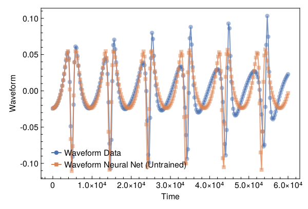
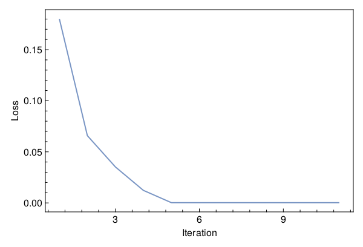
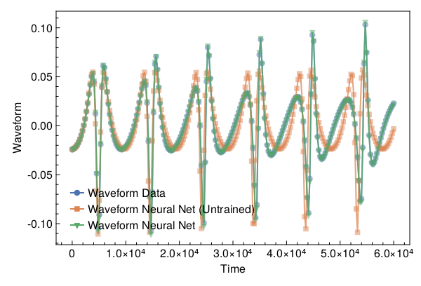

<a id='Training-a-Neural-ODE-to-Model-Gravitational-Waveforms'></a>

# Training a Neural ODE to Model Gravitational Waveforms


This code is adapted from [Astroinformatics/ScientificMachineLearning](https://github.com/Astroinformatics/ScientificMachineLearning/blob/c93aac3a460d70b4cce98836b677fd9b732e94b7/neuralode_gw.ipynb)


The code has been minimally adapted from [Keith et. al. 2021](https://arxiv.org/abs/2102.12695) which originally used Flux.jl


<a id='Package-Imports'></a>

## Package Imports


```julia
using Lux, ComponentArrays, LineSearches, LuxAMDGPU, LuxCUDA, OrdinaryDiffEq,
    Optimization, OptimizationOptimJL, Random, SciMLSensitivity
using CairoMakie, MakiePublication
CUDA.allowscalar(false)
```


<a id='Define-some-Utility-Functions'></a>

## Define some Utility Functions


::: tip


This section can be skipped. It defines functions to simulate the model, however, from a scientific machine learning perspective, isn't super relevant.


:::


We need a very crude 2-body path. Assume the 1-body motion is a newtonian 2-body position vector $r = r_1 - r_2$ and use Newtonian formulas to get $r_1$, $r_2$ (e.g. Theoretical Mechanics of Particles and Continua 4.3)


```julia
function one2two(path, m₁, m₂)
    M = m₁ + m₂
    r₁ = m₂ / M .* path
    r₂ = -m₁ / M .* path
    return r₁, r₂
end
```


```
one2two (generic function with 1 method)
```


Next we define a function to perform the change of variables: $(\chi(t),\phi(t)) \mapsto (x(t),y(t))$


```julia
@views function soln2orbit(soln, model_params=nothing)
    @assert size(soln, 1) ∈ [2, 4] "size(soln,1) must be either 2 or 4"

    if size(soln, 1) == 2
        χ = soln[1, :]
        ϕ = soln[2, :]

        @assert length(model_params)==3 "model_params must have length 3 when size(soln,2) = 2"
        p, M, e = model_params
    else
        χ = soln[1, :]
        ϕ = soln[2, :]
        p = soln[3, :]
        e = soln[4, :]
    end

    r = p ./ (1 .+ e .* cos.(χ))
    x = r .* cos.(ϕ)
    y = r .* sin.(ϕ)

    orbit = vcat(x', y')
    return orbit
end
```


```
soln2orbit (generic function with 2 methods)
```


This function uses second-order one-sided difference stencils at the endpoints; see https://doi.org/10.1090/S0025-5718-1988-0935077-0


```julia
function d_dt(v::AbstractVector, dt)
    a = -3 / 2 * v[1] + 2 * v[2] - 1 / 2 * v[3]
    b = (v[3:end] .- v[1:(end - 2)]) / 2
    c = 3 / 2 * v[end] - 2 * v[end - 1] + 1 / 2 * v[end - 2]
    return [a; b; c] / dt
end
```


```
d_dt (generic function with 1 method)
```


This function uses second-order one-sided difference stencils at the endpoints; see https://doi.org/10.1090/S0025-5718-1988-0935077-0


```julia
function d2_dt2(v::AbstractVector, dt)
    a = 2 * v[1] - 5 * v[2] + 4 * v[3] - v[4]
    b = v[1:(end - 2)] .- 2 * v[2:(end - 1)] .+ v[3:end]
    c = 2 * v[end] - 5 * v[end - 1] + 4 * v[end - 2] - v[end - 3]
    return [a; b; c] / (dt^2)
end
```


```
d2_dt2 (generic function with 1 method)
```


Now we define a function to compute the trace-free moment tensor from the orbit


```julia
function orbit2tensor(orbit, component, mass=1)
    x = orbit[1, :]
    y = orbit[2, :]

    Ixx = x .^ 2
    Iyy = y .^ 2
    Ixy = x .* y
    trace = Ixx .+ Iyy

    if component[1] == 1 && component[2] == 1
        tmp = Ixx .- trace ./ 3
    elseif component[1] == 2 && component[2] == 2
        tmp = Iyy .- trace ./ 3
    else
        tmp = Ixy
    end

    return mass .* tmp
end

function h_22_quadrupole_components(dt, orbit, component, mass=1)
    mtensor = orbit2tensor(orbit, component, mass)
    mtensor_ddot = d2_dt2(mtensor, dt)
    return 2 * mtensor_ddot
end

function h_22_quadrupole(dt, orbit, mass=1)
    h11 = h_22_quadrupole_components(dt, orbit, (1, 1), mass)
    h22 = h_22_quadrupole_components(dt, orbit, (2, 2), mass)
    h12 = h_22_quadrupole_components(dt, orbit, (1, 2), mass)
    return h11, h12, h22
end

function h_22_strain_one_body(dt::T, orbit) where {T}
    h11, h12, h22 = h_22_quadrupole(dt, orbit)

    h₊ = h11 - h22
    hₓ = T(2) * h12

    scaling_const = √(T(π) / 5)
    return scaling_const * h₊, -scaling_const * hₓ
end

function h_22_quadrupole_two_body(dt, orbit1, mass1, orbit2, mass2)
    h11_1, h12_1, h22_1 = h_22_quadrupole(dt, orbit1, mass1)
    h11_2, h12_2, h22_2 = h_22_quadrupole(dt, orbit2, mass2)
    h11 = h11_1 + h11_2
    h12 = h12_1 + h12_2
    h22 = h22_1 + h22_2
    return h11, h12, h22
end

function h_22_strain_two_body(dt::T, orbit1, mass1, orbit2, mass2) where {T}
    # compute (2,2) mode strain from orbits of BH 1 of mass1 and BH2 of mass 2

    @assert abs(mass1 + mass2 - 1.0)<1e-12 "Masses do not sum to unity"

    h11, h12, h22 = h_22_quadrupole_two_body(dt, orbit1, mass1, orbit2, mass2)

    h₊ = h11 - h22
    hₓ = T(2) * h12

    scaling_const = √(T(π) / 5)
    return scaling_const * h₊, -scaling_const * hₓ
end

function compute_waveform(dt::T, soln, mass_ratio, model_params=nothing) where {T}
    @assert mass_ratio≤1 "mass_ratio must be <= 1"
    @assert mass_ratio≥0 "mass_ratio must be non-negative"

    orbit = soln2orbit(soln, model_params)
    if mass_ratio > 0
        m₂ = inv(T(1) + mass_ratio)
        m₁ = mass_ratio * m₂

        orbit₁, orbit₂ = one2two(orbit, m₁, m₂)
        waveform = h_22_strain_two_body(dt, orbit1, mass1, orbit2, mass2)
    else
        waveform = h_22_strain_one_body(dt, orbit)
    end
    return waveform
end
```


```
compute_waveform (generic function with 2 methods)
```


<a id='Simulating-the-True-Model'></a>

## Simulating the True Model


`RelativisticOrbitModel` defines system of odes which describes motion of point like particle in schwarzschild background, uses


$$
u[1] = \chi
$$


$$
u[2] = \phi
$$


where, $p$, $M$, and $e$ are constants


```julia
function RelativisticOrbitModel(u, (p, M, e), t)
    χ, ϕ = u

    numer = (p - 2 - 2 * e * cos(χ)) * (1 + e * cos(χ))^2
    denom = sqrt((p - 2)^2 - 4 * e^2)

    χ̇ = numer * sqrt(p - 6 - 2 * e * cos(χ)) / (M * (p^2) * denom)
    ϕ̇ = numer / (M * (p^(3 / 2)) * denom)

    return [χ̇, ϕ̇]
end

mass_ratio = 0.0         # test particle
u0 = Float64[π, 0.0]     # initial conditions
datasize = 250
tspan = (0.0f0, 6.0f4)   # timespace for GW waveform
tsteps = range(tspan[1], tspan[2]; length=datasize)  # time at each timestep
dt_data = tsteps[2] - tsteps[1]
dt = 100.0
const ode_model_params = [100.0, 1.0, 0.5]; # p, M, e
```


Let's simulate the true model and plot the results using `OrdinaryDiffEq.jl`


```julia
prob = ODEProblem(RelativisticOrbitModel, u0, tspan, ode_model_params)
soln = Array(solve(prob, RK4(); saveat=tsteps, dt, adaptive=false))
waveform = first(compute_waveform(dt_data, soln, mass_ratio, ode_model_params))

fig = with_theme(theme_web()) do
    fig = Figure()
    ax = CairoMakie.Axis(fig[1, 1]; xlabel="Time", ylabel="Waveform")

    l = lines!(ax, tsteps, waveform; linewidth=2, alpha=0.75)
    s = scatter!(ax, tsteps, waveform; markershape=:circle, markeralpha=0.25, alpha=0.5)

    axislegend(ax, [[l, s]], ["Waveform Data"])

    return fig
end
```


<a id='Defiing-a-Neural-Network-Model'></a>

## Defiing a Neural Network Model


Next, we define the neural network model that takes 1 input (time) and has two outputs. We'll make a function `ODE_model` that takes the initial conditions, neural network parameters and a time as inputs and returns the derivatives.


It is typically never recommended to use globals but incase you do use them, make sure to mark them as `const`.


We will deviate from the standard Neural Network initialization and use `WeightInitializers.jl`,


```julia
const nn = Chain(Base.Fix1(broadcast, cos),
    Dense(1 => 32, cos; init_weight=truncated_normal(; std=1e-4)),
    Dense(32 => 32, cos; init_weight=truncated_normal(; std=1e-4)),
    Dense(32 => 2; init_weight=truncated_normal(; std=1e-4)))
ps, st = Lux.setup(MersenneTwister(), nn)
```


```
((layer_1 = NamedTuple(), layer_2 = (weight = Float32[9.817214f-6; 1.2093918f-5; -8.246749f-5; 2.3713174f-5; 6.229138f-5; -3.7437625f-5; -0.00010892467; 0.00018654589; -4.423924f-5; -6.46207f-5; -4.8522095f-5; -0.00010382456; 8.428583f-5; -5.546233f-5; 0.00011541804; -1.393688f-5; -3.6856763f-5; -1.0039548f-5; -0.00013625264; 7.0074624f-5; 0.00010026065; -4.1590112f-5; -3.4055167f-5; 3.536956f-5; 5.2847336f-5; -0.00021256562; -0.00025990434; 6.7406254f-5; 5.912086f-5; 1.263871f-5; 6.3269006f-5; -0.00021348268;;], bias = Float32[0.0; 0.0; 0.0; 0.0; 0.0; 0.0; 0.0; 0.0; 0.0; 0.0; 0.0; 0.0; 0.0; 0.0; 0.0; 0.0; 0.0; 0.0; 0.0; 0.0; 0.0; 0.0; 0.0; 0.0; 0.0; 0.0; 0.0; 0.0; 0.0; 0.0; 0.0; 0.0;;]), layer_3 = (weight = Float32[-0.00012027452 -0.00015134136 -7.583751f-5 -0.00013521973 0.00019155451 7.4586926f-5 0.00014570417 -9.018805f-6 4.31607f-5 -6.792824f-5 -4.9570826f-5 0.00015608977 0.00016016753 -6.14516f-5 6.723942f-5 6.891349f-5 -0.00012061953 -2.2682694f-5 -3.9443368f-8 -1.1340809f-6 0.00012858563 0.00010583702 8.80465f-7 -7.957363f-6 6.3305626f-5 -2.1312983f-6 2.9537823f-5 0.00010910857 -7.795467f-5 -2.3915816f-5 9.728105f-5 0.00015238152; -0.000160188 -5.353433f-5 -7.203246f-5 -1.05435f-5 -0.00019952489 5.021975f-5 -2.1301896f-5 0.000119766395 -0.00018740099 -0.00015028607 -0.00016191904 4.136258f-5 1.6004618f-5 -4.4081316f-5 -0.00011479535 -0.0001326244 6.0796454f-5 -1.9303086f-5 -0.00021689339 -0.00025836407 9.98341f-5 8.3840336f-5 -7.791524f-5 8.833273f-5 5.462537f-5 9.179911f-5 0.0001108729 -7.2920295f-5 -6.662924f-5 0.00011217649 -6.420046f-5 -4.833186f-5; 7.303979f-5 -3.943642f-5 -3.331698f-6 0.00015960188 -0.000107481865 -0.00010718365 0.00015443168 8.6127046f-5 2.0507023f-5 5.4019652f-5 0.00013712826 -9.134734f-5 9.483594f-5 0.00015674383 0.0001236156 0.00016744738 -0.00013090478 0.00010549168 -0.00010339774 -3.281007f-5 5.1258412f-5 -4.8749625f-5 0.000119340126 3.2391872f-5 -0.00016638721 -9.289986f-5 -0.00017899481 9.303162f-5 -9.795198f-5 5.0208906f-5 4.6325673f-5 0.00012292364; 0.00020600435 -0.0001070347 5.0910254f-5 -0.0001522555 9.7567114f-5 8.3874314f-5 2.1881717f-5 -7.463954f-5 -1.061703f-5 0.0001635596 -0.00013440147 -7.287142f-5 -2.3708748f-5 -4.5318913f-5 -4.930381f-5 5.418427f-5 0.00012098145 3.875118f-5 -0.00019756018 1.4131944f-5 -0.00020631964 -0.00014578861 -0.00012499971 0.00011476873 9.811929f-6 -9.130617f-5 0.000101596386 -9.816535f-5 4.6861154f-5 -8.6270586f-5 9.909854f-5 0.00021579592; 7.123851f-5 1.2275746f-5 -9.873087f-5 -1.0169207f-5 1.2825392f-5 3.2182215f-5 -0.00010879536 -6.0709306f-5 -0.00015230037 -0.00013450152 -3.1101624f-6 -6.131697f-5 5.8525315f-5 2.796733f-5 3.2511372f-5 -8.983669f-5 9.049469f-5 0.00016978911 2.2486882f-5 -2.4086565f-5 1.6077141f-5 0.00015004912 -7.5159f-5 1.7251208f-5 2.4309304f-5 -0.00015097561 -7.927186f-5 3.2122284f-6 0.0001280125 -5.7054534f-5 -0.000102457365 -0.00012640335; 2.3383287f-5 0.00011028128 -4.908827f-5 -6.787495f-6 -1.8589495f-5 2.1414946f-5 0.00011629761 -5.4390017f-5 3.440902f-5 -1.7953429f-5 3.58215f-5 -7.849828f-8 1.9697874f-5 -0.000114636336 0.00025239252 4.3916396f-5 -2.8370327f-5 -0.00010487816 -9.368978f-5 -5.747908f-5 -0.00024847893 1.353128f-6 0.00016348257 3.1365074f-5 8.043856f-5 -9.0566806f-5 -6.994722f-5 -4.983131f-6 -4.4981814f-5 0.00012762529 0.000110406516 -4.0683815f-5; -0.00013927558 4.7590543f-6 -0.00011779698 -5.8306578f-5 -6.596125f-6 4.25418f-5 4.0941995f-6 0.00014405661 3.883462f-5 -0.00019398163 -5.4936798f-5 6.341874f-5 -0.0001583916 -2.4852146f-5 -2.6629705f-5 -4.181476f-5 -2.3091123f-5 -0.0001829308 4.5704717f-5 0.00021851352 6.402166f-5 -0.000188654 2.9765948f-5 8.4124644f-5 -4.639847f-5 2.7284119f-5 -9.84036f-5 -3.0612613f-5 -4.964639f-5 9.632032f-6 -5.2797054f-6 -5.5067674f-5; -1.9780477f-5 1.1954804f-5 -0.00015066819 6.3474465f-5 3.2184733f-5 -2.2077204f-5 -0.00014140866 -2.1205983f-6 -5.174611f-5 9.58815f-5 -0.00017868249 5.498243f-5 0.00019228955 0.0001845704 -7.908249f-5 5.298221f-5 0.000112876 -0.00016679364 -0.00019998784 0.0001876757 -6.888754f-5 -3.7345784f-5 -0.00019044316 -7.616578f-5 -2.7074553f-5 -7.0569906f-5 -0.00012250914 -7.600825f-5 0.00012733362 3.6774134f-5 -4.41798f-5 6.6910616f-5; -0.00017097416 0.00012414665 -0.00013879013 -5.2126437f-5 1.6120428f-5 -0.00012775128 1.1574481f-5 -0.00013368808 5.6468114f-5 -2.6980364f-5 -0.00019698897 -6.493302f-5 0.00015211613 -5.690354f-5 -6.486416f-5 0.00017437784 5.3044663f-5 -3.5826823f-5 0.00012622532 0.00026819168 5.218881f-5 -0.000109304616 -4.0315288f-5 -3.706456f-5 -9.8992496f-5 0.0001442244 2.7609824f-5 -1.1712749f-5 3.1758198f-5 -1.13922915f-5 -9.067227f-5 2.5751244f-5; -8.5335254f-5 0.00013499924 6.1176026f-5 -0.00011723812 -6.963463f-6 -6.080127f-5 7.997305f-5 2.5667761f-5 2.9851104f-5 7.5848504f-5 -3.502181f-6 0.0001320462 9.2221584f-5 -0.00012349231 0.00021969975 -5.2867952f-5 -8.4549414f-5 -9.139728f-5 7.141432f-5 0.00012789048 -6.059937f-5 0.00013404003 -6.568562f-5 -4.8029327f-5 -0.00018673793 -0.00010634186 3.0211278f-5 9.821418f-5 6.374208f-6 -9.117065f-5 4.2606578f-5 -1.7531245f-5; -3.5965582f-5 -4.095838f-5 -3.9677798f-5 4.831144f-5 -9.648761f-5 1.1943127f-5 -1.1381164f-5 -5.4150154f-5 -7.274981f-5 1.3913104f-5 0.00012416474 -9.960146f-6 7.608685f-5 -3.593125f-5 -0.00020499919 2.5017183f-5 0.00014686528 -2.1737864f-5 -6.367463f-5 9.640111f-5 1.6868638f-5 -9.4048584f-5 0.000111345915 6.232349f-6 -9.349674f-5 -0.0001274214 -7.217635f-5 5.887662f-5 3.6774647f-5 -4.4600532f-5 -0.00010205998 9.675243f-5; -6.736553f-5 -4.753638f-5 1.2408861f-5 -8.40917f-5 -9.9216326f-5 2.9563638f-5 -2.9648422f-6 1.3653069f-5 1.0680618f-5 -2.2764074f-5 -2.9367282f-5 2.3518121f-5 0.00010158897 -4.4194625f-5 -1.8683812f-5 0.00013512251 0.0002378933 -0.00017690333 -3.401062f-6 -0.00015351381 8.814295f-5 1.6573224f-5 -6.076249f-5 0.00014986368 1.0069882f-5 0.00014732941 -1.671693f-5 0.00010222833 -0.00020183595 -0.00013014088 0.00017033357 4.8423462f-5; -5.808808f-5 -0.00016625019 -7.4917994f-6 3.765582f-5 3.2609612f-5 -2.0426009f-5 -9.443329f-5 -0.00013736138 -9.311954f-5 -0.000113089154 8.953487f-5 -6.443156f-5 6.4179244f-6 -9.088369f-5 -0.00011673308 -8.804055f-5 4.191679f-5 -7.976758f-6 5.888682f-5 1.4218449f-5 -6.521995f-5 0.00014838872 -0.00023494067 4.935325f-5 -1.8762995f-6 2.1696193f-5 0.00014150643 8.299678f-6 4.773354f-6 -3.159347f-5 0.00010350408 0.00012389984; -2.1540716f-5 7.23832f-5 -7.239663f-5 -2.7967235f-5 0.00013336795 -0.00020945018 -3.875354f-6 2.3756294f-5 2.6625401f-5 -1.2456048f-5 6.0011946f-5 -1.9614128f-5 7.055182f-5 -5.8036552f-5 -5.4844113f-5 0.000140917 7.5919f-5 4.2782285f-5 8.802813f-5 9.031972f-5 -0.00012317854 -2.215783f-5 -9.496771f-5 -0.00010726548 2.0301019f-5 0.00027120227 9.3685834f-5 -6.6827324f-6 6.5188506f-5 9.362709f-5 -0.00018044439 3.5519943f-6; 0.00023000562 6.863825f-5 -0.00011044203 -4.6781333f-5 9.216144f-5 -3.250551f-5 2.3449316f-5 -0.00013348694 -0.00012680453 0.00016248987 -0.00013836699 -9.5643045f-5 -0.00017883444 7.711158f-5 -0.00013599929 -0.00011228548 4.838523f-5 -0.00012408223 -3.167983f-5 0.00012347681 4.1539322f-5 0.00018419782 -6.2258296f-5 -0.00013295532 -0.00019423602 3.13958f-6 -3.8539474f-5 1.9945506f-5 -3.5557397f-5 -5.150907f-5 -1.3068113f-5 -0.000106873966; -0.00011016603 2.461593f-5 4.6803f-5 -9.27172f-5 1.5310836f-5 -4.4696654f-7 -3.7221726f-5 4.881751f-5 7.006611f-5 -0.00010377509 0.00015422827 -9.109344f-5 -8.773107f-5 -3.9835186f-6 -6.754136f-5 3.95427f-5 9.443693f-5 -1.0904535f-5 0.00010228317 0.00018539173 -3.6539437f-5 -2.8781792f-6 -0.00012577564 1.9986659f-5 -9.149433f-5 5.05854f-5 -4.1227955f-5 4.3225584f-5 -8.216094f-5 -0.000103697916 4.0640356f-5 -3.3706296f-5; 9.0759975f-5 -7.6362456f-5 8.743223f-5 0.00014839132 -7.918605f-6 4.4268407f-5 -6.917923f-5 9.665785f-5 -5.3891355f-5 5.5478256f-5 -4.0377072f-5 -0.000121939855 -7.4918594f-6 -4.205647f-5 -0.00012367527 0.0002566978 -9.496259f-6 -0.00014990117 1.5758933f-5 0.00011039393 0.00021477304 9.5432464f-5 3.977034f-5 -0.00013754229 -8.892859f-6 -2.9654831f-5 2.275239f-5 -7.571264f-5 9.795715f-6 5.511623f-6 2.3306027f-5 -9.980543f-5; -0.00029705817 -2.5197116f-6 5.479029f-5 6.70562f-5 2.0307212f-5 -6.918519f-5 0.00011687122 0.0001600334 -5.3916163f-5 2.115758f-5 -0.0001012711 -2.6517116f-6 3.6236197f-5 -9.280433f-6 8.990736f-5 -0.00010008402 5.7400317f-5 -3.5199206f-5 -9.368505f-5 0.00010112285 -6.8838635f-5 0.0001289364 -0.00011622384 9.56371f-5 4.5749835f-5 0.00020552288 4.5914458f-6 -6.962267f-5 4.2620253f-5 -3.1464966f-5 0.00011057454 -7.2167466f-5; -8.377025f-5 0.000168962 -8.577983f-5 6.361053f-5 -4.0968327f-5 5.5178112f-5 -2.0276617f-5 -1.9157587f-5 2.140715f-5 5.342501f-5 0.000109771034 -8.775381f-5 0.00024584474 -6.156118f-5 3.884551f-5 1.9787392f-5 -0.00014718759 -1.5845799f-5 -0.00014110348 -3.3879067f-5 -0.00010993515 -8.049441f-5 1.6456395f-6 -9.763818f-5 6.7304056f-5 8.3967716f-5 9.490221f-5 -5.1601488f-5 0.00011517461 8.556222f-6 -0.00013252517 -8.8083434f-5; -8.5096384f-5 6.0631148f-5 -0.0001754803 2.4203883f-9 5.316571f-6 2.5011848f-5 9.1192116f-5 -9.0335314f-5 -0.00017078477 -5.6836834f-5 3.8678198f-5 -4.8836733f-5 0.00017801404 8.341762f-5 -4.8606485f-6 -8.187166f-5 -4.3344935f-5 -0.00012934489 0.00016842628 0.000159215 5.846883f-5 2.2642287f-5 7.3187504f-5 -0.0001766917 -2.5929792f-5 -4.2834225f-5 0.00021916445 0.00013024751 0.00013995908 8.507677f-5 -4.5223783f-6 -0.00012379201; 3.2231877f-5 0.00011569752 0.00014656634 -6.953702f-5 3.8942535f-6 -1.814605f-5 5.0508155f-5 -0.00020377879 -1.3926561f-5 9.218974f-6 -0.00012554655 0.00016819802 -3.120105f-5 -0.00014726956 4.7392972f-5 -5.2364f-5 8.25841f-5 -1.3609246f-5 -1.8566876f-5 0.00012739327 8.6063286f-5 7.34559f-5 4.6073063f-5 -1.9280194f-5 -9.291657f-5 6.7559304f-5 6.9993484f-6 -0.00013611744 4.829519f-5 9.928675f-6 -6.768185f-5 -1.0103069f-5; -8.740569f-5 -0.00021692541 -9.051571f-5 0.00014742148 1.5780353f-5 -0.00012771405 -1.1661844f-5 -8.641369f-6 -4.5276964f-5 -6.0831976f-6 -5.2187203f-5 6.599529f-5 -0.0001511023 -7.698995f-5 -6.774991f-5 1.2946276f-5 -0.00016006202 6.439748f-5 0.0001101326 0.00016527945 0.00014424181 -0.00019886352 -8.605701f-5 0.00018564878 -0.00011147943 -6.2619896f-5 6.656341f-5 8.483452f-5 6.398832f-5 1.1718285f-5 -6.4273845f-5 -4.3751035f-5; 0.0001420308 7.805574f-6 2.535733f-6 -0.00010829508 -8.520713f-6 8.6892804f-5 6.685333f-5 5.5737433f-5 -0.00011484682 0.00014868156 2.1525088f-5 -3.0521467f-5 -0.00012653832 9.324061f-5 -9.073802f-6 -9.897533f-5 -7.7567514f-5 -2.2304682f-6 1.2986926f-5 -0.00010764765 -0.00010751403 -1.898779f-5 -0.00010428391 -3.133121f-5 -2.897055f-5 -5.2843454f-5 -3.0815224f-6 6.903316f-5 0.00012438187 6.768685f-5 1.7154618f-5 -1.1323391f-5; -7.2779796f-5 -7.1130307f-6 3.8739186f-6 3.6121255f-5 6.56335f-5 -6.863391f-6 0.00015340876 0.00017025089 8.8153975f-5 0.00010576312 -1.4731571f-5 6.8206056f-5 -0.000166332 8.993932f-5 1.32599625f-5 0.000107297565 0.00015313744 4.4749086f-6 -4.0716375f-5 0.00010673178 0.00013230646 2.3662711f-5 -6.2722305f-5 5.3853455f-5 -6.7668593f-6 -5.447689f-5 -0.000101235026 0.0001459481 -2.8457845f-5 -4.968702f-5 0.000119719945 2.6251348f-5; 0.00025132863 -0.0001050483 3.871668f-5 -4.1638366f-5 3.8842416f-5 -9.570643f-6 -0.00011137619 -0.00015774605 -2.1617148f-5 -0.00015769454 0.00014997758 5.9752478f-5 2.6863492f-5 -7.1532595f-5 7.523087f-5 4.8432164f-5 0.00016324925 -8.6310734f-5 -6.405754f-5 -1.8744964f-5 0.00013041518 -9.2372466f-5 -3.9546256f-5 -6.659067f-5 -7.592127f-6 -1.8031416f-5 -0.00021243075 -1.2614705f-5 0.00016492634 1.683551f-5 -7.763297f-5 -7.995902f-5; -0.000104936706 -0.00014408554 0.00013557206 5.5175467f-5 7.183623f-5 4.0999264f-5 -6.0553382f-5 6.363943f-5 -0.00012074233 2.0657795f-5 6.467288f-5 7.842011f-5 0.00013946278 0.000115119525 3.9516886f-5 -3.402461f-5 0.00020500652 1.7726483f-5 -2.9114392f-5 -7.899906f-5 0.0001356563 -0.00011776039 2.5735677f-5 -7.608046f-5 0.00021412518 -7.7755f-5 -0.00011323109 1.575152f-5 -4.2800657f-5 9.043616f-5 6.4988264f-5 9.821524f-5; 4.513541f-5 0.00012215954 -4.8925765f-5 -4.292189f-5 7.452557f-5 3.8246886f-5 -0.00014352595 2.3912311f-5 6.949551f-5 -5.2377265f-5 -0.00012730184 -0.00021316804 -9.2037095f-5 2.0104342f-5 -9.265113f-5 3.690058f-5 -4.330681f-6 -5.6171873f-5 8.0367434f-5 -2.2887218f-6 3.136498f-5 -1.8218778f-5 -8.951511f-6 7.2998984f-5 -9.379694f-5 3.3339038f-5 -7.836688f-5 -2.6299414f-5 -0.00015562067 1.9687695f-6 -5.5861903f-5 -0.00012683685; 7.623825f-5 0.00011383997 -7.466734f-5 -6.983285f-5 -4.5894307f-5 1.925762f-6 0.00011251726 0.00019309213 -3.0233297f-5 -8.696318f-6 0.00013111667 -4.214247f-5 0.00014368565 -1.315416f-5 8.2146915f-5 -7.09693f-5 -5.130752f-5 4.143657f-7 0.00013379274 -9.471785f-5 -2.8401f-5 0.00022057304 -5.725388f-5 -0.00010575309 0.000101443504 -7.745828f-5 2.1790001f-5 2.144509f-6 -0.00014635839 -2.2305707f-5 6.364469f-7 0.00015102868; -0.0002086199 0.00011296961 -1.3685402f-5 4.3991446f-7 -6.9964733f-7 -3.585808f-5 -4.8820137f-5 3.4728496f-6 -7.924126f-5 -3.7295424f-5 0.00010340625 0.00012067911 -7.362076f-5 7.93066f-5 -3.5628964f-5 3.3033884f-5 2.7182252f-5 -1.7957924f-5 -3.9166816f-6 -3.9091683f-5 -7.211692f-5 -2.2144202f-5 -3.895896f-5 6.867524f-5 -3.1419284f-5 -6.439045f-5 2.8095279f-5 0.00012402097 -8.820272f-5 4.6085523f-5 -9.52556f-5 -0.00010401438; 4.6144713f-5 -8.150214f-5 -4.3167456f-5 4.833918f-5 0.00015068689 -2.3067585f-5 -1.8051887f-5 -7.0499624f-7 -0.00018213374 -0.00012087052 -5.801445f-5 -0.00011672322 -8.0372796f-5 2.9311286f-5 0.0001133436 -7.730239f-5 -1.9523664f-5 -3.3318538f-5 -8.8773224f-5 0.00018943906 -7.218949f-5 9.385397f-5 0.00015189385 4.948945f-5 6.837161f-5 -5.4725235f-5 -9.3716706f-5 5.645613f-5 -9.324708f-5 -0.0001280918 0.000100574005 -5.202285f-5; -4.690695f-5 1.7577402f-5 -6.331571f-6 4.7662146f-5 -1.8795874f-5 -6.862415f-5 -3.893533f-5 9.395979f-6 -2.2403561f-5 7.5726007f-7 -4.677263f-5 -8.002f-5 2.993897f-5 8.413588f-5 -2.1978929f-5 4.2060714f-5 7.7450255f-5 3.2206226f-5 4.7815018f-5 -0.000100780846 -1.7353275f-5 -7.130096f-5 0.00021433299 -2.468459f-5 0.000103013415 -7.645348f-5 0.00011126819 0.00013162388 5.153606f-5 1.1881404f-5 -3.0708452f-5 -4.6266f-5; 1.2349391f-5 -2.292151f-5 0.00024362457 -0.00015462219 -2.2618497f-5 3.924474f-5 8.307075f-5 -5.0717208f-5 -9.366867f-6 -0.00013422126 -6.8864734f-5 3.663142f-5 6.887284f-5 0.0002608886 0.00015628636 -3.147275f-5 9.2563816f-5 -2.3091492f-5 -0.00011131732 7.590996f-5 -4.7214617f-5 6.804115f-5 -8.169865f-5 -9.286656f-5 -4.567334f-5 -3.3254833f-5 -4.321732f-5 -5.7272293f-5 -2.6528169f-5 0.00010482753 -6.996886f-5 -5.3030835f-5], bias = Float32[0.0; 0.0; 0.0; 0.0; 0.0; 0.0; 0.0; 0.0; 0.0; 0.0; 0.0; 0.0; 0.0; 0.0; 0.0; 0.0; 0.0; 0.0; 0.0; 0.0; 0.0; 0.0; 0.0; 0.0; 0.0; 0.0; 0.0; 0.0; 0.0; 0.0; 0.0; 0.0;;]), layer_4 = (weight = Float32[7.5903976f-5 7.2329385f-5 4.706642f-5 -0.00012757645 -4.9215556f-5 -0.00011766815 0.00013750128 -0.00012861588 -3.6845602f-5 -5.7512925f-6 -1.7940038f-5 -8.341571f-5 6.009325f-5 8.7028784f-5 -0.00015650086 -9.9871635f-5 2.7293145f-5 -0.00016935849 0.00011730653 3.7759448f-5 -0.000103073166 0.00011750708 0.00013590472 0.00010016512 -3.6634232f-5 -0.00011525626 4.826947f-5 -0.00015409394 -7.754771f-6 8.067521f-5 -8.112153f-5 -3.2290707f-5; -5.3118078f-5 0.00020298644 0.00012481007 -0.000102419595 7.852488f-5 -3.8358176f-5 8.9479785f-5 0.00016612548 6.517919f-5 0.00014071069 5.6556033f-5 4.9783295f-5 -0.00010789338 1.9700556f-5 8.880478f-5 -0.00016480038 -4.04892f-5 7.1007664f-5 4.4776756f-5 0.0001650926 -9.9005425f-5 -6.900305f-5 -2.3305813f-5 -0.0002767869 8.45442f-5 5.345114f-5 5.4196524f-5 8.8370296f-5 7.536247f-5 8.711317f-5 8.101382f-5 -4.017285f-5], bias = Float32[0.0; 0.0;;])), (layer_1 = NamedTuple(), layer_2 = NamedTuple(), layer_3 = NamedTuple(), layer_4 = NamedTuple()))
```


Similar to most DL frameworks, Lux defaults to using `Float32`, however, in this case we need Float64


```julia
const params = ComponentArray{Float64}(ps)
```


```
ComponentVector{Float64}(layer_1 = Float64[], layer_2 = (weight = [9.817214049689937e-6; 1.2093917575839441e-5; -8.246749348472804e-5; 2.37131735048024e-5; 6.229137943591923e-5; -3.743762499652803e-5; -0.00010892467253142968; 0.0001865458907559514; -4.4239241105969995e-5; -6.462069723056629e-5; -4.85220953123644e-5; -0.00010382456093793735; 8.428582805208862e-5; -5.546232932829298e-5; 0.00011541804269654676; -1.393688035022933e-5; -3.6856763472314924e-5; -1.0039548214990646e-5; -0.0001362526381853968; 7.007462409092113e-5; 0.00010026065137935802; -4.15901122323703e-5; -3.405516690691002e-5; 3.536956137395464e-5; 5.284733560984023e-5; -0.0002125656174030155; -0.0002599043364170939; 6.740625394741073e-5; 5.9120859077665955e-5; 1.2638710359169636e-5; 6.326900620479137e-5; -0.00021348267910070717;;], bias = [0.0; 0.0; 0.0; 0.0; 0.0; 0.0; 0.0; 0.0; 0.0; 0.0; 0.0; 0.0; 0.0; 0.0; 0.0; 0.0; 0.0; 0.0; 0.0; 0.0; 0.0; 0.0; 0.0; 0.0; 0.0; 0.0; 0.0; 0.0; 0.0; 0.0; 0.0; 0.0;;]), layer_3 = (weight = [-0.00012027451884932816 -0.00015134135901462287 -7.583750993944705e-5 -0.00013521972869057208 0.000191554514458403 7.458692562067881e-5 0.00014570416533388197 -9.018805030791555e-6 4.3160700442967936e-5 -6.792823842260987e-5 -4.957082637702115e-5 0.0001560897653689608 0.00016016753215808421 -6.14516029600054e-5 6.723942351527512e-5 6.891349039506167e-5 -0.00012061953020747751 -2.2682694179820828e-5 -3.9443367683134056e-8 -1.134080889642064e-6 0.00012858562695328146 0.00010583701805444434 8.80464995134389e-7 -7.957362868182827e-6 6.330562609946355e-5 -2.1312982880772324e-6 2.953782313852571e-5 0.00010910857236012816 -7.795466808602214e-5 -2.391581620031502e-5 9.728105214890093e-5 0.0001523815153632313; -0.00016018800670281053 -5.353433152777143e-5 -7.203246059361845e-5 -1.0543500138737727e-5 -0.00019952488946728408 5.021975084673613e-5 -2.130189568561036e-5 0.00011976639507338405 -0.0001874009903986007 -0.00015028606867417693 -0.00016191904433071613 4.136257848585956e-5 1.6004618373699486e-5 -4.4081316445954144e-5 -0.00011479535169200972 -0.00013262439460959285 6.0796453908551484e-5 -1.9303086446598172e-5 -0.00021689338609576225 -0.00025836407439783216 9.983409836422652e-5 8.38403357192874e-5 -7.791523967171088e-5 8.833273022901267e-5 5.462536864797585e-5 9.179911285173148e-5 0.00011087289749411866 -7.292029476957396e-5 -6.662923988187686e-5 0.00011217648716410622 -6.42004597466439e-5 -4.833186176256277e-5; 7.303978782147169e-5 -3.9436421502614394e-5 -3.331698053443688e-6 0.00015960188466124237 -0.00010748186468845233 -0.00010718365228967741 0.000154431676492095 8.61270455061458e-5 2.0507022782112472e-5 5.401965245255269e-5 0.00013712825602851808 -9.134734136750922e-5 9.483593748882413e-5 0.0001567438303027302 0.0001236155949300155 0.00016744737513363361 -0.00013090478023514152 0.00010549167927820235 -0.00010339773871237412 -3.281006866018288e-5 5.125841198605485e-5 -4.8749625420896336e-5 0.0001193401258205995 3.2391872082371265e-5 -0.00016638720990158617 -9.289986337535083e-5 -0.00017899481463246047 9.303161641582847e-5 -9.795198275242001e-5 5.020890603191219e-5 4.632567288354039e-5 0.00012292363680899143; 0.00020600434800144285 -0.00010703469888539985 5.091025377623737e-5 -0.00015225549577735364 9.756711369846016e-5 8.387431444134563e-5 2.188171674788464e-5 -7.463953807018697e-5 -1.0617030056891963e-5 0.00016355959814973176 -0.00013440147449728101 -7.287142216227949e-5 -2.370874790358357e-5 -4.531891318038106e-5 -4.930380964651704e-5 5.418427099357359e-5 0.00012098145089112222 3.875117909046821e-5 -0.00019756017718464136 1.4131944226392079e-5 -0.00020631964434869587 -0.0001457886100979522 -0.00012499971489887685 0.00011476872896309942 9.811928975977935e-6 -9.130616672337055e-5 0.00010159638623008505 -9.816535020945594e-5 4.6861154260113835e-5 -8.627058559795842e-5 9.909854270517826e-5 0.0002157959243049845; 7.123850809875876e-5 1.2275745575607289e-5 -9.873086673906073e-5 -1.0169206689170096e-5 1.2825392332160845e-5 3.218221536371857e-5 -0.0001087953569367528 -6.07093061262276e-5 -0.00015230037388391793 -0.00013450151891447604 -3.1101624244911363e-6 -6.131696864031255e-5 5.852531467098743e-5 2.796732951537706e-5 3.251137241022661e-5 -8.983669249573722e-5 9.049468644661829e-5 0.0001697891129879281 2.248688178951852e-5 -2.408656473562587e-5 1.607714148121886e-5 0.00015004911983851343 -7.515899778809398e-5 1.7251208191737533e-5 2.4309303626068868e-5 -0.0001509756111772731 -7.92718565207906e-5 3.2122284210345242e-6 0.00012801249977201223 -5.7054534408962354e-5 -0.0001024573648464866 -0.00012640334898605943; 2.3383287043543532e-5 0.00011028128210455179 -4.9088270316133276e-5 -6.7874948399548884e-6 -1.858949508459773e-5 2.1414945877040736e-5 0.00011629761138465255 -5.439001688500866e-5 3.44090185535606e-5 -1.795342905097641e-5 3.582150020520203e-5 -7.849828165262807e-8 1.9697874449775554e-5 -0.00011463633563835174 0.0002523925213608891 4.3916395952692255e-5 -2.8370326617732644e-5 -0.0001048781632562168 -9.368977771373466e-5 -5.747907925979234e-5 -0.0002484789292793721 1.3531280274037272e-6 0.000163482574862428 3.136507439194247e-5 8.043856360018253e-5 -9.056680573849007e-5 -6.994722207309678e-5 -4.9831310207082424e-6 -4.4981814426137134e-5 0.00012762528785970062 0.00011040651588700712 -4.068381531396881e-5; -0.00013927558029536158 4.759054263558937e-6 -0.00011779698252212256 -5.830657755723223e-5 -6.59612487652339e-6 4.254180021234788e-5 4.094199539395049e-6 0.0001440566120436415 3.883461977238767e-5 -0.0001939816283993423 -5.493679782375693e-5 6.341873813653365e-5 -0.0001583916018716991 -2.485214645275846e-5 -2.6629704734659754e-5 -4.181476106168702e-5 -2.30911227845354e-5 -0.0001829308021115139 4.570471719489433e-5 0.00021851352357771248 6.402166036423296e-5 -0.00018865399761125445 2.9765948056592606e-5 8.412464376306161e-5 -4.63984688394703e-5 2.728411891439464e-5 -9.840360144153237e-5 -3.061261304537766e-5 -4.964639083482325e-5 9.632031833461951e-6 -5.279705419525271e-6 -5.506767411134206e-5; -1.9780476577579975e-5 1.195480399474036e-5 -0.00015066818741615862 6.347446469590068e-5 3.218473284505308e-5 -2.2077203539083712e-5 -0.0001414086582371965 -2.1205983102845494e-6 -5.1746108510997146e-5 9.58814998739399e-5 -0.00017868248687591404 5.4982428991934285e-5 0.00019228954624850303 0.00018457039550412446 -7.908249244792387e-5 5.298221003613435e-5 0.00011287599772913381 -0.00016679364489391446 -0.00019998784409835935 0.0001876757014542818 -6.888753705425188e-5 -3.7345784221543e-5 -0.00019044315558858216 -7.616577931912616e-5 -2.707455314521212e-5 -7.056990580167621e-5 -0.00012250914005562663 -7.600824756082147e-5 0.00012733362382277846 3.677413405966945e-5 -4.4179800170240924e-5 6.691061571473256e-5; -0.00017097416275646538 0.00012414665252435952 -0.00013879012840334326 -5.212643736740574e-5 1.612042797205504e-5 -0.00012775127834174782 1.1574480595299974e-5 -0.00013368808140512556 5.646811405313201e-5 -2.6980364054907113e-5 -0.00019698897085618228 -6.493301771115512e-5 0.00015211613208521158 -5.690354009857401e-5 -6.486415804829448e-5 0.00017437784117646515 5.304466321831569e-5 -3.58268225681968e-5 0.0001262253208551556 0.00026819168124347925 5.218881051405333e-5 -0.00010930461576208472 -4.031528806081042e-5 -3.7064561183797196e-5 -9.899249562295154e-5 0.00014422439562622458 2.7609823519014753e-5 -1.1712749255821109e-5 3.175819801981561e-5 -1.1392291526135523e-5 -9.067227074410766e-5 2.575124381110072e-5; -8.533525397069752e-5 0.00013499923807103187 6.11760260653682e-5 -0.00011723812349373475 -6.963462965359213e-6 -6.0801270592492074e-5 7.997304783202708e-5 2.5667761292424984e-5 2.9851104045519605e-5 7.584850391140208e-5 -3.50218101630162e-6 0.00013204620336182415 9.222158405464143e-5 -0.00012349231110420078 0.00021969975205138326 -5.286795203574002e-5 -8.454941416857764e-5 -9.139728354057297e-5 7.141431706259027e-5 0.00012789048196282238 -6.05993700446561e-5 0.00013404003402683884 -6.568562093889341e-5 -4.802932744496502e-5 -0.00018673793238122016 -0.00010634186037350446 3.0211278499336913e-5 9.821417916100472e-5 6.374208169290796e-6 -9.117065201280639e-5 4.2606578062986955e-5 -1.7531245248392224e-5; -3.5965582355856895e-5 -4.095838085049763e-5 -3.967779775848612e-5 4.831144178751856e-5 -9.648760897107422e-5 1.1943126992264297e-5 -1.1381163858459331e-5 -5.4150154028320685e-5 -7.274981180671602e-5 1.3913104339735582e-5 0.00012416474055498838 -9.960145689547062e-6 7.60868497309275e-5 -3.593125074985437e-5 -0.00020499918900895864 2.5017183361342177e-5 0.0001468652772018686 -2.1737863789894618e-5 -6.367463356582448e-5 9.640111238695681e-5 1.6868638340383768e-5 -9.40485842875205e-5 0.00011134591477457434 6.232348823687062e-6 -9.349673928227276e-5 -0.00012742140097543597 -7.217634993139654e-5 5.8876619732473046e-5 3.677464701468125e-5 -4.460053241928108e-5 -0.00010205998114543036 9.675243200035766e-5; -6.736553041264415e-5 -4.753638131660409e-5 1.2408861039148178e-5 -8.409169822698459e-5 -9.921632590703666e-5 2.9563638236140832e-5 -2.9648422241734806e-6 1.3653068890562281e-5 1.0680618288461119e-5 -2.2764073946746066e-5 -2.9367281968006864e-5 2.3518121452070773e-5 0.00010158897202927619 -4.419462493387982e-5 -1.8683811504160985e-5 0.00013512250734493136 0.00023789329861756414 -0.00017690332606434822 -3.401062031116453e-6 -0.00015351381443906575 8.814295142656192e-5 1.65732235473115e-5 -6.0762489738408476e-5 0.00014986368478275836 1.0069881682284176e-5 0.00014732941053807735 -1.6716929167159833e-5 0.00010222833225270733 -0.00020183595188427716 -0.0001301408774452284 0.00017033357289619744 4.842346243094653e-5; -5.80880805500783e-5 -0.00016625018906779587 -7.491799351555528e-6 3.765582005144097e-5 3.260961238993332e-5 -2.0426008632057346e-5 -9.443329327041283e-5 -0.00013736137771047652 -9.311953908763826e-5 -0.00011308915418339893 8.953487122198567e-5 -6.44315587123856e-5 6.417924396373564e-6 -9.088368824450299e-5 -0.00011673307744786143 -8.80405495990999e-5 4.191679181531072e-5 -7.976757842698134e-6 5.888682062504813e-5 1.4218448995961808e-5 -6.521995237562805e-5 0.00014838871720712632 -0.00023494067136198282 4.9353249778505415e-5 -1.8762995068755117e-6 2.1696192561648786e-5 0.0001415064325556159 8.29967757454142e-6 4.773353794007562e-6 -3.1593470339430496e-5 0.00010350407683290541 0.0001238998374901712; -2.1540716261370108e-5 7.238319813041016e-5 -7.239662954816595e-5 -2.7967234927928075e-5 0.00013336795382201672 -0.0002094501833198592 -3.875354195770342e-6 2.3756294467602856e-5 2.6625401005730964e-5 -1.2456048352760263e-5 6.0011945606675e-5 -1.9614128177636303e-5 7.055181777104735e-5 -5.8036552218254656e-5 -5.484411303768866e-5 0.0001409170072292909 7.59190006647259e-5 4.278228516341187e-5 8.802812953945249e-5 9.031972149387002e-5 -0.00012317854270804673 -2.2157830244395882e-5 -9.49677123571746e-5 -0.00010726547770900652 2.0301018594182096e-5 0.00027120226877741516 9.368583414470777e-5 -6.682732418994419e-6 6.518850568681955e-5 9.362708806293085e-5 -0.000180444389116019 3.5519942684913985e-6; 0.00023000562214292586 6.863824819447473e-5 -0.00011044202983612195 -4.6781333367107436e-5 9.216144098900259e-5 -3.250551162636839e-5 2.3449316358892247e-5 -0.00013348694483283907 -0.00012680453073699027 0.00016248987230937928 -0.0001383669878123328 -9.564304491505027e-5 -0.00017883443797472864 7.711158104939386e-5 -0.00013599928934127092 -0.00011228548100916669 4.83852309116628e-5 -0.00012408223119564354 -3.167982868035324e-5 0.00012347681331448257 4.1539322410244495e-5 0.00018419782281853259 -6.225829565664753e-5 -0.00013295531971380115 -0.0001942360249813646 3.1395800306199817e-6 -3.8539474189747125e-5 1.9945506210206077e-5 -3.55573974957224e-5 -5.150906872586347e-5 -1.3068112821201794e-5 -0.00010687396570574492; -0.00011016603093594313 2.4615930669824593e-5 4.6803001168882474e-5 -9.271720045944676e-5 1.5310835806303658e-5 -4.4696653844766843e-7 -3.7221725506242365e-5 4.881751010543667e-5 7.006611122051254e-5 -0.00010377509170211852 0.00015422826982103288 -9.109343955060467e-5 -8.773106674198061e-5 -3.983518581662793e-6 -6.75413612043485e-5 3.954270141548477e-5 9.443693124921992e-5 -1.0904534974542912e-5 0.00010228317114524543 0.00018539173470344394 -3.653943713288754e-5 -2.8781792025256436e-6 -0.0001257756375707686 1.9986659026471898e-5 -9.149433026323095e-5 5.0585400458658114e-5 -4.122795508010313e-5 4.322558379499242e-5 -8.216094283852726e-5 -0.00010369791561970487 4.064035601913929e-5 -3.370629565324634e-5; 9.075997513718903e-5 -7.636245572939515e-5 8.743222861085087e-5 0.0001483913219999522 -7.918604751466773e-6 4.426840678206645e-5 -6.917923019500449e-5 9.665785182733089e-5 -5.3891355491941795e-5 5.547825639951043e-5 -4.0377071854891255e-5 -0.00012193985457997769 -7.491859378205845e-6 -4.2056468373630196e-5 -0.00012367527233436704 0.0002566977927926928 -9.496258826402482e-6 -0.00014990117051638663 1.5758932931930758e-5 0.00011039392848033458 0.00021477304107975215 9.543246414978057e-5 3.977034066338092e-5 -0.00013754228712059557 -8.892859113984741e-6 -2.96548314508982e-5 2.275239057780709e-5 -7.571263995487243e-5 9.795715413929429e-6 5.511622930498561e-6 2.3306027287617326e-5 -9.980543109122664e-5; -0.0002970581699628383 -2.519711642889888e-6 5.4790289141237736e-5 6.705620035063475e-5 2.030721225310117e-5 -6.918518920429051e-5 0.00011687121877912432 0.00016003340715542436 -5.391616286942735e-5 2.115758070431184e-5 -0.00010127109999302775 -2.651711611179053e-6 3.623619704740122e-5 -9.28043300518766e-6 8.990735659608617e-5 -0.0001000840202323161 5.740031701861881e-5 -3.5199205740354955e-5 -9.368504834128544e-5 0.00010112285235663876 -6.883863534312695e-5 0.00012893640086986125 -0.00011622384045040235 9.563710045767948e-5 4.574983540805988e-5 0.0002055228833341971 4.591445758705959e-6 -6.962267070775852e-5 4.262025322532281e-5 -3.1464966014027596e-5 0.00011057453957619146 -7.216746598714963e-5; -8.377024641958997e-5 0.00016896199667826295 -8.577982953283936e-5 6.361053237924352e-5 -4.096832708455622e-5 5.517811223398894e-5 -2.027661685133353e-5 -1.9157587303197943e-5 2.140714968845714e-5 5.342501026461832e-5 0.00010977103374898434 -8.775381138548255e-5 0.00024584474158473313 -6.1561178881675e-5 3.8845508242957294e-5 1.9787392375292256e-5 -0.0001471875875722617 -1.584579877089709e-5 -0.0001411034754710272 -3.3879066904773936e-5 -0.00010993515024892986 -8.049440657487139e-5 1.645639486014261e-6 -9.763817797647789e-5 6.730405584676191e-5 8.39677159092389e-5 9.490220691077411e-5 -5.160148793947883e-5 0.00011517461098264903 8.556222383049317e-6 -0.00013252516509965062 -8.80834340932779e-5; -8.509638428222388e-5 6.0631147789536044e-5 -0.00017548029427416623 2.4203883342011068e-9 5.316570877766935e-6 2.5011848265421577e-5 9.119211608776823e-5 -9.033531387103721e-5 -0.00017078476957976818 -5.683683411916718e-5 3.8678197597619146e-5 -4.883673318545334e-5 0.000178014044649899 8.341761713381857e-5 -4.86064845972578e-6 -8.187165803974494e-5 -4.3344934965716675e-5 -0.00012934488768223673 0.00016842628247104585 0.00015921499289106578 5.846883141202852e-5 2.264228714921046e-5 7.318750431295484e-5 -0.00017669169756118208 -2.5929792172973976e-5 -4.283422458684072e-5 0.00021916444529779255 0.00013024751388002187 0.00013995908375363797 8.507676830049604e-5 -4.522378276305972e-6 -0.000123792007798329; 3.223187741241418e-5 0.00011569751950446516 0.00014656633720733225 -6.953701813472435e-5 3.894253495673183e-6 -1.8146049114875495e-5 5.0508155254647136e-5 -0.00020377879263833165 -1.3926561223343015e-5 9.218973900715355e-6 -0.00012554654676932842 0.0001681980211287737 -3.120104884146713e-5 -0.00014726955851074308 4.739297219202854e-5 -5.236400102148764e-5 8.258409798145294e-5 -1.3609245797852054e-5 -1.8566875951364636e-5 0.00012739327212329954 8.606328628957272e-5 7.345589983742684e-5 4.6073062549112365e-5 -1.9280194464954548e-5 -9.2916568974033e-5 6.755930371582508e-5 6.999348443059716e-6 -0.00013611743634101003 4.829519093618728e-5 9.928675353876315e-6 -6.768185266992077e-5 -1.010306914395187e-5; -8.740569319343194e-5 -0.0002169254148611799 -9.051570668816566e-5 0.00014742148050572723 1.5780353351146914e-5 -0.00012771405454259366 -1.1661843927868176e-5 -8.641369277029298e-6 -4.5276963646756485e-5 -6.083197604311863e-6 -5.2187202527420595e-5 6.599529297091067e-5 -0.00015110230015125126 -7.698994886595756e-5 -6.774991197744384e-5 1.294627600145759e-5 -0.00016006201622076333 6.439747812692076e-5 0.00011013259791070595 0.00016527944535482675 0.00014424181426875293 -0.00019886351947207004 -8.605700713815168e-5 0.00018564877973403782 -0.0001114794285967946 -6.261989619815722e-5 6.656340701738372e-5 8.483452256768942e-5 6.398832192644477e-5 1.17182853500708e-5 -6.427384505514055e-5 -4.375103526399471e-5; 0.00014203079626895487 7.805573659425136e-6 2.5357330741826445e-6 -0.00010829507664311677 -8.520712981407996e-6 8.689280366525054e-5 6.685333210043609e-5 5.5737433285685256e-5 -0.00011484682181617245 0.00014868155994918197 2.152508750441484e-5 -3.052146712434478e-5 -0.00012653831799980253 9.324061102233827e-5 -9.073802175407764e-6 -9.897533163893968e-5 -7.756751438137144e-5 -2.2304682261165e-6 1.2986925867153332e-5 -0.0001076476473826915 -0.00010751403169706464 -1.8987790099345148e-5 -0.00010428390669403598 -3.1331208447227255e-5 -2.897054946515709e-5 -5.284345388645306e-5 -3.081522436332307e-6 6.903315806994215e-5 0.00012438186968211085 6.768685125280172e-5 1.7154618035419844e-5 -1.1323390936013311e-5; -7.277979602804407e-5 -7.1130307333078235e-6 3.873918558383593e-6 3.612125510699116e-5 6.563350325450301e-5 -6.863390808575787e-6 0.00015340876416303217 0.00017025088891386986 8.815397450234741e-5 0.0001057631234289147 -1.4731571354786865e-5 6.820605631219223e-5 -0.00016633199993520975 8.993931987788528e-5 1.3259962543088477e-5 0.00010729756468208507 0.00015313744370359927 4.474908564588986e-6 -4.071637522429228e-5 0.00010673177894204855 0.0001323064643656835 2.366271110076923e-5 -6.272230530157685e-5 5.385345502872951e-5 -6.7668593146663625e-6 -5.447689181892201e-5 -0.00010123502579517663 0.0001459480990888551 -2.845784547389485e-5 -4.968701978214085e-5 0.0001197199453599751 2.62513476627646e-5; 0.0002513286308385432 -0.00010504829697310925 3.871668013744056e-5 -4.1638366383267567e-5 3.8842415960971266e-5 -9.570642760081682e-6 -0.00011137619003420696 -0.00015774604980833828 -2.16171483771177e-5 -0.00015769453602842987 0.00014997758262325078 5.9752477682195604e-5 2.686349216673989e-5 -7.153259502956644e-5 7.523086969740689e-5 4.843216447625309e-5 0.00016324924945365638 -8.631073433207348e-5 -6.40575381112285e-5 -1.8744964108918793e-5 0.0001304151810472831 -9.237246558768675e-5 -3.95462557207793e-5 -6.659067003056407e-5 -7.5921270763501525e-6 -1.8031416402664036e-5 -0.000212430750252679 -1.2614705156011041e-5 0.00016492634313181043 1.683551090536639e-5 -7.763296889606863e-5 -7.995901978574693e-5; -0.00010493670561118051 -0.0001440855412511155 0.0001355720596620813 5.5175467423396185e-5 7.183622801676393e-5 4.099926445633173e-5 -6.055338235455565e-5 6.363943248288706e-5 -0.00012074232654413208 2.065779517579358e-5 6.467288039857522e-5 7.842011109460145e-5 0.0001394627761328593 0.00011511952470755205 3.951688631786965e-5 -3.4024611522909254e-5 0.00020500652317423373 1.7726482838043012e-5 -2.911439150921069e-5 -7.899905904196203e-5 0.00013565630069933832 -0.00011776039173128083 2.5735676899785176e-5 -7.608046144014224e-5 0.00021412517526187003 -7.775500125717372e-5 -0.00011323109356453642 1.575152055011131e-5 -4.2800656956387684e-5 9.04361586435698e-5 6.498826405731961e-5 9.821524145081639e-5; 4.5135409891372547e-5 0.00012215954484418035 -4.8925765440799296e-5 -4.292188896215521e-5 7.45255674701184e-5 3.824688610620797e-5 -0.00014352594735100865 2.3912311007734388e-5 6.949550879653543e-5 -5.2377265092218295e-5 -0.0001273018424399197 -0.00021316803758963943 -9.203709487337619e-5 2.0104342183913104e-5 -9.265112748835236e-5 3.6900579289067537e-5 -4.330680894781835e-6 -5.6171873438870534e-5 8.036743383854628e-5 -2.288721816512407e-6 3.136497980449349e-5 -1.821877776819747e-5 -8.951510608312674e-6 7.299898425117135e-5 -9.379693801747635e-5 3.333903805469163e-5 -7.836688018869609e-5 -2.62994144577533e-5 -0.00015562066982965916 1.968769538507331e-6 -5.586190309259109e-5 -0.00012683685054071248; 7.623824785696343e-5 0.00011383996752556413 -7.466733950423077e-5 -6.983285129535943e-5 -4.5894306822447106e-5 1.9257620351709193e-6 0.0001125172566389665 0.00019309212802909315 -3.0233297366066836e-5 -8.696318218426313e-6 0.00013111667067278177 -4.2142470192629844e-5 0.00014368565462063998 -1.315416011493653e-5 8.214691479224712e-5 -7.096929766703397e-5 -5.1307521061971784e-5 4.143657008626178e-7 0.00013379273877944797 -9.471784869674593e-5 -2.8401000236044638e-5 0.000220573041588068 -5.725388109567575e-5 -0.00010575308988336474 0.00010144350380869582 -7.74582804297097e-5 2.1790001483168453e-5 2.1445089259941597e-6 -0.0001463583903387189 -2.2305706806946546e-5 6.36446884527686e-7 0.00015102868201211095; -0.00020861989469267428 0.0001129696101997979 -1.368540233670501e-5 4.399144586386683e-7 -6.996473302933737e-7 -3.5858080082107335e-5 -4.882013672613539e-5 3.4728495847957674e-6 -7.924126111902297e-5 -3.729542368091643e-5 0.00010340625158278272 0.00012067911302438006 -7.362075848504901e-5 7.930659921839833e-5 -3.5628963814815506e-5 3.3033884392352775e-5 2.7182251869817264e-5 -1.7957923773792572e-5 -3.916681635018904e-6 -3.9091682992875576e-5 -7.21169199096039e-5 -2.2144202375784516e-5 -3.895895861205645e-5 6.867523916298524e-5 -3.1419283914146945e-5 -6.439044955186546e-5 2.809527904901188e-5 0.00012402096763253212 -8.820272341836244e-5 4.6085522626526654e-5 -9.5255600172095e-5 -0.00010401438339613378; 4.6144712541718036e-5 -8.150214125635102e-5 -4.3167456169612706e-5 4.8339181375922635e-5 0.00015068688662722707 -2.3067585061653517e-5 -1.805188730941154e-5 -7.049962391647568e-7 -0.00018213373550679535 -0.00012087052164133638 -5.8014451497001573e-5 -0.00011672321852529421 -8.037279621930793e-5 2.931128619820811e-5 0.00011334360169712454 -7.730239303782582e-5 -1.9523664377629757e-5 -3.3318538044113666e-5 -8.877322397893295e-5 0.00018943905888590962 -7.218949031084776e-5 9.385396697325632e-5 0.00015189385158009827 4.9489448429085314e-5 6.837161345174536e-5 -5.472523480420932e-5 -9.371670603286475e-5 5.645613055094145e-5 -9.324707934865728e-5 -0.0001280917931580916 0.00010057400504592806 -5.202284955885261e-5; -4.6906949137337506e-5 1.75774021045072e-5 -6.331571057671681e-6 4.766214624396525e-5 -1.8795873984345235e-5 -6.862414738861844e-5 -3.893532993970439e-5 9.3959788500797e-6 -2.24035611608997e-5 7.572600679850439e-7 -4.677263132180087e-5 -8.00199995865114e-5 2.9938970328657888e-5 8.413587784161791e-5 -2.197892899857834e-5 4.206071389489807e-5 7.745025504846126e-5 3.2206226023845375e-5 4.7815017751418054e-5 -0.00010078084596898407 -1.7353275325149298e-5 -7.13009576429613e-5 0.00021433299116324633 -2.4684590243850835e-5 0.00010301341535523534 -7.645347795914859e-5 0.00011126819299533963 0.0001316238776780665 5.1536058890633285e-5 1.1881404134328477e-5 -3.070845195907168e-5 -4.6265999117167667e-5; 1.234939099958865e-5 -2.2921509298612364e-5 0.00024362457043025643 -0.00015462219016626477 -2.2618496586801484e-5 3.924474003724754e-5 8.30707504064776e-5 -5.0717208068817854e-5 -9.36686683417065e-6 -0.00013422126357909292 -6.886473420308903e-5 3.663141978904605e-5 6.887283961987123e-5 0.00026088859885931015 0.00015628636174369603 -3.147275128867477e-5 9.256381599698216e-5 -2.309149203938432e-5 -0.0001113173202611506 7.590995664941147e-5 -4.721461664303206e-5 6.804114673286676e-5 -8.169865031959489e-5 -9.286656131735072e-5 -4.567333962768316e-5 -3.325483339722268e-5 -4.3217318307142705e-5 -5.727229290641844e-5 -2.6528168746153824e-5 0.00010482752986717969 -6.996886077104136e-5 -5.3030835260869935e-5], bias = [0.0; 0.0; 0.0; 0.0; 0.0; 0.0; 0.0; 0.0; 0.0; 0.0; 0.0; 0.0; 0.0; 0.0; 0.0; 0.0; 0.0; 0.0; 0.0; 0.0; 0.0; 0.0; 0.0; 0.0; 0.0; 0.0; 0.0; 0.0; 0.0; 0.0; 0.0; 0.0;;]), layer_4 = (weight = [7.590397581225261e-5 7.232938514789566e-5 4.706641993834637e-5 -0.00012757645163219422 -4.92155559186358e-5 -0.00011766814714064822 0.00013750127982348204 -0.00012861588038504124 -3.684560215333477e-5 -5.751292519562412e-6 -1.7940037650987506e-5 -8.341571083292365e-5 6.009325079503469e-5 8.702878403710201e-5 -0.00015650085697416216 -9.987163502955809e-5 2.7293144739815034e-5 -0.00016935849271249026 0.0001173065320472233 3.7759447877760977e-5 -0.00010307316551916301 0.00011750707926694304 0.00013590471644420177 0.0001001651180558838 -3.663423194666393e-5 -0.0001152562617789954 4.8269470426021144e-5 -0.00015409394109155983 -7.754771104373503e-6 8.067520684562624e-5 -8.112152863759547e-5 -3.229070716770366e-5; -5.31180776306428e-5 0.00020298644085414708 0.00012481007433962077 -0.00010241959535051137 7.852487760828808e-5 -3.835817551589571e-5 8.947978494688869e-5 0.00016612547915428877 6.51791924610734e-5 0.00014071069017518312 5.6556033086963e-5 4.9783295253291726e-5 -0.00010789337829919532 1.970055564015638e-5 8.880477980710566e-5 -0.00016480038175359368 -4.0489201637683436e-5 7.100766379153356e-5 4.47767561126966e-5 0.00016509259876329452 -9.900542499963194e-5 -6.900305015733466e-5 -2.3305812646867707e-5 -0.00027678688638843596 8.454419730696827e-5 5.3451138228410855e-5 5.4196523706195876e-5 8.83702959981747e-5 7.536246994277462e-5 8.711317059351131e-5 8.101382263703272e-5 -4.0172850276576355e-5], bias = [0.0; 0.0;;]))
```


Now we define a system of odes which describes motion of point like particle with Newtonian physics, uses


$$
u[1] = \chi
$$


$$
u[2] = \phi
$$


where, $p$, $M$, and $e$ are constants


```julia
function ODE_model(u, nn_params, t)
    χ, ϕ = u
    p, M, e = ode_model_params

    # In this example we know that `st` is am empty NamedTuple hence we can safely ignore
    # it, however, in general, we should use `st` to store the state of the neural network.
    y = 1 .+ first(nn([first(u)], nn_params, st))

    numer = (1 + e * cos(χ))^2
    denom = M * (p^(3 / 2))

    χ̇ = (numer / denom) * y[1]
    ϕ̇ = (numer / denom) * y[2]

    return [χ̇, ϕ̇]
end
```


```
ODE_model (generic function with 1 method)
```


Let us now simulate the neural network model and plot the results. We'll use the untrained neural network parameters to simulate the model.


```julia
prob_nn = ODEProblem(ODE_model, u0, tspan, params)
soln_nn = Array(solve(prob_nn, RK4(); u0, p=params, saveat=tsteps, dt, adaptive=false))
waveform_nn = first(compute_waveform(dt_data, soln_nn, mass_ratio, ode_model_params))

fig = with_theme(theme_web()) do
    fig = Figure()
    ax = CairoMakie.Axis(fig[1, 1]; xlabel="Time", ylabel="Waveform")

    l1 = lines!(ax, tsteps, waveform; linewidth=2, alpha=0.75)
    s1 = scatter!(ax, tsteps, waveform; markershape=:circle, markeralpha=0.25, alpha=0.5)

    l2 = lines!(ax, tsteps, waveform_nn; linewidth=2, alpha=0.75)
    s2 = scatter!(ax, tsteps, waveform_nn; markershape=:circle, markeralpha=0.25, alpha=0.5)

    axislegend(ax, [[l1, s1], [l2, s2]],
        ["Waveform Data", "Waveform Neural Net (Untrained)"]; position=:lb)

    return fig
end
```





<a id='Setting-Up-for-Training-the-Neural-Network'></a>

## Setting Up for Training the Neural Network


Next, we define the objective (loss) function to be minimized when training the neural differential equations.


```julia
function loss(θ)
    pred = Array(solve(prob_nn, RK4(); u0, p=θ, saveat=tsteps, dt, adaptive=false))
    pred_waveform = first(compute_waveform(dt_data, pred, mass_ratio, ode_model_params))
    loss = sum(abs2, waveform .- pred_waveform)
    return loss, pred_waveform
end
```


```
loss (generic function with 1 method)
```


Warmup the loss function


```julia
loss(params)
```


```
(0.18015430908904956, [-0.024284263875739138, -0.023498128688092774, -0.022711993500446462, -0.02138370374216034, -0.019485509543242335, -0.01697713498424361, -0.013805709934969043, -0.009902816343857453, -0.005186775884063143, 0.0004376661750748312, 0.007070066300854174, 0.01479320404616299, 0.023625202003129505, 0.03339058626470277, 0.04344085847835047, 0.05199424222499649, 0.05474001289792852, 0.04256621045200244, 0.0019115824896862215, -0.06650868736168895, -0.1105469234047431, -0.07619553121470403, -0.006371754054990135, 0.039328792689381845, 0.05462462526582069, 0.05309706462352148, 0.04482102673059756, 0.034683274365475796, 0.02471766436056928, 0.015674873520245318, 0.007761968089612892, 0.0009722245832036438, -0.004779044330612373, -0.009595631933425827, -0.013577629230256329, -0.016810513163289853, -0.019366765927955096, -0.021302968639070226, -0.02266206731846031, -0.023474335174678108, -0.023758397917534407, -0.023521624316920155, -0.022761465942514315, -0.02146309151556133, -0.01960163580118938, -0.017139837856558867, -0.014027375467148922, -0.01020039787121656, -0.005580884161386512, -7.83943640009983e-5, 0.0064021344959484, 0.013943988586373234, 0.02256962523464733, 0.03213583279083681, 0.04207915098287634, 0.05083974396518752, 0.05461632625830059, 0.04521193152048375, 0.00943337989395567, -0.05644123938825279, -0.10866110528929364, -0.08520103993524572, -0.015373532047051159, 0.03544048546074059, 0.05422878189434744, 0.05413097826853036, 0.0462154574666729, 0.03601319844538157, 0.025848653129205496, 0.016589863089887236, 0.008478845893102651, 0.0015275455635280545, -0.004358654560754133, -0.009277663420064643, -0.01334337759370113, -0.01663840530068418, -0.019246093907855855, -0.021220205165435758, -0.02261188903430046, -0.023450173117550002, -0.02375846648524996, -0.02354556075249893, -0.02280990331830661, -0.0215410408189397, -0.01971617311861688, -0.017297574785769255, -0.01424401155423025, -0.010487895985837676, -0.005963256218937403, -0.000575926698867911, 0.005757215834364398, 0.013125469859089427, 0.02154963735408213, 0.030919325650258813, 0.04073894821552551, 0.049647653308258835, 0.054292693316668944, 0.047327776931056234, 0.016172396898842235, -0.04626709033051559, -0.10496516780971396, -0.0932366485572742, -0.024995286196980764, 0.030840507975675144, 0.05350395851475734, 0.055076547046990304, 0.04761795911348973, 0.03737933459114335, 0.02702167405723145, 0.01753622711842511, 0.009226459244188308, 0.0020994077412927817, -0.0039195960015868505, -0.00895242125143291, -0.013099081003502197, -0.016464256364060834, -0.019120320293282117, -0.021137581064823625, -0.022559786802096644, -0.023426488684102825, -0.023758459072346444, -0.023568783034192773, -0.022859026242760316, -0.021617716793355904, -0.019827752858936145, -0.017452469332214483, -0.014453886530944595, -0.010767783730360712, -0.006332560705378692, -0.0010575008053362548, 0.005135613160552758, 0.012334951846846014, 0.020565850428853893, 0.029738648528092375, 0.03942469316796723, 0.04843022011490723, 0.0537994120568853, 0.04897693485915868, 0.02212960351354877, -0.036217347085010954, -0.09962347848329775, -0.10001065753025948, -0.03510764758195639, 0.025474587641652786, 0.052400223598107705, 0.055909418908046654, 0.04902177800934657, 0.03878330915025804, 0.028231191433549876, 0.01852367411161671, 0.009998608313325219, 0.0026965983836418402, -0.003470986501603279, -0.008610418642367336, -0.012850315231638442, -0.016282654138359186, -0.018995069860215437, -0.021050122769300943, -0.022508312473552648, -0.023402085541824744, -0.02375850331516493, -0.023592507156380657, -0.02290694072204465, -0.021694369539266824, -0.01993510564167131, -0.01760621971606715, -0.014657351613262717, -0.01103858620641604, -0.006691174724544495, -0.0015244705638378792, 0.004536621238113531, 0.01157340663487485, 0.019614099387304584, 0.028594534887283, 0.038138008490614446, 0.04719668541463687, 0.05316937469455352, 0.05021076736159686, 0.027339429682233143, -0.02650592163598318, -0.09284174274367973, -0.10527344916130202, -0.04553803973064131, 0.019308084626764182, 0.05085310617710265, 0.056605821969170106, 0.05041810897581221, 0.04021955877580398, 0.029489255526734107, 0.0195431569054661, 0.010802070798661008, 0.0033124397460484755, -0.002997715048604102, -0.008262432504388201, -0.012592567869569483, -0.016097994609561444, -0.018861327011791034, -0.020964336867006366, -0.02245536808365214, -0.023377601304897105, -0.023758332822291853, -0.023616106606263978, -0.022954679036938114, -0.021768065775970655, -0.02004543956796565, -0.01775291350982352, -0.014856581730123969, -0.011302684588041827, -0.007037751415470888, -0.0019750512041263714, 0.003957189853108356, 0.01083690566791098, 0.018696657602007307, 0.027486325106116424, 0.03687962697913823, 0.04595671636799224, 0.05242461209520212, 0.05108441991071074, 0.03183653685811243, -0.0172799505415384, -0.08488894325881695, -0.10882801407136833, -0.05605546496366184, 0.012305470724888136, 0.04880852469814982, 0.05713129970707807, 0.051796474944359634, 0.04169113594699753, 0.030786122499524064, 0.0206037292151176, 0.01163636273380624, 0.003954227567397523, -0.0025116778745622784, -0.007900065706073616, -0.012326188193191232, -0.015906290122521746, -0.018727173014742353, -0.020875003403292246, -0.022401482552961857, -0.023352677688981176, -0.02375838712997774, -0.02363959945219657, -0.023002145875933355, -0.021842275930178155, -0.020151258524416453, -0.017897929378717283, -0.01505082771177518, -0.01155949486014343, -0.007373919513931382, -0.00318834416771921])
```


Now let us define a callback function to store the loss over time


```julia
const losses = Float64[]

function callback(θ, l, pred_waveform)
    push!(losses, l)
    println("Training || Iteration: $(length(losses)) || Loss: $(l)")
    return false
end
```


```
callback (generic function with 1 method)
```


<a id='Training-the-Neural-Network'></a>

## Training the Neural Network


Training uses the BFGS optimizers. This seems to give good results because the Newtonian model seems to give a very good initial guess


```julia
adtype = Optimization.AutoZygote()
optf = Optimization.OptimizationFunction((x, p) -> loss(x), adtype)
optprob = Optimization.OptimizationProblem(optf, params)
res = Optimization.solve(optprob,
    BFGS(; initial_stepnorm=0.01, linesearch=LineSearches.BackTracking());
    callback, maxiters=1000)
```


```
retcode: Success
u: ComponentVector{Float64}(layer_1 = Float64[], layer_2 = (weight = [9.817214049692482e-6; 1.2093917575839812e-5; -8.246749348462283e-5; 2.371317350479646e-5; 6.229137943588792e-5; -3.743762499653749e-5; -0.00010892467253121811; 0.000186545890755751; -4.4239241105915324e-5; -6.462069723048888e-5; -4.852209531229809e-5; -0.00010382456093785854; 8.428582805197573e-5; -5.546232932826661e-5; 0.00011541804269632893; -1.3936880350210155e-5; -3.685676347231991e-5; -1.0039548214983507e-5; -0.00013625263818530355; 7.007462409095188e-5; 0.00010026065137932058; -4.1590112232354615e-5; -3.4055166906871596e-5; 3.5369561373987165e-5; 5.2847335609781736e-5; -0.00021256561740305978; -0.0002599043364171239; 6.740625394734735e-5; 5.912085907768227e-5; 1.2638710359168415e-5; 6.326900620471124e-5; -0.00021348267910041463;;], bias = [-3.05540740924895e-18; -4.126286494594036e-19; -1.121328601383197e-16; 6.349897641946418e-18; 3.3029049878429234e-17; 9.688659964727101e-18; -2.2784604353546707e-16; 2.223165337675694e-16; -5.828853840680508e-17; -8.205205913829079e-17; -6.976383978357298e-17; -8.663736166824133e-17; 1.1966775275834666e-16; -2.8437861258855533e-17; 2.330636626553104e-16; -2.050303629353912e-17; 4.439482538744734e-18; -7.523326004231105e-18; -9.618208431816485e-17; -3.383133163346046e-17; 4.3080709050265504e-17; -1.7047608720232134e-17; -4.0998141129332486e-17; -3.4325059373377446e-17; 6.369644242295627e-17; 4.6333900920676616e-17; 3.505497921929286e-17; 6.806019626940188e-17; -1.833248259550396e-17; 1.417309183186697e-18; 8.612597772030185e-17; -3.1172523619384766e-16;;]), layer_3 = (weight = [-0.00012027191980867606 -0.0001513387599739708 -7.583491089880054e-5 -0.0001352171296499204 0.00019155711349905192 7.458952466132983e-5 0.00014570676437452432 -9.016205990168306e-6 4.316329948361849e-5 -6.792563938196114e-5 -4.956822733637093e-5 0.00015609236440960404 0.00016017013119873052 -6.144900391935577e-5 6.724202255591622e-5 6.891608943571368e-5 -0.00012061693116682645 -2.268009513916874e-5 -3.6844327046390205e-8 -1.13148184899397e-6 0.00012858822599392527 0.0001058396170950951 8.830640357856008e-7 -7.954763827531692e-6 6.33082251401134e-5 -2.1286992474626163e-6 2.954042217912173e-5 0.00010911117140077658 -7.795206904537286e-5 -2.391321715966298e-5 9.72836511895498e-5 0.00015238411440384557; -0.0001601926266094955 -5.3538951434456354e-5 -7.203708050029344e-5 -1.054812004542203e-5 -0.00019952950937396344 5.021513094005309e-5 -2.1306515592277835e-5 0.0001197617751667507 -0.00018740561030528295 -0.00015029068858085588 -0.00016192366423739777 4.1357958579190455e-5 1.5999998467024918e-5 -4.4085936352634706e-5 -0.00011479997159867503 -0.00013262901451627769 6.0791834001868374e-5 -1.9307706353283163e-5 -0.00021689800600241976 -0.00025836869430450997 9.982947845755634e-5 8.383571581260483e-5 -7.79198595783943e-5 8.832811032232937e-5 5.462074874129486e-5 9.17944929451136e-5 0.00011086827758753408 -7.292491467625234e-5 -6.66338597885568e-5 0.00011217186725742131 -6.420507965332311e-5 -4.833648166918005e-5; 7.304227374186092e-5 -3.943393558222521e-5 -3.329212133059835e-6 0.0001596043705816312 -0.00010747937876806614 -0.00010718116636928922 0.00015443416241247478 8.612953142650727e-5 2.0509508702500198e-5 5.402213837293864e-5 0.00013713074194890548 -9.134485544712855e-5 9.483842340920775e-5 0.00015674631622311703 0.00012361808085039418 0.00016744986105402278 -0.0001309022943147533 0.00010549416519859157 -0.00010339525279199966 -3.2807582739797504e-5 5.126089790643611e-5 -4.8747139500508434e-5 0.00011934261174098786 3.2394358002759546e-5 -0.0001663847239811991 -9.289737745499768e-5 -0.00017899232871212522 9.303410233621412e-5 -9.79494968320335e-5 5.021139195230136e-5 4.6328158803926485e-5 0.00012292612272934427; 0.00020600366710265465 -0.00010703537978418805 5.090957287745063e-5 -0.00015225617667614176 9.756643279967278e-5 8.387363354255772e-5 2.1881035849098998e-5 -7.46402189689676e-5 -1.0617710955679775e-5 0.00016355891725094445 -0.00013440215539606875 -7.287210306106537e-5 -2.370942880237026e-5 -4.531959407916862e-5 -4.930449054530236e-5 5.418359009478538e-5 0.0001209807699923343 3.875049819167999e-5 -0.00019756085808342555 1.4131263327604914e-5 -0.0002063203252474819 -0.00014578929099674003 -0.00012500039579766483 0.00011476804806431147 9.811248077190304e-6 -9.13068476221489e-5 0.0001015957053313116 -9.816603110824317e-5 4.6860473361326355e-5 -8.62712664967466e-5 9.90978618063909e-5 0.00021579524340620629; 7.123674667931573e-5 1.2273984156164277e-5 -9.873262815849995e-5 -1.0170968108612874e-5 1.2823630912719958e-5 3.218045394427627e-5 -0.00010879711835618916 -6.071106754565091e-5 -0.00015230213530335993 -0.00013450328033391673 -3.1119238439328924e-6 -6.131873005974952e-5 5.852355325154837e-5 2.7965568095935712e-5 3.2509610990791086e-5 -8.98384539151802e-5 9.049292502717598e-5 0.000169787351568485 2.2485120370085975e-5 -2.408832615506617e-5 1.607538006178148e-5 0.0001500473584190713 -7.516075920753642e-5 1.724944677229515e-5 2.4307542206627357e-5 -0.0001509773725966905 -7.927361794019532e-5 3.2104670015940124e-6 0.00012801073835257113 -5.705629582840536e-5 -0.00010245912626592742 -0.0001264051104054766; 2.338376343922827e-5 0.00011028175850023652 -4.908779392044957e-5 -6.787018444270222e-6 -1.858901868891357e-5 2.1415422272725275e-5 0.00011629808778033548 -5.438954048932925e-5 3.440949494924504e-5 -1.7952952655292296e-5 3.582197660088641e-5 -7.802188596953051e-8 1.9698350845459215e-5 -0.00011463585924266746 0.00025239299775657185 4.391687234837698e-5 -2.8369850222048102e-5 -0.00010487768686053205 -9.368930131805276e-5 -5.747860286410834e-5 -0.00024847845288368883 1.3536044230882148e-6 0.00016348305125811263 3.136555078762702e-5 8.043903999586687e-5 -9.056632934281224e-5 -6.994674567742242e-5 -4.982654625024186e-6 -4.498133803045293e-5 0.00012762576425538538 0.00011040699228269125 -4.068333891829105e-5; -0.00013927841697034888 4.75621758857169e-6 -0.00011779981919710375 -5.83094142322191e-5 -6.598961551507246e-6 4.2538963537361774e-5 4.091362864418451e-6 0.0001440537753686857 3.8831783097402063e-5 -0.0001939844650743259 -5.4939634498742186e-5 6.341590146155607e-5 -0.00015839443854668002 -2.485498312774305e-5 -2.663254140963503e-5 -4.181759773667422e-5 -2.3093959459521554e-5 -0.0001829336387865012 4.5701880519923814e-5 0.00021851068690272951 6.401882368925471e-5 -0.00018865683428624032 2.9763111381606276e-5 8.412180708807536e-5 -4.6401305514455136e-5 2.7281282239448323e-5 -9.840643811645837e-5 -3.06154497203609e-5 -4.964922750980745e-5 9.629195158474713e-6 -5.2825420945090145e-6 -5.507051078628802e-5; -1.9782352642729763e-5 1.1952927929590603e-5 -0.00015067006348130435 6.347258863075116e-5 3.218285677990559e-5 -2.207907960423271e-5 -0.00014141053430233912 -2.122474375413207e-6 -5.174798457614581e-5 9.58796238087926e-5 -0.00017868436294106243 5.498055292679099e-5 0.00019228767018335748 0.00018456851943897648 -7.908436851306561e-5 5.298033397098462e-5 0.00011287412166398483 -0.00016679552095906424 -0.0001999897201634979 0.00018767382538913493 -6.888941311939561e-5 -3.73476602866918e-5 -0.00019044503165373128 -7.616765538427522e-5 -2.707642921036027e-5 -7.057178186679856e-5 -0.00012251101612073531 -7.601012362596855e-5 0.00012733174775763072 3.67722579945197e-5 -4.4181676235388334e-5 6.690873964961047e-5; -0.00017097494230753076 0.00012414587297329417 -0.000138790907954407 -5.2127216918471017e-5 1.6119648420990603e-5 -0.0001277520578928129 1.1573701044237541e-5 -0.00013368886095618224 5.646733450206709e-5 -2.6981143605971476e-5 -0.00019698975040724712 -6.493379726221782e-5 0.00015211535253414793 -5.690431964963865e-5 -6.486493759935653e-5 0.0001743770616253998 5.304388366725062e-5 -3.58276021192622e-5 0.00012622454130409484 0.000268190901692415 5.218803096299045e-5 -0.0001093053953131497 -4.031606761187554e-5 -3.7065340734862294e-5 -9.899327517401627e-5 0.00014422361607517052 2.7609043967966308e-5 -1.1713528806885383e-5 3.175741846875108e-5 -1.1393071077200897e-5 -9.067305029517207e-5 2.575046426004676e-5; -8.53346461044617e-5 0.0001349998459372677 6.117663393160273e-5 -0.00011723751562749902 -6.962855099124124e-6 -6.08006627262565e-5 7.997365569826058e-5 2.5668369158654002e-5 2.985171191175507e-5 7.584911177763713e-5 -3.5015731500662323e-6 0.00013204681122805788 9.222219192087589e-5 -0.00012349170323796554 0.0002197003599176165 -5.286734416950422e-5 -8.454880630234206e-5 -9.139667567433715e-5 7.141492492882247e-5 0.00012789108982905726 -6.0598762178422214e-5 0.00013404064189307432 -6.568501307265779e-5 -4.802871957872942e-5 -0.00018673732451498487 -0.0001063412525072775 3.021188636555951e-5 9.82147870272397e-5 6.374816035525959e-6 -9.117004414657058e-5 4.260718592922202e-5 -1.753063738216531e-5; -3.5966922631034636e-5 -4.095972112567536e-5 -3.9679138033660976e-5 4.8310101512341024e-5 -9.648894924625033e-5 1.1941786717087117e-5 -1.1382504133631993e-5 -5.415149430348345e-5 -7.275115208189297e-5 1.3911764064559597e-5 0.00012416340027981163 -9.961485964720193e-6 7.608550945575276e-5 -3.5932591025030824e-5 -0.0002050005292841307 2.501584308616447e-5 0.00014686393692669143 -2.1739204065072362e-5 -6.367597384099424e-5 9.639977211178114e-5 1.6867298065210324e-5 -9.404992456269754e-5 0.00011134457449939704 6.231008548509817e-6 -9.349807955744936e-5 -0.00012742274125059427 -7.21776902065452e-5 5.8875279457297216e-5 3.677330673950497e-5 -4.46018726944588e-5 -0.00010206132142060642 9.675109172519952e-5; -6.736501107085288e-5 -4.753586197481285e-5 1.240938038093831e-5 -8.40911788851934e-5 -9.921580656524605e-5 2.9564157577931864e-5 -2.964322882384199e-6 1.3653588232347717e-5 1.0681137630252062e-5 -2.27635546049555e-5 -2.936676262621599e-5 2.3518640793860232e-5 0.00010158949137106629 -4.4194105592089066e-5 -1.8683292162371946e-5 0.0001351230266867226 0.00023789381795935518 -0.00017690280672255697 -3.4005426893282948e-6 -0.0001535132950972753 8.814347076835152e-5 1.6573742889102477e-5 -6.076197039661741e-5 0.00014986420412454942 1.007040102407498e-5 0.00014732992987986104 -1.671640982537988e-5 0.00010222885159449784 -0.00020183543254248648 -0.00013014035810343717 0.00017033409223798804 4.842398177273016e-5; -5.8090064567997346e-5 -0.00016625217308571485 -7.4937833694703306e-6 3.765383603352222e-5 3.260762837201666e-5 -2.0427992649975573e-5 -9.443527728832442e-5 -0.00013736336172837357 -9.312152310555615e-5 -0.0001130911382013154 8.953288720406805e-5 -6.443354273029786e-5 6.415940378458954e-6 -9.088567226242015e-5 -0.00011673506146577211 -8.804253361701892e-5 4.191480779739247e-5 -7.978741860617183e-6 5.888483660714079e-5 1.4216464978045807e-5 -6.522193639354078e-5 0.0001483867331892083 -0.00023494265537990117 4.93512657605871e-5 -1.8782835247928553e-6 2.1694208543758315e-5 0.00014150444853773962 8.297693556625187e-6 4.771369776090665e-6 -3.15954543573495e-5 0.00010350209281498883 0.00012389785347228098; -2.1539327031173458e-5 7.238458736060678e-5 -7.239524031797231e-5 -2.7965845697731636e-5 0.0001333693430522117 -0.00020944879408966313 -3.8739649655789305e-6 2.375768369778406e-5 2.662679023592678e-5 -1.245465912256543e-5 6.001333483687064e-5 -1.9612738947444414e-5 7.055320700124087e-5 -5.803516298805933e-5 -5.484272380749789e-5 0.00014091839645948752 7.5920389894922e-5 4.278367439360852e-5 8.802951876964094e-5 9.032111072406452e-5 -0.0001231771534778545 -2.2156441014199964e-5 -9.49663231269784e-5 -0.00010726408847881036 2.0302407824377547e-5 0.00027120365800759164 9.36872233748744e-5 -6.681343188799749e-6 6.518989491701468e-5 9.362847729312747e-5 -0.00018044299988582407 3.553383498667807e-6; 0.0002300025549293193 6.863518098086819e-5 -0.0001104450970497219 -4.6784400580713583e-5 9.215837377539974e-5 -3.25085788399737e-5 2.3446249145297352e-5 -0.00013349001204641115 -0.000126807597950595 0.0001624868050957767 -0.00013837005502593714 -9.564611212864624e-5 -0.00017883750518832829 7.710851383579024e-5 -0.00013600235655486439 -0.00011228854822277319 4.8382163698057454e-5 -0.0001240852984092501 -3.168289589394148e-5 0.00012347374610088076 4.153625519664779e-5 0.00018419475560492763 -6.226136287025307e-5 -0.0001329583869274066 -0.0001942390921949685 3.1365128170582104e-6 -3.854254140328666e-5 1.9942438996603893e-5 -3.5560464709325625e-5 -5.151213593947001e-5 -1.3071180034804512e-5 -0.0001068770329193063; -0.00011016674167990795 2.461521992585978e-5 4.6802290424919184e-5 -9.27179112034115e-5 1.5310125062339696e-5 -4.476772824121962e-7 -3.7222436250204496e-5 4.8816799361479754e-5 7.006540047654812e-5 -0.00010377580244608242 0.00015422755907706858 -9.109415029456708e-5 -8.773177748594385e-5 -3.9842293256269385e-6 -6.754207194831032e-5 3.9541990671519956e-5 9.443622050525539e-5 -1.0905245718507736e-5 0.00010228246040128481 0.0001853910239594802 -3.654014787685009e-5 -2.8788899464900965e-6 -0.00012577634831473317 1.9985948282507337e-5 -9.149504100719515e-5 5.058468971470357e-5 -4.1228665824052555e-5 4.3224873051028605e-5 -8.216165358249131e-5 -0.00010369862636366968 4.063964527517534e-5 -3.3707006397200784e-5; 9.076099123131177e-5 -7.636143963527242e-5 8.743324470497144e-5 0.00014839233809407478 -7.917588657345249e-6 4.426942287618879e-5 -6.917821410088555e-5 9.665886792144233e-5 -5.3890339397819643e-5 5.547927249363187e-5 -4.037605576076922e-5 -0.0001219388384858584 -7.4908432840853735e-6 -4.2055452279508404e-5 -0.00012367425624024858 0.0002566988088868155 -9.495242732280137e-6 -0.0001499001544222639 1.57599490260475e-5 0.00011039494457445578 0.00021477405717387166 9.54334802439028e-5 3.9771356757503336e-5 -0.00013754127102647324 -8.891843019862864e-6 -2.9653815356790123e-5 2.2753406671907873e-5 -7.571162386075113e-5 9.796731508051079e-6 5.512639024621294e-6 2.3307043381738806e-5 -9.980441499711871e-5; -0.0002970572986885692 -2.5188403686208085e-6 5.4791160415504926e-5 6.705707162490371e-5 2.030808352736919e-5 -6.91843179300218e-5 0.0001168720900533901 0.00016003427842968367 -5.391529159515878e-5 2.115845197857978e-5 -0.0001012702287187593 -2.6508403369129765e-6 3.6237068321668336e-5 -9.279561730919411e-6 8.990822787035154e-5 -0.00010008314895804704 5.740118829288755e-5 -3.5198334466085854e-5 -9.368417706702155e-5 0.00010112372363090651 -6.883776406886066e-5 0.00012893727214412988 -0.00011622296917613357 9.563797173194825e-5 4.5750706682328216e-5 0.00020552375460845346 4.5923170329559995e-6 -6.962179943349068e-5 4.2621124499590945e-5 -3.1464094739758514e-5 0.00011057541085045945 -7.216659471289339e-5; -8.377082869215448e-5 0.00016896141440569845 -8.578041180540263e-5 6.360995010667909e-5 -4.096890935712004e-5 5.5177529961424656e-5 -2.0277199123895855e-5 -1.9158169575755993e-5 2.1406567415892966e-5 5.342442799205456e-5 0.00010977045147642024 -8.775439365804509e-5 0.0002458441593121699 -6.156176115423896e-5 3.8844925970395246e-5 1.978681010272776e-5 -0.00014718816984482595 -1.584638104346161e-5 -0.00014110405774358828 -3.3879649177337556e-5 -0.00010993573252149252 -8.04949888474356e-5 1.6450572134499382e-6 -9.763876024904218e-5 6.730347357419789e-5 8.396713363668278e-5 9.490162463822216e-5 -5.160207021204251e-5 0.00011517402871008515 8.555640110484805e-6 -0.00013252574737221442 -8.808401636583395e-5; -8.509532085753946e-5 6.063221121422044e-5 -0.00017547923084948406 3.483813018458365e-9 5.3176343024500555e-6 2.5012911690105548e-5 9.11931795124486e-5 -9.033425044636469e-5 -0.00017078370615508437 -5.683577069448416e-5 3.8679261022302785e-5 -4.883566976077259e-5 0.00017801510807458106 8.341868055850196e-5 -4.8595850350458965e-6 -8.187059461506056e-5 -4.3343871541032684e-5 -0.00012934382425755232 0.00016842734589572395 0.0001592160563157486 5.846989483670953e-5 2.264335057389432e-5 7.31885677376389e-5 -0.00017669063413649805 -2.5928728748290486e-5 -4.283316116217176e-5 0.00021916550872245387 0.0001302485773047048 0.00013996014717832124 8.507783172518044e-5 -4.521314851622894e-6 -0.0001237909443736602; 3.223226327746825e-5 0.00011569790536951925 0.00014656672307238551 -6.953663226967033e-5 3.8946393607267886e-6 -1.814566324982158e-5 5.050854111969975e-5 -0.00020377840677328186 -1.3926175358289169e-5 9.219359765768921e-6 -0.0001255461609042746 0.00016819840699382646 -3.120066297641392e-5 -0.00014726917264568936 4.739335805708098e-5 -5.2363615156433584e-5 8.258448384650685e-5 -1.3608859932797981e-5 -1.856649008631286e-5 0.00012739365798835302 8.606367215462554e-5 7.345628570248071e-5 4.6073448414166304e-5 -1.9279808599900615e-5 -9.291618310897925e-5 6.755968958087356e-5 6.999734308105419e-6 -0.0001361170504759565 4.8295576801240937e-5 9.92906121893038e-6 -6.768146680486719e-5 -1.0102683278903437e-5; -8.740777601044277e-5 -0.0002169274976781907 -9.051778950517203e-5 0.00014741939768871668 1.5778270534138613e-5 -0.00012771613735960364 -1.1663926744871168e-5 -8.643452094017045e-6 -4.527904646376606e-5 -6.085280421319965e-6 -5.218928534442991e-5 6.599321015390696e-5 -0.0001511043829682575 -7.699203168296639e-5 -6.775199479444584e-5 1.2944193184446842e-5 -0.0001600640990377733 6.439539530990995e-5 0.00011013051509370742 0.00016527736253781912 0.00014423973145174872 -0.0001988656022890798 -8.605908995516178e-5 0.00018564669691702775 -0.00011148151141380361 -6.262197901513808e-5 6.656132420041775e-5 8.483243975068156e-5 6.398623910943621e-5 1.171620253306003e-5 -6.427592787214875e-5 -4.375311808097529e-5; 0.00014203030107346335 7.805078463933671e-6 2.5352378786922316e-6 -0.00010829557183860816 -8.521208176898875e-6 8.689230846975928e-5 6.685283690494648e-5 5.573693809019929e-5 -0.00011484731701166362 0.00014868106475369113 2.1524592308923723e-5 -3.052196231983456e-5 -0.00012653881319529288 9.324011582684728e-5 -9.074297370897144e-6 -9.897582683443112e-5 -7.756800957686271e-5 -2.2309634216079724e-6 1.2986430671664776e-5 -0.00010764814257818221 -0.00010751452689255453 -1.898828529483636e-5 -0.00010428440188952727 -3.133170364271854e-5 -2.8971044660648136e-5 -5.284394908193741e-5 -3.0820176318131122e-6 6.903266287445137e-5 0.0001243813744866199 6.768635605731028e-5 1.7154122839928993e-5 -1.132388613149759e-5; -7.277561611266609e-5 -7.108850817929907e-6 3.878098473752677e-6 3.612543502236852e-5 6.563768316987596e-5 -6.859210893199537e-6 0.00015341294407839458 0.00017025506882920177 8.815815441772293e-5 0.00010576730334428725 -1.472739143941188e-5 6.821023622755603e-5 -0.00016632782001984103 8.99434997932593e-5 1.3264142458448906e-5 0.00010730174459746292 0.00015314162361897558 4.479088479966964e-6 -4.071219530893881e-5 0.00010673595885742013 0.00013231064428104828 2.366689101614504e-5 -6.271812538620029e-5 5.385763494410596e-5 -6.7626793992919595e-6 -5.447271190360387e-5 -0.00010123084587988818 0.00014595227900422717 -2.8453665558521375e-5 -4.9682839866762965e-5 0.0001197241252753479 2.625552757808223e-5; 0.000251327541105857 -0.00010504938670579547 3.871559040475667e-5 -4.163945611595364e-5 3.884132622828636e-5 -9.571732492767464e-6 -0.00011137727976688905 -0.00015774713954101234 -2.161823810980329e-5 -0.00015769562576111473 0.0001499764928905653 5.975138794951312e-5 2.6862402434056112e-5 -7.153368476225159e-5 7.52297799647253e-5 4.843107474356689e-5 0.0001632481597209706 -8.631182406475972e-5 -6.405862784390824e-5 -1.8746053841603335e-5 0.00013041409131460036 -9.237355532037241e-5 -3.9547345453465156e-5 -6.659175976324989e-5 -7.5932168090354465e-6 -1.8032506135334432e-5 -0.00021243183998534155 -1.2615794888695719e-5 0.00016492525339912534 1.6834421172680175e-5 -7.763405862875347e-5 -7.996010951841719e-5; -0.0001049341133464293 -0.0001440829489863643 0.00013557465192682693 5.517805968814704e-5 7.183882028151201e-5 4.100185672108188e-5 -6.0550790089814274e-5 6.364202474760923e-5 -0.00012073973427938241 2.0660387440541406e-5 6.467547266332456e-5 7.842270335934375e-5 0.00013946536839760468 0.0001151221169723008 3.951947858260981e-5 -3.402201925815808e-5 0.00020500911543898392 1.7729075102794256e-5 -2.9111799244474924e-5 -7.899646677721481e-5 0.00013565889296408127 -0.00011775779946653097 2.5738269164535532e-5 -7.607786917539198e-5 0.00021412776752661902 -7.775240899246026e-5 -0.0001132285012998417 1.5754112814858826e-5 -4.27980646916393e-5 9.043875090832097e-5 6.499085632206758e-5 9.821783371552951e-5; 4.5132368488471474e-5 0.0001221565034412793 -4.892880684369381e-5 -4.292493036505582e-5 7.452252606722104e-5 3.824384470330817e-5 -0.00014352898875389823 2.3909269604867207e-5 6.949246739363617e-5 -5.238030649511539e-5 -0.0001273048838428186 -0.00021317107899253006 -9.204013627627043e-5 2.0101300781014932e-5 -9.265416889124055e-5 3.689753788616656e-5 -4.333722297681681e-6 -5.61749148417716e-5 8.036439243566325e-5 -2.2917632194087822e-6 3.1361938401602125e-5 -1.822181917109695e-5 -8.954552011212715e-6 7.29959428482714e-5 -9.379997942037477e-5 3.3335996651834594e-5 -7.836992159153127e-5 -2.6302455860650033e-5 -0.00015562371123255692 1.965728135606315e-6 -5.586494449548835e-5 -0.00012683989194356912; 7.624027752858335e-5 0.00011384199719718404 -7.466530983261524e-5 -6.983082162373982e-5 -4.589227715082966e-5 1.9277917067899922e-6 0.0001125192863105787 0.00019309415770069025 -3.023126769444813e-5 -8.694288546809068e-6 0.00013111870034440023 -4.214044052101694e-5 0.00014368768429225527 -1.3152130443318558e-5 8.214894446385837e-5 -7.09672679954141e-5 -5.130549139035268e-5 4.1639537248254635e-7 0.00013379476845105579 -9.471581902512917e-5 -2.839897056443125e-5 0.00022057507125968688 -5.7251851424056514e-5 -0.00010575106021174558 0.00010144553348031396 -7.745625075811944e-5 2.1792031154744008e-5 2.1465385976111654e-6 -0.00014635636066710118 -2.2303677135326658e-5 6.384765561450472e-7 0.00015103071168370098; -0.00020862128044165057 0.00011296822445082161 -1.3686788085678309e-5 4.385287096625856e-7 -7.010330792679756e-7 -3.585946583108305e-5 -4.8821522475106425e-5 3.4714638358349656e-6 -7.924264686799843e-5 -3.7296809429890894e-5 0.00010340486583380743 0.00012067772727540854 -7.362214423402217e-5 7.930521346942337e-5 -3.563034956378589e-5 3.303249864337651e-5 2.7180866120841538e-5 -1.7959309522768857e-5 -3.9180673839869515e-6 -3.909306874184971e-5 -7.211830565857574e-5 -2.214558812476008e-5 -3.896034436103226e-5 6.867385341400948e-5 -3.142066966312204e-5 -6.439183530082162e-5 2.8093893300065697e-5 0.00012401958188355778 -8.820410916733722e-5 4.6084136877550386e-5 -9.525698592106955e-5 -0.00010401576914508977; 4.6143398421673076e-5 -8.150345537639594e-5 -4.3168770289654826e-5 4.833786725587787e-5 0.00015068557250718368 -2.3068899181697924e-5 -1.8053201429451537e-5 -7.063103591950754e-7 -0.00018213504962683955 -0.0001208718357613796 -5.8015765617045584e-5 -0.00011672453264533467 -8.037411033934992e-5 2.9309972078164406e-5 0.00011334228757708515 -7.730370715787073e-5 -1.952497849767418e-5 -3.3319852164158625e-5 -8.877453809897013e-5 0.0001894377447658667 -7.219080443088852e-5 9.385265285321208e-5 0.00015189253746005375 4.948813430904083e-5 6.837029933170155e-5 -5.472654892423526e-5 -9.371802015288125e-5 5.645481643089837e-5 -9.324839346870079e-5 -0.00012809310727813656 0.00010057269092588477 -5.2024163678878396e-5; -4.69058423478528e-5 1.7578508893991905e-5 -6.3304642681893595e-6 4.76632530334498e-5 -1.879476719486187e-5 -6.862304059913419e-5 -3.8934223150223875e-5 9.397085639552009e-6 -2.240245437141565e-5 7.583668574683028e-7 -4.677152453231696e-5 -8.001889279703051e-5 2.99400771181401e-5 8.413698463110158e-5 -2.1977822209098352e-5 4.2061820684382746e-5 7.745136183794553e-5 3.220733281333008e-5 4.781612454089617e-5 -0.00010077973917950106 -1.7352168535668144e-5 -7.129985085347715e-5 0.0002143340979527307 -2.4683483454366527e-5 0.00010301452214471912 -7.645237116967999e-5 0.00011126929978480024 0.00013162498446754958 5.153716568011678e-5 1.1882510923813175e-5 -3.0707345169588356e-5 -4.626489232769921e-5; 1.2349629172139821e-5 -2.2921271126061197e-5 0.0002436248086028071 -0.00015462195199371365 -2.2618258414250602e-5 3.924497820979861e-5 8.307098857902787e-5 -5.0716969896269344e-5 -9.366628661619621e-6 -0.00013422102540654207 -6.886449603053802e-5 3.66316579615964e-5 6.887307779242188e-5 0.0002608888370318611 0.00015628659991624618 -3.1472513116123605e-5 9.256405416953324e-5 -2.309125386683315e-5 -0.00011131708208860081 7.591019482196227e-5 -4.7214378470481645e-5 6.804138490541781e-5 -8.169841214704379e-5 -9.286632314479962e-5 -4.56731014551322e-5 -3.3254595224674966e-5 -4.3217080134596695e-5 -5.7272054733867615e-5 -2.652793057360292e-5 0.00010482776803973087 -6.996862259849047e-5 -5.3030597088322245e-5], bias = [2.5990406521757844e-9; -4.619906685142328e-9; 2.485920389293768e-9; -6.808987882422878e-10; -1.761419443094435e-9; 4.763956847532714e-10; -2.836674987381516e-9; -1.8760651498482692e-9; -7.795510654150536e-10; 6.078662358495092e-10; -1.3402751777860913e-9; 5.193417912706544e-10; -1.9840179191140484e-9; 1.3892301966920322e-9; -3.067213606699849e-9; -7.107439648475136e-10; 1.0160941227858952e-9; 8.712742691206614e-10; -5.822725645389847e-10; 1.0634246844500137e-9; 3.8586505408637584e-10; -2.082817010878971e-9; -4.95195491488394e-10; 4.179915378110591e-9; -1.0897326862743991e-9; 2.5922647513285734e-9; -3.0414029011715044e-9; 2.0296716199948325e-9; -1.3857489763337514e-9; -1.3141200450012394e-9; 1.1067894847523663e-9; 2.381725511779828e-10;;]), layer_4 = (weight = [-0.0006063096092446303 -0.0006098838577501131 -0.0006351471739445425 -0.0008097901775160088 -0.0007314292189338294 -0.0007998818787012174 -0.0005447122773419934 -0.0008108295301452329 -0.0007190593247805142 -0.0006879650208225536 -0.0007001537324135236 -0.0007656294413789118 -0.0006221203977033708 -0.0005951849094148727 -0.0008387143603267772 -0.0007820853601165305 -0.0006549205686385375 -0.0008515722108449398 -0.0005649071973970731 -0.0006444542627646503 -0.0007852868990073347 -0.000564706561737931 -0.000546309015176858 -0.0005820482382397435 -0.0007188479407641429 -0.0007974698350489656 -0.0006339440540388023 -0.0008363075758987824 -0.0006899684630223106 -0.0006015384908235848 -0.0007633352361035044 -0.0007145044428806355; 0.00015364274456906916 0.00040974715979964153 0.00033157089920141385 0.00010434126934310698 0.00028528572333310953 0.00016840269089021443 0.00029624059872489385 0.000372886320881301 0.00027194005617162993 0.00034747155559809257 0.0002633168883900862 0.00025654416135320287 9.886746304425241e-5 0.00022646141054660237 0.0002955655773669258 4.196048269961814e-5 0.0001662716592821181 0.00027776852614672115 0.0002515376218797455 0.00037185345885700914 0.00010775544198800262 0.0001377577889230592 0.0001834550537770624 -7.002613321026989e-5 0.0002913050568508594 0.00026021195687952185 0.00026095732762253465 0.00029513113321544146 0.0002821233243874063 0.0002938740267723412 0.0002877746817735413 0.00016658801738218633], bias = [-0.0006822137370409403; 0.00020676086805942965;;]))
```


<a id='Visualizing-the-Results'></a>

## Visualizing the Results


Let us now plot the loss over time


```julia
fig = with_theme(theme_web()) do
    fig = Figure()
    ax = CairoMakie.Axis(fig[1, 1]; xlabel="Iteration", ylabel="Loss")

    lines!(ax, losses; linewidth=2, alpha=0.75)

    return fig
end
```





Finally let us visualize the results


```julia
prob_nn = ODEProblem(ODE_model, u0, tspan, res.u)
soln_nn = Array(solve(prob_nn, RK4(); u0, p=res.u, saveat=tsteps, dt, adaptive=false))
waveform_nn_trained = first(compute_waveform(dt_data, soln_nn, mass_ratio,
    ode_model_params))

fig = with_theme(theme_web()) do
    fig = Figure()
    ax = CairoMakie.Axis(fig[1, 1]; xlabel="Time", ylabel="Waveform")

    l1 = lines!(ax, tsteps, waveform; linewidth=2, alpha=0.75)
    s1 = scatter!(ax, tsteps, waveform; markershape=:circle, markeralpha=0.25, alpha=0.5)

    l2 = lines!(ax, tsteps, waveform_nn; linewidth=2, alpha=0.75)
    s2 = scatter!(ax, tsteps, waveform_nn; markershape=:circle, markeralpha=0.25, alpha=0.5)

    l3 = lines!(ax, tsteps, waveform_nn_trained; linewidth=2, alpha=0.75)
    s3 = scatter!(ax, tsteps, waveform_nn_trained; markershape=:circle, markeralpha=0.25,
        alpha=0.5)

    axislegend(ax, [[l1, s1], [l2, s2], [l3, s3]],
        ["Waveform Data", "Waveform Neural Net (Untrained)", "Waveform Neural Net"];
        position=:lb)

    return fig
end
```





---


*This page was generated using [Literate.jl](https://github.com/fredrikekre/Literate.jl).*

