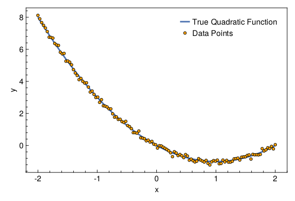
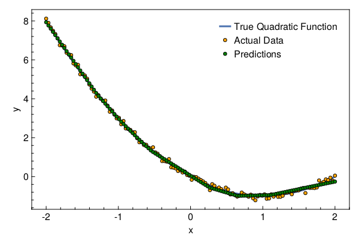

<a id='Fitting a Polynomial using MLP'></a>

# Fitting a Polynomial using MLP


In this tutorial we will fit a MultiLayer Perceptron (MLP) on data generated from a polynomial.


<a id='Package Imports'></a>

## Package Imports


```julia
using Lux
using LuxAMDGPU,
    LuxCUDA, Optimisers, Random, Statistics, Zygote, CairoMakie, MakiePublication
```


```
  Activating project at `/var/lib/buildkite-agent/builds/gpuci-11/julialang/lux-dot-jl/examples`
```


<a id='Dataset'></a>

## Dataset


Generate 128 datapoints from the polynomial $y = x^2 - 2x$.


```julia
function generate_data(rng::AbstractRNG)
    x = reshape(collect(range(-2.0f0, 2.0f0, 128)), (1, 128))
    y = evalpoly.(x, ((0, -2, 1),)) .+ randn(rng, (1, 128)) .* 0.1f0
    return (x, y)
end
```


```
generate_data (generic function with 1 method)
```


Initialize the random number generator and fetch the dataset.


```julia
rng = MersenneTwister()
Random.seed!(rng, 12345)

(x, y) = generate_data(rng)
```


```
(Float32[-2.0 -1.968504 … 1.968504 2.0], [8.11723579535073 7.8972862806322315 … -0.21213293699653427 0.049985105882301])
```


Let's visualize the dataset


```julia
with_theme(theme_web()) do
    fig = Figure()
    ax = CairoMakie.Axis(fig[1, 1]; xlabel="x", ylabel="y")

    l = lines!(ax, x[1, :], x -> evalpoly(x, (0, -2, 1)); linewidth=3)
    s = scatter!(ax, x[1, :], y[1, :]; markersize=8, color=:orange,
        strokecolor=:black, strokewidth=1)

    axislegend(ax, [l, s], ["True Quadratic Function", "Data Points"])

    return fig
end
```




<a id='Neural Network'></a>

## Neural Network


For this problem, you should not be using a neural network. But let's still do that!


```julia
model = Chain(Dense(1 => 16, relu), Dense(16 => 1))
```


```
Chain(
    layer_1 = Dense(1 => 16, relu),     # 32 parameters
    layer_2 = Dense(16 => 1),           # 17 parameters
)         # Total: 49 parameters,
          #        plus 0 states.
```


<a id='Optimizer'></a>

## Optimizer


We will use Adam from Optimisers.jl


```julia
opt = Adam(0.03f0)
```


```
Optimisers.Adam{Float32}(0.03f0, (0.9f0, 0.999f0), 1.1920929f-7)
```


<a id='Loss Function'></a>

## Loss Function


We will use the `Lux.Training` API so we need to ensure that our loss function takes 4 inputs – model, parameters, states and data. The function must return 3 values – loss, updated_state, and any computed statistics.


```julia
function loss_function(model, ps, st, data)
    y_pred, st = Lux.apply(model, data[1], ps, st)
    mse_loss = mean(abs2, y_pred .- data[2])
    return mse_loss, st, ()
end
```


```
loss_function (generic function with 1 method)
```


<a id='Training'></a>

## Training


First we will create a [`Lux.Experimental.TrainState`](../../../api/Lux/contrib#Lux.Experimental.TrainState) which is essentially a convenience wrapper over parameters, states and optimizer states.


```julia
tstate = Lux.Training.TrainState(rng, model, opt)
```


```
Lux.Experimental.TrainState{Chain{NamedTuple{(:layer_1, :layer_2), Tuple{Dense{true, typeof(relu), typeof(glorot_uniform), typeof(zeros32)}, Dense{true, typeof(identity), typeof(glorot_uniform), typeof(zeros32)}}}, Nothing}, NamedTuple{(:layer_1, :layer_2), Tuple{NamedTuple{(:weight, :bias), Tuple{CuArray{Float32, 2, CUDA.Mem.DeviceBuffer}, CuArray{Float32, 2, CUDA.Mem.DeviceBuffer}}}, NamedTuple{(:weight, :bias), Tuple{CuArray{Float32, 2, CUDA.Mem.DeviceBuffer}, CuArray{Float32, 2, CUDA.Mem.DeviceBuffer}}}}}, NamedTuple{(:layer_1, :layer_2), Tuple{NamedTuple{(), Tuple{}}, NamedTuple{(), Tuple{}}}}, NamedTuple{(:layer_1, :layer_2), Tuple{NamedTuple{(:weight, :bias), Tuple{Optimisers.Leaf{Optimisers.Adam{Float32}, Tuple{CuArray{Float32, 2, CUDA.Mem.DeviceBuffer}, CuArray{Float32, 2, CUDA.Mem.DeviceBuffer}, Tuple{Float32, Float32}}}, Optimisers.Leaf{Optimisers.Adam{Float32}, Tuple{CuArray{Float32, 2, CUDA.Mem.DeviceBuffer}, CuArray{Float32, 2, CUDA.Mem.DeviceBuffer}, Tuple{Float32, Float32}}}}}, NamedTuple{(:weight, :bias), Tuple{Optimisers.Leaf{Optimisers.Adam{Float32}, Tuple{CuArray{Float32, 2, CUDA.Mem.DeviceBuffer}, CuArray{Float32, 2, CUDA.Mem.DeviceBuffer}, Tuple{Float32, Float32}}}, Optimisers.Leaf{Optimisers.Adam{Float32}, Tuple{CuArray{Float32, 2, CUDA.Mem.DeviceBuffer}, CuArray{Float32, 2, CUDA.Mem.DeviceBuffer}, Tuple{Float32, Float32}}}}}}}}(Chain(), (layer_1 = (weight = Float32[0.36222202; 0.23371002; … ; 0.5260752; -0.07562564;;], bias = Float32[0.0; 0.0; … ; 0.0; 0.0;;]), layer_2 = (weight = Float32[-0.14330137 -0.39328107 … -0.34761065 -0.05758927], bias = Float32[0.0;;])), (layer_1 = NamedTuple(), layer_2 = NamedTuple()), (layer_1 = (weight = Leaf(Adam{Float32}(0.03, (0.9, 0.999), 1.19209f-7), (Float32[0.0; 0.0; … ; 0.0; 0.0;;], Float32[0.0; 0.0; … ; 0.0; 0.0;;], (0.9, 0.999))), bias = Leaf(Adam{Float32}(0.03, (0.9, 0.999), 1.19209f-7), (Float32[0.0; 0.0; … ; 0.0; 0.0;;], Float32[0.0; 0.0; … ; 0.0; 0.0;;], (0.9, 0.999)))), layer_2 = (weight = Leaf(Adam{Float32}(0.03, (0.9, 0.999), 1.19209f-7), (Float32[0.0 0.0 … 0.0 0.0], Float32[0.0 0.0 … 0.0 0.0], (0.9, 0.999))), bias = Leaf(Adam{Float32}(0.03, (0.9, 0.999), 1.19209f-7), (Float32[0.0;;], Float32[0.0;;], (0.9, 0.999))))), 0)
```


Now we will use Zygote for our AD requirements.


```julia
vjp_rule = Lux.Training.AutoZygote()
```


```
ADTypes.AutoZygote()
```


Finally the training loop.


```julia
function main(tstate::Lux.Experimental.TrainState, vjp, data, epochs)
    data = data .|> gpu_device()
    for epoch in 1:epochs
        grads, loss, stats, tstate = Lux.Training.compute_gradients(vjp,
            loss_function, data, tstate)
        @info epoch=epoch loss=loss
        tstate = Lux.Training.apply_gradients(tstate, grads)
    end
    return tstate
end

dev_cpu = cpu_device()
dev_gpu = gpu_device()

tstate = main(tstate, vjp_rule, (x, y), 250)
y_pred = dev_cpu(Lux.apply(tstate.model, dev_gpu(x), tstate.parameters, tstate.states)[1])
```


```
1×128 Matrix{Float32}:
 7.93183  7.76661  7.60138  7.43616  …  -0.305276  -0.280904  -0.256532
```


Let's plot the results


```julia
with_theme(theme_web()) do
    fig = Figure()
    ax = CairoMakie.Axis(fig[1, 1]; xlabel="x", ylabel="y")

    l = lines!(ax, x[1, :], x -> evalpoly(x, (0, -2, 1)); linewidth=3)
    s1 = scatter!(ax, x[1, :], y[1, :]; markersize=8, color=:orange,
        strokecolor=:black, strokewidth=1)
    s2 = scatter!(ax, x[1, :], y_pred[1, :]; markersize=8, color=:green,
        strokecolor=:black, strokewidth=1)

    axislegend(ax, [l, s1, s2], ["True Quadratic Function", "Actual Data", "Predictions"])

    return fig
end
```




---


*This page was generated using [Literate.jl](https://github.com/fredrikekre/Literate.jl).*

