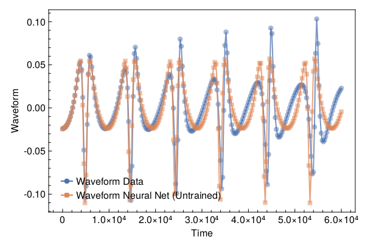
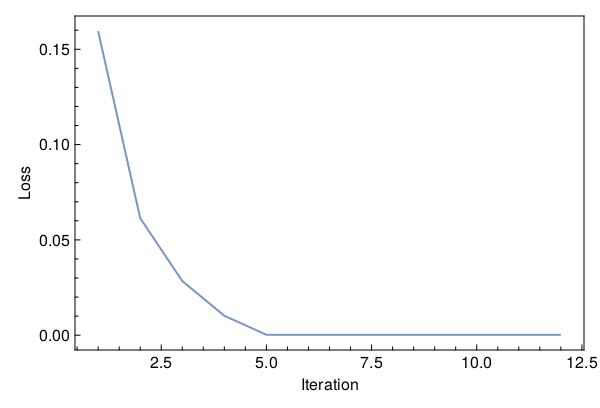
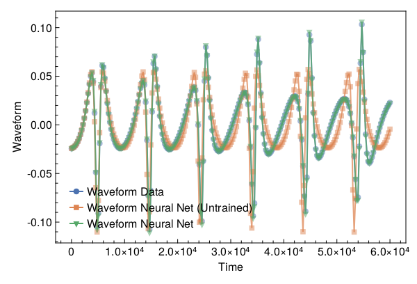

<a id='Training-a-Neural-ODE-to-Model-Gravitational-Waveforms'></a>

# Training a Neural ODE to Model Gravitational Waveforms


This code is adapted from [Astroinformatics/ScientificMachineLearning](https://github.com/Astroinformatics/ScientificMachineLearning/blob/c93aac3a460d70b4cce98836b677fd9b732e94b7/neuralode_gw.ipynb)


The code has been minimally adapted from [Keith et. al. 2021](https://arxiv.org/abs/2102.12695) which originally used Flux.jl


<a id='Package-Imports'></a>

## Package Imports


```julia
using Lux, ComponentArrays, LineSearches, LuxAMDGPU, LuxCUDA, OrdinaryDiffEq,
    Optimization, OptimizationOptimJL, Random, SciMLSensitivity
using CairoMakie, MakiePublication
CUDA.allowscalar(false)
```


```
┌ Warning: Module OptimizationSparseFinitediffExt with build ID ffffffff-ffff-ffff-0006-40bf1c4ca9e8 is missing from the cache.
│ This may mean OptimizationSparseFinitediffExt [d8ee6826-f4a5-5a2c-a3c2-4cd33c1c2fa7] does not support precompilation but is imported by a module that does.
└ @ Base loading.jl:1793
┌ Error: Error during loading of extension OptimizationSparseFinitediffExt of Optimization, use `Base.retry_load_extensions()` to retry.
│   exception =
│    1-element ExceptionStack:
│    Declaring __precompile__(false) is not allowed in files that are being precompiled.
│    Stacktrace:
│      [1] _require(pkg::Base.PkgId, env::Nothing)
│        @ Base ./loading.jl:1797
│      [2] _require_prelocked(uuidkey::Base.PkgId, env::Nothing)
│        @ Base ./loading.jl:1660
│      [3] _require_prelocked(uuidkey::Base.PkgId)
│        @ Base ./loading.jl:1658
│      [4] run_extension_callbacks(extid::Base.ExtensionId)
│        @ Base ./loading.jl:1255
│      [5] run_extension_callbacks(pkgid::Base.PkgId)
│        @ Base ./loading.jl:1290
│      [6] run_package_callbacks(modkey::Base.PkgId)
│        @ Base ./loading.jl:1124
│      [7] _require_prelocked(uuidkey::Base.PkgId, env::String)
│        @ Base ./loading.jl:1667
│      [8] macro expansion
│        @ ./loading.jl:1648 [inlined]
│      [9] macro expansion
│        @ ./lock.jl:267 [inlined]
│     [10] require(into::Module, mod::Symbol)
│        @ Base ./loading.jl:1611
│     [11] top-level scope
│        @ ~/.cache/julia-buildkite-plugin/depots/01872db4-8c79-43af-ab7d-12abac4f24f6/packages/Optimization/HPEh3/ext/OptimizationSparseForwarddiffExt.jl:8
│     [12] include
│        @ ./Base.jl:457 [inlined]
│     [13] include_package_for_output(pkg::Base.PkgId, input::String, depot_path::Vector{String}, dl_load_path::Vector{String}, load_path::Vector{String}, concrete_deps::Vector{Pair{Base.PkgId, UInt128}}, source::String)
│        @ Base ./loading.jl:2049
│     [14] top-level scope
│        @ stdin:3
│     [15] eval
│        @ ./boot.jl:370 [inlined]
│     [16] include_string(mapexpr::typeof(identity), mod::Module, code::String, filename::String)
│        @ Base ./loading.jl:1903
│     [17] include_string
│        @ ./loading.jl:1913 [inlined]
│     [18] exec_options(opts::Base.JLOptions)
│        @ Base ./client.jl:305
│     [19] _start()
│        @ Base ./client.jl:522
└ @ Base loading.jl:1261

```


<a id='Define-some-Utility-Functions'></a>

## Define some Utility Functions


::: tip


This section can be skipped. It defines functions to simulate the model, however, from a scientific machine learning perspective, isn't super relevant.


:::


We need a very crude 2-body path. Assume the 1-body motion is a newtonian 2-body position vector $r = r_1 - r_2$ and use Newtonian formulas to get $r_1$, $r_2$ (e.g. Theoretical Mechanics of Particles and Continua 4.3)


```julia
function one2two(path, m₁, m₂)
    M = m₁ + m₂
    r₁ = m₂ / M .* path
    r₂ = -m₁ / M .* path
    return r₁, r₂
end
```


```
one2two (generic function with 1 method)
```


Next we define a function to perform the change of variables: $(\chi(t),\phi(t)) \mapsto (x(t),y(t))$


```julia
@views function soln2orbit(soln, model_params=nothing)
    @assert size(soln, 1) ∈ [2, 4] "size(soln,1) must be either 2 or 4"

    if size(soln, 1) == 2
        χ = soln[1, :]
        ϕ = soln[2, :]

        @assert length(model_params)==3 "model_params must have length 3 when size(soln,2) = 2"
        p, M, e = model_params
    else
        χ = soln[1, :]
        ϕ = soln[2, :]
        p = soln[3, :]
        e = soln[4, :]
    end

    r = p ./ (1 .+ e .* cos.(χ))
    x = r .* cos.(ϕ)
    y = r .* sin.(ϕ)

    orbit = vcat(x', y')
    return orbit
end
```


```
soln2orbit (generic function with 2 methods)
```


This function uses second-order one-sided difference stencils at the endpoints; see https://doi.org/10.1090/S0025-5718-1988-0935077-0


```julia
function d_dt(v::AbstractVector, dt)
    a = -3 / 2 * v[1] + 2 * v[2] - 1 / 2 * v[3]
    b = (v[3:end] .- v[1:(end - 2)]) / 2
    c = 3 / 2 * v[end] - 2 * v[end - 1] + 1 / 2 * v[end - 2]
    return [a; b; c] / dt
end
```


```
d_dt (generic function with 1 method)
```


This function uses second-order one-sided difference stencils at the endpoints; see https://doi.org/10.1090/S0025-5718-1988-0935077-0


```julia
function d2_dt2(v::AbstractVector, dt)
    a = 2 * v[1] - 5 * v[2] + 4 * v[3] - v[4]
    b = v[1:(end - 2)] .- 2 * v[2:(end - 1)] .+ v[3:end]
    c = 2 * v[end] - 5 * v[end - 1] + 4 * v[end - 2] - v[end - 3]
    return [a; b; c] / (dt^2)
end
```


```
d2_dt2 (generic function with 1 method)
```


Now we define a function to compute the trace-free moment tensor from the orbit


```julia
function orbit2tensor(orbit, component, mass=1)
    x = orbit[1, :]
    y = orbit[2, :]

    Ixx = x .^ 2
    Iyy = y .^ 2
    Ixy = x .* y
    trace = Ixx .+ Iyy

    if component[1] == 1 && component[2] == 1
        tmp = Ixx .- trace ./ 3
    elseif component[1] == 2 && component[2] == 2
        tmp = Iyy .- trace ./ 3
    else
        tmp = Ixy
    end

    return mass .* tmp
end

function h_22_quadrupole_components(dt, orbit, component, mass=1)
    mtensor = orbit2tensor(orbit, component, mass)
    mtensor_ddot = d2_dt2(mtensor, dt)
    return 2 * mtensor_ddot
end

function h_22_quadrupole(dt, orbit, mass=1)
    h11 = h_22_quadrupole_components(dt, orbit, (1, 1), mass)
    h22 = h_22_quadrupole_components(dt, orbit, (2, 2), mass)
    h12 = h_22_quadrupole_components(dt, orbit, (1, 2), mass)
    return h11, h12, h22
end

function h_22_strain_one_body(dt::T, orbit) where {T}
    h11, h12, h22 = h_22_quadrupole(dt, orbit)

    h₊ = h11 - h22
    hₓ = T(2) * h12

    scaling_const = √(T(π) / 5)
    return scaling_const * h₊, -scaling_const * hₓ
end

function h_22_quadrupole_two_body(dt, orbit1, mass1, orbit2, mass2)
    h11_1, h12_1, h22_1 = h_22_quadrupole(dt, orbit1, mass1)
    h11_2, h12_2, h22_2 = h_22_quadrupole(dt, orbit2, mass2)
    h11 = h11_1 + h11_2
    h12 = h12_1 + h12_2
    h22 = h22_1 + h22_2
    return h11, h12, h22
end

function h_22_strain_two_body(dt::T, orbit1, mass1, orbit2, mass2) where {T}
    # compute (2,2) mode strain from orbits of BH 1 of mass1 and BH2 of mass 2

    @assert abs(mass1 + mass2 - 1.0)<1e-12 "Masses do not sum to unity"

    h11, h12, h22 = h_22_quadrupole_two_body(dt, orbit1, mass1, orbit2, mass2)

    h₊ = h11 - h22
    hₓ = T(2) * h12

    scaling_const = √(T(π) / 5)
    return scaling_const * h₊, -scaling_const * hₓ
end

function compute_waveform(dt::T, soln, mass_ratio, model_params=nothing) where {T}
    @assert mass_ratio≤1 "mass_ratio must be <= 1"
    @assert mass_ratio≥0 "mass_ratio must be non-negative"

    orbit = soln2orbit(soln, model_params)
    if mass_ratio > 0
        m₂ = inv(T(1) + mass_ratio)
        m₁ = mass_ratio * m₂

        orbit₁, orbit₂ = one2two(orbit, m₁, m₂)
        waveform = h_22_strain_two_body(dt, orbit1, mass1, orbit2, mass2)
    else
        waveform = h_22_strain_one_body(dt, orbit)
    end
    return waveform
end
```


```
compute_waveform (generic function with 2 methods)
```


<a id='Simulating-the-True-Model'></a>

## Simulating the True Model


`RelativisticOrbitModel` defines system of odes which describes motion of point like particle in schwarzschild background, uses


$$
u[1] = \chi
$$


$$
u[2] = \phi
$$


where, $p$, $M$, and $e$ are constants


```julia
function RelativisticOrbitModel(u, (p, M, e), t)
    χ, ϕ = u

    numer = (p - 2 - 2 * e * cos(χ)) * (1 + e * cos(χ))^2
    denom = sqrt((p - 2)^2 - 4 * e^2)

    χ̇ = numer * sqrt(p - 6 - 2 * e * cos(χ)) / (M * (p^2) * denom)
    ϕ̇ = numer / (M * (p^(3 / 2)) * denom)

    return [χ̇, ϕ̇]
end

mass_ratio = 0.0         # test particle
u0 = Float64[π, 0.0]     # initial conditions
datasize = 250
tspan = (0.0f0, 6.0f4)   # timespace for GW waveform
tsteps = range(tspan[1], tspan[2]; length=datasize)  # time at each timestep
dt_data = tsteps[2] - tsteps[1]
dt = 100.0
const ode_model_params = [100.0, 1.0, 0.5]; # p, M, e
```


Let's simulate the true model and plot the results using `OrdinaryDiffEq.jl`


```julia
prob = ODEProblem(RelativisticOrbitModel, u0, tspan, ode_model_params)
soln = Array(solve(prob, RK4(); saveat=tsteps, dt, adaptive=false))
waveform = first(compute_waveform(dt_data, soln, mass_ratio, ode_model_params))

fig = with_theme(theme_web()) do
    fig = Figure()
    ax = CairoMakie.Axis(fig[1, 1]; xlabel="Time", ylabel="Waveform")

    l = lines!(ax, tsteps, waveform; linewidth=2, alpha=0.75)
    s = scatter!(ax, tsteps, waveform; markershape=:circle, markeralpha=0.25, alpha=0.5)

    axislegend(ax, [[l, s]], ["Waveform Data"])

    return fig
end
```


<a id='Defiing-a-Neural-Network-Model'></a>

## Defiing a Neural Network Model


Next, we define the neural network model that takes 1 input (time) and has two outputs. We'll make a function `ODE_model` that takes the initial conditions, neural network parameters and a time as inputs and returns the derivatives.


It is typically never recommended to use globals but incase you do use them, make sure to mark them as `const`.


We will deviate from the standard Neural Network initialization and use `WeightInitializers.jl`,


```julia
const nn = Chain(Base.Fix1(broadcast, cos),
    Dense(1 => 32, cos; init_weight=truncated_normal(; std=1e-4)),
    Dense(32 => 32, cos; init_weight=truncated_normal(; std=1e-4)),
    Dense(32 => 2; init_weight=truncated_normal(; std=1e-4)))
ps, st = Lux.setup(MersenneTwister(), nn)
```


```
((layer_1 = NamedTuple(), layer_2 = (weight = Float32[0.000109843495; 2.0480626f-5; -3.978874f-5; 2.0031398f-6; 0.00011888148; -1.454407f-5; -6.545244f-5; 0.00017357597; -5.8164398f-5; -9.50473f-5; -7.321387f-5; -5.899606f-6; 4.2152365f-5; 0.00016783006; -8.692711f-5; 2.7770535f-5; 9.725103f-5; -2.0566167f-5; -4.4858196f-5; -0.0001520579; 3.8554474f-5; 9.526209f-5; 5.8512046f-6; 8.377338f-5; 0.00017262607; -9.714972f-5; 6.661342f-5; 7.484404f-5; -0.00014610596; 1.2098613f-5; -6.581696f-5; -0.00011631759;;], bias = Float32[0.0; 0.0; 0.0; 0.0; 0.0; 0.0; 0.0; 0.0; 0.0; 0.0; 0.0; 0.0; 0.0; 0.0; 0.0; 0.0; 0.0; 0.0; 0.0; 0.0; 0.0; 0.0; 0.0; 0.0; 0.0; 0.0; 0.0; 0.0; 0.0; 0.0; 0.0; 0.0;;]), layer_3 = (weight = Float32[1.1684168f-6 -2.3807996f-5 -4.3254357f-5 0.00010133504 2.6865786f-5 -6.568277f-5 6.0068625f-5 8.418587f-5 5.217601f-5 -0.00017738371 -4.1661246f-5 0.0001470672 -7.4970674f-5 0.00015739139 0.00018291551 0.00010122834 -6.368978f-5 5.169132f-5 0.00018710962 -7.9847254f-5 6.8796755f-5 -6.624095f-6 -5.9890062f-5 -0.00016013607 -8.11178f-6 0.00012624713 0.00014353491 -0.00013041 0.00020096418 -1.561645f-5 1.8205317f-5 2.1969501f-5; -8.039158f-5 2.5163103f-5 -0.00014870864 7.58205f-5 -5.2165666f-5 -7.5514617f-6 -8.118495f-5 -1.4248182f-5 1.0719386f-5 -3.854195f-5 0.0001640861 -0.00012627219 -0.0002095003 -0.00012987935 0.00011346672 -2.8695435f-5 -1.660973f-5 6.683902f-5 5.6568633f-6 0.00014974942 8.2462415f-5 9.376706f-5 8.1948056f-5 -1.5853031f-5 -7.525518f-5 -8.719106f-5 7.1327886f-5 -9.2499584f-5 -2.5592574f-6 6.973237f-5 -0.00019758311 2.3028155f-5; -0.00011846111 -6.880603f-5 0.00012721508 -4.7918456f-5 0.00010728912 0.000103415434 -0.00011042779 5.514186f-5 3.156338f-5 9.7839846f-5 5.4622316f-5 9.541381f-5 -2.140984f-5 -6.287443f-5 6.34399f-5 5.7397323f-5 -0.0001927042 -2.7890028f-5 -9.1912705f-5 -0.00018220424 1.4936196f-5 -0.0001318638 -5.7886293f-5 -0.00014047923 6.846348f-5 7.6635995f-5 -0.00015271288 0.00025039123 -0.00013769681 9.365664f-5 7.0399674f-6 0.00011755495; 3.1827407f-5 0.00017904288 3.445255f-5 -0.00022003986 -0.0001627137 8.126167f-5 -9.181451f-5 2.483455f-5 -0.0001047511 0.00022221029 -0.00018374789 -5.9379513f-6 6.1077335f-5 0.000145952 5.5564746f-5 -1.8326004f-5 7.29261f-5 2.4388317f-5 -9.2756934f-5 3.8075847f-5 6.211737f-5 -3.5114273f-5 -1.3722895f-5 7.438888f-5 -0.00019858907 -3.6088848f-5 8.9158246f-5 -0.000112383874 -4.841113f-6 3.441086f-5 -0.0001871387 -3.6043504f-5; 1.5417569f-5 -0.000105463325 -0.00017046949 -3.9548486f-5 3.995465f-5 -0.00011259061 8.167933f-6 0.00017325314 -3.256742f-5 -2.3043343f-5 -9.526996f-6 -5.3069085f-5 -0.00012196934 -6.474575f-5 0.0001641023 4.5539822f-5 -0.00010039811 8.091624f-5 1.0725698f-5 0.00011089555 -2.5276187f-5 -1.0007504f-5 -4.269039f-5 2.4073985f-5 6.317851f-5 -2.514142f-5 -4.586964f-5 9.7479526f-5 0.00015585095 0.000113149836 -7.491682f-5 2.301365f-6; 0.00018496305 2.7802787f-6 5.776264f-5 -5.909125f-6 0.00016130657 6.449578f-5 6.9700174f-5 3.4893666f-5 -1.1211164f-5 -3.408481f-5 -1.0939975f-5 -8.232345f-5 0.00016164244 4.4764864f-5 -7.222133f-5 2.0249875f-6 9.808169f-5 0.00012496518 -7.8457255f-5 3.6406484f-5 -0.00018252876 -5.9277805f-5 -0.000114875715 -0.00014479154 9.306446f-5 1.5007299f-5 9.187702f-5 1.769012f-5 -0.0001778409 -7.1804476f-5 -9.61411f-6 -0.00023854729; 0.00016020138 -5.863866f-5 -9.837558f-5 -0.00014469921 1.8427172f-5 7.0880575f-5 2.8211243f-5 6.0459565f-6 7.88753f-5 0.00015124619 -4.9078026f-5 3.070316f-5 -1.6428343f-5 -5.3308745f-6 0.00017721565 0.00014208604 0.0001192316 9.1229806f-5 -2.1425647f-5 3.818179f-6 9.4734656f-5 4.870181f-5 7.3690055f-5 -0.00010874671 -3.7364305f-5 -7.727013f-5 0.00020066703 9.4413925f-5 0.00015301132 -4.0320927f-5 -9.081538f-5 0.00011484861; -7.7796976f-5 6.0170087f-6 1.7049158f-5 -0.00015829802 -0.00011543317 9.759622f-5 9.3905175f-5 -1.7757931f-5 -0.00017504721 8.132695f-5 -8.598009f-5 8.3832565f-5 -0.000121858444 -1.8898652f-5 9.74261f-5 6.705938f-5 -7.224142f-5 0.00014535102 1.8619539f-6 -0.00011619355 9.234958f-5 -0.0001523486 -2.9483015f-5 -0.00015738799 6.130936f-5 4.302148f-5 3.7651713f-5 -0.00012889359 -0.000118726064 -0.0001307758 -3.0718034f-5 9.515462f-5; -3.4714994f-5 5.7600202f-5 -6.400494f-5 0.00025094446 -1.2519501f-5 -0.00013777388 -7.162401f-5 -1.1194505f-5 4.949512f-5 6.919346f-5 2.3349752f-5 1.4610601f-5 9.0647525f-5 4.8552687f-5 3.6026795f-5 -7.92427f-6 -0.00016405097 -0.0001244153 0.00013157146 2.3732504f-5 5.8012472f-5 -7.3016694f-5 -2.7564785f-5 7.7870034f-5 5.2208845f-5 -0.00022881044 5.1163464f-5 -0.00015515488 -5.6163193f-5 0.00015587422 -2.166955f-6 -2.7304744f-5; 1.3405125f-5 -8.488983f-5 3.1579086f-5 -5.3505642f-5 2.8760394f-5 -3.0656927f-5 -0.00013432019 -9.064775f-5 4.3235428f-5 -1.9509504f-5 -6.5072396f-5 -1.1794499f-5 3.116902f-5 3.433966f-5 -9.924092f-5 0.00014143376 -8.046054f-5 -8.783355f-5 4.457271f-5 -2.8255245f-5 -0.00015127847 -1.0710521f-5 -1.5952108f-5 0.00011323086 -4.4844714f-5 -0.00018888261 8.558392f-5 -1.6029408f-5 -4.3053475f-5 0.00015113618 -0.00026795166 2.4146522f-5; -0.00013247607 7.337738f-5 -7.9903975f-6 -6.068714f-5 -7.420195f-5 8.628832f-6 -0.00014550665 -3.217655f-5 0.00011066914 -4.9644495f-5 5.891156f-5 -6.784414f-5 5.1918123f-5 8.031016f-5 0.00012979016 -8.9435736f-5 -0.00024244972 8.755948f-5 -0.00013782563 2.9494033f-5 7.536444f-7 0.0001258935 0.00018831909 -0.0001485096 -2.2125648f-6 -7.660806f-5 -2.8716859f-5 4.580452f-5 0.00011483209 1.3307774f-5 4.761699f-5 0.00013678233; 5.1060968f-5 -0.00012530017 -3.5134424f-5 -5.14494f-5 -2.618733f-5 6.6087014f-5 7.340668f-5 -1.3073055f-5 -1.2622145f-5 9.34007f-5 -1.48614445f-5 0.00014917267 -8.1719474f-5 -3.266281f-5 -0.00014822351 1.7432789f-5 6.405343f-5 -0.00018419963 0.00011223874 5.4419743f-5 3.58736f-5 6.363043f-5 -0.00010881161 1.0766932f-5 6.385226f-5 0.00010182264 8.394723f-5 -5.3877087f-5 -9.430983f-5 6.6534805f-5 4.62967f-5 -3.8130307f-5; 0.0001381214 5.2097857f-5 -7.2247724f-7 0.00017452071 -5.631037f-5 9.5070114f-5 5.1070194f-5 7.465332f-5 0.00016840061 6.333622f-5 -0.00016689762 5.462873f-6 2.634198f-5 -5.3088694f-5 -0.0001256896 -8.121258f-5 -4.877821f-6 -6.71728f-5 0.00017508387 -0.00012703842 -9.384863f-5 -0.0001354236 -3.2875196f-5 -0.00014117322 7.9547375f-5 -9.9818215f-5 7.540314f-6 9.9446246f-5 -3.5049572f-5 0.00015874689 -6.574013f-5 6.518625f-5; 0.0001058792 5.834023f-5 -7.3370655f-5 -0.00024396181 4.832904f-5 -5.3644442f-5 0.00017974095 -4.6382233f-5 0.00017453729 8.063603f-6 2.9203595f-6 0.0002016245 -1.5149499f-5 5.602107f-5 -1.0552965f-5 3.4563775f-5 -4.2178133f-5 -6.329507f-5 -7.875415f-5 -3.441571f-5 9.182949f-5 4.160914f-5 0.00010988639 -0.00012871859 -1.3021161f-6 -7.1053386f-5 -0.00016824943 -3.0643365f-5 -9.417566f-5 -1.3813483f-5 -5.5770837f-5 -3.404285f-5; 9.6282296f-5 -3.847833f-5 2.6968559f-5 4.940827f-6 4.6951816f-5 9.654078f-5 -7.708266f-7 4.4336837f-5 -2.2052802f-5 0.00017078516 3.8079818f-6 0.000143136 -2.7465288f-5 1.7143246f-5 4.2963995f-5 -0.00012335017 9.622745f-5 0.00017371037 -3.139439f-5 1.8318346f-5 9.5906864f-5 0.0001309369 1.2374353f-5 -3.706552f-5 3.6120775f-5 2.1359487f-5 -0.00021777114 -0.00010920865 -0.000101565696 0.00020250388 0.00019204753 -0.00014921669; 0.00019668766 -5.0215007f-5 -3.9953582f-5 -0.00012240827 -1.9446647f-5 0.00012729989 -8.083427f-5 -0.00012915407 -7.5088945f-5 -0.00027393052 0.00012296284 -7.002616f-5 6.841688f-5 -4.1521344f-5 -3.2687083f-5 -0.00017457157 -4.0034505f-5 -1.1886971f-5 -7.099263f-5 -2.5894718f-5 3.5629317f-5 -5.6397126f-5 0.00013519677 6.585278f-5 -0.00012665258 -0.00018680631 -5.3612563f-5 -4.863921f-5 7.0980523f-6 -0.000103151375 5.522819f-5 -6.387623f-5; -2.3895584f-5 -2.8495124f-5 -0.00018745291 -2.1714382f-6 -8.11572f-5 -2.2705966f-5 9.769749f-5 -8.77889f-5 3.404396f-5 -0.00014561905 -4.3915775f-6 4.2677133f-5 9.0817775f-5 -8.069908f-5 8.149881f-5 -1.3225296f-5 3.7362253f-5 -6.655539f-5 -0.00015162429 -3.092873f-5 -7.007474f-5 0.00010518723 -4.445733f-5 -2.8062208f-5 0.00027151796 5.2566553f-5 2.573512f-5 0.00012933006 -6.651571f-5 2.7065656f-5 -3.0293077f-5 -3.8078922f-6; 2.2124941f-5 -1.8811234f-5 -0.00013747514 -4.0638246f-5 1.2838317f-5 -1.860722f-5 6.2353065f-5 -0.00010053987 -4.5326083f-6 -1.795513f-5 0.00016106384 4.9815055f-5 -0.00011190306 2.7198901f-5 -0.00013105416 1.44953f-5 -4.5871435f-5 -8.093477f-5 -0.00010595837 7.470126f-5 -0.00010274943 1.2423784f-6 3.126948f-5 1.0984302f-6 -7.206769f-6 2.6123726f-5 2.4598405f-5 -9.128622f-6 0.00020155133 0.00018201709 7.1455775f-5 -0.0001489167; 0.00018974571 -2.7163616f-5 -6.802119f-5 0.00023768729 -0.0002051867 -2.9202129f-5 -0.00016571053 -6.708887f-5 -0.00021385 -1.5487334f-5 -9.782133f-5 -0.00010229628 -1.3858073f-5 -2.4710345f-5 -8.122723f-6 -3.225391f-5 0.00012361245 9.867377f-5 -4.0503342f-5 -8.7664475f-6 0.00021937245 7.583165f-5 2.8996788f-5 4.0911335f-5 0.00010413528 -0.00016570852 -8.555832f-6 3.9603165f-5 -3.3684537f-5 9.288777f-5 9.6689415f-5 0.00017183715; 6.6160974f-5 7.186261f-5 -0.00012942901 0.00016181626 2.0457283f-5 0.00020215519 -5.8610094f-5 1.7108769f-5 -0.00010497024 6.715853f-5 -7.5859665f-5 6.545485f-5 6.297609f-5 1.7094184f-5 0.000112254 3.7397142f-6 -0.00017558839 -5.060048f-5 7.933365f-5 7.2204384f-5 0.00021534736 -2.693534f-5 -3.3635017f-5 1.5709407f-5 9.732461f-5 3.5307603f-5 4.6644645f-6 -0.00016670485 -0.00011614549 9.833564f-5 -1.9669145f-5 0.0001204097; -9.917503f-5 -9.4113006f-5 4.704015f-5 -2.7875085f-5 7.931605f-5 5.807719f-5 0.00010615438 -0.00021702576 -8.363536f-5 1.342985f-5 -9.535612f-6 0.00012921353 7.527747f-5 5.908347f-6 -7.114088f-5 -0.00021307626 -5.5599026f-5 -0.00010552552 -2.5349806f-5 -0.00014686667 1.2577327f-5 -0.00020062318 7.039466f-5 -5.4485903f-5 4.0294835f-5 0.00010395169 0.00018873074 -6.713614f-5 0.00011524291 -9.725142f-5 6.173354f-5 -4.1126183f-5; -6.901658f-5 -1.0348389f-5 -1.5834128f-7 3.4338311f-6 5.2982898f-5 -8.873538f-5 -3.892334f-5 0.00012544324 -0.00012332652 -0.00016738294 -5.9518106f-6 -3.2851793f-5 -3.6033078f-5 -4.2093492f-5 3.630012f-5 6.161344f-5 -9.52375f-5 -9.1454465f-5 -1.7281933f-5 0.00015209199 7.341619f-5 -2.9210267f-5 -7.525613f-5 0.00024394131 -7.909614f-5 4.85777f-5 4.0210394f-5 -3.992737f-5 -2.3819155f-5 7.025602f-5 -2.2178287f-5 -1.9314137f-5; 3.4370692f-5 0.00017108058 1.2378237f-5 1.7869106f-5 5.1312054f-5 0.00016345733 8.0550155f-5 4.32706f-5 0.00017239887 0.00012152298 2.586036f-5 -3.177536f-5 4.916099f-5 5.5200348f-5 0.00010623798 0.0001157152 8.699432f-5 2.7155122f-5 -7.637469f-6 1.6596794f-5 0.00018213986 -9.381577f-5 -1.1290461f-5 2.4993968f-5 4.344921f-5 -0.00015116221 4.9456452f-5 0.00014401908 -3.1719388f-5 6.755334f-5 -0.00016451662 7.739569f-5; 0.00017291663 6.966129f-6 9.441187f-5 -0.00016862593 -4.5763572f-5 3.0208053f-6 1.798027f-6 -0.00013987884 3.135961f-5 7.62659f-5 -6.6208806f-5 -5.0646435f-5 4.827605f-5 -8.900509f-6 7.78233f-5 1.2728477f-5 -2.0810601f-5 -2.6578396f-6 -5.2710326f-5 0.00018938677 0.00013840568 3.7479967f-5 0.000104467785 3.074476f-5 3.9941384f-5 0.00014798541 -0.0001491296 0.000108399545 6.594448f-5 1.3982744f-5 3.4415454f-5 -6.6330926f-5; 4.0301416f-5 -7.368347f-5 6.4593674f-5 -4.538441f-6 5.4575597f-5 4.614479f-6 -0.0001848247 -9.577504f-5 2.4583462f-6 4.6216686f-5 0.00011622331 3.326816f-5 1.2713143f-5 -2.950118f-5 8.322933f-5 -0.00010915307 4.9424645f-5 -9.6710304f-5 4.0377105f-5 0.00010261608 1.233241f-5 0.00012396103 0.000134126 -2.5014962f-5 3.554177f-5 -8.779036f-5 -2.6162994f-5 -2.006071f-5 -9.988825f-6 0.00011540862 2.1192753f-5 -7.3168914f-5; 3.645515f-5 0.00021202763 7.536644f-5 -3.5363963f-5 0.00020856227 -0.00010507284 -6.3652864f-5 -4.9361013f-5 4.4620832f-5 -8.457671f-5 2.968579f-6 -4.3664827f-6 -2.8694782f-5 -7.0029128f-6 4.8103753f-5 9.481311f-6 -0.00016548274 -3.4236095f-5 -9.334474f-5 6.070029f-5 6.0722494f-5 7.0633745f-5 -2.5838423f-5 -2.4284527f-5 -0.000121159865 7.248905f-5 2.3839354f-7 8.150544f-6 9.34478f-5 8.861992f-5 3.8848248f-5 0.00021077537; -2.9632538f-5 -5.393987f-5 -5.4315926f-5 -4.3171196f-5 4.0371786f-5 -1.2515526f-5 -0.0001173437 -3.8530816f-5 -0.00014928686 -6.825339f-5 4.521066f-5 3.6368972f-5 2.9026178f-5 4.7845573f-5 -0.00019536419 6.494294f-5 -6.0601054f-5 9.0807574f-5 -3.4477984f-5 9.980808f-5 -4.1730673f-5 -3.6545283f-5 9.89512f-5 0.00011397723 7.699417f-5 -4.472771f-5 -3.521116f-5 2.406045f-5 2.3458839f-5 -3.8444578f-5 -0.00015704843 7.2982446f-5; 0.0002508471 1.9631187f-5 -1.6959119f-5 -0.00017090385 -7.254113f-5 4.3223663f-6 5.4006878f-6 3.2884063f-6 -2.5270294f-5 5.252302f-5 8.969292f-5 4.0139552f-5 4.696079f-5 -3.0148325f-5 0.00010919005 -8.788418f-5 9.386645f-6 -1.5889253f-5 2.6006315f-5 0.00015338705 7.176331f-6 -1.670999f-5 -1.8110508f-5 -4.76396f-6 -2.6003934f-5 0.00017829819 -1.0705862f-5 0.00013281335 -7.741137f-7 6.930095f-6 0.00018938552 0.0001666617; 8.467875f-7 0.00013735486 0.00012657871 9.642342f-5 -9.117097f-5 -6.992448f-5 6.927336f-5 4.7070323f-5 -4.1608717f-5 -9.054595f-5 1.0742047f-5 7.7820754f-5 0.000103711165 -0.0001110295 0.00015784308 5.663328f-6 3.6389596f-5 7.584372f-5 5.0016133f-5 -6.0799655f-5 1.17395275f-5 0.00014270842 5.7680503f-5 -3.4389363f-5 2.5652877f-5 1.2561424f-5 1.7340475f-5 -0.00014719977 -0.00017404939 -1.2229562f-5 -9.7806675f-5 -8.5120635f-5; 0.000118694086 6.859749f-5 -2.1390242f-5 7.894151f-5 1.602187f-5 1.392813f-5 -6.235082f-5 -1.782308f-5 -9.716783f-5 3.28863f-5 -5.129525f-5 9.346792f-5 7.52028f-5 2.1472031f-5 -1.5766072f-5 -2.3026068f-5 -8.4479114f-5 7.290182f-5 -0.00026133854 0.00014721602 -4.361547f-5 -4.1833384f-5 -0.00012664919 0.00015746578 -0.00028438136 -0.00012805536 -6.754786f-5 -2.6227503f-5 -3.4591405f-5 3.3577726f-5 -0.00022715496 -8.420704f-5; -1.4414649f-5 0.00012391851 -2.231119f-5 8.910028f-5 5.0697974f-5 -4.324904f-5 0.000134154 -2.241971f-5 0.00014362679 -7.4872354f-5 2.567366f-5 0.00014323529 -0.00014851536 7.756291f-5 2.5958316f-5 0.00015486032 0.00014737774 4.339966f-5 -4.181685f-5 6.3715433f-6 6.978813f-5 -0.00013725768 1.0093758f-5 6.275534f-5 5.759865f-5 -3.9752813f-5 -1.5313739f-5 1.6160298f-5 -2.4110099f-5 -0.00012274555 -0.00015491724 -7.9082005f-5; 5.8620844f-5 0.000117438096 0.00012365634 -0.00011057944 1.1323421f-5 -8.62187f-5 -0.000112409725 -0.00010523442 8.541308f-5 -8.9381145f-5 6.426009f-6 5.733825f-5 -1.696121f-5 7.014175f-5 1.6726292f-5 -0.00013375991 -3.4894685f-5 4.946081f-5 -8.7706525f-5 3.5660647f-5 -0.00016079875 -0.00016870053 1.362327f-5 -0.00010783516 -0.0001883536 8.010901f-5 6.587976f-5 1.932935f-6 -1.6099299f-5 0.00015439544 -0.00014939504 9.41629f-5], bias = Float32[0.0; 0.0; 0.0; 0.0; 0.0; 0.0; 0.0; 0.0; 0.0; 0.0; 0.0; 0.0; 0.0; 0.0; 0.0; 0.0; 0.0; 0.0; 0.0; 0.0; 0.0; 0.0; 0.0; 0.0; 0.0; 0.0; 0.0; 0.0; 0.0; 0.0; 0.0; 0.0;;]), layer_4 = (weight = Float32[5.2571493f-5 -0.00024085614 -0.0002196764 -7.3581745f-5 -0.00016878218 2.3470848f-5 5.314767f-5 -0.00012157133 -1.6023989f-5 -6.766634f-5 0.00015447954 -0.00016309551 -0.0003183878 -7.8817975f-5 -0.00023501625 3.0983123f-5 2.3028155f-5 0.00012573993 -0.00014536871 7.7480945f-5 9.183678f-5 -2.5804438f-5 2.342106f-5 -0.00021549824 -5.001014f-5 0.00010300371 -5.0859442f-5 7.340699f-5 -8.240374f-5 -0.0001789622 -3.0323674f-5 -7.683358f-5; -8.198782f-5 -8.782075f-6 0.00014026681 0.00020671615 -2.9365317f-5 0.00011695378 -2.171608f-5 -1.2687779f-5 -2.8854365f-5 4.264343f-6 -4.7907968f-5 5.539132f-5 -0.00028834518 -5.0461622f-5 1.4352499f-6 5.096683f-5 -5.9752943f-5 -9.0023444f-5 -0.00016628174 4.00144f-5 -2.6683763f-5 0.00013117267 1.2891135f-5 -3.5048175f-5 -1.5305484f-5 -7.131983f-5 8.986367f-5 -0.00010958896 6.0857936f-5 -0.00014928186 0.00014636946 -9.728072f-6], bias = Float32[0.0; 0.0;;])), (layer_1 = NamedTuple(), layer_2 = NamedTuple(), layer_3 = NamedTuple(), layer_4 = NamedTuple()))
```


Similar to most DL frameworks, Lux defaults to using `Float32`, however, in this case we need Float64


```julia
const params = ComponentArray{Float64}(ps)
```


```
ComponentVector{Float64}(layer_1 = Float64[], layer_2 = (weight = [0.00010984349501086399; 2.0480625607888214e-5; -3.978874156018719e-5; 2.003139798034681e-6; 0.00011888147855643183; -1.4544069927069359e-5; -6.545244104927406e-5; 0.00017357597243972123; -5.816439806949347e-5; -9.504729678155854e-5; -7.321387238334864e-5; -5.899606094317278e-6; 4.2152365494985133e-5; 0.0001678300614003092; -8.692710980540141e-5; 2.7770534870796837e-5; 9.72510315477848e-5; -2.0566167222568765e-5; -4.485819590627216e-5; -0.00015205789532046765; 3.8554473576368764e-5; 9.526209032628685e-5; 5.851204605278326e-6; 8.377338235732168e-5; 0.00017262606706935912; -9.714972111396492e-5; 6.661342195002362e-5; 7.484404341084883e-5; -0.0001461059582652524; 1.2098613296984695e-5; -6.581695924978703e-5; -0.0001163175911642611;;], bias = [0.0; 0.0; 0.0; 0.0; 0.0; 0.0; 0.0; 0.0; 0.0; 0.0; 0.0; 0.0; 0.0; 0.0; 0.0; 0.0; 0.0; 0.0; 0.0; 0.0; 0.0; 0.0; 0.0; 0.0; 0.0; 0.0; 0.0; 0.0; 0.0; 0.0; 0.0; 0.0;;]), layer_3 = (weight = [1.168416815744422e-6 -2.380799560341984e-5 -4.3254356569377705e-5 0.00010133504110854119 2.686578591237776e-5 -6.568276876350865e-5 6.006862531648949e-5 8.418587094638497e-5 5.2176008466631174e-5 -0.00017738371388986707 -4.1661245631985366e-5 0.0001470671995775774 -7.497067417716607e-5 0.00015739139053039253 0.0001829155080486089 0.00010122833919012919 -6.368978210957721e-5 5.1691320550162345e-5 0.0001871096173999831 -7.984725380083546e-5 6.879675493109971e-5 -6.624095021834364e-6 -5.9890062402701005e-5 -0.00016013607091736048 -8.11177960713394e-6 0.0001262471341760829 0.00014353491133078933 -0.00013041000056546181 0.00020096417574677616 -1.5616449672961608e-5 1.820531724661123e-5 2.196950117649976e-5; -8.039158274186775e-5 2.5163102691294625e-5 -0.00014870864106342196 7.582049875054508e-5 -5.216566569288261e-5 -7.551461749244481e-6 -8.118495316011831e-5 -1.4248182196752168e-5 1.0719386409618892e-5 -3.8541951653314754e-5 0.0001640861009946093 -0.00012627219257410616 -0.0002095003001159057 -0.0001298793504247442 0.00011346671817591414 -2.8695434593828395e-5 -1.6609730664640665e-5 6.683902029180899e-5 5.656863322656136e-6 0.00014974942314438522 8.246241486631334e-5 9.376706293551251e-5 8.194805559469387e-5 -1.585303107276559e-5 -7.525517867179587e-5 -8.719105971977115e-5 7.132788596209139e-5 -9.249958384316415e-5 -2.5592573820176767e-6 6.973237032070756e-5 -0.00019758311100304127 2.3028154828352854e-5; -0.00011846111010527238 -6.88060317770578e-5 0.0001272150839213282 -4.791845640284009e-5 0.000107289117295295 0.00010341543384129182 -0.00011042779078707099 5.514185977517627e-5 3.156338061671704e-5 9.783984569367021e-5 5.46223163837567e-5 9.54138085944578e-5 -2.1409839973784983e-5 -6.28744310233742e-5 6.343989662127569e-5 5.739732296206057e-5 -0.00019270420307293534 -2.789002792269457e-5 -9.191270510200411e-5 -0.00018220423953607678 1.4936195839254651e-5 -0.00013186379510443658 -5.7886292779585347e-5 -0.00014047922741156071 6.846347969258204e-5 7.663599535590038e-5 -0.00015271287702489644 0.00025039122556336224 -0.0001376968139084056 9.365664300275967e-5 7.039967385935597e-6 0.00011755494779208675; 3.182740692864172e-5 0.00017904287960845977 3.445255060796626e-5 -0.00022003985941410065 -0.0001627136953175068 8.126167085720226e-5 -9.181450877804309e-5 2.483454954926856e-5 -0.00010475110320840031 0.0002222102921223268 -0.0001837478921515867 -5.937951300438726e-6 6.107733497628942e-5 0.0001459519990021363 5.556474570767023e-5 -1.832600355555769e-5 7.292610098375008e-5 2.4388316887780093e-5 -9.275693446397781e-5 3.807584653259255e-5 6.211736763361841e-5 -3.511427348712459e-5 -1.3722895346290898e-5 7.438888133037835e-5 -0.00019858907035086304 -3.6088847991777584e-5 8.915824582800269e-5 -0.00011238387378398329 -4.841112968279049e-6 3.441085937083699e-5 -0.0001871387066785246 -3.604350422392599e-5; 1.5417568647535518e-5 -0.00010546332487137988 -0.00017046948778443038 -3.954848580178805e-5 3.995465158368461e-5 -0.0001125906128436327 8.167932719516102e-6 0.0001732531382003799 -3.256741911172867e-5 -2.304334338987246e-5 -9.5269961093436e-6 -5.30690849700477e-5 -0.00012196933676023036 -6.474574911408126e-5 0.00016410229727625847 4.553982216748409e-5 -0.00010039810877060518 8.091623749351129e-5 1.0725698302849196e-5 0.00011089554755017161 -2.5276187443523668e-5 -1.000750398816308e-5 -4.2690389818744734e-5 2.4073984604910947e-5 6.317850784398615e-5 -2.514142033760436e-5 -4.5869641326135024e-5 9.747952572070062e-5 0.00015585095388814807 0.00011314983566990122 -7.491681753890589e-5 2.3013649297354277e-6; 0.00018496304983273149 2.7802786917163758e-6 5.7762641517911106e-5 -5.909124865866033e-6 0.0001613065687706694 6.449578359024599e-5 6.97001742082648e-5 3.489366645226255e-5 -1.121116383728804e-5 -3.40848091582302e-5 -1.0939975254586898e-5 -8.232345135184005e-5 0.00016164244152605534 4.476486355997622e-5 -7.222132990136743e-5 2.024987452386995e-6 9.808169124880806e-5 0.00012496518320403993 -7.845725485822186e-5 3.640648355940357e-5 -0.0001825287617975846 -5.92778051213827e-5 -0.00011487571464385837 -0.00014479154197033495 9.306446008849889e-5 1.5007299225544557e-5 9.187701652990654e-5 1.7690119420876727e-5 -0.0001778409059625119 -7.180447573773563e-5 -9.614110240363516e-6 -0.0002385472907917574; 0.0001602013799129054 -5.863865953870118e-5 -9.837558172876015e-5 -0.00014469921006821096 1.8427172108204104e-5 7.088057463988662e-5 2.8211243261466734e-5 6.045956524758367e-6 7.887530227890238e-5 0.00015124618948902935 -4.9078025767812505e-5 3.070315869990736e-5 -1.6428342860308476e-5 -5.330874500941718e-6 0.00017721565382089466 0.00014208603533916175 0.00011923159763682634 9.12298055482097e-5 -2.1425646991701797e-5 3.818178811343387e-6 9.47346561588347e-5 4.870181146543473e-5 7.369005470536649e-5 -0.00010874670988414437 -3.73643051716499e-5 -7.727013144176453e-5 0.0002006670256378129 9.441392467124388e-5 0.00015301132225431502 -4.032092692796141e-5 -9.081538155442104e-5 0.00011484861170174554; -7.779697625664994e-5 6.017008672642987e-6 1.7049158486770466e-5 -0.00015829801850486547 -0.00011543316941242665 9.75962175289169e-5 9.390517516294494e-5 -1.7757931345840916e-5 -0.0001750472147250548 8.132695074891672e-5 -8.598009299021214e-5 8.383256499655545e-5 -0.00012185844389023259 -1.8898652342613786e-5 9.742609836393967e-5 6.705937994411215e-5 -7.224141882034019e-5 0.00014535101945511997 1.8619539332576096e-6 -0.0001161935506388545 9.234958270099014e-5 -0.00015234859893098474 -2.948301516880747e-5 -0.0001573879853822291 6.130935798864812e-5 4.3021478631999344e-5 3.765171277336776e-5 -0.0001288935891352594 -0.00011872606410179287 -0.0001307758066104725 -3.071803439524956e-5 9.515461715636775e-5; -3.4714994399109855e-5 5.7600202126195654e-5 -6.400494021363556e-5 0.0002509444602765143 -1.2519501069618855e-5 -0.00013777388085145503 -7.162401016103104e-5 -1.1194504622835666e-5 4.949512003804557e-5 6.919346196809784e-5 2.334975215489976e-5 1.4610601283493452e-5 9.064752521226183e-5 4.8552687076153234e-5 3.602679498726502e-5 -7.924269993964117e-6 -0.00016405097267124802 -0.0001244152954313904 0.00013157146167941391 2.373250390519388e-5 5.8012472436530516e-5 -7.301669393200427e-5 -2.7564785341382958e-5 7.787003414705396e-5 5.2208844863343984e-5 -0.00022881044424138963 5.1163464377168566e-5 -0.00015515487757511437 -5.6163193221436813e-5 0.00015587422240059823 -2.16695502786024e-6 -2.7304744435241446e-5; 1.340512517344905e-5 -8.488982712151483e-5 3.1579085771227255e-5 -5.35056424268987e-5 2.8760394343407825e-5 -3.065692726522684e-5 -0.00013432018749881536 -9.064775076694787e-5 4.323542816564441e-5 -1.9509503545123152e-5 -6.507239595521241e-5 -1.1794499187089968e-5 3.116902007604949e-5 3.4339660487603396e-5 -9.92409186437726e-5 0.00014143376029096544 -8.046053699217737e-5 -8.783354860497639e-5 4.457270915736444e-5 -2.825524461513851e-5 -0.00015127846563700587 -1.071052065526601e-5 -1.5952107787597924e-5 0.00011323086073389277 -4.4844713556813076e-5 -0.0001888826081994921 8.558391709811985e-5 -1.602940756129101e-5 -4.3053474655607715e-5 0.0001511361770099029 -0.00026795166195370257 2.414652226434555e-5; -0.0001324760669376701 7.337737770285457e-5 -7.990397534740623e-6 -6.068713992135599e-5 -7.420194742735475e-5 8.628831892565358e-6 -0.00014550665218848735 -3.217655103071593e-5 0.00011066914157709107 -4.9644495447864756e-5 5.8911558880936354e-5 -6.784414290450513e-5 5.1918123062932864e-5 8.031015750020742e-5 0.00012979016173630953 -8.943573629949242e-5 -0.00024244972155429423 8.755947783356532e-5 -0.0001378256274620071 2.9494032787624747e-5 7.536443717981456e-7 0.00012589349353220314 0.0001883190852822736 -0.00014850959996692836 -2.2125648229120998e-6 -7.660806295461953e-5 -2.8716858651023358e-5 4.580452150548808e-5 0.00011483208800200373 1.3307773770065978e-5 4.761699165101163e-5 0.00013678232789970934; 5.1060967962257564e-5 -0.00012530016829259694 -3.513442425173707e-5 -5.144939859746955e-5 -2.618733014969621e-5 6.608701369259506e-5 7.340667798416689e-5 -1.3073055015411228e-5 -1.2622144822671544e-5 9.340069664176553e-5 -1.4861444469715934e-5 0.00014917267253622413 -8.171947411028668e-5 -3.266281055402942e-5 -0.00014822350931353867 1.7432788808946498e-5 6.405342719517648e-5 -0.0001841996272560209 0.00011223874025745317 5.441974280984141e-5 3.587359969969839e-5 6.363043212331831e-5 -0.00010881161142606288 1.0766932064143475e-5 6.385226151905954e-5 0.00010182263940805569 8.394722681259736e-5 -5.387708733906038e-5 -9.430982754565775e-5 6.653480522800237e-5 4.6296700020320714e-5 -3.813030707533471e-5; 0.00013812139513902366 5.209785740589723e-5 -7.224772389236023e-7 0.00017452071188017726 -5.6310371292056516e-5 9.507011418463662e-5 5.107019387651235e-5 7.465331873390824e-5 0.000168400612892583 6.33362215012312e-5 -0.00016689761832822114 5.46287310498883e-6 2.6341980628785677e-5 -5.308869367581792e-5 -0.0001256896066479385 -8.121257997117937e-5 -4.877821083937306e-6 -6.717279757140204e-5 0.00017508387099951506 -0.0001270384236704558 -9.384862642036751e-5 -0.0001354236010229215 -3.2875195756787434e-5 -0.00014117322280071676 7.954737520776689e-5 -9.981821494875476e-5 7.5403140726848505e-6 9.944624616764486e-5 -3.5049572034040466e-5 0.00015874688688199967 -6.574013241333887e-5 6.518625013995916e-5; 0.00010587919678073376 5.834022886119783e-5 -7.337065471801907e-5 -0.00024396181106567383 4.8329038691008464e-5 -5.364444223232567e-5 0.00017974094953387976 -4.638223254005425e-5 0.00017453728651162237 8.063602763286326e-6 2.920359520430793e-6 0.00020162449800409377 -1.5149498722166754e-5 5.602106830338016e-5 -1.0552965250099078e-5 3.4563774534035474e-5 -4.2178133298875764e-5 -6.329506868496537e-5 -7.875415030866861e-5 -3.441570879658684e-5 9.18294899747707e-5 4.160913886153139e-5 0.0001098863867809996 -0.00012871858780272305 -1.3021160611970117e-6 -7.105338590918109e-5 -0.0001682494330452755 -3.0643364880234e-5 -9.417565888725221e-5 -1.3813482837576885e-5 -5.577083720709197e-5 -3.4042848710669205e-5; 9.62822959991172e-5 -3.8478330679936334e-5 2.69685588136781e-5 4.9408267841499764e-6 4.695181632996537e-5 9.654078166931868e-5 -7.708266025474586e-7 4.4336837163427845e-5 -2.2052801796235144e-5 0.00017078516248147935 3.807981784120784e-6 0.0001431359996786341 -2.7465288439998403e-5 1.7143245713668875e-5 4.296399492886849e-5 -0.0001233501679962501 9.622744983062148e-5 0.00017371037392877042 -3.1394389225170016e-5 1.8318345610168763e-5 9.590686386218295e-5 0.00013093689631205052 1.237435299117351e-5 -3.706552161020227e-5 3.612077489378862e-5 2.1359486709116027e-5 -0.0002177711430704221 -0.00010920865315711126 -0.00010156569624086842 0.0002025038847932592 0.00019204753334634006 -0.00014921669207978994; 0.0001966876588994637 -5.0215006922371686e-5 -3.995358201791532e-5 -0.0001224082661792636 -1.9446646547294222e-5 0.0001272998924832791 -8.08342665550299e-5 -0.00012915406841784716 -7.508894486818463e-5 -0.0002739305200520903 0.00012296283966861665 -7.002615893725306e-5 6.84168771840632e-5 -4.152134351897985e-5 -3.2687083148630336e-5 -0.0001745715708239004 -4.003450521850027e-5 -1.188697115139803e-5 -7.099263166310266e-5 -2.5894718419294804e-5 3.5629316698759794e-5 -5.639712617266923e-5 0.00013519676576834172 6.585277878912166e-5 -0.00012665257963817567 -0.00018680631183087826 -5.361256262403913e-5 -4.8639209126122296e-5 7.098052265064325e-6 -0.00010315137478755787 5.522818901226856e-5 -6.387622852344066e-5; -2.389558358117938e-5 -2.8495123842731118e-5 -0.0001874529116321355 -2.1714381546189543e-6 -8.115720265777782e-5 -2.2705966330249794e-5 9.769749158294871e-5 -8.778890332905576e-5 3.404395829420537e-5 -0.00014561905118171126 -4.3915774767810944e-6 4.267713302397169e-5 9.08177753444761e-5 -8.069907926255837e-5 8.149880886776373e-5 -1.32252962430357e-5 3.73622533516027e-5 -6.65553889120929e-5 -0.000151624291902408 -3.0928731575841084e-5 -7.007474050624296e-5 0.00010518723138375208 -4.445733065949753e-5 -2.806220800266601e-5 0.00027151795802637935 5.2566552767530084e-5 2.573512028902769e-5 0.00012933005928061903 -6.651571311522275e-5 2.706565646803938e-5 -3.0293076633824967e-5 -3.8078921988926595e-6; 2.212494109699037e-5 -1.8811233530868776e-5 -0.0001374751445837319 -4.063824599143118e-5 1.283831716136774e-5 -1.860721931734588e-5 6.235306500457227e-5 -0.00010053987352875993 -4.5326082727115136e-6 -1.7955129806068726e-5 0.00016106384282466024 4.981505480827764e-5 -0.00011190305667696521 2.719890107982792e-5 -0.0001310541556449607 1.4495300092676189e-5 -4.587143484968692e-5 -8.093476935755461e-5 -0.0001059583664755337 7.470126001862809e-5 -0.00010274942906107754 1.2423784028214868e-6 3.126947922282852e-5 1.0984301752614556e-6 -7.206769168988103e-6 2.612372554722242e-5 2.459840470692143e-5 -9.128621968557127e-6 0.00020155133097432554 0.00018201708735432476 7.145577546907589e-5 -0.00014891670434735715; 0.000189745711395517 -2.7163616323377937e-5 -6.802118878113106e-5 0.00023768728715367615 -0.00020518670498859137 -2.9202128644101322e-5 -0.0001657105312915519 -6.708886940032244e-5 -0.0002138499985449016 -1.5487334167119116e-5 -9.782132838154212e-5 -0.00010229628242086619 -1.3858072634320706e-5 -2.471034531481564e-5 -8.122722647385672e-6 -3.2253909012069926e-5 0.00012361245171632618 9.867377229966223e-5 -4.05033424613066e-5 -8.76644753589062e-6 0.00021937245037406683 7.583165279356763e-5 2.899678838730324e-5 4.091133450856432e-5 0.00010413528070785105 -0.00016570852312725037 -8.555832209822256e-6 3.9603164623258635e-5 -3.368453690200113e-5 9.288777073379606e-5 9.668941493146122e-5 0.00017183714953716844; 6.616097380174324e-5 7.186261063907295e-5 -0.00012942901230417192 0.00016181626415345818 2.045728251687251e-5 0.00020215519180055708 -5.861009412910789e-5 1.7108768588514067e-5 -0.00010497024049982429 6.715852941852063e-5 -7.585966523038223e-5 6.545484939124435e-5 6.297609070315957e-5 1.7094183931476437e-5 0.00011225399794057012 3.7397142023110064e-6 -0.00017558838590048254 -5.060047988081351e-5 7.933365122880787e-5 7.220438419608399e-5 0.0002153473615180701 -2.6935340429190546e-5 -3.3635016734478995e-5 1.5709407307440415e-5 9.732461330713704e-5 3.530760295689106e-5 4.664464540837798e-6 -0.00016670484910719097 -0.00011614549293881282 9.833563672145829e-5 -1.966914533113595e-5 0.00012040969886584207; -9.917502757161856e-5 -9.411300561623648e-5 4.704015009338036e-5 -2.7875084924744442e-5 7.931605068733916e-5 5.807718844152987e-5 0.0001061543807736598 -0.0002170257648685947 -8.363535744138062e-5 1.3429849786916748e-5 -9.535611752653494e-6 0.00012921352754347026 7.527747220592573e-5 5.908346793148667e-6 -7.114087929949164e-5 -0.00021307625866029412 -5.559902638196945e-5 -0.00010552551975706592 -2.5349805582663976e-5 -0.00014686667418573052 1.2577326742757577e-5 -0.00020062318071722984 7.039465708658099e-5 -5.448590309242718e-5 4.029483534395695e-5 0.00010395168646937236 0.00018873074441216886 -6.713614129694179e-5 0.00011524291039677337 -9.725141717353836e-5 6.17335390415974e-5 -4.112618262297474e-5; -6.901658343849704e-5 -1.0348388968850486e-5 -1.5834127964353684e-7 3.4338311252213316e-6 5.298289761412889e-5 -8.873538172338158e-5 -3.8923339161556214e-5 0.00012544324272312224 -0.000123326521134004 -0.0001673829392530024 -5.951810635451693e-6 -3.285179263912141e-5 -3.603307777666487e-5 -4.209349208394997e-5 3.630011997302063e-5 6.161344208521768e-5 -9.523749758955091e-5 -9.145446529146284e-5 -1.7281932741752826e-5 0.00015209199045784771 7.341618766076863e-5 -2.9210266802692786e-5 -7.525613182224333e-5 0.00024394130741711706 -7.909614214440808e-5 4.8577701818430796e-5 4.021039421786554e-5 -3.992737038061023e-5 -2.3819155103410594e-5 7.025602099020034e-5 -2.217828659922816e-5 -1.9314136807224713e-5; 3.437069244682789e-5 0.00017108058091253042 1.2378237443044782e-5 1.7869106159196235e-5 5.131205398356542e-5 0.0001634573272895068 8.055015496211126e-5 4.327060014475137e-5 0.00017239886801689863 0.00012152297858847305 2.5860359528451227e-5 -3.177535836584866e-5 4.916098987450823e-5 5.5200347560457885e-5 0.00010623798152664676 0.00011571520008146763 8.699431782588363e-5 2.7155121642863378e-5 -7.63746902521234e-6 1.6596794012002647e-5 0.0001821398618631065 -9.381576819578186e-5 -1.1290460861346219e-5 2.499396759958472e-5 4.3449210352264345e-5 -0.00015116221038624644 4.945645196130499e-5 0.00014401908265426755 -3.1719388061901554e-5 6.755333743058145e-5 -0.00016451661940664053 7.73956926423125e-5; 0.00017291662516072392 6.96612914907746e-6 9.441187285119668e-5 -0.00016862593474797904 -4.576357241603546e-5 3.0208052521629725e-6 1.7980270285988809e-6 -0.00013987884449306875 3.135961014777422e-5 7.626589649589732e-5 -6.620880594709888e-5 -5.064643482910469e-5 4.827605152968317e-5 -8.900508873921353e-6 7.782330067129806e-5 1.2728476576739922e-5 -2.0810601199627854e-5 -2.6578395591059234e-6 -5.271032568998635e-5 0.0001893867738544941 0.00013840568135492504 3.747996743186377e-5 0.00010446778469486162 3.0744758987566456e-5 3.9941383874975145e-5 0.00014798541087657213 -0.00014912959886714816 0.00010839954484254122 6.594447768293321e-5 1.3982744349050336e-5 3.4415454138070345e-5 -6.633092561969534e-5; 4.0301416447618976e-5 -7.368346996372566e-5 6.459367432398722e-5 -4.538440862233983e-6 5.4575597459916025e-5 4.614479166775709e-6 -0.0001848247047746554 -9.577503806212917e-5 2.458346216371865e-6 4.621668631443754e-5 0.00011622330930549651 3.326815931359306e-5 1.2713143405562732e-5 -2.9501179596991278e-5 8.322932990267873e-5 -0.00010915307211689651 4.942464511259459e-5 -9.671030420577154e-5 4.037710459670052e-5 0.0001026160825858824 1.2332409824011847e-5 0.00012396102829370648 0.00013412600674200803 -2.5014962375280447e-5 3.554176873876713e-5 -8.779035852057859e-5 -2.616299389046617e-5 -2.006071008509025e-5 -9.988824785978068e-6 0.0001154086203314364 2.1192752683418803e-5 -7.31689142412506e-5; 3.6455148801906034e-5 0.00021202763309702277 7.536644261563197e-5 -3.5363962524570525e-5 0.00020856226910836995 -0.00010507283877814189 -6.365286390064284e-5 -4.936101322527975e-5 4.462083234102465e-5 -8.457671356154606e-5 2.96857911052939e-6 -4.366482698969776e-6 -2.8694781576632522e-5 -7.0029127527959645e-6 4.81037532154005e-5 9.481311280978844e-6 -0.00016548273561056703 -3.423609450692311e-5 -9.334473725175485e-5 6.070029121474363e-5 6.072249379940331e-5 7.063374505378306e-5 -2.5838422516244464e-5 -2.428452717140317e-5 -0.00012115986464777961 7.24890487617813e-5 2.3839353957555431e-7 8.150544090312906e-6 9.344780119135976e-5 8.86199195520021e-5 3.8848247640999034e-5 0.00021077536803204566; -2.9632537916768342e-5 -5.393987157731317e-5 -5.431592580862343e-5 -4.3171196011826396e-5 4.037178587168455e-5 -1.2515525668277405e-5 -0.00011734369763871655 -3.853081580018625e-5 -0.00014928686141502112 -6.82533864164725e-5 4.521066148299724e-5 3.6368972359923646e-5 2.902617779909633e-5 4.784557313541882e-5 -0.0001953641913132742 6.494294211734086e-5 -6.060105442884378e-5 9.080757445190102e-5 -3.447798371780664e-5 9.98080795397982e-5 -4.1730672819539905e-5 -3.654528336483054e-5 9.895119728753343e-5 0.0001139772284659557 7.699416892137378e-5 -4.472770888241939e-5 -3.521116013871506e-5 2.4060449504759163e-5 2.345883876841981e-5 -3.844457751256414e-5 -0.00015704843099229038 7.298244599951431e-5; 0.0002508471079636365 1.9631186660262756e-5 -1.6959118511294946e-5 -0.0001709038479020819 -7.254113006638363e-5 4.322366294218227e-6 5.400687768997159e-6 3.288406333012972e-6 -2.527029391785618e-5 5.2523020713124424e-5 8.969291957328096e-5 4.0139551856555045e-5 4.696079122368246e-5 -3.0148325095069595e-5 0.00010919004853349179 -8.788418199401349e-5 9.386644705955405e-6 -1.5889252608758397e-5 2.6006315238191746e-5 0.00015338705270551145 7.1763311098038685e-6 -1.6709989722585306e-5 -1.8110507880919613e-5 -4.7639600779803e-6 -2.6003934181062505e-5 0.0001782981853466481 -1.0705862223403528e-5 0.0001328133512288332 -7.741136869299226e-7 6.930094968993217e-6 0.00018938552238978446 0.00016666170267853886; 8.467874863526959e-7 0.0001373548584524542 0.00012657871411647648 9.64234204730019e-5 -9.117097215494141e-5 -6.992447742959484e-5 6.927335925865918e-5 4.707032348960638e-5 -4.160871685598977e-5 -9.054595284396783e-5 1.0742047379608266e-5 7.782075408613309e-5 0.0001037111651385203 -0.00011102949792984873 0.00015784308197908103 5.663328010996338e-6 3.638959606178105e-5 7.584372360724956e-5 5.001613317290321e-5 -6.0799655329901725e-5 1.1739527508325409e-5 0.000142708420753479 5.768050323240459e-5 -3.438936255406588e-5 2.565287650213577e-5 1.2561424227897078e-5 1.7340475096716546e-5 -0.00014719976752530783 -0.00017404938989784569 -1.2229562344145961e-5 -9.780667460290715e-5 -8.512063504895195e-5; 0.00011869408626807854 6.859748827992007e-5 -2.139024218195118e-5 7.894151349319145e-5 1.6021869669202715e-5 1.3928130101703573e-5 -6.235081673366949e-5 -1.7823080270318314e-5 -9.716783097246662e-5 3.288629886810668e-5 -5.129525015945546e-5 9.346791921416298e-5 7.520279905293137e-5 2.1472031221492216e-5 -1.5766072465339676e-5 -2.3026068447506987e-5 -8.44791138661094e-5 7.290182111319155e-5 -0.00026133854407817125 0.00014721602201461792 -4.361546962172724e-5 -4.1833383875200525e-5 -0.00012664918904192746 0.00015746577992103994 -0.0002843813563231379 -0.00012805535516235977 -6.754785863449797e-5 -2.622750253067352e-5 -3.4591404983075336e-5 3.3577725844224915e-5 -0.0002271549601573497 -8.420703670708463e-5; -1.441464883100707e-5 0.0001239185075974092 -2.2311189241008833e-5 8.910027827369049e-5 5.069797407486476e-5 -4.3249041482340544e-5 0.0001341540046269074 -2.241971014882438e-5 0.00014362679212354124 -7.487235416192561e-5 2.5673660275060683e-5 0.00014323528739623725 -0.0001485153625253588 7.756290870020166e-5 2.5958315745810978e-5 0.00015486031770706177 0.00014737773744855076 4.3399661080911756e-5 -4.181684926152229e-5 6.371543349814601e-6 6.978813325986266e-5 -0.00013725768076255918 1.009375773719512e-5 6.275533814914525e-5 5.7598648709245026e-5 -3.975281288148835e-5 -1.5313738913391717e-5 1.6160298400791362e-5 -2.4110098820528947e-5 -0.00012274555047042668 -0.00015491724479943514 -7.908200495876372e-5; 5.862084435648285e-5 0.00011743809591280296 0.00012365634029265493 -0.00011057944357162341 1.132342094933847e-5 -8.621870074421167e-5 -0.00011240972526138648 -0.00010523442324483767 8.541307761333883e-5 -8.93811447895132e-5 6.426008894777624e-6 5.7338249462191015e-5 -1.6961210349109024e-5 7.014175207586959e-5 1.6726291505619884e-5 -0.00013375990965869278 -3.4894685086328536e-5 4.946081025991589e-5 -8.770652493694797e-5 3.566064697224647e-5 -0.00016079875058494508 -0.00016870052786543965 1.3623270206153393e-5 -0.00010783516336232424 -0.00018835360242519528 8.010900637600571e-5 6.587975803995505e-5 1.932934992510127e-6 -1.609929859114345e-5 0.00015439544222317636 -0.0001493950403528288 9.416289685759693e-5], bias = [0.0; 0.0; 0.0; 0.0; 0.0; 0.0; 0.0; 0.0; 0.0; 0.0; 0.0; 0.0; 0.0; 0.0; 0.0; 0.0; 0.0; 0.0; 0.0; 0.0; 0.0; 0.0; 0.0; 0.0; 0.0; 0.0; 0.0; 0.0; 0.0; 0.0; 0.0; 0.0;;]), layer_4 = (weight = [5.2571493142750114e-5 -0.00024085614131763577 -0.00021967639622744173 -7.358174480032176e-5 -0.00016878217866178602 2.347084773646202e-5 5.3147668950259686e-5 -0.0001215713273268193 -1.6023988791857846e-5 -6.766634032828733e-5 0.0001544795377412811 -0.00016309550846926868 -0.00031838781433179975 -7.881797500886023e-5 -0.00023501625400967896 3.098312299698591e-5 2.3028154828352854e-5 0.00012573992717079818 -0.00014536871458403766 7.748094503767788e-5 9.18367804843001e-5 -2.5804438337218016e-5 2.3421060177497566e-5 -0.0002154982357751578 -5.001014142180793e-5 0.00010300370922777802 -5.085944212623872e-5 7.34069908503443e-5 -8.240374154411256e-5 -0.0001789622037904337 -3.0323673854582012e-5 -7.683358126087114e-5; -8.198781870305538e-5 -8.782075383351184e-6 0.00014026681310497224 0.00020671615493483841 -2.9365317459451035e-5 0.00011695377907017246 -2.1716079572797753e-5 -1.2687779417319689e-5 -2.8854365154984407e-5 4.264342805981869e-6 -4.790796810993925e-5 5.539131961995736e-5 -0.0002883451816160232 -5.0461621867725626e-5 1.435249942005612e-6 5.096683162264526e-5 -5.975294334348291e-5 -9.002344449982047e-5 -0.00016628173762001097 4.001440174761228e-5 -2.6683763280743733e-5 0.00013117266644258052 1.2891135156678502e-5 -3.504817505017854e-5 -1.5305484339478426e-5 -7.131983147701249e-5 8.986367174657062e-5 -0.00010958896018564701 6.0857935750391334e-5 -0.00014928185555618256 0.00014636946434620768 -9.728071745485067e-6], bias = [0.0; 0.0;;]))
```


Now we define a system of odes which describes motion of point like particle with Newtonian physics, uses


$$
u[1] = \chi
$$


$$
u[2] = \phi
$$


where, $p$, $M$, and $e$ are constants


```julia
function ODE_model(u, nn_params, t)
    χ, ϕ = u
    p, M, e = ode_model_params

    # In this example we know that `st` is am empty NamedTuple hence we can safely ignore
    # it, however, in general, we should use `st` to store the state of the neural network.
    y = 1 .+ first(nn([first(u)], nn_params, st))

    numer = (1 + e * cos(χ))^2
    denom = M * (p^(3 / 2))

    χ̇ = (numer / denom) * y[1]
    ϕ̇ = (numer / denom) * y[2]

    return [χ̇, ϕ̇]
end
```


```
ODE_model (generic function with 1 method)
```


Let us now simulate the neural network model and plot the results. We'll use the untrained neural network parameters to simulate the model.


```julia
prob_nn = ODEProblem(ODE_model, u0, tspan, params)
soln_nn = Array(solve(prob_nn, RK4(); u0, p=params, saveat=tsteps, dt, adaptive=false))
waveform_nn = first(compute_waveform(dt_data, soln_nn, mass_ratio, ode_model_params))

fig = with_theme(theme_web()) do
    fig = Figure()
    ax = CairoMakie.Axis(fig[1, 1]; xlabel="Time", ylabel="Waveform")

    l1 = lines!(ax, tsteps, waveform; linewidth=2, alpha=0.75)
    s1 = scatter!(ax, tsteps, waveform; markershape=:circle, markeralpha=0.25, alpha=0.5)

    l2 = lines!(ax, tsteps, waveform_nn; linewidth=2, alpha=0.75)
    s2 = scatter!(ax, tsteps, waveform_nn; markershape=:circle, markeralpha=0.25, alpha=0.5)

    axislegend(ax, [[l1, s1], [l2, s2]],
        ["Waveform Data", "Waveform Neural Net (Untrained)"]; position=:lb)

    return fig
end
```





<a id='Setting-Up-for-Training-the-Neural-Network'></a>

## Setting Up for Training the Neural Network


Next, we define the objective (loss) function to be minimized when training the neural differential equations.


```julia
function loss(θ)
    pred = Array(solve(prob_nn, RK4(); u0, p=θ, saveat=tsteps, dt, adaptive=false))
    pred_waveform = first(compute_waveform(dt_data, pred, mass_ratio, ode_model_params))
    loss = sum(abs2, waveform .- pred_waveform)
    return loss, pred_waveform
end
```


```
loss (generic function with 1 method)
```


Warmup the loss function


```julia
loss(params)
```


```
(0.1594925607421488, [-0.024225116248019343, -0.023442753238807828, -0.022660390229596265, -0.021338525908855276, -0.019449624924061198, -0.016953725756143026, -0.013798379642495145, -0.00991571358924792, -0.005224703197124881, 0.00036917562883851405, 0.006964819200438805, 0.014644814310454855, 0.023428542678793098, 0.033145785412903375, 0.04316342889258898, 0.0517397771785503, 0.05465817268596915, 0.042980402472287176, 0.0032306539890790166, -0.06467186780223018, -0.1101292580765661, -0.07775500911333284, -0.00804319352375602, 0.03849415196262477, 0.05442180905964371, 0.05319521962935656, 0.0450321014138668, 0.034923008967881725, 0.024952451089654968, 0.015893112305383008, 0.007961067719715068, 0.0011529780954566131, -0.004614843140210571, -0.009446175438997874, -0.013441476204087163, -0.01668672357721057, -0.01925493110778779, -0.021203212347004903, -0.02257504228232839, -0.023401230296730795, -0.023700966170679117, -0.023482234041464767, -0.022743156169120014, -0.021469714240176605, -0.019637955631643295, -0.017211718287818586, -0.014141986841955752, -0.010366430930317305, -0.005808748994560585, -0.00038027169078901334, 0.006012700579313722, 0.013453571591875926, 0.02196923825179566, 0.03143185713683372, 0.041320285700446976, 0.05018059784103186, 0.05445469267276312, 0.04639853236720282, 0.013120283157659663, -0.05095576118122671, -0.10670761635464879, -0.08948269238306811, -0.020574225373966196, 0.032795795939680565, 0.053642204085762264, 0.0545036388869404, 0.04691400094710062, 0.036761740775438395, 0.02654379409536163, 0.017200994703612194, 0.009004001071625835, 0.001974676278396257, -0.003979152041739794, -0.008955885007575607, -0.013070974269970741, -0.016408735182775476, -0.01905428608394179, -0.02106288658794343, -0.022487207789414716, -0.023357516564079167, -0.02369860671330413, -0.02352043552831544, -0.02282289512114285, -0.021596867214694702, -0.01982120010620278, -0.0174600436350192, -0.014474182316279862, -0.010798546601343028, -0.0063697839395482035, -0.0010965065224811299, 0.00510228226558254, 0.01231603644349274, 0.020571915884037943, 0.029781972940771624, 0.039511521623911895, 0.04855219370694055, 0.053901877808551345, 0.04889571262888317, 0.02159129896049487, -0.03725162890384785, -0.10011985683185541, -0.09914597190183094, -0.03409062224919474, 0.02574973949108575, 0.05219776355759812, 0.05561255339001855, 0.04879205108686457, 0.0386589995574487, 0.028206997344694805, 0.0185682697773862, 0.010101009468742806, 0.0028314124574835456, -0.0033105355423403903, -0.00844757232440889, -0.012682371984313715, -0.016122810172298968, -0.018844163140309022, -0.02091955546060691, -0.022395023088569724, -0.02331244913111272, -0.02369447695081411, -0.023556321642020085, -0.022901349986098506, -0.021720334764483092, -0.019998260929477717, -0.01770114880898045, -0.014793727043612067, -0.011215168512669169, -0.006907319832466922, -0.0017832155370387924, 0.004232527764082286, 0.011227942673398264, 0.019235836881327587, 0.028193570389126156, 0.03774580148228237, 0.04688223877989047, 0.05307225598895563, 0.05061459292350374, 0.028681910936565993, -0.024076269137166557, -0.09085919387432967, -0.10609917312983685, -0.048189125390270544, 0.017250871888491916, 0.04995545008486973, 0.05645599345052108, 0.05064512602064261, 0.04061315013018818, 0.029937414335457144, 0.020006244757789872, 0.011247668343982997, 0.0037334599674778723, -0.0026170040200635537, -0.007910829825294615, -0.01228064673759231, -0.015823004899883558, -0.018629974724154466, -0.02076788332864956, -0.022300986610102273, -0.023264645616031882, -0.023688848850975133, -0.023590968292935076, -0.022976827577024326, -0.02184145854528698, -0.020168163760096867, -0.01793698386444415, -0.015101440468126769, -0.011615416214191031, -0.007424522160174855, -0.0024427553208626893, 0.0034014428952155473, 0.010188805731593338, 0.01795543789932636, 0.02666685240539628, 0.0360275046443135, 0.045192213426177484, 0.05203155243134506, 0.051678477010316255, 0.03449251147242446, -0.011831620737030564, -0.07954885544261496, -0.10987032960647154, -0.062326492287234664, 0.0072577273679680174, 0.04675718347267575, 0.0569596399095937, 0.052445511057244314, 0.04261410181902961, 0.03174702660068145, 0.02150782179971767, 0.012452586252452198, 0.004675678681777544, -0.0018821489280261975, -0.007355544739530535, -0.011860576296562283, -0.01551330805712816, -0.018402101592057966, -0.020614328497452202, -0.02220276922174452, -0.023214803754775214, -0.023681094935768678, -0.023624026585305862, -0.023050359032188876, -0.02195757106425549, -0.020338055503130722, -0.018162143472261274, -0.015399847964347227, -0.012002223706524906, -0.007920789878261288, -0.0030742898013655703, 0.0026047752302412516, 0.009193294556208471, 0.01673156049150721, 0.025200527547425973, 0.034359022044310364, 0.04350032080315031, 0.050828960884685276, 0.05220259419283138, 0.03914131298906137, -0.0007591083199429597, -0.0669055185225247, -0.11021393917071468, -0.07582685028564119, -0.0042109664884228785, 0.042454313505268196, 0.057026288104372796, 0.054158484345909794, 0.04465799109193931, 0.03362627672925465, 0.0230835329668595, 0.013717194931045121, 0.005667078387547909, -0.0011165528061295063, -0.006772303623476824, -0.01142173926695046, -0.015189087858302723, -0.018168481985015517, -0.02045324715212033, -0.022100744991903506, -0.0231623050035431, -0.023671941601298173, -0.02365533132662064, -0.023121938986631153, -0.022072127133622912, -0.020500941706229635, -0.018382092122128057, -0.01568861811206216, -0.012375515841632292, -0.008398414562947, -0.0044213132842618064])
```


Now let us define a callback function to store the loss over time


```julia
const losses = Float64[]

function callback(θ, l, pred_waveform)
    push!(losses, l)
    println("Training || Iteration: $(length(losses)) || Loss: $(l)")
    return false
end
```


```
callback (generic function with 1 method)
```


<a id='Training-the-Neural-Network'></a>

## Training the Neural Network


Training uses the BFGS optimizers. This seems to give good results because the Newtonian model seems to give a very good initial guess


```julia
adtype = Optimization.AutoZygote()
optf = Optimization.OptimizationFunction((x, p) -> loss(x), adtype)
optprob = Optimization.OptimizationProblem(optf, params)
res = Optimization.solve(optprob,
    BFGS(; initial_stepnorm=0.01, linesearch=LineSearches.BackTracking());
    callback, maxiters=1000)
```


```
u: ComponentVector{Float64}(layer_1 = Float64[], layer_2 = (weight = [0.00010984349501072468; 2.0480625607871436e-5; -3.9788741560191785e-5; 2.0031397980335693e-6; 0.00011888147855638655; -1.4544069927062227e-5; -6.545244104922027e-5; 0.00017357597243954906; -5.816439806941322e-5; -9.504729678141375e-5; -7.321387238336152e-5; -5.899606094314697e-6; 4.2152365494987275e-5; 0.0001678300614002566; -8.69271098052316e-5; 2.7770534870769434e-5; 9.72510315476795e-5; -2.0566167222560173e-5; -4.485819590622274e-5; -0.00015205789532036766; 3.855447357629232e-5; 9.526209032619903e-5; 5.851204605278661e-6; 8.377338235738783e-5; 0.00017262606706915302; -9.71497211138753e-5; 6.661342195002266e-5; 7.484404341078e-5; -0.00014610595826517467; 1.209861329697671e-5; -6.581695924971152e-5; -0.00011631759116415321;;], bias = [1.629961815432731e-16; 1.903100847411419e-17; 4.882036716227722e-18; 1.2515521176978095e-18; 5.1183203542763174e-17; -8.258138977190136e-18; -6.183629663285531e-17; 1.9807768577620026e-16; -9.244260840443683e-17; -1.6696821277972814e-16; 1.5037418856441652e-17; -2.9263197024894603e-18; -2.1615889477773323e-18; 6.035621466377438e-17; -1.9540698840687886e-16; 3.099218441989158e-17; 1.2266113348129036e-16; -9.832184879544847e-18; -5.792342171041543e-17; -1.1465078462461088e-16; 8.843851752993657e-17; 1.0245214099390039e-16; -2.850686296968412e-19; -7.703725485954885e-17; 2.4131938256445645e-16; -1.050400521949732e-16; 1.3281427632202884e-19; 7.994023136495404e-17; -9.10423586265042e-17; 9.31397294349331e-18; -9.032637742077772e-17; -1.2380308561399517e-16;;]), layer_3 = (weight = [1.1709807303446648e-6 -2.3805431688809814e-5 -4.325179265476867e-5 0.00010133760502315157 2.686834982697627e-5 -6.568020484889843e-5 6.0071189231096275e-5 8.418843486097004e-5 5.217857238123871e-5 -0.00017738114997526422 -4.165868171737949e-5 0.00014706976349218774 -7.496811026255717e-5 0.00015739395444497927 0.00018291807196321294 0.00010123090310473892 -6.368721819497479e-5 5.169388446477238e-5 0.0001871121813145918 -7.98446898862445e-5 6.879931884570886e-5 -6.621531107231609e-6 -5.988749848809064e-5 -0.000160133507002756 -8.109215692548598e-6 0.00012624969809068537 0.00014353747524539597 -0.00013040743665085612 0.00020096673966136863 -1.5613885758351347e-5 1.820788116121797e-5 2.197206509109878e-5; -8.039272276665696e-5 2.5161962666500973e-5 -0.00014870978108821512 7.581935872575128e-5 -5.216680571767105e-5 -7.552601774038212e-6 -8.118609318491049e-5 -1.424932222153451e-5 1.0718246384826368e-5 -3.854309167810513e-5 0.00016408496096981752 -0.00012627333259889993 -0.0002095014401406988 -0.0001298804904495273 0.00011346557815112321 -2.8696574618621915e-5 -1.6610870689430875e-5 6.683788026701535e-5 5.65572329786309e-6 0.00014974828311960025 8.246127484152009e-5 9.376592291072215e-5 8.194691556990009e-5 -1.5854171097556727e-5 -7.525631869657835e-5 -8.719219974456136e-5 7.132674593729926e-5 -9.250072386795582e-5 -2.560397406803361e-6 6.973123029591381e-5 -0.0001975842510278334 2.3027014803564192e-5; -0.00011846148611417874 -6.88064077859656e-5 0.00012721470791242047 -4.7918832411747954e-5 0.0001072887412863889 0.00010341505783238397 -0.00011042816679597832 5.514148376627221e-5 3.156300460780959e-5 9.783946968476348e-5 5.462194037484949e-5 9.541343258554993e-5 -2.141021598269262e-5 -6.28748070322785e-5 6.343952061236878e-5 5.73969469531528e-5 -0.00019270457908184202 -2.789040393160239e-5 -9.191308111091174e-5 -0.00018220461554498173 1.493581983034697e-5 -0.00013186417111334329 -5.78866687884932e-5 -0.00014047960342046767 6.846310368367795e-5 7.66356193469937e-5 -0.00015271325303380378 0.0002503908495544552 -0.00013769718991731077 9.365626699385182e-5 7.039591377028276e-6 0.00011755457178318058; 3.182655483054339e-5 0.00017904202751035814 3.4451698509864925e-5 -0.00022004071151220241 -0.00016271454741560452 8.126081875910055e-5 -9.181536087614364e-5 2.4833697451175356e-5 -0.0001047519553065011 0.0002222094400242276 -0.00018374874424968696 -5.938803398540494e-6 6.107648287818814e-5 0.00014595114690404257 5.5563893609570594e-5 -1.8326855653659245e-5 7.292524888565096e-5 2.4387464789678434e-5 -9.275778656207901e-5 3.807499443449735e-5 6.211651553551707e-5 -3.511512558522379e-5 -1.3723747444392667e-5 7.438802923227856e-5 -0.0001985899224489563 -3.608970008987668e-5 8.915739372990218e-5 -0.00011238472588208346 -4.841965066374749e-6 3.4410007272735254e-5 -0.00018713955877662516 -3.604435632202392e-5; 1.541771773554025e-5 -0.00010546317578337461 -0.00017046933869642512 -3.954833671378271e-5 3.9954800671689245e-5 -0.00011259046375562741 8.16808180752122e-6 0.00017325328728838376 -3.25672700237235e-5 -2.3043194301867584e-5 -9.526847021338534e-6 -5.306893588204236e-5 -0.00012196918767222516 -6.474560002607733e-5 0.00016410244636426343 4.5539971255489384e-5 -0.00010039795968260034 8.091638658151656e-5 1.0725847390854424e-5 0.00011089569663817578 -2.527603835551841e-5 -1.00073549001582e-5 -4.26902407307394e-5 2.4074133692915937e-5 6.317865693199002e-5 -2.51412712495995e-5 -4.586949223812991e-5 9.747967480870567e-5 0.00015585110297615235 0.00011314998475790651 -7.491666845090079e-5 2.301514017740087e-6; 0.0001849629438048513 2.780172663835806e-6 5.776253549003057e-5 -5.909230893746618e-6 0.0001613064627427893 6.449567756236542e-5 6.970006818038437e-5 3.489356042438303e-5 -1.1211269865168504e-5 -3.408491518611046e-5 -1.0940081282467294e-5 -8.232355737972063e-5 0.00016164233549817482 4.476475753209662e-5 -7.222143592924774e-5 2.0248814245064374e-6 9.808158522092781e-5 0.00012496507717615936 -7.845736088610237e-5 3.6406377531523794e-5 -0.00018252886782546513 -5.927791114926296e-5 -0.00011487582067173895 -0.00014479164799821532 9.306435406061935e-5 1.5007193197664305e-5 9.187691050202612e-5 1.7690013392996332e-5 -0.00017784101199039176 -7.180458176561621e-5 -9.614216268243948e-6 -0.00023854739681963754; 0.00016020500349727136 -5.8635035954321304e-5 -9.837195814438168e-5 -0.0001446955864838306 1.8430795692567646e-5 7.088419822426676e-5 2.8214866845842006e-5 6.04958010910287e-6 7.887892586327872e-5 0.00015124981307339897 -4.907440218343852e-5 3.070678228428768e-5 -1.642471927593022e-5 -5.327250916594879e-6 0.00017721927740526602 0.00014208965892354122 0.00011923522122119545 9.123342913258958e-5 -2.1422023407323825e-5 3.821802395696233e-6 9.47382797432133e-5 4.87054350498043e-5 7.369367828974685e-5 -0.00010874308629977237 -3.7360681587304996e-5 -7.72665078573954e-5 0.00020067064922218804 9.441754825561757e-5 0.00015301494583867 -4.031730334358121e-5 -9.081175797004581e-5 0.00011485223528610981; -7.779914073276967e-5 6.014844196514882e-6 1.70469940106432e-5 -0.00015830018298099385 -0.0001154353338885449 9.759405305278863e-5 9.390301068681962e-5 -1.776009582194769e-5 -0.0001750493792011808 8.13247862727948e-5 -8.59822574663367e-5 8.383040052042706e-5 -0.00012186060836635975 -1.8900816818721973e-5 9.742393388781668e-5 6.705721546798431e-5 -7.22435832964618e-5 0.00014534885497899188 1.8597894571306484e-6 -0.00011619571511496632 9.23474182248628e-5 -0.00015235076340710662 -2.9485179644935856e-5 -0.00015739014985835243 6.13071935125411e-5 4.3019314155877727e-5 3.764954829724254e-5 -0.00012889575361138376 -0.00011872822857790596 -0.0001307779710866008 -3.072019887137486e-5 9.515245268024905e-5; -3.47150187309896e-5 5.760017779431582e-5 -6.40049645455154e-5 0.0002509444359446345 -1.2519525401498582e-5 -0.0001377739051833349 -7.162403449291085e-5 -1.1194528954715268e-5 4.949509570616576e-5 6.919343763621806e-5 2.3349727823019968e-5 1.4610576951613613e-5 9.064750088038199e-5 4.855266274427361e-5 3.602677065538524e-5 -7.924294325843949e-6 -0.00016405099700312782 -0.00012441531976327026 0.0001315714373475341 2.3732479573314226e-5 5.801244810465069e-5 -7.301671826388405e-5 -2.7564809673262802e-5 7.787000981517417e-5 5.220882053146438e-5 -0.00022881046857326943 5.116344004528876e-5 -0.0001551549019069942 -5.6163217553316485e-5 0.00015587419806871837 -2.1669793597400463e-6 -2.7304768767121175e-5; 1.3402636315588697e-5 -8.489231597938476e-5 3.1576596913358264e-5 -5.350813128476899e-5 2.8757905485549177e-5 -3.065941612309697e-5 -0.00013432267635668212 -9.065023962479332e-5 4.32329393077769e-5 -1.9511992402986e-5 -6.507488481307828e-5 -1.1796988044960232e-5 3.116653121818066e-5 3.4337171629756306e-5 -9.924340750163667e-5 0.0001414312714330958 -8.046302585003987e-5 -8.783603746284632e-5 4.457022029949581e-5 -2.8257733472989756e-5 -0.00015128095449487493 -1.0713009513128826e-5 -1.5954596645468193e-5 0.00011322837187602826 -4.4847202414658825e-5 -0.0001888850970573546 8.558142824025324e-5 -1.6031896419156687e-5 -4.305596351346043e-5 0.00015113368815203274 -0.00026795415081156933 2.4144033406486407e-5; -0.00013247604130217327 7.337740333835153e-5 -7.990371899243687e-6 -6.068711428585904e-5 -7.420192179185792e-5 8.628857528062305e-6 -0.00014550662655299045 -3.2176525395219225e-5 0.00011066916721258801 -4.964446981236787e-5 5.891158451643327e-5 -6.784411726900817e-5 5.1918148698429804e-5 8.031018313570413e-5 0.00012979018737180643 -8.943571066399545e-5 -0.00024244969591879736 8.755950346906228e-5 -0.00013782560182651018 2.9494058423121503e-5 7.536700072950836e-7 0.0001258935191677 0.00018831911091777052 -0.00014850957433143146 -2.2125391874153976e-6 -7.660803731912267e-5 -2.8716833015526445e-5 4.580454714098499e-5 0.0001148321136375005 1.3307799405562926e-5 4.761701728650855e-5 0.0001367823535352062; 5.1061382672066253e-5 -0.00012529975358278663 -3.513400954192695e-5 -5.14489838876592e-5 -2.6186915439887814e-5 6.60874284024054e-5 7.340709269397666e-5 -1.3072640305605039e-5 -1.2621730112861658e-5 9.340111135157464e-5 -1.486102975990632e-5 0.00014917308724603448 -8.171905940047657e-5 -3.266239584422297e-5 -0.00014822309460372937 1.7433203518756746e-5 6.405384190498554e-5 -0.0001841992125462106 0.00011223915496726326 5.442015751964857e-5 3.5874014409508535e-5 6.363084683312742e-5 -0.00010881119671625254 1.0767346773952857e-5 6.385267622886578e-5 0.00010182305411786476 8.394764152240712e-5 -5.3876672629250804e-5 -9.430941283585034e-5 6.653521993781271e-5 4.629711473013046e-5 -3.812989236552623e-5; 0.00013812185162718655 5.209831389406189e-5 -7.220207507591108e-7 0.00017452116836834196 -5.630991480389392e-5 9.507057067280131e-5 5.107065036467644e-5 7.46537752220684e-5 0.0001684010693807472 6.333667798939457e-5 -0.00016689716184005725 5.463329593153555e-6 2.6342437116950142e-5 -5.308823718765745e-5 -0.00012568915015977492 -8.121212348301476e-5 -4.877364595774004e-6 -6.717234108323739e-5 0.0001750843274876795 -0.00012703796718229458 -9.384816993220302e-5 -0.00013542314453475818 -3.2874739268622715e-5 -0.0001411727663125531 7.954783169592712e-5 -9.981775846059146e-5 7.54077056084891e-6 9.944670265580874e-5 -3.5049115545878966e-5 0.0001587473433701644 -6.573967592517481e-5 6.518670662812184e-5; 0.00010587873099745814 5.833976307792041e-5 -7.33711205012963e-5 -0.0002439622768489513 4.832857290773314e-5 -5.364490801560313e-5 0.00017974048375060295 -4.6382698323327106e-5 0.00017453682072834543 8.063136980010228e-6 2.9198937371541306e-6 0.00020162403222081629 -1.514996450544397e-5 5.602060252010702e-5 -1.0553431033375405e-5 3.456330875075811e-5 -4.2178599082151795e-5 -6.329553446824279e-5 -7.875461609194578e-5 -3.441617457986077e-5 9.182902419149344e-5 4.160867307825531e-5 0.00010988592099772215 -0.00012871905358599945 -1.3025818444699136e-6 -7.105385169245712e-5 -0.0001682498988285523 -3.064383066351063e-5 -9.417612467052643e-5 -1.381394862085435e-5 -5.5771302990368796e-5 -3.404331449394462e-5; 9.628480200761508e-5 -3.8475824671428713e-5 2.6971064822184746e-5 4.943332792657948e-6 4.695432233846152e-5 9.654328767782648e-5 -7.683205940430701e-7 4.43393431719106e-5 -2.2050295787730007e-5 0.00017078766848997978 3.810487792624272e-6 0.00014313850568714205 -2.7462782431491914e-5 1.7145751722153267e-5 4.296650093737014e-5 -0.00012334766198774275 9.622995583912153e-5 0.00017371287993727804 -3.139188321666372e-5 1.8320851618657383e-5 9.590936987068969e-5 0.0001309394023205509 1.2376858999681456e-5 -3.706301560170016e-5 3.612328090227165e-5 2.1361992717616106e-5 -0.00021776863706191786 -0.00010920614714860795 -0.0001015631902323783 0.00020250639080176703 0.0001920500393548444 -0.00014921418607129333; 0.00019668415564535113 -5.0218510176497734e-5 -3.995708527204004e-5 -0.0001224117694333901 -1.945014980140442e-5 0.00012729638922915284 -8.083776980915145e-5 -0.0001291575716719389 -7.509244812230725e-5 -0.00027393402330620645 0.0001229593364144963 -7.002966219137955e-5 6.84133739299387e-5 -4.152484677307384e-5 -3.2690586402748144e-5 -0.00017457507407802602 -4.003800847261588e-5 -1.1890474405524074e-5 -7.09961349172269e-5 -2.5898221673394618e-5 3.562581344463497e-5 -5.640062942678528e-5 0.0001351932625142152 6.584927553500322e-5 -0.00012665608289226779 -0.0001868098150849939 -5.361606587816054e-5 -4.8642712380242354e-5 7.094549010962463e-6 -0.00010315487804168424 5.522468575814702e-5 -6.387973177755156e-5; -2.3896151333093402e-5 -2.8495691594647308e-5 -0.0001874534793840515 -2.1720059065352225e-6 -8.115777040969144e-5 -2.2706534082166024e-5 9.769692383103322e-5 -8.77894710809664e-5 3.404339054228974e-5 -0.00014561961893362586 -4.392145228696364e-6 4.267656527205543e-5 9.081720759256015e-5 -8.069964701446938e-5 8.149824111584887e-5 -1.3225863994951827e-5 3.7361685599688204e-5 -6.655595666400911e-5 -0.00015162485965432388 -3.092929932775304e-5 -7.007530825815896e-5 0.0001051866636318375 -4.445789841141379e-5 -2.8062775754580968e-5 0.00027151739027446865 5.2565985015615584e-5 2.573455253711225e-5 0.00012932949152870377 -6.651628086713504e-5 2.7065088716123134e-5 -3.0293644385740425e-5 -3.8084599508064057e-6; 2.2124547248435583e-5 -1.8811627379425056e-5 -0.000137475538432288 -4.063863983998752e-5 1.2837923312813217e-5 -1.8607613165902187e-5 6.235267115601648e-5 -0.0001005402673773124 -4.533002121267416e-6 -1.7955523654623908e-5 0.00016106344897610464 4.98146609597213e-5 -0.00011190345052552131 2.7198507231275207e-5 -0.00013105454949351606 1.4494906244119951e-5 -4.587182869824204e-5 -8.09351632061109e-5 -0.00010595876032408976 7.470086617007471e-5 -0.0001027498229096337 1.2419845542663163e-6 3.126908537427219e-5 1.098036326706021e-6 -7.2071630175406105e-6 2.6123331698667292e-5 2.459801085836566e-5 -9.129015817112743e-6 0.00020155093712577194 0.00018201669350576845 7.14553816205201e-5 -0.00014891709819591175; 0.00018974632051178882 -2.71630072071037e-5 -6.802057966485705e-5 0.00023768789626995047 -0.00020518609587231995 -2.9201519527827046e-5 -0.00016570992217527844 -6.708826028405418e-5 -0.00021384938942862797 -1.548672505084661e-5 -9.782071926526887e-5 -0.00010229567330459189 -1.3857463518046744e-5 -2.4709736198546983e-5 -8.122113531112869e-6 -3.2253299895795755e-5 0.00012361306083259854 9.867438141593646e-5 -4.0502733345032675e-5 -8.765838419620948e-6 0.0002193730594903408 7.583226190984014e-5 2.8997397503577553e-5 4.091194362483724e-5 0.00010413588982411938 -0.000165707914010978 -8.555223093548828e-6 3.960377373953184e-5 -3.368392778573109e-5 9.288837985007034e-5 9.669002404773468e-5 0.00017183775865344002; 6.616309255600008e-5 7.186472939333793e-5 -0.0001294268935499078 0.00016181838290772347 2.0459401271127923e-5 0.00020215731055482218 -5.860797537484561e-5 1.7110887342758337e-5 -0.00010496812174556136 6.71606481727796e-5 -7.585754647612072e-5 6.54569681455096e-5 6.297820945742362e-5 1.709630268572207e-5 0.00011225611669483014 3.7418329565757296e-6 -0.00017558626714622388 -5.0598361126548545e-5 7.933576998307173e-5 7.220650295033313e-5 0.0002153494802723343 -2.6933221674931613e-5 -3.363289798021376e-5 1.5711526061700785e-5 9.732673206138154e-5 3.530972171114974e-5 4.6665832950999656e-6 -0.0001667027303529296 -0.00011614337418456242 9.833775547572345e-5 -1.9667026576873704e-5 0.00012041181762009788; -9.917668043582203e-5 -9.411465848044625e-5 4.7038497229171214e-5 -2.7876737788954447e-5 7.93143978231368e-5 5.807553557731998e-5 0.00010615272790945208 -0.0002170274177327884 -8.363701030558879e-5 1.3428196922711635e-5 -9.537264616860598e-6 0.00012921187467926026 7.527581934171669e-5 5.906693928953918e-6 -7.114253216369758e-5 -0.00021307791152450374 -5.560067924617434e-5 -0.0001055271726212757 -2.53514584468729e-5 -0.00014686832704992802 1.2575673878548373e-5 -0.00020062483358143494 7.0393004222371e-5 -5.448755595663339e-5 4.0293182479763086e-5 0.00010395003360516746 0.00018872909154796127 -6.713779416114877e-5 0.00011524125753257494 -9.725307003774829e-5 6.173188617738971e-5 -4.112783548717742e-5; -6.901721687564225e-5 -1.0349022405998144e-5 -1.5897471679095032e-7 3.4331976880735865e-6 5.2982264176984116e-5 -8.873601516052928e-5 -3.892397259870306e-5 0.00012544260928598077 -0.00012332715457115105 -0.0001673835726901483 -5.952444072598312e-6 -3.285242607626915e-5 -3.6033711213812255e-5 -4.20941255210918e-5 3.629948653587447e-5 6.16128086480701e-5 -9.523813102669667e-5 -9.145509872861049e-5 -1.728256617890015e-5 0.00015209135702070483 7.341555422362121e-5 -2.9210900239838628e-5 -7.525676525939108e-5 0.00024394067397997076 -7.909677558154953e-5 4.8577068381285036e-5 4.020976078071873e-5 -3.9928003817756794e-5 -2.381978854055385e-5 7.025538755305264e-5 -2.2178920036374993e-5 -1.9314770244369613e-5; 3.4375381563725e-5 0.0001710852700294455 1.2382926559958092e-5 1.7873795276111983e-5 5.131674310045934e-5 0.0001634620164064222 8.05548440790204e-5 4.327528926162058e-5 0.00017240355713380915 0.00012152766770537487 2.58650486453587e-5 -3.177066924893295e-5 4.916567899142124e-5 5.520503667733012e-5 0.00010624267064355084 0.00011571988919838222 8.699900694278477e-5 2.715981075977848e-5 -7.632779908299694e-6 1.6601483128882684e-5 0.00018214455098001993 -9.38110790788801e-5 -1.1285771744430515e-5 2.4998656716489633e-5 4.345389946913407e-5 -0.00015115752126934525 4.94611410782139e-5 0.00014402377177117468 -3.171469894501877e-5 6.755802654749698e-5 -0.00016451193028973148 7.740038175920736e-5; 0.00017291868421852847 6.968188206890009e-6 9.441393190900842e-5 -0.0001686238756901662 -4.5761513358232325e-5 3.022864309975664e-6 1.8000860864087792e-6 -0.00013987678543527662 3.1361669205584746e-5 7.626795555370399e-5 -6.620674688928972e-5 -5.064437577129189e-5 4.82781105874948e-5 -8.898449816127836e-6 7.782535972910574e-5 1.2730535634552232e-5 -2.0808542141821505e-5 -2.655780501293377e-6 -5.270826663217489e-5 0.00018938883291229105 0.00013840774041273685 3.7482026489670386e-5 0.00010446984375267445 3.074681804537449e-5 3.9943442932767545e-5 0.0001479874699343785 -0.00014912753980933838 0.00010840160390035021 6.59465367407314e-5 1.398480340686307e-5 3.4417513195880214e-5 -6.632886656189178e-5; 4.030223757262316e-5 -7.368264883871831e-5 6.459449544899426e-5 -4.537619737226522e-6 5.4576418584919656e-5 4.615300291783115e-6 -0.0001848238836496491 -9.577421693712986e-5 2.4591673413784104e-6 4.621750743944254e-5 0.00011622413043050252 3.326898043860051e-5 1.2713964530569716e-5 -2.9500358471991452e-5 8.323015102768415e-5 -0.00010915225099188925 4.942546623759948e-5 -9.670948308076419e-5 4.0377925721707437e-5 0.0001026169037108836 1.233323094901891e-5 0.0001239618494187115 0.00013412682786701546 -2.5014141250274885e-5 3.5542589863766514e-5 -8.778953739557367e-5 -2.6162172765459912e-5 -2.0059888960084305e-5 -9.988003660976395e-6 0.00011540944145644385 2.119357380842509e-5 -7.316809311624682e-5; 3.645680263005993e-5 0.00021202928692518297 7.536809644379153e-5 -3.536230869641012e-5 0.00020856392293652274 -0.00010507118494998158 -6.365121007248475e-5 -4.935935939713564e-5 4.4622486169183234e-5 -8.457505973339053e-5 2.970232938686902e-6 -4.364828870809383e-6 -2.8693127748473073e-5 -7.0012589246507854e-6 4.8105407043556834e-5 9.482965109138836e-6 -0.00016548108178241172 -3.423444067876292e-5 -9.334308342359554e-5 6.070194504289154e-5 6.072414762756291e-5 7.063539888193858e-5 -2.5836768688084073e-5 -2.4282873343246556e-5 -0.00012115821081963532 7.249070258993661e-5 2.400473677335653e-7 8.152197918470286e-6 9.344945501950862e-5 8.862157338016243e-5 3.8849901469157114e-5 0.00021077702186019876; -2.963363638150744e-5 -5.394097004205652e-5 -5.431702427336636e-5 -4.317229447656989e-5 4.037068740694619e-5 -1.251662413302083e-5 -0.00011734479610345849 -3.8531914264918764e-5 -0.00014928795987976338 -6.82544848812127e-5 4.5209563018255695e-5 3.6367873895180164e-5 2.902507933435348e-5 4.784447467068559e-5 -0.00019536528977801492 6.494184365259764e-5 -6.060215289358384e-5 9.080647598715767e-5 -3.44790821825494e-5 9.980698107506313e-5 -4.1731771284282865e-5 -3.654638182957074e-5 9.895009882278995e-5 0.00011397613000121476 7.699307045664113e-5 -4.472880734715946e-5 -3.521225860345694e-5 2.4059351040017707e-5 2.3457740303684094e-5 -3.8445675977307585e-5 -0.00015704952945703231 7.298134753477574e-5; 0.000250850392068948 1.963447076558677e-5 -1.695583440597218e-5 -0.00017090056379675744 -7.253784596107433e-5 4.325650399542468e-6 5.403971874317027e-6 3.2916904383050877e-6 -2.5267009812535347e-5 5.25263048184392e-5 8.969620367859968e-5 4.014283596187948e-5 4.696407532900504e-5 -3.0145040989775376e-5 0.00010919333263880815 -8.788089788868985e-5 9.389928811269718e-6 -1.5885968503434387e-5 2.6009599343514052e-5 0.0001533903368108111 7.179615215126739e-6 -1.6706705617270586e-5 -1.8107223775595186e-5 -4.760675972663369e-6 -2.6000650075770034e-5 0.00017830146945196245 -1.0702578118083826e-5 0.00013281663533415167 -7.708295816283781e-7 6.933379074317529e-6 0.00018938880649510428 0.0001666649867838488; 8.475688336829308e-7 0.00013735563979978745 0.0001265794954638094 9.642420182033526e-5 -9.11701908076117e-5 -6.992369608226153e-5 6.927414060599144e-5 4.707110483693193e-5 -4.160793550865729e-5 -9.05451714966368e-5 1.0742828726940241e-5 7.782153543346646e-5 0.00010371194648585319 -0.00011102871658252267 0.00015784386332641246 5.6641093583295026e-6 3.639037740911197e-5 7.584450495458283e-5 5.0016914520236046e-5 -6.079887398257436e-5 1.174030885565839e-5 0.00014270920210081 5.768128457973795e-5 -3.4388581206734335e-5 2.56536578494614e-5 1.2562205575227994e-5 1.7341256444048765e-5 -0.00014719898617797592 -0.0001740486085505179 -1.2228780996812634e-5 -9.780589325557491e-5 -8.511985370162209e-5; 0.00011869166774394799 6.859506975578022e-5 -2.1392660706090107e-5 7.893909496905127e-5 1.601945114507382e-5 1.3925711577563552e-5 -6.235323525780624e-5 -1.7825498794434405e-5 -9.717024949660412e-5 3.2883880343973714e-5 -5.129766868359137e-5 9.346550069002282e-5 7.52003805287926e-5 2.1469612697374556e-5 -1.5768490989473822e-5 -2.3028486971646564e-5 -8.448153239024203e-5 7.289940258905169e-5 -0.0002613409626023098 0.00014721360349049625 -4.361788814586625e-5 -4.183580239933346e-5 -0.0001266516075660676 0.00015746336139690534 -0.0002843837748472542 -0.00012805777368649242 -6.755027715863463e-5 -2.6229921054809234e-5 -3.4593823507198454e-5 3.357530732008483e-5 -0.00022715737868148644 -8.420945523121402e-5; -1.4413248536858646e-5 0.00012391990789156304 -2.230978894685553e-5 8.910167856784453e-5 5.0699374369012235e-5 -4.32476411881866e-5 0.00013415540492105944 -2.2418309854684355e-5 0.00014362819241769373 -7.487095386777576e-5 2.5675060569212227e-5 0.0001432366876903913 -0.00014851396223120557 7.756430899434258e-5 2.59597160399615e-5 0.00015486171800121543 0.0001473791377427004 4.34010613750656e-5 -4.181544896736919e-5 6.37294364395788e-6 6.978953355401601e-5 -0.00013725628046840936 1.0095158031349143e-5 6.275673844329602e-5 5.7600049003385196e-5 -3.97514125873387e-5 -1.5312338619239746e-5 1.6161698694942797e-5 -2.4108698526384844e-5 -0.0001227441501762727 -0.00015491584450528313 -7.908060466461597e-5; 5.861917216496332e-5 0.00011743642372127697 0.00012365466810112957 -0.00011058111576314963 1.1321748757820083e-5 -8.622037293573779e-5 -0.00011241139745291031 -0.0001052360954363472 8.541140542181446e-5 -8.938281698103442e-5 6.4243367032543796e-6 5.733657727066482e-5 -1.6962882540634253e-5 7.014007988435895e-5 1.672461931409785e-5 -0.0001337615818502186 -3.4896357277849517e-5 4.9459138068389914e-5 -8.770819712847306e-5 3.565897478073306e-5 -0.0001608004227764705 -0.00016870220005696084 1.3621598014627202e-5 -0.00010783683555384657 -0.00018835527461670505 8.010733418448473e-5 6.58780858484313e-5 1.931262800987017e-6 -1.6100970782657852e-5 0.00015439377003165022 -0.00014939671254435267 9.416122466607819e-5], bias = [2.5639146103798117e-9; -1.1400247938121113e-9; -3.7600890786812884e-10; -8.520981017766382e-10; 1.4908800532922872e-10; -1.06027880584374e-10; 3.6235843803678734e-9; -2.1644761284057896e-9; -2.433187984132421e-11; -2.4888578702909643e-9; 2.563549695056519e-11; 4.147098103531181e-10; 4.564881647307654e-10; -4.657832774875741e-10; 2.506008507974615e-9; -3.503254126533189e-9; -5.677519162692801e-10; -3.9384855633673453e-10; 6.091162743200048e-10; 2.1187542652608934e-9; -1.6528642100087902e-9; -6.334371477464355e-10; 4.689116915755322e-9; 2.059057812836547e-9; 8.211250074631175e-10; 1.6538281604107119e-9; -1.0984647434993665e-9; 3.284105324467149e-9; 7.813473333652752e-10; -2.4185241401928153e-9; 1.4002941540403823e-9; -1.6721915262096717e-9;;]), layer_4 = (weight = [-0.0005887696994885229 -0.0008821974859514679 -0.0008610177801429608 -0.0007149231097907612 -0.0008101235667203214 -0.0006178705407031737 -0.0005881933246338842 -0.0007629125646836522 -0.0006573653775627163 -0.0007090075327204821 -0.00048686185102891796 -0.000804436891544385 -0.0009597291961207214 -0.0007201593569452012 -0.0008763574296151771 -0.00061035788912053 -0.0006183132241978747 -0.0005156014571247363 -0.0007867100915435553 -0.0005638603087008948 -0.0005495045273727808 -0.0006671458143757809 -0.0006179196555585683 -0.0008568394826163661 -0.0006913515090475996 -0.0005383375994090069 -0.0006922007924225025 -0.0005679340799965013 -0.000723745110693213 -0.0008203034030289953 -0.0006716650000753877 -0.0007181748812535232; 0.00015865771660703015 0.0002318635167837449 0.00038091241996084384 0.0004473617547125607 0.00021128029094568968 0.0003575993876178205 0.00021892938128746385 0.00022795777262929682 0.00021179124351654766 0.000244909878033546 0.00019273764056132342 0.0002960369261614926 -4.769957555505359e-5 0.00019018398424778887 0.00024208077890281522 0.0002916122994166032 0.00018089266168338174 0.00015062216249772006 7.436386663455197e-5 0.0002806599599118076 0.00021396181512571783 0.00037181827035211477 0.0002535364920992469 0.00020559738054771922 0.00022534011642385955 0.0001693257472209269 0.0003305092660286201 0.00013105652957202797 0.00030150353708359386 9.136368223956362e-5 0.0003870150496234849 0.00023091750372402706], bias = [-0.0006413413887891491; 0.00024064560867838186;;]))
```


<a id='Visualizing-the-Results'></a>

## Visualizing the Results


Let us now plot the loss over time


```julia
fig = with_theme(theme_web()) do
    fig = Figure()
    ax = CairoMakie.Axis(fig[1, 1]; xlabel="Iteration", ylabel="Loss")

    lines!(ax, losses; linewidth=2, alpha=0.75)

    return fig
end
```





Finally let us visualize the results


```julia
prob_nn = ODEProblem(ODE_model, u0, tspan, res.u)
soln_nn = Array(solve(prob_nn, RK4(); u0, p=res.u, saveat=tsteps, dt, adaptive=false))
waveform_nn_trained = first(compute_waveform(dt_data, soln_nn, mass_ratio,
    ode_model_params))

fig = with_theme(theme_web()) do
    fig = Figure()
    ax = CairoMakie.Axis(fig[1, 1]; xlabel="Time", ylabel="Waveform")

    l1 = lines!(ax, tsteps, waveform; linewidth=2, alpha=0.75)
    s1 = scatter!(ax, tsteps, waveform; markershape=:circle, markeralpha=0.25, alpha=0.5)

    l2 = lines!(ax, tsteps, waveform_nn; linewidth=2, alpha=0.75)
    s2 = scatter!(ax, tsteps, waveform_nn; markershape=:circle, markeralpha=0.25, alpha=0.5)

    l3 = lines!(ax, tsteps, waveform_nn_trained; linewidth=2, alpha=0.75)
    s3 = scatter!(ax, tsteps, waveform_nn_trained; markershape=:circle, markeralpha=0.25,
        alpha=0.5)

    axislegend(ax, [[l1, s1], [l2, s2], [l3, s3]],
        ["Waveform Data", "Waveform Neural Net (Untrained)", "Waveform Neural Net"];
        position=:lb)

    return fig
end
```





---


*This page was generated using [Literate.jl](https://github.com/fredrikekre/Literate.jl).*

