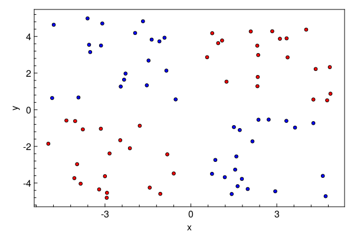
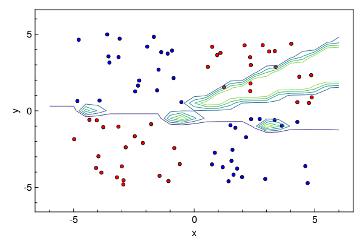
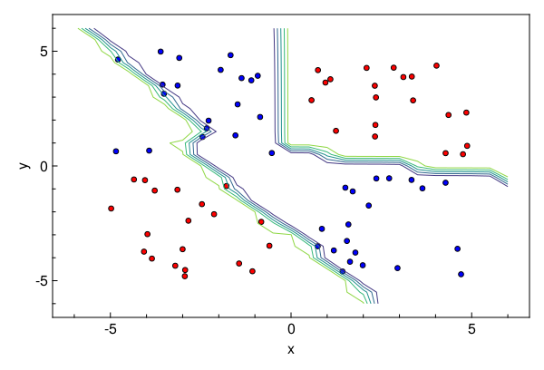

<a id='Bayesian-Neural-Network'></a>

# Bayesian Neural Network


We borrow this tutorial from the [official Turing Docs](https://turing.ml/dev/tutorials/03-bayesian-neural-network/). We will show how the explicit parameterization of Lux enables first-class composability with packages which expect flattened out parameter vectors.


We will use [Turing.jl](https://turing.ml) with [Lux.jl](https://lux.csail.mit.edu/stable) to implement implementing a classification algorithm. Lets start by importing the relevant libraries.


```julia
# Import libraries
using Lux, Turing, CairoMakie, Random, ReverseDiff, Functors, MakiePublication

# Hide sampling progress
Turing.setprogress!(false);

# Use reverse_diff due to the number of parameters in neural networks
Turing.setadbackend(:reversediff)
```


```
:reversediff
```


<a id='Generating-data'></a>

## Generating data


Our goal here is to use a Bayesian neural network to classify points in an artificial dataset. The code below generates data points arranged in a box-like pattern and displays a graph of the dataset we'll be working with.


```julia
# Number of points to generate
N = 80
M = round(Int, N / 4)
rng = Random.default_rng()
Random.seed!(rng, 1234)

# Generate artificial data
x1s = rand(rng, Float32, M) * 4.5f0;
x2s = rand(rng, Float32, M) * 4.5f0;
xt1s = Array([[x1s[i] + 0.5f0; x2s[i] + 0.5f0] for i in 1:M])
x1s = rand(rng, Float32, M) * 4.5f0;
x2s = rand(rng, Float32, M) * 4.5f0;
append!(xt1s, Array([[x1s[i] - 5.0f0; x2s[i] - 5.0f0] for i in 1:M]))

x1s = rand(rng, Float32, M) * 4.5f0;
x2s = rand(rng, Float32, M) * 4.5f0;
xt0s = Array([[x1s[i] + 0.5f0; x2s[i] - 5.0f0] for i in 1:M])
x1s = rand(rng, Float32, M) * 4.5f0;
x2s = rand(rng, Float32, M) * 4.5f0;
append!(xt0s, Array([[x1s[i] - 5.0f0; x2s[i] + 0.5f0] for i in 1:M]))

# Store all the data for later
xs = [xt1s; xt0s]
ts = [ones(2 * M); zeros(2 * M)]

# Plot data points

function plot_data()
    x1 = first.(xt1s)
    y1 = last.(xt1s)
    x2 = first.(xt0s)
    y2 = last.(xt0s)

    fig = with_theme(theme_web()) do
        fig = Figure()
        ax = CairoMakie.Axis(fig[1, 1]; xlabel="x", ylabel="y")

        scatter!(ax, x1, y1; markersize=8, color=:red, strokecolor=:black, strokewidth=1)
        scatter!(ax, x2, y2; markersize=8, color=:blue, strokecolor=:black, strokewidth=1)

        return fig
    end

    return fig
end

plot_data()
```





<a id='Building-the-Neural-Network'></a>

## Building the Neural Network


The next step is to define a feedforward neural network where we express our parameters as distributions, and not single points as with traditional neural networks. For this we will use `Dense` to define liner layers and compose them via `Chain`, both are neural network primitives from `Lux`. The network `nn` we will create will have two hidden layers with `tanh` activations and one output layer with `sigmoid` activation, as shown below.


The `nn` is an instance that acts as a function and can take data, parameters and current state as inputs and output predictions. We will define distributions on the neural network parameters.


```julia
# Construct a neural network using Lux
nn = Chain(Dense(2 => 3, tanh), Dense(3 => 2, tanh), Dense(2 => 1, sigmoid))

# Initialize the model weights and state
ps, st = Lux.setup(rng, nn)

Lux.parameterlength(nn) # number of paraemters in NN
```


```
20
```


The probabilistic model specification below creates a parameters variable, which has IID normal variables. The parameters represents all parameters of our neural net (weights and biases).


```julia
# Create a regularization term and a Gaussian prior variance term.
alpha = 0.09
sig = sqrt(1.0 / alpha)
```


```
3.3333333333333335
```


Construct named tuple from a sampled parameter vector. We could also use ComponentArrays here and simply broadcast to avoid doing this. But let's do it this way to avoid dependencies.


```julia
function vector_to_parameters(ps_new::AbstractVector, ps::NamedTuple)
    @assert length(ps_new) == Lux.parameterlength(ps)
    i = 1
    function get_ps(x)
        z = reshape(view(ps_new, i:(i + length(x) - 1)), size(x))
        i += length(x)
        return z
    end
    return fmap(get_ps, ps)
end

# Specify the probabilistic model.
@model function bayes_nn(xs, ts)
    global st

    # Sample the parameters
    nparameters = Lux.parameterlength(nn)
    parameters ~ MvNormal(zeros(nparameters), sig .* ones(nparameters))

    # Forward NN to make predictions
    preds, st = nn(xs, vector_to_parameters(parameters, ps), st)

    # Observe each prediction.
    for i in 1:length(ts)
        ts[i] ~ Bernoulli(preds[i])
    end
end
```


```
bayes_nn (generic function with 2 methods)
```


Inference can now be performed by calling sample. We use the HMC sampler here.


```julia
# Perform inference.
N = 5000
ch = sample(bayes_nn(reduce(hcat, xs), ts), HMC(0.05, 4), N)
```


```
Chains MCMC chain (5000×30×1 Array{Float64, 3}):

Iterations        = 1:1:5000
Number of chains  = 1
Samples per chain = 5000
Wall duration     = 58.57 seconds
Compute duration  = 58.57 seconds
parameters        = parameters[1], parameters[2], parameters[3], parameters[4], parameters[5], parameters[6], parameters[7], parameters[8], parameters[9], parameters[10], parameters[11], parameters[12], parameters[13], parameters[14], parameters[15], parameters[16], parameters[17], parameters[18], parameters[19], parameters[20]
internals         = lp, n_steps, is_accept, acceptance_rate, log_density, hamiltonian_energy, hamiltonian_energy_error, numerical_error, step_size, nom_step_size

Summary Statistics
      parameters      mean       std      mcse   ess_bulk   ess_tail      rhat   ess_per_sec
          Symbol   Float64   Float64   Float64    Float64    Float64   Float64       Float64

   parameters[1]   -2.0521    0.7625    0.1721    20.6080    90.3161    1.0078        0.3518
   parameters[2]   -3.0083    3.1557    0.9621    12.7726    21.0999    1.5426        0.2181
   parameters[3]    1.3245    0.8417    0.2430    13.3461    24.3246    1.4587        0.2279
   parameters[4]   -1.4877    1.0772    0.2493    15.1287    26.2870    1.1494        0.2583
   parameters[5]    0.7760    0.5463    0.1115    27.1685   102.1179    1.2247        0.4639
   parameters[6]    3.4906    1.7171    0.4559    14.8031    45.0051    1.0628        0.2527
   parameters[7]   -3.9710    1.4956    0.3945    15.0640    45.7012    1.1078        0.2572
   parameters[8]   -3.4420    1.3931    0.3730    14.6316    21.0172    1.4495        0.2498
   parameters[9]   -4.5405    3.0887    0.9352    12.0159    20.0739    1.6221        0.2052
  parameters[10]   -3.2319    2.7507    0.8110    12.1252    22.4200    1.3478        0.2070
  parameters[11]   -3.5758    1.4822    0.4076    13.6637    33.8975    1.1729        0.2333
  parameters[12]   -1.0570    2.4954    0.7492    11.7223    21.0856    1.9121        0.2001
  parameters[13]    2.9443    1.5863    0.4630    12.8882    20.7551    1.4709        0.2200
  parameters[14]    1.7753    3.9004    1.1683    11.7170    20.8646    1.4595        0.2000
  parameters[15]   -2.5492    0.9557    0.2088    22.5673    38.5675    1.1274        0.3853
  parameters[16]    1.3716    2.0800    0.5691    14.0441    34.5833    1.1682        0.2398
  parameters[17]   -0.4643    1.9644    0.5871    11.5634    21.2536    1.8976        0.1974
  parameters[18]    1.1676    1.4714    0.3611    16.5438    23.5525    1.0044        0.2825
  parameters[19]   -5.9863    0.9522    0.1526    38.9319    54.0819    1.0467        0.6647
  parameters[20]   -1.7391    1.2860    0.2821    21.6130    50.2786    1.0414        0.3690

Quantiles
      parameters       2.5%     25.0%     50.0%     75.0%     97.5%
          Symbol    Float64   Float64   Float64   Float64   Float64

   parameters[1]    -3.3949   -2.6340   -2.0720   -1.4720   -0.6806
   parameters[2]   -10.8256   -4.7942   -1.1807   -0.8554   -0.4700
   parameters[3]     0.2152    0.6476    1.1033    1.9170    3.1882
   parameters[4]    -5.7669   -1.7303   -1.3366   -0.9107   -0.3575
   parameters[5]    -0.4868    0.5344    0.8637    1.1188    1.7370
   parameters[6]     0.6259    2.2367    3.5342    4.5333    6.7872
   parameters[7]    -6.6437   -5.1932   -3.9708   -2.7398   -1.3800
   parameters[8]    -5.8277   -4.4686   -3.5359   -2.5644   -0.2680
   parameters[9]   -11.4662   -7.0356   -3.2984   -2.0051   -0.8413
  parameters[10]    -8.1245   -4.8659   -3.5562   -1.3859    2.0080
  parameters[11]    -6.4989   -4.7170   -3.5606   -2.3902   -1.0114
  parameters[12]    -4.6375   -3.1774   -1.3213    0.7895    4.0594
  parameters[13]     0.8759    1.7717    2.6272    3.5623    6.9655
  parameters[14]    -5.8894   -2.1307    3.2297    4.9656    7.0390
  parameters[15]    -4.6926   -3.0672   -2.5009   -1.9073   -0.9006
  parameters[16]    -2.5810   -0.0622    0.9090    2.9472    5.4754
  parameters[17]    -3.6208   -2.0939   -0.6436    1.0709    3.5339
  parameters[18]    -2.1827    0.1799    1.2132    2.2497    3.7561
  parameters[19]    -7.7264   -6.5933   -6.0417   -5.4946   -3.7762
  parameters[20]    -4.6060   -2.5530   -1.6430   -0.8152    0.5254

```


Now we extract the parameter samples from the sampled chain as θ (this is of size `5000 x 20` where `5000` is the number of iterations and `20` is the number of parameters). We'll use these primarily to determine how good our model's classifier is.


```julia
# Extract all weight and bias parameters.
θ = MCMCChains.group(ch, :parameters).value;
```


<a id='Prediction-Visualization'></a>

## Prediction Visualization


```julia
# A helper to run the nn through data `x` using parameters `θ`
nn_forward(x, θ) = first(nn(x, vector_to_parameters(θ, ps), st))

# Plot the data we have.
fig = plot_data()

# Find the index that provided the highest log posterior in the chain.
_, i = findmax(ch[:lp])

# Extract the max row value from i.
i = i.I[1]

# Plot the posterior distribution with a contour plot
x1_range = collect(range(-6; stop=6, length=25))
x2_range = collect(range(-6; stop=6, length=25))
Z = [nn_forward([x1, x2], θ[i, :])[1] for x1 in x1_range, x2 in x2_range]
contour!(x1_range, x2_range, Z)
fig
```


The contour plot above shows that the MAP method is not too bad at classifying our data. Now we can visualize our predictions.


$$
p(\tilde{x} | X, \alpha) = \int_{\theta} p(\tilde{x} | \theta) p(\theta | X, \alpha) \approx \sum_{\theta \sim p(\theta | X, \alpha)}f_{\theta}(\tilde{x})
$$


The `nn_predict` function takes the average predicted value from a network parameterized by weights drawn from the MCMC chain.


```julia
# Return the average predicted value across multiple weights.
nn_predict(x, θ, num) = mean([first(nn_forward(x, view(θ, i, :))) for i in 1:10:num])
```


```
nn_predict (generic function with 1 method)
```


Next, we use the `nn_predict` function to predict the value at a sample of points where the x1 and x2 coordinates range between -6 and 6. As we can see below, we still have a satisfactory fit to our data, and more importantly, we can also see where the neural network is uncertain about its predictions much easier–-those regions between cluster boundaries.


Plot the average prediction.


```julia
fig = plot_data()

n_end = 1500
x1_range = collect(range(-6; stop=6, length=25))
x2_range = collect(range(-6; stop=6, length=25))
Z = [nn_predict([x1, x2], θ, n_end)[1] for x1 in x1_range, x2 in x2_range]
contour!(x1_range, x2_range, Z)
fig
```


Suppose we are interested in how the predictive power of our Bayesian neural network evolved between samples. In that case, the following graph displays an animation of the contour plot generated from the network weights in samples 1 to 1,000.


```julia
# Number of iterations to plot.
n_end = 1000

fig = plot_data()
Z = [first(nn_forward([x1, x2], θ[1, :])) for x1 in x1_range, x2 in x2_range]
c = contour!(x1_range, x2_range, Z)
fig
```





Plotting the Final contour


```julia
fig = plot_data()
Z = [first(nn_forward([x1, x2], θ[n_end, :])) for x1 in x1_range, x2 in x2_range]
c = contour!(x1_range, x2_range, Z)
fig
```





---


*This page was generated using [Literate.jl](https://github.com/fredrikekre/Literate.jl).*

