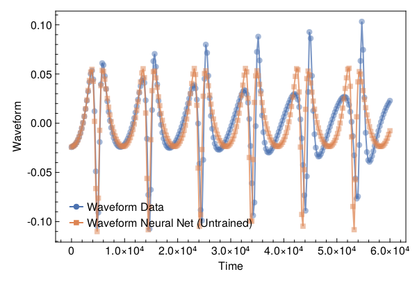
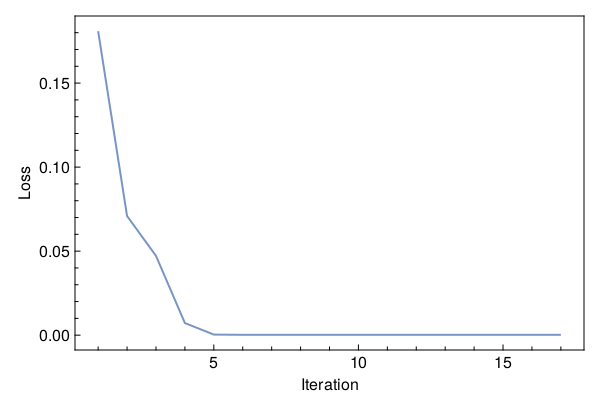
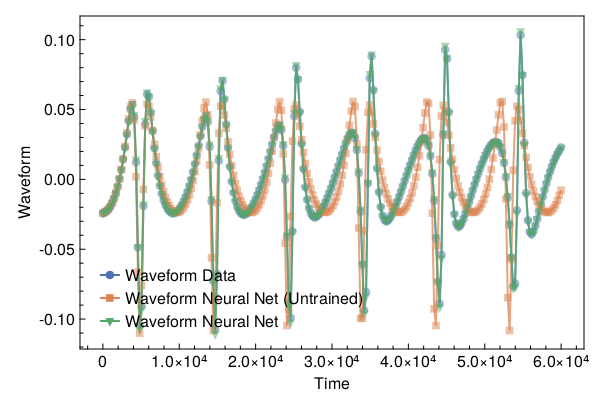

<a id='Training-a-Neural-ODE-to-Model-Gravitational-Waveforms'></a>

# Training a Neural ODE to Model Gravitational Waveforms


This code is adapted from [Astroinformatics/ScientificMachineLearning](https://github.com/Astroinformatics/ScientificMachineLearning/blob/c93aac3a460d70b4cce98836b677fd9b732e94b7/neuralode_gw.ipynb)


The code has been minimally adapted from [Keith et. al. 2021](https://arxiv.org/abs/2102.12695) which originally used Flux.jl


<a id='Package-Imports'></a>

## Package Imports


```julia
using Lux, ComponentArrays, LineSearches, LuxAMDGPU, LuxCUDA, OrdinaryDiffEq,
    Optimization, OptimizationOptimJL, Random, SciMLSensitivity
using CairoMakie, MakiePublication
CUDA.allowscalar(false)
```


<a id='Define-some-Utility-Functions'></a>

## Define some Utility Functions


::: tip


This section can be skipped. It defines functions to simulate the model, however, from a scientific machine learning perspective, isn't super relevant.


:::


We need a very crude 2-body path. Assume the 1-body motion is a newtonian 2-body position vector $r = r_1 - r_2$ and use Newtonian formulas to get $r_1$, $r_2$ (e.g. Theoretical Mechanics of Particles and Continua 4.3)


```julia
function one2two(path, m₁, m₂)
    M = m₁ + m₂
    r₁ = m₂ / M .* path
    r₂ = -m₁ / M .* path
    return r₁, r₂
end
```


```
one2two (generic function with 1 method)
```


Next we define a function to perform the change of variables: $(\chi(t),\phi(t)) \mapsto (x(t),y(t))$


```julia
@views function soln2orbit(soln, model_params=nothing)
    @assert size(soln, 1) ∈ [2, 4] "size(soln,1) must be either 2 or 4"

    if size(soln, 1) == 2
        χ = soln[1, :]
        ϕ = soln[2, :]

        @assert length(model_params)==3 "model_params must have length 3 when size(soln,2) = 2"
        p, M, e = model_params
    else
        χ = soln[1, :]
        ϕ = soln[2, :]
        p = soln[3, :]
        e = soln[4, :]
    end

    r = p ./ (1 .+ e .* cos.(χ))
    x = r .* cos.(ϕ)
    y = r .* sin.(ϕ)

    orbit = vcat(x', y')
    return orbit
end
```


```
soln2orbit (generic function with 2 methods)
```


This function uses second-order one-sided difference stencils at the endpoints; see https://doi.org/10.1090/S0025-5718-1988-0935077-0


```julia
function d_dt(v::AbstractVector, dt)
    a = -3 / 2 * v[1] + 2 * v[2] - 1 / 2 * v[3]
    b = (v[3:end] .- v[1:(end - 2)]) / 2
    c = 3 / 2 * v[end] - 2 * v[end - 1] + 1 / 2 * v[end - 2]
    return [a; b; c] / dt
end
```


```
d_dt (generic function with 1 method)
```


This function uses second-order one-sided difference stencils at the endpoints; see https://doi.org/10.1090/S0025-5718-1988-0935077-0


```julia
function d2_dt2(v::AbstractVector, dt)
    a = 2 * v[1] - 5 * v[2] + 4 * v[3] - v[4]
    b = v[1:(end - 2)] .- 2 * v[2:(end - 1)] .+ v[3:end]
    c = 2 * v[end] - 5 * v[end - 1] + 4 * v[end - 2] - v[end - 3]
    return [a; b; c] / (dt^2)
end
```


```
d2_dt2 (generic function with 1 method)
```


Now we define a function to compute the trace-free moment tensor from the orbit


```julia
function orbit2tensor(orbit, component, mass=1)
    x = orbit[1, :]
    y = orbit[2, :]

    Ixx = x .^ 2
    Iyy = y .^ 2
    Ixy = x .* y
    trace = Ixx .+ Iyy

    if component[1] == 1 && component[2] == 1
        tmp = Ixx .- trace ./ 3
    elseif component[1] == 2 && component[2] == 2
        tmp = Iyy .- trace ./ 3
    else
        tmp = Ixy
    end

    return mass .* tmp
end

function h_22_quadrupole_components(dt, orbit, component, mass=1)
    mtensor = orbit2tensor(orbit, component, mass)
    mtensor_ddot = d2_dt2(mtensor, dt)
    return 2 * mtensor_ddot
end

function h_22_quadrupole(dt, orbit, mass=1)
    h11 = h_22_quadrupole_components(dt, orbit, (1, 1), mass)
    h22 = h_22_quadrupole_components(dt, orbit, (2, 2), mass)
    h12 = h_22_quadrupole_components(dt, orbit, (1, 2), mass)
    return h11, h12, h22
end

function h_22_strain_one_body(dt::T, orbit) where {T}
    h11, h12, h22 = h_22_quadrupole(dt, orbit)

    h₊ = h11 - h22
    hₓ = T(2) * h12

    scaling_const = √(T(π) / 5)
    return scaling_const * h₊, -scaling_const * hₓ
end

function h_22_quadrupole_two_body(dt, orbit1, mass1, orbit2, mass2)
    h11_1, h12_1, h22_1 = h_22_quadrupole(dt, orbit1, mass1)
    h11_2, h12_2, h22_2 = h_22_quadrupole(dt, orbit2, mass2)
    h11 = h11_1 + h11_2
    h12 = h12_1 + h12_2
    h22 = h22_1 + h22_2
    return h11, h12, h22
end

function h_22_strain_two_body(dt::T, orbit1, mass1, orbit2, mass2) where {T}
    # compute (2,2) mode strain from orbits of BH 1 of mass1 and BH2 of mass 2

    @assert abs(mass1 + mass2 - 1.0)<1e-12 "Masses do not sum to unity"

    h11, h12, h22 = h_22_quadrupole_two_body(dt, orbit1, mass1, orbit2, mass2)

    h₊ = h11 - h22
    hₓ = T(2) * h12

    scaling_const = √(T(π) / 5)
    return scaling_const * h₊, -scaling_const * hₓ
end

function compute_waveform(dt::T, soln, mass_ratio, model_params=nothing) where {T}
    @assert mass_ratio≤1 "mass_ratio must be <= 1"
    @assert mass_ratio≥0 "mass_ratio must be non-negative"

    orbit = soln2orbit(soln, model_params)
    if mass_ratio > 0
        m₂ = inv(T(1) + mass_ratio)
        m₁ = mass_ratio * m₂

        orbit₁, orbit₂ = one2two(orbit, m₁, m₂)
        waveform = h_22_strain_two_body(dt, orbit1, mass1, orbit2, mass2)
    else
        waveform = h_22_strain_one_body(dt, orbit)
    end
    return waveform
end
```


```
compute_waveform (generic function with 2 methods)
```


<a id='Simulating-the-True-Model'></a>

## Simulating the True Model


`RelativisticOrbitModel` defines system of odes which describes motion of point like particle in schwarzschild background, uses


$$
u[1] = \chi
$$


$$
u[2] = \phi
$$


where, $p$, $M$, and $e$ are constants


```julia
function RelativisticOrbitModel(u, (p, M, e), t)
    χ, ϕ = u

    numer = (p - 2 - 2 * e * cos(χ)) * (1 + e * cos(χ))^2
    denom = sqrt((p - 2)^2 - 4 * e^2)

    χ̇ = numer * sqrt(p - 6 - 2 * e * cos(χ)) / (M * (p^2) * denom)
    ϕ̇ = numer / (M * (p^(3 / 2)) * denom)

    return [χ̇, ϕ̇]
end

mass_ratio = 0.0         # test particle
u0 = Float64[π, 0.0]     # initial conditions
datasize = 250
tspan = (0.0f0, 6.0f4)   # timespace for GW waveform
tsteps = range(tspan[1], tspan[2]; length=datasize)  # time at each timestep
dt_data = tsteps[2] - tsteps[1]
dt = 100.0
const ode_model_params = [100.0, 1.0, 0.5]; # p, M, e
```


Let's simulate the true model and plot the results using `OrdinaryDiffEq.jl`


```julia
prob = ODEProblem(RelativisticOrbitModel, u0, tspan, ode_model_params)
soln = Array(solve(prob, RK4(); saveat=tsteps, dt, adaptive=false))
waveform = first(compute_waveform(dt_data, soln, mass_ratio, ode_model_params))

fig = with_theme(theme_web()) do
    fig = Figure()
    ax = CairoMakie.Axis(fig[1, 1]; xlabel="Time", ylabel="Waveform")

    l = lines!(ax, tsteps, waveform; linewidth=2, alpha=0.75)
    s = scatter!(ax, tsteps, waveform; markershape=:circle, markeralpha=0.25, alpha=0.5)

    axislegend(ax, [[l, s]], ["Waveform Data"])

    return fig
end
```


<a id='Defiing-a-Neural-Network-Model'></a>

## Defiing a Neural Network Model


Next, we define the neural network model that takes 1 input (time) and has two outputs. We'll make a function `ODE_model` that takes the initial conditions, neural network parameters and a time as inputs and returns the derivatives.


It is typically never recommended to use globals but incase you do use them, make sure to mark them as `const`.


We will deviate from the standard Neural Network initialization and use `WeightInitializers.jl`,


```julia
const nn = Chain(Base.Fix1(broadcast, cos),
    Dense(1 => 32, cos; init_weight=truncated_normal(; std=1e-4)),
    Dense(32 => 32, cos; init_weight=truncated_normal(; std=1e-4)),
    Dense(32 => 2; init_weight=truncated_normal(; std=1e-4)))
ps, st = Lux.setup(MersenneTwister(), nn)
```


```
((layer_1 = NamedTuple(), layer_2 = (weight = Float32[-0.00010871487; -3.3829798f-5; -0.00021376567; -3.9150425f-5; 2.0156027f-5; -2.5962829f-5; -0.0001448561; 6.2212116f-6; -4.3226173f-5; 1.4573001f-5; -0.00012240188; 9.384222f-5; -7.507769f-5; -5.43419f-5; -0.00010038777; -7.6437755f-5; 0.00013439477; -2.682285f-5; 5.2345426f-5; 6.746106f-5; 7.846173f-5; -0.00016949807; -0.00027921057; -7.095631f-5; 4.882877f-6; 4.042791f-5; -5.7724512f-5; -6.377377f-5; -9.38274f-9; 0.0001038963; 0.00010117359; 0.0002515748;;], bias = Float32[0.0; 0.0; 0.0; 0.0; 0.0; 0.0; 0.0; 0.0; 0.0; 0.0; 0.0; 0.0; 0.0; 0.0; 0.0; 0.0; 0.0; 0.0; 0.0; 0.0; 0.0; 0.0; 0.0; 0.0; 0.0; 0.0; 0.0; 0.0; 0.0; 0.0; 0.0; 0.0;;]), layer_3 = (weight = Float32[0.00012477941 0.00020462148 -4.2301854f-5 -0.00015939026 1.017227f-5 2.2402119f-6 -0.000106810665 -7.139835f-5 -0.00016046838 -1.791687f-5 4.141121f-5 -1.1703723f-5 0.00010725071 -4.636912f-5 0.000103834194 -0.00017540608 4.3949505f-5 -6.849979f-5 9.3485636f-5 -9.379605f-5 -9.4209325f-5 -6.59593f-5 0.0002671579 0.00020695008 -0.000120020406 0.00011179878 -0.000109110035 -9.753475f-5 -3.896373f-5 0.00011865275 7.1745715f-5 9.207462f-5; -6.955042f-5 6.912234f-5 -0.00012523272 4.0542855f-5 0.00010990508 -5.3483647f-5 0.00020589697 0.000118735436 5.301419f-5 0.0001010254 1.5975775f-5 9.590966f-5 0.00014219698 -9.7455784f-5 0.00013025134 1.0372302f-5 8.790406f-5 -0.00014199123 9.714675f-5 -0.00016089233 -0.00011056287 -0.00013729463 0.00015633147 1.00454945f-5 7.0914316f-6 0.000101385085 -2.347813f-6 -0.00011216147 0.0001163136 4.135148f-5 -2.493213f-5 -1.571682f-5; 5.4738215f-5 7.32093f-5 8.4354004f-5 -7.047588f-5 5.256796f-5 8.646688f-5 0.00022577567 -0.00025343455 3.741231f-5 3.1090578f-5 -0.00017951462 -5.9861f-5 -6.1442144f-5 -0.0001480072 -0.00017965325 0.00011702635 -6.516511f-5 -8.2170154f-5 5.733455f-5 5.6768295f-5 8.8141496f-5 8.895474f-5 -3.3671728f-5 -5.779043f-5 0.0001615776 -8.76421f-5 -8.632106f-5 -5.1437088f-5 7.7848264f-5 4.5437555f-5 -7.76545f-5 4.6681213f-5; -9.450822f-5 2.4570749f-5 0.00011298981 5.402274f-6 -9.481411f-5 0.00011974442 4.5721405f-5 5.3867483f-5 9.1833776f-5 -0.00030380875 5.7264126f-5 6.370183f-5 -2.5975876f-7 5.751173f-6 -1.3434493f-5 8.5863394f-5 4.150812f-5 -0.00015344298 -1.0230482f-5 -3.4137192f-5 0.00014408166 -1.776558f-5 0.00018464019 -1.0173471f-5 0.00015188551 2.6352034f-5 5.484797f-5 9.39802f-6 7.1215596f-5 -8.8364424f-5 1.9211735f-5 -4.05577f-6; 3.328332f-5 -0.00014990494 5.6241443f-5 -7.952627f-6 9.405407f-5 7.7444245f-5 -2.986994f-6 3.9497147f-5 -9.358981f-5 0.00012693202 3.964809f-5 -1.41924f-5 0.00021945605 -2.192083f-5 8.525271f-6 -0.000103638085 -3.4469835f-5 -0.00010394496 1.7444894f-5 -2.3274864f-5 7.063152f-5 -0.00019913753 -5.6761448f-5 -3.1032818f-5 -3.5337853f-6 3.6834388f-6 0.00016695407 0.00012075949 0.00016053348 0.0001345756 -1.9166871f-5 -7.19419f-5; -0.00018455136 0.00022128095 0.0002865392 -0.00011643299 -0.00025658353 -3.420663f-5 -0.000120780554 -4.212513f-5 -8.485097f-5 3.9121132f-5 7.604379f-5 -1.602423f-5 0.000124943 0.00011581553 8.4900064f-5 -9.775901f-5 -0.000101059595 9.155734f-5 2.5115578f-5 2.2768949f-5 -7.4974027f-6 -8.2880564f-5 0.00013102566 1.1164196f-5 -9.470686f-6 -0.00013859422 -9.66395f-5 6.322572f-5 -3.6304536f-6 -6.219335f-5 -9.617851f-5 -0.000105409985; -8.4622996f-5 -0.00017879778 0.00013360247 -2.501508f-6 -1.7302457f-6 -4.3089833f-5 4.0820865f-5 -7.564289f-5 -0.00020676882 -0.0001366558 6.766822f-5 -2.1056536f-5 0.00013526484 -0.00022364662 -0.0001711179 3.0506975f-5 -9.490089f-5 -0.00015925268 0.00013703947 7.943795f-5 -9.864781f-5 5.5334338f-5 8.428088f-5 -0.00016177169 0.00017974967 6.598987f-5 -8.820687f-5 -2.877363f-5 -0.000114081646 -0.00019668705 -5.4751126f-5 -0.00010664652; 6.327682f-5 -5.1825555f-5 -5.1413757f-5 -5.967748f-5 0.00011171636 -0.00017429958 -3.5329038f-5 -3.1411944f-6 3.5779925f-5 -0.00012433453 -5.4008244f-5 -0.00012984089 8.917341f-5 -0.00015119379 -0.0001440863 -7.715145f-5 8.9677196f-5 -7.721122f-5 -0.00011941672 -0.00012645365 6.118165f-5 3.544442f-5 1.5038349f-6 0.00010283518 -1.61847f-5 -6.281491f-5 3.1821824f-6 4.1794872f-5 0.00010901898 8.959659f-5 -2.6789026f-5 2.1654925f-5; -9.388115f-6 1.6588645f-5 -3.4602446f-5 5.229585f-6 -8.788792f-5 -5.1190254f-6 1.0666224f-5 -0.0001093265 -8.3597595f-5 9.130594f-5 0.00014355098 5.8638907f-5 4.814314f-5 -0.00015895593 -2.1200058f-5 0.00012861971 -2.38293f-5 -4.9072834f-5 -0.00015671924 -9.414293f-5 3.338775f-5 -2.848719f-5 6.460965f-5 9.4106865f-5 0.00011418275 0.00019684089 1.145789f-5 -8.037077f-5 0.00022997786 0.0001258293 0.00011462976 -2.9950002f-5; 7.321836f-5 3.4723755f-5 3.1500138f-6 4.4098608f-5 -8.9680325f-5 5.1926538f-5 6.640057f-6 -0.00010839315 -8.535813f-5 -0.00013161877 9.513751f-5 -9.5647345f-5 -3.0767816f-5 3.2137938f-5 0.00016543435 9.926067f-5 5.2094605f-5 -0.00012225211 -8.4471176f-5 -3.6844387f-5 0.0001398724 -5.343852f-5 0.00010029049 -0.00021949458 0.00016237576 -6.4773645f-5 -5.553431f-6 8.86466f-6 -0.0001848699 -6.8375724f-5 -3.3903372f-5 -0.00015720996; 1.4309734f-5 0.000109995315 0.00016935372 -7.528735f-5 0.00013320982 3.7458332f-5 9.6130025f-5 -0.00011146997 1.9221627f-5 1.9391897f-5 3.409507f-5 -0.00016138257 5.9315422f-5 -0.000117303556 -4.7107616f-5 7.1342685f-5 9.732687f-5 -8.331466f-5 3.3727203f-5 -0.00015567616 0.00019570073 -1.41556675f-5 0.000108567736 -0.00019203809 0.0001098707 -0.00018211789 -0.00030149013 0.00014623745 -4.3184184f-5 -1.38730675f-5 -5.4453252f-5 3.5367524f-5; 5.31358f-5 6.184211f-5 -7.263018f-5 -8.171509f-5 -0.000100093435 1.845106f-5 -3.4475383f-5 0.00021016388 -7.935091f-6 0.00011489167 -1.2289053f-5 0.00016400291 0.0002059692 2.1768337f-5 -0.00012494653 5.091439f-6 3.163525f-5 -4.7584428f-5 -9.159838f-5 -3.9684764f-6 -2.4585192f-5 -2.455387f-6 -0.00014935857 2.1459734f-6 9.541343f-5 -4.773346f-5 2.3664894f-5 8.444655f-5 7.957953f-5 -5.562107f-5 -5.183471f-5 -0.00014159479; -3.6776917f-5 -0.00022889447 -5.65985f-5 2.7652975f-5 6.780774f-5 -6.188448f-5 -2.6565096f-5 0.00025568283 6.368763f-5 -0.00010960623 0.0001106977 -7.8659534f-5 -5.5318356f-5 0.00010175035 -0.0001011377 3.8628386f-5 9.636864f-5 -0.00012105883 0.00012687666 -6.3381405f-5 2.2196877f-5 -3.8209433f-5 -7.9441306f-5 -0.0001629461 2.1103862f-5 9.0011614f-5 3.6000267f-5 0.00017365137 3.5482867f-6 5.9959577f-5 6.886829f-5 9.616314f-5; -7.4510026f-5 -1.3429077f-6 5.5173485f-5 -0.00010355228 0.0003073185 -8.378425f-5 -0.00030122395 -8.959114f-5 1.4156905f-5 9.254667f-5 9.220508f-5 7.973293f-5 -7.3582205f-6 -0.00011659145 -0.00015287957 -3.3488584f-5 0.00023110963 -0.00011467358 0.00010640826 -2.8847511f-5 4.861365f-5 -0.0002458386 -5.325266f-5 -0.00010253538 4.813767f-5 -0.000125625 0.00021978997 -0.00010966591 0.0001020959 4.8122776f-5 -0.00016171875 -0.000107646745; 0.00010322302 -4.7845973f-5 -0.00014489578 -0.00011849017 9.29555f-5 0.00016815217 -0.000107134845 0.00015799541 0.00018152024 -0.00012334608 0.00021444634 -2.5731199f-5 2.5786398f-5 -6.1156825f-5 -0.00022164155 7.277983f-5 -3.3684f-5 -0.00014818838 5.7122554f-5 4.645678f-5 -5.136496f-5 2.2147908f-5 0.00010858466 1.630972f-5 -5.3655563f-6 -2.0324203f-5 0.0001161895 -5.4967135f-5 0.00017990501 -0.0001435355 -0.00030819347 6.139149f-5; -6.765759f-5 2.0485388f-6 -3.1717484f-6 -3.7911304f-5 -0.00010052675 -9.7858705f-5 -0.00011478466 -3.8199116f-5 -7.3635965f-5 0.00013283342 -4.9902592f-5 0.000116624244 0.0001568649 -4.438181f-5 -1.3086009f-6 8.319241f-5 -6.5737554f-6 9.030116f-6 0.000105730665 -5.945775f-5 4.357308f-5 -3.5728193f-5 0.000100936835 8.331534f-5 2.561786f-5 -0.00010936154 -4.015011f-5 -5.812053f-6 -7.801951f-5 -9.557344f-6 3.0354367f-5 9.1924194f-5; 2.6507741f-5 -6.5337284f-5 -5.557301f-5 0.0001754633 9.3183495f-5 7.865699f-6 0.00011295378 -8.305868f-5 0.00025726767 -0.00011251028 9.87569f-5 7.427607f-5 4.4043023f-5 0.00022336116 -6.858554f-5 -0.00025956356 0.00012684253 9.459508f-5 -0.00010376025 0.0001499821 -6.133972f-5 8.672851f-5 -7.5748358f-6 -1.8113546f-5 0.00010549387 1.7016113f-5 0.00014019596 -4.8746697f-5 -7.887893f-5 8.661749f-5 4.2355812f-5 0.0001779469; -8.584672f-5 9.562006f-5 0.0001617099 2.1172211f-6 -0.00014502088 -0.00020583853 1.6231295f-5 -6.8240864f-5 -0.00027990522 -2.0549136f-5 0.00019048493 -0.00015548902 0.000114467075 -0.00012898073 0.00018397791 2.6991615f-5 4.7557995f-5 -2.8848852f-5 8.696417f-5 0.00020288782 -0.00012464519 0.00012367676 0.00018579263 0.00015886984 7.105235f-5 0.00017678058 0.0001586452 4.1714567f-5 -2.4233383f-5 3.1072293f-5 4.914477f-5 0.00015148878; -2.3479848f-5 3.4636963f-5 -5.680846f-5 -4.1587766f-5 -7.4897016f-6 -7.343599f-6 -5.687958f-5 3.336115f-5 -3.94853f-6 -4.6782f-5 -3.6753452f-5 9.555961f-5 9.3136085f-5 -0.00010015164 -0.00010195324 5.0217346f-5 -5.837119f-5 -8.753969f-6 -3.2611537f-5 0.00010827826 -1.2747003f-5 2.2053916f-6 -0.00010139303 4.9755317f-6 -5.6822577f-5 -2.4441328f-5 -2.5396217f-5 4.907037f-5 0.00017588539 -6.44878f-5 3.3804423f-5 5.2579762f-5; 0.0001531081 -8.764811f-5 1.3503303f-5 0.00017402643 4.946895f-5 0.00015476969 0.00018471188 0.0001111386 -2.577605f-5 0.00014793612 -7.3003343f-6 -1.4157297f-5 0.00011543282 8.201423f-6 -2.0441905f-5 -2.2159942f-5 3.9970833f-5 -2.5296766f-5 -4.724191f-5 -4.9139275f-5 -0.00018225549 -4.00403f-5 2.0529635f-5 -8.299288f-5 2.2222664f-5 0.00014508633 1.095179f-5 0.00021500788 -6.579128f-5 -0.00012143274 1.6863303f-5 -5.095853f-5; -8.992768f-5 -9.910267f-6 -5.5592333f-5 -3.5046934f-5 -8.4311614f-5 0.0001706835 7.0620976f-5 1.8293855f-5 -7.642415f-5 7.663035f-5 0.00014169527 3.2743857f-5 0.00017511888 0.00022200539 0.00021013642 6.7797846f-5 -0.00011167109 -9.428755f-5 -2.6978847f-5 2.8726294f-5 0.0002740006 -0.00016984141 -7.542215f-5 8.1387654f-5 -2.6072095f-5 -5.5740784f-5 -0.00017323626 3.0568524f-5 2.6676982f-5 -9.6930475f-5 2.35137f-5 1.1995735f-5; -1.5496436f-5 0.00012510446 -8.451827f-5 2.4421158f-6 -5.9090366f-5 -8.7602755f-5 5.5606138f-6 4.074368f-5 0.0001127695 -4.2175066f-6 4.696019f-5 -3.9754494f-5 6.2165906f-5 -0.00013570701 -0.00016285262 4.3183267f-5 0.0001238504 -0.00015208487 -0.00015374928 0.00014573579 -0.0002072171 -0.00024968327 -0.00021912916 -0.00018032048 -3.3317054f-5 -1.6954056f-5 7.46121f-5 0.000106237036 0.0001713556 0.00025490002 -2.0896903f-5 4.535355f-5; 0.00014829497 0.00016438181 0.00014284613 0.00014775233 8.853012f-5 -7.257251f-6 2.45325f-5 -2.4722422f-5 -4.1647494f-5 5.998422f-5 -3.0889994f-5 1.355849f-5 -0.00026488779 0.00011288176 -8.165481f-5 -0.00013471438 -7.431639f-5 7.1720286f-5 8.801079f-5 0.00014846101 5.3327894f-6 1.8903462f-6 -2.8155525f-6 -2.5915484f-5 -0.00023415167 4.5362263f-5 1.9619154f-5 6.560326f-5 -3.2519315f-6 -6.9341386f-6 6.598437f-5 -1.7057095f-6; -4.2423315f-5 -0.00010172503 -3.6186168f-5 -0.000102438884 4.0761763f-5 -1.2992953f-5 -4.1425767f-5 2.2644372f-5 1.1542203f-5 7.4720854f-5 0.00018560326 -5.902242f-5 -0.00012780001 8.054619f-5 0.0001245008 4.4858392f-5 2.9690429f-5 5.1077175f-5 0.00018955243 -8.7700864f-5 -1.080841f-5 -8.891479f-6 8.782102f-5 -6.90222f-5 0.00018196074 4.8018795f-5 2.2226555f-5 -2.3587001f-5 -6.330248f-5 7.7401375f-5 3.8434508f-5 -2.9395862f-5; -0.000106339336 -3.1733434f-5 -5.07235f-6 5.4538494f-5 0.00017960915 9.678865f-5 -6.611359f-5 3.578521f-5 1.3796353f-6 -5.905323f-6 0.00015156809 0.0001988482 -0.00020199061 -4.794591f-5 2.7469572f-5 -4.519534f-5 6.463896f-5 -2.9254801f-5 -4.9099126f-5 -2.3206958f-5 0.00011953452 0.000105124855 1.9315843f-5 0.00016065121 -0.00015436819 -2.386776f-5 2.8900224f-5 1.3960053f-5 -6.729874f-5 -1.0083967f-5 -5.1396125f-7 -0.0001050636; -4.010341f-5 -0.00020615073 -5.726712f-5 0.00014864422 -7.682688f-5 -4.2260604f-6 7.478182f-5 -5.436019f-5 -7.107177f-5 1.225449f-5 -7.290556f-5 2.5046782f-5 -0.00016883024 -2.2139977f-5 -0.00023311972 0.00011225377 0.00010251582 0.00011740916 8.279979f-5 -0.0001315557 8.788071f-5 -5.071184f-5 -6.7635046f-6 -2.3450084f-5 0.00011849716 9.174334f-5 0.00021936483 2.3483657f-5 8.482596f-5 4.3575576f-5 9.6528216f-5 -0.00016158322; -0.00010040053 -0.00011929878 -7.387314f-5 3.253785f-6 0.00010842515 9.298939f-5 -0.00013610696 -2.053989f-5 -9.877544f-5 1.2717243f-6 0.00014609535 5.8261354f-5 -0.00016881348 -4.006808f-5 -2.3812454f-5 -2.5538911f-5 -5.51587f-5 5.331896f-5 8.9242676f-5 8.135008f-5 -5.392309f-6 2.1454725f-5 -9.06382f-5 -4.0055067f-5 -9.220001f-5 -2.421218f-5 0.00013331255 -2.5190368f-5 -4.421845f-5 9.492907f-5 -8.7039174f-5 -9.481242f-5; 7.249663f-5 -0.00014230242 -8.641721f-5 3.788639f-5 -3.4510234f-5 -6.999207f-5 -7.3161296f-5 -0.00026629667 -8.744851f-6 -0.00021389236 -0.00015339092 3.5089981f-6 -2.2937732f-6 0.00014638325 -9.9277844f-5 6.3322055f-5 -2.4707295f-5 -0.0001908572 -9.5779906f-5 3.9003065f-5 0.00011453166 -2.6467169f-5 -0.000143723 -0.00011916757 0.00014380825 0.00011247225 -3.865952f-5 -0.0001313302 -0.00023358453 -7.2681425f-5 -7.051936f-5 0.00011875854; -9.304419f-5 7.5833086f-5 -3.123851f-5 0.00026889454 -9.1468224f-5 0.00014940243 6.8477086f-5 2.8208102f-5 -1.1474885f-5 0.00012245696 0.00014432879 -2.242967f-5 -9.322899f-6 -5.792119f-6 -4.546131f-5 -4.7121906f-5 -9.077823f-6 0.00013853467 5.350416f-5 0.00011136186 -9.9023084f-5 -6.2316816f-5 4.939531f-5 0.0002152979 5.9043974f-5 -8.979725f-5 4.004082f-5 8.8106426f-5 0.00015454707 3.9954844f-5 -0.00032969879 0.00015686081; 1.1070419f-5 -6.5520744f-6 -1.1772083f-5 2.6630107f-5 -3.1130723f-5 9.3638024f-5 -7.7069024f-5 -0.00011054415 -0.00020778796 4.8593236f-5 -9.298593f-5 0.00019119604 0.00023609478 8.555202f-6 -0.00014571453 -8.5211585f-5 -4.06314f-5 6.159072f-5 0.00014362906 -0.0001046579 2.7986409f-5 -0.00012522821 -6.041177f-5 -0.00011243462 2.2176664f-5 -0.000105797946 -1.7891787f-5 -0.00018032701 0.00011187009 3.875543f-5 -7.177644f-5 -2.8386909f-5; -4.545631f-5 4.1440417f-5 9.883663f-6 5.2375515f-5 -0.00018224308 8.169047f-5 1.1130069f-5 0.000116408155 -6.975958f-5 -8.274776f-5 -0.00010427691 -0.00015880127 -4.3204458f-5 2.0337743f-6 0.0002166713 0.00012617411 8.9134104f-5 1.9168301f-5 -4.6268428f-7 -1.17700365f-5 -8.923099f-6 7.414837f-5 8.864802f-5 2.6820521f-6 -3.5995454f-5 0.00018287939 -1.628707f-5 9.727664f-5 4.516393f-5 2.9658579f-5 0.00010111697 -9.332834f-5; 7.1147115f-5 7.767509f-6 -2.8670183f-5 0.00020446029 -6.1245184f-5 7.951364f-5 2.4965051f-5 0.00016048126 -1.4557901f-5 7.5523008f-6 -4.107933f-5 -9.0788264f-5 0.00012907553 -7.3035226f-5 0.00010863019 -0.00018636778 0.00012282188 5.6311634f-5 0.00025480086 8.061482f-5 2.8669343f-5 6.571039f-5 -0.00031140918 0.00015166061 1.4944838f-5 3.280496f-5 6.615915f-5 -6.222196f-5 -6.013077f-5 -5.291019f-5 0.00011255823 -6.043996f-5], bias = Float32[0.0; 0.0; 0.0; 0.0; 0.0; 0.0; 0.0; 0.0; 0.0; 0.0; 0.0; 0.0; 0.0; 0.0; 0.0; 0.0; 0.0; 0.0; 0.0; 0.0; 0.0; 0.0; 0.0; 0.0; 0.0; 0.0; 0.0; 0.0; 0.0; 0.0; 0.0; 0.0;;]), layer_4 = (weight = Float32[0.00010280203 0.00011475822 1.4313025f-5 9.7633754f-5 0.000120717494 -0.00011492417 -5.384672f-5 -6.954391f-5 -9.61426f-6 -4.7519687f-5 -3.0361847f-5 0.0001372678 -3.8534614f-5 -4.8958605f-5 -2.7365759f-5 -8.672886f-5 0.000108820364 2.6483385f-5 -1.3879554f-5 7.1401286f-5 -4.077946f-5 0.00027495553 0.00016526469 -2.2107763f-5 -0.00024344483 0.00013999156 7.849808f-5 -7.889378f-5 -2.646101f-5 1.33668345f-5 4.3300923f-5 -3.5063076f-5; -0.00012902812 5.5909586f-5 -0.00020367597 -0.00010118675 -7.311347f-5 -4.6301534f-6 -0.00022461866 -6.2128966f-5 8.762144f-5 0.000113855676 2.383222f-5 8.736044f-5 3.3962246f-5 -0.00011788619 -0.00023508393 -0.00014363635 -2.2747545f-5 -3.2811047f-5 -4.470063f-6 1.2324702f-5 1.9617266f-5 6.558625f-5 2.3864992f-5 -0.000112158836 -6.85033f-5 1.5754182f-5 -0.00014513283 3.5439268f-8 0.00015244327 -1.6410837f-5 -2.5735155f-6 0.00012483039], bias = Float32[0.0; 0.0;;])), (layer_1 = NamedTuple(), layer_2 = NamedTuple(), layer_3 = NamedTuple(), layer_4 = NamedTuple()))
```


Similar to most DL frameworks, Lux defaults to using `Float32`, however, in this case we need Float64


```julia
const params = ComponentArray{Float64}(ps)
```


```
ComponentVector{Float64}(layer_1 = Float64[], layer_2 = (weight = [-0.0001087148702936247; -3.382979775778949e-5; -0.00021376567019615322; -3.9150425436673686e-5; 2.0156026948825456e-5; -2.5962828658521175e-5; -0.00014485609426628798; 6.221211606316501e-6; -4.3226173147559166e-5; 1.4573000953532755e-5; -0.00012240187788847834; 9.384222357766703e-5; -7.507768896175548e-5; -5.434190097730607e-5; -0.00010038776963483542; -7.643775461474434e-5; 0.00013439476606436074; -2.6822850486496463e-5; 5.234542550169863e-5; 6.746105646016076e-5; 7.846172957215458e-5; -0.00016949807468336076; -0.00027921056607738137; -7.095631008269265e-5; 4.882876964984462e-6; 4.0427908970741555e-5; -5.772451186203398e-5; -6.377376848831773e-5; -9.382739918351035e-9; 0.0001038963018800132; 0.00010117358760908246; 0.00025157479103654623;;], bias = [0.0; 0.0; 0.0; 0.0; 0.0; 0.0; 0.0; 0.0; 0.0; 0.0; 0.0; 0.0; 0.0; 0.0; 0.0; 0.0; 0.0; 0.0; 0.0; 0.0; 0.0; 0.0; 0.0; 0.0; 0.0; 0.0; 0.0; 0.0; 0.0; 0.0; 0.0; 0.0;;]), layer_3 = (weight = [0.0001247794134542346 0.00020462147949729115 -4.230185368214734e-5 -0.00015939025615807623 1.0172269867325667e-5 2.2402118702302687e-6 -0.00010681066487450153 -7.139835361158475e-5 -0.00016046837845351547 -1.7916869182954542e-5 4.141121098655276e-5 -1.1703723430400714e-5 0.00010725070751504973 -4.636912126443349e-5 0.00010383419430581853 -0.00017540607950650156 4.39495051978156e-5 -6.849978672107682e-5 9.348563617095351e-5 -9.379605035064742e-5 -9.420932474313304e-5 -6.59592988085933e-5 0.00026715791318565607 0.0002069500769721344 -0.0001200204060296528 0.00011179877765243873 -0.00010911003482760862 -9.753475023899227e-5 -3.896373164025135e-5 0.00011865275155287236 7.174571510404348e-5 9.207461698679253e-5; -6.955042044864967e-5 6.912233948241919e-5 -0.00012523272016551346 4.0542854549130425e-5 0.00010990507871611044 -5.3483647207031026e-5 0.00020589696941897273 0.00011873543553519994 5.301419150782749e-5 0.00010102539818035439 1.597577465872746e-5 9.590965782990679e-5 0.00014219697914086282 -9.745578427100554e-5 0.00013025134103372693 1.0372302313044202e-5 8.790405991021544e-5 -0.00014199122961144894 9.714675252325833e-5 -0.0001608923339517787 -0.0001105628689401783 -0.000137294628075324 0.00015633147268090397 1.0045494491350837e-5 7.091431598382769e-6 0.00010138508514501154 -2.3478130515286466e-6 -0.00011216146958759055 0.00011631359666353092 4.135147901251912e-5 -2.4932129235821776e-5 -1.5716819689259864e-5; 5.4738215112593025e-5 7.320930308196694e-5 8.435400377493352e-5 -7.047587860142812e-5 5.256796066532843e-5 8.646687638247386e-5 0.00022577567142434418 -0.00025343455490656197 3.741230830200948e-5 3.109057797701098e-5 -0.00017951462359633297 -5.986099859001115e-5 -6.144214421510696e-5 -0.000148007195093669 -0.0001796532451407984 0.00011702634947141632 -6.516511348308995e-5 -8.217015420086682e-5 5.73345496377442e-5 5.676829459844157e-5 8.814149623503909e-5 8.895473729353398e-5 -3.367172757862136e-5 -5.779042840003967e-5 0.00016157759819179773 -8.764210360823199e-5 -8.6321058915928e-5 -5.1437087677186355e-5 7.784826448187232e-5 4.5437554945237935e-5 -7.7654498454649e-5 4.6681212552357465e-5; -9.45082210819237e-5 2.4570748792029917e-5 0.00011298980825813487 5.402273927757051e-6 -9.481410961598158e-5 0.00011974442168138921 4.572140460368246e-5 5.386748307500966e-5 9.183377551380545e-5 -0.00030380874522961676 5.726412564399652e-5 6.37018310953863e-5 -2.597587638319965e-7 5.751172921009129e-6 -1.3434492757369298e-5 8.586339390603825e-5 4.150811946601607e-5 -0.00015344297571573406 -1.0230482075712644e-5 -3.4137192415073514e-5 0.00014408165588974953 -1.7765580196282826e-5 0.0001846401864895597 -1.017347130982671e-5 0.00015188551333267242 2.6352034183219075e-5 5.4847969295224175e-5 9.398019756190479e-6 7.12155961082317e-5 -8.836442430038005e-5 1.9211734979762696e-5 -4.055770205013687e-6; 3.328331877128221e-5 -0.00014990493946243078 5.624144250759855e-5 -7.952627129270695e-6 9.405407035956159e-5 7.744424510747194e-5 -2.9869941045035375e-6 3.949714664486237e-5 -9.358981333207339e-5 0.000126932020066306 3.964809002354741e-5 -1.419240015820833e-5 0.0002194560511270538 -2.1920830477029085e-5 8.525271368853282e-6 -0.00010363808542024344 -3.446983464527875e-5 -0.00010394496348453686 1.7444894183427095e-5 -2.3274864361155778e-5 7.063151861075312e-5 -0.00019913753203582019 -5.6761447922326624e-5 -3.1032817787490785e-5 -3.5337852750672027e-6 3.6834387628914556e-6 0.00016695406520739198 0.00012075949052814394 0.00016053348372224718 0.00013457560271490365 -1.916687142511364e-5 -7.194189674919471e-5; -0.00018455136159900576 0.00022128094860818237 0.0002865392016246915 -0.00011643298785202205 -0.00025658353115431964 -3.4206630516564474e-5 -0.000120780554425437 -4.2125131585635245e-5 -8.485097350785509e-5 3.9121132431318983e-5 7.604379061376676e-5 -1.6024230717448518e-5 0.0001249430060852319 0.0001158155282610096 8.490006439387798e-5 -9.775900980457664e-5 -0.00010105959518114105 9.155734005616978e-5 2.5115577955148183e-5 2.276894883834757e-5 -7.497402748413151e-6 -8.288056415040046e-5 0.00013102566299494356 1.1164195711899083e-5 -9.47068565437803e-6 -0.00013859421596862376 -9.663950186222792e-5 6.322572153294459e-5 -3.6304536479292437e-6 -6.219335045898333e-5 -9.617851173970848e-5 -0.0001054099848261103; -8.462299592792988e-5 -0.0001787977817002684 0.00013360247248783708 -2.501508106433903e-6 -1.7302456853940384e-6 -4.308983261580579e-5 4.0820865251589566e-5 -7.564289262518287e-5 -0.00020676881831604987 -0.0001366557989967987 6.766821752535179e-5 -2.1056535842944868e-5 0.00013526483962778002 -0.0002236466243630275 -0.00017111790657509118 3.050697523576673e-5 -9.490088996244594e-5 -0.00015925268235150725 0.00013703947479370981 7.943795208120719e-5 -9.864781168289483e-5 5.533433795790188e-5 8.428088040091097e-5 -0.0001617716916371137 0.00017974966613110155 6.59898723824881e-5 -8.820687071420252e-5 -2.8773629310308024e-5 -0.00011408164573367685 -0.00019668704771902412 -5.4751126299379393e-5 -0.00010664651927072555; 6.3276820583269e-5 -5.1825554692186415e-5 -5.1413757319096476e-5 -5.967748074908741e-5 0.00011171636288054287 -0.000174299580976367 -3.5329037928022444e-5 -3.1411943837156286e-6 3.5779925383394584e-5 -0.00012433453230187297 -5.400824375101365e-5 -0.00012984088971279562 8.917340892367065e-5 -0.000151193788042292 -0.00014408629795070738 -7.715145329711959e-5 8.967719622887671e-5 -7.721121801296249e-5 -0.000119416719826404 -0.0001264536549570039 6.118165038060397e-5 3.5444420063868165e-5 1.5038349374663085e-6 0.0001028351834975183 -1.618470014363993e-5 -6.281490641413257e-5 3.1821823540667538e-6 4.179487223154865e-5 0.00010901898349402472 8.959659317042679e-5 -2.6789026378537528e-5 2.165492514905054e-5; -9.388115358888172e-6 1.658864493947476e-5 -3.460244624875486e-5 5.229584985499969e-6 -8.788792183622718e-5 -5.119025445310399e-6 1.0666223715816159e-5 -0.00010932650184258819 -8.359759522136301e-5 9.130594116868451e-5 0.00014355097664520144 5.863890692126006e-5 4.8143141611944884e-5 -0.00015895592514425516 -2.1200057744863443e-5 0.0001286197075387463 -2.382929960731417e-5 -4.9072834372054785e-5 -0.00015671923756599426 -9.414293162990361e-5 3.3387750590918586e-5 -2.848718941095285e-5 6.460965232690796e-5 9.410686470801011e-5 0.00011418275244068354 0.00019684089056681842 1.1457889740995597e-5 -8.037077350309119e-5 0.00022997785708867013 0.0001258293050341308 0.00011462975817266852 -2.9950002499390393e-5; 7.32183616491966e-5 3.472375465207733e-5 3.1500137538387207e-6 4.409860775922425e-5 -8.968032489065081e-5 5.192653770791367e-5 6.64005710859783e-6 -0.00010839314927579835 -8.535812958143651e-5 -0.00013161876995582134 9.51375113800168e-5 -9.564734500600025e-5 -3.0767816497245803e-5 3.2137937523657456e-5 0.0001654343504924327 9.926067286869511e-5 5.209460505284369e-5 -0.000122252109576948 -8.447117579635233e-5 -3.68443870684132e-5 0.0001398723979946226 -5.343852171790786e-5 0.00010029049008153379 -0.0002194945845985785 0.00016237575619015843 -6.477364513557404e-5 -5.55343103769701e-6 8.864660230756272e-6 -0.0001848699030233547 -6.837572436779737e-5 -3.3903372241184115e-5 -0.00015720995725132525; 1.4309734069684055e-5 0.00010999531514244154 0.00016935371968429536 -7.52873529563658e-5 0.00013320981815923005 3.7458332371897995e-5 9.613002475816756e-5 -0.00011146996985189617 1.9221626644139178e-5 1.9391896785236895e-5 3.40950682584662e-5 -0.00016138257342390716 5.931542182224803e-5 -0.0001173035561805591 -4.710761641035788e-5 7.134268525987864e-5 9.732686885399744e-5 -8.331466233357787e-5 3.37272031174507e-5 -0.00015567615628242493 0.00019570073345676064 -1.4155667486193124e-5 0.00010856773587875068 -0.00019203808915335685 0.00010987069981638342 -0.00018211788847111166 -0.00030149013036862016 0.00014623744937125593 -4.3184183596167713e-5 -1.3873067473468836e-5 -5.445325223263353e-5 3.536752410582267e-5; 5.3135798225412145e-5 6.184211088111624e-5 -7.263018051162362e-5 -8.171508670784533e-5 -0.00010009343532146886 1.8451060896040872e-5 -3.447538256295957e-5 0.00021016388200223446 -7.935091161925811e-6 0.00011489167081890628 -1.228905330208363e-5 0.00016400290769524872 0.00020596920512616634 2.1768337319372222e-5 -0.00012494652764871716 5.091439106763573e-6 3.163524888805114e-5 -4.758442810270935e-5 -9.159837645711377e-5 -3.96847644879017e-6 -2.458519156789407e-5 -2.4553869479859713e-6 -0.0001493585732532665 2.1459734398376895e-6 9.541343024466187e-5 -4.773346154252067e-5 2.3664893888053484e-5 8.444654667982832e-5 7.957952766446397e-5 -5.562106889556162e-5 -5.1834711484843865e-5 -0.00014159479178488255; -3.6776917113456875e-5 -0.00022889446699991822 -5.659849921357818e-5 2.7652975404635072e-5 6.780774128856137e-5 -6.188447878230363e-5 -2.656509605003521e-5 0.00025568282580934465 6.368762842612341e-5 -0.00010960623330902308 0.00011069769971072674 -7.865953375585377e-5 -5.5318356317002326e-5 0.00010175035276915878 -0.00010113770258612931 3.8628386391792446e-5 9.636863978812471e-5 -0.00012105883070034906 0.0001268766645807773 -6.338140519801527e-5 2.2196876670932397e-5 -3.820943311438896e-5 -7.944130629766732e-5 -0.00016294610395561904 2.1103862309246324e-5 9.001161379273981e-5 3.600026684580371e-5 0.0001736513659125194 3.548286713339621e-6 5.9959576901746914e-5 6.886829214636236e-5 9.616313764126971e-5; -7.451002602465451e-5 -1.3429076943793916e-6 5.517348472494632e-5 -0.00010355228005209938 0.0003073184925597161 -8.378425263799727e-5 -0.00030122394673526287 -8.959114347817376e-5 1.4156905308482237e-5 9.254666656488553e-5 9.220508218277246e-5 7.97329266788438e-5 -7.3582205004640855e-6 -0.00011659145093290135 -0.00015287956921383739 -3.348858444951475e-5 0.00023110963229555637 -0.00011467358126537874 0.0001064082607626915 -2.8847511202911846e-5 4.861364868702367e-5 -0.00024583860067650676 -5.325266101863235e-5 -0.00010253537766402587 4.813767009181902e-5 -0.00012562499614432454 0.00021978997392579913 -0.00010966591071337461 0.00010209590254817158 4.8122776206582785e-5 -0.0001617187517695129 -0.00010764674516394734; 0.00010322302114218473 -4.78459733130876e-5 -0.00014489577733911574 -0.00011849017027998343 9.29555026232265e-5 0.0001681521680438891 -0.00010713484516600147 0.00015799541142769158 0.00018152024131268263 -0.00012334607890807092 0.00021444633603096008 -2.5731198547873646e-5 2.578639760031365e-5 -6.115682481322438e-5 -0.0002216415450675413 7.277983240783215e-5 -3.368399848113768e-5 -0.0001481883809901774 5.712255369871855e-5 4.645677836379036e-5 -5.1364961109356955e-5 2.214790765719954e-5 0.00010858465975616127 1.6309719285345636e-5 -5.365556262404425e-6 -2.0324203433119692e-5 0.0001161894979304634 -5.496713492902927e-5 0.00017990500782616436 -0.00014353549340739846 -0.00030819347011856735 6.139148899819702e-5; -6.765758735127747e-5 2.048538817689405e-6 -3.1717484034743393e-6 -3.79113043891266e-5 -0.00010052674770122394 -9.785870497580618e-5 -0.00011478466331027448 -3.8199115806492046e-5 -7.363596523646265e-5 0.00013283341831993312 -4.990259185433388e-5 0.00011662424367386848 0.00015686490223743021 -4.438180985744111e-5 -1.3086008721074904e-6 8.319241169374436e-5 -6.573755399585934e-6 9.030116416397505e-6 0.00010573066538199782 -5.9457750467117876e-5 4.357307989266701e-5 -3.572819332475774e-5 0.00010093683522427455 8.331533899763599e-5 2.5617859137128107e-5 -0.0001093615428544581 -4.0150109271053225e-5 -5.812053132103756e-6 -7.801951142027974e-5 -9.557344128552359e-6 3.0354367481777444e-5 9.19241938390769e-5; 2.6507741495152004e-5 -6.533728446811438e-5 -5.557301119551994e-5 0.0001754632976371795 9.318349475506693e-5 7.865699444664642e-6 0.00011295377771602944 -8.305867959279567e-5 0.0002572676748968661 -0.0001125102789956145 9.875690011540428e-5 7.427606760757044e-5 4.40430230810307e-5 0.00022336115944199264 -6.858554115751758e-5 -0.000259563559666276 0.00012684252578765154 9.459508146392182e-5 -0.00010376024874858558 0.00014998209371697158 -6.13397205597721e-5 8.672851254232228e-5 -7.574835763080046e-6 -1.8113545593223535e-5 0.00010549386934144422 1.701611290627625e-5 0.00014019595982972533 -4.874669684795663e-5 -7.887893298175186e-5 8.661748870508745e-5 4.235581218381412e-5 0.00017794690211303532; -8.584671741118655e-5 9.562006016494706e-5 0.00016170990420505404 2.117221129083191e-6 -0.000145020880154334 -0.0002058385289274156 1.623129537620116e-5 -6.824086449341848e-5 -0.0002799052163027227 -2.0549136024783365e-5 0.0001904849341372028 -0.00015548901865258813 0.00011446707503637299 -0.00012898072600364685 0.0001839779142756015 2.6991614504368044e-5 4.7557994548697025e-5 -2.884885179810226e-5 8.696417353348807e-5 0.00020288782252464443 -0.00012464518658816814 0.00012367675662972033 0.00018579262541607022 0.00015886983601376414 7.105235272319987e-5 0.00017678058065939695 0.00015864519809838384 4.171456748736091e-5 -2.423338264634367e-5 3.107229349552654e-5 4.914477176498622e-5 0.00015148878446780145; -2.3479848096030764e-5 3.4636963391676545e-5 -5.680846152245067e-5 -4.158776573603973e-5 -7.489701602025889e-6 -7.343599008891033e-6 -5.6879580370150506e-5 3.336114968988113e-5 -3.948529865738237e-6 -4.6781999117229134e-5 -3.6753452150151134e-5 9.555961150908843e-5 9.313608461525291e-5 -0.00010015164298238233 -0.00010195324284723029 5.0217346142744645e-5 -5.837119169882499e-5 -8.753969268582296e-6 -3.261153688072227e-5 0.0001082782619050704 -1.2747002983815037e-5 2.2053916381992167e-6 -0.00010139303049072623 4.975531737727579e-6 -5.6822576880222186e-5 -2.444132769596763e-5 -2.5396217097295448e-5 4.9070371460402384e-5 0.0001758853904902935 -6.448780186474323e-5 3.380442285561003e-5 5.2579762268578634e-5; 0.0001531081070424989 -8.764811354922131e-5 1.3503303307516035e-5 0.00017402642697561532 4.946894841850735e-5 0.0001547696883790195 0.00018471188377588987 0.00011113860091427341 -2.5776049369596876e-5 0.00014793612353969365 -7.300334345927695e-6 -1.4157297300698701e-5 0.00011543282016646117 8.201423042919487e-6 -2.0441904780454934e-5 -2.21599420910934e-5 3.997083331341855e-5 -2.5296765670645982e-5 -4.724190876004286e-5 -4.91392747790087e-5 -0.0001822554913815111 -4.004030051873997e-5 2.052963463938795e-5 -8.299288310809061e-5 2.2222664483706467e-5 0.0001450863346690312 1.0951789590762928e-5 0.00021500787988770753 -6.579128239536658e-5 -0.00012143274216214195 1.6863303244463168e-5 -5.0958529755007476e-5; -8.992767834570259e-5 -9.910267181112431e-6 -5.55923325009644e-5 -3.5046934499405324e-5 -8.431161404587328e-5 0.00017068350280169398 7.062097574817017e-5 1.829385473683942e-5 -7.642414857400581e-5 7.663034921279177e-5 0.00014169527275953442 3.274385744589381e-5 0.0001751188829075545 0.00022200538660399616 0.00021013642253819853 6.779784598620608e-5 -0.00011167109187226743 -9.428754856344312e-5 -2.6978847017744556e-5 2.872629374905955e-5 0.0002740006020758301 -0.00016984141257125884 -7.542214734712616e-5 8.138765406329185e-5 -2.6072095351992175e-5 -5.574078386416659e-5 -0.000173236257978715 3.056852438021451e-5 2.6676982088247314e-5 -9.693047468317673e-5 2.3513699488830753e-5 1.1995734894298948e-5; -1.549643639009446e-5 0.00012510445958469063 -8.451827306998894e-5 2.4421158286713762e-6 -5.909036553930491e-5 -8.760275522945449e-5 5.5606137721042614e-6 4.07436782552395e-5 0.00011276949953753501 -4.217506557324668e-6 4.696019095717929e-5 -3.975449362769723e-5 6.216590554686263e-5 -0.00013570701412390918 -0.000162852622452192 4.3183266825508326e-5 0.00012385040463414043 -0.00015208487457130104 -0.00015374927897937596 0.00014573578664567322 -0.00020721710461657494 -0.0002496832748875022 -0.00021912915690336376 -0.00018032047955784947 -3.331705374876037e-5 -1.6954056263784878e-5 7.461210043402389e-5 0.00010623703565215692 0.00017135559755843133 0.0002549000200815499 -2.0896903151879087e-5 4.535355037660338e-5; 0.00014829497376922518 0.00016438181046396494 0.00014284612552728504 0.00014775233285035938 8.853011968312785e-5 -7.25725112715736e-6 2.453250090184156e-5 -2.472242158546578e-5 -4.164749407209456e-5 5.998422057018615e-5 -3.088999437750317e-5 1.3558489627030212e-5 -0.0002648877853062004 0.00011288176028756425 -8.165481267496943e-5 -0.0001347143843304366 -7.431639096466824e-5 7.172028563218191e-5 8.80107909324579e-5 0.00014846101112198085 5.332789442036301e-6 1.8903461977970437e-6 -2.815552534229937e-6 -2.5915484002325684e-5 -0.00023415166651830077 4.5362263335846364e-5 1.96191540453583e-5 6.560325709870085e-5 -3.2519315027457196e-6 -6.934138582437299e-6 6.598437175853178e-5 -1.7057094510164461e-6; -4.242331488057971e-5 -0.00010172503243666142 -3.6186167562846094e-5 -0.00010243888391414657 4.0761762647889555e-5 -1.299295308854198e-5 -4.1425766539759934e-5 2.2644371711066924e-5 1.1542202628334053e-5 7.472085417248309e-5 0.00018560326134320349 -5.902241900912486e-5 -0.00012780001270584762 8.054618956521153e-5 0.0001245008024852723 4.485839235712774e-5 2.9690429073525593e-5 5.107717515784316e-5 0.00018955243285745382 -8.770086424192414e-5 -1.080840957001783e-5 -8.891479410522152e-6 8.782101940596476e-5 -6.902220047777519e-5 0.00018196074233856052 4.801879549631849e-5 2.222655530204065e-5 -2.3587001123814844e-5 -6.330248288577422e-5 7.740137516520917e-5 3.843450758722611e-5 -2.9395861929515377e-5; -0.00010633933561621234 -3.1733434298075736e-5 -5.072350177215412e-6 5.45384937140625e-5 0.00017960915283765644 9.678865171736106e-5 -6.611359276575968e-5 3.578521136660129e-5 1.3796352504868992e-6 -5.9053231780126225e-6 0.00015156809240579605 0.00019884819630533457 -0.00020199060963932425 -4.794590859091841e-5 2.7469572160043754e-5 -4.519533831626177e-5 6.46389598841779e-5 -2.92548011202598e-5 -4.909912604489364e-5 -2.3206957848742604e-5 0.00011953451758017763 0.00010512485459912568 1.931584301928524e-5 0.00016065120871644467 -0.00015436818648595363 -2.3867760319262743e-5 2.8900223696837202e-5 1.3960053365735803e-5 -6.729873712174594e-5 -1.0083967026730534e-5 -5.139612540006055e-7 -0.00010506359831197187; -4.010340853710659e-5 -0.000206150725716725 -5.726711970055476e-5 0.00014864421973470598 -7.682688010390848e-5 -4.226060354994843e-6 7.478181942133233e-5 -5.436018909676932e-5 -7.107177225407213e-5 1.2254489774932154e-5 -7.290556095540524e-5 2.5046781956916675e-5 -0.00016883024363778532 -2.213997686340008e-5 -0.00023311971744988114 0.00011225377238588408 0.00010251581988995895 0.00011740915942937136 8.27997864689678e-5 -0.0001315557019552216 8.788071136223152e-5 -5.0711838412098587e-5 -6.763504643458873e-6 -2.3450083972420543e-5 0.00011849716247525066 9.174334263661876e-5 0.00021936482517048717 2.348365705984179e-5 8.482595876557752e-5 4.3575575546128675e-5 9.652821609051898e-5 -0.00016158321523107588; -0.0001004005316644907 -0.00011929877655347809 -7.387313962681219e-5 3.253785052947933e-6 0.00010842514893738553 9.298938675783575e-5 -0.0001361069589620456 -2.0539890101645142e-5 -9.877543925540522e-5 1.2717242725557298e-6 0.00014609534991905093 5.8261353842681274e-5 -0.00016881347983144224 -4.006808012491092e-5 -2.381245394644793e-5 -2.553891135903541e-5 -5.51586999790743e-5 5.331895954441279e-5 8.924267604015768e-5 8.13500810181722e-5 -5.392309049057076e-6 2.145472535630688e-5 -9.063819743460044e-5 -4.0055067074717954e-5 -9.220001084031537e-5 -2.421218050585594e-5 0.00013331255468074232 -2.5190367523464374e-5 -4.4218450057087466e-5 9.492906974628568e-5 -8.703917410457507e-5 -9.481242159381509e-5; 7.249663030961528e-5 -0.00014230242231860757 -8.641721069579944e-5 3.7886391510255635e-5 -3.4510234399931505e-5 -6.999207107583061e-5 -7.316129631362855e-5 -0.0002662966726347804 -8.74485067470232e-6 -0.00021389235917013139 -0.0001533909235149622 3.508998133838759e-6 -2.2937731500860536e-6 0.00014638324500992894 -9.927784412866458e-5 6.332205521175638e-5 -2.4707294869585894e-5 -0.00019085720123257488 -9.577990567777306e-5 3.900306546711363e-5 0.00011453165643615648 -2.6467168936505914e-5 -0.00014372299483511597 -0.00011916756920982152 0.00014380825450643897 0.00011247224756516516 -3.865952021442354e-5 -0.00013133020547684282 -0.00023358453472610563 -7.268142508110031e-5 -7.051935972413048e-5 0.00011875853670062497; -9.304418927058578e-5 7.583308615721762e-5 -3.123850910924375e-5 0.00026889453874900937 -9.146822412731126e-5 0.0001494024327257648 6.847708573332056e-5 2.820810186676681e-5 -1.1474884558992926e-5 0.0001224569568876177 0.00014432879106607288 -2.2429669115808792e-5 -9.322899131802842e-6 -5.792118827230297e-6 -4.5461310946848243e-5 -4.7121906391112134e-5 -9.077823051484302e-6 0.00013853466953150928 5.350416176952422e-5 0.00011136185639770702 -9.902308374876156e-5 -6.231681618373841e-5 4.93953084514942e-5 0.00021529789955820888 5.904397403355688e-5 -8.979724952951074e-5 4.004082074970938e-5 8.810642611933872e-5 0.00015454707317985594 3.9954844396561384e-5 -0.00032969878520816565 0.00015686081314925104; 1.1070418622693978e-5 -6.55207441013772e-6 -1.1772082871175371e-5 2.6630106731317937e-5 -3.113072307314724e-5 9.363802382722497e-5 -7.70690239733085e-5 -0.00011054414790123701 -0.00020778796169906855 4.859323598793708e-5 -9.298593067796901e-5 0.0001911960425786674 0.0002360947837587446 8.555201929993927e-6 -0.00014571452629752457 -8.521158451912925e-5 -4.063139931531623e-5 6.159071926958859e-5 0.00014362906222231686 -0.00010465789819136262 2.7986408895230852e-5 -0.00012522820907179266 -6.04117703915108e-5 -0.00011243462358834222 2.2176664060680196e-5 -0.00010579794616205618 -1.789178713806905e-5 -0.000180327013367787 0.00011187008931301534 3.8755428249714896e-5 -7.177644147304818e-5 -2.8386908525135368e-5; -4.545630872598849e-5 4.144041668041609e-5 9.88366264209617e-6 5.2375515224412084e-5 -0.0001822430785978213 8.169047214323655e-5 1.1130068742204458e-5 0.00011640815500868484 -6.97595824021846e-5 -8.274776337202638e-5 -0.00010427690722281113 -0.00015880126738920808 -4.3204458052059636e-5 2.0337743080744985e-6 0.00021667129476554692 0.00012617411266546696 8.913410420063883e-5 1.9168301150784828e-5 -4.62684283775161e-7 -1.1770036508096382e-5 -8.92309890332399e-6 7.41483672754839e-5 8.864801930030808e-5 2.6820521270565223e-6 -3.5995453799841926e-5 0.0001828793901950121 -1.6287069229292683e-5 9.727664291858673e-5 4.5163931645220146e-5 2.9658578569069505e-5 0.0001011169733828865 -9.332833724329248e-5; 7.1147114795167e-5 7.767508577671833e-6 -2.867018338292837e-5 0.00020446028793230653 -6.124518404249102e-5 7.951363659230992e-5 2.4965051125036553e-5 0.00016048125689849257 -1.455790061299922e-5 7.552300758106867e-6 -4.1079329093918204e-5 -9.078826406039298e-5 0.00012907553173135966 -7.30352257960476e-5 0.00010863019269891083 -0.0001863677753135562 0.00012282187526579946 5.631163367070258e-5 0.0002548008633311838 8.061481639742851e-5 2.8669343009823933e-5 6.571038829861209e-5 -0.0003114091814495623 0.000151660613482818 1.4944837857910898e-5 3.280496093793772e-5 6.615914753638208e-5 -6.22219595243223e-5 -6.013076927047223e-5 -5.291018896969035e-5 0.00011255822755629197 -6.043996108928695e-5], bias = [0.0; 0.0; 0.0; 0.0; 0.0; 0.0; 0.0; 0.0; 0.0; 0.0; 0.0; 0.0; 0.0; 0.0; 0.0; 0.0; 0.0; 0.0; 0.0; 0.0; 0.0; 0.0; 0.0; 0.0; 0.0; 0.0; 0.0; 0.0; 0.0; 0.0; 0.0; 0.0;;]), layer_4 = (weight = [0.00010280202695867047 0.00011475822248030454 1.431302462151507e-5 9.763375419424847e-5 0.00012071749370079488 -0.00011492417252156883 -5.3846721129957587e-5 -6.954390846658498e-5 -9.614260306989308e-6 -4.751968663185835e-5 -3.0361847166204825e-5 0.0001372677943436429 -3.853461385006085e-5 -4.895860547549091e-5 -2.7365758796804585e-5 -8.672886178828776e-5 0.00010882036440307274 2.6483385227038525e-5 -1.3879553989681881e-5 7.140128582250327e-5 -4.0779461414786056e-5 0.000274955527856946 0.00016526468971278518 -2.2107762561063282e-5 -0.00024344482517335564 0.00013999156362842768 7.849808025639504e-5 -7.889378321124241e-5 -2.6461009838385507e-5 1.3366834537009709e-5 4.330092269810848e-5 -3.506307621137239e-5; -0.00012902812159154564 5.590958608081564e-5 -0.000203675968805328 -0.00010118674981640652 -7.311347144423053e-5 -4.630153398466064e-6 -0.00022461866319645196 -6.212896551005542e-5 8.762143988860771e-5 0.00011385567631805316 2.3832220904296264e-5 8.736043673707172e-5 3.396224565221928e-5 -0.00011788619303843006 -0.0002350839349674061 -0.00014363635273184627 -2.2747544790036045e-5 -3.2811047276481986e-5 -4.47006277681794e-6 1.2324701856414322e-5 1.961726593435742e-5 6.55862531857565e-5 2.3864991817390546e-5 -0.00011215883569093421 -6.850330100860447e-5 1.5754181731608696e-5 -0.00014513282803818583 3.5439267520587237e-8 0.0001524432736914605 -1.641083690628875e-5 -2.573515530457371e-6 0.00012483038881327957], bias = [0.0; 0.0;;]))
```


Now we define a system of odes which describes motion of point like particle with Newtonian physics, uses


$$
u[1] = \chi
$$


$$
u[2] = \phi
$$


where, $p$, $M$, and $e$ are constants


```julia
function ODE_model(u, nn_params, t)
    χ, ϕ = u
    p, M, e = ode_model_params

    # In this example we know that `st` is am empty NamedTuple hence we can safely ignore
    # it, however, in general, we should use `st` to store the state of the neural network.
    y = 1 .+ first(nn([first(u)], nn_params, st))

    numer = (1 + e * cos(χ))^2
    denom = M * (p^(3 / 2))

    χ̇ = (numer / denom) * y[1]
    ϕ̇ = (numer / denom) * y[2]

    return [χ̇, ϕ̇]
end
```


```
ODE_model (generic function with 1 method)
```


Let us now simulate the neural network model and plot the results. We'll use the untrained neural network parameters to simulate the model.


```julia
prob_nn = ODEProblem(ODE_model, u0, tspan, params)
soln_nn = Array(solve(prob_nn, RK4(); u0, p=params, saveat=tsteps, dt, adaptive=false))
waveform_nn = first(compute_waveform(dt_data, soln_nn, mass_ratio, ode_model_params))

fig = with_theme(theme_web()) do
    fig = Figure()
    ax = CairoMakie.Axis(fig[1, 1]; xlabel="Time", ylabel="Waveform")

    l1 = lines!(ax, tsteps, waveform; linewidth=2, alpha=0.75)
    s1 = scatter!(ax, tsteps, waveform; markershape=:circle, markeralpha=0.25, alpha=0.5)

    l2 = lines!(ax, tsteps, waveform_nn; linewidth=2, alpha=0.75)
    s2 = scatter!(ax, tsteps, waveform_nn; markershape=:circle, markeralpha=0.25, alpha=0.5)

    axislegend(ax, [[l1, s1], [l2, s2]],
        ["Waveform Data", "Waveform Neural Net (Untrained)"]; position=:lb)

    return fig
end
```





<a id='Setting-Up-for-Training-the-Neural-Network'></a>

## Setting Up for Training the Neural Network


Next, we define the objective (loss) function to be minimized when training the neural differential equations.


```julia
function loss(θ)
    pred = Array(solve(prob_nn, RK4(); u0, p=θ, saveat=tsteps, dt, adaptive=false))
    pred_waveform = first(compute_waveform(dt_data, pred, mass_ratio, ode_model_params))
    loss = sum(abs2, waveform .- pred_waveform)
    return loss, pred_waveform
end
```


```
loss (generic function with 1 method)
```


Warmup the loss function


```julia
loss(params)
```


```
(0.18088730125751343, [-0.02424123098872588, -0.023457798670834255, -0.022674366352942028, -0.021350578619484317, -0.019458675340435837, -0.016958352337820073, -0.013796675525320094, -0.009905099265175564, -0.005201708539907861, 0.0004091692150121456, 0.007027800848899135, 0.014738122920384907, 0.023560078707253226, 0.03332081671191898, 0.043375025439273095, 0.05194281256733629, 0.05470822903086963, 0.04253954779386354, 0.0018775425223697192, -0.06638966112997452, -0.11009593221956297, -0.07609517984454454, -0.007183311185265993, 0.03815038745177397, 0.05369258288163177, 0.05261669362020548, 0.044761426194205145, 0.0349445271109882, 0.02519913989331996, 0.016293700919557057, 0.00845444472787198, 0.0016904942840236135, -0.004070710395488468, -0.00892396251723184, -0.012962737182010292, -0.016267599979546153, -0.01890738097040594, -0.020935880354876205, -0.02239387889695202, -0.02330989851970603, -0.023701076837742124, -0.02357343950152828, -0.022923041673589425, -0.02173369466434279, -0.01997879916674032, -0.01761902956355006, -0.014601371424144447, -0.010858366595681056, -0.006307060820305103, -0.0008501629607142167, 0.005616944944471336, 0.01319089496425972, 0.02191232097591029, 0.03166148223073123, 0.041900455674194585, 0.05108177430268, 0.05535567247385206, 0.04631232806477026, 0.01035837945551443, -0.056126316338655724, -0.10827432874099463, -0.08499668422302466, -0.01674744944031793, 0.03312558257345871, 0.05227894573628445, 0.05308293333916963, 0.04604825251683598, 0.03652507233520641, 0.026825616129276336, 0.0178542273824314, 0.009894730182562341, 0.002993681042273263, -0.002916812929761023, -0.007915116126969383, -0.012100830722754984, -0.015545931958942978, -0.01832620156641707, -0.02048926783038201, -0.022082101308478586, -0.023129731727678786, -0.023652947233498443, -0.02365736145811998, -0.02313919979708186, -0.022084777099718005, -0.02046821788468518, -0.018247915748447648, -0.015377225937566193, -0.011782039573134496, -0.007386952881557324, -0.0020852275162006597, 0.004223931493750426, 0.011654298916717489, 0.020259829197034757, 0.029973576126400468, 0.040347954433426626, 0.050052416351315895, 0.05566642135715572, 0.04949612921888712, 0.018195631085199716, -0.04553937946626538, -0.10468139043964358, -0.09286839743390915, -0.026696006555034388, 0.02744900035844492, 0.05043507923178675, 0.05332049575172482, 0.047222477405001545, 0.038054434752758305, 0.02843706021984895, 0.01941344218517374, 0.011350942518093706, 0.004312065596666533, -0.001735898942021366, -0.006883530619631178, -0.011208061754957928, -0.014797740724736112, -0.017712388157748542, -0.02001354496731166, -0.02173742200804335, -0.022918553705509645, -0.023572425764350133, -0.023708636918074857, -0.02332408283030235, -0.02240375779716434, -0.020925159077568627, -0.018846415164661408, -0.016121658166236737, -0.012677363675419941, -0.008438479002869769, -0.0032964543004178164, 0.00285191998728891, 0.010129421121649771, 0.0186083555564779, 0.02826096310502297, 0.03872951564097755, 0.048872390225796224, 0.05566711938217547, 0.05212531448678342, 0.025342902650948643, -0.034838599774250106, -0.09943438899266921, -0.09948146938470864, -0.03689573922799366, 0.021113862798461648, 0.048132644196462425, 0.05330546814542966, 0.04827093275446128, 0.039526894440881484, 0.030022371610685775, 0.020975899158776967, 0.012813595763451915, 0.0056516865590302045, -0.0005390726261388433, -0.005821132173030556, -0.010291281623650101, -0.01401822762827653, -0.01707266905585961, -0.01950370036753128, -0.021363090444689575, -0.022674951605185734, -0.023460373933321878, -0.023727781618325592, -0.023476071672130602, -0.022691369377490476, -0.02134816641333632, -0.019415371194331683, -0.01683424828102907, -0.013541775270549315, -0.00946244770388503, -0.004483216948567609, 0.00150289807771807, 0.008620965341156311, 0.016958377972838622, 0.026530638590579726, 0.03705395928557997, 0.04755781019763148, 0.05538890921363028, 0.0542285293742637, 0.03178727250643597, -0.0242373736899497, -0.0926774862439846, -0.10463954901530523, -0.047189209407724336, 0.014133324819069058, 0.04533418944812797, 0.05301761275282015, 0.04917891846187378, 0.04093010148944093, 0.031586206884170964, 0.02252845786074584, 0.014285486091564001, 0.007003159011498538, 0.000686655206044959, -0.004740352627568804, -0.009347099916350028, -0.013213083041783999, -0.016397833474634294, -0.018967483268755133, -0.020957103027059505, -0.022400384940599233, -0.023315356523510532, -0.023715157957912906, -0.023595768760119443, -0.022944889349304446, -0.021743097105842907, -0.01994899587238351, -0.017516242467556176, -0.014376554317245214, -0.010456178999416785, -0.005641787919469881, 0.0001763951775827561, 0.007128218776888805, 0.015316968812204923, 0.02478791877249101, 0.0353291502880792, 0.046124991816602956, 0.05485575662594799, 0.055843760655568314, 0.0375160292004111, -0.01389953665222999, -0.08461216431776332, -0.10818120761567224, -0.057381893194893, 0.006518630798426822, 0.042018756845944055, 0.05242853431332939, 0.049931113718703554, 0.04225915068956241, 0.03311356636217094, 0.024074237056554277, 0.015762342382806663, 0.008370789275928985, 0.0019272070144639153, -0.00363445245465579, -0.008377153641712994, -0.012378888013807756, -0.01569756560356458, -0.018399679999030024, -0.020520456092136763, -0.022094157007665156, -0.023139235144719546, -0.023670044493687595, -0.023683074648237275, -0.023167070331034767, -0.022103167227732732, -0.020451514588728875, -0.01816622589103104, -0.015180138510199158, -0.011419932070223961, -0.007659725630248862])
```


Now let us define a callback function to store the loss over time


```julia
const losses = Float64[]

function callback(θ, l, pred_waveform)
    push!(losses, l)
    println("Training || Iteration: $(length(losses)) || Loss: $(l)")
    return false
end
```


```
callback (generic function with 1 method)
```


<a id='Training-the-Neural-Network'></a>

## Training the Neural Network


Training uses the BFGS optimizers. This seems to give good results because the Newtonian model seems to give a very good initial guess


```julia
adtype = Optimization.AutoZygote()
optf = Optimization.OptimizationFunction((x, p) -> loss(x), adtype)
optprob = Optimization.OptimizationProblem(optf, params)
res = Optimization.solve(optprob,
    BFGS(; initial_stepnorm=0.01, linesearch=LineSearches.BackTracking());
    callback, maxiters=1000)
```


```
u: ComponentVector{Float64}(layer_1 = Float64[], layer_2 = (weight = [-0.00010871487029363333; -3.382979775775092e-5; -0.00021376567019617613; -3.915042543657106e-5; 2.0156026948838453e-5; -2.596282865847952e-5; -0.00014485609426589962; 6.221211606298691e-6; -4.32261731475194e-5; 1.4573000953504539e-5; -0.00012240187788821162; 9.384222357769183e-5; -7.507768896174631e-5; -5.43419009772381e-5; -0.00010038776963453106; -7.643775461484004e-5; 0.00013439476606421386; -2.6822850486447986e-5; 5.234542550165884e-5; 6.746105646011631e-5; 7.846172957222817e-5; -0.00016949807468323027; -0.00027921056607695723; -7.095631008245702e-5; 4.882876964986639e-6; 4.042790897066675e-5; -5.772451186194895e-5; -6.377376848821356e-5; -9.382739918336244e-9; 0.0001038963018799189; 0.00010117358760894019; 0.000251574791036209;;], bias = [9.375383081420626e-18; -4.582820451429653e-17; 3.036882720268235e-17; -1.1851746889771888e-16; -1.5383540607219584e-17; -4.8592426484326854e-17; -4.511822086832853e-16; 2.087576307183781e-17; -4.760025752174563e-17; 3.301750453970035e-17; -3.107036454701271e-16; -2.892315837279714e-17; -8.333078388966003e-18; -8.074125459992371e-17; -3.586741309050965e-16; 1.1023532623449477e-16; 1.721244498786937e-16; -5.693352930147489e-17; 4.469177172383578e-17; 5.097246833999376e-17; -8.474424589892193e-17; -1.515606812291996e-16; -4.924765002728445e-16; -2.750905270624428e-16; -2.693748991934076e-18; 8.672976140243962e-17; -9.9190369885075e-17; -1.2229607629337254e-16; -1.7301177443274065e-20; 1.133247582746468e-16; 1.6891698040032388e-16; 3.948650196253978e-16;;]), layer_3 = (weight = [0.00012477996512094398 0.00020462203116400246 -4.2301302015444006e-5 -0.000159389704491365 1.0172821534037144e-5 2.2407635369416966e-6 -0.0001068101132077938 -7.139780194487323e-5 -0.0001604678267868043 -1.7916317516243034e-5 4.141176265326161e-5 -1.170317176369075e-5 0.00010725125918176025 -4.6368569597722464e-5 0.00010383474597252825 -0.0001754055278397911 4.3950056864523904e-5 -6.84992350543654e-5 9.348618783766455e-5 -9.379549868393671e-5 -9.42087730764226e-5 -6.595874714188693e-5 0.0002671584648523536 0.00020695062863884502 -0.00012001985436294128 0.00011179932931914997 -0.0001091094831608977 -9.753419857228148e-5 -3.89631799735398e-5 0.00011865330321958196 7.174626677075318e-5 9.207516865349269e-5; -6.954742409022026e-5 6.912533584085911e-5 -0.00012522972380711738 4.0545850907569935e-5 0.00010990807507455106 -5.348065084859068e-5 0.00020589996577739315 0.00011873843189364093 5.3017187866266676e-5 0.00010102839453879518 1.5978771017153736e-5 9.591265418833915e-5 0.0001421999754992983 -9.745278791256744e-5 0.00013025433739215805 1.0375298671479467e-5 8.79070562686387e-5 -0.00014198823325300866 9.714974888169663e-5 -0.00016088933759334217 -0.00011055987258174335 -0.00013729163171691125 0.00015633446903926836 1.0048490849786897e-5 7.094427956823757e-6 0.00010138808150345095 -2.3448166930909115e-6 -0.00011215847322915354 0.00011631659302197194 4.135447537094952e-5 -2.492913287739083e-5 -1.571382333088108e-5; 5.473772051323443e-5 7.320880848260662e-5 8.435350917558038e-5 -7.047637320078838e-5 5.256746606596799e-5 8.646638178311346e-5 0.00022577517682498708 -0.00025343504950592246 3.741181370264928e-5 3.109008337765051e-5 -0.00017951511819569105 -5.9861493189370225e-5 -6.144263881446653e-5 -0.000148007689693029 -0.00017965373974015725 0.00011702585487205677 -6.516560808244754e-5 -8.217064880022721e-5 5.733405503838414e-5 5.67677999990818e-5 8.81410016356796e-5 8.895424269417814e-5 -3.3672222177969265e-5 -5.7790922999399364e-5 0.00016157710359243727 -8.764259820759224e-5 -8.632155351528797e-5 -5.143758227654621e-5 7.784776988251182e-5 4.5437060345879185e-5 -7.765499305400784e-5 4.668071795300719e-5; -9.450572773018619e-5 2.4573242143776106e-5 0.00011299230160984476 5.404767279502917e-6 -9.481161626423482e-5 0.00011974691503313576 4.572389795541249e-5 5.3869976426756746e-5 9.183626886555103e-5 -0.0003038062518778698 5.726661899573144e-5 6.370432444712625e-5 -2.572654120894714e-7 5.75366627275384e-6 -1.343199940563039e-5 8.586588725778061e-5 4.151061281774848e-5 -0.00015344048236398753 -1.022798872396776e-5 -3.4134699063330107e-5 0.00014408414924149167 -1.7763086844559107e-5 0.00018464267984124336 -1.0170977958083692e-5 0.00015188800668441952 2.635452753496486e-5 5.485046264696857e-5 9.400513107934283e-6 7.121808945997881e-5 -8.836193094864173e-5 1.921422833150147e-5 -4.0532768533181155e-6; 3.328530058982066e-5 -0.00014990295764388543 5.624342432611506e-5 -7.950645310725593e-6 9.405605217810744e-5 7.744622692601759e-5 -2.9850122859710278e-6 3.949912846340844e-5 -9.358783151352851e-5 0.00012693400188485194 3.965007184208382e-5 -1.4190418339667938e-5 0.00021945803294559621 -2.1918848658484906e-5 8.527253187392852e-6 -0.00010363610360170112 -3.446785282674435e-5 -0.00010394298166599124 1.7446876001971413e-5 -2.3272882542612626e-5 7.063350042929522e-5 -0.0001991355502172927 -5.6759466103831e-5 -3.1030835968947955e-5 -3.5318034565211235e-6 3.685420581436492e-6 0.00016695604702593594 0.0001207614723466874 0.0001605354655407933 0.0001345775845334427 -1.916488960657417e-5 -7.193991493068958e-5; -0.0001845529604897357 0.00022127934971744682 0.00028653760273397955 -0.0001164345867427574 -0.0002565851300450556 -3.420822940730026e-5 -0.00012078215331616206 -4.212673047637137e-5 -8.485257239859026e-5 3.911953354058295e-5 7.604219172303853e-5 -1.6025829608180008e-5 0.00012494140719449876 0.000115813929370275 8.489846550314716e-5 -9.776060869530969e-5 -0.00010106119407186765 9.1555741165434e-5 2.5113979064413484e-5 2.2767349947613826e-5 -7.499001639146042e-6 -8.288216304112141e-5 0.00013102406410424864 1.1162596821165597e-5 -9.472284545114164e-6 -0.00013859581485935904 -9.664110075296233e-5 6.322412264221061e-5 -3.6320525386653896e-6 -6.219494934971379e-5 -9.618011063043922e-5 -0.00010541158371681299; -8.462857519406015e-5 -0.00017880336096641814 0.00013359689322176867 -2.5070873725829527e-6 -1.7358249515451455e-6 -4.3095411881956405e-5 4.0815285985476025e-5 -7.564847189133463e-5 -0.00020677439758219832 -0.00013666137826295018 6.766263825922731e-5 -2.1062115109080636e-5 0.00013525926036163846 -0.000223652203629174 -0.00017112348584122459 3.050139596962555e-5 -9.490646922856482e-5 -0.00015925826161765778 0.000137033895527563 7.943237281506365e-5 -9.865339094903543e-5 5.532875869180249e-5 8.427530113490147e-5 -0.00016177727090325636 0.00017974408686494971 6.598429311633925e-5 -8.821244998034829e-5 -2.8779208576452445e-5 -0.00011408722499982869 -0.00019669262698515628 -5.475670556551255e-5 -0.00010665209853676185; 6.327402171137996e-5 -5.18283535640853e-5 -5.1416556190954306e-5 -5.9680279620985937e-5 0.0001117135640086433 -0.00017430237984826635 -3.533183679990304e-5 -3.1439932556155313e-6 3.577712651149638e-5 -0.00012433733117377273 -5.401104262289977e-5 -0.0001298436885846874 8.917061005177589e-5 -0.0001511965869141892 -0.00014408909682259803 -7.715425216901415e-5 8.967439735699341e-5 -7.721401688486175e-5 -0.00011941951869830141 -0.00012645645382889961 6.117885150870971e-5 3.544162119199471e-5 1.5010360656382207e-6 0.00010283238462562301 -1.618749901553984e-5 -6.281770528603097e-5 3.1793834821698864e-6 4.1792073359652455e-5 0.00010901618462212479 8.95937942985368e-5 -2.6791825250428033e-5 2.1652126277208933e-5; -9.385822566701038e-6 1.6590937731669976e-5 -3.460015345659338e-5 5.231877777694887e-6 -8.788562904403141e-5 -5.116732653114829e-6 1.0668516507996355e-5 -0.00010932420905039216 -8.359530242916834e-5 9.130823396088041e-5 0.0001435532694373862 5.8641199713449476e-5 4.814543440413669e-5 -0.00015895363235206132 -2.1197764952674992e-5 0.00012862200033093794 -2.382700681513176e-5 -4.907054157985925e-5 -0.00015671694477380029 -9.414063883771098e-5 3.339004338311e-5 -2.848489661877852e-5 6.461194511904503e-5 9.410915750020238e-5 0.00011418504523287958 0.00019684318335901326 1.1460182533189158e-5 -8.036848071089818e-5 0.00022998014988086623 0.00012583159782631872 0.00011463205096485684 -2.9947709707242224e-5; 7.321613786186347e-5 3.472153086473636e-5 3.1477899665305276e-6 4.409638397188356e-5 -8.968254867799235e-5 5.1924313920572343e-5 6.637833321271447e-6 -0.00010839537306314015 -8.536035336877696e-5 -0.000131620993743163 9.513528759268601e-5 -9.56495687933356e-5 -3.077004028458348e-5 3.2135713736317806e-5 0.00016543212670509834 9.925844908135758e-5 5.2092381265515146e-5 -0.00012225433336428927 -8.447339958369215e-5 -3.684661085575167e-5 0.00013987017420728532 -5.344074550522854e-5 0.00010028826629424935 -0.00021949680838591662 0.00016237353240281666 -6.477586892291468e-5 -5.555654825036384e-6 8.862436443417438e-6 -0.0001848721268106965 -6.837794815513124e-5 -3.390559602851842e-5 -0.0001572121810386205; 1.4309456958531557e-5 0.00010999503803128806 0.00016935344257314593 -7.528763006751926e-5 0.00013320954104807653 3.7458055260744487e-5 9.61297476470159e-5 -0.00011147024696304977 1.922134953298577e-5 1.9391619674083335e-5 3.409479114731399e-5 -0.00016138285053505992 5.9315144711094965e-5 -0.00011730383329171242 -4.7107893521510526e-5 7.134240814872557e-5 9.732659174284549e-5 -8.331493944473141e-5 3.372692600629737e-5 -0.0001556764333935781 0.00019570045634560764 -1.4155944597344079e-5 0.00010856745876760422 -0.00019203836626450997 0.00010987042270522983 -0.00018211816558226507 -0.00030149040747977346 0.0001462371722601027 -4.318446070732129e-5 -1.3873344584621429e-5 -5.4453529343786166e-5 3.536724699467487e-5; 5.313635299019933e-5 6.184266564590535e-5 -7.26296257468426e-5 -8.171453194305629e-5 -0.00010009288055667962 1.8451615660830073e-5 -3.4474827798174065e-5 0.00021016443676702374 -7.934536397136827e-6 0.00011489222558369557 -1.228849853729703e-5 0.00016400346246003643 0.00020596975989095465 2.1768892084161013e-5 -0.0001249459728839297 5.091993871551834e-6 3.163580365283716e-5 -4.758387333792015e-5 -9.159782169232495e-5 -3.967921684001673e-6 -2.4584636803105863e-5 -2.4548321832018756e-6 -0.00014935801848849138 2.1465282046260987e-6 9.541398500945119e-5 -4.773290677773165e-5 2.36654486528422e-5 8.44471014446169e-5 7.958008242925329e-5 -5.562051413077426e-5 -5.1834156720056405e-5 -0.00014159423702010476; -3.677584966274229e-5 -0.00022889339954919986 -5.659743176287553e-5 2.7654042855353286e-5 6.780880873928e-5 -6.18834113315851e-5 -2.6564028599323852e-5 0.00025568389326006334 6.368869587684152e-5 -0.0001096051658583044 0.00011069876716144018 -7.865846630513816e-5 -5.531728886628556e-5 0.0001017514202198765 -0.00010113663513541413 3.8629453842509146e-5 9.63697072388371e-5 -0.00012105776324963055 0.00012687773203149508 -6.338033774729813e-5 2.2197944121648988e-5 -3.820836566368032e-5 -7.944023884697602e-5 -0.00016294503650490205 2.1104929759965066e-5 9.001268124345799e-5 3.600133429652129e-5 0.00017365243336323676 3.5493541640583716e-6 5.9960644352461865e-5 6.886935959707748e-5 9.616420509196617e-5; -7.451257183811302e-5 -1.3454535078468145e-6 5.5170938911516144e-5 -0.00010355482586556649 0.00030731594674624803 -8.37867984514651e-5 -0.00030122649254871376 -8.959368929164211e-5 1.4154359495015418e-5 9.25441207514173e-5 9.220253636931662e-5 7.973038086538277e-5 -7.360766313927753e-6 -0.00011659399674636727 -0.00015288211502729733 -3.349113026297825e-5 0.00023110708648210306 -0.00011467612707884652 0.00010640571494922541 -2.885005701637642e-5 4.861110287356044e-5 -0.0002458411464899512 -5.325520683203556e-5 -0.00010253792347749006 4.813512427835066e-5 -0.00012562754195779161 0.00021978742811233352 -0.00010966845652683959 0.0001020933567347032 4.812023039312344e-5 -0.00016172129758297273 -0.00010764929097736282; 0.00010322306229814923 -4.784593215712297e-5 -0.00014489573618315169 -0.00011849012912401881 9.295554377919113e-5 0.00016815220919985378 -0.00010713480401003709 0.00015799545258365626 0.00018152028246864728 -0.00012334603775210625 0.00021444637718692452 -2.573115739190911e-5 2.5786438756278224e-5 -6.115678365725977e-5 -0.00022164150391157684 7.277987356379671e-5 -3.368395732517326e-5 -0.00014818833983421272 5.7122594854683164e-5 4.645681951975496e-5 -5.136491995339238e-5 2.2147948813163803e-5 0.00010858470091212488 1.6309760441310218e-5 -5.365515106439775e-6 -2.0324162277155066e-5 0.00011618953908642801 -5.496709377306467e-5 0.00017990504898212904 -0.000143535452251434 -0.0003081934289626029 6.139153015416082e-5; -6.765755149202424e-5 2.048574676942783e-6 -3.1717125442214862e-6 -3.791126852987323e-5 -0.00010052671184197056 -9.78586691165528e-5 -0.00011478462745102136 -3.819907994723865e-5 -7.363592937720929e-5 0.00013283345417918645 -4.990255599508066e-5 0.00011662427953312176 0.0001568649380966835 -4.4381773998187754e-5 -1.3085650128542177e-6 8.319244755299769e-5 -6.573719540332756e-6 9.030152275650887e-6 0.00010573070124125118 -5.945771460786454e-5 4.357311575192033e-5 -3.5728157465504687e-5 0.000100936871083527 8.331537485688933e-5 2.5617894996381496e-5 -0.00010936150699520473 -4.0150073411799866e-5 -5.812017272850412e-6 -7.801947556102635e-5 -9.557308269299093e-6 3.0354403341030718e-5 9.192422969832954e-5; 2.651311946051629e-5 -6.53319065027313e-5 -5.55676332302153e-5 0.0001754686756025619 9.318887272045132e-5 7.871077410048547e-6 0.00011295915568137758 -8.305330162741064e-5 0.0002572730528622478 -0.00011250490103022978 9.8762278080763e-5 7.428144557294002e-5 4.404840104640586e-5 0.00022336653740737253 -6.858016319215023e-5 -0.0002595581817009012 0.00012684790375300486 9.460045942930563e-5 -0.00010375487078320532 0.00014998747168234864 -6.133434259439784e-5 8.673389050765679e-5 -7.569457797832198e-6 -1.8108167627847313e-5 0.00010549924730682929 1.7021490871658464e-5 0.00014020133779510459 -4.8741318882578695e-5 -7.887355501636676e-5 8.662286667045354e-5 4.2361190149181194e-5 0.00017795228007830895; -8.584216600802481e-5 9.562461156812476e-5 0.00016171445560816513 2.1217725322602996e-6 -0.00014501632875115524 -0.00020583397752423725 1.6235846779349198e-5 -6.823631309023913e-5 -0.0002799006648995461 -2.0544584621604276e-5 0.0001904894855403598 -0.00015548446724942188 0.00011447162643954398 -0.00012897617460047188 0.00018398246567876588 2.6996165907538708e-5 4.756254595184944e-5 -2.884430039492394e-5 8.696872493666336e-5 0.00020289237392781708 -0.00012464063518499797 0.0001236813080328568 0.00018579717681913314 0.000158874387416936 7.105690412637924e-5 0.0001767851320625739 0.00015864974950155828 4.171911889053423e-5 -2.4228831243164273e-5 3.1076844898689815e-5 4.914932316815033e-5 0.00015149333587088627; -2.3480449531271404e-5 3.463636195643378e-5 -5.68090629576846e-5 -4.158836717128241e-5 -7.490303037268792e-6 -7.344200444133883e-6 -5.688018180538934e-5 3.336054825463816e-5 -3.949131300980851e-6 -4.678260055247208e-5 -3.6754053585391164e-5 9.555901007384719e-5 9.313548318001104e-5 -0.00010015224441762472 -0.00010195384428247126 5.021674470750281e-5 -5.837179313406439e-5 -8.754570703825133e-6 -3.261213831596471e-5 0.00010827766046982833 -1.2747604419056798e-5 2.204790202961921e-6 -0.00010139363192595377 4.974930302485593e-6 -5.6823178315465164e-5 -2.4441929131210292e-5 -2.5396818532537776e-5 4.9069770025160206e-5 0.00017588478905505053 -6.448840329998408e-5 3.3803821420369056e-5 5.257916083334818e-5; 0.00015311145916546546 -8.764476142624298e-5 1.3506655430445356e-5 0.00017402977909859323 4.9472300541486504e-5 0.00015477304050199832 0.00018471523589884636 0.00011114195303725297 -2.577269724661933e-5 0.00014793947566267302 -7.2969822229645815e-6 -1.4153945177728791e-5 0.00011543617228943457 8.204775165895832e-6 -2.0438552657486418e-5 -2.2156589968120224e-5 3.9974185436378276e-5 -2.529341354766718e-5 -4.723855663706628e-5 -4.913592265603411e-5 -0.00018225213925853828 -4.0036948395791975e-5 2.0532986762281768e-5 -8.298953098511655e-5 2.2226016606686038e-5 0.000145089686792009 1.095514171373886e-5 0.00021501123201068267 -6.5787930272387e-5 -0.00012142939003917424 1.68666553674315e-5 -5.095517763209752e-5; -8.99255386573072e-5 -9.9081274927095e-6 -5.55901928125929e-5 -3.504479481100268e-5 -8.430947435746984e-5 0.00017068564249009724 7.062311543655912e-5 1.8295994425243133e-5 -7.642200888560339e-5 7.663248890119535e-5 0.0001416974124479276 3.274599713429135e-5 0.00017512102259595425 0.00022200752629239777 0.00021013856222659513 6.779998567460569e-5 -0.00011166895218387644 -9.428540887503989e-5 -2.697670732934275e-5 2.872843343746007e-5 0.0002740027417642296 -0.0001698392728828754 -7.542000765877745e-5 8.138979375169202e-5 -2.6069955663588453e-5 -5.5738644175764e-5 -0.00017323411829031364 3.057066406861537e-5 2.6679121776651053e-5 -9.69283349947806e-5 2.351583917722727e-5 1.1997874582658021e-5; -1.5498586951544957e-5 0.00012510230902323266 -8.452042363141568e-5 2.439965267213666e-6 -5.909251610076341e-5 -8.760490579091277e-5 5.558463210660194e-6 4.0741527693780736e-5 0.00011276734897607754 -4.219657118783304e-6 4.695804039573102e-5 -3.975664418914984e-5 6.21637549854078e-5 -0.00013570916468536593 -0.0001628547730136437 4.3181116264053634e-5 0.0001238482540726943 -0.00015208702513275937 -0.00015375142954083285 0.0001457336360842176 -0.0002072192551780294 -0.0002496854254489408 -0.00021913130746476788 -0.00018032263011930476 -3.331920431021914e-5 -1.695620682524251e-5 7.460994987256743e-5 0.000106234885090701 0.00017135344699697254 0.00025489786952009874 -2.0899053713330693e-5 4.535139981518898e-5; 0.0001482971772498083 0.00016438401394455575 0.00014284832900784367 0.00014775453633094992 8.853232316371913e-5 -7.255047646566242e-6 2.4534704382418034e-5 -2.4720218104874205e-5 -4.16452905915043e-5 5.9986424050777604e-5 -3.0887790896922366e-5 1.356069310761547e-5 -0.00026488558182561283 0.00011288396376815373 -8.165260919438512e-5 -0.0001347121808498492 -7.431418748408966e-5 7.172248911277298e-5 8.801299441304751e-5 0.00014846321460256916 5.334992922623467e-6 1.892549678367939e-6 -2.8133490536945257e-6 -2.591328052173771e-5 -0.00023414946303770912 4.5364466816436785e-5 1.96213575259475e-5 6.56054605792895e-5 -3.2497280221541157e-6 -6.931935101853475e-6 6.598657523911599e-5 -1.7035059704704617e-6; -4.24210919740438e-5 -0.0001017228095301177 -3.618394465633488e-5 -0.00010243666100760312 4.0763985554433795e-5 -1.2990730181997929e-5 -4.142354363323069e-5 2.264659461761144e-5 1.1544425534877236e-5 7.472307707902748e-5 0.0001856054842497371 -5.902019610258674e-5 -0.0001277977897993072 8.054841247175392e-5 0.00012450302539180952 4.4860615263668024e-5 2.9692651980056965e-5 5.1079398064387174e-5 0.0001895546557639964 -8.76986413353829e-5 -1.0806186663477774e-5 -8.889256503998559e-6 8.782324231245245e-5 -6.90199775712343e-5 0.00018196296524510507 4.802101840286184e-5 2.2228778208582764e-5 -2.3584778217273263e-5 -6.33002599792297e-5 7.740359807174583e-5 3.843673049376319e-5 -2.939363902301699e-5; -0.00010633810258113079 -3.1732201262989856e-5 -5.0711171421477464e-6 5.453972674914822e-5 0.0001796103858727426 9.678988475244714e-5 -6.611235973068188e-5 3.5786444401687615e-5 1.3808682855724878e-6 -5.904090142926357e-6 0.00015156932544087629 0.00019884942934041732 -0.00020198937660424022 -4.794467555583326e-5 2.7470805195125984e-5 -4.519410528117781e-5 6.464019291925688e-5 -2.9253568085173743e-5 -4.909789300980841e-5 -2.3205724813658107e-5 0.00011953575061526147 0.0001051260876342003 1.931707605433971e-5 0.00016065244175152897 -0.0001543669534508673 -2.3866527284177063e-5 2.8901456731922194e-5 1.3961286400820493e-5 -6.729750408665958e-5 -1.0082733991648593e-5 -5.127282189184388e-7 -0.00010506236527691141; -4.0103131516374246e-5 -0.00020615044869599168 -5.7266842679825486e-5 0.00014864449675543927 -7.682660308317511e-5 -4.225783334261495e-6 7.478209644206382e-5 -5.4359912076035905e-5 -7.10714952333389e-5 1.2254766795665542e-5 -7.29052839346732e-5 2.504705897764928e-5 -0.00016882996661705238 -2.2139699842666938e-5 -0.0002331194404291486 0.00011225404940661693 0.0001025160969106907 0.00011740943645010468 8.280006348970094e-5 -0.00013155542493448858 8.788098838296435e-5 -5.071156139136778e-5 -6.763227622732534e-6 -2.344980695168759e-5 0.00011849743949598407 9.174361965735202e-5 0.0002193651021912203 2.3483934080574826e-5 8.482623578631093e-5 4.357585256686111e-5 9.652849311125147e-5 -0.0001615829382103482; -0.00010040273742344856 -0.00011930098231244365 -7.387534538574565e-5 3.251579293982664e-6 0.00010842294317841944 9.298718099886986e-5 -0.0001361091647209969 -2.054209586061149e-5 -9.877764501437024e-5 1.26951851358951e-6 0.00014609314416009535 5.825914808372124e-5 -0.00016881568559040455 -4.007028588387517e-5 -2.3814659705407045e-5 -2.554111711799757e-5 -5.516090573802767e-5 5.331675378544694e-5 8.924047028119328e-5 8.134787525920911e-5 -5.394514808019015e-6 2.1452519597361187e-5 -9.064040319351068e-5 -4.00572728336807e-5 -9.220221659928173e-5 -2.4214386264821136e-5 0.00013331034892177836 -2.5192573282427815e-5 -4.4220655816053834e-5 9.492686398732708e-5 -8.704137986353407e-5 -9.481462735273589e-5; 7.249023422099418e-5 -0.00014230881840725118 -8.642360678434897e-5 3.7879995421612834e-5 -3.451663048857668e-5 -6.999846716447521e-5 -7.316769240223026e-5 -0.0002663030687234263 -8.751246763344406e-6 -0.00021389875525877695 -0.00015339731960357662 3.502602045211322e-6 -2.300169238720183e-6 0.0001463768489212891 -9.928424021728934e-5 6.331565912312267e-5 -2.471369095819379e-5 -0.00019086359732121942 -9.57863017664133e-5 3.8996669378477205e-5 0.00011452526034752344 -2.6473565025091285e-5 -0.0001437293909235974 -0.00011917396529845695 0.00014380185841779297 0.00011246585147652259 -3.866591630306253e-5 -0.00013133660156548023 -0.00023359093081475168 -7.268782116972359e-5 -7.052575581275492e-5 0.0001187521406121126; -9.303969194125972e-5 7.58375834865596e-5 -3.1234011779968134e-5 0.00026889903607835077 -9.146372679796818e-5 0.00014940693005510749 6.848158306263298e-5 2.821259919611042e-5 -1.1470387229652037e-5 0.00012246145421696103 0.00014433328839539425 -2.2425171786478234e-5 -9.318401802467567e-6 -5.787621497891025e-6 -4.545681361751957e-5 -4.7117409061777164e-5 -9.073325722167528e-6 0.0001385391668608519 5.350865909886381e-5 0.0001113663537270439 -9.901858641942705e-5 -6.231231885443753e-5 4.9399805780721775e-5 0.00021530239688754502 5.904847136290052e-5 -8.979275220016951e-5 4.0045318079048086e-5 8.811092344867631e-5 0.0001545515705091996 3.995934172588898e-5 -0.0003296942878788372 0.00015686531047850045; 1.1067746622164812e-5 -6.5547464106762615e-6 -1.1774754871674788e-5 2.662743473077974e-5 -3.113339507368643e-5 9.363535182668601e-5 -7.707169597382963e-5 -0.00011054681990177653 -0.00020779063369960642 4.859056398739772e-5 -9.298860267849539e-5 0.00019119337057813563 0.00023609211175821003 8.552529929456974e-6 -0.0001457171982980553 -8.521425651966365e-5 -4.0634071315839916e-5 6.158804726904967e-5 0.00014362639022177972 -0.00010466057019189816 2.798373689469671e-5 -0.00012523088107230693 -6.041444239198189e-5 -0.00011243729558887734 2.217399206014067e-5 -0.0001058006181625943 -1.789445913860567e-5 -0.00018032968536832295 0.00011186741731247579 3.875275624918482e-5 -7.177911347357872e-5 -2.8389580525619338e-5; -4.5453897388906715e-5 4.144282801750631e-5 9.886073979151118e-6 5.2377926561502006e-5 -0.0001822406672607305 8.169288348032713e-5 1.1132480079278973e-5 0.00011641056634577595 -6.975717106509495e-5 -8.274535203493542e-5 -0.00010427449588573186 -0.00015879885605212392 -4.3202046714972965e-5 2.0361856451632944e-6 0.00021667370610263008 0.00012617652400255346 8.913651553771563e-5 1.917071248787539e-5 -4.60272946686196e-7 -1.1767625171008851e-5 -8.92068756623773e-6 7.41507786125523e-5 8.865043063733748e-5 2.68446346414367e-6 -3.599304246275082e-5 0.00018288180153210192 -1.628465789220419e-5 9.727905425567462e-5 4.516634298231128e-5 2.9660989906152092e-5 0.00010111938471996954 -9.332592590625147e-5; 7.11503782746731e-5 7.770772057189474e-6 -2.8666919903458847e-5 0.00020446355141182372 -6.124192056297258e-5 7.951690007182808e-5 2.496831460453277e-5 0.0001604845203780114 -1.4554637133482361e-5 7.555564237625518e-6 -4.10760656144155e-5 -9.078500058088361e-5 0.00012907879521087244 -7.303196231653192e-5 0.00010863345617841884 -0.00018636451183404363 0.00012282513874529885 5.6314897150220673e-5 0.0002548041268106997 8.06180798769425e-5 2.8672606489336162e-5 6.571365177809994e-5 -0.00031140591797012765 0.00015166387696233146 1.4948101337429752e-5 3.280822441745483e-5 6.616241101589736e-5 -6.221869604480779e-5 -6.0127505790953346e-5 -5.290692549018313e-5 0.0001125614910357998 -6.0436697609836436e-5], bias = [5.516667115493757e-10; 2.996358441011144e-9; -4.945993605020799e-10; 2.4933517471156584e-9; 1.9818185460941955e-9; -1.5988907361457758e-9; -5.5792661518486506e-9; -2.7988718999382457e-9; 2.2927921960805347e-9; -2.2237873418278412e-9; -2.7711115357760443e-10; 5.547647893261621e-10; 1.0674507187513442e-9; -2.5458134683798645e-9; 4.115596465058687e-11; 3.58592533914827e-11; 5.377965385090581e-9; 4.551403179398808e-9; -6.014352429836392e-10; 3.3521229795975248e-9; 2.1396884037381702e-9; -2.1505614587853084e-9; 2.203480591603489e-9; 2.2229065445454543e-9; 1.233035086352899e-9; 2.7702073340821675e-10; -2.2057589663725795e-9; -6.396088646032092e-9; 4.497329343670306e-9; -2.6720005395463963e-9; 2.411337091134899e-9; 3.263479518877961e-9;;]), layer_4 = (weight = [-0.0006066762718031711 -0.0005947199272773291 -0.0006951652750683614 -0.0006118444443017677 -0.0005887607438714422 -0.0008244024295360979 -0.0007633244793843606 -0.0007790220717344696 -0.0007190924699907989 -0.0007569979005416539 -0.0007398401496882255 -0.0005722105042878752 -0.0007480128972651896 -0.0007584367945317901 -0.0007368440626645219 -0.0007962071656624265 -0.0006006574464632691 -0.0006829945567307919 -0.0007233578514644345 -0.0006380768234941248 -0.0007502576830948276 -0.0004345227003887303 -0.0005442135324245934 -0.0007315859795867216 -0.0009529231002160545 -0.0005694867389674875 -0.0006309801410729782 -0.0007883713451135455 -0.0007359389465109186 -0.0006961113438615916 -0.0006661772797915005 -0.0007445411868330017; 0.00013091567342894916 0.0003158533267192305 5.626782655400975e-5 0.00015875700861091478 0.00018683030124380562 0.0002553136263896677 3.5324934592128456e-5 0.0001978147800693604 0.00034756520240275995 0.00037379944037565154 0.00028377601729718415 0.00034730423170992023 0.0002939060350728083 0.00014205756195027203 2.485986191655692e-5 0.0001163074441544569 0.00023719607216478688 0.00022713261753391344 0.0002554737317742204 0.0002722684277384175 0.00027956103282725573 0.00032553002246527214 0.00028380875887066653 0.00014778492950301913 0.000191440485359104 0.0002756979781513869 0.00011481093872309438 0.00025997896541225823 0.00041238693657985663 0.00024353291419022046 0.000257370244356398 0.00038477411517925703], bias = [-0.0007094783038971324; 0.00025994379689469645;;]))
```


<a id='Visualizing-the-Results'></a>

## Visualizing the Results


Let us now plot the loss over time


```julia
fig = with_theme(theme_web()) do
    fig = Figure()
    ax = CairoMakie.Axis(fig[1, 1]; xlabel="Iteration", ylabel="Loss")

    lines!(ax, losses; linewidth=2, alpha=0.75)

    return fig
end
```





Finally let us visualize the results


```julia
prob_nn = ODEProblem(ODE_model, u0, tspan, res.u)
soln_nn = Array(solve(prob_nn, RK4(); u0, p=res.u, saveat=tsteps, dt, adaptive=false))
waveform_nn_trained = first(compute_waveform(dt_data, soln_nn, mass_ratio,
    ode_model_params))

fig = with_theme(theme_web()) do
    fig = Figure()
    ax = CairoMakie.Axis(fig[1, 1]; xlabel="Time", ylabel="Waveform")

    l1 = lines!(ax, tsteps, waveform; linewidth=2, alpha=0.75)
    s1 = scatter!(ax, tsteps, waveform; markershape=:circle, markeralpha=0.25, alpha=0.5)

    l2 = lines!(ax, tsteps, waveform_nn; linewidth=2, alpha=0.75)
    s2 = scatter!(ax, tsteps, waveform_nn; markershape=:circle, markeralpha=0.25, alpha=0.5)

    l3 = lines!(ax, tsteps, waveform_nn_trained; linewidth=2, alpha=0.75)
    s3 = scatter!(ax, tsteps, waveform_nn_trained; markershape=:circle, markeralpha=0.25,
        alpha=0.5)

    axislegend(ax, [[l1, s1], [l2, s2], [l3, s3]],
        ["Waveform Data", "Waveform Neural Net (Untrained)", "Waveform Neural Net"];
        position=:lb)

    return fig
end
```





---


*This page was generated using [Literate.jl](https://github.com/fredrikekre/Literate.jl).*

