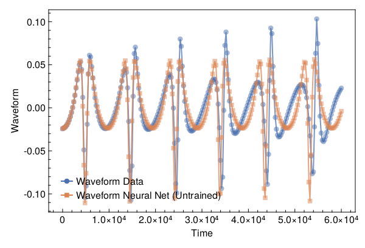
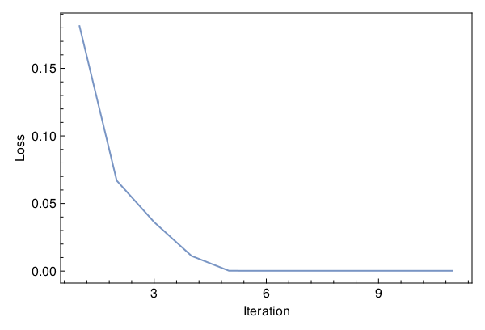
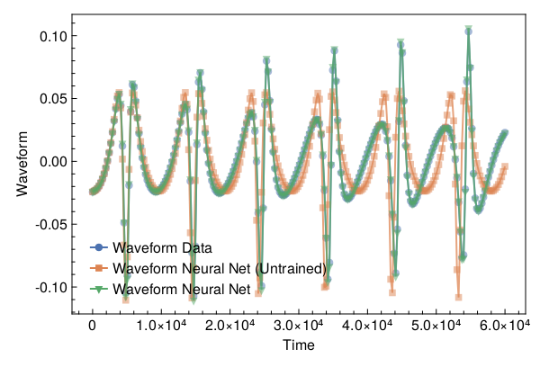

<a id='Training-a-Neural-ODE-to-Model-Gravitational-Waveforms'></a>

# Training a Neural ODE to Model Gravitational Waveforms


This code is adapted from [Astroinformatics/ScientificMachineLearning](https://github.com/Astroinformatics/ScientificMachineLearning/blob/c93aac3a460d70b4cce98836b677fd9b732e94b7/neuralode_gw.ipynb)


The code has been minimally adapted from [Keith et. al. 2021](https://arxiv.org/abs/2102.12695) which originally used Flux.jl


<a id='Package-Imports'></a>

## Package Imports


```julia
using Lux, ComponentArrays, LineSearches, LuxAMDGPU, LuxCUDA, OrdinaryDiffEq,
    Optimization, OptimizationOptimJL, Random, SciMLSensitivity
using CairoMakie, MakiePublication
CUDA.allowscalar(false)
```


<a id='Define-some-Utility-Functions'></a>

## Define some Utility Functions


::: tip


This section can be skipped. It defines functions to simulate the model, however, from a scientific machine learning perspective, isn't super relevant.


:::


We need a very crude 2-body path. Assume the 1-body motion is a newtonian 2-body position vector $r = r_1 - r_2$ and use Newtonian formulas to get $r_1$, $r_2$ (e.g. Theoretical Mechanics of Particles and Continua 4.3)


```julia
function one2two(path, m₁, m₂)
    M = m₁ + m₂
    r₁ = m₂ / M .* path
    r₂ = -m₁ / M .* path
    return r₁, r₂
end
```


```
one2two (generic function with 1 method)
```


Next we define a function to perform the change of variables: $(\chi(t),\phi(t)) \mapsto (x(t),y(t))$


```julia
@views function soln2orbit(soln, model_params=nothing)
    @assert size(soln, 1) ∈ [2, 4] "size(soln,1) must be either 2 or 4"

    if size(soln, 1) == 2
        χ = soln[1, :]
        ϕ = soln[2, :]

        @assert length(model_params)==3 "model_params must have length 3 when size(soln,2) = 2"
        p, M, e = model_params
    else
        χ = soln[1, :]
        ϕ = soln[2, :]
        p = soln[3, :]
        e = soln[4, :]
    end

    r = p ./ (1 .+ e .* cos.(χ))
    x = r .* cos.(ϕ)
    y = r .* sin.(ϕ)

    orbit = vcat(x', y')
    return orbit
end
```


```
soln2orbit (generic function with 2 methods)
```


This function uses second-order one-sided difference stencils at the endpoints; see https://doi.org/10.1090/S0025-5718-1988-0935077-0


```julia
function d_dt(v::AbstractVector, dt)
    a = -3 / 2 * v[1] + 2 * v[2] - 1 / 2 * v[3]
    b = (v[3:end] .- v[1:(end - 2)]) / 2
    c = 3 / 2 * v[end] - 2 * v[end - 1] + 1 / 2 * v[end - 2]
    return [a; b; c] / dt
end
```


```
d_dt (generic function with 1 method)
```


This function uses second-order one-sided difference stencils at the endpoints; see https://doi.org/10.1090/S0025-5718-1988-0935077-0


```julia
function d2_dt2(v::AbstractVector, dt)
    a = 2 * v[1] - 5 * v[2] + 4 * v[3] - v[4]
    b = v[1:(end - 2)] .- 2 * v[2:(end - 1)] .+ v[3:end]
    c = 2 * v[end] - 5 * v[end - 1] + 4 * v[end - 2] - v[end - 3]
    return [a; b; c] / (dt^2)
end
```


```
d2_dt2 (generic function with 1 method)
```


Now we define a function to compute the trace-free moment tensor from the orbit


```julia
function orbit2tensor(orbit, component, mass=1)
    x = orbit[1, :]
    y = orbit[2, :]

    Ixx = x .^ 2
    Iyy = y .^ 2
    Ixy = x .* y
    trace = Ixx .+ Iyy

    if component[1] == 1 && component[2] == 1
        tmp = Ixx .- trace ./ 3
    elseif component[1] == 2 && component[2] == 2
        tmp = Iyy .- trace ./ 3
    else
        tmp = Ixy
    end

    return mass .* tmp
end

function h_22_quadrupole_components(dt, orbit, component, mass=1)
    mtensor = orbit2tensor(orbit, component, mass)
    mtensor_ddot = d2_dt2(mtensor, dt)
    return 2 * mtensor_ddot
end

function h_22_quadrupole(dt, orbit, mass=1)
    h11 = h_22_quadrupole_components(dt, orbit, (1, 1), mass)
    h22 = h_22_quadrupole_components(dt, orbit, (2, 2), mass)
    h12 = h_22_quadrupole_components(dt, orbit, (1, 2), mass)
    return h11, h12, h22
end

function h_22_strain_one_body(dt::T, orbit) where {T}
    h11, h12, h22 = h_22_quadrupole(dt, orbit)

    h₊ = h11 - h22
    hₓ = T(2) * h12

    scaling_const = √(T(π) / 5)
    return scaling_const * h₊, -scaling_const * hₓ
end

function h_22_quadrupole_two_body(dt, orbit1, mass1, orbit2, mass2)
    h11_1, h12_1, h22_1 = h_22_quadrupole(dt, orbit1, mass1)
    h11_2, h12_2, h22_2 = h_22_quadrupole(dt, orbit2, mass2)
    h11 = h11_1 + h11_2
    h12 = h12_1 + h12_2
    h22 = h22_1 + h22_2
    return h11, h12, h22
end

function h_22_strain_two_body(dt::T, orbit1, mass1, orbit2, mass2) where {T}
    # compute (2,2) mode strain from orbits of BH 1 of mass1 and BH2 of mass 2

    @assert abs(mass1 + mass2 - 1.0)<1e-12 "Masses do not sum to unity"

    h11, h12, h22 = h_22_quadrupole_two_body(dt, orbit1, mass1, orbit2, mass2)

    h₊ = h11 - h22
    hₓ = T(2) * h12

    scaling_const = √(T(π) / 5)
    return scaling_const * h₊, -scaling_const * hₓ
end

function compute_waveform(dt::T, soln, mass_ratio, model_params=nothing) where {T}
    @assert mass_ratio≤1 "mass_ratio must be <= 1"
    @assert mass_ratio≥0 "mass_ratio must be non-negative"

    orbit = soln2orbit(soln, model_params)
    if mass_ratio > 0
        m₂ = inv(T(1) + mass_ratio)
        m₁ = mass_ratio * m₂

        orbit₁, orbit₂ = one2two(orbit, m₁, m₂)
        waveform = h_22_strain_two_body(dt, orbit1, mass1, orbit2, mass2)
    else
        waveform = h_22_strain_one_body(dt, orbit)
    end
    return waveform
end
```


```
compute_waveform (generic function with 2 methods)
```


<a id='Simulating-the-True-Model'></a>

## Simulating the True Model


`RelativisticOrbitModel` defines system of odes which describes motion of point like particle in schwarzschild background, uses


$$
u[1] = \chi
$$


$$
u[2] = \phi
$$


where, $p$, $M$, and $e$ are constants


```julia
function RelativisticOrbitModel(u, (p, M, e), t)
    χ, ϕ = u

    numer = (p - 2 - 2 * e * cos(χ)) * (1 + e * cos(χ))^2
    denom = sqrt((p - 2)^2 - 4 * e^2)

    χ̇ = numer * sqrt(p - 6 - 2 * e * cos(χ)) / (M * (p^2) * denom)
    ϕ̇ = numer / (M * (p^(3 / 2)) * denom)

    return [χ̇, ϕ̇]
end

mass_ratio = 0.0         # test particle
u0 = Float64[π, 0.0]     # initial conditions
datasize = 250
tspan = (0.0f0, 6.0f4)   # timespace for GW waveform
tsteps = range(tspan[1], tspan[2]; length=datasize)  # time at each timestep
dt_data = tsteps[2] - tsteps[1]
dt = 100.0
const ode_model_params = [100.0, 1.0, 0.5]; # p, M, e
```


Let's simulate the true model and plot the results using `OrdinaryDiffEq.jl`


```julia
prob = ODEProblem(RelativisticOrbitModel, u0, tspan, ode_model_params)
soln = Array(solve(prob, RK4(); saveat=tsteps, dt, adaptive=false))
waveform = first(compute_waveform(dt_data, soln, mass_ratio, ode_model_params))

fig = with_theme(theme_web()) do
    fig = Figure()
    ax = CairoMakie.Axis(fig[1, 1]; xlabel="Time", ylabel="Waveform")

    l = lines!(ax, tsteps, waveform; linewidth=2, alpha=0.75)
    s = scatter!(ax, tsteps, waveform; markershape=:circle, markeralpha=0.25, alpha=0.5)

    axislegend(ax, [[l, s]], ["Waveform Data"])

    return fig
end
```


<a id='Defiing-a-Neural-Network-Model'></a>

## Defiing a Neural Network Model


Next, we define the neural network model that takes 1 input (time) and has two outputs. We'll make a function `ODE_model` that takes the initial conditions, neural network parameters and a time as inputs and returns the derivatives.


It is typically never recommended to use globals but incase you do use them, make sure to mark them as `const`.


We will deviate from the standard Neural Network initialization and use `WeightInitializers.jl`,


```julia
const nn = Chain(Base.Fix1(broadcast, cos),
    Dense(1 => 32, cos; init_weight=truncated_normal(; std=1e-4)),
    Dense(32 => 32, cos; init_weight=truncated_normal(; std=1e-4)),
    Dense(32 => 2; init_weight=truncated_normal(; std=1e-4)))
ps, st = Lux.setup(MersenneTwister(), nn)
```


```
((layer_1 = NamedTuple(), layer_2 = (weight = Float32[3.4158795f-5; -2.2539443f-5; -4.60716f-5; 1.5438223f-5; -5.3398788f-5; -0.0001027509; 0.0001317208; 0.00013155874; 8.32636f-5; 0.00011630484; -8.94485f-6; -0.000110531706; -3.5908655f-5; 0.00022896427; 3.8295788f-5; -0.00017930949; 2.3595296f-5; -9.370813f-5; 1.8526931f-5; 8.9610294f-5; 0.00016342587; 0.000101172096; 0.00019318763; -2.1611857f-5; 0.00016459613; 0.00012281984; 2.6764961f-5; -6.712783f-5; -5.6031415f-5; -0.00025022743; -0.00022379041; -1.5005456f-5;;], bias = Float32[0.0; 0.0; 0.0; 0.0; 0.0; 0.0; 0.0; 0.0; 0.0; 0.0; 0.0; 0.0; 0.0; 0.0; 0.0; 0.0; 0.0; 0.0; 0.0; 0.0; 0.0; 0.0; 0.0; 0.0; 0.0; 0.0; 0.0; 0.0; 0.0; 0.0; 0.0; 0.0;;]), layer_3 = (weight = Float32[-1.4426696f-5 4.538052f-6 0.00014255902 8.9180394f-5 -0.00013155292 0.00012766598 -3.8424663f-5 -0.00014680625 0.00019254259 0.00016121456 -4.0444513f-5 8.845829f-5 -0.00019182038 0.0001039604 -8.397809f-5 0.000108945664 -9.133453f-6 -0.00011143594 -0.00011758018 0.0003170899 -0.00020371354 9.7958955f-6 3.506006f-5 -4.0497733f-5 0.00013012129 -4.6288482f-5 2.9526585f-5 5.2053987f-5 9.924136f-5 -0.00017839053 2.0403248f-5 -2.6329204f-5; -2.7980816f-5 -1.4977413f-5 -3.2654996f-5 0.00020603005 -9.618748f-5 8.955857f-5 -0.00016291907 -0.00014652341 6.120931f-7 -0.00012231787 4.5082897f-6 4.341693f-5 0.00018772268 1.1728575f-5 3.9998467f-6 -4.3768137f-5 -0.00016659033 -2.8355613f-5 7.887763f-5 9.313936f-5 4.084201f-5 9.2362214f-5 -8.488734f-5 -1.0682572f-5 -0.00028004518 0.000114875256 -5.275459f-5 -1.7754046f-5 0.0001828665 0.00018959226 4.9360504f-5 -0.00015671097; 0.00014670004 -4.507583f-5 -7.568486f-5 9.666248f-5 1.05293775f-5 -6.192831f-5 -6.6272696f-5 0.00019560814 -9.55008f-6 0.00020888394 -0.00020801547 -0.00012199486 7.383354f-5 -3.0602125f-5 -0.00018031 4.4387183f-5 3.7138489f-6 -3.541763f-5 0.00015686173 -4.445839f-5 1.6324003f-6 -4.306049f-5 9.467228f-5 2.1078227f-5 -3.6319238f-5 6.310757f-5 -5.2980457f-5 -0.00016950713 4.9506503f-5 6.884674f-5 0.000101713806 3.833573f-5; -9.268744f-5 -6.238922f-5 -0.00017354648 -4.193849f-5 1.4392909f-5 -2.6661904f-5 -6.803135f-5 -4.6960427f-5 1.662697f-5 0.00021208481 -0.00018457876 -3.6177364f-5 -5.15137f-6 -7.871725f-6 0.000117821146 0.00023644988 5.9894087f-6 3.7801714f-5 1.4520907f-5 -0.00015912994 -1.1185334f-5 -3.1674364f-5 -8.546197f-5 -8.510681f-5 -2.8643502f-5 -4.31607f-5 2.719391f-5 1.6595855f-5 0.00016025553 0.00019100681 -3.0261668f-5 8.435065f-6; -6.5058994f-6 2.514546f-5 -0.000104126026 0.0002442139 -0.00017305592 -0.000111299385 -9.718824f-6 -0.00015277677 0.0001401145 -0.00018122383 0.0001357206 -1.7970526f-5 -3.8991715f-5 -8.580539f-5 -2.7703678f-5 9.593233f-5 0.000112964524 2.702555f-5 4.3423156f-6 6.745704f-5 0.00014230242 -9.891469f-5 -5.740719f-5 1.0090935f-5 -0.00018218398 7.29063f-5 -0.00015333873 5.91787f-5 8.935304f-5 3.1405034f-5 0.00013854005 1.018807f-5; 0.00010571206 -4.1461095f-5 -1.8051309f-5 2.0136664f-5 5.2431396f-6 -1.916827f-5 -1.7290426f-5 0.000271168 0.00021025317 3.1744024f-5 -3.823618f-5 6.560007f-5 8.866883f-5 -5.9003246f-6 -9.2479146f-5 3.819748f-5 1.5853606f-5 2.0688624f-6 0.00016339963 -6.416646f-5 -0.00012861438 2.8991947f-6 -4.993735f-5 3.2908978f-5 -0.0002280666 -8.895452f-5 -2.7701628f-5 -0.00016538143 -2.8074217f-6 0.000105197105 -2.0483525f-5 1.2074834f-5; 0.00016120667 2.447843f-5 -1.6888241f-6 0.000102828744 -2.3449009f-5 -4.022504f-5 8.349135f-5 3.631748f-5 -0.00010444123 0.00014538823 -0.00019267418 9.90463f-7 0.00017409847 -5.6943067f-5 -0.00018032079 -1.0801045f-5 -0.00013790662 -0.00016878193 -2.437628f-5 -0.00019800724 -2.8142074f-6 -7.064705f-5 -0.0001167752 -1.1158663f-5 3.860881f-5 0.000105046114 7.0366594f-5 -0.00013501791 -1.7661649f-5 0.00012554241 -5.5829078f-5 4.8523812f-5; -9.72687f-6 0.0002406318 6.3788015f-5 -2.5253605f-5 0.00011766863 2.3163462f-5 -7.244969f-5 3.0584837f-5 0.00011010334 4.3380423f-5 -0.00018454151 4.432609f-5 -0.00011931936 -7.725253f-5 9.5748335f-5 -5.8263126f-5 -0.000121045334 2.431706f-5 -0.00011339718 -3.9988896f-5 -0.00021506158 -2.565751f-5 0.00017352385 -0.00016766168 -5.8261317f-5 -6.9287074f-5 2.736883f-5 0.00013732661 9.612087f-5 -4.0636267f-5 -3.5840745f-5 -4.8055015f-5; -7.2151306f-5 5.239529f-5 0.00014849313 0.00017767714 4.867123f-5 0.0001349557 -0.00022074592 -5.6258872f-5 -0.00011604566 -3.1799715f-5 9.640227f-6 -3.330486f-5 6.7458655f-5 -1.824448f-5 -5.240566f-6 -2.4285328f-5 7.8680954f-5 -5.3374457f-5 0.00012503215 -5.6626384f-5 8.4325344f-5 -0.00010946713 7.868188f-6 0.00010312828 -2.4387977f-5 4.2236374f-5 -0.00021773372 0.00019238872 5.2274023f-5 -1.8662891f-5 -4.6713405f-5 1.1493774f-5; 0.000114815964 3.6165817f-5 -0.000115822426 -6.585786f-5 4.410585f-5 -7.8372046f-5 0.00014851338 -0.00011588767 -5.8115886f-5 1.7989835f-6 -6.765362f-6 1.3143249f-5 7.586054f-5 -0.00022390716 0.0001277894 0.00014525226 -0.000104281906 -9.066564f-5 7.733556f-5 -6.578145f-5 0.00011683366 4.7392907f-5 -6.372716f-5 6.597167f-5 -4.8634334f-5 6.7100584f-5 -9.894505f-5 -1.36832605f-5 -0.000105781946 0.00022023029 0.00028851934 7.503611f-5; 5.582415f-5 -8.954906f-5 0.00017924272 -8.238427f-5 -4.662041f-5 6.572677f-6 0.00015462139 -4.3823293f-5 3.9154264f-5 -0.00017483355 -9.212342f-6 5.096554f-5 8.710728f-5 9.730413f-6 -6.3806f-5 0.00016643887 5.1852556f-5 -3.247376f-5 -6.553824f-5 1.3890687f-5 1.993008f-6 -0.0001433509 4.7871035f-5 -9.339589f-5 0.00011956884 -2.2427033f-5 1.6541506f-5 -0.00017591249 6.616283f-5 -8.070425f-5 -5.4731932f-5 1.386133f-5; -0.00013111392 -9.829014f-6 3.9557468f-5 -5.425533f-5 5.4976797f-5 4.310472f-5 8.755115f-5 0.00011408314 1.4430711f-5 -6.23015f-5 -0.00015406133 0.00014275525 -3.6660884f-5 -0.00010866341 0.00015557285 -1.862531f-5 -0.00012979959 -9.1222464f-5 0.00017691562 3.813776f-5 0.00014640279 3.2337302f-5 1.2295074f-5 -2.1523695f-6 3.8791284f-5 0.00023317992 7.48242f-6 1.198511f-5 -0.0001311716 -6.728461f-5 -5.8506026f-5 2.0107787f-5; -9.278151f-5 -9.153866f-5 -6.4221763f-6 -0.00013199606 0.00012788214 -3.034786f-5 5.5928907f-5 -5.9225354f-6 1.5425643f-5 0.00013902812 0.00026751895 -0.0001744844 1.3736499f-5 -4.84158f-5 7.3303905f-5 9.68354f-5 -0.00018030606 -0.00010536302 -2.1719536f-5 -4.8357688f-5 7.3468116f-5 -4.719003f-5 -2.3649698f-6 -3.1852019f-6 -5.141047f-6 8.8476765f-5 0.00014196667 -6.7292254f-5 7.714292f-5 2.418135f-5 0.00022087351 1.3478909f-5; -1.7263734f-5 0.00021882392 0.00013492444 -6.580876f-5 -4.484181f-6 7.412705f-5 1.5260257f-5 -6.0792645f-5 -0.00010980046 -1.8191677f-5 -0.00012721005 -1.6652177f-5 7.150751f-5 -0.00010803532 -5.68401f-5 -5.1410756f-5 -0.00025781698 -1.6135535f-5 3.161285f-5 0.00013593528 0.00010158387 -3.3776138f-5 3.6545825f-5 0.00010870273 -0.00027423602 -1.81082f-5 0.00011732693 -0.00010500104 5.1898463f-5 4.9911865f-5 -1.0584997f-5 3.7941394f-5; 1.7920998f-5 -7.4074f-5 -2.3034352f-5 -3.43357f-5 -0.00013720803 -1.03203f-5 0.00012187427 7.168203f-5 0.00011986336 0.0002365439 -0.00014228137 -0.00011891559 1.5586927f-5 0.00016330591 -3.9204984f-5 -9.029048f-5 0.00014353558 -0.00011802082 0.00020271985 -2.3125618f-5 8.820982f-6 -0.00010695996 -5.8758396f-5 -1.7561271f-7 -4.91789f-7 -9.432708f-5 3.4510616f-5 -6.705635f-5 9.553051f-6 4.7964615f-5 -5.918195f-6 -3.31728f-5; -0.00017306606 -3.5324425f-5 -0.0001127128 -9.699336f-7 -8.77438f-5 9.660457f-5 3.7363632f-5 6.260485f-5 4.901322f-5 -7.912907f-5 3.6188627f-5 0.000101812955 2.18531f-5 -0.00012298218 9.4822724f-5 -5.016051f-5 0.0001132703 -6.9606256f-5 9.624715f-5 2.6518514f-5 0.00012103135 4.027134f-5 -2.9114764f-5 -2.996288f-5 1.7297827f-5 -0.00013122312 0.0001285781 -1.2165409f-5 0.00011914764 -0.0001851983 -2.3725344f-5 -0.00010381734; -2.3448334f-5 -9.380807f-5 0.00010518142 -1.9031908f-5 -2.5874017f-5 -1.7331162f-5 9.051903f-5 -9.730307f-5 0.00011423472 -6.579904f-5 -3.5496003f-5 5.0383816f-5 1.5569104f-6 0.00013631315 -5.2198127f-5 -0.00014030871 -0.00014760811 8.284375f-5 -6.5658554f-5 -0.0001261892 1.1468507f-5 -2.1209562f-5 -7.273588f-5 -4.178825f-5 -0.00016160704 -0.000208448 -0.0001379122 1.9484072f-5 0.00016222385 7.2663366f-5 -6.275814f-5 -7.927366f-5; -0.00014029448 1.8262375f-5 0.0001793447 6.570142f-5 0.00010329055 -3.4644483f-5 0.00013810316 -1.2736851f-5 0.00025635838 4.1936957f-5 2.4945168f-5 8.514536f-6 -0.00020834316 -6.415941f-5 -4.2775802f-5 0.00010673796 6.60804f-5 2.057575f-5 -1.4627545f-5 -7.394649f-5 0.00014201965 -9.6966185f-5 7.963507f-5 -1.7511462f-5 -2.8700666f-5 6.0308947f-5 -3.714238f-5 0.00015533845 0.00014049791 -2.8760081f-5 -6.2562576f-5 6.308029f-5; 4.195699f-5 -0.00010516547 -1.1009268f-5 0.00012808562 -8.7468456f-5 8.731922f-6 -5.7927493f-5 -2.4810173f-5 -3.826582f-5 -5.325676f-5 0.00018571713 -0.00014262987 -5.885358f-6 -5.3449385f-6 0.00015427844 1.436465f-5 -0.00013192541 0.00014213599 -0.00011293693 -8.2862025f-5 0.0002488103 -2.472467f-5 -7.174494f-5 8.582702f-5 -0.00011114746 -8.617044f-5 -0.00015235557 6.7663255f-5 5.457227f-5 -0.00014207808 -2.282505f-6 -0.00016218264; -0.00014341205 8.102357f-5 -5.6972067f-7 7.846616f-5 -2.1444328f-5 0.0001049451 7.649991f-5 4.8640217f-5 0.00019613533 -0.0001300051 -5.2276522f-5 -2.035782f-5 -0.00014925071 7.9038466f-5 -8.715737f-5 1.603537f-5 -0.00011255001 8.739091f-6 -5.73641f-5 0.00011142988 0.00014880604 -5.264047f-5 -4.6842146f-5 -2.5827114f-5 2.243212f-5 0.0001077718 -0.00011929665 -3.9719183f-5 -6.984689f-5 0.0001916568 9.4501265f-5 -4.3468455f-5; -0.0001223471 -9.161088f-5 0.00027182917 6.497176f-5 5.062857f-5 5.514638f-5 0.000120852346 3.958787f-6 3.5334222f-5 -0.00012411347 0.00010135421 9.269897f-5 0.00012450949 -3.080541f-5 0.0001952103 -0.00012306013 -0.00015818098 5.016688f-5 0.00010542493 4.133657f-5 -1.8520699f-5 -0.0002384333 8.26805f-5 -8.4891755f-5 0.00012866975 0.00014603406 2.049622f-5 -9.132539f-5 -5.303943f-6 -8.861151f-5 1.3717194f-5 2.8031127f-5; 1.866581f-5 -4.406752f-5 4.5571378f-5 0.00011857118 -2.4263416f-5 -5.6975507f-5 -4.681644f-5 -2.0773778f-5 -3.524381f-5 -0.00018211648 -0.000108360946 -3.323516f-5 8.2889455f-5 0.0001116954 0.000115201765 -6.668627f-6 -7.7214f-5 -1.5669657f-5 -2.2591306f-5 -0.00015767092 -4.8090234f-5 -7.476763f-5 0.0001781363 -2.0420943f-5 -0.00013296494 -5.9844992f-6 8.1432394f-5 4.708675f-5 2.0500584f-5 8.9875575f-5 3.3462733f-5 1.2902374f-5; -0.000111708 -0.00011128723 4.1010026f-5 -1.9155732f-5 6.819166f-5 -1.3487865f-5 7.524158f-5 8.363392f-5 -0.00010036977 -1.584946f-5 5.1741397f-5 0.00014183247 7.719165f-6 -0.00015847127 -6.5144864f-5 3.3647222f-5 -0.00015858728 -6.425004f-5 -2.8243583f-5 -0.00023320665 2.769906f-6 -4.700277f-5 0.000109619585 0.00012687287 -1.687361f-5 3.3650067f-5 8.1001665f-5 3.916907f-5 -0.0002469316 0.0001317351 -0.000120800265 -2.3531393f-5; 1.9578823f-5 -4.999111f-5 -8.7083215f-5 8.823476f-7 3.9414845f-5 7.2590396f-5 2.2019338f-5 -7.313689f-5 -0.0002043425 -0.00030073914 -4.0511193f-5 -5.2076055f-5 -2.5113757f-5 -3.553426f-5 6.850206f-5 -9.2108494f-5 -7.666727f-5 1.005946f-5 -0.00011888293 0.00024027929 0.00010971128 6.2736784f-5 -9.9523044f-5 3.8356695f-5 -6.3036365f-5 -2.6308788f-5 6.791228f-5 4.4371358f-5 2.1635684f-5 6.474877f-5 -6.37845f-5 -0.00019433664; -4.2203872f-5 0.0001916193 0.000100567915 0.00012970204 -6.259031f-5 -7.7955224f-7 1.3781325f-5 -5.0728322f-5 -7.842576f-5 -5.3306936f-5 0.00016145459 0.0001498918 -9.759454f-5 9.058765f-5 5.503932f-6 -7.3198994f-6 0.00013614121 -3.0765898f-6 0.00011461109 -3.6290927f-5 -0.00024386935 -6.1870946f-5 3.292481f-5 -0.00014702351 -5.1382045f-5 1.051802f-5 7.702142f-6 7.3687074f-6 5.306568f-5 2.3689754f-5 -2.6372578f-5 7.376087f-5; 1.5189277f-5 -0.00024971567 -7.669918f-5 -9.8597564f-5 -5.0853425f-5 1.9126119f-5 -2.7201382f-5 1.8043384f-5 1.8005541f-5 8.695508f-6 0.0001623753 4.54917f-5 0.00010663576 -4.271471f-5 -0.00017433125 0.00011083572 0.000116306015 -1.9053756f-5 -9.256455f-5 -9.787766f-5 3.9812257f-5 -0.00016188115 1.203098f-5 0.0002321996 -6.822326f-5 7.905308f-5 4.386928f-5 -0.00012635082 0.0001225772 -4.219884f-5 0.000114918505 -0.00019759321; 0.00019204074 7.567878f-5 -6.163718f-5 -4.2646894f-5 1.6201442f-5 3.914378f-5 1.756323f-5 3.548499f-5 5.3575994f-5 -0.00015275508 -9.5249015f-5 6.0772192f-5 0.00013241336 -0.00017062045 -0.00019202581 5.4882737f-5 0.00013113445 4.7526748f-5 -5.0079874f-5 -0.00010227899 3.9921382f-5 -8.5967426f-5 -0.00019269579 -0.00016245744 -1.0343582f-5 2.8464847f-5 6.961117f-5 -0.00014671643 8.465023f-6 5.2784785f-6 9.075307f-5 -3.0887455f-5; -5.7340258f-5 0.0001231566 -4.1199623f-5 2.6952663f-5 1.3769621f-5 0.00014209129 -2.8499979f-5 -0.00015120953 -0.00013221553 -0.00016698598 -0.00013711954 7.4996795f-5 -3.4060013f-5 -5.3597312f-5 3.460476f-5 -0.00015868802 0.000254807 -6.821462f-5 -0.00022733673 -0.0001560435 -6.362092f-5 8.372684f-5 9.038894f-5 -4.8695754f-5 1.8749739f-5 1.3072693f-5 5.438482f-5 -8.768809f-5 9.446733f-6 -0.00012894209 -0.00015061485 0.00013663094; -9.672433f-5 -0.000100306694 2.0492527f-5 4.36042f-5 0.00010475498 -2.57931f-5 6.3990745f-5 6.770977f-5 -0.000116181225 0.00013589147 0.00011940891 9.054906f-5 -4.6795267f-5 -0.00013023648 -9.983071f-5 -7.2700335f-5 1.9648947f-5 1.8593266f-5 0.00017008044 -1.5757118f-5 -7.9560254f-5 3.0998577f-5 -8.205533f-5 0.0001045495 2.8815271f-5 1.1680497f-5 6.4395965f-5 -0.00021127218 -9.8664874f-5 -0.00017015156 0.00011803449 1.3359901f-5; 1.2207224f-5 0.000108067776 -4.810919f-5 3.6217116f-5 3.6501583f-6 2.4145384f-5 -9.204257f-5 0.0001232049 -5.809091f-5 3.526101f-6 -0.0001876837 4.6409583f-5 -0.000103670915 2.1664226f-5 2.3733028f-5 0.00013094358 9.10786f-5 3.480619f-5 -7.399791f-5 4.1499757f-6 0.00025052606 2.8401748f-5 1.5624282f-5 4.97372f-5 8.9099616f-5 1.9244122f-5 2.470369f-5 6.7010005f-5 -0.00013207422 -7.1727777f-7 -1.4519553f-6 -9.689071f-5; 2.78831f-5 9.495383f-5 6.921066f-5 5.3791875f-5 7.1532246f-5 -1.5391806f-5 -0.00010269342 -9.810369f-5 -0.00015276333 -0.00023210229 -0.00014673143 -0.00012316208 -0.00013321998 0.00019516233 -9.4955096f-5 2.7006241f-5 7.7296914f-5 3.6290385f-5 -1.711626f-5 3.6893576f-5 7.345555f-5 -2.551727f-5 0.0001669135 0.00011098695 -9.487525f-6 -3.6514266f-5 2.7192296f-5 -1.488341f-5 4.1745636f-5 6.354411f-5 0.00025310155 4.9437916f-5; -0.00012755522 -5.4194792f-5 -0.00013610613 -7.348138f-5 1.1520665f-5 2.1787584f-5 6.993993f-5 3.1071042f-5 3.6442376f-5 0.00010824562 -3.8790702f-5 -0.00011105507 0.00012257296 4.0281127f-5 1.2437408f-5 0.00011212953 -0.00017640858 5.2932086f-5 4.345351f-5 -0.00010362812 1.3659403f-5 6.8894544f-5 -5.2857577f-5 0.00012282733 0.0001133168 4.7986003f-5 3.3475186f-5 8.4486375f-5 -2.273114f-5 -3.8283346f-5 -5.481158f-6 -2.0060557f-5], bias = Float32[0.0; 0.0; 0.0; 0.0; 0.0; 0.0; 0.0; 0.0; 0.0; 0.0; 0.0; 0.0; 0.0; 0.0; 0.0; 0.0; 0.0; 0.0; 0.0; 0.0; 0.0; 0.0; 0.0; 0.0; 0.0; 0.0; 0.0; 0.0; 0.0; 0.0; 0.0; 0.0;;]), layer_4 = (weight = Float32[0.00012624833 6.066014f-6 6.765811f-6 1.23136215f-5 -8.8152294f-5 6.526964f-5 8.208705f-5 6.7447174f-5 -0.00012230227 -0.00011911805 -8.52932f-6 1.9131198f-6 -4.5763903f-5 -0.00017365016 -0.00010310031 1.5423133f-5 0.000120910605 -0.00021871629 -8.45257f-5 0.00020662739 5.780074f-5 -4.823684f-5 1.50637225f-5 -6.169352f-5 3.0920397f-5 8.069854f-5 -1.406023f-6 1.8704457f-5 4.777472f-5 6.762476f-5 8.026685f-5 -0.00011655726; -0.0001321071 -4.5370474f-5 3.635288f-5 -7.022291f-5 -0.00014024795 0.000109507884 0.00019140668 -1.1451904f-5 0.00011997829 -7.899845f-5 6.715078f-5 -3.291743f-5 3.901709f-5 -9.526336f-6 5.6340454f-5 9.751869f-5 -4.1648276f-5 0.00019745638 0.00017815075 -6.005903f-6 2.1056629f-5 -8.980612f-6 -5.2222953f-5 3.165165f-5 4.7761827f-5 2.5756376f-6 -5.9767375f-5 0.00011383603 0.00010510658 0.00014211613 -0.00021509056 -4.5141434f-5], bias = Float32[0.0; 0.0;;])), (layer_1 = NamedTuple(), layer_2 = NamedTuple(), layer_3 = NamedTuple(), layer_4 = NamedTuple()))
```


Similar to most DL frameworks, Lux defaults to using `Float32`, however, in this case we need Float64


```julia
const params = ComponentArray{Float64}(ps)
```


```
ComponentVector{Float64}(layer_1 = Float64[], layer_2 = (weight = [3.4158794733230025e-5; -2.253944330732338e-5; -4.6071600081631914e-5; 1.543822327221278e-5; -5.3398787713376805e-5; -0.0001027508988045156; 0.00013172079343348742; 0.00013155874330550432; 8.326359966304153e-5; 0.00011630483641056344; -8.94485037861159e-6; -0.00011053170601371676; -3.5908655263483524e-5; 0.0002289642725372687; 3.8295787817332894e-5; -0.00017930948524735868; 2.3595295715495013e-5; -9.370812767883763e-5; 1.852693094406277e-5; 8.96102937986143e-5; 0.00016342586604878306; 0.00010117209603777155; 0.00019318763224873692; -2.1611856936942786e-5; 0.00016459613107144833; 0.0001228198379976675; 2.6764961148728617e-5; -6.712783215334639e-5; -5.603141471510753e-5; -0.00025022742920555174; -0.000223790411837399; -1.5005455679784063e-5;;], bias = [0.0; 0.0; 0.0; 0.0; 0.0; 0.0; 0.0; 0.0; 0.0; 0.0; 0.0; 0.0; 0.0; 0.0; 0.0; 0.0; 0.0; 0.0; 0.0; 0.0; 0.0; 0.0; 0.0; 0.0; 0.0; 0.0; 0.0; 0.0; 0.0; 0.0; 0.0; 0.0;;]), layer_3 = (weight = [-1.4426695997826755e-5 4.5380520532489754e-6 0.00014255901623982936 8.918039384298027e-5 -0.00013155292253941298 0.00012766597501467913 -3.842466321657412e-5 -0.00014680625463370234 0.0001925425895024091 0.00016121455701068044 -4.044451270601712e-5 8.845829142956063e-5 -0.00019182037794962525 0.00010396040306659415 -8.397809142479673e-5 0.0001089456636691466 -9.133453204412945e-6 -0.00011143594019813463 -0.00011758018081309274 0.00031708989990875125 -0.00020371354185044765 9.79589549388038e-6 3.506006032694131e-5 -4.0497732697986066e-5 0.00013012129056733102 -4.628848182619549e-5 2.9526585421990603e-5 5.205398701946251e-5 9.924136247718707e-5 -0.0001783905318006873 2.0403247617650777e-5 -2.632920404721517e-5; -2.798081550281495e-5 -1.4977413229644299e-5 -3.265499617555179e-5 0.00020603004668373615 -9.618748299544677e-5 8.955856901593506e-5 -0.00016291906649712473 -0.00014652340905740857 6.120931175246369e-7 -0.00012231786968186498 4.508289748628158e-6 4.341693056630902e-5 0.00018772267503663898 1.172857537312666e-5 3.999846740043722e-6 -4.376813740236685e-5 -0.00016659032553434372 -2.835561281244736e-5 7.887763058533892e-5 9.31393587961793e-5 4.0842009184416384e-5 9.236221376340836e-5 -8.488733874401078e-5 -1.0682571883080527e-5 -0.0002800451766233891 0.00011487525625852868 -5.275458897813223e-5 -1.7754045984474942e-5 0.00018286649719811976 0.00018959226144943386 4.9360503908246756e-5 -0.00015671097207814455; 0.0001467000402044505 -4.5075830712448806e-5 -7.568486034870148e-5 9.666247933637351e-5 1.0529377505008597e-5 -6.192830915097147e-5 -6.627269613090903e-5 0.00019560813962016255 -9.550079994369298e-6 0.000208883939194493 -0.00020801546634174883 -0.00012199486081954092 7.383353658951819e-5 -3.060212475247681e-5 -0.00018031000217888504 4.438718315213919e-5 3.7138488551136106e-6 -3.541762998793274e-5 0.00015686172991991043 -4.445838931133039e-5 1.6324003127010656e-6 -4.306048867874779e-5 9.46722793742083e-5 2.1078227291582152e-5 -3.6319237551651895e-5 6.310756725724787e-5 -5.298045653034933e-5 -0.0001695071259746328 4.950650327373296e-5 6.884674075990915e-5 0.00010171380563406274 3.8335729186655954e-5; -9.268744179280475e-5 -6.238921923795715e-5 -0.00017354647570755333 -4.193848872091621e-5 1.4392909179150593e-5 -2.6661904485081322e-5 -6.803135329391807e-5 -4.6960427425801754e-5 1.662696922721807e-5 0.00021208480757195503 -0.00018457876285538077 -3.617736365413293e-5 -5.15136980538955e-6 -7.871724847063888e-6 0.00011782114597735927 0.0002364498795941472 5.989408691675635e-6 3.780171391554177e-5 1.4520906916004606e-5 -0.00015912993694655597 -1.118533418775769e-5 -3.167436443618499e-5 -8.546197204850614e-5 -8.5106810729485e-5 -2.864350244635716e-5 -4.3160700442967936e-5 2.719390977290459e-5 1.6595855413470417e-5 0.00016025552758947015 0.00019100680947303772 -3.026166814379394e-5 8.435064955847338e-6; -6.505899364128709e-6 2.5145460313069634e-5 -0.00010412602568976581 0.00024421390844509006 -0.00017305591609328985 -0.00011129938502563164 -9.71882400335744e-6 -0.0001527767744846642 0.00014011449820827693 -0.00018122383335139602 0.00013572060561273247 -1.7970525732380338e-5 -3.89917149732355e-5 -8.580538997193798e-5 -2.770367791526951e-5 9.593232971383259e-5 0.00011296452430542558 2.7025549570680596e-5 4.3423156057542656e-6 6.745704013155773e-5 0.00014230242231860757 -9.891468653222546e-5 -5.7407189160585403e-5 1.0090934665640816e-5 -0.0001821839832700789 7.290630310308188e-5 -0.00015333872579503804 5.9178699302719906e-5 8.935303776524961e-5 3.140503395115957e-5 0.00013854005374014378 1.0188069609284867e-5; 0.00010571206075837836 -4.14610949519556e-5 -1.8051308870781213e-5 2.013666380662471e-5 5.243139639787842e-6 -1.9168270227964967e-5 -1.729042560327798e-5 0.0002711680135689676 0.00021025317255407572 3.174402445438318e-5 -3.8236179534578696e-5 6.560007022926584e-5 8.866882853908464e-5 -5.9003245951316785e-6 -9.24791456782259e-5 3.8197478716028854e-5 1.585360587341711e-5 2.0688623862952227e-6 0.00016339962894562632 -6.416645919671282e-5 -0.00012861438153777272 2.8991946692258352e-6 -4.993734910385683e-5 3.290897802799009e-5 -0.0002280665939906612 -8.895451901480556e-5 -2.7701627914211713e-5 -0.00016538142517674714 -2.807421651596087e-6 0.00010519710485823452 -2.0483525076997466e-5 1.207483364851214e-5; 0.00016120666987262666 2.4478429622831754e-5 -1.688824113443843e-6 0.00010282874427502975 -2.3449008949683048e-5 -4.022504072054289e-5 8.34913516882807e-5 3.631748040788807e-5 -0.00010444122744956985 0.0001453882287023589 -0.00019267418247181922 9.904630360324518e-7 0.00017409847350791097 -5.6943066738313064e-5 -0.00018032078514806926 -1.0801045391417574e-5 -0.0001379066234221682 -0.00016878193127922714 -2.437628063489683e-5 -0.00019800724112428725 -2.814207391566015e-6 -7.06470527802594e-5 -0.00011677519796648994 -1.1158663255628198e-5 3.8608810427831486e-5 0.00010504611418582499 7.036659371806309e-5 -0.00013501790817826986 -1.7661648598732427e-5 0.00012554241402540356 -5.5829077609814703e-5 4.852381243836135e-5; -9.726870302984025e-6 0.00024063179444056004 6.37880148133263e-5 -2.5253604690078646e-5 0.00011766862735385075 2.3163462174125016e-5 -7.244969310704619e-5 3.058483707718551e-5 0.00011010334128513932 4.3380423448979855e-5 -0.00018454150995239615 4.4326090574031696e-5 -0.00011931936023756862 -7.725253090029582e-5 9.574833529768512e-5 -5.826312553836033e-5 -0.00012104533379897475 2.4317059796885587e-5 -0.00011339718184899539 -3.998889587819576e-5 -0.0002150615764549002 -2.56575094681466e-5 0.00017352384747937322 -0.00016766168118920177 -5.82613174628932e-5 -6.928707443876192e-5 2.736882925091777e-5 0.00013732661318499595 9.612087160348892e-5 -4.063626693096012e-5 -3.584074511309154e-5 -4.8055015213321894e-5; -7.215130608528852e-5 5.2395291277207434e-5 0.00014849312719888985 0.00017767713870853186 4.867123061558232e-5 0.0001349556987406686 -0.000220745918340981 -5.6258872064063326e-5 -0.00011604565952438861 -3.179971463396214e-5 9.640227290219627e-6 -3.3304859243799e-5 6.745865539414808e-5 -1.8244480088469572e-5 -5.240566224529175e-6 -2.428532752674073e-5 7.868095417506993e-5 -5.3374456911114976e-5 0.00012503215111792088 -5.662638432113454e-5 8.432534377789125e-5 -0.00010946713155135512 7.868187822168693e-6 0.00010312828089809045 -2.438797673676163e-5 4.2236373701598495e-5 -0.00021773371554445475 0.00019238871755078435 5.227402289165184e-5 -1.8662891307030804e-5 -4.671340502682142e-5 1.1493773854454048e-5; 0.0001148159644799307 3.616581670939922e-5 -0.00011582242586882785 -6.585785740753636e-5 4.410585097502917e-5 -7.837204611860216e-5 0.00014851338346488774 -0.00011588766938075423 -5.8115885622100905e-5 1.7989834759646328e-6 -6.765361831639893e-6 1.314324890699936e-5 7.586053834529594e-5 -0.0002239071618532762 0.00012778940435964614 0.00014525225560646504 -0.00010428190580569208 -9.066564234672114e-5 7.733555685263127e-5 -6.578145257662982e-5 0.0001168336602859199 4.739290670841001e-5 -6.372715870384127e-5 6.597166793653741e-5 -4.863433423452079e-5 6.710058369208127e-5 -9.894504910334945e-5 -1.3683260476682335e-5 -0.00010578194633126259 0.00022023028577677906 0.0002885193389374763 7.503610686399043e-5; 5.58241517865099e-5 -8.954905933933333e-5 0.00017924272106029093 -8.238427108153701e-5 -4.662041101255454e-5 6.5726771936169825e-6 0.0001546213898109272 -4.3823292799061164e-5 3.915426350431517e-5 -0.0001748335489537567 -9.212341865350027e-6 5.096554014016874e-5 8.710727706784382e-5 9.730412784847431e-6 -6.380600098054856e-5 0.00016643886920064688 5.185255577089265e-5 -3.247375934734009e-5 -6.553823914146051e-5 1.3890687114326283e-5 1.9930080270569306e-6 -0.00014335090236272663 4.787103534908965e-5 -9.339588723378256e-5 0.00011956883827224374 -2.2427033400163054e-5 1.654150582908187e-5 -0.00017591248615644872 6.616282917093486e-5 -8.070425246842206e-5 -5.473193232319318e-5 1.3861330444342457e-5; -0.0001311139203608036 -9.82901383395074e-6 3.9557467971462756e-5 -5.4255331633612514e-5 5.4976797400740907e-5 4.310471922508441e-5 8.755114686209708e-5 0.00011408313730498776 1.4430711416935083e-5 -6.230150029296055e-5 -0.00015406133024953306 0.0001427552488166839 -3.6660883779404685e-5 -0.00010866340744541958 0.00015557285223621875 -1.8625309166964144e-5 -0.0001297995913773775 -9.122246410697699e-5 0.0001769156224327162 3.8137761293910444e-5 0.00014640278823208064 3.233730240026489e-5 1.2295074157009367e-5 -2.1523694613279076e-6 3.879128416883759e-5 0.0002331799187231809 7.482420187443495e-6 1.1985110177192837e-5 -0.00013117160415276885 -6.72846072120592e-5 -5.850602610735223e-5 2.010778734984342e-5; -9.278151264879853e-5 -9.153866267297417e-5 -6.422176284104353e-6 -0.0001319960574619472 0.00012788214371539652 -3.0347859137691557e-5 5.592890738626011e-5 -5.922535365243675e-6 1.5425643141497858e-5 0.0001390281249769032 0.00026751894620247185 -0.00017448440485168248 1.3736498658545315e-5 -4.8415800847578794e-5 7.330390508286655e-5 9.683539974503219e-5 -0.00018030605860985816 -0.00010536301851971075 -2.171953565266449e-5 -4.835768777411431e-5 7.346811617026106e-5 -4.719003118225373e-5 -2.364969759582891e-6 -3.18520187647664e-6 -5.141047040524427e-6 8.847676508594304e-5 0.00014196666597854346 -6.72922542435117e-5 7.714291859883815e-5 2.418135045445524e-5 0.00022087350953370333 1.3478908840625081e-5; -1.726373375277035e-5 0.00021882391592953354 0.00013492444122675806 -6.580875924555585e-5 -4.484180863073561e-6 7.412704871967435e-5 1.526025698694866e-5 -6.079264494474046e-5 -0.0001098004577215761 -1.819167664507404e-5 -0.00012721004895865917 -1.6652176782372408e-5 7.150750752771273e-5 -0.00010803531768033281 -5.684010102413595e-5 -5.1410755986580625e-5 -0.0002578169805929065 -1.613553467905149e-5 3.1612849852535874e-5 0.00013593527546618134 0.00010158387158298865 -3.377613757038489e-5 3.6545825423672795e-5 0.00010870272672036663 -0.0002742360229603946 -1.8108199583366513e-5 0.00011732692655641586 -0.00010500103962840512 5.189846342545934e-5 4.9911865062313154e-5 -1.0584996744000819e-5 3.7941394111840054e-5; 1.792099828890059e-5 -7.407399971270934e-5 -2.3034352125250734e-5 -3.433569872868247e-5 -0.0001372080296278 -1.0320300134480931e-5 0.00012187426909804344 7.168202864704654e-5 0.00011986336176050827 0.00023654389951843768 -0.00014228136569727212 -0.00011891558824572712 1.558692747494206e-5 0.00016330591461155564 -3.920498420484364e-5 -9.029047942021862e-5 0.00014353558071888983 -0.0001180208200821653 0.0002027198497671634 -2.3125618099584244e-5 8.820981747703627e-6 -0.00010695996024878696 -5.8758396335178986e-5 -1.7561271192789718e-7 -4.917890237265965e-7 -9.432707884116098e-5 3.451061638770625e-5 -6.705635314574465e-5 9.55305131355999e-6 4.796461507794447e-5 -5.918194801779464e-6 -3.317280061310157e-5; -0.00017306605877820402 -3.532442497089505e-5 -0.00011271279799984768 -9.6993358056352e-7 -8.774379966780543e-5 9.660456998972222e-5 3.736363214557059e-5 6.260484951781109e-5 4.9013218813342974e-5 -7.912907312856987e-5 3.618862683651969e-5 0.00010181295510847121 2.1853100406588055e-5 -0.00012298217916395515 9.482272434979677e-5 -5.016050999984145e-5 0.00011327029642416164 -6.960625614738092e-5 9.624715312384069e-5 2.6518513550399803e-5 0.00012103134940844029 4.027134127682075e-5 -2.9114764402038418e-5 -2.9962879125378095e-5 1.729782707116101e-5 -0.00013122311793267727 0.0001285781036131084 -1.2165409316367004e-5 0.00011914764036191627 -0.00018519829609431326 -2.3725344362901524e-5 -0.00010381734318798408; -2.3448334104614332e-5 -9.380807023262605e-5 0.00010518141789361835 -1.903190786833875e-5 -2.587401650089305e-5 -1.733116187097039e-5 9.051903180079535e-5 -9.730306919664145e-5 0.00011423471732996404 -6.57990385661833e-5 -3.549600296537392e-5 5.0383816414978355e-5 1.556910433464509e-6 0.00013631314504891634 -5.219812737777829e-5 -0.0001403087080689147 -0.00014760810881853104 8.284374780487269e-5 -6.565855437656865e-5 -0.00012618920300155878 1.1468507182144094e-5 -2.120956196449697e-5 -7.273587834788486e-5 -4.1788251110119745e-5 -0.00016160703671630472 -0.00020844799291808158 -0.00013791219680570066 1.9484072254272178e-5 0.0001622238487470895 7.266336615430191e-5 -6.27581393928267e-5 -7.927366095827892e-5; -0.00014029447629582137 1.8262375306221657e-5 0.00017934470088221133 6.57014170428738e-5 0.00010329054930480197 -3.4644483093870804e-5 0.00013810316158924252 -1.2736851203953847e-5 0.00025635838392190635 4.1936957131838426e-5 2.4945167751866393e-5 8.514535693393555e-6 -0.00020834316092077643 -6.415940879378468e-5 -4.277580228517763e-5 0.0001067379635060206 6.608039984712377e-5 2.0575749658746645e-5 -1.4627545169787481e-5 -7.394648855552077e-5 0.00014201964950188994 -9.696618508314714e-5 7.963507232489064e-5 -1.751146191963926e-5 -2.8700666007352993e-5 6.030894655850716e-5 -3.7142381188459694e-5 0.00015533844998572022 0.00014049791207071394 -2.8760081477230415e-5 -6.256257620407268e-5 6.308028969215229e-5; 4.195699148112908e-5 -0.00010516546899452806 -1.1009267836925574e-5 0.00012808562314603478 -8.746845560381189e-5 8.731922207516618e-6 -5.792749288957566e-5 -2.481017327227164e-5 -3.826582178589888e-5 -5.3256761020747945e-5 0.00018571713007986546 -0.00014262986951507628 -5.885357950319303e-6 -5.344938472262584e-6 0.0001542784448247403 1.4364650269271806e-5 -0.00013192540791351348 0.00014213599206414074 -0.00011293692659819499 -8.286202501039952e-5 0.00024881030549295247 -2.4724669856368564e-5 -7.174493657657877e-5 8.582702139392495e-5 -0.00011114746303064749 -8.61704393173568e-5 -0.00015235556929837912 6.766325532225892e-5 5.4572268709307536e-5 -0.00014207807544153184 -2.282504965478438e-6 -0.00016218263772316277; -0.00014341204951051623 8.102357242023572e-5 -5.69720668863738e-7 7.846616063034162e-5 -2.1444328012876213e-5 0.00010494510206626728 7.64999131206423e-5 4.864021684625186e-5 0.00019613532640505582 -0.0001300050935242325 -5.227652218309231e-5 -2.0357820176286623e-5 -0.00014925071445759386 7.903846562840044e-5 -8.715737203601748e-5 1.6035370208555833e-5 -0.00011255001300014555 8.739090844755992e-6 -5.736410093959421e-5 0.00011142987932544202 0.00014880603703204542 -5.264046922093257e-5 -4.684214582084678e-5 -2.582711385912262e-5 2.243211929453537e-5 0.00010777179704746231 -0.00011929665197385475 -3.97191834053956e-5 -6.984688661759719e-5 0.00019165679987054318 9.450126526644453e-5 -4.346845526015386e-5; -0.00012234710447955877 -9.161087655229494e-5 0.0002718291652854532 6.497176218545064e-5 5.0628568715183064e-5 5.514638178283349e-5 0.00012085234629921615 3.958787146984832e-6 3.533422204782255e-5 -0.00012411347415763885 0.00010135421325685456 9.269896690966561e-5 0.00012450948997866362 -3.080541137023829e-5 0.00019521030480973423 -0.0001230601337738335 -0.0001581809774506837 5.016688010073267e-5 0.00010542492964304984 4.133657057536766e-5 -1.852069908636622e-5 -0.0002384333056397736 8.268049714388326e-5 -8.489175525028259e-5 0.00012866975157521665 0.00014603405725210905 2.0496219804044813e-5 -9.132538980338722e-5 -5.303942998580169e-6 -8.86115085450001e-5 1.3717193724005483e-5 2.8031126930727623e-5; 1.8665810785023496e-5 -4.406752123031765e-5 4.55713779956568e-5 0.00011857118079205975 -2.4263415980385616e-5 -5.69755065953359e-5 -4.681643986259587e-5 -2.077377757814247e-5 -3.524381099850871e-5 -0.0001821164769353345 -0.00010836094588739797 -3.323515920783393e-5 8.288945537060499e-5 0.00011169540084665641 0.00011520176485646516 -6.668627065664623e-6 -7.721399742877111e-5 -1.5669656932004727e-5 -2.259130633319728e-5 -0.00015767091827001423 -4.809023448615335e-5 -7.476763130398467e-5 0.00017813629528973252 -2.042094274656847e-5 -0.0001329649385297671 -5.984499239275465e-6 8.143239392666146e-5 4.70867489639204e-5 2.050058355962392e-5 8.987557521322742e-5 3.346273297211155e-5 1.290237378270831e-5; -0.00011170800280524418 -0.00011128722690045834 4.101002559764311e-5 -1.9155731934006326e-5 6.819165719207376e-5 -1.348786463495344e-5 7.524157990701497e-5 8.363391680177301e-5 -0.00010036976891569793 -1.5849460396566428e-5 5.174139732844196e-5 0.00014183246821630746 7.719165296293795e-6 -0.0001584712736075744 -6.514486449304968e-5 3.364722215337679e-5 -0.00015858728147577494 -6.425003812182695e-5 -2.8243583074072376e-5 -0.0002332066505914554 2.7699059046426555e-6 -4.7002769861137494e-5 0.00010961958469124511 0.00012687286653090268 -1.687360963842366e-5 3.3650067052803934e-5 8.100166451185942e-5 3.916907007806003e-5 -0.0002469315950293094 0.0001317350979661569 -0.00012080026499461383 -2.3531392798759043e-5; 1.957882341230288e-5 -4.999111115466803e-5 -8.708321547601372e-5 8.823475923236401e-7 3.941484465030953e-5 7.259039557538927e-5 2.201933784817811e-5 -7.313689275179058e-5 -0.00020434250473044813 -0.0003007391351275146 -4.0511193219572306e-5 -5.207605499890633e-5 -2.5113757146755233e-5 -3.5534259950509295e-5 6.850205681985244e-5 -9.210849384544417e-5 -7.666726742172614e-5 1.005945978249656e-5 -0.00011888292647199705 0.00024027928884606808 0.00010971128358505666 6.273678445722908e-5 -9.952304390026256e-5 3.835669485852122e-5 -6.303636473603547e-5 -2.6308787710149772e-5 6.791228224756196e-5 4.437135794432834e-5 2.1635683879139833e-5 6.474876863649115e-5 -6.378450052579865e-5 -0.00019433663692325354; -4.220387199893594e-5 0.00019161929958499968 0.00010056791506940499 0.00012970203533768654 -6.259031215449795e-5 -7.795522378728492e-7 1.3781324923911598e-5 -5.072832209407352e-5 -7.842575723771006e-5 -5.3306936024455354e-5 0.00016145459085237235 0.00014989179908297956 -9.759453678270802e-5 9.058765135705471e-5 5.503931788553018e-6 -7.319899395952234e-6 0.00013614121417049319 -3.0765897918172413e-6 0.00011461108806543052 -3.629092680057511e-5 -0.00024386934819631279 -6.187094550114125e-5 3.292481051175855e-5 -0.00014702351472806185 -5.138204505783506e-5 1.0518019735172857e-5 7.702142283960711e-6 7.368707429122878e-6 5.306567982188426e-5 2.3689754016231745e-5 -2.6372577849542722e-5 7.376087160082534e-5; 1.5189277291938197e-5 -0.00024971566745080054 -7.669917977182195e-5 -9.859756391961128e-5 -5.085342490929179e-5 1.91261187865166e-5 -2.7201382181374356e-5 1.8043383533949964e-5 1.8005541278398596e-5 8.695507858647034e-6 0.00016237530508078635 4.549169898382388e-5 0.00010663575812941417 -4.271470970707014e-5 -0.00017433124594390392 0.00011083571735071018 0.00011630601511569694 -1.9053755750064738e-5 -9.256455086870119e-5 -9.787765884539112e-5 3.981225745519623e-5 -0.00016188115114346147 1.2030979632982053e-5 0.0002321995998499915 -6.822325667599216e-5 7.905308302724734e-5 4.386928048916161e-5 -0.00012635081657208502 0.0001225771993631497 -4.219884067424573e-5 0.00011491850455058739 -0.00019759321003220975; 0.0001920407376019284 7.567877764813602e-5 -6.163718353491277e-5 -4.2646894144127145e-5 1.6201442122110166e-5 3.914377884939313e-5 1.7563230358064175e-5 3.548499080352485e-5 5.357599366107024e-5 -0.0001527550775790587 -9.524901543045416e-5 6.077219222788699e-5 0.00013241336273495108 -0.00017062044935300946 -0.0001920258073369041 5.488273745868355e-5 0.00013113445311319083 4.7526747948722914e-5 -5.0079874199582264e-5 -0.00010227898746961728 3.9921382267493755e-5 -8.596742554800585e-5 -0.00019269579206593335 -0.00016245743609033525 -1.0343582289351616e-5 2.8464846764109097e-5 6.961116741877049e-5 -0.00014671642566099763 8.465022801829036e-6 5.27847851117258e-6 9.075307025341317e-5 -3.088745506829582e-5; -5.734025762649253e-5 0.00012315659841988236 -4.11996225011535e-5 2.6952662665280513e-5 1.3769620636594482e-5 0.0001420912885805592 -2.8499978725449182e-5 -0.0001512095332145691 -0.00013221552944742143 -0.00016698597755748779 -0.0001371195394312963 7.499679486500099e-5 -3.406001269468106e-5 -5.35973122168798e-5 3.460476000327617e-5 -0.00015868802438490093 0.00025480700423941016 -6.821462011430413e-5 -0.00022733672813046724 -0.00015604350483044982 -6.362092244671658e-5 8.372683805646375e-5 9.038893767865375e-5 -4.869575423072092e-5 1.87497389561031e-5 1.3072693036519922e-5 5.438481821329333e-5 -8.768808766035363e-5 9.446733201912139e-6 -0.00012894209066871554 -0.00015061485464684665 0.00013663094432558864; -9.672433225205168e-5 -0.00010030669363914058 2.0492527255555615e-5 4.360419916338287e-5 0.00010475498129380867 -2.5793100576265715e-5 6.399074482033029e-5 6.77097705192864e-5 -0.00011618122516665608 0.00013589147420134395 0.00011940891272388399 9.054905967786908e-5 -4.67952668259386e-5 -0.00013023648352827877 -9.983070776797831e-5 -7.270033529493958e-5 1.9648947272798978e-5 1.859326584963128e-5 0.0001700804423308 -1.575711758050602e-5 -7.9560253652744e-5 3.099857713095844e-5 -8.205533231375739e-5 0.00010454950097482651 2.88152714347234e-5 1.1680496754706837e-5 6.439596472773701e-5 -0.00021127218496985734 -9.866487380350009e-5 -0.00017015155754052103 0.00011803449160652235 1.3359900549403392e-5; 1.2207224244775716e-5 0.00010806777572724968 -4.81091883557383e-5 3.6217115848558024e-5 3.650158305390505e-6 2.414538357697893e-5 -9.204256639350206e-5 0.0001232048962265253 -5.809091089759022e-5 3.5261009543319233e-6 -0.0001876837050076574 4.640958286472596e-5 -0.00010367091454099864 2.166422564187087e-5 2.37330277741421e-5 0.00013094357564114034 9.107859659707174e-5 3.480619125184603e-5 -7.399790774798021e-5 4.149975666223327e-6 0.0002505260636098683 2.8401747840689495e-5 1.5624282241333276e-5 4.973719842382707e-5 8.90996161615476e-5 1.924412208609283e-5 2.4703689632588066e-5 6.70100052957423e-5 -0.00013207421579863876 -7.172777714004042e-7 -1.4519553133141017e-6 -9.689071157481521e-5; 2.7883099392056465e-5 9.495382983004674e-5 6.921066233189777e-5 5.379187496146187e-5 7.153224578360096e-5 -1.5391806300613098e-5 -0.00010269341873936355 -9.810368646867573e-5 -0.0001527633285149932 -0.0002321022911928594 -0.00014673142868559808 -0.00012316208449192345 -0.00013321997539605945 0.0001951623271452263 -9.495509584667161e-5 2.7006240998161957e-5 7.729691424174234e-5 3.629038474173285e-5 -1.711625918687787e-5 3.6893576179863885e-5 7.345555059146136e-5 -2.5517270842101425e-5 0.0001669134944677353 0.00011098694812972099 -9.487524948781356e-6 -3.6514265957521275e-5 2.7192296329303645e-5 -1.4883409676258452e-5 4.174563582637347e-5 6.354411016218364e-5 0.000253101548878476 4.943791645928286e-5; -0.00012755522038787603 -5.41947920282837e-5 -0.0001361061295028776 -7.348138024099171e-5 1.1520664884301368e-5 2.178758404625114e-5 6.993993156356737e-5 3.10710420308169e-5 3.6442375858314335e-5 0.00010824562195921317 -3.879070209222846e-5 -0.00011105507292086259 0.00012257296475581825 4.0281127439811826e-5 1.2437408258847427e-5 0.00011212952813366428 -0.00017640857549849898 5.293208596413024e-5 4.345351044321433e-5 -0.00010362811735831201 1.3659402611665428e-5 6.889454380143434e-5 -5.285757652018219e-5 0.0001228273322340101 0.00011331679706927389 4.7986002755351365e-5 3.347518577356823e-5 8.448637527180836e-5 -2.2731139324605465e-5 -3.828334592981264e-5 -5.481158041220624e-6 -2.0060557289980352e-5], bias = [0.0; 0.0; 0.0; 0.0; 0.0; 0.0; 0.0; 0.0; 0.0; 0.0; 0.0; 0.0; 0.0; 0.0; 0.0; 0.0; 0.0; 0.0; 0.0; 0.0; 0.0; 0.0; 0.0; 0.0; 0.0; 0.0; 0.0; 0.0; 0.0; 0.0; 0.0; 0.0;;]), layer_4 = (weight = [0.00012624832743313164 6.066014066163916e-6 6.765811122022569e-6 1.2313621482462622e-5 -8.815229375613853e-5 6.526963989017531e-5 8.208704821299762e-5 6.74471739330329e-5 -0.00012230227002874017 -0.00011911804904229939 -8.529320439265575e-6 1.9131198314426e-6 -4.5763903472106904e-5 -0.00017365015810355544 -0.00010310031211702153 1.5423132936120965e-5 0.00012091060489183292 -0.00021871628996450454 -8.452570182271302e-5 0.00020662738825194538 5.780073843197897e-5 -4.823684139410034e-5 1.5063722457853146e-5 -6.169352127471939e-5 3.092039696639404e-5 8.069854084169492e-5 -1.4060229887036257e-6 1.870445703389123e-5 4.77747198601719e-5 6.762475823052227e-5 8.02668510004878e-5 -0.0001165572612080723; -0.00013210710312705487 -4.537047425401397e-5 3.635288157965988e-5 -7.022290810709819e-5 -0.00014024795382283628 0.00010950788418995216 0.000191406681551598 -1.145190435636323e-5 0.00011997829278698191 -7.899844786152244e-5 6.715078052366152e-5 -3.291742905275896e-5 3.901708987541497e-5 -9.526335816190112e-6 5.634045373881236e-5 9.751869220053777e-5 -4.1648276237538084e-5 0.00019745637837331742 0.00017815074534155428 -6.005902832839638e-6 2.105662861140445e-5 -8.980611710285302e-6 -5.2222952945157886e-5 3.165164889651351e-5 4.7761826863279566e-5 2.5756376089702826e-6 -5.9767375205410644e-5 0.00011383603123249486 0.00010510657739359885 0.00014211612869985402 -0.0002150905638700351 -4.514143438427709e-5], bias = [0.0; 0.0;;]))
```


Now we define a system of odes which describes motion of point like particle with Newtonian physics, uses


$$
u[1] = \chi
$$


$$
u[2] = \phi
$$


where, $p$, $M$, and $e$ are constants


```julia
function ODE_model(u, nn_params, t)
    χ, ϕ = u
    p, M, e = ode_model_params

    # In this example we know that `st` is am empty NamedTuple hence we can safely ignore
    # it, however, in general, we should use `st` to store the state of the neural network.
    y = 1 .+ first(nn([first(u)], nn_params, st))

    numer = (1 + e * cos(χ))^2
    denom = M * (p^(3 / 2))

    χ̇ = (numer / denom) * y[1]
    ϕ̇ = (numer / denom) * y[2]

    return [χ̇, ϕ̇]
end
```


```
ODE_model (generic function with 1 method)
```


Let us now simulate the neural network model and plot the results. We'll use the untrained neural network parameters to simulate the model.


```julia
prob_nn = ODEProblem(ODE_model, u0, tspan, params)
soln_nn = Array(solve(prob_nn, RK4(); u0, p=params, saveat=tsteps, dt, adaptive=false))
waveform_nn = first(compute_waveform(dt_data, soln_nn, mass_ratio, ode_model_params))

fig = with_theme(theme_web()) do
    fig = Figure()
    ax = CairoMakie.Axis(fig[1, 1]; xlabel="Time", ylabel="Waveform")

    l1 = lines!(ax, tsteps, waveform; linewidth=2, alpha=0.75)
    s1 = scatter!(ax, tsteps, waveform; markershape=:circle, markeralpha=0.25, alpha=0.5)

    l2 = lines!(ax, tsteps, waveform_nn; linewidth=2, alpha=0.75)
    s2 = scatter!(ax, tsteps, waveform_nn; markershape=:circle, markeralpha=0.25, alpha=0.5)

    axislegend(ax, [[l1, s1], [l2, s2]],
        ["Waveform Data", "Waveform Neural Net (Untrained)"]; position=:lb)

    return fig
end
```





<a id='Setting-Up-for-Training-the-Neural-Network'></a>

## Setting Up for Training the Neural Network


Next, we define the objective (loss) function to be minimized when training the neural differential equations.


```julia
function loss(θ)
    pred = Array(solve(prob_nn, RK4(); u0, p=θ, saveat=tsteps, dt, adaptive=false))
    pred_waveform = first(compute_waveform(dt_data, pred, mass_ratio, ode_model_params))
    loss = sum(abs2, waveform .- pred_waveform)
    return loss, pred_waveform
end
```


```
loss (generic function with 1 method)
```


Warmup the loss function


```julia
loss(params)
```


```
(0.18192231361152605, [-0.024280410454282548, -0.023494512583891406, -0.022708614713500167, -0.021380708286035315, -0.019483023307625722, -0.016975251655467833, -0.0138044746937273, -0.009902202438986943, -0.0051866531383984345, 0.0004375748897523519, 0.0070702389825194, 0.014794371529065018, 0.023628361191675044, 0.03339682670064982, 0.04345062176951659, 0.05200496809929012, 0.05474012592200245, 0.042525462702904845, 0.001793271102691951, -0.06663790438924662, -0.11048740402628586, -0.07604362992730997, -0.0063992494316346795, 0.039156615261289905, 0.054451343706695236, 0.05299195224394556, 0.04479291324108012, 0.03471837113593048, 0.024797978685860363, 0.015784321344127574, 0.007887700388970393, 0.0011043880567997342, -0.0046478860920993285, -0.009471065291313216, -0.013463851697062677, -0.016710673490054156, -0.019283220657127686, -0.021237460744089814, -0.022615852546840905, -0.023448265945934643, -0.023752974493864182, -0.02353701968767092, -0.02279750981806826, -0.02151926573754879, -0.019676988424067714, -0.017232899383807468, -0.014136012675787856, -0.010321608799194255, -0.005710511107161543, -0.00021073002098282007, 0.006274859520150136, 0.013832243215200898, 0.022487174493944502, 0.03209984453702056, 0.04210823877179044, 0.050945720702171855, 0.05477995704445587, 0.045331989981590166, 0.009304685938814979, -0.05683594650244375, -0.10872576898205873, -0.08478899700938895, -0.0152278040642174, 0.03517885637071565, 0.05387753089651448, 0.053889915114557936, 0.04612987467560831, 0.03606262499882932, 0.025996760749555314, 0.01680232338228709, 0.00872784853072642, 0.0017917224256965983, -0.00409531613585117, -0.009027089440712208, -0.013114423031147428, -0.016437599287022348, -0.019078272020845787, -0.021088824189953337, -0.02251942798448629, -0.02339819081410303, -0.02374787123434281, -0.023576511915083406, -0.02288198171748503, -0.021653049542305278, -0.019866141048548447, -0.01748257016589344, -0.014459818258759168, -0.010728741753463165, -0.006221215889347325, -0.0008402721629559062, 0.005500978816187883, 0.01289676144709913, 0.021373964176351987, 0.03082886076323631, 0.04076988718416497, 0.04982829357446824, 0.05460593224649049, 0.04762660485139929, 0.016106560046966648, -0.046880629848547836, -0.10526369039237252, -0.0926241075731858, -0.024598957906563523, 0.030544712816827843, 0.05297692617179041, 0.05468046073568667, 0.047454397370917355, 0.037427370834452016, 0.027227214876885383, 0.01784577446793404, 0.009595977514927113, 0.0024950974188781582, -0.00352309095706181, -0.008573874696608561, -0.012752332882569061, -0.016159509673219996, -0.018864966247124214, -0.020936994397472757, -0.022417615942529938, -0.02334517113394637, -0.023739197447448398, -0.02361188992935083, -0.022963704241665064, -0.021782248251165016, -0.020049129203909596, -0.01772637276834954, -0.014774142936964633, -0.01112600931545449, -0.006717324327332551, -0.0014534119056359273, 0.004749240000357548, 0.011985759960038785, 0.02029014826285929, 0.029582488686684755, 0.03944117223733968, 0.04866523555958582, 0.05424548483713362, 0.049462535163219835, 0.022189068151540328, -0.03697989627052763, -0.10023839294692978, -0.09929353317060387, -0.03439671605034712, 0.0252130394662173, 0.05170793538850577, 0.0553409953322291, 0.04875896060845677, 0.03881297926282742, 0.02848284821013365, 0.01892356356674116, 0.010485450137524945, 0.003222983219949765, -0.0029405016577723027, -0.00810200708918065, -0.012383224885184395, -0.01587095671185486, -0.018649010813588107, -0.020776891033727717, -0.02231302599919749, -0.02328792501525342, -0.023727196089302606, -0.023644248465363785, -0.02304086550993219, -0.021908076255403596, -0.0202247305469588, -0.01796596017451915, -0.015079327034652985, -0.011511890293910606, -0.007201096121309623, -0.0020513248976831047, 0.004019251185327821, 0.01110072593211756, 0.019232259562579308, 0.02836248060287844, 0.03812483329707876, 0.047466444319356864, 0.0537294524411224, 0.05088271210155755, 0.027574316038624258, -0.027333549350274634, -0.09381980150464152, -0.10457655375541032, -0.04447091507683417, 0.019160817317832854, 0.05001620987446229, 0.055850420962912345, 0.050034202520841814, 0.04021272182949105, 0.029774421011018723, 0.02002599060641149, 0.01140246799745625, 0.00396839077275222, -0.002332624959565444, -0.007622383465279372, -0.012002616025723062, -0.015576423768350323, -0.018421217375979213, -0.02061514798886628, -0.022203497284867438, -0.023227188148143223, -0.02371135868036627, -0.023673141173101687, -0.023114444092797067, -0.02202768564196081, -0.020399990825452786, -0.018195535545901156, -0.015377503261649465, -0.011888710804155656, -0.007671104234477067, -0.0026320455214129297, 0.0033082532903901383, 0.010238139311519281, 0.01820330158140462, 0.027169118480747666, 0.036822718861216026, 0.046242337412599574, 0.05307871691340831, 0.05193558452131918, 0.03228342451128493, -0.018083013666903246, -0.08623633962941499, -0.10829390520052233, -0.05462214831422969, 0.012361901796755781, 0.04785924896944936, 0.056177976272547156, 0.05126941840057991, 0.04162829506257848, 0.031091241078237943, 0.021161110971042434, 0.01234600217852369, 0.004738252965901015, -0.00171156973462151, -0.007126710378048192, -0.011610913249072, -0.015271862382414049, -0.018189830095891014, -0.02044642996928945, -0.022089557554983843, -0.02316247887678686, -0.02369235152206666, -0.023698441303811327, -0.02318436086006943, -0.022144462724101633, -0.020567602091536526, -0.01842036658579013, -0.01566791510272617, -0.012255847277790352, -0.008128886575688568, -0.0040019258735869544])
```


Now let us define a callback function to store the loss over time


```julia
const losses = Float64[]

function callback(θ, l, pred_waveform)
    push!(losses, l)
    println("Training || Iteration: $(length(losses)) || Loss: $(l)")
    return false
end
```


```
callback (generic function with 1 method)
```


<a id='Training-the-Neural-Network'></a>

## Training the Neural Network


Training uses the BFGS optimizers. This seems to give good results because the Newtonian model seems to give a very good initial guess


```julia
adtype = Optimization.AutoZygote()
optf = Optimization.OptimizationFunction((x, p) -> loss(x), adtype)
optprob = Optimization.OptimizationProblem(optf, params)
res = Optimization.solve(optprob,
    BFGS(; initial_stepnorm=0.01, linesearch=LineSearches.BackTracking());
    callback, maxiters=1000)
```


```
u: ComponentVector{Float64}(layer_1 = Float64[], layer_2 = (weight = [3.415879473325219e-5; -2.2539443307313498e-5; -4.607160008159271e-5; 1.543822327220872e-5; -5.339878771335811e-5; -0.00010275089880454303; 0.00013172079343346337; 0.00013155874330542856; 8.326359966294142e-5; 0.00011630483641043389; -8.944850378606708e-6; -0.0001105317060137361; -3.59086552635137e-5; 0.00022896427253720026; 3.829578781731551e-5; -0.00017930948524714872; 2.3595295715491584e-5; -9.370812767885649e-5; 1.85269309440335e-5; 8.961029379851936e-5; 0.00016342586604874634; 0.00010117209603781354; 0.00019318763224860776; -2.1611856936943033e-5; 0.0001645961310712835; 0.00012281983799752703; 2.6764961148737327e-5; -6.712783215330966e-5; -5.603141471512254e-5; -0.00025022742920557126; -0.0002237904118371307; -1.5005455679771134e-5;;], bias = [-2.38864241166364e-17; -1.0733644558435322e-17; -4.2409592729382756e-17; 4.457648218956596e-18; -2.0217656130576904e-17; 2.9889271804709744e-17; 2.6737552595869675e-17; 8.054971762946633e-17; 1.0801704238343226e-16; 1.4137669847393935e-16; -5.280181714157737e-18; 2.167547429423267e-17; 3.263172191945715e-17; 7.407698656807474e-17; 1.8972653872878974e-17; -2.278604810441198e-16; 3.690620909654316e-18; 2.1499462813007237e-17; 3.175656571251316e-17; 1.0245395150767278e-16; 3.959474700392154e-17; -4.513241962092219e-17; 1.402768160430341e-16; 1.6837491834114802e-19; 1.8012370563574513e-16; 1.5321311974120531e-16; -9.551715401470463e-18; -3.948031866714349e-17; 1.619736150133542e-17; 2.237289965319495e-17; -2.9404793098852983e-16; -1.4206150364340343e-17;;]), layer_3 = (weight = [-1.442535585668064e-5 4.539392194395373e-6 0.0001425603563809751 8.918173398412676e-5 -0.00013155158239826754 0.00012766731515582124 -3.842332307543493e-5 -0.00014680491449256314 0.00019254392964355272 0.00016121589715182124 -4.044317256487055e-5 8.8459631570702e-5 -0.00019181903780847914 0.00010396174320771833 -8.397675128365074e-5 0.00010894700381027943 -9.132113063266565e-6 -0.00011143460005699178 -0.00011757884067194629 0.00031709124004989444 -0.0002037122017093125 9.79723563502261e-6 3.5061400468071934e-5 -4.049639255683965e-5 0.00013012263070846602 -4.6287141685055336e-5 2.952792556313692e-5 5.2055327160607194e-5 9.924270261833234e-5 -0.0001783891916595675 2.0404587758775935e-5 -2.6327863906068648e-5; -2.7981034663325326e-5 -1.497763239015472e-5 -3.26552153360621e-5 0.00020602982752322571 -9.618770215595701e-5 8.955834985542536e-5 -0.00016291928565763397 -0.0001465236282179178 6.118739570146697e-7 -0.00012231808884237446 4.508070588117708e-6 4.341671140579942e-5 0.0001877224558761286 1.1728356212619902e-5 3.99962757953337e-6 -4.376835656287503e-5 -0.00016659054469485412 -2.8355831972957197e-5 7.88774114248285e-5 9.313913963566942e-5 4.0841790023907815e-5 9.236199460289864e-5 -8.488755790451859e-5 -1.068279104359095e-5 -0.0002800453957838976 0.0001148750370980193 -5.2754808138642645e-5 -1.7754265144985083e-5 0.00018286627803760952 0.00018959204228892782 4.9360284747739834e-5 -0.00015671119123865498; 0.00014670080487647514 -4.5075066040424e-5 -7.568409567667706e-5 9.666324400839837e-5 1.0530142177032824e-5 -6.192754447894913e-5 -6.627193145888838e-5 0.00019560890429218318 -9.549315322346075e-6 0.00020888470386651463 -0.00020801470166972391 -0.00012199409614751898 7.38343012615428e-5 -3.060136008046482e-5 -0.00018030923750686048 4.438794782415618e-5 3.7146135271384065e-6 -3.541686531590998e-5 0.0001568624945919353 -4.445762463930744e-5 1.6331649847194068e-6 -4.3059724006725383e-5 9.467304404622403e-5 2.1078991963606973e-5 -3.6318472879633644e-5 6.310833192926908e-5 -5.297969185832458e-5 -0.000169506361302609 4.950726794575712e-5 6.884750543191866e-5 0.0001017145703060753 3.8336493858680825e-5; -9.2688079524565e-5 -6.238985696971753e-5 -0.00017354711343931341 -4.193912645267663e-5 1.4392271447390704e-5 -2.6662542216839627e-5 -6.803199102567499e-5 -4.6961065157558676e-5 1.662633149545902e-5 0.00021208416984019727 -0.00018457940058714127 -3.6178001385890905e-5 -5.152007537149757e-6 -7.872362578813604e-6 0.0001178205082455991 0.00023644924186239327 5.988770959915278e-6 3.78010761837831e-5 1.4520269184244205e-5 -0.00015913057467831484 -1.118597191951268e-5 -3.167500216794336e-5 -8.546260978025894e-5 -8.51074484612454e-5 -2.864414017811207e-5 -4.316133817472531e-5 2.7193272041144266e-5 1.659521768171087e-5 0.00016025488985771028 0.0001910061717412901 -3.0262305875544134e-5 8.434427224086914e-6; -6.505876542150848e-6 2.51454831350475e-5 -0.00010412600286778796 0.00024421393126706787 -0.00017305589327131198 -0.00011129936220365384 -9.718801181379695e-6 -0.00015277675166268647 0.00014011452103025474 -0.00018122381052941826 0.00013572062843471034 -1.7970502910402554e-5 -3.8991692151257634e-5 -8.580536714996048e-5 -2.7703655093291647e-5 9.593235253581023e-5 0.00011296454712740345 2.7025572392658404e-5 4.342338427732133e-6 6.745706295353555e-5 0.00014230244514058525 -9.891466371024766e-5 -5.7407166338607806e-5 1.0090957487618686e-5 -0.00018218396044810122 7.290632592505964e-5 -0.0001533387029730602 5.917872212469775e-5 8.935306058722745e-5 3.140505677313697e-5 0.00013854007656212127 1.0188092431262739e-5; 0.00010571270205706454 -4.1460453653269274e-5 -1.8050667572095227e-5 2.0137305105311086e-5 5.243780938473676e-6 -1.916762892928073e-5 -1.728978430459515e-5 0.00027116865486765047 0.00021025381385276072 3.17446657530668e-5 -3.823553823589228e-5 6.560071152794973e-5 8.866946983777081e-5 -5.899683296456103e-6 -9.247850437953978e-5 3.819812001470863e-5 1.585424717210342e-5 2.069503684979831e-6 0.00016340027024431267 -6.416581789802805e-5 -0.0001286137402390918 2.899835967910142e-6 -4.993670780517813e-5 3.2909619326676416e-5 -0.00022806595269198038 -8.895387771612225e-5 -2.770098661552544e-5 -0.00016538078387806168 -2.806780352910311e-6 0.00010519774615690799 -2.0482883778321404e-5 1.2075474947198522e-5; 0.00016120496429693418 2.447672404713897e-5 -1.690529689135735e-6 0.00010282703869933682 -2.3450714525374537e-5 -4.0226746296230134e-5 8.34896461125972e-5 3.6315774832204556e-5 -0.00010444293302525909 0.0001453865231266733 -0.00019267588804751224 9.887574603461263e-7 0.0001740967679322186 -5.694477231397722e-5 -0.00018032249072376152 -1.0802750967092906e-5 -0.00013790832899786097 -0.00016878363685491533 -2.4377986210589705e-5 -0.00019800894669997585 -2.8159129672443505e-6 -7.064875835594681e-5 -0.00011677690354216242 -1.1160368831321004e-5 3.8607104852153366e-5 0.00010504440861014024 7.036488814237043e-5 -0.00013501961375396044 -1.7663354174423757e-5 0.00012554070844974502 -5.5830783185480145e-5 4.852210686266841e-5; -9.72787872843558e-6 0.00024063078601510826 6.378700638787504e-5 -2.5254613115530502e-5 0.00011766761892839974 2.316245374867651e-5 -7.245070153249248e-5 3.058382865173919e-5 0.00011010233285968964 4.337941502353231e-5 -0.00018454251837784808 4.432508214858372e-5 -0.00011932036866302012 -7.725353932573076e-5 9.574732687223367e-5 -5.826413396380183e-5 -0.00012104634222442651 2.4316051371436502e-5 -0.0001133981902744472 -3.9989904303645095e-5 -0.00021506258488034348 -2.5658517893595204e-5 0.00017352283905393338 -0.00016766268961465356 -5.8262325888336355e-5 -6.928808286420898e-5 2.736782082546607e-5 0.0001373256047595455 9.6119863178038e-5 -4.063727535639175e-5 -3.5841753538527235e-5 -4.8056023638773754e-5; -7.215042193820526e-5 5.2396175424290895e-5 0.00014849401134597287 0.00017767802285561542 4.86721147626651e-5 0.00013495658288774912 -0.00022074503419390238 -5.6257987916984696e-5 -0.000116044775377307 -3.1798830486882405e-5 9.641111437303214e-6 -3.3303975096718894e-5 6.74595395412313e-5 -1.8243595941401043e-5 -5.239682077445983e-6 -2.4284443379666362e-5 7.868183832215337e-5 -5.33735727640339e-5 0.0001250330352650044 -5.6625500174053245e-5 8.43262279249672e-5 -0.00010946624740427445 7.86907196924157e-6 0.00010312916504517392 -2.4387092589685812e-5 4.2237257848677775e-5 -0.0002177328313973713 0.00019238960169786667 5.227490703873454e-5 -1.8662007159965202e-5 -4.671252087975222e-5 1.1494658001537596e-5; 0.00011481754615213085 3.616739838159969e-5 -0.00011582084419662821 -6.585627573533576e-5 4.410743264722844e-5 -7.837046444640681e-5 0.0001485149651370796 -0.00011588608770856235 -5.811430394990372e-5 1.8005651481584445e-6 -6.763780159439207e-6 1.3144830579193842e-5 7.586212001749602e-5 -0.0002239055801811023 0.00012779098603184615 0.00014525383727864933 -0.00010428032413349164 -9.06640606745249e-5 7.733713852483183e-5 -6.577987090443319e-5 0.00011683524195810697 4.739448838060549e-5 -6.372557703165963e-5 6.59732496087379e-5 -4.863275256233392e-5 6.710216536427428e-5 -9.894346743114909e-5 -1.3681678804483914e-5 -0.00010578036465906346 0.00022023186744894778 0.0002885209206096514 7.503768853619104e-5; 5.582377145149752e-5 -8.954943967434578e-5 0.00017924234072527867 -8.23846514165495e-5 -4.662079134756671e-5 6.572296858605762e-6 0.00015462100947591682 -4.382367313407156e-5 3.915388316930351e-5 -0.00017483392928876757 -9.212722200362534e-6 5.096515980515773e-5 8.710689673283148e-5 9.73003244984136e-6 -6.380638131556088e-5 0.00016643848886563833 5.18521754358802e-5 -3.247413968235153e-5 -6.553861947647299e-5 1.3890306779314753e-5 1.992627692047696e-6 -0.00014335128269773792 4.787065501408171e-5 -9.339626756879503e-5 0.00011956845793723456 -2.2427413735173722e-5 1.654112549406944e-5 -0.00017591286649146071 6.616244883592273e-5 -8.070463280342687e-5 -5.473231265819954e-5 1.386095010932997e-5; -0.00013111268469792974 -9.827778171076602e-6 3.9558703634336245e-5 -5.4254095970738287e-5 5.497803306361411e-5 4.310595488795454e-5 8.755238252496451e-5 0.00011408437296785521 1.443194707980666e-5 -6.230026463009159e-5 -0.00015406009458665876 0.00014275648447955336 -3.665964811653087e-5 -0.0001086621717825661 0.00015557408789909248 -1.8624073504102605e-5 -0.00012979835571450338 -9.122122844410613e-5 0.00017691685809559038 3.813899695678158e-5 0.00014640402389494436 3.233853806313515e-5 1.2296309819868847e-5 -2.1511337984537564e-6 3.879251983170115e-5 0.00023318115438604925 7.483655850317547e-6 1.198634584006538e-5 -0.00013117036848989578 -6.728337154920979e-5 -5.8504790444497834e-5 2.010902301271767e-5; -9.278008852864838e-5 -9.15372385528237e-5 -6.420752163954646e-6 -0.00013199463334179657 0.00012788356783554589 -3.034643501754574e-5 5.5930331506402795e-5 -5.921111245100965e-6 1.5427067261645347e-5 0.00013902954909704768 0.0002675203703226225 -0.00017448298073153743 1.3737922778695403e-5 -4.841437672745227e-5 7.330532920301658e-5 9.683682386516803e-5 -0.0001803046344897077 -0.00010536159439956412 -2.1718111532513966e-5 -4.835626365396732e-5 7.346954029039945e-5 -4.718860706210775e-5 -2.363545639449402e-6 -3.1837777563261717e-6 -5.139622920386224e-6 8.847818920608677e-5 0.00014196809009869383 -6.729083012336309e-5 7.714434271898738e-5 2.4182774574577075e-5 0.00022087493365383095 1.3480332960775662e-5; -1.726436614937525e-5 0.00021882328353292852 0.00013492380883015336 -6.580939164216094e-5 -4.4848132596781165e-6 7.412641632307136e-5 1.5259624590347088e-5 -6.079327734134206e-5 -0.00010980109011817982 -1.8192309041676403e-5 -0.00012721068135526428 -1.6652809178975042e-5 7.150687513110787e-5 -0.00010803595007692717 -5.684073342074079e-5 -5.141138838317917e-5 -0.0002578176129895115 -1.6136167075654827e-5 3.16122174559308e-5 0.00013593464306957786 0.00010158323918638899 -3.377676996698792e-5 3.654519302707533e-5 0.00010870209432376159 -0.00027423665535699417 -1.8108831979968554e-5 0.00011732629415981086 -0.00010500167202500934 5.189783102885484e-5 4.991123266572088e-5 -1.0585629140595677e-5 3.7940761715234954e-5; 1.792106059012992e-5 -7.407393741148e-5 -2.3034289824021424e-5 -3.433563642745312e-5 -0.0001372079673265707 -1.032023783325179e-5 0.00012187433139927245 7.168209094827554e-5 0.00011986342406173748 0.00023654396181966677 -0.0001422813033960428 -0.00011891552594449802 1.5586989776171382e-5 0.0001633059769127839 -3.9204921903614306e-5 -9.029041711898992e-5 0.00014353564302011917 -0.00011802075778093613 0.00020271991206839273 -2.312555579835505e-5 8.821044048932442e-6 -0.00010695989794755781 -5.8758334033950384e-5 -1.7555041069855174e-7 -4.917267224977891e-7 -9.432701653993193e-5 3.451067868893559e-5 -6.705629084451539e-5 9.553113614789282e-6 4.7964677379172566e-5 -5.918132500551122e-6 -3.317273831187222e-5; -0.00017306638883452535 -3.5324755027216464e-5 -0.00011271312805616893 -9.702636368849682e-7 -8.774412972412662e-5 9.660423993340188e-5 3.736330208925098e-5 6.260451946149145e-5 4.901288875702224e-5 -7.91294031848899e-5 3.618829678019823e-5 0.00010181262505215104 2.1852770350266718e-5 -0.000122982509220271 9.482239429347545e-5 -5.01608400561595e-5 0.00011326996636784023 -6.960658620370145e-5 9.624682306751924e-5 2.6518183494079183e-5 0.00012103101935212167 4.027101122050037e-5 -2.9115094458355903e-5 -2.996320918169952e-5 1.729749701484243e-5 -0.00013122344798899708 0.000128577773556787 -1.2165739372687998e-5 0.00011914731030559513 -0.00018519862615062804 -2.3725674419217654e-5 -0.00010381767324430553; -2.3451746016391816e-5 -9.381148214440425e-5 0.00010517800598184191 -1.9035319780117252e-5 -2.587742841266869e-5 -1.7334573782737605e-5 9.051561988903557e-5 -9.730648110840128e-5 0.00011423130541819288 -6.580245047794728e-5 -3.549941487715259e-5 5.038040450321295e-5 1.5534985216871585e-6 0.0001363097331371949 -5.2201539289555446e-5 -0.00014031211998065827 -0.00014761152073030915 8.284033589310355e-5 -6.566196628834702e-5 -0.00012619261491332877 1.1465095270394544e-5 -2.1212973876264537e-5 -7.27392902596228e-5 -4.179166302189799e-5 -0.0001616104486280538 -0.00020845140482984387 -0.00013791560871747861 1.9480660342498347e-5 0.00016222043683531418 7.265995424259162e-5 -6.27615513045507e-5 -7.927707287005745e-5; -0.00014029146166619894 1.8265389935844734e-5 0.00017934771551183278 6.570443167249714e-5 0.00010329356393442273 -3.464146846425765e-5 0.000138106176218849 -1.2733836574347356e-5 0.00025636139855152304 4.193997176144866e-5 2.4948182381489894e-5 8.51755032300507e-6 -0.00020834014629115413 -6.415639416421287e-5 -4.27727876555555e-5 0.00010674097813561243 6.608341447674679e-5 2.057876428836155e-5 -1.4624530540164245e-5 -7.394347392590515e-5 0.0001420226641314872 -9.696317045353368e-5 7.963808695447738e-5 -1.7508447290016138e-5 -2.8697651377756166e-5 6.031196118811585e-5 -3.713936655883683e-5 0.00015534146461533934 0.0001405009267003344 -2.8757066847668662e-5 -6.255956157449855e-5 6.308330432177564e-5; 4.195515298663728e-5 -0.00010516730748902025 -1.1011106331416803e-5 0.00012808378465154242 -8.747029409830269e-5 8.730083713030437e-6 -5.792933138405779e-5 -2.4812011766753783e-5 -3.826766028038723e-5 -5.325859951523235e-5 0.00018571529158537301 -0.00014263170800956148 -5.887196444811028e-6 -5.346776966723719e-6 0.00015427660633024866 1.4362811774798546e-5 -0.00013192724640800565 0.0001421341535696535 -0.00011293876509268728 -8.28638635048872e-5 0.000248808466998476 -2.4726508350854938e-5 -7.174677507104893e-5 8.582518289943273e-5 -0.00011114930152512377 -8.617227781184025e-5 -0.0001523574077928712 6.766141682776912e-5 5.457043021481692e-5 -0.00014207991393598687 -2.2843434599409736e-6 -0.00016218447621765513; -0.0001434112594024875 8.10243625282647e-5 -5.689305608352073e-7 7.846695073837064e-5 -2.1443537904847862e-5 0.0001049458921742937 7.650070322866699e-5 4.8641006954276555e-5 0.0001961361165130831 -0.0001300043034162069 -5.227573207506326e-5 -2.0357030068260644e-5 -0.00014924992434956519 7.903925573641627e-5 -8.715658192798878e-5 1.6036160316576773e-5 -0.0001125492228921166 8.739880952782838e-6 -5.736331083156523e-5 0.00011143066943346906 0.00014880682714006773 -5.263967911290608e-5 -4.684135571282715e-5 -2.5826323751093672e-5 2.2432909402557593e-5 0.00010777258715548758 -0.00011929586186582587 -3.971839329736767e-5 -6.984609650956891e-5 0.00019165758997855643 9.450205537446094e-5 -4.346766515212484e-5; -0.00012234490218081097 -9.160867425354668e-5 0.00027183136758420027 6.497396448419908e-5 5.063077101392967e-5 5.514858408157462e-5 0.00012085454859795248 3.960989445721182e-6 3.533642434656626e-5 -0.0001241112718588998 0.00010135641555560314 9.270116920840558e-5 0.00012451169227741131 -3.080320907152685e-5 0.0001952125071084818 -0.00012305793147510772 -0.0001581787751519355 5.016908239947506e-5 0.0001054271319417982 4.1338772874110586e-5 -1.851849678763654e-5 -0.0002384311033410322 8.268269944260543e-5 -8.48895529515343e-5 0.0001286719538739461 0.00014603625955084698 2.0498422102792927e-5 -9.132318750464181e-5 -5.301740699833773e-6 -8.860930624629589e-5 1.3719396022718591e-5 2.803332922947608e-5; 1.8665195721612242e-5 -4.406813629372904e-5 4.5570762932245726e-5 0.00011857056572864833 -2.4264031043796538e-5 -5.697612165874529e-5 -4.681705492600391e-5 -2.077439264155052e-5 -3.524442606191883e-5 -0.0001821170919987433 -0.00010836156095080943 -3.323577427124298e-5 8.288884030719377e-5 0.00011169478578325534 0.00011520114979305397 -6.669242129069725e-6 -7.721461249218247e-5 -1.567027199541447e-5 -2.2591921396608697e-5 -0.00015767153333342404 -4.809084954955953e-5 -7.476824636739412e-5 0.00017813568022632842 -2.0421557809979864e-5 -0.00013296555359317317 -5.985114302683957e-6 8.143177886325014e-5 4.7086133900509796e-5 2.0499968496213055e-5 8.987496014982836e-5 3.346211790871e-5 1.2901758719296864e-5; -0.00011171000481074146 -0.00011128922890595605 4.1008023592146456e-5 -1.91577339395042e-5 6.818965518657757e-5 -1.3489866640444664e-5 7.523957790152813e-5 8.363191479628614e-5 -0.00010037177092119149 -1.5851462402055744e-5 5.1739395322943984e-5 0.0001418304662108173 7.7171632907966e-6 -0.00015847327561303864 -6.514686649854677e-5 3.364522014789947e-5 -0.0001585892834812726 -6.425204012731931e-5 -2.8245585079570182e-5 -0.00023320865259694818 2.767903899161837e-6 -4.700477186662893e-5 0.00010961758268577112 0.000126870864525405 -1.6875611643904226e-5 3.364806504731563e-5 8.099966250636184e-5 3.916706807256491e-5 -0.0002469335970348054 0.00013173309596069925 -0.00012080226700007958 -2.3533394804256924e-5; 1.957603040278774e-5 -4.999390416418378e-5 -8.708600848552801e-5 8.79554582807656e-7 3.941205164079592e-5 7.258760256588262e-5 2.2016544838677596e-5 -7.313968576129116e-5 -0.00020434529773995808 -0.00030074192813701856 -4.051398622908843e-5 -5.207884800841149e-5 -2.5116550156270263e-5 -3.5537052959978093e-5 6.849926381033756e-5 -9.21112868549313e-5 -7.667006043124183e-5 1.0056666772988299e-5 -0.00011888571948151294 0.00024027649583655914 0.00010970849057556461 6.273399144772214e-5 -9.952583690974503e-5 3.835390184900544e-5 -6.303915774552716e-5 -2.6311580719652337e-5 6.790948923804641e-5 4.436856493481622e-5 2.163289086962647e-5 6.474597562703156e-5 -6.378729353526955e-5 -0.00019433942993276953; -4.220253294597573e-5 0.00019162063863796018 0.00010056925412236479 0.00012970337439064715 -6.258897310153848e-5 -7.782131849166979e-7 1.3782663976864816e-5 -5.072698304112028e-5 -7.842441818475235e-5 -5.330559697150048e-5 0.00016145592990533307 0.000149893138135935 -9.759319772974786e-5 9.058899040999278e-5 5.505270841513096e-6 -7.3185603430054095e-6 0.00013614255322345366 -3.0752507388603215e-6 0.00011461242711839109 -3.628958774761787e-5 -0.00024386800914336361 -6.186960644818495e-5 3.292614956470315e-5 -0.00014702217567510133 -5.138070600488605e-5 1.0519358788127052e-5 7.703481336921114e-6 7.370046482081643e-6 5.3067018874843615e-5 2.3691093069165412e-5 -2.637123879660364e-5 7.376221065378595e-5; 1.5188239256589337e-5 -0.0002497167054861496 -7.670021780717047e-5 -9.859860195496043e-5 -5.0854462944640086e-5 1.912508075117087e-5 -2.7202420216717808e-5 1.80423454986065e-5 1.800450324305166e-5 8.694469823302299e-6 0.00016237426704543716 4.5490660948478714e-5 0.00010663472009406536 -4.271574774240189e-5 -0.00017433228397925265 0.00011083467931537166 0.0001163049770803479 -1.9054793785411056e-5 -9.25655889040503e-5 -9.787869688073767e-5 3.981121941985589e-5 -0.00016188218917880732 1.202994159764526e-5 0.00023219856181464242 -6.822429471133237e-5 7.905204499190314e-5 4.38682424538126e-5 -0.00012635185460743278 0.00012257616132780151 -4.2199878709574085e-5 0.00011491746651525488 -0.00019759424806755892; 0.00019203917227085876 7.567721231706596e-5 -6.163874886598202e-5 -4.264845947519732e-5 1.6199876791041296e-5 3.9142213518328146e-5 1.7561665027002613e-5 3.548342547246326e-5 5.357442833000343e-5 -0.0001527566429101222 -9.525058076152444e-5 6.077062689682284e-5 0.00013241179740388148 -0.00017062201468405334 -0.00019202737266797363 5.488117212762945e-5 0.0001311328877821208 4.752518261765702e-5 -5.008143953065239e-5 -0.00010228055280068354 3.991981693643691e-5 -8.596899087907099e-5 -0.00019269735739698487 -0.0001624590014214053 -1.0345147620408268e-5 2.8463281433046394e-5 6.960960208770054e-5 -0.00014671799099206566 8.463457470760314e-6 5.27691318013383e-6 9.07515049223681e-5 -3.0889020399366e-5; -5.734344960393506e-5 0.00012315340644243912 -4.120281447859503e-5 2.6949470687837033e-5 1.3766428659153695e-5 0.00014208809660312636 -2.8503170702875004e-5 -0.00015121272519199493 -0.00013221872142485803 -0.00016698916953491753 -0.00013712273140873994 7.499360288756987e-5 -3.406320467212347e-5 -5.360050419426941e-5 3.4601568025833946e-5 -0.00015869121636231148 0.00025480381226196706 -6.821781209173877e-5 -0.00022733992010791064 -0.00015604669680788528 -6.362411442413274e-5 8.372364607903058e-5 9.038574570124854e-5 -4.8698946208164176e-5 1.8746546978687336e-5 1.3069501059091765e-5 5.438162623585033e-5 -8.76912796377927e-5 9.443541224471652e-6 -0.00012894528264609465 -0.00015061804662423866 0.00013662775234814513; -9.672480262181195e-5 -0.00010030716400890094 2.049205688579549e-5 4.360372879362246e-5 0.00010475451092404865 -2.5793570946024567e-5 6.399027445057246e-5 6.770930014952856e-5 -0.00011618169553641548 0.00013589100383158557 0.00011940844235412354 9.054858930811048e-5 -4.679573719569886e-5 -0.00013023695389803125 -9.983117813773851e-5 -7.270080566469515e-5 1.9648476903038608e-5 1.859279547987216e-5 0.00017007997196103963 -1.575758795026525e-5 -7.956072402250039e-5 3.099810676119955e-5 -8.205580268351216e-5 0.00010454903060506613 2.8814801064967065e-5 1.1680026384948674e-5 6.439549435797667e-5 -0.00021127265533961708 -9.866534417326005e-5 -0.00017015202791027196 0.00011803402123676949 1.3359430179642972e-5; 1.2208854322160611e-5 0.00010806940580463489 -4.810755827835391e-5 3.6218745925943406e-5 3.6517883827745124e-6 2.4147013654358874e-5 -9.204093631612567e-5 0.00012320652630390172 -5.808928082020837e-5 3.5277310317103093e-6 -0.00018768207493027192 4.641121294210503e-5 -0.00010366928446361382 2.1665855719228773e-5 2.3734657851526844e-5 0.00013094520571850892 9.108022667445692e-5 3.4807821329226914e-5 -7.39962776705949e-5 4.151605743604607e-6 0.00025052769368723966 2.8403377918069613e-5 1.5625912318699133e-5 4.973882850121233e-5 8.910124623891885e-5 1.924575216347039e-5 2.4705319709973195e-5 6.701163537312542e-5 -0.00013207258572125487 -7.156476940478646e-7 -1.4503252359549636e-6 -9.688908149742984e-5; 2.7884202147085383e-5 9.495493258507588e-5 6.921176508692635e-5 5.379297771649112e-5 7.153334853862928e-5 -1.539070354558749e-5 -0.00010269231598434034 -9.81025837136525e-5 -0.0001527622257599663 -0.00023210118843783483 -0.00014673032593056875 -0.00012316098173689838 -0.0001332188726410306 0.00019516342990023714 -9.495399309164281e-5 2.7007343753179947e-5 7.729801699677145e-5 3.629148749675909e-5 -1.7115156431848664e-5 3.689467893489038e-5 7.345665334648127e-5 -2.551616808707571e-5 0.00016691459722275147 0.00011098805088475014 -9.486422193761575e-6 -3.651316320249727e-5 2.7193399084332718e-5 -1.4882306921230715e-5 4.174673858140169e-5 6.354521291719092e-5 0.0002531026516334877 4.9439019214312106e-5; -0.00012755450004880607 -5.419407168921354e-5 -0.00013610540916380784 -7.348065990192149e-5 1.1521385223370977e-5 2.1788304385318954e-5 6.994065190263361e-5 3.107176236988313e-5 3.6443096197382996e-5 0.00010824634229828029 -3.87899817531582e-5 -0.00011105435258179518 0.0001225736850948882 4.0281847778869875e-5 1.2438128597917356e-5 0.00011213024847272704 -0.00017640785515942887 5.2932806303198465e-5 4.3454230782284526e-5 -0.00010362739701924361 1.3660122950729475e-5 6.889526414050225e-5 -5.285685618112061e-5 0.00012282805257308023 0.00011331751740833784 4.798672309441813e-5 3.347590611263834e-5 8.448709561087759e-5 -2.2730418985535927e-5 -3.828262559075697e-5 -5.480437702162025e-6 -2.0059836950910126e-5], bias = [1.3401411466167807e-9; -2.1916051045670342e-10; 7.646720249334665e-10; -6.377317604711445e-10; 2.2821977871430826e-11; 6.412986864255789e-10; -1.7055756930623898e-9; -1.0084254519330686e-9; 8.841470836126286e-10; 1.581672200728662e-9; -3.803350125181535e-10; 1.235662874337376e-9; 1.424120150683537e-9; -6.323966051407263e-10; 6.230122935485673e-11; -3.3005632147371495e-10; -3.4119117787610635e-9; 3.014629623576162e-9; -1.8384944924969506e-9; 7.901080290670786e-10; 2.202298748621357e-9; -6.150634114900142e-10; -2.0020054980263247e-9; -2.7930095161996858e-9; 1.3390529607117432e-9; -1.0380353492478978e-9; -1.5653310703056162e-9; -3.1919774437292687e-9; -4.703697604532029e-10; 1.6300773855083027e-9; 1.1027550293242518e-9; 7.203390702729386e-10;;]), layer_4 = (weight = [-0.0005649457529341099 -0.0006851281032453551 -0.0006844282941220603 -0.0006788804878843409 -0.0007793464121256233 -0.000625924469366884 -0.0006091070054358325 -0.0006237469221971815 -0.0008134963698457708 -0.0008103121093852352 -0.0006997234355419313 -0.0006892809644451129 -0.0007369579754166588 -0.0008648442669485336 -0.00079429443040749 -0.0006757709829887868 -0.0005702832642519105 -0.0009099101827785927 -0.0007757197405061831 -0.00048456671710101276 -0.0006333932730923158 -0.000739430951151744 -0.0006761303069975614 -0.0007528874601711414 -0.0006602736814208461 -0.0006104955540355997 -0.0006926000867357831 -0.0006724894314555654 -0.0006434193935847115 -0.0006235693010389493 -0.0006109272414615024 -0.0008077513675171143; 8.268259251708176e-5 0.00016941923282152332 0.000251142584921554 0.00014456679651041543 7.454175358003323e-5 0.00032429758877322346 0.00040619636892764706 0.00020333779616537234 0.000334767994450388 0.0001357912415908852 0.0002819404869157808 0.0001818722678020717 0.0002538067829152534 0.00020526336864040202 0.00027113016111722933 0.0003123083988470333 0.0001731413540479573 0.00041224601600282863 0.0003929404280910891 0.000208783800541957 0.0002358463029549802 0.00020580909302827326 0.0001625667269482736 0.00024644130077468204 0.0002625515218953725 0.00021736533774291173 0.00015502231529795506 0.00032862566750857736 0.0003198962832727043 0.0003569058178156449 -3.0086448296260574e-7 0.00016964826928766297], bias = [-0.000691194118381358; 0.0002147897074065405;;]))
```


<a id='Visualizing-the-Results'></a>

## Visualizing the Results


Let us now plot the loss over time


```julia
fig = with_theme(theme_web()) do
    fig = Figure()
    ax = CairoMakie.Axis(fig[1, 1]; xlabel="Iteration", ylabel="Loss")

    lines!(ax, losses; linewidth=2, alpha=0.75)

    return fig
end
```





Finally let us visualize the results


```julia
prob_nn = ODEProblem(ODE_model, u0, tspan, res.u)
soln_nn = Array(solve(prob_nn, RK4(); u0, p=res.u, saveat=tsteps, dt, adaptive=false))
waveform_nn_trained = first(compute_waveform(dt_data, soln_nn, mass_ratio,
    ode_model_params))

fig = with_theme(theme_web()) do
    fig = Figure()
    ax = CairoMakie.Axis(fig[1, 1]; xlabel="Time", ylabel="Waveform")

    l1 = lines!(ax, tsteps, waveform; linewidth=2, alpha=0.75)
    s1 = scatter!(ax, tsteps, waveform; markershape=:circle, markeralpha=0.25, alpha=0.5)

    l2 = lines!(ax, tsteps, waveform_nn; linewidth=2, alpha=0.75)
    s2 = scatter!(ax, tsteps, waveform_nn; markershape=:circle, markeralpha=0.25, alpha=0.5)

    l3 = lines!(ax, tsteps, waveform_nn_trained; linewidth=2, alpha=0.75)
    s3 = scatter!(ax, tsteps, waveform_nn_trained; markershape=:circle, markeralpha=0.25,
        alpha=0.5)

    axislegend(ax, [[l1, s1], [l2, s2], [l3, s3]],
        ["Waveform Data", "Waveform Neural Net (Untrained)", "Waveform Neural Net"];
        position=:lb)

    return fig
end
```





---


*This page was generated using [Literate.jl](https://github.com/fredrikekre/Literate.jl).*

