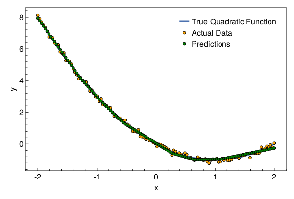

<a id='Fitting-a-Polynomial-using-MLP'></a>

# Fitting a Polynomial using MLP


In this tutorial we will fit a MultiLayer Perceptron (MLP) on data generated from a polynomial.


<a id='Package-Imports'></a>

## Package Imports


```julia
using Lux, LuxAMDGPU, LuxCUDA, Optimisers, Random, Statistics, Zygote
using CairoMakie, MakiePublication
```


<a id='Dataset'></a>

## Dataset


Generate 128 datapoints from the polynomial $y = x^2 - 2x$.


```julia
function generate_data(rng::AbstractRNG)
    x = reshape(collect(range(-2.0f0, 2.0f0, 128)), (1, 128))
    y = evalpoly.(x, ((0, -2, 1),)) .+ randn(rng, (1, 128)) .* 0.1f0
    return (x, y)
end
```


```
generate_data (generic function with 1 method)
```


Initialize the random number generator and fetch the dataset.


```julia
rng = MersenneTwister()
Random.seed!(rng, 12345)

(x, y) = generate_data(rng)
```


```
(Float32[-2.0 -1.968504 -1.9370079 -1.9055119 -1.8740157 -1.8425196 -1.8110236 -1.7795275 -1.7480315 -1.7165354 -1.6850394 -1.6535434 -1.6220472 -1.5905511 -1.5590551 -1.527559 -1.496063 -1.464567 -1.4330709 -1.4015749 -1.3700787 -1.3385826 -1.3070866 -1.2755905 -1.2440945 -1.2125984 -1.1811024 -1.1496063 -1.1181102 -1.0866141 -1.0551181 -1.023622 -0.992126 -0.96062994 -0.92913383 -0.8976378 -0.86614174 -0.8346457 -0.8031496 -0.77165353 -0.7401575 -0.70866144 -0.6771653 -0.6456693 -0.61417323 -0.5826772 -0.5511811 -0.51968503 -0.48818898 -0.4566929 -0.42519686 -0.39370078 -0.36220473 -0.33070865 -0.2992126 -0.26771653 -0.23622048 -0.20472442 -0.17322835 -0.14173229 -0.11023622 -0.07874016 -0.047244094 -0.015748031 0.015748031 0.047244094 0.07874016 0.11023622 0.14173229 0.17322835 0.20472442 0.23622048 0.26771653 0.2992126 0.33070865 0.36220473 0.39370078 0.42519686 0.4566929 0.48818898 0.51968503 0.5511811 0.5826772 0.61417323 0.6456693 0.6771653 0.70866144 0.7401575 0.77165353 0.8031496 0.8346457 0.86614174 0.8976378 0.92913383 0.96062994 0.992126 1.023622 1.0551181 1.0866141 1.1181102 1.1496063 1.1811024 1.2125984 1.2440945 1.2755905 1.3070866 1.3385826 1.3700787 1.4015749 1.4330709 1.464567 1.496063 1.527559 1.5590551 1.5905511 1.6220472 1.6535434 1.6850394 1.7165354 1.7480315 1.7795275 1.8110236 1.8425196 1.8740157 1.9055119 1.9370079 1.968504 2.0], [8.11723579535073 7.8972862806322315 7.667572185253954 7.493641443881164 7.328542256257643 7.1081451188446065 6.754145700236098 6.73844851250885 6.698323804024227 6.3637494708272655 6.270117709011731 6.2419372753805 5.816280759896085 5.718319527208828 5.741347639508506 5.258118446989299 5.268165780092538 5.195746082529355 5.032704772846244 4.733409783966572 4.520239616672976 4.369386593776045 4.107888442446331 4.182845399340577 4.002249800810884 3.8969011895086174 3.910820824989613 3.646440085736948 3.3343752660206305 3.3980378243437745 3.1887817476268587 2.9930802717826603 3.018980452144523 2.690492107796345 2.8576513349182378 2.4778283273281008 2.452401424624867 2.401875695877283 2.2896425232872755 2.2812518842985035 1.9742292519472466 1.7663454774622869 1.7829663021691418 1.6248666914928798 1.635090436697959 1.4887378757184528 1.4396068206428336 1.5047223947023354 1.2439428212858357 1.1770575798169982 1.0519113712665473 0.8008025630753797 0.8011788202541421 0.7702484835053167 0.9010273188596704 0.48114290312426095 0.4605012716399809 0.42308333113261615 0.2890108900859864 0.3324716507588617 0.2126899641074972 0.2560113968739265 0.08350192481301627 0.046225582753114294 -0.16118930624459 -0.013928769802494537 -0.030805824695545894 -0.10629780224701328 -0.17643440564041185 -0.2494508100897751 -0.3322350480467481 -0.45414851684613733 -0.6965624404632386 -0.38861245182183696 -0.4708530312086873 -0.6274991143463677 -0.5617763080815885 -0.6438360803492721 -0.7565600800322707 -0.5662591600023589 -0.6591533520776037 -0.9166793344639054 -0.8520467822193756 -0.9507226194240974 -1.0248823046771698 -0.97772916365376 -0.8199294436184201 -0.9080088282844027 -0.9682665790685976 -1.031816361263047 -0.9296919748814573 -1.1145618706755287 -1.2139119971536336 -1.0157839085777947 -0.9417175810509869 -0.9783498813733602 -0.9123675448444001 -1.138088633455826 -1.1212038088290894 -0.911429094488635 -1.023486657428913 -0.9287179111905346 -1.0396518660677925 -1.0370046468920306 -0.9846375721966646 -0.833026219703481 -0.8200258902651266 -0.789500663251252 -0.9068267920931062 -0.7284236770750803 -0.7093213401368348 -0.7048862544448803 -0.6215870033126495 -0.5892481295457608 -0.8462913756395639 -0.5544688796856879 -0.5805399434794658 -0.5761396334948753 -0.5851955365208916 -0.5561461874821676 -0.1969227628706652 -0.34073487813889014 -0.2738635064414512 -0.1425063756241582 -0.18330825579933746 -0.054321035831595324 -0.21213293699653427 0.049985105882301])
```


Let's visualize the dataset


```julia
with_theme(theme_web()) do
    fig = Figure()
    ax = CairoMakie.Axis(fig[1, 1]; xlabel="x", ylabel="y")

    l = lines!(ax, x[1, :], x -> evalpoly(x, (0, -2, 1)); linewidth=3)
    s = scatter!(ax, x[1, :], y[1, :]; markersize=8, color=:orange,
        strokecolor=:black, strokewidth=1)

    axislegend(ax, [l, s], ["True Quadratic Function", "Data Points"])

    return fig
end
```


<a id='Neural-Network'></a>

## Neural Network


For this problem, you should not be using a neural network. But let's still do that!


```julia
model = Chain(Dense(1 => 16, relu), Dense(16 => 1))
```


```
Chain(
    layer_1 = Dense(1 => 16, relu),     # 32 parameters
    layer_2 = Dense(16 => 1),           # 17 parameters
)         # Total: 49 parameters,
          #        plus 0 states.
```


<a id='Optimizer'></a>

## Optimizer


We will use Adam from Optimisers.jl


```julia
opt = Adam(0.03f0)
```


```
Adam(0.03, (0.9, 0.999), 1.0e-8)
```


<a id='Loss-Function'></a>

## Loss Function


We will use the `Lux.Training` API so we need to ensure that our loss function takes 4 inputs – model, parameters, states and data. The function must return 3 values – loss, updated_state, and any computed statistics.


```julia
function loss_function(model, ps, st, data)
    y_pred, st = Lux.apply(model, data[1], ps, st)
    mse_loss = mean(abs2, y_pred .- data[2])
    return mse_loss, st, ()
end
```


```
loss_function (generic function with 1 method)
```


<a id='Training'></a>

## Training


First we will create a [`Lux.Experimental.TrainState`](../../api/Lux/contrib#Lux.Experimental.TrainState) which is essentially a convenience wrapper over parameters, states and optimizer states.


```julia
tstate = Lux.Training.TrainState(rng, model, opt)
```


```
Lux.Experimental.TrainState{Lux.Chain{NamedTuple{(:layer_1, :layer_2), Tuple{Lux.Dense{true, typeof(NNlib.relu), typeof(WeightInitializers.glorot_uniform), typeof(WeightInitializers.zeros32)}, Lux.Dense{true, typeof(identity), typeof(WeightInitializers.glorot_uniform), typeof(WeightInitializers.zeros32)}}}, Nothing}, NamedTuple{(:layer_1, :layer_2), Tuple{NamedTuple{(:weight, :bias), Tuple{CUDA.CuArray{Float32, 2, CUDA.Mem.DeviceBuffer}, CUDA.CuArray{Float32, 2, CUDA.Mem.DeviceBuffer}}}, NamedTuple{(:weight, :bias), Tuple{CUDA.CuArray{Float32, 2, CUDA.Mem.DeviceBuffer}, CUDA.CuArray{Float32, 2, CUDA.Mem.DeviceBuffer}}}}}, NamedTuple{(:layer_1, :layer_2), Tuple{NamedTuple{(), Tuple{}}, NamedTuple{(), Tuple{}}}}, NamedTuple{(:layer_1, :layer_2), Tuple{NamedTuple{(:weight, :bias), Tuple{Optimisers.Leaf{Optimisers.Adam, Tuple{CUDA.CuArray{Float32, 2, CUDA.Mem.DeviceBuffer}, CUDA.CuArray{Float32, 2, CUDA.Mem.DeviceBuffer}, Tuple{Float64, Float64}}}, Optimisers.Leaf{Optimisers.Adam, Tuple{CUDA.CuArray{Float32, 2, CUDA.Mem.DeviceBuffer}, CUDA.CuArray{Float32, 2, CUDA.Mem.DeviceBuffer}, Tuple{Float64, Float64}}}}}, NamedTuple{(:weight, :bias), Tuple{Optimisers.Leaf{Optimisers.Adam, Tuple{CUDA.CuArray{Float32, 2, CUDA.Mem.DeviceBuffer}, CUDA.CuArray{Float32, 2, CUDA.Mem.DeviceBuffer}, Tuple{Float64, Float64}}}, Optimisers.Leaf{Optimisers.Adam, Tuple{CUDA.CuArray{Float32, 2, CUDA.Mem.DeviceBuffer}, CUDA.CuArray{Float32, 2, CUDA.Mem.DeviceBuffer}, Tuple{Float64, Float64}}}}}}}}(Chain(), (layer_1 = (weight = Float32[0.36222202; 0.23371002; -0.49825558; -0.18142056; -0.13757975; -0.50849473; 0.13773328; -0.035294008; 0.21778254; 0.04964345; -0.56594235; -0.45329624; -0.08787567; 0.5648949; 0.5260752; -0.07562564;;], bias = Float32[0.0; 0.0; 0.0; 0.0; 0.0; 0.0; 0.0; 0.0; 0.0; 0.0; 0.0; 0.0; 0.0; 0.0; 0.0; 0.0;;]), layer_2 = (weight = Float32[-0.14330137 -0.39328107 -0.18253882 -0.55998546 -0.5919335 -0.3069779 -0.39085856 -0.4838621 0.3979575 0.5851314 0.24242708 0.35374007 0.10175798 0.29761198 -0.34761065 -0.05758927], bias = Float32[0.0;;])), (layer_1 = NamedTuple(), layer_2 = NamedTuple()), (layer_1 = (weight = Leaf(Adam(0.03, (0.9, 0.999), 1.0e-8), (Float32[0.0; 0.0; 0.0; 0.0; 0.0; 0.0; 0.0; 0.0; 0.0; 0.0; 0.0; 0.0; 0.0; 0.0; 0.0; 0.0;;], Float32[0.0; 0.0; 0.0; 0.0; 0.0; 0.0; 0.0; 0.0; 0.0; 0.0; 0.0; 0.0; 0.0; 0.0; 0.0; 0.0;;], (0.9, 0.999))), bias = Leaf(Adam(0.03, (0.9, 0.999), 1.0e-8), (Float32[0.0; 0.0; 0.0; 0.0; 0.0; 0.0; 0.0; 0.0; 0.0; 0.0; 0.0; 0.0; 0.0; 0.0; 0.0; 0.0;;], Float32[0.0; 0.0; 0.0; 0.0; 0.0; 0.0; 0.0; 0.0; 0.0; 0.0; 0.0; 0.0; 0.0; 0.0; 0.0; 0.0;;], (0.9, 0.999)))), layer_2 = (weight = Leaf(Adam(0.03, (0.9, 0.999), 1.0e-8), (Float32[0.0 0.0 0.0 0.0 0.0 0.0 0.0 0.0 0.0 0.0 0.0 0.0 0.0 0.0 0.0 0.0], Float32[0.0 0.0 0.0 0.0 0.0 0.0 0.0 0.0 0.0 0.0 0.0 0.0 0.0 0.0 0.0 0.0], (0.9, 0.999))), bias = Leaf(Adam(0.03, (0.9, 0.999), 1.0e-8), (Float32[0.0;;], Float32[0.0;;], (0.9, 0.999))))), 0)
```


Now we will use Zygote for our AD requirements.


```julia
vjp_rule = Lux.Training.AutoZygote()
```


```
ADTypes.AutoZygote()
```


Finally the training loop.


```julia
function main(tstate::Lux.Experimental.TrainState, vjp, data, epochs)
    data = data .|> gpu_device()
    for epoch in 1:epochs
        grads, loss, stats, tstate = Lux.Training.compute_gradients(vjp,
            loss_function, data, tstate)
        println("Epoch: $(epoch) || Loss: $(loss)")
        tstate = Lux.Training.apply_gradients(tstate, grads)
    end
    return tstate
end

dev_cpu = cpu_device()
dev_gpu = gpu_device()

tstate = main(tstate, vjp_rule, (x, y), 250)
y_pred = dev_cpu(Lux.apply(tstate.model, dev_gpu(x), tstate.parameters, tstate.states)[1])
```


```
1×128 Matrix{Float32}:
 7.93183  7.76661  7.60139  7.43616  7.27094  7.10571  6.94049  6.77526  6.61004  6.44482  6.27959  6.11437  5.94914  5.78392  5.6187  5.45347  5.28825  5.12302  4.9578  4.79257  4.62735  4.46213  4.29696  4.14682  4.01403  3.88123  3.74844  3.61565  3.48286  3.35007  3.21728  3.08449  2.9517  2.82191  2.70562  2.58933  2.47304  2.35675  2.24045  2.12416  2.00787  1.89158  1.77932  1.67136  1.5634  1.45544  1.34747  1.2629  1.18945  1.116  1.04255  0.969101  0.895652  0.822202  0.748752  0.675302  0.601853  0.528403  0.454953  0.381503  0.308053  0.234603  0.161154  0.0877035  0.0142539  -0.0591958  -0.132646  -0.206096  -0.279545  -0.352995  -0.426445  -0.499895  -0.570313  -0.604513  -0.638713  -0.672913  -0.707113  -0.741312  -0.775512  -0.809712  -0.843912  -0.878111  -0.912311  -0.946511  -0.980711  -0.986985  -0.984269  -0.981552  -0.978835  -0.976118  -0.973402  -0.970685  -0.967969  -0.965252  -0.962535  -0.959818  -0.957102  -0.954385  -0.951669  -0.938958  -0.914585  -0.890213  -0.86584  -0.841468  -0.817096  -0.792723  -0.768351  -0.743978  -0.719606  -0.695234  -0.670861  -0.646489  -0.622117  -0.597744  -0.573372  -0.548999  -0.524627  -0.500255  -0.475882  -0.45151  -0.427137  -0.402765  -0.378393  -0.35402  -0.329648  -0.305276  -0.280903  -0.256531
```


Let's plot the results


```julia
with_theme(theme_web()) do
    fig = Figure()
    ax = CairoMakie.Axis(fig[1, 1]; xlabel="x", ylabel="y")

    l = lines!(ax, x[1, :], x -> evalpoly(x, (0, -2, 1)); linewidth=3)
    s1 = scatter!(ax, x[1, :], y[1, :]; markersize=8, color=:orange,
        strokecolor=:black, strokewidth=1)
    s2 = scatter!(ax, x[1, :], y_pred[1, :]; markersize=8, color=:green,
        strokecolor=:black, strokewidth=1)

    axislegend(ax, [l, s1, s2], ["True Quadratic Function", "Actual Data", "Predictions"])

    return fig
end
```





---


*This page was generated using [Literate.jl](https://github.com/fredrikekre/Literate.jl).*

