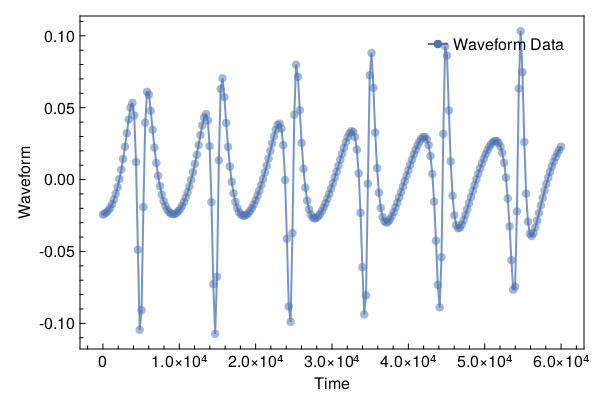
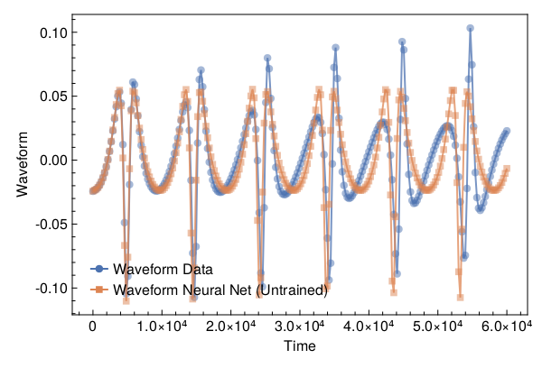
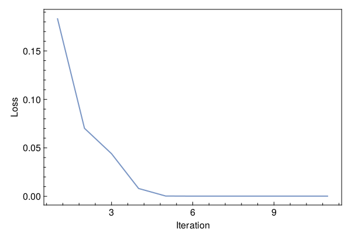
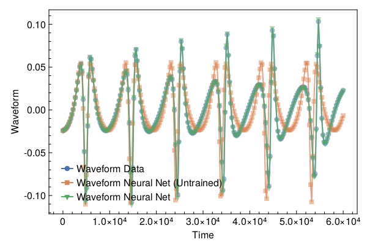

<a id='Training-a-Neural-ODE-to-Model-Gravitational-Waveforms'></a>

# Training a Neural ODE to Model Gravitational Waveforms


This code is adapted from [Astroinformatics/ScientificMachineLearning](https://github.com/Astroinformatics/ScientificMachineLearning/blob/c93aac3a460d70b4cce98836b677fd9b732e94b7/neuralode_gw.ipynb)


The code has been minimally adapted from [Keith et. al. 2021](https://arxiv.org/abs/2102.12695) which originally used Flux.jl


<a id='Package-Imports'></a>

## Package Imports


```julia
using Lux, ComponentArrays, LineSearches, LuxAMDGPU, LuxCUDA, OrdinaryDiffEq,
    Optimization, OptimizationOptimJL, Random, SciMLSensitivity
using CairoMakie, MakiePublication
CUDA.allowscalar(false)
```


<a id='Define-some-Utility-Functions'></a>

## Define some Utility Functions


::: tip


This section can be skipped. It defines functions to simulate the model, however, from a scientific machine learning perspective, isn't super relevant.


:::


We need a very crude 2-body path. Assume the 1-body motion is a newtonian 2-body position vector $r = r_1 - r_2$ and use Newtonian formulas to get $r_1$, $r_2$ (e.g. Theoretical Mechanics of Particles and Continua 4.3)


```julia
function one2two(path, m₁, m₂)
    M = m₁ + m₂
    r₁ = m₂ / M .* path
    r₂ = -m₁ / M .* path
    return r₁, r₂
end
```


```
one2two (generic function with 1 method)
```


Next we define a function to perform the change of variables: $(\chi(t),\phi(t)) \mapsto (x(t),y(t))$


```julia
@views function soln2orbit(soln, model_params=nothing)
    @assert size(soln, 1) ∈ [2, 4] "size(soln,1) must be either 2 or 4"

    if size(soln, 1) == 2
        χ = soln[1, :]
        ϕ = soln[2, :]

        @assert length(model_params)==3 "model_params must have length 3 when size(soln,2) = 2"
        p, M, e = model_params
    else
        χ = soln[1, :]
        ϕ = soln[2, :]
        p = soln[3, :]
        e = soln[4, :]
    end

    r = p ./ (1 .+ e .* cos.(χ))
    x = r .* cos.(ϕ)
    y = r .* sin.(ϕ)

    orbit = vcat(x', y')
    return orbit
end
```


```
soln2orbit (generic function with 2 methods)
```


This function uses second-order one-sided difference stencils at the endpoints; see https://doi.org/10.1090/S0025-5718-1988-0935077-0


```julia
function d_dt(v::AbstractVector, dt)
    a = -3 / 2 * v[1] + 2 * v[2] - 1 / 2 * v[3]
    b = (v[3:end] .- v[1:(end - 2)]) / 2
    c = 3 / 2 * v[end] - 2 * v[end - 1] + 1 / 2 * v[end - 2]
    return [a; b; c] / dt
end
```


```
d_dt (generic function with 1 method)
```


This function uses second-order one-sided difference stencils at the endpoints; see https://doi.org/10.1090/S0025-5718-1988-0935077-0


```julia
function d2_dt2(v::AbstractVector, dt)
    a = 2 * v[1] - 5 * v[2] + 4 * v[3] - v[4]
    b = v[1:(end - 2)] .- 2 * v[2:(end - 1)] .+ v[3:end]
    c = 2 * v[end] - 5 * v[end - 1] + 4 * v[end - 2] - v[end - 3]
    return [a; b; c] / (dt^2)
end
```


```
d2_dt2 (generic function with 1 method)
```


Now we define a function to compute the trace-free moment tensor from the orbit


```julia
function orbit2tensor(orbit, component, mass=1)
    x = orbit[1, :]
    y = orbit[2, :]

    Ixx = x .^ 2
    Iyy = y .^ 2
    Ixy = x .* y
    trace = Ixx .+ Iyy

    if component[1] == 1 && component[2] == 1
        tmp = Ixx .- trace ./ 3
    elseif component[1] == 2 && component[2] == 2
        tmp = Iyy .- trace ./ 3
    else
        tmp = Ixy
    end

    return mass .* tmp
end

function h_22_quadrupole_components(dt, orbit, component, mass=1)
    mtensor = orbit2tensor(orbit, component, mass)
    mtensor_ddot = d2_dt2(mtensor, dt)
    return 2 * mtensor_ddot
end

function h_22_quadrupole(dt, orbit, mass=1)
    h11 = h_22_quadrupole_components(dt, orbit, (1, 1), mass)
    h22 = h_22_quadrupole_components(dt, orbit, (2, 2), mass)
    h12 = h_22_quadrupole_components(dt, orbit, (1, 2), mass)
    return h11, h12, h22
end

function h_22_strain_one_body(dt::T, orbit) where {T}
    h11, h12, h22 = h_22_quadrupole(dt, orbit)

    h₊ = h11 - h22
    hₓ = T(2) * h12

    scaling_const = √(T(π) / 5)
    return scaling_const * h₊, -scaling_const * hₓ
end

function h_22_quadrupole_two_body(dt, orbit1, mass1, orbit2, mass2)
    h11_1, h12_1, h22_1 = h_22_quadrupole(dt, orbit1, mass1)
    h11_2, h12_2, h22_2 = h_22_quadrupole(dt, orbit2, mass2)
    h11 = h11_1 + h11_2
    h12 = h12_1 + h12_2
    h22 = h22_1 + h22_2
    return h11, h12, h22
end

function h_22_strain_two_body(dt::T, orbit1, mass1, orbit2, mass2) where {T}
    # compute (2,2) mode strain from orbits of BH 1 of mass1 and BH2 of mass 2

    @assert abs(mass1 + mass2 - 1.0)<1e-12 "Masses do not sum to unity"

    h11, h12, h22 = h_22_quadrupole_two_body(dt, orbit1, mass1, orbit2, mass2)

    h₊ = h11 - h22
    hₓ = T(2) * h12

    scaling_const = √(T(π) / 5)
    return scaling_const * h₊, -scaling_const * hₓ
end

function compute_waveform(dt::T, soln, mass_ratio, model_params=nothing) where {T}
    @assert mass_ratio≤1 "mass_ratio must be <= 1"
    @assert mass_ratio≥0 "mass_ratio must be non-negative"

    orbit = soln2orbit(soln, model_params)
    if mass_ratio > 0
        m₂ = inv(T(1) + mass_ratio)
        m₁ = mass_ratio * m₂

        orbit₁, orbit₂ = one2two(orbit, m₁, m₂)
        waveform = h_22_strain_two_body(dt, orbit1, mass1, orbit2, mass2)
    else
        waveform = h_22_strain_one_body(dt, orbit)
    end
    return waveform
end
```


```
compute_waveform (generic function with 2 methods)
```


<a id='Simulating-the-True-Model'></a>

## Simulating the True Model


`RelativisticOrbitModel` defines system of odes which describes motion of point like particle in schwarzschild background, uses


$$
u[1] = \chi
$$


$$
u[2] = \phi
$$


where, $p$, $M$, and $e$ are constants


```julia
function RelativisticOrbitModel(u, (p, M, e), t)
    χ, ϕ = u

    numer = (p - 2 - 2 * e * cos(χ)) * (1 + e * cos(χ))^2
    denom = sqrt((p - 2)^2 - 4 * e^2)

    χ̇ = numer * sqrt(p - 6 - 2 * e * cos(χ)) / (M * (p^2) * denom)
    ϕ̇ = numer / (M * (p^(3 / 2)) * denom)

    return [χ̇, ϕ̇]
end

mass_ratio = 0.0         # test particle
u0 = Float64[π, 0.0]     # initial conditions
datasize = 250
tspan = (0.0f0, 6.0f4)   # timespace for GW waveform
tsteps = range(tspan[1], tspan[2]; length=datasize)  # time at each timestep
dt_data = tsteps[2] - tsteps[1]
dt = 100.0
const ode_model_params = [100.0, 1.0, 0.5]; # p, M, e
```


Let's simulate the true model and plot the results using `OrdinaryDiffEq.jl`


```julia
prob = ODEProblem(RelativisticOrbitModel, u0, tspan, ode_model_params)
soln = Array(solve(prob, RK4(); saveat=tsteps, dt, adaptive=false))
waveform = first(compute_waveform(dt_data, soln, mass_ratio, ode_model_params))

fig = with_theme(theme_web()) do
    fig = Figure()
    ax = CairoMakie.Axis(fig[1, 1]; xlabel="Time", ylabel="Waveform")

    l = lines!(ax, tsteps, waveform; linewidth=2, alpha=0.75)
    s = scatter!(ax, tsteps, waveform; markershape=:circle, markeralpha=0.25, alpha=0.5)

    axislegend(ax, [[l, s]], ["Waveform Data"])

    return fig
end
```





<a id='Defiing-a-Neural-Network-Model'></a>

## Defiing a Neural Network Model


Next, we define the neural network model that takes 1 input (time) and has two outputs. We'll make a function `ODE_model` that takes the initial conditions, neural network parameters and a time as inputs and returns the derivatives.


It is typically never recommended to use globals but incase you do use them, make sure to mark them as `const`.


We will deviate from the standard Neural Network initialization and use `WeightInitializers.jl`,


```julia
const nn = Chain(Base.Fix1(broadcast, cos),
    Dense(1 => 32, cos; init_weight=truncated_normal(; std=1e-4)),
    Dense(32 => 32, cos; init_weight=truncated_normal(; std=1e-4)),
    Dense(32 => 2; init_weight=truncated_normal(; std=1e-4)))
ps, st = Lux.setup(MersenneTwister(), nn)
```


```
((layer_1 = NamedTuple(), layer_2 = (weight = Float32[-0.00012522886; 3.4424014f-5; 2.34628f-5; 0.00013306939; 0.00011900872; 5.990061f-5; 4.9680766f-5; -0.000103007624; -4.4054614f-5; 3.6348287f-5; 2.6681223f-6; -0.00019152813; -9.554343f-6; -4.296196f-5; 5.1307243f-6; 9.619735f-5; -4.660895f-5; 0.00027376413; -0.000100601166; -0.0002159812; -8.572299f-5; 2.5574939f-6; 5.1946026f-5; 8.3449784f-5; 0.00014843358; 8.764469f-5; 5.21415f-5; -3.869211f-5; -2.5611282f-5; -0.00010131182; -9.924922f-6; 0.00010179625;;], bias = Float32[0.0; 0.0; 0.0; 0.0; 0.0; 0.0; 0.0; 0.0; 0.0; 0.0; 0.0; 0.0; 0.0; 0.0; 0.0; 0.0; 0.0; 0.0; 0.0; 0.0; 0.0; 0.0; 0.0; 0.0; 0.0; 0.0; 0.0; 0.0; 0.0; 0.0; 0.0; 0.0;;]), layer_3 = (weight = Float32[-0.00019290933 -6.724886f-5 0.00010443798 5.314065f-5 5.8727932f-5 -6.463678f-6 -9.604686f-5 7.775721f-6 3.3176115f-5 -7.206508f-5 0.00011213989 1.8273071f-5 -5.683118f-5 0.00013147318 5.5727138f-5 -6.7858773f-6 -9.9136145f-5 0.00012280961 6.6734488f-6 0.00013181775 -9.1936774f-5 -7.48949f-5 -7.117854f-6 1.4220713f-5 8.838275f-5 -6.606426f-5 -3.4913708f-5 1.3950699f-5 -6.166547f-5 -5.0169252f-5 1.9809036f-6 -3.915952f-5; 1.973538f-5 -9.2623086f-5 -9.154039f-5 -0.00010086381 0.000121746954 -0.00023432067 -3.1302305f-5 -1.381469f-5 0.00018288575 -0.00010898532 -6.845657f-5 -0.00013478208 4.386438f-5 -0.00010473549 -0.00012520982 -8.483191f-5 -0.00014280759 0.00019204055 4.4119126f-5 -4.0018287f-5 -0.00015091633 -1.8203738f-5 7.7313314f-5 -0.00015594908 -1.1050876f-5 2.1023297f-5 -0.00016399029 0.00014627542 2.3080627f-5 7.022654f-5 -1.5400818f-5 -3.4099343f-5; -9.0193855f-5 -5.9591202f-5 4.0988638f-5 9.252778f-5 -3.000501f-5 0.000101386286 -3.8132974f-5 -2.8667226f-5 0.00014635359 -5.25694f-5 -6.128848f-5 0.00022656778 1.6899676f-5 8.97389f-5 -0.000111458794 4.9702845f-5 9.034318f-5 -3.0196485f-5 -0.00013177282 3.2118904f-5 4.0186274f-6 0.00015472427 0.00021633907 1.3989202f-5 0.00010198998 -6.900483f-5 4.8566508f-5 -4.1520238f-7 -0.00012974162 4.81062f-5 -3.3400232f-5 3.0719133f-5; 7.4943484f-5 0.00020006207 4.0610015f-5 -1.0674367f-5 3.496853f-5 -6.09062f-5 -1.7183425f-5 -9.1950504f-5 -8.263302f-5 -5.6070785f-5 -0.00012130112 -2.6018339f-5 1.3801477f-5 0.00015176025 -1.4203327f-5 0.00010584889 0.0001414466 -0.00010693349 1.9616717f-5 9.628149f-5 6.5035325f-5 6.0869993f-6 4.717233f-5 -7.284773f-5 -4.0153966f-5 -0.00013516228 -0.0002659277 -2.0579077f-5 0.000107896965 7.546003f-5 8.017513f-5 -0.00016392086; 8.0744525f-5 6.618422f-5 -0.00017603407 6.551742f-5 -5.702289f-5 3.3914577f-5 7.931343f-5 9.271182f-5 0.00014286312 0.00012488473 -8.2804676f-5 -0.00015550353 7.893898f-5 -4.2065087f-5 4.2103155f-5 9.140155f-5 -9.3216666f-5 -0.00010577473 0.000121507415 8.0420396f-5 2.6569276f-5 0.00012475403 0.00011871077 -8.3889645f-5 -3.6254165f-5 -4.6127143f-6 -1.8261464f-5 3.9682876f-5 -3.554247f-5 -2.756258f-5 -9.8085075f-5 3.0603565f-5; -0.00017311217 -8.3554245f-5 3.96728f-6 -7.7422555f-8 6.440299f-5 3.0959322f-6 0.000114426126 -0.00016720456 -1.8526414f-5 -0.00020867311 -1.5940395f-5 5.2507552f-5 0.00018965304 -4.8221602f-5 -2.4677998f-5 -4.636566f-5 -9.616617f-5 9.177584f-7 9.333656f-5 -3.5916146f-5 -6.341044f-5 5.92658f-5 -6.1442544f-5 3.8138438f-5 5.982244f-8 4.9167902f-5 -5.2762625f-5 -0.00011425653 5.7305006f-5 -2.6412336f-5 -0.00011622572 6.6356166f-5; -0.00013302638 2.6376074f-5 0.00014403333 5.4169184f-5 9.6198826f-5 8.08394f-5 9.686654f-5 2.3327489f-6 -0.00016104756 -2.4379697f-5 -8.3077626f-5 8.4674604f-5 -0.0001418069 -9.1751215f-5 4.1371855f-5 -0.00031134824 3.656587f-6 -5.7970046f-5 -0.00021566152 3.4918947f-5 4.371615f-5 -0.00017610403 8.117596f-6 -4.3802174f-5 -2.94446f-5 6.786796f-5 -1.7123202f-5 -7.1236434f-5 -0.00013036365 2.3145845f-5 4.0044415f-5 -6.3873624f-5; -0.00010406007 5.8364247f-5 -7.9994155f-5 3.0439676f-5 0.00010958553 0.00014848332 -5.8468515f-5 0.00011465594 0.000105404564 0.00015442645 -0.00021161026 0.0001773107 3.3049696f-6 5.6604604f-5 6.779586f-5 0.00010151326 -0.00010756166 4.339408f-5 -2.7986345f-5 2.7848773f-5 6.6478926f-5 9.022667f-5 -1.7837167f-5 -2.262101f-5 0.00012436147 -0.0001320926 0.00012515154 0.00013536599 7.6154596f-5 -0.00010282286 -0.00020862886 -0.0001243818; 3.3884826f-5 -0.00010533585 -2.6015186f-5 6.3539974f-6 -0.00014160384 5.1949995f-5 3.5422818f-5 0.00012251991 -0.00013410184 -1.7476053f-5 -7.090066f-5 -9.1543116f-5 2.4315059f-5 2.5528107f-5 -5.9005062f-5 7.7444405f-5 -4.6842374f-6 -9.849893f-5 -5.7765712f-5 2.866461f-5 -7.012999f-5 5.762119f-5 -2.8234408f-5 0.00013987019 2.3808489f-5 8.230932f-5 -6.407566f-5 2.4005887f-5 0.00011822866 7.491013f-5 3.6735114f-6 7.631099f-5; 4.5059758f-5 -0.00014346387 9.825799f-5 3.000398f-5 -2.163757f-6 -4.9919785f-5 3.1730073f-5 -0.000117133146 9.346977f-5 4.4398592f-5 -9.2542905f-5 3.1495056f-6 0.0001298913 3.938688f-5 -8.31373f-5 0.000101371 -0.00014228236 -9.842203f-5 9.1323396f-5 0.000104428545 1.7792327f-5 5.6757974f-5 4.567354f-5 -3.0424027f-5 -0.00013003536 2.9105382f-5 3.051048f-5 -7.7709774f-5 -5.6193494f-5 0.00013154335 7.1644325f-5 -6.48146f-5; -0.00013907063 0.00024867716 -3.2105407f-5 -0.000103841674 0.00014561508 -8.425872f-5 3.2276606f-5 -9.2366245f-5 -4.528322f-5 9.30108f-6 5.728599f-5 -6.369747f-5 2.4889192f-5 -6.5268825f-5 0.00012297671 -1.3192994f-6 0.000102800404 -7.029045f-5 -4.9533623f-6 0.0001375332 -9.317284f-5 -0.00015792986 7.2692514f-5 -3.2958535f-5 0.00014893718 -2.7584589f-5 6.673277f-5 -7.6158474f-5 -9.414884f-5 5.2305128f-5 -0.00018586368 -0.00015407943; 0.00020146325 -8.8283654f-5 -3.488684f-5 0.0001297342 7.420014f-5 5.010159f-5 3.399466f-5 1.6411352f-5 -2.2167567f-5 -5.274621f-5 9.548308f-5 -2.0080162f-5 2.800754f-5 9.28141f-5 5.329402f-5 0.00013775312 1.1216365f-5 0.00013041274 -0.00010747202 2.8082815f-5 -7.741694f-5 -2.5816333f-5 -7.556097f-5 -9.822599f-5 2.774833f-5 -3.953585f-5 -0.0002728382 8.020658f-5 -2.3149374f-5 9.82346f-6 -4.9633105f-5 -8.2108985f-5; 6.6729995f-6 -9.06779f-5 4.415638f-5 -8.7129505f-5 3.1483647f-5 -7.1166555f-6 9.143345f-5 5.8573705f-6 -9.298971f-5 -0.00013525605 -5.1649113f-5 -5.085213f-5 -0.00010977032 -6.2261344f-5 -4.075095f-5 -9.5815885f-5 0.00018096463 -9.324925f-5 -9.1082846f-5 0.0001014914 -3.2729447f-5 -1.4284949f-5 1.1454822f-5 0.00013163176 3.403544f-5 0.00015723536 -4.883909f-5 -4.75676f-5 8.41037f-5 2.2557542f-6 0.00012040846 3.838426f-5; -7.5533794f-6 -5.4072978f-5 -2.752332f-5 0.00012308301 8.47339f-6 -5.1729337f-5 -4.5384353f-5 3.555148f-5 9.038966f-5 9.235989f-6 2.9267589f-5 5.874618f-5 -0.00030221822 0.00012222037 0.00023596887 -5.0906954f-5 5.753006f-5 7.218984f-5 2.6148895f-5 8.671454f-5 4.7663987f-5 0.00014121257 3.423749f-5 -0.00014407432 0.00011485185 -5.3528056f-5 -6.118208f-5 -4.052959f-6 -3.9288636f-5 -4.0484563f-5 -3.097632f-5 3.1504936f-5; 0.00014823498 4.121992f-5 -0.00012820182 -0.00010171897 7.605604f-5 9.5164905f-6 -5.302062f-5 0.00012538926 7.571511f-5 7.751791f-5 0.00012172952 0.0001334739 1.699768f-5 9.34552f-5 0.00014629781 -0.00016150025 -0.00011049605 8.743613f-5 3.82655f-5 5.302427f-5 7.219775f-5 8.396308f-5 9.412115f-5 -0.00017246997 -6.190612f-5 0.00012288416 -2.6686643f-5 3.7716313f-7 1.2758963f-5 -0.00014646258 -8.659414f-5 -8.233691f-5; 0.00013896736 3.9112325f-5 7.708527f-5 0.00022702581 -2.3811401f-6 9.32506f-6 0.00011435226 0.00012460939 -4.5086945f-5 -0.00013568143 -0.00010263076 -9.7822005f-5 4.6439436f-6 5.674372f-6 -3.623288f-5 -3.6960402f-5 0.0002981168 -6.933236f-5 5.9193084f-5 2.0411362f-5 9.2337774f-5 1.1191438f-5 -0.00011065476 0.00017472991 -9.168573f-5 0.000102136866 7.406669f-5 4.5279547f-5 2.3259938f-6 -5.68362f-5 9.16508f-6 -5.3029562f-5; -1.2336414f-5 0.00013460222 0.00019431433 2.066955f-5 -6.0037945f-7 1.2185759f-5 -6.677735f-5 7.210696f-5 0.00018412893 -0.0002286294 2.7087106f-5 -9.2190414f-5 -0.00019736348 0.000111621324 9.646077f-5 -0.00012655123 3.8510283f-5 -5.6259396f-5 3.4203207f-5 -0.00011344363 -5.743027f-5 -9.82439f-6 -6.548921f-5 -5.5057695f-5 3.773243f-5 1.4110064f-5 8.673987f-5 -9.633195f-5 -0.00014496471 -0.0001351453 -4.1031475f-5 2.133494f-5; -0.00016182037 4.439193f-5 -2.083439f-5 -0.00019432676 -2.5004603f-5 -0.00015980983 -0.00023154965 -5.309227f-5 -0.0001093239 -0.00010206722 0.00011473 -0.00028970998 -0.00012423188 -0.00019508452 9.6437645f-5 -2.5684994f-5 -3.0451995f-6 6.224183f-5 5.391217f-7 0.000119708566 5.5147357f-5 7.733286f-5 -2.679268f-5 2.5185773f-5 -0.00015378866 0.00012576232 -3.6518355f-5 -0.00015285784 -1.6368589f-5 0.0001903818 4.0422365f-5 0.000108356915; -4.238778f-5 -3.9485807f-5 -0.00026106776 -5.821147f-5 -2.2700753f-5 0.0001082976 -3.7929406f-6 6.252021f-5 3.4589564f-5 -0.00011584382 4.8211834f-5 -0.0002049284 -8.134721f-5 -1.9657233f-5 -1.9923042f-5 -7.899245f-5 3.6698726f-5 4.0270144f-5 -8.172306f-5 -4.913132f-5 1.3846005f-5 0.00012179549 0.00012255105 -1.7310525f-6 -1.3377676f-6 -5.8312846f-5 -0.00012536453 6.4639695f-5 -2.8245075f-5 0.00015034415 -0.00021704308 -1.2986474f-5; 7.35228f-5 1.7689057f-5 0.000102985076 -8.016133f-5 7.0457834f-5 -0.00022997617 -2.9654644f-5 4.2409356f-5 0.00011322173 -2.473527f-5 3.4975867f-5 2.5305128f-5 0.00014194768 -1.5365047f-5 8.020567f-5 1.980787f-5 -1.0749741f-5 5.5543373f-5 2.354319f-5 1.9059049f-5 4.5631554f-5 -3.6241145f-5 -0.00010298919 -9.4626404f-5 -2.8122417f-5 -3.4069355f-5 -4.716051f-5 4.1609466f-5 -2.969702f-5 0.00015975702 3.0160818f-6 -1.6572043f-5; -0.00022347679 -0.00010680559 -0.00010843413 0.00021297974 -5.6360346f-5 -0.00018116998 -7.929645f-5 -0.00017193572 -0.000111396694 -0.00016113308 7.4231306f-5 -0.00020425869 1.7642285f-5 5.9635673f-5 -0.00014468678 0.0001060051 8.750069f-6 8.990848f-5 9.222484f-5 5.1362676f-5 -4.6296365f-5 -5.0618582f-5 1.0159414f-5 -3.3005486f-5 -0.00015238152 1.6599823f-5 -0.0001179761 4.3388005f-5 -0.00014549364 0.00019591105 -0.00011498278 1.5305242f-5; -0.00012154262 6.912294f-5 0.000100923506 -2.5550428f-6 -1.3659795f-5 0.000110065055 2.6137051f-5 -0.00010394537 -3.924742f-5 -6.943005f-6 0.00013365442 4.4425142f-5 -1.9542274f-5 -2.3456996f-5 1.811312f-5 1.6905042f-5 -0.0001354337 -5.614577f-5 0.00013555837 -0.00014938929 -6.576699f-5 0.00011356489 -3.107107f-5 5.2214873f-5 0.00014161435 -3.7187228f-6 -0.0001050512 -9.40391f-5 -6.141689f-5 0.00015234346 6.8010922f-6 0.00011591159; -0.00014410098 -1.9561707f-5 1.9105426f-5 0.00014813455 4.4484215f-5 6.675211f-5 -8.215064f-5 -0.00016879286 -0.00017931769 -5.015807f-5 8.583951f-5 0.00018652955 6.633122f-5 0.00018560393 3.2331383f-5 -7.922282f-5 -0.0001305453 9.3607036f-5 5.558703f-5 8.8715366f-5 0.0002750854 3.856664f-5 -6.204092f-5 -0.0001413159 -5.5095355f-5 -0.00010020277 -7.078756f-5 6.6006556f-5 -2.145607f-5 0.00015341312 1.4030944f-6 -0.00014023884; -0.000101263264 -6.1598235f-5 -5.0474722f-5 0.00010957638 0.00017385201 -0.00010225797 6.188057f-5 -3.1655002f-6 -0.00010634807 -0.00013431246 -0.00014253137 -6.200977f-5 -0.00014953822 5.3892738f-5 -4.8036938f-5 -0.00010693661 0.00016818645 2.1235871f-6 -5.4096912f-5 -2.742315f-6 -0.00010535063 -0.0001364312 7.701479f-5 -5.1963263f-5 -5.210046f-6 9.085678f-5 5.5190256f-5 2.9894067f-5 8.410608f-5 0.00011395046 1.0754099f-5 8.284485f-5; -5.653128f-5 -0.0001034186 7.3557335f-6 3.1378288f-5 7.2996454f-6 -0.00010758175 1.6548323f-5 0.00011196148 0.00011437582 -8.399701f-5 -0.00013402617 0.0001607511 -9.028891f-5 -4.0166113f-5 5.1307623f-5 7.326209f-5 -2.3073753f-5 4.4434608f-5 -2.626543f-6 -0.00014232143 0.00014906522 -0.00013058512 -2.7767523f-5 1.5970449f-5 -3.0967698f-5 -0.00020193869 1.6240923f-5 -2.510836f-5 -4.0822684f-5 8.75529f-5 7.347375f-5 -2.759545f-7; -5.1560222f-5 8.073878f-5 -6.7662244f-5 0.00015552566 -0.0001884899 2.1867454f-5 4.3758206f-5 -8.121184f-5 6.835889f-5 2.3854385f-5 2.2664053f-5 0.00012708451 -2.0215404f-5 -2.8487002f-5 0.00025207386 5.5920907f-5 -0.00013778446 9.154666f-5 0.00013991597 9.6376345f-5 9.318548f-5 -5.0271996f-5 -0.00019270554 2.4273602f-5 7.071621f-5 -6.3704356f-6 4.954917f-5 -7.937324f-5 -0.00017590125 0.00010516946 -0.00013384687 -2.773153f-5; 0.000114078095 -0.00013823931 -0.00011614432 0.00016295433 -1.9204722f-6 7.5152325f-6 -5.568603f-5 3.581806f-5 -0.00017894071 9.557216f-5 -5.3851832f-5 -1.9153693f-5 6.671552f-5 -6.24252f-5 -5.4914664f-5 -2.3409359f-5 4.721475f-5 8.085888f-5 0.0001786819 -1.2164296f-5 1.3119529f-5 -8.581001f-5 -3.5119294f-5 0.00014246562 3.248743f-5 -5.8175792f-5 6.659328f-5 0.00013754606 -2.5834963f-5 3.5223036f-6 -0.00013461213 -4.6597426f-5; 2.819924f-5 9.563403f-5 8.894484f-5 -6.917485f-6 -9.488444f-5 1.0621026f-5 -5.7427555f-5 -7.767009f-5 -3.061753f-5 -0.00032352837 -5.2248914f-5 5.170939f-5 -0.00014618628 0.00010541675 -1.2010482f-5 3.928231f-5 1.5020808f-5 5.757269f-7 -0.0001896112 -4.150457f-5 4.205255f-5 -5.317159f-5 1.0936488f-5 6.732583f-5 -9.8868586f-5 3.588985f-5 0.00015452172 -0.00020131953 1.914517f-5 -0.00011918337 -0.0002461162 -4.6426823f-5; -5.2277584f-5 0.00019912081 4.577107f-5 -0.0001324347 1.00430025f-5 8.864413f-5 -3.3980003f-5 -0.00013637409 0.00013167299 1.2329308f-5 3.1431464f-5 2.8922064f-5 -7.574956f-6 -2.883689f-5 7.0876806f-5 -3.0273837f-5 2.0450143f-5 1.240335f-5 -2.1472093f-5 -4.1563788f-5 1.1556732f-5 2.584905f-5 -5.7276415f-5 5.6096487f-5 0.00026804596 -8.555574f-5 -1.3153467f-5 8.697556f-5 3.5391065f-5 9.90201f-6 2.8991459f-5 3.5740607f-6; 4.0145544f-5 -9.4345865f-5 8.6041866f-5 0.00019114904 -5.0598035f-5 0.00011888584 1.0918362f-5 1.887964f-5 -7.7448116f-5 -2.9390838f-5 5.268155f-6 6.471959f-5 0.00016754032 0.00016324336 -0.00032693654 7.1254304f-5 -8.459825f-5 3.4243985f-5 0.00013574192 0.00020857804 -4.0743744f-5 -8.1319675f-5 4.3343654f-5 4.074842f-5 3.1744526f-5 -2.280716f-5 6.691275f-5 2.0289703f-5 5.4097465f-5 -4.4725362f-5 -1.3526976f-5 1.5730282f-5; -0.00017707518 5.9117443f-5 0.00016804894 -6.327364f-5 -7.205121f-5 5.051379f-5 -3.4329485f-5 3.8943355f-5 0.00018153561 -1.5921027f-5 -9.8899625f-5 -9.2632356f-5 -4.995316f-5 7.8017525f-5 -0.00018536125 -4.2603042f-5 -0.000107868196 -2.5054582f-5 1.8047027f-5 5.483005f-5 0.00015905917 -1.3823831f-5 0.00012232368 -9.997757f-5 6.1219376f-5 1.9878787f-5 -5.932932f-5 -7.182416f-5 -9.23575f-5 0.00013668773 -3.0008574f-5 -9.864771f-5; -2.070435f-5 -3.77538f-5 0.00015172311 0.00012930261 8.061647f-5 -1.3380366f-6 0.0001311723 -3.1951872f-6 3.2243144f-5 -3.1848973f-5 -2.4428306f-5 -0.00010599635 -0.00024147972 -1.4938885f-5 7.185657f-5 -2.2290818f-5 5.4351392f-5 5.2915348f-5 7.654491f-6 -9.45313f-5 -6.444649f-5 -0.000105532345 6.254964f-5 9.206156f-5 -0.00010706183 -1.647853f-5 -1.38603955f-5 7.8728635f-6 5.229081f-5 2.9776098f-5 4.7225374f-5 3.8879054f-5], bias = Float32[0.0; 0.0; 0.0; 0.0; 0.0; 0.0; 0.0; 0.0; 0.0; 0.0; 0.0; 0.0; 0.0; 0.0; 0.0; 0.0; 0.0; 0.0; 0.0; 0.0; 0.0; 0.0; 0.0; 0.0; 0.0; 0.0; 0.0; 0.0; 0.0; 0.0; 0.0; 0.0;;]), layer_4 = (weight = Float32[3.33893f-5 6.940207f-5 1.0488304f-5 0.00019689152 0.00013976336 0.00022625178 -3.194641f-5 4.0917537f-5 3.9705377f-5 -6.263426f-5 3.2621305f-5 -9.787351f-5 4.6178753f-5 -7.4160635f-5 8.552023f-6 -9.05347f-5 0.00010377443 -3.7662587f-5 -0.0001310402 3.251178f-5 8.0789825f-5 0.00015902593 -5.674074f-5 0.00019150999 -5.9318914f-5 -0.0001050636 5.1688075f-5 -0.00020506227 6.5329776f-5 -6.905493f-5 7.88793f-5 -5.1908584f-5; -0.00016414344 0.00013265191 0.00017426601 -4.9070914f-5 -5.203308f-5 -0.00012040711 -7.000482f-5 -3.8727343f-5 1.907965f-5 -0.000101999685 3.9820234f-6 -1.7704113f-5 -9.5233645f-6 -0.00015263524 0.00012321964 -5.7448135f-5 1.8006209f-5 -5.8619178f-5 0.00013430804 7.7288016f-5 5.3470547f-5 -0.00011140592 -4.5023873f-5 0.00020918327 7.619366f-5 -0.00010614766 -9.988699f-5 0.00011601637 -0.0002327616 1.584114f-5 4.9029426f-5 -3.6491492f-5], bias = Float32[0.0; 0.0;;])), (layer_1 = NamedTuple(), layer_2 = NamedTuple(), layer_3 = NamedTuple(), layer_4 = NamedTuple()))
```


Similar to most DL frameworks, Lux defaults to using `Float32`, however, in this case we need Float64


```julia
const params = ComponentArray{Float64}(ps)
```


```
ComponentVector{Float64}(layer_1 = Float64[], layer_2 = (weight = [-0.00012522886390797794; 3.442401430220343e-5; 2.3462800527340733e-5; 0.0001330693921772763; 0.00011900872050318867; 5.9900608903262764e-5; 4.968076609657146e-5; -0.00010300762369297445; -4.405461368151009e-5; 3.634828681242652e-5; 2.668122306204168e-6; -0.00019152813183609396; -9.554342796036508e-6; -4.296196129871532e-5; 5.130724275659304e-6; 9.61973491939716e-5; -4.66089513793122e-5; 0.00027376413345336914; -0.00010060116619570181; -0.00021598119928967208; -8.572298975195736e-5; 2.557493871790939e-6; 5.194602636038326e-5; 8.344978414243087e-5; 0.00014843358076177537; 8.764468657318503e-5; 5.21414985996671e-5; -3.8692109228577465e-5; -2.5611281671444885e-5; -0.00010131182352779433; -9.924921869242098e-6; 0.00010179624950978905;;], bias = [0.0; 0.0; 0.0; 0.0; 0.0; 0.0; 0.0; 0.0; 0.0; 0.0; 0.0; 0.0; 0.0; 0.0; 0.0; 0.0; 0.0; 0.0; 0.0; 0.0; 0.0; 0.0; 0.0; 0.0; 0.0; 0.0; 0.0; 0.0; 0.0; 0.0; 0.0; 0.0;;]), layer_3 = (weight = [-0.0001929093268699944 -6.724886043230072e-5 0.00010443798237247393 5.3140651289140806e-5 5.87279319006484e-5 -6.463677891588304e-6 -9.604686056263745e-5 7.775721314828843e-6 3.317611481179483e-5 -7.206507871160284e-5 0.00011213988909730688 1.8273070963914506e-5 -5.683118070010096e-5 0.00013147317804396152 5.5727137805661187e-5 -6.785877303627785e-6 -9.913614485412836e-5 0.00012280960800126195 6.673448751826072e-6 0.00013181775284465402 -9.193677396979183e-5 -7.489490235457197e-5 -7.117853783711325e-6 1.422071272827452e-5 8.838275243761018e-5 -6.606426177313551e-5 -3.491370807751082e-5 1.3950699212728068e-5 -6.166547245811671e-5 -5.016925206291489e-5 1.9809035620710347e-6 -3.9159520383691415e-5; 1.9735380192287266e-5 -9.26230859477073e-5 -9.154038707492873e-5 -0.00010086380643770099 0.00012174695439171046 -0.00023432067246176302 -3.130230470560491e-5 -1.3814689737046137e-5 0.0001828857493819669 -0.0001089853176381439 -6.845656753284857e-5 -0.00013478207984007895 4.386438013170846e-5 -0.00010473548900336027 -0.000125209815450944 -8.483191049890593e-5 -0.00014280759205576032 0.00019204054842703044 4.411912595969625e-5 -4.0018287108978257e-5 -0.00015091632667463273 -1.8203738363808952e-5 7.731331425020471e-5 -0.00015594907745253295 -1.1050876310036983e-5 2.1023297449573874e-5 -0.00016399029118474573 0.00014627541531808674 2.308062721567694e-5 7.022653880994767e-5 -1.5400817574118264e-5 -3.409934288356453e-5; -9.019385470310226e-5 -5.959120244369842e-5 4.0988637920236215e-5 9.25277781789191e-5 -3.0005010557943024e-5 0.00010138628567801788 -3.813297371380031e-5 -2.8667225706158206e-5 0.00014635358820669353 -5.2569401304936036e-5 -6.128848326625302e-5 0.00022656777582596987 1.689967575657647e-5 8.97389036254026e-5 -0.00011145879398100078 4.97028449899517e-5 9.034317918121815e-5 -3.0196484658517875e-5 -0.00013177281653042883 3.211890361853875e-5 4.018627350887982e-6 0.00015472427185159177 0.0002163390745408833 1.3989201761432923e-5 0.0001019899791572243 -6.900483276695013e-5 4.8566507757641375e-5 -4.1520237914483005e-7 -0.0001297416165471077 4.8106201575137675e-5 -3.340023249620572e-5 3.07191330648493e-5; 7.494348392356187e-5 0.00020006207341793925 4.0610015275888145e-5 -1.0674367331375834e-5 3.4968528780154884e-5 -6.090620081522502e-5 -1.71834253706038e-5 -9.19505037018098e-5 -8.263302152045071e-5 -5.607078492175788e-5 -0.00012130112008890137 -2.6018338758149184e-5 1.380147659801878e-5 0.00015176025044638664 -1.420332682755543e-5 0.00010584889241727069 0.00014144659508019686 -0.00010693349031498656 1.961671659955755e-5 9.628148836782202e-5 6.503532495116815e-5 6.086999292165274e-6 4.7172328777378425e-5 -7.28477316442877e-5 -4.015396552858874e-5 -0.0001351622777292505 -0.00026592769427224994 -2.057907659036573e-5 0.00010789696534629911 7.546003325842321e-5 8.017513027880341e-5 -0.0001639208639971912; 8.074452489381656e-5 6.618422048632056e-5 -0.00017603406740818173 6.551742262672633e-5 -5.702289126929827e-5 3.391457721590996e-5 7.931343134259805e-5 9.271182352676988e-5 0.00014286312216427177 0.0001248847256647423 -8.280467591248453e-5 -0.0001555035269120708 7.893898145994172e-5 -4.2065086745424196e-5 4.2103154555661604e-5 9.140154725173488e-5 -9.321666584583e-5 -0.00010577472858130932 0.00012150741531513631 8.042039553401992e-5 2.6569276087684557e-5 0.00012475403491407633 0.00011871077003888786 -8.388964488403872e-5 -3.6254165024729446e-5 -4.612714292306919e-6 -1.826146399253048e-5 3.968287637690082e-5 -3.55424708686769e-5 -2.756258072622586e-5 -9.808507456909865e-5 3.060356539208442e-5; -0.00017311217379756272 -8.35542450658977e-5 3.967280008509988e-6 -7.742255547782406e-8 6.440299330279231e-5 3.0959322430135217e-6 0.00011442612594692037 -0.00016720456187613308 -1.8526414351072162e-5 -0.00020867311104666442 -1.5940395314828493e-5 5.250755202723667e-5 0.00018965304479934275 -4.822160190087743e-5 -2.4677998226252384e-5 -4.6365661546587944e-5 -9.616617171559483e-5 9.177584274766559e-7 9.333655907539651e-5 -3.5916145861847326e-5 -6.341044354485348e-5 5.9265799791319296e-5 -6.144254439277574e-5 3.813843795796856e-5 5.982244033475581e-8 4.9167902034241706e-5 -5.27626252733171e-5 -0.00011425653065089136 5.730500561185181e-5 -2.6412335500936024e-5 -0.00011622571764746681 6.635616591665894e-5; -0.00013302637671586126 2.6376073947176337e-5 0.00014403332897927612 5.416918429546058e-5 9.619882621336728e-5 8.083940338110551e-5 9.68665408436209e-5 2.332748863409506e-6 -0.0001610475592315197 -2.437969669699669e-5 -8.3077626186423e-5 8.467460429528728e-5 -0.00014180690050125122 -9.175121522275731e-5 4.137185533181764e-5 -0.0003113482380285859 3.656587068689987e-6 -5.797004632768221e-5 -0.00021566152281593531 3.491894676699303e-5 4.3716150685213506e-5 -0.00017610403301659971 8.117595825751778e-6 -4.3802174332086e-5 -2.9444599931593984e-5 6.786795711377636e-5 -1.7123202269431204e-5 -7.123643445083871e-5 -0.00013036365271545947 2.3145845261751674e-5 4.004441507277079e-5 -6.387362373061478e-5; -0.00010406006913399324 5.836424679728225e-5 -7.999415538506582e-5 3.043967626581434e-5 0.00010958553320961073 0.00014848331920802593 -5.8468514907872304e-5 0.00011465593706816435 0.00010540456423768774 0.000154426452354528 -0.00021161025506444275 0.00017731070693116635 3.3049695957743097e-6 5.660460374201648e-5 6.779585964977741e-5 0.000101513258414343 -0.00010756166011560708 4.339408042142168e-5 -2.7986345230601728e-5 2.784877324302215e-5 6.647892587352544e-5 9.022666927194223e-5 -1.7837166524259374e-5 -2.2621010430157185e-5 0.00012436146789696068 -0.0001320925948675722 0.0001251515350304544 0.0001353659899905324 7.615459617227316e-5 -0.00010282285802531987 -0.00020862885867245495 -0.0001243817969225347; 3.388482582522556e-5 -0.00010533585009397939 -2.601518644951284e-5 6.353997378027998e-6 -0.0001416038430761546 5.1949995395261794e-5 3.5422817745711654e-5 0.00012251990847289562 -0.0001341018360108137 -1.7476053471909836e-5 -7.090066355885938e-5 -9.154311555903405e-5 2.4315058908541687e-5 2.5528106561978348e-5 -5.9005062212236226e-5 7.744440517853945e-5 -4.684237410401693e-6 -9.84989310381934e-5 -5.776571197202429e-5 2.8664609999395907e-5 -7.012998685240746e-5 5.7621189625933766e-5 -2.823440809152089e-5 0.00013987018610350788 2.38084885495482e-5 8.23093214421533e-5 -6.407566252164543e-5 2.40058870986104e-5 0.00011822865781141445 7.491013093385845e-5 3.6735114008479286e-6 7.631099288119003e-5; 4.5059758122079074e-5 -0.00014346386888064444 9.825798770179972e-5 3.0003979190951213e-5 -2.163757017115131e-6 -4.991978494217619e-5 3.173007280565798e-5 -0.00011713314597727731 9.346976730739698e-5 4.4398591853678226e-5 -9.2542904894799e-5 3.149505573674105e-6 0.00012989129754714668 3.938687950721942e-5 -8.313730359077454e-5 0.00010137099889107049 -0.00014228235522750765 -9.84220314421691e-5 9.132339619100094e-5 0.00010442854545544833 1.7792326616472565e-5 5.675797365256585e-5 4.567353971651755e-5 -3.0424027499975637e-5 -0.0001300353615079075 2.9105382054694928e-5 3.0510480428347364e-5 -7.770977390464395e-5 -5.619349394692108e-5 0.0001315433473791927 7.164432463468984e-5 -6.481460150098428e-5; -0.00013907063112128526 0.0002486771554686129 -3.210540671716444e-5 -0.00010384167399024591 0.0001456150785088539 -8.425871783401817e-5 3.227660636184737e-5 -9.236624464392662e-5 -4.528322097030468e-5 9.30108035390731e-6 5.728598989662714e-5 -6.36974727967754e-5 2.4889191990951076e-5 -6.526882498292252e-5 0.00012297670764382929 -1.3192993719712831e-6 0.0001028004044201225 -7.029045082163066e-5 -4.953362349624513e-6 0.00013753320672549307 -9.317284275311977e-5 -0.00015792985504958779 7.269251364050433e-5 -3.295853457530029e-5 0.00014893717889208347 -2.7584588679019362e-5 6.673276948276907e-5 -7.615847425768152e-5 -9.414883970748633e-5 5.230512761045247e-5 -0.00018586368241813034 -0.00015407943283207715; 0.00020146324823144823 -8.8283653894905e-5 -3.4886841604020447e-5 0.00012973419507034123 7.420014298986644e-5 5.0101589295081794e-5 3.399466004339047e-5 1.6411351680289954e-5 -2.2167567294673063e-5 -5.27462107129395e-5 9.548308298690245e-5 -2.008016235777177e-5 2.8007540095131844e-5 9.281410166295245e-5 5.329402119969018e-5 0.00013775311526842415 1.121636523748748e-5 0.00013041273632552475 -0.00010747202031780034 2.8082815333618782e-5 -7.741693843854591e-5 -2.5816332708927803e-5 -7.556097261840478e-5 -9.822598804021254e-5 2.7748330467147753e-5 -3.953585110139102e-5 -0.00027283819508738816 8.020657696761191e-5 -2.3149374101194553e-5 9.823459549807012e-6 -4.963310493621975e-5 -8.210898522520438e-5; 6.672999461443396e-6 -9.067790233530104e-5 4.415637886268087e-5 -8.712950511835515e-5 3.148364703520201e-5 -7.1166555244417395e-6 9.143345232587308e-5 5.857370524608996e-6 -9.298970689997077e-5 -0.0001352560502709821 -5.164911272004247e-5 -5.0852129788836464e-5 -0.00010977032070513815 -6.226134428288788e-5 -4.075095057487488e-5 -9.58158852881752e-5 0.00018096463463734835 -9.324924758402631e-5 -9.108284575631842e-5 0.00010149140143766999 -3.272944741183892e-5 -1.428494942956604e-5 1.1454822015366517e-5 0.00013163176481612027 3.4035441785817966e-5 0.00015723536489531398 -4.8839090595720336e-5 -4.756759881274775e-5 8.410370355704799e-5 2.2557542251888663e-6 0.00012040846195304766 3.838425982394256e-5; -7.5533794188231695e-6 -5.407297794590704e-5 -2.7523319658939727e-5 0.0001230830093845725 8.473390153085347e-6 -5.1729337428696454e-5 -4.5384353143163025e-5 3.555147850420326e-5 9.038965799845755e-5 9.235988727596123e-6 2.9267588615766726e-5 5.874618000234477e-5 -0.00030221822089515626 0.00012222037184983492 0.00023596886603627354 -5.0906954129459336e-5 5.753005825681612e-5 7.218983955681324e-5 2.6148894903599285e-5 8.671454270370305e-5 4.766398706124164e-5 0.00014121257117949426 3.423749149078503e-5 -0.00014407432172447443 0.00011485184950288385 -5.3528056014329195e-5 -6.11820796621032e-5 -4.052958956890507e-6 -3.928863588953391e-5 -4.0484563214704394e-5 -3.097631997661665e-5 3.150493648718111e-5; 0.00014823497622273862 4.1219918784918264e-5 -0.0001282018201891333 -0.00010171897156396881 7.605604332638904e-5 9.51649053604342e-6 -5.302061981637962e-5 0.000125389255117625 7.571510650450364e-5 7.751790690235794e-5 0.00012172952119726688 0.00013347390631679446 1.6997679267660715e-5 9.345520084025338e-5 0.0001462978107156232 -0.00016150025476235896 -0.00011049604654544964 8.743612852413207e-5 3.8265501643763855e-5 5.3024268709123135e-5 7.219774852273986e-5 8.396308112423867e-5 9.412114741280675e-5 -0.00017246996867470443 -6.190611748024821e-5 0.00012288415746297687 -2.6686642740969546e-5 3.771631327253999e-7 1.275896283914335e-5 -0.000146462582051754 -8.659414015710354e-5 -8.233691187342629e-5; 0.00013896735617890954 3.9112324884627014e-5 7.708527118666098e-5 0.00022702581190969795 -2.381140120633063e-6 9.325060091214254e-6 0.00011435226042522117 0.00012460938887670636 -4.508694473770447e-5 -0.0001356814318569377 -0.0001026307581923902 -9.782200504560024e-5 4.643943611881696e-6 5.674372005159967e-6 -3.623287921072915e-5 -3.696040221257135e-5 0.0002981167926918715 -6.93323599989526e-5 5.9193083870923147e-5 2.0411362129379995e-5 9.233777382178232e-5 1.1191437806701288e-5 -0.00011065475700888783 0.00017472991021350026 -9.168573160422966e-5 0.00010213686618953943 7.406668737530708e-5 4.527954661170952e-5 2.325993818885763e-6 -5.6836201110854745e-5 9.165079973172396e-6 -5.302956196828745e-5; -1.2336414329183754e-5 0.00013460221816785634 0.00019431432883720845 2.0669549485319294e-5 -6.003794510434091e-7 1.2185759260319173e-5 -6.677734927507117e-5 7.210695912363008e-5 0.0001841289340518415 -0.00022862940386403352 2.708710599108599e-5 -9.219041385222226e-5 -0.00019736347894649953 0.00011162132432218641 9.64607679634355e-5 -0.0001265512255486101 3.851028304779902e-5 -5.625939593301155e-5 3.4203207178507e-5 -0.00011344363156240433 -5.743026849813759e-5 -9.824389962886926e-6 -6.548920646309853e-5 -5.5057695135474205e-5 3.7732428609160706e-5 1.4110063602856826e-5 8.673987031215802e-5 -9.633194713387638e-5 -0.0001449647097615525 -0.000135145295644179 -4.103147512068972e-5 2.1334939447115175e-5; -0.00016182036779355258 4.439193071448244e-5 -2.0834389943047427e-5 -0.00019432675617281348 -2.5004603230627254e-5 -0.00015980983152985573 -0.00023154965310823172 -5.309226980898529e-5 -0.00010932389704976231 -0.00010206722072325647 0.00011472999904071912 -0.00028970997664146125 -0.00012423188309185207 -0.00019508451805450022 9.643764497013763e-5 -2.5684994398034178e-5 -3.0451994916802505e-6 6.224183016456664e-5 5.391216859607084e-7 0.00011970856576226652 5.514735676115379e-5 7.733285747235641e-5 -2.6792680728249252e-5 2.5185772756231017e-5 -0.00015378865646198392 0.00012576232256833464 -3.6518355045700446e-5 -0.00015285784320440143 -1.6368589058401994e-5 0.00019038180471397936 4.042236469103955e-5 0.00010835691500687972; -4.238777910359204e-5 -3.9485807064920664e-5 -0.0002610677620396018 -5.821146987727843e-5 -2.270075310661923e-5 0.0001082976014004089 -3.7929405607428635e-6 6.25202083028853e-5 3.458956416579895e-5 -0.00011584381718421355 4.821183392778039e-5 -0.00020492839394137263 -8.13472070149146e-5 -1.965723276953213e-5 -1.9923041691072285e-5 -7.899245247244835e-5 3.669872603495605e-5 4.0270144381793216e-5 -8.172306115739048e-5 -4.913131851935759e-5 1.3846004549122881e-5 0.00012179549230495468 0.00012255104957148433 -1.7310525208813488e-6 -1.3377675713854842e-6 -5.831284579471685e-5 -0.000125364531413652 6.463969475589693e-5 -2.8245074645383283e-5 0.00015034414536785334 -0.00021704308164771646 -1.298647384828655e-5; 7.352280226768926e-5 1.7689057131065056e-5 0.0001029850755003281 -8.01613277872093e-5 7.045783422654495e-5 -0.00022997616906650364 -2.9654644094989635e-5 4.24093559558969e-5 0.00011322172940708697 -2.4735269107623026e-5 3.497586658340879e-5 2.5305127564934082e-5 0.00014194767572917044 -1.5365047147497535e-5 8.020566747291014e-5 1.9807870557997376e-5 -1.0749740795290563e-5 5.554337258217856e-5 2.354319076403044e-5 1.9059049009229057e-5 4.563155380310491e-5 -3.6241144698578864e-5 -0.00010298918641638011 -9.462640446145087e-5 -2.812241655192338e-5 -3.4069355024257675e-5 -4.7160508984234184e-5 4.160946627962403e-5 -2.969701927213464e-5 0.00015975702262949198 3.0160817914293148e-6 -1.65720430231886e-5; -0.00022347678896039724 -0.00010680559353204444 -0.00010843412746908143 0.00021297973580658436 -5.6360346206929535e-5 -0.00018116997671313584 -7.929644925752655e-5 -0.0001719357242109254 -0.00011139669368276373 -0.0001611330808373168 7.423130591632798e-5 -0.00020425868569873273 1.764228545653168e-5 5.963567309663631e-5 -0.00014468678273260593 0.0001060050999512896 8.750069355301093e-6 8.990847709355876e-5 9.222483640769497e-5 5.13626764586661e-5 -4.629636532627046e-5 -5.06185824633576e-5 1.0159414159716107e-5 -3.300548632978462e-5 -0.0001523815153632313 1.659982262935955e-5 -0.00011797610204666853 4.3388004996813834e-5 -0.0001454936427762732 0.00019591105228755623 -0.00011498278036015108 1.5305242413887754e-5; -0.00012154261639807373 6.912294338690117e-5 0.00010092350566992536 -2.555042783569661e-6 -1.3659794603881892e-5 0.00011006505519617349 2.6137051463592798e-5 -0.00010394537093816325 -3.9247421227628365e-5 -6.943004791537533e-6 0.00013365442282520235 4.442514182301238e-5 -1.9542274458217435e-5 -2.3456996132154018e-5 1.8113119949703105e-5 1.690504177531693e-5 -0.00013543370005209 -5.614577094092965e-5 0.0001355583663098514 -0.0001493892923463136 -6.576698797289282e-5 0.00011356489267200232 -3.1071071134647354e-5 5.2214872994227335e-5 0.00014161434955894947 -3.7187228372204117e-6 -0.0001050512000801973 -9.40390964387916e-5 -6.141688936622813e-5 0.00015234346210490912 6.801092240493745e-6 0.00011591159272938967; -0.0001441009808331728 -1.9561706722015515e-5 1.910542596306186e-5 0.00014813455345574766 4.448421532288194e-5 6.675210897810757e-5 -8.215064008254558e-5 -0.00016879285976756364 -0.00017931769252754748 -5.015806891606189e-5 8.583950693719089e-5 0.00018652954895514995 6.63312166579999e-5 0.000185603930731304 3.233138340874575e-5 -7.922281656647101e-5 -0.00013054530427325517 9.360703552374616e-5 5.5587028327863663e-5 8.871536556398496e-5 0.00027508538914844394 3.856663897749968e-5 -6.204091914696619e-5 -0.0001413159043295309 -5.509535549208522e-5 -0.0001002027711365372 -7.07875587977469e-5 6.600655615329742e-5 -2.14560695894761e-5 0.00015341311518568546 1.403094415763917e-6 -0.00014023884432390332; -0.00010126326378667727 -6.159823533380404e-5 -5.047472222940996e-5 0.00010957638005493209 0.00017385200771968812 -0.0001022579672280699 6.188057159306481e-5 -3.1655001748731593e-6 -0.00010634806676534936 -0.0001343124604318291 -0.00014253136760089546 -6.200977077241987e-5 -0.0001495382166467607 5.389273792388849e-5 -4.8036938096629456e-5 -0.00010693661170080304 0.00016818645235616714 2.1235871372482507e-6 -5.40969122084789e-5 -2.742315018622321e-6 -0.0001053506275638938 -0.00013643120473716408 7.701478898525238e-5 -5.196326310397126e-5 -5.21004585607443e-6 9.085678175324574e-5 5.519025580724701e-5 2.9894066756241955e-5 8.410608279518783e-5 0.00011395046021789312 1.0754099093901459e-5 8.284484647447243e-5; -5.6531280279159546e-5 -0.00010341859888285398 7.355733487202087e-6 3.137828753096983e-5 7.299645403691102e-6 -0.00010758174903457984 1.654832340136636e-5 0.0001119614826166071 0.0001143758199759759 -8.399700891459361e-5 -0.0001340261660516262 0.00016075109306257218 -9.028890781337395e-5 -4.016611273982562e-5 5.130762292537838e-5 7.326209015445784e-5 -2.307375325472094e-5 4.4434607843868434e-5 -2.626542936923215e-6 -0.00014232142711989582 0.00014906522119417787 -0.00013058511831331998 -2.7767522624344565e-5 1.5970448657753877e-5 -3.0967697966843843e-5 -0.00020193868840578943 1.624092328711413e-5 -2.5108360205194913e-5 -4.082268424099311e-5 8.75529003678821e-5 7.347374776145443e-5 -2.759545054686896e-7; -5.156022234586999e-5 8.073877688730136e-5 -6.766224396415055e-5 0.00015552566037513316 -0.00018848989566322416 2.1867454051971436e-5 4.3758205720223486e-5 -8.121183782350272e-5 6.835888780187815e-5 2.385438529017847e-5 2.266405317641329e-5 0.00012708450958598405 -2.0215404219925404e-5 -2.8487002055044286e-5 0.0002520738635212183 5.592090747086331e-5 -0.00013778446009382606 9.154665895039216e-5 0.00013991596642881632 9.637634502723813e-5 9.31854810914956e-5 -5.027199586038478e-5 -0.00019270554184913635 2.4273602321045473e-5 7.071621075738221e-5 -6.370435585267842e-6 4.954916948918253e-5 -7.937323971418664e-5 -0.00017590125207789242 0.00010516946349525824 -0.0001338468719040975 -2.7731530281016603e-5; 0.00011407809506636113 -0.00013823930930811912 -0.00011614432150963694 0.00016295432578772306 -1.9204721866117325e-6 7.515232482546708e-6 -5.568602864514105e-5 3.581805867725052e-5 -0.0001789407106116414 9.55721625359729e-5 -5.385183249018155e-5 -1.915369284688495e-5 6.671551818726584e-5 -6.242519884835929e-5 -5.491466436069459e-5 -2.3409358618664555e-5 4.721475124824792e-5 8.085888111963868e-5 0.0001786819047993049 -1.2164296094852034e-5 1.3119529285177123e-5 -8.581001020502299e-5 -3.511929389787838e-5 0.0001424656220478937 3.248743087169714e-5 -5.8175792219117284e-5 6.659328209934756e-5 0.00013754605606663972 -2.583496279839892e-5 3.522303586578346e-6 -0.00013461212802212685 -4.6597426262451336e-5; 2.8199239750392735e-5 9.56340300035663e-5 8.894484199117869e-5 -6.917484824953135e-6 -9.488443902228028e-5 1.0621026376611553e-5 -5.74275545659475e-5 -7.76700908318162e-5 -3.0617531592724845e-5 -0.0003235283656977117 -5.224891356192529e-5 5.170939039089717e-5 -0.000146186284837313 0.0001054167514666915 -1.2010482350888196e-5 3.9282309444388375e-5 1.502080795034999e-5 5.757269150308275e-7 -0.00018961119349114597 -4.150456879870035e-5 4.205255027045496e-5 -5.3171588660916314e-5 1.09364882519003e-5 6.732583278790116e-5 -9.8868586064782e-5 3.588985055102967e-5 0.00015452172374352813 -0.00020131953351665288 1.914517088152934e-5 -0.00011918337258975953 -0.0002461161930114031 -4.642682324629277e-5; -5.227758447290398e-5 0.0001991208118852228 4.5771070290356874e-5 -0.00013243469584267586 1.004300247586798e-5 8.864412666298449e-5 -3.3980002626776695e-5 -0.00013637408846989274 0.00013167299039196223 1.2329308447078802e-5 3.143146386719309e-5 2.8922064302605577e-5 -7.57495581638068e-6 -2.8836890123784542e-5 7.087680569384247e-5 -3.0273837182903662e-5 2.0450142983463593e-5 1.2403350410750136e-5 -2.1472093067131937e-5 -4.1563787817722186e-5 1.1556731806194875e-5 2.5849050871329382e-5 -5.727641473640688e-5 5.609648724202998e-5 0.0002680459583643824 -8.555573731428012e-5 -1.315346707997378e-5 8.697556040715426e-5 3.539106546668336e-5 9.902009878715035e-6 2.899145874835085e-5 3.5740606563194888e-6; 4.0145543607650325e-5 -9.43458653637208e-5 8.604186587035656e-5 0.00019114903989247978 -5.0598035159055144e-5 0.00011888583685504273 1.0918362022493966e-5 1.8879640265367925e-5 -7.744811591692269e-5 -2.9390837880782783e-5 5.268154836812755e-6 6.471959204645827e-5 0.0001675403182161972 0.0001632433559279889 -0.00032693654065951705 7.125430420273915e-5 -8.459825039608404e-5 3.424398528295569e-5 0.00013574192416854203 0.0002085780433844775 -4.074374373885803e-5 -8.131967479130253e-5 4.334365439717658e-5 4.074841854162514e-5 3.174452649545856e-5 -2.2807160348747857e-5 6.691274757031351e-5 2.0289702661102638e-5 5.4097465181257576e-5 -4.472536238608882e-5 -1.352697563561378e-5 1.5730282029835507e-5; -0.00017707518418319523 5.9117443015566096e-5 0.00016804893675725907 -6.32736409897916e-5 -7.20512107363902e-5 5.051379048381932e-5 -3.432948506087996e-5 3.894335532095283e-5 0.00018153560813516378 -1.5921026715659536e-5 -9.88996252999641e-5 -9.263235551770777e-5 -4.995315975975245e-5 7.801752508385107e-5 -0.00018536124844104052 -4.260304194758646e-5 -0.00010786819620989263 -2.505458178347908e-5 1.8047026969725266e-5 5.483004861162044e-5 0.00015905917098280042 -1.3823831068293657e-5 0.0001223236758960411 -9.99775729724206e-5 6.121937622083351e-5 1.9878787497873418e-5 -5.932931890129112e-5 -7.1824157203082e-5 -9.235749894287437e-5 0.00013668772589880973 -3.000857395818457e-5 -9.864770981948823e-5; -2.0704350390587933e-5 -3.775380173465237e-5 0.00015172311395872384 0.00012930261436849833 8.061646803980693e-5 -1.3380365544435335e-6 0.0001311723026446998 -3.195187218807405e-6 3.224314423277974e-5 -3.184897286701016e-5 -2.4428305550827645e-5 -0.00010599634697427973 -0.00024147971998900175 -1.4938885215087794e-5 7.185657159425318e-5 -2.2290818378678523e-5 5.435139246401377e-5 5.291534762363881e-5 7.654491128050722e-6 -9.453130041947588e-5 -6.44464889774099e-5 -0.00010553234460530803 6.254963955143467e-5 9.206155664287508e-5 -0.00010706183093134314 -1.647853059694171e-5 -1.3860395483789034e-5 7.872863534430508e-6 5.229080852586776e-5 2.9776098017464392e-5 4.722537414636463e-5 3.887905404553749e-5], bias = [0.0; 0.0; 0.0; 0.0; 0.0; 0.0; 0.0; 0.0; 0.0; 0.0; 0.0; 0.0; 0.0; 0.0; 0.0; 0.0; 0.0; 0.0; 0.0; 0.0; 0.0; 0.0; 0.0; 0.0; 0.0; 0.0; 0.0; 0.0; 0.0; 0.0; 0.0; 0.0;;]), layer_4 = (weight = [3.338930036989041e-5 6.940207094885409e-5 1.048830381478183e-5 0.0001968915166798979 0.00013976336049381644 0.0002262517809867859 -3.19464088534005e-5 4.0917537262430415e-5 3.9705377275822684e-5 -6.263425893848762e-5 3.262130485381931e-5 -9.787351154955104e-5 4.617875310941599e-5 -7.416063454002142e-5 8.552023246011231e-6 -9.053469693753868e-5 0.00010377442958997563 -3.766258669202216e-5 -0.0001310402003582567 3.251177986385301e-5 8.078982500592247e-5 0.00015902593440841883 -5.674074054695666e-5 0.0001915099855978042 -5.9318914281902835e-5 -0.00010506359831197187 5.168807547306642e-5 -0.0002050622715614736 6.532977567985654e-5 -6.905492773512378e-5 7.887929677963257e-5 -5.190858428250067e-5; -0.00016414343554060906 0.0001326519122812897 0.00017426600970793515 -4.907091351924464e-5 -5.2033079555258155e-5 -0.00012040710862493142 -7.000481855357066e-5 -3.872734305332415e-5 1.9079650883213617e-5 -0.00010199968528468162 3.982023372373078e-6 -1.7704112906358205e-5 -9.52336449699942e-6 -0.0001526352425571531 0.00012321963731665164 -5.744813461205922e-5 1.8006208847509697e-5 -5.86191781621892e-5 0.00013430803664959967 7.72880157455802e-5 5.347054684534669e-5 -0.00011140591959701851 -4.502387309912592e-5 0.0002091832720907405 7.619366078870371e-5 -0.00010614765778882429 -9.988698730012402e-5 0.00011601636651903391 -0.00023276159481611103 1.584114033903461e-5 4.902942600892857e-5 -3.649149221018888e-5], bias = [0.0; 0.0;;]))
```


Now we define a system of odes which describes motion of point like particle with Newtonian physics, uses


$$
u[1] = \chi
$$


$$
u[2] = \phi
$$


where, $p$, $M$, and $e$ are constants


```julia
function ODE_model(u, nn_params, t)
    χ, ϕ = u
    p, M, e = ode_model_params

    # In this example we know that `st` is am empty NamedTuple hence we can safely ignore
    # it, however, in general, we should use `st` to store the state of the neural network.
    y = 1 .+ first(nn([first(u)], nn_params, st))

    numer = (1 + e * cos(χ))^2
    denom = M * (p^(3 / 2))

    χ̇ = (numer / denom) * y[1]
    ϕ̇ = (numer / denom) * y[2]

    return [χ̇, ϕ̇]
end
```


```
ODE_model (generic function with 1 method)
```


Let us now simulate the neural network model and plot the results. We'll use the untrained neural network parameters to simulate the model.


```julia
prob_nn = ODEProblem(ODE_model, u0, tspan, params)
soln_nn = Array(solve(prob_nn, RK4(); u0, p=params, saveat=tsteps, dt, adaptive=false))
waveform_nn = first(compute_waveform(dt_data, soln_nn, mass_ratio, ode_model_params))

fig = with_theme(theme_web()) do
    fig = Figure()
    ax = CairoMakie.Axis(fig[1, 1]; xlabel="Time", ylabel="Waveform")

    l1 = lines!(ax, tsteps, waveform; linewidth=2, alpha=0.75)
    s1 = scatter!(ax, tsteps, waveform; markershape=:circle, markeralpha=0.25, alpha=0.5)

    l2 = lines!(ax, tsteps, waveform_nn; linewidth=2, alpha=0.75)
    s2 = scatter!(ax, tsteps, waveform_nn; markershape=:circle, markeralpha=0.25, alpha=0.5)

    axislegend(ax, [[l1, s1], [l2, s2]],
        ["Waveform Data", "Waveform Neural Net (Untrained)"]; position=:lb)

    return fig
end
```





<a id='Setting-Up-for-Training-the-Neural-Network'></a>

## Setting Up for Training the Neural Network


Next, we define the objective (loss) function to be minimized when training the neural differential equations.


```julia
function loss(θ)
    pred = Array(solve(prob_nn, RK4(); u0, p=θ, saveat=tsteps, dt, adaptive=false))
    pred_waveform = first(compute_waveform(dt_data, pred, mass_ratio, ode_model_params))
    loss = sum(abs2, waveform .- pred_waveform)
    return loss, pred_waveform
end
```


```
loss (generic function with 1 method)
```


Warmup the loss function


```julia
loss(params)
```


```
(0.18370789784588404, [-0.024259951801286827, -0.02347533502356463, -0.02269071824584258, -0.021364935232099834, -0.01947019434647723, -0.0169661481207444, -0.013799810142097734, -0.009902576880106928, -0.00519248212612544, 0.00042617034577542047, 0.007053595913019898, 0.01477350807879928, 0.023605252093919313, 0.03337456999163106, 0.043433013502672604, 0.051993918306080356, 0.05472755699272215, 0.042479102041680955, 0.001676337240056502, -0.06670236331834149, -0.11025515180611253, -0.07587299065995308, -0.006747578698953968, 0.038537978162316924, 0.053930150957366245, 0.05270939499515476, 0.04474432661295046, 0.03485218999065051, 0.0250586982089125, 0.016125107268183732, 0.008272105759487624, 0.0015048379181202332, -0.0042520648084620714, -0.009095371698346892, -0.01311995452185946, -0.01640738124002773, -0.019027203299401843, -0.021033750290157773, -0.022468197018965245, -0.023359366553772194, -0.02372463452771439, -0.023570223630716355, -0.022892387944421142, -0.021675105293714497, -0.01989200839769535, -0.017504045040594662, -0.014458576972559522, -0.010688686992815877, -0.006112218816479556, -0.0006330900088142541, 0.005851450559183576, 0.01343509470817842, 0.02215376486305484, 0.03188003847308809, 0.042063380143705885, 0.05113601672462939, 0.055218481322975486, 0.04587366979084491, 0.009554300092811916, -0.05705772251113848, -0.10861982327842376, -0.08435322560432086, -0.015659315744171082, 0.03402795195179775, 0.052799020065700884, 0.05326530088724365, 0.04598882062188135, 0.03630763435395363, 0.0265119819697185, 0.01748788482469364, 0.009505925185526317, 0.002603663131709672, -0.003293005918043134, -0.00826666079120027, -0.012419820551489026, -0.015826547280933616, -0.01856402957205933, -0.020681022718176498, -0.022225191072373474, -0.02322225501443637, -0.023693365844760193, -0.023644651227074896, -0.02307259242494455, -0.02196399441611656, -0.02029338232931299, -0.01801968403859821, -0.01509709800463916, -0.011452511673155526, -0.0070121373805647645, -0.0016715064187130253, 0.0046666769964163355, 0.012110814143574603, 0.02070650978602518, 0.030373428108647283, 0.04064288268971146, 0.05015111327381432, 0.055431473080443626, 0.04875038843637324, 0.01683785984606045, -0.0471429272988013, -0.10539133405488364, -0.09194514902870385, -0.024961947397689376, 0.028927728329047445, 0.05130387242134425, 0.05364388908297069, 0.04715641524960337, 0.03773523422986396, 0.027964547349911488, 0.018856986112596463, 0.010758516322796865, 0.0037168839122585233, -0.002310445255356318, -0.007420802659103124, -0.011696051447415288, -0.01522761441923099, -0.018077663795370524, -0.02030927521553908, -0.021959987323841912, -0.02306509805735332, -0.02364097222916004, -0.023697644387344646, -0.023232745788293006, -0.02223167485823216, -0.020672758968527404, -0.01851480098007034, -0.015713185195978887, -0.012195816347969542, -0.007889968525906631, -0.0026903074689342416, 0.0035014270345694277, 0.010800492862091709, 0.019267586230215128, 0.028856531865031676, 0.039180725536895764, 0.04905359494732823, 0.055389722321133386, 0.05114358263614249, 0.023492385802626466, -0.03713841034517994, -0.10067109517046802, -0.09844406189104814, -0.034547373993380565, 0.02322302254331915, 0.0494174558475125, 0.05382446990772579, 0.048236935133841155, 0.039131767907398696, 0.02940707409377338, 0.020238598399829846, 0.012021525182307839, 0.00485152102209951, -0.0013147111299456915, -0.006549112873661141, -0.010954950699773883, -0.014605431317966173, -0.017574390458176076, -0.019913373141043456, -0.02167555841176506, -0.022886473554276816, -0.023568093047688102, -0.023729902393709364, -0.02337119044371985, -0.02247908160811871, -0.021028826411461806, -0.018990596417552453, -0.016306777830805648, -0.012916510623183738, -0.008747142539578848, -0.003689624865062589, 0.002356736230422849, 0.009507593786855664, 0.017835945284455406, 0.027334311723639048, 0.03768311953690064, 0.047856103550113764, 0.055121091999782934, 0.053080388017130734, 0.029513637451556936, -0.027229989488415113, -0.09458127081458942, -0.10367228759590986, -0.044285952860883944, 0.01691663955739031, 0.0471027551708786, 0.053789624055732975, 0.049218746946938285, 0.04048727231282822, 0.030846520841812903, 0.0216209216059545, 0.01329905415846819, 0.005999169006915144, -0.00029199037573041575, -0.005663348814795767, -0.010192604707040606, -0.0139651551055998, -0.01704486804827465, -0.019500606718972757, -0.021369765015454557, -0.022687551030996077, -0.02347355079623547, -0.0237415192995163, -0.02348866211705014, -0.022703486187015048, -0.021367892622440383, -0.01944135658803947, -0.016879518211629713, -0.013616339000067118, -0.009581530523557721, -0.004666460703303125, 0.001231216504797147, 0.008230288583878198, 0.01641712547261663, 0.025810117461393976, 0.03615541444043701, 0.046571827659061746, 0.05464560976912722, 0.05459666570247288, 0.03489471313649755, -0.017557159164991842, -0.08729543066944709, -0.10748085853960114, -0.054012661642248175, 0.010006683516537862, 0.04433758065830545, 0.053513794667477715, 0.05008954260524436, 0.041799626018932536, 0.032269598492260444, 0.02300890842015061, 0.014588098927668266, 0.007165190393278908, 0.0007444679460776243, -0.004756072568077078, -0.009410081163747686, -0.013303000099474806, -0.01649818806094552, -0.019065602303626163, -0.021043359743512114, -0.022467631202772013, -0.02335878193077314, -0.023731940596727036, -0.02358507078087182, -0.022907875638372186, -0.021683047344579567, -0.019871723240903395, -0.01743029732496266, -0.014294160927529624, -0.01039394413773195, -0.006493727347934298])
```


Now let us define a callback function to store the loss over time


```julia
const losses = Float64[]

function callback(θ, l, pred_waveform)
    push!(losses, l)
    println("Training || Iteration: $(length(losses)) || Loss: $(l)")
    return false
end
```


```
callback (generic function with 1 method)
```


<a id='Training-the-Neural-Network'></a>

## Training the Neural Network


Training uses the BFGS optimizers. This seems to give good results because the Newtonian model seems to give a very good initial guess


```julia
adtype = Optimization.AutoZygote()
optf = Optimization.OptimizationFunction((x, p) -> loss(x), adtype)
optprob = Optimization.OptimizationProblem(optf, params)
res = Optimization.solve(optprob,
    BFGS(; initial_stepnorm=0.01, linesearch=LineSearches.BackTracking());
    callback, maxiters=1000)
```


```
u: ComponentVector{Float64}(layer_1 = Float64[], layer_2 = (weight = [-0.00012522886390766043; 3.4424014302190536e-5; 2.346280052733321e-5; 0.00013306939217709276; 0.00011900872050322491; 5.990060890312617e-5; 4.9680766096529265e-5; -0.00010300762369282452; -4.405461368145858e-5; 3.634828681230476e-5; 2.668122306204915e-6; -0.00019152813183551752; -9.55434279602159e-6; -4.296196129865568e-5; 5.130724275656058e-6; 9.619734919384281e-5; -4.660895137930237e-5; 0.00027376413345354364; -0.00010060116619557355; -0.00021598119928953455; -8.572298975188049e-5; 2.557493871787306e-6; 5.194602636040219e-5; 8.34497841423901e-5; 0.00014843358076149757; 8.764468657327145e-5; 5.214149859961144e-5; -3.869210922851946e-5; -2.561128167142468e-5; -0.00010131182352796927; -9.924921869233157e-6; 0.00010179624950981907;;], bias = [-3.6285339655232443e-16; 1.44841866005793e-17; 8.30102975018784e-18; 2.1402221845432662e-16; -4.057382358207054e-17; 1.5498530560677908e-16; 4.871222286331748e-17; -1.7052217817559262e-16; -5.96413521785469e-17; 1.385672854798455e-16; -8.864355721233371e-19; -6.545114117478782e-16; -1.702074944929747e-17; -6.868491375786581e-17; 3.654464277307685e-18; 1.4777903840319775e-16; -1.1558901969848024e-17; -1.943080803133255e-16; -1.497553027216336e-16; -1.565492829562201e-16; -8.679591423548328e-17; 4.135164009035819e-18; -2.2228417630722502e-17; 4.606566836461892e-17; 3.197294382603698e-16; -9.943647868647396e-17; 6.287774914463478e-17; -6.750235109101896e-17; -2.322444878340008e-17; 1.9878138141204546e-16; -1.013603049703506e-17; -3.468076579720195e-17;;]), layer_3 = (weight = [-0.0001929096311747674 -6.72491647370752e-5 0.00010443767806769939 5.3140346984367965e-5 5.872762759587521e-5 -6.463982196362539e-6 -9.604716486741178e-5 7.775417010055301e-6 3.317581050702043e-5 -7.20653830163773e-5 0.00011213958479253229 1.827276665914355e-5 -5.683148500487555e-5 0.00013147287373918714 5.57268335008866e-5 -6.78618160840146e-6 -9.913644915890273e-5 0.0001228093036964948 6.673144447052484e-6 0.00013181744853988406 -9.19370782745657e-5 -7.489520665934656e-5 -7.1181580884856475e-6 1.4220408423500618e-5 8.838244813283779e-5 -6.606456607790936e-5 -3.4914012382285144e-5 1.3950394907953628e-5 -6.166577676289123e-5 -5.016955636768848e-5 1.9805992572964542e-6 -3.915982468846499e-5; 1.973107789266124e-5 -9.262738824735375e-5 -9.15446893745761e-5 -0.00010086810873732414 0.00012174265209208229 -0.00023432497476140611 -3.130660700524959e-5 -1.381899203667932e-5 0.0001828814470823215 -0.00010898961993779017 -6.846086983249671e-5 -0.00013478638213967537 4.386007783206044e-5 -0.0001047397913030058 -0.0001252141177505921 -8.483621279854102e-5 -0.0001428118943554054 0.00019203624612748802 4.4114823660062374e-5 -4.0022589408560605e-5 -0.0001509206289742705 -1.820804066345709e-5 7.730901195056037e-5 -0.00015595337975217127 -1.105517860965405e-5 2.1018995149936564e-5 -0.00016399459348439004 0.00014627111301844073 2.3076324916029724e-5 7.0222236510314e-5 -1.5405119873766274e-5 -3.410364518319807e-5; -9.019108871185444e-5 -5.958843645243741e-5 4.09914039114978e-5 9.253054417016509e-5 -3.0002244566693826e-5 0.00010138905166927673 -3.813020772254048e-5 -2.8664459714905776e-5 0.0001463563541979538 -5.256663531367515e-5 -6.128571727499093e-5 0.0002265705418171986 1.6902441747838482e-5 8.974166961666301e-5 -0.00011145602798973871 4.9705610981205366e-5 9.034594517247828e-5 -3.0193718667324006e-5 -0.00013177005053917597 3.212166960975838e-5 4.021393342143385e-6 0.0001547270378428538 0.00021634184053214293 1.3991967752688677e-5 0.00010199274514846632 -6.900206677569503e-5 4.856927374890098e-5 -4.1243638788410104e-7 -0.00012973885055584625 4.810896756639043e-5 -3.3397466504943716e-5 3.072189905610197e-5; 7.494336962837326e-5 0.00020006195912275007 4.060990098069897e-5 -1.0674481626564378e-5 3.4968414484966214e-5 -6.090631511041408e-5 -1.718353966579291e-5 -9.195061799699861e-5 -8.263313581563986e-5 -5.607089921694703e-5 -0.00012130123438409057 -2.601845305333703e-5 1.3801362302829584e-5 0.0001517601361511975 -1.420344112274463e-5 0.00010584877812208183 0.0001414464807850077 -0.00010693360461017298 1.961660230436872e-5 9.628137407263456e-5 6.503521065597921e-5 6.0868849969760745e-6 4.717221448218933e-5 -7.284784593947666e-5 -4.015407982377713e-5 -0.00013516239202443945 -0.00026592780856743897 -2.0579190885554878e-5 0.00010789685105110994 7.545991896323438e-5 8.017501598361421e-5 -0.00016392097829238004; 8.074642434175053e-5 6.618611993426347e-5 -0.0001760321679602384 6.551932207465905e-5 -5.702099182136337e-5 3.391647666385138e-5 7.931533079054018e-5 9.271372297470698e-5 0.00014286502161221424 0.00012488662511268516 -8.28027764645409e-5 -0.0001555016274641498 7.894088090788529e-5 -4.206318729748169e-5 4.210505400360522e-5 9.140344669967282e-5 -9.321476639788769e-5 -0.00010577282913341194 0.00012150931476307371 8.042229498193476e-5 2.657117553562367e-5 0.00012475593436202 0.00011871266948682986 -8.388774543609938e-5 -3.62522655767994e-5 -4.6108148443680155e-6 -1.8259564544588512e-5 3.968477582484354e-5 -3.554057142073366e-5 -2.7560681278288555e-5 -9.808317512115509e-5 3.060546484002167e-5; -0.0001731147266051555 -8.355679787350245e-5 3.9647272009047226e-6 -7.997536306893381e-8 6.44004404951983e-5 3.093379435410762e-6 0.00011442357313931666 -0.00016720711468373004 -1.8528967158676283e-5 -0.00020867566385426907 -1.5942948122434212e-5 5.250499921966123e-5 0.0001896504919917371 -4.8224154708481626e-5 -2.468055103385809e-5 -4.636821435418604e-5 -9.616872452319878e-5 9.152056199327751e-7 9.333400626779914e-5 -3.591869866941456e-5 -6.34129963524531e-5 5.926324698371358e-5 -6.144509720037926e-5 3.813588515036858e-5 5.726963274721473e-8 4.916534922664232e-5 -5.276517808092057e-5 -0.00011425908345849587 5.7302452804246634e-5 -2.641488830853327e-5 -0.00011622827045507247 6.635361310906176e-5; -0.0001330303169276493 2.637213373536965e-5 0.00014402938876746863 5.4165244083675174e-5 9.619488600157732e-5 8.08354631693019e-5 9.686260063181586e-5 2.3288086516149635e-6 -0.0001610514994433254 -2.4383636908803204e-5 -8.308156639823121e-5 8.467066408352636e-5 -0.00014181084071305934 -9.175515543456315e-5 4.136791512000946e-5 -0.00031135217824038223 3.65264685688457e-6 -5.7973986539393846e-5 -0.00021566546302773047 3.491500655524492e-5 4.3712210473414756e-5 -0.00017610797322840794 8.113655613947038e-6 -4.3806114543885235e-5 -2.944854014337381e-5 6.786401690197804e-5 -1.7127142481235917e-5 -7.124037466264503e-5 -0.00013036759292726685 2.314190504995668e-5 4.0040474860962695e-5 -6.387756394240966e-5; -0.0001040573437132581 5.8366972218030294e-5 -7.999142996431722e-5 3.044240168654768e-5 0.00010958825863034724 0.00014848604462877182 -5.846578948712542e-5 0.000114658662488904 0.00010540728965843513 0.0001544291777752759 -0.00021160752964369367 0.00017731343235188277 3.3076950165233247e-6 5.660732916276392e-5 6.77985850705265e-5 0.00010151598383508383 -0.00010755893469485992 4.3396805842104094e-5 -2.7983619809861634e-5 2.7851498663729746e-5 6.648165129426798e-5 9.022939469269134e-5 -1.7834441103512676e-5 -2.261828500941428e-5 0.00012436419331769022 -0.00013208986944682994 0.00012515426045120104 0.00013536871541128015 7.615732159302169e-5 -0.00010282013260457993 -0.00020862613325170595 -0.00012437907150179484; 3.3884990216609185e-5 -0.00010533568570259499 -2.6015022058128413e-5 6.354161769411505e-6 -0.00014160367868477092 5.195015978664607e-5 3.542298213709599e-5 0.00012252007286427948 -0.0001341016716194294 -1.747588908052545e-5 -7.090049916747492e-5 -9.154295116765156e-5 2.4315223299926144e-5 2.5528270953362706e-5 -5.900489782085177e-5 7.744456956992344e-5 -4.68407301901735e-6 -9.849876664681299e-5 -5.776554758064038e-5 2.8664774390777863e-5 -7.012982246102339e-5 5.762135401731822e-5 -2.8234243700136576e-5 0.00013987035049489193 2.3808652940931476e-5 8.230948583353737e-5 -6.40754981302611e-5 2.4006051489994777e-5 0.00011822882220279888 7.491029532524237e-5 3.673675792232383e-6 7.631115727257395e-5; 4.506022426796767e-5 -0.00014346340273475365 9.825845384769062e-5 3.0004445336839494e-5 -2.1632908712263045e-6 -4.991931879628576e-5 3.173053895154859e-5 -0.00011713267983138795 9.347023345328766e-5 4.439905799956901e-5 -9.254243874890801e-5 3.149971719559498e-6 0.00012989176369303764 3.9387345653110125e-5 -8.313683744488355e-5 0.00010137146503696005 -0.00014228188908161702 -9.842156529628955e-5 9.132386233689036e-5 0.00010442901160133221 1.7792792762362438e-5 5.6758439798456836e-5 4.567400586240812e-5 -3.0423561354085706e-5 -0.0001300348953620199 2.9105848200584747e-5 3.051094657423794e-5 -7.77093077587532e-5 -5.619302780103019e-5 0.00013154381352508215 7.164479078058081e-5 -6.48141353550949e-5; -0.0001390719577606449 0.000248675828829247 -3.2106733356530654e-5 -0.00010384300062960467 0.0001456137518694936 -8.426004447338305e-5 3.2275279722482e-5 -9.236757128328846e-5 -4.5284547609670285e-5 9.299753714541441e-6 5.7284663257260694e-5 -6.369879943612591e-5 2.4887865351584684e-5 -6.527015162228815e-5 0.0001229753810044628 -1.3206260113337093e-6 0.000102799077780757 -7.029177746096458e-5 -4.954688988986564e-6 0.00013753188008614687 -9.317416939248302e-5 -0.00015793118168895426 7.269118700113907e-5 -3.295986121466371e-5 0.00014893585225272667 -2.7585915318382464e-5 6.673144284340383e-5 -7.61598008970473e-5 -9.415016634685247e-5 5.230380097109049e-5 -0.0001858650090574968 -0.00015408075947143912; 0.00020146381086320753 -8.8283091263143e-5 -3.488627897225833e-5 0.00012973475770210015 7.420070562162603e-5 5.010215192684334e-5 3.3995222675152225e-5 1.6411914312050203e-5 -2.2167004662911204e-5 -5.2745648081177534e-5 9.548364561866466e-5 -2.0079599726016338e-5 2.800810272689404e-5 9.281466429471433e-5 5.329458383145239e-5 0.00013775367790018464 1.1216927869249293e-5 0.00013041329895727312 -0.00010747145768604002 2.8083377965372378e-5 -7.741637580678507e-5 -2.581577007716559e-5 -7.556040998664305e-5 -9.822542540845163e-5 2.774889309890589e-5 -3.953528846963023e-5 -0.0002728376324556264 8.020713959937384e-5 -2.314881146943246e-5 9.824022181567328e-6 -4.963254230445756e-5 -8.21084225934441e-5; 6.672513359028787e-6 -9.067838843771795e-5 4.415589276026386e-5 -8.712999122076944e-5 3.148316093278716e-5 -7.11714162685827e-6 9.143296622345639e-5 5.85688442219358e-6 -9.299019300238754e-5 -0.000135256536373399 -5.164959882245956e-5 -5.085261589124773e-5 -0.00010977080680755523 -6.226183038530467e-5 -4.075143667729197e-5 -9.581637139059081e-5 0.00018096414853493154 -9.324973368643152e-5 -9.108333185873392e-5 0.00010149091533526028 -3.2729933514254854e-5 -1.428543553198314e-5 1.1454335912949845e-5 0.00013163127871370424 3.4034955683404355e-5 0.0001572348787928981 -4.8839576698136996e-5 -4.75680849151646e-5 8.410321745463101e-5 2.255268122773396e-6 0.00012040797585063058 3.83837737215271e-5; -7.551587066675084e-6 -5.407118559375047e-5 -2.7521527306782778e-5 0.00012308480173671944 8.475182505234325e-6 -5.1727545076541284e-5 -4.538256079100721e-5 3.555327085635432e-5 9.039145035061366e-5 9.237781079752617e-6 2.9269380967923993e-5 5.874797235448057e-5 -0.00030221642854299906 0.00012222216420199113 0.00023597065838843078 -5.0905161777307474e-5 5.7531850608972115e-5 7.219163190892661e-5 2.615068725575063e-5 8.671633505583297e-5 4.7665779413394616e-5 0.00014121436353165153 3.4239283842940724e-5 -0.00014407252937232123 0.0001148536418550282 -5.3526263662176424e-5 -6.118028730994754e-5 -4.051166604734113e-6 -3.9286843537377016e-5 -4.048277086255313e-5 -3.097452762445944e-5 3.1506728839332324e-5; 0.00014823714394093614 4.122208650312614e-5 -0.00012819965247092493 -0.00010171680384577269 7.605821104458769e-5 9.518658254249581e-6 -5.301845209817267e-5 0.00012539142283582617 7.571727422271097e-5 7.752007462056571e-5 0.00012173168891547557 0.00013347607403497704 1.6999846985869364e-5 9.345736855846079e-5 0.0001462999784338319 -0.00016149808704415684 -0.00011049387882724247 8.74382962422874e-5 3.826766936196537e-5 5.302643642729863e-5 7.219991624094331e-5 8.396524884244737e-5 9.412331513101356e-5 -0.00017246780095650066 -6.190394976205518e-5 0.00012288632518118014 -2.6684475022762774e-5 3.79330850933049e-7 1.2761130557351597e-5 -0.00014646041433355258 -8.659197243889491e-5 -8.233474415522496e-5; 0.00013897077152761077 3.911574023334441e-5 7.70886865353791e-5 0.00022702922725839685 -2.377724771930199e-6 9.328475439928964e-6 0.00011435567577393715 0.00012461280422541323 -4.5083529388987916e-5 -0.00013567801650822046 -0.00010262734284367147 -9.781858969692259e-5 4.647358960600324e-6 5.6777873538766285e-6 -3.622946386201045e-5 -3.6956986863862984e-5 0.00029812020804058777 -6.932894465031783e-5 5.9196499219630546e-5 2.0414777478046466e-5 9.234118917049282e-5 1.1194853155420009e-5 -0.00011065134166017214 0.00017473332556221122 -9.16823162555356e-5 0.00010214028153824956 7.407010272402274e-5 4.528296196042657e-5 2.329409167603759e-6 -5.6832785762147515e-5 9.168495321891016e-6 -5.3026146619580325e-5; -1.2338248815576047e-5 0.00013460038368145541 0.00019431249435080712 2.066771499892821e-5 -6.022139374366106e-7 1.2183924773919644e-5 -6.677918376147138e-5 7.210512463723474e-5 0.00018412709956544098 -0.0002286312383504344 2.708527150468432e-5 -9.2192248338602e-5 -0.00019736531343290113 0.00011161948983578583 9.645893347703383e-5 -0.00012655306003500627 3.850844856139864e-5 -5.626123041936838e-5 3.420137269211138e-5 -0.0001134454660487781 -5.743210298453487e-5 -9.8262244492886e-6 -6.549104094949861e-5 -5.5059529621871725e-5 3.773059412277221e-5 1.4108229116459745e-5 8.673803582575795e-5 -9.633378162027718e-5 -0.0001449665442479538 -0.00013514713013057454 -4.103330960709134e-5 2.13331049607197e-5; -0.00016182481373218577 4.438748477582818e-5 -2.0838835881702606e-5 -0.00019433120211144372 -2.500904916926263e-5 -0.0001598142774685065 -0.00023155409904688408 -5.309671574762584e-5 -0.00010932834298841548 -0.00010207166666191051 0.00011472555310206314 -0.0002897144225800638 -0.00012423632903050793 -0.00019508896399315359 9.643319903148169e-5 -2.5689440336676692e-5 -3.049645430333069e-6 6.223738422601969e-5 5.346757473194551e-7 0.00011970411982367841 5.514291082250851e-5 7.732841153370043e-5 -2.6797126666901304e-5 2.518132681758517e-5 -0.00015379310240060785 0.00012575787662968981 -3.6522800984352474e-5 -0.00015286228914305528 -1.6373034997057014e-5 0.00019037735877533836 4.041791875238372e-5 0.00010835246906823881; -4.239083396109217e-5 -3.948886192243544e-5 -0.00026107081689711724 -5.821452473477652e-5 -2.2703807964120904e-5 0.00010829454654289654 -3.7959954182563476e-6 6.251715344538002e-5 3.458650930828493e-5 -0.00011584687204172819 4.820877907026442e-5 -0.00020493144879885156 -8.135026187243048e-5 -1.966028762704624e-5 -1.9926096548588228e-5 -7.899550732995498e-5 3.669567117744228e-5 4.026708952435295e-5 -8.172611601489624e-5 -4.913437337682644e-5 1.384294969161433e-5 0.00012179243744743872 0.00012254799471397105 -1.7341073783902917e-6 -1.340822428879205e-6 -5.831590065222507e-5 -0.00012536758627116525 6.463663989838246e-5 -2.8248129502898603e-5 0.00015034109051034774 -0.00021704613650523234 -1.298952870579206e-5; 7.352407210992431e-5 1.769032697330615e-5 0.00010298634534256943 -8.016005794497509e-5 7.045910406878065e-5 -0.00022997489922426358 -2.9653374252749073e-5 4.2410625798134066e-5 0.00011322299924932773 -2.4733999265381993e-5 3.4977136425650366e-5 2.53063974071604e-5 0.000141948945571412 -1.536377730525672e-5 8.020693731515171e-5 1.9809140400235108e-5 -1.0748470953049883e-5 5.554464242438894e-5 2.3544460606267815e-5 1.906031885145122e-5 4.5632823645343436e-5 -3.6239874856337286e-5 -0.00010298791657413965 -9.462513461921219e-5 -2.8121146709690966e-5 -3.4068085182019295e-5 -4.715923914199373e-5 4.161073612186499e-5 -2.969574942989333e-5 0.0001597582924717293 3.017351633670858e-6 -1.657077318095133e-5; -0.00022348215011626482 -0.00010681095468793742 -0.0001084394886249755 0.00021297437465072036 -5.636570736279975e-5 -0.00018117533786902461 -7.930181041341726e-5 -0.0001719410853668018 -0.00011140205483865536 -0.00016113844199320957 7.422594476043297e-5 -0.00020426404685456353 1.7636924300636804e-5 5.963031194074451e-5 -0.00014469214388850092 0.00010599973879541077 8.744708199409863e-6 8.990311593779506e-5 9.221947525181767e-5 5.135731530285282e-5 -4.630172648215263e-5 -5.0623943619252614e-5 1.0154053003825802e-5 -3.301084748566744e-5 -0.00015238687651908777 1.6594461473477982e-5 -0.00011798146320255881 4.3382643840921426e-5 -0.00014549900393216712 0.00019590569113167922 -0.00011498814151604593 1.5299881258010878e-5; -0.00012154169527031687 6.912386451466235e-5 0.00010092442679768672 -2.554121655813411e-6 -1.3658873476124582e-5 0.00011006597632393394 2.6137972591353595e-5 -0.0001039444498104049 -3.924650009986741e-5 -6.942083663776391e-6 0.0001336553439529639 4.442606295076296e-5 -1.9541353330455925e-5 -2.3456075004393027e-5 1.811404107746463e-5 1.6905962903075706e-5 -0.0001354327789243291 -5.614484981319049e-5 0.00013555928743760995 -0.000149388371218566 -6.576606684513351e-5 0.00011356581379976387 -3.1070150006886625e-5 5.22157941219868e-5 0.00014161527068670446 -3.7178017094611687e-6 -0.00010505027895243657 -9.403817531103051e-5 -6.14159682384668e-5 0.0001523443832326676 6.802013368255251e-6 0.00011591251385714809; -0.00014410027611725306 -1.956100200609244e-5 1.9106130678985085e-5 0.00014813525817166694 4.4484920038802017e-5 6.67528136940301e-5 -8.214993536662281e-5 -0.00016879215505164274 -0.0001793169878116246 -5.015736420013885e-5 8.584021165311424e-5 0.00018653025367106483 6.633192137392326e-5 0.00018560463544722687 3.2332088124669096e-5 -7.92221118505498e-5 -0.00013054459955733237 9.360774023965218e-5 5.558773304378468e-5 8.871607027989754e-5 0.00027508609386436557 3.856734369342303e-5 -6.204021443104346e-5 -0.00014131519961360916 -5.509465077616696e-5 -0.0001002020664206156 -7.078685408182417e-5 6.600726086922044e-5 -2.14553648735529e-5 0.00015341381990160644 1.4037991316872437e-6 -0.00014023813960798237; -0.00010126464428647337 -6.15996158336067e-5 -5.047610272921291e-5 0.00010957499955513691 0.0001738506272198913 -0.00010225934772787148 6.187919109326272e-5 -3.1668806746715613e-6 -0.0001063494472651517 -0.0001343138409316317 -0.00014253274810069864 -6.201115127220651e-5 -0.00014953959714656385 5.3891357424086126e-5 -4.803831859643263e-5 -0.00010693799220060206 0.0001681850718563649 2.1222066374788942e-6 -5.409829270827752e-5 -2.743695518404453e-6 -0.00010535200806369365 -0.00013643258523696726 7.70134084854504e-5 -5.19646436037713e-5 -5.211426355867676e-6 9.085540125344602e-5 5.5188875307445036e-5 2.9892686256439443e-5 8.410470229538493e-5 0.00011394907971809456 1.075271859409831e-5 8.284346597467392e-5; -5.653248798688348e-5 -0.00010341980659058368 7.3545257794721346e-6 3.13770798232467e-5 7.298437695966559e-6 -0.00010758295674230859 1.6547115693637165e-5 0.00011196027490888115 0.0001143746122682465 -8.399821662232326e-5 -0.00013402737375935636 0.00016074988535485658 -9.02901155211041e-5 -4.0167320447555064e-5 5.130641521764823e-5 7.326088244673136e-5 -2.3074960962450255e-5 4.443340013616804e-5 -2.627750644649365e-6 -0.00014232263482760746 0.0001490640134864506 -0.00013058632602105014 -2.7768730332073666e-5 1.5969240950026474e-5 -3.096890567456525e-5 -0.00020193989611351653 1.6239715579385038e-5 -2.5109567912924495e-5 -4.0823891948723016e-5 8.755169266015603e-5 7.347254005372429e-5 -2.771622131947427e-7; -5.155900941334584e-5 8.073998981983126e-5 -6.766103103162039e-5 0.0001555268733076565 -0.00018848868273069942 2.1868666984500394e-5 4.3759418652752885e-5 -8.121062489097655e-5 6.836010073440776e-5 2.385559822270833e-5 2.266526610894367e-5 0.00012708572251849987 -2.021419128739506e-5 -2.8485789122514633e-5 0.00025207507645374865 5.592212040339001e-5 -0.00013778324716129652 9.154787188289274e-5 0.00013991717936134265 9.637755795974997e-5 9.318669402402308e-5 -5.02707829278544e-5 -0.00019270432891660703 2.4274815253573087e-5 7.071742368990385e-5 -6.369222652740513e-6 4.9550382421711836e-5 -7.937202678165687e-5 -0.00017590003914536232 0.00010517067642778455 -0.00013384565897156715 -2.7730317348490338e-5; 0.00011407845870052783 -0.00013823894567395071 -0.00011614395787546845 0.0001629546894218895 -1.92010855244486e-6 7.515596116714833e-6 -5.568566501097279e-5 3.5818422311417825e-5 -0.0001789403469774731 9.557252617014128e-5 -5.3851468856013004e-5 -1.9153329212720742e-5 6.67158818214344e-5 -6.242483521419095e-5 -5.491430072652604e-5 -2.3408994984497104e-5 4.721511488241621e-5 8.085924475379834e-5 0.00017868226843347225 -1.2163932460689007e-5 1.3119892919344801e-5 -8.580964657085442e-5 -3.511893026371015e-5 0.00014246598568206143 3.248779450586307e-5 -5.817542858494963e-5 6.659364573351579e-5 0.00013754641970080807 -2.5834599164230445e-5 3.52266722074568e-6 -0.00013461176438795834 -4.6597062628284e-5; 2.8194911789833907e-5 9.562970204298665e-5 8.894051403059816e-5 -6.92181278550906e-6 -9.488876698284127e-5 1.061669841603537e-5 -5.7431882526525294e-5 -7.767441879238231e-5 -3.06218595533034e-5 -0.00032353269365829114 -5.2253241522506614e-5 5.170506243036848e-5 -0.00014619061279789417 0.0001054124235061128 -1.2014810311469491e-5 3.927798148382032e-5 1.5016479989771772e-5 5.713989545570418e-7 -0.00018961552145171278 -4.150889675921474e-5 4.204822230988419e-5 -5.317591662149764e-5 1.0932160291322841e-5 6.732150482732982e-5 -9.887291402533171e-5 3.5885522590459363e-5 0.00015451739578295072 -0.00020132386147723208 1.9140842920948945e-5 -0.00011918770055032613 -0.00024612052097198437 -4.643115120685924e-5; -5.2275183543510174e-5 0.0001991232128146279 4.5773471219762446e-5 -0.00013243229491328364 1.0045403405262966e-5 8.864652759238771e-5 -3.397760169737261e-5 -0.00013637168754049493 0.0001316753913213667 1.2331709376483784e-5 3.14338647965991e-5 2.892446523198304e-5 -7.572554886974743e-6 -2.883448919437997e-5 7.087920662324846e-5 -3.0271436253504857e-5 2.045254391286791e-5 1.2405751340097826e-5 -2.1469692137733805e-5 -4.1561386888352475e-5 1.1559132735595167e-5 2.5851451800735387e-5 -5.727401380700296e-5 5.609888817143057e-5 0.0002680483592937713 -8.55533363848801e-5 -1.3151066150569885e-5 8.69779613365591e-5 3.5393466396088855e-5 9.904410808113056e-6 2.8993859677756785e-5 3.576461585717435e-6; 4.014866204322507e-5 -9.43427469281312e-5 8.60449843059468e-5 0.00019115215832805243 -5.059491672347885e-5 0.00011888895529062985 1.0921480458082247e-5 1.8882758700947872e-5 -7.744499748133384e-5 -2.9387719445193326e-5 5.27127327240356e-6 6.472271048201149e-5 0.00016754343665178795 0.0001632464743635778 -0.0003269334222239263 7.125742263832049e-5 -8.459513196049543e-5 3.4247103718469725e-5 0.00013574504260412248 0.00020858116182002052 -4.074062530327474e-5 -8.131655635571174e-5 4.334677283276462e-5 4.075153697720882e-5 3.1747644931026795e-5 -2.280404191316492e-5 6.691586600590156e-5 2.0292821096691915e-5 5.4100583616847714e-5 -4.472224395050853e-5 -1.3523857200023071e-5 1.57334004654157e-5; -0.0001770764311948379 5.911619600391754e-5 0.00016804768974561024 -6.327488800143346e-5 -7.205245774803345e-5 5.051254347217173e-5 -3.4330732072527996e-5 3.894210830930811e-5 0.0001815343611235155 -1.5922273727308043e-5 -9.890087231161314e-5 -9.263360252934183e-5 -4.995440677140146e-5 7.801627807220279e-5 -0.0001853624954526896 -4.2604288959231726e-5 -0.00010786944322154079 -2.505582879509757e-5 1.8045779958080347e-5 5.482880159999041e-5 0.0001590579239711544 -1.3825078079942697e-5 0.00012232242888439315 -9.997881998406682e-5 6.121812920919344e-5 1.98775404862275e-5 -5.933056591293906e-5 -7.182540421473042e-5 -9.235874595452315e-5 0.0001366864788871649 -3.0009820969833575e-5 -9.864895683113305e-5; -2.070375781680021e-5 -3.7753209160861824e-5 0.0001517237065325145 0.00012930320694228567 8.061706061359494e-5 -1.337443980653457e-6 0.0001311728952184901 -3.1945946450186926e-6 3.224373680657014e-5 -3.184838029321964e-5 -2.4427712977036875e-5 -0.00010599575440049607 -0.000241479127415211 -1.493829264129738e-5 7.185716416804396e-5 -2.229022580488955e-5 5.4351985037804113e-5 5.2915940197415023e-5 7.65508370183953e-6 -9.453070784569416e-5 -6.444589640362056e-5 -0.00010553175203151725 6.255023212522491e-5 9.20621492166645e-5 -0.00010706123835755666 -1.6477938023152427e-5 -1.3859802909998791e-5 7.87345610822099e-6 5.22914010996584e-5 2.9776690591253173e-5 4.7225966720155386e-5 3.8879646619326244e-5], bias = [-3.0430477459039013e-10; -4.30229964814768e-9; 2.765991262091903e-9; -1.1429518920088672e-10; 1.8994479436458925e-9; -2.552807605720402e-9; -3.940211808216408e-9; 2.7254207490964823e-9; 1.6439138446005566e-10; 4.661458909865408e-10; -1.3266393664404985e-9; 5.626317622136562e-10; -4.86102417100017e-10; 1.7923521572696505e-9; 2.1677182087154085e-9; 3.415348718730021e-9; -1.8344864016766773e-9; -4.445938655978813e-9; -3.0548575159776896e-9; 1.2698422415839236e-9; -5.361155895034479e-9; 9.211277615370711e-10; 7.047159233495715e-10; -1.3804998031922557e-9; -1.2077077301707226e-9; 1.2129325303819115e-9; 3.6363416854958794e-10; -4.3279605813335e-9; 2.400929406009582e-9; 3.1184355908109007e-9; -1.2470116490440507e-9; 5.925737907727673e-10;;]), layer_4 = (weight = [-0.0006764865901313331 -0.0006404734789551917 -0.0006993874434734287 -0.0005129843752706189 -0.0005701124677644046 -0.0004836239996591095 -0.0007418220109199668 -0.0006689582188882027 -0.000670170514403794 -0.0007725101470296485 -0.0006772545548544845 -0.0008077493976471811 -0.0006636971347346196 -0.0007840364664116931 -0.0007013237803923237 -0.0008004103666062237 -0.000606101401815306 -0.0007475381083483036 -0.0008409159081401078 -0.0006773640823215414 -0.0006290855422489764 -0.0005508499429242699 -0.0007666166233430522 -0.0005183658724119918 -0.0007691947785047809 -0.000814939462445001 -0.0006581878143078562 -0.0009149377850640349 -0.0006445460139553185 -0.0007789306341946753 -0.0006309965669945873 -0.0007617844698310755; 7.879124169024904e-5 0.0003755864734305041 0.000417200638132071 0.00019386376420549824 0.0001909015764608065 0.0001225275311598766 0.00017292976038638165 0.0002042072883906511 0.0002620143285156532 0.00014093499112497574 0.00024691669010899026 0.00022523056282402898 0.0002334113118282585 9.029941469543038e-5 0.00036615428494502904 0.0001854864673695661 0.00026094086593686765 0.00018431537337669062 0.000377242651619821 0.0003202226833263125 0.0002964050457437994 0.0001315287531453685 0.00019791080150613176 0.0004521179382462825 0.0003191283290647489 0.00013678701045726502 0.000143047689685233 0.00035895091530002124 1.017304803925966e-5 0.00025877575485529783 0.00029196409413068125 0.00020644318333300573], bias = [-0.0007098758921778864; 0.00024293467780223634;;]))
```


<a id='Visualizing-the-Results'></a>

## Visualizing the Results


Let us now plot the loss over time


```julia
fig = with_theme(theme_web()) do
    fig = Figure()
    ax = CairoMakie.Axis(fig[1, 1]; xlabel="Iteration", ylabel="Loss")

    lines!(ax, losses; linewidth=2, alpha=0.75)

    return fig
end
```





Finally let us visualize the results


```julia
prob_nn = ODEProblem(ODE_model, u0, tspan, res.u)
soln_nn = Array(solve(prob_nn, RK4(); u0, p=res.u, saveat=tsteps, dt, adaptive=false))
waveform_nn_trained = first(compute_waveform(dt_data, soln_nn, mass_ratio,
    ode_model_params))

fig = with_theme(theme_web()) do
    fig = Figure()
    ax = CairoMakie.Axis(fig[1, 1]; xlabel="Time", ylabel="Waveform")

    l1 = lines!(ax, tsteps, waveform; linewidth=2, alpha=0.75)
    s1 = scatter!(ax, tsteps, waveform; markershape=:circle, markeralpha=0.25, alpha=0.5)

    l2 = lines!(ax, tsteps, waveform_nn; linewidth=2, alpha=0.75)
    s2 = scatter!(ax, tsteps, waveform_nn; markershape=:circle, markeralpha=0.25, alpha=0.5)

    l3 = lines!(ax, tsteps, waveform_nn_trained; linewidth=2, alpha=0.75)
    s3 = scatter!(ax, tsteps, waveform_nn_trained; markershape=:circle, markeralpha=0.25,
        alpha=0.5)

    axislegend(ax, [[l1, s1], [l2, s2], [l3, s3]],
        ["Waveform Data", "Waveform Neural Net (Untrained)", "Waveform Neural Net"];
        position=:lb)

    return fig
end
```





---


*This page was generated using [Literate.jl](https://github.com/fredrikekre/Literate.jl).*

