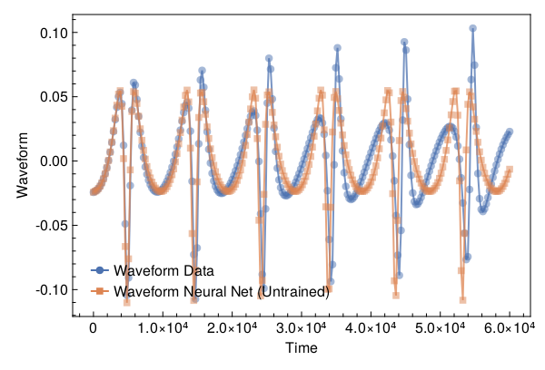
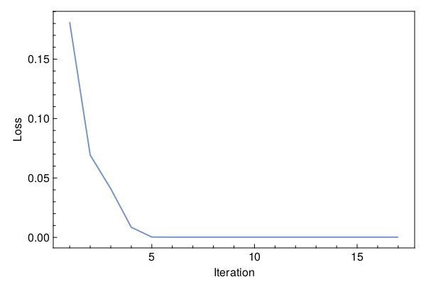
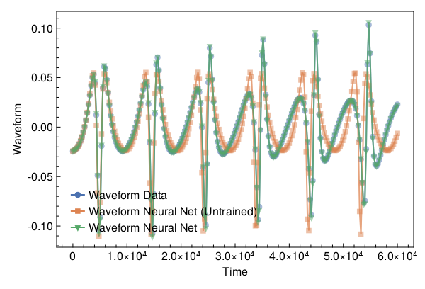

<a id='Training-a-Neural-ODE-to-Model-Gravitational-Waveforms'></a>

# Training a Neural ODE to Model Gravitational Waveforms


This code is adapted from [Astroinformatics/ScientificMachineLearning](https://github.com/Astroinformatics/ScientificMachineLearning/blob/c93aac3a460d70b4cce98836b677fd9b732e94b7/neuralode_gw.ipynb)


The code has been minimally adapted from [Keith et. al. 2021](https://arxiv.org/abs/2102.12695) which originally used Flux.jl


<a id='Package-Imports'></a>

## Package Imports


```julia
using Lux, ComponentArrays, LineSearches, LuxAMDGPU, LuxCUDA, OrdinaryDiffEq,
    Optimization, OptimizationOptimJL, Random, SciMLSensitivity
using CairoMakie, MakiePublication
CUDA.allowscalar(false)
```


<a id='Define-some-Utility-Functions'></a>

## Define some Utility Functions


::: tip


This section can be skipped. It defines functions to simulate the model, however, from a scientific machine learning perspective, isn't super relevant.


:::


We need a very crude 2-body path. Assume the 1-body motion is a newtonian 2-body position vector $r = r_1 - r_2$ and use Newtonian formulas to get $r_1$, $r_2$ (e.g. Theoretical Mechanics of Particles and Continua 4.3)


```julia
function one2two(path, m₁, m₂)
    M = m₁ + m₂
    r₁ = m₂ / M .* path
    r₂ = -m₁ / M .* path
    return r₁, r₂
end
```


```
one2two (generic function with 1 method)
```


Next we define a function to perform the change of variables: $(\chi(t),\phi(t)) \mapsto (x(t),y(t))$


```julia
@views function soln2orbit(soln, model_params=nothing)
    @assert size(soln, 1) ∈ [2, 4] "size(soln,1) must be either 2 or 4"

    if size(soln, 1) == 2
        χ = soln[1, :]
        ϕ = soln[2, :]

        @assert length(model_params)==3 "model_params must have length 3 when size(soln,2) = 2"
        p, M, e = model_params
    else
        χ = soln[1, :]
        ϕ = soln[2, :]
        p = soln[3, :]
        e = soln[4, :]
    end

    r = p ./ (1 .+ e .* cos.(χ))
    x = r .* cos.(ϕ)
    y = r .* sin.(ϕ)

    orbit = vcat(x', y')
    return orbit
end
```


```
soln2orbit (generic function with 2 methods)
```


This function uses second-order one-sided difference stencils at the endpoints; see https://doi.org/10.1090/S0025-5718-1988-0935077-0


```julia
function d_dt(v::AbstractVector, dt)
    a = -3 / 2 * v[1] + 2 * v[2] - 1 / 2 * v[3]
    b = (v[3:end] .- v[1:(end - 2)]) / 2
    c = 3 / 2 * v[end] - 2 * v[end - 1] + 1 / 2 * v[end - 2]
    return [a; b; c] / dt
end
```


```
d_dt (generic function with 1 method)
```


This function uses second-order one-sided difference stencils at the endpoints; see https://doi.org/10.1090/S0025-5718-1988-0935077-0


```julia
function d2_dt2(v::AbstractVector, dt)
    a = 2 * v[1] - 5 * v[2] + 4 * v[3] - v[4]
    b = v[1:(end - 2)] .- 2 * v[2:(end - 1)] .+ v[3:end]
    c = 2 * v[end] - 5 * v[end - 1] + 4 * v[end - 2] - v[end - 3]
    return [a; b; c] / (dt^2)
end
```


```
d2_dt2 (generic function with 1 method)
```


Now we define a function to compute the trace-free moment tensor from the orbit


```julia
function orbit2tensor(orbit, component, mass=1)
    x = orbit[1, :]
    y = orbit[2, :]

    Ixx = x .^ 2
    Iyy = y .^ 2
    Ixy = x .* y
    trace = Ixx .+ Iyy

    if component[1] == 1 && component[2] == 1
        tmp = Ixx .- trace ./ 3
    elseif component[1] == 2 && component[2] == 2
        tmp = Iyy .- trace ./ 3
    else
        tmp = Ixy
    end

    return mass .* tmp
end

function h_22_quadrupole_components(dt, orbit, component, mass=1)
    mtensor = orbit2tensor(orbit, component, mass)
    mtensor_ddot = d2_dt2(mtensor, dt)
    return 2 * mtensor_ddot
end

function h_22_quadrupole(dt, orbit, mass=1)
    h11 = h_22_quadrupole_components(dt, orbit, (1, 1), mass)
    h22 = h_22_quadrupole_components(dt, orbit, (2, 2), mass)
    h12 = h_22_quadrupole_components(dt, orbit, (1, 2), mass)
    return h11, h12, h22
end

function h_22_strain_one_body(dt::T, orbit) where {T}
    h11, h12, h22 = h_22_quadrupole(dt, orbit)

    h₊ = h11 - h22
    hₓ = T(2) * h12

    scaling_const = √(T(π) / 5)
    return scaling_const * h₊, -scaling_const * hₓ
end

function h_22_quadrupole_two_body(dt, orbit1, mass1, orbit2, mass2)
    h11_1, h12_1, h22_1 = h_22_quadrupole(dt, orbit1, mass1)
    h11_2, h12_2, h22_2 = h_22_quadrupole(dt, orbit2, mass2)
    h11 = h11_1 + h11_2
    h12 = h12_1 + h12_2
    h22 = h22_1 + h22_2
    return h11, h12, h22
end

function h_22_strain_two_body(dt::T, orbit1, mass1, orbit2, mass2) where {T}
    # compute (2,2) mode strain from orbits of BH 1 of mass1 and BH2 of mass 2

    @assert abs(mass1 + mass2 - 1.0)<1e-12 "Masses do not sum to unity"

    h11, h12, h22 = h_22_quadrupole_two_body(dt, orbit1, mass1, orbit2, mass2)

    h₊ = h11 - h22
    hₓ = T(2) * h12

    scaling_const = √(T(π) / 5)
    return scaling_const * h₊, -scaling_const * hₓ
end

function compute_waveform(dt::T, soln, mass_ratio, model_params=nothing) where {T}
    @assert mass_ratio≤1 "mass_ratio must be <= 1"
    @assert mass_ratio≥0 "mass_ratio must be non-negative"

    orbit = soln2orbit(soln, model_params)
    if mass_ratio > 0
        m₂ = inv(T(1) + mass_ratio)
        m₁ = mass_ratio * m₂

        orbit₁, orbit₂ = one2two(orbit, m₁, m₂)
        waveform = h_22_strain_two_body(dt, orbit1, mass1, orbit2, mass2)
    else
        waveform = h_22_strain_one_body(dt, orbit)
    end
    return waveform
end
```


```
compute_waveform (generic function with 2 methods)
```


<a id='Simulating-the-True-Model'></a>

## Simulating the True Model


`RelativisticOrbitModel` defines system of odes which describes motion of point like particle in schwarzschild background, uses


$$
u[1] = \chi
$$


$$
u[2] = \phi
$$


where, $p$, $M$, and $e$ are constants


```julia
function RelativisticOrbitModel(u, (p, M, e), t)
    χ, ϕ = u

    numer = (p - 2 - 2 * e * cos(χ)) * (1 + e * cos(χ))^2
    denom = sqrt((p - 2)^2 - 4 * e^2)

    χ̇ = numer * sqrt(p - 6 - 2 * e * cos(χ)) / (M * (p^2) * denom)
    ϕ̇ = numer / (M * (p^(3 / 2)) * denom)

    return [χ̇, ϕ̇]
end

mass_ratio = 0.0         # test particle
u0 = Float64[π, 0.0]     # initial conditions
datasize = 250
tspan = (0.0f0, 6.0f4)   # timespace for GW waveform
tsteps = range(tspan[1], tspan[2]; length=datasize)  # time at each timestep
dt_data = tsteps[2] - tsteps[1]
dt = 100.0
const ode_model_params = [100.0, 1.0, 0.5]; # p, M, e
```


Let's simulate the true model and plot the results using `OrdinaryDiffEq.jl`


```julia
prob = ODEProblem(RelativisticOrbitModel, u0, tspan, ode_model_params)
soln = Array(solve(prob, RK4(); saveat=tsteps, dt, adaptive=false))
waveform = first(compute_waveform(dt_data, soln, mass_ratio, ode_model_params))

fig = with_theme(theme_web()) do
    fig = Figure()
    ax = CairoMakie.Axis(fig[1, 1]; xlabel="Time", ylabel="Waveform")

    l = lines!(ax, tsteps, waveform; linewidth=2, alpha=0.75)
    s = scatter!(ax, tsteps, waveform; markershape=:circle, markeralpha=0.25, alpha=0.5)

    axislegend(ax, [[l, s]], ["Waveform Data"])

    return fig
end
```


<a id='Defiing-a-Neural-Network-Model'></a>

## Defiing a Neural Network Model


Next, we define the neural network model that takes 1 input (time) and has two outputs. We'll make a function `ODE_model` that takes the initial conditions, neural network parameters and a time as inputs and returns the derivatives.


It is typically never recommended to use globals but incase you do use them, make sure to mark them as `const`.


We will deviate from the standard Neural Network initialization and use `WeightInitializers.jl`,


```julia
const nn = Chain(Base.Fix1(broadcast, cos),
    Dense(1 => 32, cos; init_weight=truncated_normal(; std=1e-4)),
    Dense(32 => 32, cos; init_weight=truncated_normal(; std=1e-4)),
    Dense(32 => 2; init_weight=truncated_normal(; std=1e-4)))
ps, st = Lux.setup(MersenneTwister(), nn)
```


```
((layer_1 = NamedTuple(), layer_2 = (weight = Float32[-6.347695f-5; 2.1547007f-6; -9.651579f-5; -9.737933f-5; 0.00012400543; 0.00013808571; 1.5284593f-5; -0.00015591108; 4.7709304f-6; 3.3027227f-5; 7.346991f-5; 4.7865407f-5; 0.00016451316; -1.5184785f-6; -7.1646566f-5; 6.201879f-5; -4.100996f-5; -2.0350652f-5; -6.6278284f-5; 0.00010329834; 0.0002000771; -8.601779f-6; -1.624486f-5; -2.4003766f-5; -4.1508283f-5; -6.92306f-5; -2.817303f-5; -0.00015211014; 5.4288223f-5; -4.834187f-5; -0.00022144926; 6.114519f-5;;], bias = Float32[0.0; 0.0; 0.0; 0.0; 0.0; 0.0; 0.0; 0.0; 0.0; 0.0; 0.0; 0.0; 0.0; 0.0; 0.0; 0.0; 0.0; 0.0; 0.0; 0.0; 0.0; 0.0; 0.0; 0.0; 0.0; 0.0; 0.0; 0.0; 0.0; 0.0; 0.0; 0.0;;]), layer_3 = (weight = Float32[-8.296337f-5 0.00015491257 8.256124f-5 0.00011001113 -1.6243313f-6 8.179243f-5 1.1991009f-5 2.258772f-5 -4.927432f-5 0.00016706905 -0.00010892544 -3.07566f-5 -0.00010135407 0.00011209989 9.631612f-6 4.2984444f-5 0.00018918085 -0.00012216844 -1.8774053f-6 -4.788273f-5 -7.0547525f-5 3.0177094f-5 -4.96108f-5 -2.4591832f-6 5.274099f-5 -2.5232535f-5 5.8216992f-5 8.488832f-5 -2.8798546f-5 1.19058395f-5 8.889555f-5 0.00019761111; -2.9765353f-5 4.033065f-5 0.0001860828 -0.00010212212 -6.1361266f-6 0.000119464465 0.00023912085 3.3810084f-5 -6.4553833f-6 -2.4310442f-5 1.2977232f-6 -8.835471f-5 1.15926505f-5 -8.6128384f-5 -3.0773925f-5 0.0001297783 -0.00013756476 -1.6103597f-5 -0.000150838 8.526655f-5 -3.0838842f-6 -3.8751627f-5 0.00015707448 0.0001634028 -0.00015424761 -0.00018516427 -9.1084024f-5 4.775064f-5 0.000119391545 1.7026177f-5 6.65077f-5 -2.2406717f-5; 0.0001987372 -8.195253f-5 -5.638875f-5 8.371342f-6 0.0001238079 8.264665f-5 4.0260682f-5 -0.00021644375 0.00010238628 8.939563f-5 -6.832926f-5 -4.5288485f-5 -0.00018459058 2.4728892f-5 0.00012170583 5.6869726f-6 -1.4162006f-5 -7.997971f-5 1.9768928f-5 -5.2612086f-5 3.869053f-5 -0.00010919493 3.924348f-5 5.404749f-5 -6.191973f-5 -3.4692235f-8 0.00014065378 -0.0001640923 0.000116889205 -0.000112697235 2.3050494f-5 1.9267622f-5; -5.909033f-5 -3.8261383f-5 -6.6514f-5 5.4425425f-5 -2.4645962f-5 3.2433443f-5 0.00012056957 9.866954f-5 0.0001252144 0.0001634537 5.3601798f-5 -6.3310225f-5 -0.00010582493 -4.1051924f-5 -3.8664286f-5 7.155031f-6 -6.957904f-5 -0.00013032088 4.3847074f-5 -6.098219f-5 -5.060034f-5 -1.4240967f-5 1.0240605f-5 -0.00013326904 2.8246102f-6 -7.6828124f-5 1.10551155f-5 9.845002f-5 -2.9276789f-5 -0.0001592168 0.00011608029 -7.751804f-6; -6.688427f-5 -2.3463783f-5 -5.657941f-6 7.046274f-5 9.494647f-5 2.9956722f-5 3.825261f-5 1.3082187f-5 0.00020587408 -9.569485f-5 -4.104412f-5 9.58348f-5 -3.513172f-5 -3.518077f-5 -2.9421104f-5 0.00014636388 2.0722546f-5 -0.00010506267 4.50929f-5 -7.0950864f-6 -0.00014933934 -1.5087175f-5 9.909424f-5 5.380655f-5 -5.1882842f-5 -0.00015885496 -8.083989f-6 -0.00011102181 -3.8114787f-5 1.7774171f-5 -3.6888843f-5 -3.2718668f-5; 6.281112f-5 0.00010735407 0.00013233924 7.4462194f-5 0.00023416465 -0.00020524437 8.916669f-5 0.0001617341 4.821351f-5 8.232043f-5 4.57947f-5 -3.4752386f-5 -4.0047653f-5 7.71669f-5 -0.00012620597 0.00014918622 -0.00010561373 0.00012250194 8.156614f-5 3.626393f-5 0.00011438048 1.948258f-5 -0.000118145384 -0.00019674642 0.00012789074 1.0756143f-5 -3.8956186f-5 -4.9207225f-5 2.8219421f-5 0.00021690218 4.5498724f-5 1.7953369f-5; 0.00019059378 -5.4148528f-5 5.558086f-5 -6.20335f-5 6.840755f-5 2.1884318f-5 5.2131945f-5 -7.240234f-6 -3.978554f-5 6.207146f-5 -6.883758f-6 0.00010625758 8.5074455f-5 0.0001655334 -3.055644f-5 -3.568918f-5 4.445146f-5 0.00014045704 -9.2946386f-5 4.7258247f-5 4.876561f-5 -5.608635f-5 -3.7500165f-5 -2.6954137f-6 -6.469638f-5 0.0001854651 7.28526f-5 -3.862977f-5 -6.5016275f-7 7.620412f-5 -0.00014447042 -9.033824f-5; 2.7421913f-5 -0.00018521873 -7.304759f-5 -0.00012677295 -0.00010250172 -0.00021071122 0.00011664365 6.4152475f-5 4.9999475f-5 -6.348562f-5 3.809008f-5 -3.4041266f-5 -1.3419689f-5 8.520054f-6 -2.645089f-5 0.00018343054 3.191993f-5 -1.5058464f-5 5.7222896f-6 2.7096654f-5 -2.6592743f-6 -0.00020350718 0.00014452152 -5.0655133f-5 6.4569525f-5 -3.933583f-5 1.131906f-5 -4.133615f-5 6.0378134f-5 7.2123934f-5 -8.5347296f-5 6.681466f-5; -8.200228f-5 4.5016764f-5 -9.311686f-5 6.508181f-5 -6.968044f-5 -0.00021514253 -6.194605f-5 -7.302894f-5 0.00026331935 -0.00012735905 1.6379976f-5 8.652595f-5 -5.6127374f-5 7.0298636f-5 9.842285f-6 -2.4958084f-5 7.070946f-5 -7.62607f-5 -0.00029459767 1.2255484f-5 -1.1967685f-5 -7.477277f-5 -5.013435f-5 3.6120648f-5 7.326588f-5 -9.036538f-7 -0.00019355587 7.892119f-5 0.00010211825 -7.2609964f-6 -8.719849f-5 -0.00012748656; -4.2363165f-5 -0.00016683558 -6.445168f-5 -0.00010786103 -6.916033f-5 -1.29795135f-5 -3.200141f-5 0.00015534155 -1.4254778f-6 -1.680187f-5 -3.4538843f-5 0.00018229059 3.1261916f-5 -1.3811372f-5 8.3961255f-5 -1.7136332f-5 0.00011255238 2.500778f-5 -9.1952825f-5 -1.5860143f-5 0.00014563664 8.7371154f-7 0.00011773224 -4.0836392f-5 7.5177544f-5 -1.2228358f-5 -9.2186434f-5 1.0310928f-5 9.934032f-5 -0.0001651163 -5.7671397f-5 4.2881788f-5; 2.0439158f-5 -6.6594043f-7 -0.00016743536 -5.6486166f-5 -0.00018727331 -0.00012580174 1.03413895f-5 -0.000116856485 6.133774f-5 2.0029094f-5 0.00016480178 -1.8000044f-5 -0.00012783735 -7.476367f-6 -5.6802106f-5 4.4529283f-5 -0.00011472376 8.424223f-5 5.770362f-5 6.353288f-5 6.0439208f-5 0.00015873066 -3.8626935f-5 -0.00010048407 -6.0509345f-5 -9.631731f-5 -0.00013443451 0.00011975403 3.9026665f-5 6.1587576f-5 -0.00011187803 -0.00013195245; -7.260766f-5 -5.218104f-5 4.4116292f-5 -5.2278578f-5 -4.274316f-5 6.837067f-5 -8.675319f-5 4.2603893f-5 7.628744f-5 0.00011384774 -4.0694205f-5 2.266712f-5 -8.86771f-5 3.3882705f-5 -6.3819956f-5 -5.9295937f-5 -0.0002055209 0.00017790763 -0.00019490172 3.0422712f-5 -6.319996f-5 -9.860466f-5 1.3311543f-5 -5.3881646f-5 -8.0748665f-5 8.2235885f-5 -6.562868f-5 -0.000118585485 1.1669756f-5 0.00017707891 -2.0278021f-5 -0.00018289546; -0.000114572314 9.3213894f-5 1.6930413f-5 7.242063f-5 0.00011310008 -9.344558f-5 -0.0001572401 6.763189f-5 -0.00017559523 -0.00015599244 3.467739f-5 3.2443993f-5 -2.4623538f-5 -9.225336f-6 1.584686f-5 3.783596f-5 -4.5476787f-5 -0.00013128067 -3.860382f-5 -0.00018362034 0.0001538181 2.4785091f-5 0.00010034164 9.51323f-5 4.4177166f-5 3.1464933f-5 3.0903062f-5 -0.00011093662 -0.000105078856 -0.00012200159 -3.9297513f-5 -0.000117338765; 4.6750698f-5 2.8156024f-5 -3.432841f-5 3.7394395f-5 0.00015483297 0.00015923452 -0.00017630047 0.00022659854 -6.647043f-5 8.512475f-5 -5.9237096f-5 3.3155404f-5 7.259588f-6 0.00019480119 -5.5261084f-5 0.0003177066 4.9819624f-5 6.6369204f-5 -0.0002124182 -8.080904f-5 7.4265045f-5 -6.853924f-5 6.0150353f-5 0.000120712604 7.44506f-5 6.313492f-5 -0.00011226012 4.6832876f-5 3.9127746f-5 -0.00011707395 -3.8370334f-5 3.9161587f-5; 0.00021346108 6.229472f-5 -9.6348245f-5 -6.020701f-5 -7.001017f-5 -0.00017211221 0.00018351176 -0.00013748783 0.0001276836 -4.807185f-5 -7.5019954f-5 0.00015873909 9.352172f-5 -4.0255465f-5 6.572956f-5 8.277003f-5 -0.00018767135 6.0444192f-5 -0.00010522538 2.085705f-5 -9.414782f-5 -1.3515305f-5 -0.000105859355 6.952218f-5 8.6667154f-5 5.3145122f-5 -0.0001068093 9.6124335f-5 8.662514f-5 -3.3130527f-5 -3.5352684f-7 2.8516131f-5; 2.8890254f-5 -0.00011571713 -1.77868f-5 3.8654434f-5 -2.9936595f-5 0.00016152162 -0.000104155835 -1.2404977f-5 -2.6012342f-5 9.7922006f-5 5.024874f-5 -6.4459295f-5 -1.5029965f-5 4.7662277f-5 -0.00014474876 -8.7307664f-5 -7.759497f-5 4.4806387f-5 -0.00011491532 -4.8460526f-5 -0.0001670424 3.3857676f-5 2.390567f-5 6.912465f-5 -0.0002413492 3.858489f-5 -0.00012909176 -5.1702147f-5 -4.604798f-5 -3.1896383f-5 0.00020386896 3.3597957f-5; -5.0272436f-5 5.4623086f-8 -5.53186f-5 6.4345426f-5 -7.8564415f-5 0.00013080025 2.3690738f-5 -1.9304274f-5 9.362667f-5 3.6283363f-5 -6.200282f-5 -2.136117f-5 -2.792908f-5 -6.957257f-5 -0.00015780207 -7.265586f-5 3.5203117f-5 0.000179666 -3.155738f-5 -5.7007386f-5 1.8952103f-5 -7.00532f-5 1.2977494f-5 -5.5247714f-5 -3.2407177f-5 -7.326877f-5 1.8302606f-5 3.185435f-5 0.00016416458 0.00017979252 5.717867f-5 3.5836732f-5; -9.789421f-5 -1.1206293f-5 -1.713048f-5 0.00018729281 -0.00012977906 -9.4750474f-5 -0.00017309813 -0.00029022217 -1.98783f-5 9.049289f-6 9.6622325f-6 -2.9227918f-5 4.053108f-5 0.00018025583 7.450869f-5 1.4060721f-5 6.654816f-5 2.7625874f-5 -0.00010024608 -3.6407346f-5 0.0001649798 2.2201746f-5 0.0001397964 0.00013021039 -2.3705152f-5 -1.3614042f-5 -5.53007f-5 -2.6878213f-6 -2.6063315f-5 -1.9931882f-5 4.804945f-5 5.1718544f-5; 0.00014832863 -5.9326576f-5 -4.062092f-5 -0.00010794072 0.00013987908 -3.1102652f-5 -0.00015527658 6.9635804f-5 0.00012940602 8.124059f-5 -1.3576433f-5 -8.5760534f-5 9.526696f-6 3.843776f-6 -6.3202766f-5 0.00012082649 -4.026308f-5 -6.898106f-5 2.6915417f-5 -6.119516f-5 1.7742388f-5 8.179986f-5 -0.00014727522 -6.770793f-5 4.5087047f-5 0.00010336653 4.1219228f-6 -4.645518f-5 2.5085386f-5 -9.279199f-5 1.7747943f-5 2.7954027f-7; 0.00015234832 -0.00012999293 2.8619594f-5 -4.953069f-5 9.512798f-6 4.704886f-5 -5.4068205f-5 -0.00012024274 8.6496715f-5 1.4735649f-5 5.686999f-5 -7.147001f-5 0.00019284214 0.00011907025 -7.7057004f-5 0.0001845289 -1.2986715f-5 5.819501f-5 -9.622118f-5 0.00015203436 0.00010132935 0.00012529008 -0.00013053935 2.0470374f-5 8.025065f-5 1.4883847f-6 4.1184205f-5 7.865196f-5 1.6412594f-5 6.34082f-8 5.1063093f-6 0.00025381008; -4.7574656f-5 0.00023182531 -0.000102686936 0.00011460377 -2.7269232f-5 1.0629651f-5 0.00013049503 0.00010483011 -0.00019047468 0.00015794161 -1.5056499f-5 -4.75134f-5 -2.8502967f-5 1.3294148f-5 -0.00013893918 -5.218922f-5 -0.00013382829 0.00012629236 -0.00010970801 9.372347f-5 -5.4378514f-5 -3.4913874f-6 6.228296f-5 0.0001537145 2.7590298f-5 -4.7166854f-5 0.00022331954 -5.400043f-5 6.742872f-5 0.00010019942 -2.5065221f-5 9.123288f-5; 3.655426f-5 -0.00016296301 4.251658f-5 9.1853595f-5 7.242296f-5 4.8446713f-5 0.000107830405 6.4538945f-5 0.00019008563 0.00014358347 -2.401939f-5 4.569102f-5 -6.699683f-6 -8.8834924f-5 -0.00019727492 -0.00010996069 1.2227455f-5 2.4887959f-5 4.919306f-5 8.4042214f-5 7.778928f-6 -4.016472f-5 -0.00014514019 1.3331501f-5 -6.854347f-5 -0.00012776352 -2.471284f-5 -5.230304f-5 -9.0208756f-5 0.00012764783 -6.0114835f-5 -0.00013029226; -3.53f-5 1.5497706f-5 3.826476f-5 -5.1758136f-5 1.1380593f-5 -1.4057823f-5 -0.0001285997 1.4337267f-5 9.875544f-5 8.928242f-5 1.3216705f-5 5.3042117f-5 -7.9935286f-5 -0.00014806763 7.2789066f-5 -4.806303f-5 -3.7476084f-6 -0.00018612822 -0.0001223007 0.0001424297 8.418263f-5 -0.00015255358 -3.6568857f-5 -5.821777f-5 0.0001044732 -8.456449f-5 3.1087944f-5 -5.9302456f-5 -0.00013512571 3.609733f-5 -4.8118076f-5 9.5978874f-5; 2.608647f-5 0.000101369 7.649391f-5 3.902112f-5 -3.7218028f-6 4.6852918f-5 0.00018267914 -6.292174f-5 6.54543f-5 2.9261631f-5 0.00013225894 -1.6731141f-5 -0.00012028215 -0.0001832462 -2.4251352f-5 -0.00022541065 6.0539598f-5 8.590562f-6 1.3927225f-5 6.902341f-5 -0.00011834071 -0.00011763591 2.0572063f-6 -1.4289025f-5 -6.2315834f-5 -8.029248f-6 0.00010227969 5.4237848f-5 -1.95321f-5 -4.7854886f-5 5.36147f-5 0.00015651733; -1.931968f-5 -6.103348f-5 -6.413922f-5 -2.6609736f-5 0.000107971384 -0.00018455842 -6.893213f-5 -4.959059f-5 9.762417f-5 -0.00012031333 0.00013758031 -0.00025910724 0.00011135258 -3.97057f-5 -0.0001564346 0.00015513388 -0.000112661204 2.4863488f-5 7.5544755f-5 2.543859f-5 0.00018282628 9.022105f-5 -1.2926539f-5 -2.4510482f-5 7.7224824f-5 -3.5076825f-6 -4.1124917f-5 3.118055f-6 -6.1756746f-6 -8.621281f-5 0.00011357799 -0.00011492735; -3.9172428f-5 0.000223274 -0.00012059986 -0.00010033501 -1.2270808f-5 -6.371164f-5 9.2872534f-7 -8.703067f-6 0.00018794904 -8.762012f-5 8.06393f-5 1.3281728f-5 -6.818717f-5 -7.780207f-5 6.778839f-6 0.000102646394 -2.2825685f-5 -7.7269324f-5 -9.89237f-5 -0.0001409079 3.463966f-5 -1.085124f-5 -7.1277296f-5 -1.1439693f-5 -0.00015799301 -4.8119822f-5 0.00012823568 -8.29404f-5 -7.995005f-5 5.041563f-6 2.5091555f-5 -8.69835f-5; -0.00017896279 0.00010313133 -1.1023338f-5 0.00013518552 1.1602819f-5 8.532085f-5 6.200894f-5 0.00013500616 8.6722066f-5 -0.00014845768 7.124494f-5 2.7978733f-5 -4.055103f-5 0.00013274416 7.6655346f-7 -0.00021383853 1.634197f-5 -1.4944355f-5 -4.9868784f-5 1.0294105f-5 -0.000106624626 0.0001306511 3.762971f-5 1.9901738f-5 -2.8310946f-5 0.00013445073 -0.00011978244 0.00015974589 9.560917f-6 0.00021768545 -6.000504f-5 -7.742561f-5; 2.059977f-5 5.231078f-5 -7.6438955f-5 -1.0207263f-5 1.9028927f-5 0.00012655223 5.4844182f-5 -7.4657975f-5 0.00016202277 -5.6070156f-5 5.596158f-5 4.5877245f-5 3.3384251f-6 4.6548135f-5 3.9418366f-5 -0.00019707828 -7.435515f-5 -4.8545758f-6 -3.7418846f-5 -2.5552928f-5 -8.5477644f-5 7.407557f-5 2.3733426f-5 -0.00012078898 7.6508244f-5 1.1193152f-5 1.5278698f-5 -8.773049f-5 -0.0002490261 -9.257157f-5 0.00021282326 7.804589f-5; -6.855663f-5 -5.1721752f-5 2.5783957f-5 7.588831f-5 3.8041244f-6 -0.00011615036 0.00019680773 9.6637734f-5 -2.736827f-5 0.00010013798 -0.00018966189 4.3634038f-5 7.4216f-5 6.7185305f-5 -7.611766f-5 -0.00012361411 3.7220125f-5 6.524195f-6 3.880517f-5 7.72043f-5 -8.482836f-5 -5.269096f-5 -2.25548f-5 0.0001496795 2.2489365f-5 -5.6415658f-5 4.252564f-5 -6.0756272f-5 0.00010581081 -0.00018713354 4.7171134f-6 9.687796f-5; -7.126235f-5 5.295419f-5 3.0365789f-5 1.2200751f-5 -4.73314f-5 0.00014585082 -0.00012723677 0.00011204748 2.0276342f-5 9.411161f-5 -6.166992f-5 -1.5995842f-5 4.0007897f-5 -1.6840997f-5 -6.181136f-5 -1.1582783f-5 3.3191176f-5 0.00020954672 4.1431755f-5 -2.1363217f-5 -3.6610105f-5 8.226509f-5 3.7096313f-5 0.000102573395 -4.0997933f-5 3.8363964f-5 5.1577183f-5 6.706193f-5 0.00014878878 6.207324f-5 -7.1593546f-5 -0.00019589273; -5.8698108f-5 -9.7830445f-5 -2.26987f-5 6.4475695f-5 5.1927665f-5 -1.20482555f-5 5.338475f-6 -0.000104364444 -3.4682373f-5 -9.218913f-5 -5.220292f-5 2.7988397f-5 0.00011223941 0.00014645237 4.6443998f-5 -7.078618f-5 -5.4036944f-5 -0.00010510642 -4.2092903f-5 -0.0001417629 7.214349f-6 -1.7843482f-5 -0.00012607627 -0.000120759425 -6.710186f-5 4.762308f-5 7.822422f-5 -7.532973f-5 -9.081024f-5 0.00013594671 0.00018567557 -0.00014583602; -4.826665f-5 0.00025376145 8.083667f-5 2.5898395f-5 -4.7092257f-5 0.000238874 8.236413f-5 -9.383823f-6 0.00017784788 5.7779518f-5 6.1183136f-6 -2.6923908f-5 -0.00014620577 2.541853f-5 -0.00014219961 0.00014789008 5.868682f-5 -0.00021719043 -0.00018813112 0.00021342523 3.2112675f-5 2.7794169f-5 0.0001351435 -5.9831797f-5 -0.00013561448 -9.63955f-5 0.0001368749 0.00013659889 -0.00016223331 -1.0659771f-6 -6.314856f-5 -5.6062498f-5], bias = Float32[0.0; 0.0; 0.0; 0.0; 0.0; 0.0; 0.0; 0.0; 0.0; 0.0; 0.0; 0.0; 0.0; 0.0; 0.0; 0.0; 0.0; 0.0; 0.0; 0.0; 0.0; 0.0; 0.0; 0.0; 0.0; 0.0; 0.0; 0.0; 0.0; 0.0; 0.0; 0.0;;]), layer_4 = (weight = Float32[-5.9937687f-5 3.4205965f-5 3.824145f-5 -0.00012973703 1.916818f-5 3.0929077f-5 1.2499988f-6 -5.7948488f-5 -3.1723663f-5 -2.5708774f-5 -7.9548605f-5 -1.0828999f-7 8.24371f-5 -2.6487873f-5 4.806662f-5 9.966514f-5 -0.00017622461 0.000108374974 4.266391f-5 -4.18613f-5 7.493822f-5 -1.3072513f-5 -8.920561f-5 -1.0815052f-5 6.923625f-5 0.00013060943 -2.3472783f-5 0.00010553183 7.647057f-5 -4.718459f-5 0.00013326883 2.927498f-5; 2.9605595f-5 2.0618938f-5 7.8024736f-5 -2.691458f-5 -1.33718095f-5 0.00012657225 2.4730216f-5 -0.00014606635 -3.1101146f-5 1.5996931f-5 -0.00016422107 -0.0002727321 6.241314f-5 2.214996f-5 -0.0001228593 0.00011159437 -3.5420464f-5 2.9731997f-5 5.6401328f-5 7.9404854f-5 -4.660912f-5 -0.00022049077 2.3614622f-5 -3.1612348f-5 6.8282275f-6 7.888648f-5 -4.949951f-5 0.00019627808 -0.00010211261 -7.3646785f-5 9.705305f-5 -7.64526f-5], bias = Float32[0.0; 0.0;;])), (layer_1 = NamedTuple(), layer_2 = NamedTuple(), layer_3 = NamedTuple(), layer_4 = NamedTuple()))
```


Similar to most DL frameworks, Lux defaults to using `Float32`, however, in this case we need Float64


```julia
const params = ComponentArray{Float64}(ps)
```


```
ComponentVector{Float64}(layer_1 = Float64[], layer_2 = (weight = [-6.347695307340473e-5; 2.154700723622227e-6; -9.651578875491396e-5; -9.73793285083957e-5; 0.00012400542618706822; 0.0001380857138428837; 1.52845932461787e-5; -0.00015591108240187168; 4.770930445374688e-6; 3.30272268911358e-5; 7.346991333179176e-5; 4.786540739587508e-5; 0.00016451315605081618; -1.518478484285879e-6; -7.1646565629635e-5; 6.201879295986146e-5; -4.100996011402458e-5; -2.035065153904725e-5; -6.627828406635672e-5; 0.00010329834185540676; 0.00020007710554637015; -8.601778972661123e-6; -1.6244859580183402e-5; -2.4003766156965867e-5; -4.150828317506239e-5; -6.923059845576063e-5; -2.8173029932077043e-5; -0.0001521101366961375; 5.428822260000743e-5; -4.8341869842261076e-5; -0.00022144925605971366; 6.11451905569993e-5;;], bias = [0.0; 0.0; 0.0; 0.0; 0.0; 0.0; 0.0; 0.0; 0.0; 0.0; 0.0; 0.0; 0.0; 0.0; 0.0; 0.0; 0.0; 0.0; 0.0; 0.0; 0.0; 0.0; 0.0; 0.0; 0.0; 0.0; 0.0; 0.0; 0.0; 0.0; 0.0; 0.0;;]), layer_3 = (weight = [-8.296337182400748e-5 0.00015491257363464683 8.256123692262918e-5 0.00011001113307429478 -1.6243312757069361e-6 8.17924301372841e-5 1.1991009159828536e-5 2.258771928609349e-5 -4.927432019030675e-5 0.00016706905444152653 -0.00010892543650697917 -3.075660060858354e-5 -0.00010135406773770228 0.00011209989315830171 9.631611646909732e-6 4.298444400774315e-5 0.00018918084970209748 -0.00012216843606438488 -1.8774053387460299e-6 -4.788273145095445e-5 -7.054752495605499e-5 3.0177094231476076e-5 -4.961080048815347e-5 -2.4591831788711715e-6 5.2740990213351324e-5 -2.5232535335817374e-5 5.82169923291076e-5 8.488832099828869e-5 -2.8798545827157795e-5 1.190583952848101e-5 8.88955473783426e-5 0.00019761110888794065; -2.9765353247057647e-5 4.0330651245312765e-5 0.00018608280515763909 -0.00010212211782345548 -6.13612655797624e-6 0.00011946446466026828 0.00023912085453048348 3.381008355063386e-5 -6.455383299908135e-6 -2.4310442313435487e-5 1.2977232017874485e-6 -8.835471089696512e-5 1.1592650480451994e-5 -8.612838428234681e-5 -3.077392466366291e-5 0.0001297783019253984 -0.00013756475527770817 -1.610359686310403e-5 -0.00015083799371495843 8.526654710294679e-5 -3.0838841666991357e-6 -3.8751626561861485e-5 0.00015707447892054915 0.0001634028012631461 -0.00015424760931637138 -0.00018516427371650934 -9.108402446145192e-5 4.775064007844776e-5 0.00011939154501305893 1.7026177374646068e-5 6.650770228588954e-5 -2.240671710751485e-5; 0.00019873719429597259 -8.195253030862659e-5 -5.638875154545531e-5 8.37134211906232e-6 0.00012380789848975837 8.264664938906208e-5 4.026068199891597e-5 -0.00021644374646712095 0.00010238627874059603 8.939563122112304e-5 -6.83292601024732e-5 -4.5288485125638545e-5 -0.0001845905790105462 2.4728891730774194e-5 0.0001217058306792751 5.68697259950568e-6 -1.416200575476978e-5 -7.997971260920167e-5 1.9768927813856862e-5 -5.2612085710279644e-5 3.869053034577519e-5 -0.00010919493070105091 3.9243481296580285e-5 5.404749026638456e-5 -6.191973079694435e-5 -3.4692234862632176e-8 0.00014065377763472497 -0.00016409230011049658 0.00011688920494634658 -0.00011269723472651094 2.30504938372178e-5 1.926762161019724e-5; -5.909032915951684e-5 -3.826138345175423e-5 -6.651400326518342e-5 5.4425425332738087e-5 -2.4645962184877135e-5 3.24334432661999e-5 0.00012056957348249853 9.866953769233078e-5 0.00012521439930424094 0.00016345370386261493 5.3601797844748944e-5 -6.331022450467572e-5 -0.00010582493268884718 -4.105192419956438e-5 -3.866428596666083e-5 7.155031198635697e-6 -6.957903678994626e-5 -0.0001303208846366033 4.384707426652312e-5 -6.098219091654755e-5 -5.060034163761884e-5 -1.4240967175283004e-5 1.0240604751743376e-5 -0.0001332690444542095 2.8246101919648936e-6 -7.68281242926605e-5 1.1055115464841947e-5 9.845002205111086e-5 -2.927678906416986e-5 -0.0001592167973285541 0.00011608029308263212 -7.75180433265632e-6; -6.68842694722116e-5 -2.3463782781618647e-5 -5.657941073877737e-6 7.04627382219769e-5 9.494646656094119e-5 2.9956721846247092e-5 3.825260864687152e-5 1.308218725171173e-5 0.0002058740792563185 -9.569484973326325e-5 -4.104412073502317e-5 9.583480277797207e-5 -3.5131721233483404e-5 -3.5180768463760614e-5 -2.9421104045468383e-5 0.00014636387641075999 2.0722545741591603e-5 -0.00010506266698939726 4.509290010901168e-5 -7.095086402841844e-6 -0.0001493393356213346 -1.5087174688233063e-5 9.909424261422828e-5 5.380655056796968e-5 -5.188284194446169e-5 -0.00015885496395640075 -8.083989087026566e-6 -0.00011102180724265054 -3.811478745774366e-5 1.7774171283235773e-5 -3.688884316943586e-5 -3.2718668080633506e-5; 6.281112291617319e-5 0.00010735406976891682 0.00013233923527877778 7.446219387929887e-5 0.00023416464682668447 -0.0002052443742286414 8.916669321479276e-5 0.00016173410404007882 4.821351103601046e-5 8.232043182943016e-5 4.5794698962708935e-5 -3.4752385545289144e-5 -4.00476528739091e-5 7.71669001551345e-5 -0.00012620596680790186 0.00014918622036930174 -0.00010561373346718028 0.0001225019368575886 8.156614057952538e-5 3.626392935984768e-5 0.00011438047658884898 1.948258068296127e-5 -0.00011814538447652012 -0.00019674641953315586 0.0001278907438972965 1.0756142728496343e-5 -3.8956186472205445e-5 -4.920722494716756e-5 2.8219421437825076e-5 0.00021690217545256019 4.5498723920900375e-5 1.7953369024326093e-5; 0.00019059378246311098 -5.4148527851793915e-5 5.5580858315806836e-5 -6.203349767019972e-5 6.840754940640181e-5 2.188431790273171e-5 5.213194526731968e-5 -7.240234026539838e-6 -3.978554013883695e-5 6.207146361703053e-5 -6.88375803292729e-6 0.00010625758295645937 8.507445454597473e-5 0.0001655334053793922 -3.0556439014617354e-5 -3.568917964003049e-5 4.445145896170288e-5 0.00014045703574083745 -9.294638584833592e-5 4.725824692286551e-5 4.87656106997747e-5 -5.6086348195094615e-5 -3.750016549020074e-5 -2.695413741093944e-6 -6.469638174166903e-5 0.00018546510546002537 7.28525992599316e-5 -3.862976882373914e-5 -6.501627467514481e-7 7.62041236157529e-5 -0.00014447042485699058 -9.033823880599812e-5; 2.742191281868145e-5 -0.0001852187269832939 -7.30475876480341e-5 -0.00012677295308094472 -0.00010250171908410266 -0.00021071122318971902 0.0001166436486528255 6.415247480617836e-5 4.999947486794554e-5 -6.348561873892322e-5 3.809007830568589e-5 -3.404126618988812e-5 -1.341968891210854e-5 8.520053597749211e-6 -2.6450890800333582e-5 0.0001834305439842865 3.1919931643642485e-5 -1.5058463759487495e-5 5.722289643017575e-6 2.7096653866465203e-5 -2.65927428699797e-6 -0.00020350718114059418 0.00014452151663135737 -5.065513323643245e-5 6.456952542066574e-5 -3.933583138859831e-5 1.1319059922243468e-5 -4.133614856982604e-5 6.037813363946043e-5 7.212393393274397e-5 -8.5347295680549e-5 6.68146603857167e-5; -8.200228330679238e-5 4.5016764488536865e-5 -9.311686153523624e-5 6.508181104436517e-5 -6.968044181121513e-5 -0.0002151425287593156 -6.194604793563485e-5 -7.302893936866894e-5 0.00026331935077905655 -0.00012735904601868242 1.637997593206819e-5 8.652594988234341e-5 -5.612737368210219e-5 7.029863627394661e-5 9.84228518063901e-6 -2.4958084395620972e-5 7.070945866871625e-5 -7.62607014621608e-5 -0.0002945976739283651 1.2255483852641191e-5 -1.196768516820157e-5 -7.477276813006029e-5 -5.0134349294239655e-5 3.612064756453037e-5 7.326588092837483e-5 -9.036538131113048e-7 -0.00019355586846359074 7.892119174357504e-5 0.00010211824701400474 -7.260996426339261e-6 -8.719848847249523e-5 -0.0001274865644518286; -4.2363164538983256e-5 -0.00016683558351360261 -6.445167673518881e-5 -0.00010786102939164266 -6.916032725712284e-5 -1.2979513485333882e-5 -3.200141145498492e-5 0.00015534154954366386 -1.425477762495575e-6 -1.6801870515337214e-5 -3.4538843465270475e-5 0.0001822905906010419 3.126191586488858e-5 -1.381137190037407e-5 8.396125485887751e-5 -1.7136331734945998e-5 0.00011255237768637016 2.5007779186125845e-5 -9.195282473228872e-5 -1.5860143321333453e-5 0.00014563664444722235 8.737115422263741e-7 0.00011773224105127156 -4.0836392145138234e-5 7.517754420405254e-5 -1.2228358173160814e-5 -9.21864339034073e-5 1.031092779157916e-5 9.934032277669758e-5 -0.00016511630383320153 -5.767139737145044e-5 4.2881787521764636e-5; 2.043915810645558e-5 -6.659404334641295e-7 -0.00016743535525165498 -5.64861657039728e-5 -0.000187273311894387 -0.00012580174370668828 1.0341389497625642e-5 -0.0001168564849649556 6.133774149930105e-5 2.002909423026722e-5 0.0001648017787374556 -1.800004429242108e-5 -0.0001278373529203236 -7.476367045455845e-6 -5.680210597347468e-5 4.452928260434419e-5 -0.00011472376354504377 8.424223051406443e-5 5.770361894974485e-5 6.353288335958496e-5 6.0439208027673885e-5 0.00015873066149652004 -3.862693483824842e-5 -0.00010048406693385914 -6.0509344621095806e-5 -9.631730790715665e-5 -0.0001344345073448494 0.00011975403322139755 3.902666503563523e-5 6.158757605589926e-5 -0.00011187802738277242 -0.0001319524453720078; -7.260766142280772e-5 -5.218103979132138e-5 4.4116291974205524e-5 -5.227857764111832e-5 -4.27431587013416e-5 6.837066757725552e-5 -8.675319259054959e-5 4.260389323462732e-5 7.628744060639292e-5 0.00011384773824829608 -4.069420538144186e-5 2.266711999254767e-5 -8.867710130289197e-5 3.388270488358103e-5 -6.381995626725256e-5 -5.9295936807757244e-5 -0.00020552090427372605 0.00017790762649383396 -0.00019490171689540148 3.0422712370636873e-5 -6.319995736703277e-5 -9.86046579782851e-5 1.3311542716110125e-5 -5.388164572650567e-5 -8.074866491369903e-5 8.223588520195335e-5 -6.562867929460481e-5 -0.00011858548532472923 1.1669755622278899e-5 0.0001770789094734937 -2.0278021111153066e-5 -0.0001828954555094242; -0.00011457231448730454 9.321389370597899e-5 1.693041303951759e-5 7.242063293233514e-5 0.00011310008267173544 -9.344558202428743e-5 -0.0001572400942677632 6.763188866898417e-5 -0.00017559522530063987 -0.00015599244215991348 3.467738861218095e-5 3.244399340474047e-5 -2.462353768351022e-5 -9.225335816154256e-6 1.5846859241719358e-5 3.783595821005292e-5 -4.547678690869361e-5 -0.00013128067075740546 -3.8603819120908156e-5 -0.00018362034461461008 0.0001538180949864909 2.4785091227386147e-5 0.0001003416400635615 9.513230179436505e-5 4.417716627358459e-5 3.146493327221833e-5 3.0903061997378245e-5 -0.00011093662033090368 -0.00010507885599508882 -0.00012200159108033404 -3.929751255782321e-5 -0.00011733876453945413; 4.675069794757292e-5 2.8156024200143293e-5 -3.432840821915306e-5 3.739439489436336e-5 0.00015483297465834767 0.00015923452156130224 -0.00017630046932026744 0.00022659853857476264 -6.647042755503207e-5 8.512475324096158e-5 -5.923709613853134e-5 3.315540379844606e-5 7.259588073793566e-6 0.00019480119226500392 -5.526108361664228e-5 0.00031770661007612944 4.9819624109659344e-5 6.636920443270355e-5 -0.00021241820650175214 -8.080904080998152e-5 7.426504453178495e-5 -6.853923696326092e-5 6.01503525103908e-5 0.00012071260425727814 7.445060327881947e-5 6.313491758191958e-5 -0.00011226011702092364 4.683287625084631e-5 3.9127746276790276e-5 -0.00011707394878612831 -3.837033364106901e-5 3.916158675565384e-5; 0.00021346108405850828 6.229471910046414e-5 -9.634824527893215e-5 -6.020701039233245e-5 -7.001016638241708e-5 -0.00017211220983881503 0.000183511758223176 -0.00013748783385381103 0.00012768359738402069 -4.8071851779241115e-5 -7.501995423808694e-5 0.00015873908705543727 9.352171764476225e-5 -4.02554651373066e-5 6.572956044692546e-5 8.277002780232579e-5 -0.00018767135043162853 6.04441920586396e-5 -0.00010522537922952324 2.0857049094047397e-5 -9.414782107342035e-5 -1.351530499960063e-5 -0.00010585935524431989 6.952218245714903e-5 8.666715439176187e-5 5.314512236509472e-5 -0.00010680929699447006 9.612433495931327e-5 8.662514301249757e-5 -3.3130527299363166e-5 -3.535268433552119e-7 2.851613135135267e-5; 2.8890253815916367e-5 -0.00011571712821023539 -1.7786800526664592e-5 3.865443432005122e-5 -2.9936594728496857e-5 0.0001615216169739142 -0.00010415583528811112 -1.2404976587276906e-5 -2.6012341550085694e-5 9.792200580704957e-5 5.024873826187104e-5 -6.445929466281086e-5 -1.502996474300744e-5 4.766227721120231e-5 -0.00014474875933956355 -8.730766421649605e-5 -7.759496656944975e-5 4.4806387450080365e-5 -0.00011491531768115237 -4.846052615903318e-5 -0.00016704239533282816 3.3857675589388236e-5 2.3905669877422042e-5 6.91246532369405e-5 -0.00024134920386131853 3.858489071717486e-5 -0.0001290917571168393 -5.170214717509225e-5 -4.604797868523747e-5 -3.189638300682418e-5 0.0002038689563050866 3.359795664437115e-5; -5.0272436055820435e-5 5.4623086498395423e-8 -5.53186000615824e-5 6.434542592614889e-5 -7.856441516196355e-5 0.00013080025382805616 2.3690738089499064e-5 -1.9304274246678688e-5 9.362667333334684e-5 3.6283363442635164e-5 -6.200282223289832e-5 -2.1361169274314307e-5 -2.7929079806199297e-5 -6.957256846362725e-5 -0.0001578020746819675 -7.265585736604407e-5 3.520311656757258e-5 0.00017966600717045367 -3.1557381589664146e-5 -5.7007386203622445e-5 1.895210334623698e-5 -7.005319639574736e-5 1.2977494407095946e-5 -5.524771404452622e-5 -3.24071770592127e-5 -7.326876948354766e-5 1.830260589485988e-5 3.185434979968704e-5 0.00016416457947343588 0.0001797925215214491 5.717866952181794e-5 3.583673242246732e-5; -9.789421164896339e-5 -1.1206292583665345e-5 -1.713048004603479e-5 0.00018729281146079302 -0.00012977905862499028 -9.475047409068793e-5 -0.00017309813119936734 -0.0002902221749536693 -1.9878300008713268e-5 9.049288564710878e-6 9.662232514529023e-6 -2.9227918275864795e-5 4.053107841173187e-5 0.00018025582539848983 7.45086872484535e-5 1.406072078680154e-5 6.65481566102244e-5 2.7625874281511642e-5 -0.00010024607763625681 -3.640734576038085e-5 0.00016497980686835945 2.220174610556569e-5 0.00013979639334138483 0.0001302103919442743 -2.370515176153276e-5 -1.3614041563414503e-5 -5.530070120585151e-5 -2.6878212793235434e-6 -2.606331509014126e-5 -1.9931881979573518e-5 4.8049449105747044e-5 5.171854354557581e-5; 0.0001483286323491484 -5.932657586527057e-5 -4.0620918298373e-5 -0.00010794072295539081 0.0001398790773237124 -3.110265242867172e-5 -0.0001552765752421692 6.963580381125212e-5 0.0001294060202781111 8.124059240799397e-5 -1.357643304800149e-5 -8.576053369324654e-5 9.526695976092014e-6 3.843776084977435e-6 -6.320276588667184e-5 0.00012082648754585534 -4.0263079426949844e-5 -6.898106221342459e-5 2.691541703825351e-5 -6.119516183389351e-5 1.7742388081387617e-5 8.179985889000818e-5 -0.00014727521920576692 -6.770792970201e-5 4.508704660111107e-5 0.00010336653213016689 4.121922756894492e-6 -4.645518129109405e-5 2.508538636902813e-5 -9.279199002776295e-5 1.7747943275026046e-5 2.7954027359555766e-7; 0.0001523483224445954 -0.0001299929281231016 2.8619593649636954e-5 -4.9530688556842506e-5 9.512797987554222e-6 4.704885941464454e-5 -5.406820491771214e-5 -0.00012024273746646941 8.649671508464962e-5 1.4735648619534913e-5 5.686999065801501e-5 -7.147000724216923e-5 0.00019284214067738503 0.00011907025327673182 -7.705700409132987e-5 0.00018452889344189316 -1.298671486438252e-5 5.819501166115515e-5 -9.622117795515805e-5 0.00015203436487354338 0.0001013293513096869 0.00012529008381534368 -0.00013053935253992677 2.047037378360983e-5 8.025064744288102e-5 1.4883846688462654e-6 4.1184204746969044e-5 7.865195948397741e-5 1.6412594050052576e-5 6.340820135619651e-8 5.106309345137561e-6 0.0002538100816309452; -4.7574656491633505e-5 0.00023182531003840268 -0.00010268693586112931 0.00011460376845207065 -2.726923230511602e-5 1.0629651114868466e-5 0.00013049502740614116 0.00010483011283213273 -0.0001904746750369668 0.0001579416129970923 -1.5056499250931665e-5 -4.7513400204479694e-5 -2.8502967325039208e-5 1.3294147720444016e-5 -0.00013893918367102742 -5.218922160565853e-5 -0.00013382828910835087 0.00012629236152861267 -0.00010970800940413028 9.372347267344594e-5 -5.437851359602064e-5 -3.491387360554654e-6 6.228296115295961e-5 0.00015371449990198016 2.7590298486757092e-5 -4.716685361927375e-5 0.0002233195409644395 -5.400042937253602e-5 6.742872210452333e-5 0.00010019941692007706 -2.506522105250042e-5 9.12328832782805e-5; 3.6554258258547634e-5 -0.0001629630132811144 4.251658174325712e-5 9.185359522234648e-5 7.242296123877168e-5 4.844671275350265e-5 0.00010783040488604456 6.453894457081333e-5 0.0001900856295833364 0.0001435834710719064 -2.4019389456952922e-5 4.569102020468563e-5 -6.699683126498712e-6 -8.883492409950122e-5 -0.00019727491599041969 -0.00010996068886015564 1.2227455044921953e-5 2.4887958716135472e-5 4.9193058657692745e-5 8.404221443925053e-5 7.778928193147294e-6 -4.0164719393942505e-5 -0.0001451401913072914 1.333150066784583e-5 -6.854347157059237e-5 -0.00012776351650245488 -2.4712839149287902e-5 -5.23030394106172e-5 -9.020875586429611e-5 0.00012764782877638936 -6.011483492329717e-5 -0.0001302922610193491; -3.529999958118424e-5 1.5497706044698134e-5 3.826475949608721e-5 -5.175813566893339e-5 1.1380592695786618e-5 -1.405782313668169e-5 -0.0001285996986553073 1.4337267202790827e-5 9.875543764792383e-5 8.928241732064635e-5 1.3216705156082753e-5 5.3042116633150727e-5 -7.993528561200947e-5 -0.0001480676291976124 7.278906559804454e-5 -4.806302968063392e-5 -3.74760838894872e-6 -0.00018612822168506682 -0.0001223006984218955 0.00014242969336919487 8.418263314524665e-5 -0.0001525535772088915 -3.656885746750049e-5 -5.8217770856572315e-5 0.00010447319800732657 -8.456448995275423e-5 3.1087944080354646e-5 -5.930245606577955e-5 -0.0001351257087662816 3.609733175835572e-5 -4.811807593796402e-5 9.597887401469052e-5; 2.6086470825248398e-5 0.00010136899800272658 7.64939104556106e-5 3.9021120755933225e-5 -3.7218028410279658e-6 4.685291787609458e-5 0.00018267914128955454 -6.292173929978162e-5 6.545429641846567e-5 2.9261631425470114e-5 0.00013225893781054765 -1.6731140931369737e-5 -0.00012028215132886544 -0.00018324620032217354 -2.42513524426613e-5 -0.00022541065118275583 6.053959805285558e-5 8.590562174504157e-6 1.3927225154475309e-5 6.902340828673914e-5 -0.00011834070755867288 -0.00011763590737245977 2.057206302197301e-6 -1.4289024875324685e-5 -6.23158339294605e-5 -8.029248419916257e-6 0.00010227969323750585 5.423784750746563e-5 -1.9532100850483403e-5 -4.785488636116497e-5 5.36147017555777e-5 0.00015651732974220067; -1.9319679267937317e-5 -6.103347914176993e-5 -6.413921801140532e-5 -2.6609735868987627e-5 0.00010797138384077698 -0.00018455841927789152 -6.893213139846921e-5 -4.959059151588008e-5 9.762417175807059e-5 -0.00012031332880724221 0.0001375803112750873 -0.00025910724070854485 0.00011135257955174893 -3.9705701055936515e-5 -0.0001564346021041274 0.00015513387916143984 -0.0001126612041844055 2.486348785168957e-5 7.554475450888276e-5 2.543859045545105e-5 0.00018282627570442855 9.022105223266408e-5 -1.2926539056934416e-5 -2.4510482035111636e-5 7.722482405370101e-5 -3.5076825497526443e-6 -4.112491660634987e-5 3.118055019513122e-6 -6.175674570840783e-6 -8.621280721854419e-5 0.00011357798939570785 -0.00011492735211504623; -3.9172427932498977e-5 0.00022327399346977472 -0.00012059986329404637 -0.00010033501166617498 -1.2270807928871363e-5 -6.371163908625022e-5 9.287253419643093e-7 -8.703066669113468e-6 0.00018794904462993145 -8.762012294027954e-5 8.063929999480024e-5 1.3281727660796605e-5 -6.818716792622581e-5 -7.780206942697987e-5 6.7788391788781155e-6 0.00010264639422530308 -2.2825684936833568e-5 -7.726932381046936e-5 -9.892370144370943e-5 -0.00014090789773035794 3.46396591339726e-5 -1.0851240404008422e-5 -7.127729622879997e-5 -1.1439692571002524e-5 -0.0001579930103616789 -4.8119822167791426e-5 0.0001282356824958697 -8.29404016258195e-5 -7.995004853000864e-5 5.041562872065697e-6 2.5091554562095553e-5 -8.698349847691134e-5; -0.00017896278586704284 0.0001031313295243308 -1.1023337719962e-5 0.0001351855171378702 1.1602818631217815e-5 8.532084757462144e-5 6.200894131325185e-5 0.00013500616478268057 8.672206604387611e-5 -0.00014845767873339355 7.12449400452897e-5 2.797873275994789e-5 -4.055102908750996e-5 0.00013274415687192231 7.665534553780162e-7 -0.00021383853163570166 1.6341969967470504e-5 -1.4944354916224256e-5 -4.9868784117279574e-5 1.0294104868080467e-5 -0.00010662462591426447 0.0001306510966969654 3.762971027754247e-5 1.9901737687177956e-5 -2.831094570865389e-5 0.00013445073273032904 -0.00011978243855992332 0.00015974589041434228 9.560916623740923e-6 0.00021768544684164226 -6.000504072289914e-5 -7.742561138002202e-5; 2.0599769413820468e-5 5.2310781029518694e-5 -7.643895514775068e-5 -1.020726267597638e-5 1.9028926544706337e-5 0.00012655222963076085 5.484418215928599e-5 -7.465797534678131e-5 0.00016202277038246393 -5.607015555142425e-5 5.59615800739266e-5 4.5877244701841846e-5 3.3384251310053514e-6 4.654813528759405e-5 3.94183662137948e-5 -0.00019707827595993876 -7.4355149990879e-5 -4.8545757636020426e-6 -3.741884574992582e-5 -2.5552928491379134e-5 -8.547764446120709e-5 7.4075571319554e-5 2.3733426132821478e-5 -0.00012078897998435423 7.650824409211054e-5 1.119315220421413e-5 1.527869790152181e-5 -8.773049194132909e-5 -0.00024902611039578915 -9.257157216779888e-5 0.00021282325906213373 7.804588676663116e-5; -6.855662650195882e-5 -5.172175224288367e-5 2.578395651653409e-5 7.588831067550927e-5 3.8041243897168897e-6 -0.00011615036055445671 0.00019680772675201297 9.663773380452767e-5 -2.736827082117088e-5 0.00010013797873398289 -0.0001896618923638016 4.363403786555864e-5 7.421599730150774e-5 6.718530494254082e-5 -7.611766341142356e-5 -0.0001236141106346622 3.7220124795567244e-5 6.524195214296924e-6 3.880517033394426e-5 7.72042985772714e-5 -8.48283598315902e-5 -5.26909607287962e-5 -2.2554799215868115e-5 0.00014967950119171292 2.248936471005436e-5 -5.641565803671256e-5 4.252564031048678e-5 -6.0756272432627156e-5 0.00010581081005511805 -0.00018713354074861854 4.7171133701340295e-6 9.687795682111755e-5; -7.126235141186044e-5 5.295419032336213e-5 3.036578891624231e-5 1.2200751370983198e-5 -4.733139940071851e-5 0.00014585081953555346 -0.00012723676627501845 0.00011204747715964913 2.0276342183933593e-5 9.411160863237455e-5 -6.166991806821898e-5 -1.5995841749827377e-5 4.00078970415052e-5 -1.6840996977407485e-5 -6.18113626842387e-5 -1.1582783372432459e-5 3.319117604405619e-5 0.0002095467207254842 4.143175465287641e-5 -2.13632174563827e-5 -3.66101048712153e-5 8.226509089581668e-5 3.709631346282549e-5 0.00010257339454255998 -4.0997932956088334e-5 3.836396354017779e-5 5.157718260306865e-5 6.706192652927712e-5 0.00014878877846058458 6.207323895068839e-5 -7.159354572650045e-5 -0.00019589273142628372; -5.869810775038786e-5 -9.783044515643269e-5 -2.2698699467582628e-5 6.447569467127323e-5 5.1927665481343865e-5 -1.204825548484223e-5 5.338475148164434e-6 -0.00010436444426886737 -3.4682372643146664e-5 -9.218913328368217e-5 -5.220291859586723e-5 2.7988397050648928e-5 0.00011223940964555368 0.00014645236660726368 4.644399814424105e-5 -7.07861763658002e-5 -5.40369437658228e-5 -0.00010510641732253134 -4.209290273138322e-5 -0.00014176289550960064 7.214348897832679e-6 -1.7843482055468485e-5 -0.00012607626558747143 -0.00012075942504452541 -6.710185698466375e-5 4.76230816275347e-5 7.822422048775479e-5 -7.53297281335108e-5 -9.081023745238781e-5 0.00013594671327155083 0.00018567556980997324 -0.0001458360202377662; -4.826665099244565e-5 0.000253761449130252 8.083666762104258e-5 2.589839459687937e-5 -4.7092256863834336e-5 0.00023887399584054947 8.236413123086095e-5 -9.383823453390505e-6 0.00017784787632990628 5.7779518101597205e-5 6.118313649494667e-6 -2.692390808078926e-5 -0.00014620576985180378 2.5418530640308745e-5 -0.00014219961303751916 0.0001478900812799111 5.868681910214946e-5 -0.0002171904343413189 -0.00018813111819326878 0.00021342522813938558 3.211267539882101e-5 2.7794169000117108e-5 0.0001351435057586059 -5.9831796534126624e-5 -0.000135614478494972 -9.639550262363628e-5 0.00013687490718439221 0.00013659888645634055 -0.00016223330749198794 -1.065977130565443e-6 -6.314856000244617e-5 -5.606249760603532e-5], bias = [0.0; 0.0; 0.0; 0.0; 0.0; 0.0; 0.0; 0.0; 0.0; 0.0; 0.0; 0.0; 0.0; 0.0; 0.0; 0.0; 0.0; 0.0; 0.0; 0.0; 0.0; 0.0; 0.0; 0.0; 0.0; 0.0; 0.0; 0.0; 0.0; 0.0; 0.0; 0.0;;]), layer_4 = (weight = [-5.993768718326464e-5 3.4205964766442776e-5 3.824145096587017e-5 -0.00012973703269381076 1.916817927849479e-5 3.092907718382776e-5 1.2499988315539667e-6 -5.7948487665271387e-5 -3.172366268699989e-5 -2.5708774046506733e-5 -7.954860484460369e-5 -1.0828998853185112e-7 8.24371018097736e-5 -2.6487872673897073e-5 4.806662036571652e-5 9.966514335246757e-5 -0.00017622461018618196 0.00010837497393367812 4.266390897100791e-5 -4.186130172456615e-5 7.493822340620682e-5 -1.3072512956568971e-5 -8.920561231207103e-5 -1.0815051609824877e-5 6.923625187482685e-5 0.00013060943456366658 -2.3472783141187392e-5 0.00010553182801231742 7.64705691835843e-5 -4.7184588765958324e-5 0.00013326882617548108 2.9274979169713333e-5; 2.960559504572302e-5 2.0618937924155034e-5 7.802473555784672e-5 -2.6914580303127877e-5 -1.3371809473028407e-5 0.00012657225306611508 2.4730215955059975e-5 -0.0001460663479520008 -3.110114630544558e-5 1.59969313244801e-5 -0.0001642210700083524 -0.00027273211162537336 6.241314258659258e-5 2.214995947724674e-5 -0.00012285930279176682 0.00011159436689922586 -3.5420463973423466e-5 2.9731996619375423e-5 5.640132803819142e-5 7.940485375002027e-5 -4.660911872633733e-5 -0.00022049076505936682 2.3614622477907687e-5 -3.1612347811460495e-5 6.828227469668491e-6 7.888647814979777e-5 -4.949951107846573e-5 0.0001962780806934461 -0.00010211260814685374 -7.364678458543494e-5 9.705305274110287e-5 -7.645259756827727e-5], bias = [0.0; 0.0;;]))
```


Now we define a system of odes which describes motion of point like particle with Newtonian physics, uses


$$
u[1] = \chi
$$


$$
u[2] = \phi
$$


where, $p$, $M$, and $e$ are constants


```julia
function ODE_model(u, nn_params, t)
    χ, ϕ = u
    p, M, e = ode_model_params

    # In this example we know that `st` is am empty NamedTuple hence we can safely ignore
    # it, however, in general, we should use `st` to store the state of the neural network.
    y = 1 .+ first(nn([first(u)], nn_params, st))

    numer = (1 + e * cos(χ))^2
    denom = M * (p^(3 / 2))

    χ̇ = (numer / denom) * y[1]
    ϕ̇ = (numer / denom) * y[2]

    return [χ̇, ϕ̇]
end
```


```
ODE_model (generic function with 1 method)
```


Let us now simulate the neural network model and plot the results. We'll use the untrained neural network parameters to simulate the model.


```julia
prob_nn = ODEProblem(ODE_model, u0, tspan, params)
soln_nn = Array(solve(prob_nn, RK4(); u0, p=params, saveat=tsteps, dt, adaptive=false))
waveform_nn = first(compute_waveform(dt_data, soln_nn, mass_ratio, ode_model_params))

fig = with_theme(theme_web()) do
    fig = Figure()
    ax = CairoMakie.Axis(fig[1, 1]; xlabel="Time", ylabel="Waveform")

    l1 = lines!(ax, tsteps, waveform; linewidth=2, alpha=0.75)
    s1 = scatter!(ax, tsteps, waveform; markershape=:circle, markeralpha=0.25, alpha=0.5)

    l2 = lines!(ax, tsteps, waveform_nn; linewidth=2, alpha=0.75)
    s2 = scatter!(ax, tsteps, waveform_nn; markershape=:circle, markeralpha=0.25, alpha=0.5)

    axislegend(ax, [[l1, s1], [l2, s2]],
        ["Waveform Data", "Waveform Neural Net (Untrained)"]; position=:lb)

    return fig
end
```





<a id='Setting-Up-for-Training-the-Neural-Network'></a>

## Setting Up for Training the Neural Network


Next, we define the objective (loss) function to be minimized when training the neural differential equations.


```julia
function loss(θ)
    pred = Array(solve(prob_nn, RK4(); u0, p=θ, saveat=tsteps, dt, adaptive=false))
    pred_waveform = first(compute_waveform(dt_data, pred, mass_ratio, ode_model_params))
    loss = sum(abs2, waveform .- pred_waveform)
    return loss, pred_waveform
end
```


```
loss (generic function with 1 method)
```


Warmup the loss function


```julia
loss(params)
```


```
(0.1811670082021166, [-0.024255215767875923, -0.023470903691857385, -0.022686591615838744, -0.021361333931406375, -0.019467366475960438, -0.01696438287135579, -0.013799453400519838, -0.009904050666313766, -0.005196304999188784, 0.0004193624508477723, 0.007043040436289101, 0.014758346989857127, 0.023584673715656614, 0.033348263465061104, 0.043402413713615716, 0.05196540997852032, 0.05471973578853843, 0.04253361721848198, 0.0018445552099121318, -0.06648206812402138, -0.1102355988309371, -0.07607350479455112, -0.00690266176549399, 0.0385079579772903, 0.05396197617776119, 0.05275042662688816, 0.044773634469337534, 0.03486557330783877, 0.025058141593671042, 0.016114203509727372, 0.008254393122755244, 0.0014833144688863637, -0.004275009191474236, -0.009117888454453523, -0.013140639854544537, -0.01642519029462933, -0.019041378168175204, -0.02104376781442284, -0.022473731432036955, -0.02336026565114989, -0.023720907589904985, -0.023562039498122807, -0.022880085824804355, -0.021659210930644872, -0.01987327065450533, -0.017483480894493652, -0.014437538033661705, -0.010668945193433095, -0.0060960766128256745, -0.0006235097486451816, 0.0058507255653069065, 0.013419487971075934, 0.022118116522349428, 0.031819689938261536, 0.04197757610546233, 0.05103713588475609, 0.05515403735182106, 0.04596368191760314, 0.009977050820549175, -0.0563914559329188, -0.1084409435410881, -0.0849146602033088, -0.016199460081544232, 0.03385734051257983, 0.05284822319026161, 0.05337273956386775, 0.04608201506356354, 0.0363662848439823, 0.02653656570526453, 0.017485283127469584, 0.009483957701685981, 0.0025693051194209567, -0.0033340523511792433, -0.008309900319559218, -0.012461787420521182, -0.01586461136111462, -0.018596224848719218, -0.02070593209895651, -0.02224183415351042, -0.023230045479745356, -0.023692047996946325, -0.02363430933828106, -0.023053629461619547, -0.02193718300970887, -0.02025989783892694, -0.01798118698632121, -0.015055852034930818, -0.011411523267865637, -0.0069753591732829535, -0.0016440664612935448, 0.004678223970348874, 0.012098336841951223, 0.020660550270952507, 0.030284682219860356, 0.04050712523843581, 0.04998294894333461, 0.05529812433346005, 0.04883418887638204, 0.017444018941782533, -0.04603774421617073, -0.10490508740678951, -0.09277271498019421, -0.025936510856283113, 0.028554198254955632, 0.05134231632157607, 0.05381187592801734, 0.04731654559030491, 0.03784457743784994, 0.028019526334623606, 0.0188669506865291, 0.0107354323649843, 0.0036717783225621177, -0.002368389982131765, -0.007484293038159676, -0.011759416148299296, -0.01528650998889359, -0.01812882399012488, -0.020350284814101394, -0.02198915360360655, -0.02308131074841002, -0.023643669854536153, -0.023686742121492067, -0.023208672546174883, -0.022195365171424414, -0.020625754712983734, -0.018459323953620665, -0.01565231675488586, -0.012133688248761605, -0.007832047802301643, -0.0026437373963379817, 0.003527462701775093, 0.01079447638048436, 0.01921585804294864, 0.02874497506327255, 0.03900066040258653, 0.048818796188415337, 0.05517931198500704, 0.05118670845699342, 0.024212347995405736, -0.035629111649779936, -0.09975113180571751, -0.09941073642317566, -0.03598745724412817, 0.022579336137172012, 0.049410670800309586, 0.054043932724744094, 0.04846589540161849, 0.03929697756220561, 0.029497793577162323, 0.020265616520554797, 0.01200068167184913, 0.004797976327822787, -0.0013881692022977303, -0.006632224183866857, -0.011039696542726537, -0.01468563690784587, -0.01764536392968516, -0.019971643324248604, -0.021718607089876548, -0.022912624828301052, -0.02357638334555086, -0.023720063040244127, -0.023343568901176087, -0.022434740510748796, -0.020969583322831005, -0.018919179749574813, -0.016226975784882115, -0.012833478858834992, -0.008667737916288503, -0.00362284297286642, 0.002399251183344472, 0.00951111902461462, 0.017782772364549376, 0.027205406122369494, 0.03746466074841283, 0.04755860717792163, 0.05482894439134074, 0.05305547414963049, 0.030281923474967685, -0.02537350795460099, -0.0931307690288211, -0.10462466195405731, -0.04619853244673771, 0.015932921089012085, 0.04700933397291605, 0.05404783200779996, 0.049517004756924804, 0.04071314934091852, 0.030978398942056066, 0.021669654398440475, 0.013284048909125705, 0.0059397003017337005, -0.00037937856486556707, -0.005765290337294713, -0.010298583200303798, -0.014067027967902473, -0.017136439946260046, -0.01957721053584227, -0.02142801463685373, -0.02272510915898217, -0.023489034429369924, -0.02373433985920032, -0.023459082775191535, -0.02265260559007522, -0.021297771921694592, -0.019355101370878272, -0.01678157266438005, -0.013512768413125516, -0.009480452820157588, -0.004578576056814824, 0.0012919769197847206, 0.008246203493790027, 0.016366570293968295, 0.025669183500575267, 0.03590462214540269, 0.04621654769016806, 0.0542701106811027, 0.05448268266261545, 0.03565248753568277, -0.0154264041178398, -0.08525333202947949, -0.108247046136154, -0.05637489286940099, 0.008612799156429216, 0.04410926372157537, 0.05379374178690235, 0.05045584525528955, 0.04209048576879182, 0.032448026503580335, 0.023084216700709023, 0.014582742742319079, 0.007102535954943653, 0.0006449230503578429, -0.00487588746385337, -0.009537000680816103, -0.013426795124034942, -0.01661102852939367, -0.019161555663684233, -0.02111807472907308, -0.022518046893769027, -0.023383004298951095, -0.023729039204814478, -0.023555137178851267, -0.022851993296050383, -0.02160343526444445, -0.019771817002362156, -0.01731509404093844, -0.014170535698603666, -0.010271154138329451, -0.006371772578055288])
```


Now let us define a callback function to store the loss over time


```julia
const losses = Float64[]

function callback(θ, l, pred_waveform)
    push!(losses, l)
    println("Training || Iteration: $(length(losses)) || Loss: $(l)")
    return false
end
```


```
callback (generic function with 1 method)
```


<a id='Training-the-Neural-Network'></a>

## Training the Neural Network


Training uses the BFGS optimizers. This seems to give good results because the Newtonian model seems to give a very good initial guess


```julia
adtype = Optimization.AutoZygote()
optf = Optimization.OptimizationFunction((x, p) -> loss(x), adtype)
optprob = Optimization.OptimizationProblem(optf, params)
res = Optimization.solve(optprob,
    BFGS(; initial_stepnorm=0.01, linesearch=LineSearches.BackTracking());
    callback, maxiters=1000)
```


```
u: ComponentVector{Float64}(layer_1 = Float64[], layer_2 = (weight = [-6.347695307333443e-5; 2.15470072361926e-6; -9.651578875476408e-5; -9.737932850831723e-5; 0.00012400542618690267; 0.00013808571384265974; 1.5284593246160504e-5; -0.00015591108240163286; 4.7709304453798025e-6; 3.3027226891082346e-5; 7.346991333184986e-5; 4.786540739588895e-5; 0.00016451315605067678; -1.518478484283482e-6; -7.164656562969919e-5; 6.201879295977122e-5; -4.1009960113983224e-5; -2.0350651539015048e-5; -6.627828406634169e-5; 0.00010329834185526563; 0.00020007710554632025; -8.601778972654531e-6; -1.6244859580184377e-5; -2.400376615694974e-5; -4.150828317501412e-5; -6.92305984557223e-5; -2.8173029932048762e-5; -0.00015211013669592948; 5.428822259994838e-5; -4.8341869842226605e-5; -0.00022144925605982016; 6.114519055685325e-5;;], bias = [-7.966682161847413e-17; 3.429496070873363e-18; -1.7092104301536124e-16; -9.080172155184916e-17; 1.900286922990278e-16; 2.606369456759848e-16; 2.0644212219864326e-17; -2.7223632691839586e-16; -5.94128963917823e-18; 6.039123406763314e-17; -6.714553766581788e-17; -1.5859949249333885e-17; 1.623002792188403e-16; -2.7406645315659182e-18; 7.255125208583089e-17; 1.0218711613681653e-16; -4.823818578571952e-17; -3.625482554276254e-17; -1.720265754301534e-17; 1.580505008476834e-16; 5.463770036467272e-17; -7.618273808070839e-18; 9.831700455920873e-19; -1.906852526862469e-17; -5.431934372605499e-17; -4.435630071411794e-17; -3.302896233009523e-17; -2.3770721872439267e-16; 6.669801907723061e-17; -3.8077485656003544e-17; 1.1591908103115607e-16; 1.6733115783107162e-16;;]), layer_3 = (weight = [-8.296010774179715e-5 0.0001549158377168615 8.256450100483383e-5 0.00011001439715649925 -1.6210671935087423e-6 8.179569421947833e-5 1.199427324204294e-5 2.259098336828213e-5 -4.927105610809213e-5 0.00016707231852374003 -0.00010892217242477029 -3.075333652637134e-5 -0.0001013508036555166 0.00011210315724051636 9.634875729118895e-6 4.298770808995368e-5 0.00018918411378431035 -0.0001221651719821706 -1.874141256536077e-6 -4.787946736875122e-5 -7.054426087388319e-5 3.0180358313690654e-5 -4.96075364059391e-5 -2.4559190966571335e-6 5.274425429556413e-5 -2.5229271253607844e-5 5.82202564113214e-5 8.489158508047856e-5 -2.8795281744946297e-5 1.1909103610693165e-5 8.889881146050476e-5 0.0001976143729701513; -2.9764320433466258e-5 4.033168405890551e-5 0.00018608383797122868 -0.00010212108500986592 -6.135093744388683e-6 0.00011946549747385459 0.00023912188734407614 3.381111636421841e-5 -6.4543504863154e-6 -2.430940949984311e-5 1.298756015378371e-6 -8.835367808337313e-5 1.159368329403561e-5 -8.612735146875405e-5 -3.077289185007189e-5 0.00012977933473898981 -0.000137563722464116 -1.6102564049511433e-5 -0.0001508369609013672 8.526757991653593e-5 -3.0828513531198947e-6 -3.875059374826876e-5 0.0001570755117341418 0.00016340383407673865 -0.00015424657650277922 -0.00018516324090291824 -9.108299164785944e-5 4.775167289203269e-5 0.0001193925778266507 1.7027210188238018e-5 6.650873509946576e-5 -2.2405684293923368e-5; 0.00019873720125649288 -8.195252334810628e-5 -5.638874458493503e-5 8.371349079582597e-6 0.00012380790545027864 8.264665634958234e-5 4.0260688959436265e-5 -0.0002164437395066007 0.00010238628570111633 8.939563818164335e-5 -6.83292531419529e-5 -4.5288478165118256e-5 -0.00018459057205002597 2.4728898691294496e-5 0.00012170583763979539 5.686979560025971e-6 -1.4161998794249485e-5 -7.997970564868136e-5 1.9768934774377154e-5 -5.2612078749759376e-5 3.869053730629539e-5 -0.0001091949237405306 3.924348825710058e-5 5.404749722690485e-5 -6.191972383642404e-5 -3.4685274342343523e-8 0.00014065378459524527 -0.00016409229314997634 0.00011688921190686688 -0.00011269722776599063 2.3050500797737994e-5 1.926762857071753e-5; -5.9091282234260655e-5 -3.826233652649929e-5 -6.651495633992555e-5 5.4424472257995974e-5 -2.4646915259617388e-5 3.2432490191460804e-5 0.00012056862040775353 9.866858461759332e-5 0.0001252134462294959 0.0001634527507878702 5.360084477000557e-5 -6.331117757942007e-5 -0.00010582588576358379 -4.105287727430944e-5 -3.866523904140429e-5 7.154078123891837e-6 -6.957998986469082e-5 -0.00013032183771134823 4.3846121191779424e-5 -6.0983143991289285e-5 -5.060129471235139e-5 -1.4241920250028044e-5 1.0239651676998395e-5 -0.0001332699975289544 2.8236571172203695e-6 -7.682907736740409e-5 1.105416239009713e-5 9.844906897637304e-5 -2.9277742138914e-5 -0.00015921775040329844 0.0001160793400079024 -7.752757407400215e-6; -6.688475631702438e-5 -2.3464269626432086e-5 -5.6584279186896955e-6 7.046225137716498e-5 9.49459797161302e-5 2.9956235001436675e-5 3.825212180205812e-5 1.3081700406902153e-5 0.00020587359241150508 -9.569533657807651e-5 -4.104460757983576e-5 9.583431593315898e-5 -3.5132208078292554e-5 -3.5181255308574054e-5 -2.942159089028101e-5 0.00014636338956594712 2.0722058896778428e-5 -0.00010506315383421062 4.509241326419893e-5 -7.095573247653588e-6 -0.00014933982246614165 -1.508766153304649e-5 9.909375576941489e-5 5.380606372315633e-5 -5.1883328789274857e-5 -0.00015885545080121343 -8.084475931839882e-6 -0.00011102229408746028 -3.811527430255663e-5 1.7773684438422704e-5 -3.6889330014241505e-5 -3.2719154925446356e-5; 6.281603524892494e-5 0.00010735898210167506 0.00013234414761152102 7.446710621204185e-5 0.00023416955915941801 -0.00020523946189591381 8.917160554755065e-5 0.0001617390163727979 4.821842336876867e-5 8.232534416218665e-5 4.579961129545849e-5 -3.474747321253457e-5 -4.0042740541194434e-5 7.717181248789276e-5 -0.00012620105447515187 0.00014919113270205382 -0.00010560882113442475 0.00012250684919034617 8.157105291227657e-5 3.6268841692588754e-5 0.0001143853889215428 1.9487493015719404e-5 -0.0001181404721437623 -0.00019674150720039855 0.00012789565623005198 1.0761055061246875e-5 -3.8951274139448474e-5 -4.9202312614446564e-5 2.8224333770578585e-5 0.00021690708778531468 4.5503636253579676e-5 1.7958281357078325e-5; 0.0001905965475354441 -5.4145762779457155e-5 5.5583623388135186e-5 -6.203073259787155e-5 6.841031447872465e-5 2.188708297505123e-5 5.2134710339656236e-5 -7.2374689542250605e-6 -3.9782775066500204e-5 6.207422868936632e-5 -6.8809929605954105e-6 0.00010626034802879406 8.5077219618287e-5 0.00016553617045172897 -3.055367394228524e-5 -3.5686414567697205e-5 4.445422403403814e-5 0.00014045980081317386 -9.294362077600312e-5 4.726101199519262e-5 4.876837577207525e-5 -5.6083583122757917e-5 -3.749740041786421e-5 -2.6926486687577034e-6 -6.469361666933381e-5 0.0001854678705323578 7.285536433226764e-5 -3.862700375142329e-5 -6.473976744173522e-7 7.620688868808756e-5 -0.0001444676597846982 -9.033547373366475e-5; 2.742064992371105e-5 -0.00018521998987826595 -7.304885054300232e-5 -0.00012677421597591284 -0.00010250298197906839 -0.00021071248608468322 0.00011664238575785354 6.41512119112163e-5 4.9998211972973474e-5 -6.348688163389483e-5 3.8088815410716045e-5 -3.4042529084859234e-5 -1.342095180706946e-5 8.51879070277715e-6 -2.6452153695303534e-5 0.00018342928108931603 3.191866874867112e-5 -1.5059726654459389e-5 5.721026748047323e-6 2.7095390971497538e-5 -2.6605371819535485e-6 -0.00020350844403556621 0.00014452025373638542 -5.0656396131404274e-5 6.456826252569439e-5 -3.93370942835684e-5 1.131779702727173e-5 -4.133741146478858e-5 6.0376870744489586e-5 7.212267103777286e-5 -8.534855857550087e-5 6.68133974907462e-5; -8.200562428732279e-5 4.501342350800204e-5 -9.312020251576088e-5 6.507847006384072e-5 -6.968378279173316e-5 -0.00021514586973982964 -6.19493889161694e-5 -7.30322803491772e-5 0.0002633160097985217 -0.00012736238699921604 1.6376634951539267e-5 8.65226089018111e-5 -5.613071466260744e-5 7.029529529341182e-5 9.838944200109798e-6 -2.496142537615159e-5 7.070611768818327e-5 -7.626404244269515e-5 -0.00029460101490889516 1.2252142872118027e-5 -1.1971026148692665e-5 -7.477610911059499e-5 -5.013769027477419e-5 3.611730658399617e-5 7.32625399478419e-5 -9.069947936408899e-7 -0.00019355920944412466 7.89178507630655e-5 0.00010211490603347315 -7.264337406871528e-6 -8.720182945297648e-5 -0.00012748990543235938; -4.236305101529481e-5 -0.000166835469989914 -6.445156321150059e-5 -0.00010786091586795443 -6.916021373343484e-5 -1.2979399961645999e-5 -3.200129793129634e-5 0.0001553416630673516 -1.425364238806985e-6 -1.6801756991648666e-5 -3.4538729941582086e-5 0.0001822907041247304 3.126202938857617e-5 -1.3811258376685477e-5 8.396136838256588e-5 -1.7136218211257545e-5 0.0001125524912100587 2.5007892709814416e-5 -9.195271120860032e-5 -1.5860029797645255e-5 0.0001456367579709095 8.738250659149625e-7 0.00011773235457496014 -4.083627862144967e-5 7.517765772774107e-5 -1.22282446494724e-5 -9.218632037971875e-5 1.0311041315266893e-5 9.934043630038605e-5 -0.00016511619030951303 -5.767128384776367e-5 4.288190104545309e-5; 2.0436281136987888e-5 -6.688174029355972e-7 -0.00016743823222111775 -5.6489042673435383e-5 -0.0001872761888638441 -0.0001258046206761419 1.0338512528154388e-5 -0.00011685936193440424 6.13348645298296e-5 2.002621726079677e-5 0.0001647989017679892 -1.80029212618904e-5 -0.0001278402298897697 -7.479244014927315e-6 -5.680498294294133e-5 4.452640563487633e-5 -0.00011472664051451366 8.423935354459333e-5 5.770074198027749e-5 6.353000639012351e-5 6.043633105823997e-5 0.00015872778452704863 -3.862981180771964e-5 -0.00010048694390333006 -6.051222159056567e-5 -9.632018487662361e-5 -0.00013443738431432014 0.00011975115625194781 3.9023788066166525e-5 6.158469908643e-5 -0.00011188090435219787 -0.00013195532234147576; -7.261085892867716e-5 -5.2184237297194996e-5 4.4113094468341565e-5 -5.2281775146982114e-5 -4.274635620719929e-5 6.836747007140166e-5 -8.675639009642296e-5 4.2600695728778874e-5 7.628424310051933e-5 0.00011384454074242359 -4.069740288730989e-5 2.266392248667643e-5 -8.868029880873753e-5 3.3879507377707406e-5 -6.382315377312087e-5 -5.929913431362687e-5 -0.0002055241017795979 0.00017790442898796076 -0.00019490491440127055 3.0419514864774314e-5 -6.32031548728649e-5 -9.860785548415864e-5 1.3308345210236787e-5 -5.3884843232378685e-5 -8.075186241957084e-5 8.223268769608471e-5 -6.563187680047761e-5 -0.00011858868283057887 1.1666558116408339e-5 0.0001770757119676225 -2.028121861697588e-5 -0.00018289865301529396; -0.00011457511524021251 9.321109295306732e-5 1.6927612286614414e-5 7.241783217943212e-5 0.00011309728191883782 -9.344838277718169e-5 -0.0001572428950206747 6.762908791609472e-5 -0.00017559802605355155 -0.0001559952429128242 3.467458785927419e-5 3.2441192651830866e-5 -2.4626338436397174e-5 -9.228136569065939e-6 1.584405848881236e-5 3.783315745714475e-5 -4.547958766160377e-5 -0.0001312834715103168 -3.860661987381583e-5 -0.000183623145367512 0.00015381529423361581 2.4782290474474525e-5 0.00010033883931065007 9.51295010414539e-5 4.417436552067447e-5 3.146213251931102e-5 3.090026124446728e-5 -0.0001109394210837942 -0.00010508165674799779 -0.00012200439183324356 -3.930031331069008e-5 -0.00011734156529236239; 4.675447588896817e-5 2.8159802141543525e-5 -3.4324630277764345e-5 3.739817283575187e-5 0.00015483675259972887 0.00015923829950267887 -0.0001762966913788675 0.00022660231651613284 -6.646664961363187e-5 8.512853118236046e-5 -5.923331819713778e-5 3.315918173984347e-5 7.263366015160326e-6 0.00019480497020640415 -5.525730567524839e-5 0.00031771038801752503 4.9823402051057506e-5 6.637298237410328e-5 -0.0002124144285603573 -8.080526286859448e-5 7.426882247313565e-5 -6.853545902186077e-5 6.015413045179073e-5 0.00012071638219867767 7.445438122021757e-5 6.313869552331389e-5 -0.00011225633907952442 4.6836654192217924e-5 3.913152421818687e-5 -0.00011707017084473097 -3.836655569972943e-5 3.916536469704945e-5; 0.0002134616958986299 6.229533094058654e-5 -9.634763343881161e-5 -6.020639855221193e-5 -7.000955454229776e-5 -0.0001721115979986964 0.00018351237006329835 -0.00013748722201369342 0.00012768420922414306 -4.807123993911894e-5 -7.50193423979656e-5 0.0001587396988955592 9.352232948487924e-5 -4.025485329718421e-5 6.573017228704683e-5 8.277063964244742e-5 -0.00018767073859150647 6.044480389876191e-5 -0.00010522476738940173 2.085766093416767e-5 -9.414720923330591e-5 -1.351469315947825e-5 -0.00010585874340419755 6.952279429727131e-5 8.666776623188392e-5 5.314573420521616e-5 -0.0001068086851543478 9.612494679943107e-5 8.662575485261938e-5 -3.312991545924124e-5 -3.5291500324256826e-7 2.8516743191474317e-5; 2.88874809581042e-5 -0.00011571990106805121 -1.7789573384471978e-5 3.865166146224399e-5 -2.9939367586298747e-5 0.00016151884411611564 -0.00010415860814592671 -1.2407749445070705e-5 -2.601511440790149e-5 9.791923294923474e-5 5.024596540406012e-5 -6.446206752062458e-5 -1.5032737600798744e-5 4.7659504353386494e-5 -0.00014475153219737475 -8.731043707430839e-5 -7.759773942726403e-5 4.480361459226492e-5 -0.00011491809053896421 -4.846329901683934e-5 -0.00016704516819060773 3.385490273157248e-5 2.390289701960646e-5 6.912188037912521e-5 -0.0002413519767191328 3.858211785936337e-5 -0.0001290945299746544 -5.170492003288711e-5 -4.6050751543050626e-5 -3.1899155864637895e-5 0.00020386618344731523 3.3595183786558705e-5; -5.027182938665156e-5 5.5229755668080876e-8 -5.531799339241457e-5 6.43460325953167e-5 -7.856380849279692e-5 0.00013080086049722204 2.3691344758668707e-5 -1.9303667577513852e-5 9.362728000251652e-5 3.6283970111804634e-5 -6.200221556372972e-5 -2.1360562605145074e-5 -2.792847313703501e-5 -6.957196179445756e-5 -0.00015780146801279885 -7.265525069687514e-5 3.5203723236741934e-5 0.00017966661383962327 -3.1556774920495333e-5 -5.700677953445488e-5 1.895271001539868e-5 -7.005258972657768e-5 1.297810107626558e-5 -5.5247107375356654e-5 -3.240657039004336e-5 -7.326816281437891e-5 1.8303212564029408e-5 3.185495646885212e-5 0.000164165186142605 0.0001797931281906183 5.717927619097783e-5 3.5837339091636256e-5; -9.789410335613842e-5 -1.1206184290840232e-5 -1.7130371753210003e-5 0.00018729291975361779 -0.00012977895033216576 -9.47503657978635e-5 -0.0001730980229065422 -0.00029022206666084506 -1.9878191715888155e-5 9.04939685753595e-6 9.662340807353945e-6 -2.922780998303976e-5 4.053118670455604e-5 0.00018025593369131498 7.450879554127841e-5 1.4060829079626517e-5 6.654826490304945e-5 2.7625982574336745e-5 -0.00010024596934343187 -3.6407237467556116e-5 0.00016497991516118316 2.2201854398390802e-5 0.00013979650163420995 0.00013021050023709943 -2.3705043468707706e-5 -1.3613933270589561e-5 -5.530059291302642e-5 -2.687712986499247e-6 -2.6063206797316248e-5 -1.9931773686748487e-5 4.804955739857043e-5 5.1718651838400797e-5; 0.00014832839333637617 -5.93268148780431e-5 -4.062115731114479e-5 -0.0001079409619681626 0.00013987883831094114 -3.110289144144276e-5 -0.0001552768142549417 6.963556479848148e-5 0.00012940578126533858 8.124035339522153e-5 -1.357667206077359e-5 -8.57607727060189e-5 9.526456963321605e-6 3.843537072204914e-6 -6.320300489944397e-5 0.00012082624853308311 -4.026331843972225e-5 -6.89813012261971e-5 2.6915178025481325e-5 -6.11954008466652e-5 1.774214906861822e-5 8.179961987723565e-5 -0.0001472754582185394 -6.77081687147825e-5 4.5086807588338666e-5 0.00010336629311739472 4.121683744122032e-6 -4.6455420303864766e-5 2.5085147356255834e-5 -9.279222904053529e-5 1.774770426225735e-5 2.7930126082332797e-7; 0.00015235282698188368 -0.00012998842358580734 2.8624098186917444e-5 -4.952618401956226e-5 9.517302524825746e-6 4.7053363951910606e-5 -5.406370038041822e-5 -0.00012023823292921109 8.650121962194386e-5 1.474015315682756e-5 5.687449519530129e-5 -7.146550270487836e-5 0.00019284664521463927 0.00011907475781402607 -7.705249955404321e-5 0.00018453339797918174 -1.2982210327090746e-5 5.819951619844881e-5 -9.62166734178703e-5 0.00015203886941082186 0.00010133385584692198 0.0001252945883526378 -0.0001305348480026329 2.0474878320903242e-5 8.025515198017273e-5 1.4928892061334402e-6 4.118870928426213e-5 7.865646402123745e-5 1.6417098587342485e-5 6.791273864700274e-8 5.110813882359312e-6 0.00025381458616823406; -4.7571961396845816e-5 0.00023182800513319392 -0.00010268424076634628 0.00011460646354685355 -2.7266537210338286e-5 1.0632346209642962e-5 0.00013049772250093216 0.00010483280792690265 -0.00019047197994217555 0.0001579443080918826 -1.505380415614518e-5 -4.7510705109690475e-5 -2.8500272230271723e-5 1.329684281523523e-5 -0.0001389364885762407 -5.218652651087068e-5 -0.0001338255940135611 0.00012629505662340354 -0.00010970531430934291 9.37261677682278e-5 -5.437581850126452e-5 -3.4886922657635027e-6 6.228565624775059e-5 0.00015371719499677087 2.75929935815468e-5 -4.716415852448673e-5 0.00022332223605923003 -5.3997734277765095e-5 6.743141719931195e-5 0.00010020211201486621 -2.5062525957752203e-5 9.123557837306844e-5; 3.655355157896958e-5 -0.00016296371996069338 4.251587506368028e-5 9.185288854276969e-5 7.242225455919622e-5 4.8446006073928046e-5 0.00010782969820646564 6.453823789123992e-5 0.00019008492290375744 0.00014358276439232766 -2.4020096136530655e-5 4.569031352510719e-5 -6.7003898060714785e-6 -8.883563077908021e-5 -0.00019727562266999752 -0.00010996139553973372 1.2226748365343363e-5 2.4887252036556594e-5 4.919235197811477e-5 8.4041507759674e-5 7.778221513577504e-6 -4.016542607352146e-5 -0.00014514089798687034 1.3330793988266987e-5 -6.854417825017097e-5 -0.00012776422318203277 -2.4713545828866685e-5 -5.2303746090190873e-5 -9.020946254387442e-5 0.00012764712209681093 -6.0115541602864895e-5 -0.00013029296769892723; -3.5302032218512846e-5 1.5495673407366843e-5 3.826272685876213e-5 -5.1760168306258354e-5 1.137856005846558e-5 -1.4059855774000265e-5 -0.00012860173129263848 1.433523456547575e-5 9.875340501059254e-5 8.928038468331577e-5 1.321467251875506e-5 5.304008399582095e-5 -7.99373182493227e-5 -0.00014806966183494372 7.278703296071665e-5 -4.806506231796265e-5 -3.7496410262788958e-6 -0.00018613025432239784 -0.00012230273105922387 0.00014242766073187068 8.418060050794206e-5 -0.00015255560984622278 -3.657089010483161e-5 -5.821980349390323e-5 0.0001044711653699964 -8.456652259008235e-5 3.108591144302388e-5 -5.93044887030954e-5 -0.00013512774140361092 3.609529912102598e-5 -4.81201085752626e-5 9.59768413773617e-5; 2.6087293438789224e-5 0.00010136982061626851 7.649473306915005e-5 3.90219433694726e-5 -3.7209802274901818e-6 4.6853740489631384e-5 0.0001826799639030964 -6.292091668624624e-5 6.545511903200759e-5 2.926245403901174e-5 0.0001322597604240881 -1.6730318317828436e-5 -0.0001202813287153308 -0.00018324537770863158 -2.425052982912077e-5 -0.00022540982856921493 6.0540420666397054e-5 8.591384788045966e-6 1.3928047768016045e-5 6.90242309002782e-5 -0.00011833988494514172 -0.00011763508475891787 2.058028915739145e-6 -1.4288202261782924e-5 -6.231501131591904e-5 -8.028425806375626e-6 0.00010228051585104756 5.423867012100134e-5 -1.953127823694228e-5 -4.785406374762368e-5 5.361552436910645e-5 0.00015651815235574157; -1.932073893716648e-5 -6.1034538811000495e-5 -6.414027768063268e-5 -2.6610795538214905e-5 0.00010797032417155174 -0.0001845594789471155 -6.893319106769969e-5 -4.9591651185102246e-5 9.762311208884002e-5 -0.0001203143884764724 0.00013757925160585855 -0.0002591083003777746 0.0001113515198825277 -3.9706760725167086e-5 -0.0001564356617733562 0.00015513281949221057 -0.0001126622638536355 2.4862428182459155e-5 7.55436948396537e-5 2.5437530786224178e-5 0.0001828252160352118 9.021999256343354e-5 -1.2927598726164882e-5 -2.4511541704341997e-5 7.722376438447103e-5 -3.5087422189815473e-6 -4.1125976275580164e-5 3.116995350290556e-6 -6.176734240070325e-6 -8.621386688777395e-5 0.00011357692972649421 -0.00011492841178427552; -3.9175247414092316e-5 0.0002232711739881777 -0.00012060268277563483 -0.00010033783114776328 -1.2273627410454266e-5 -6.37144585678297e-5 9.259058603674914e-7 -8.705886150688163e-6 0.00018794622514833442 -8.762294242187556e-5 8.063648051320818e-5 1.3278908179201678e-5 -6.818998740779796e-5 -7.780488890857689e-5 6.7760196972858006e-6 0.0001026435747437096 -2.2828504418429056e-5 -7.727214329206603e-5 -9.892652092530241e-5 -0.00014091071721194514 3.463683965241236e-5 -1.0854059885605384e-5 -7.128011571039676e-5 -1.1442512052599027e-5 -0.0001579958298432744 -4.812264164938406e-5 0.0001282328630142734 -8.294322110739527e-5 -7.995286801160295e-5 5.038743390470811e-6 2.5088735080543582e-5 -8.698631795850491e-5; -0.00017896052613979973 0.00010313358925157691 -1.1021077992722781e-5 0.00013518777686510932 1.1605078358452558e-5 8.532310730185345e-5 6.201120104049778e-5 0.00013500842450990874 8.672432577112223e-5 -0.00014845541900614825 7.12471997725318e-5 2.7980992487192287e-5 -4.054876936028384e-5 0.00013274641659916838 7.688131826203221e-7 -0.00021383627190845839 1.6344229694715357e-5 -1.4942095188978465e-5 -4.9866524390036724e-5 1.0296364595318684e-5 -0.00010662236618704791 0.0001306533564242114 3.763197000478837e-5 1.9903997414423625e-5 -2.8308685981409067e-5 0.0001344529924575716 -0.0001197801788326778 0.0001597481501415713 9.563176350984844e-6 0.00021768770656888667 -6.0002780995689235e-5 -7.742335165277867e-5; 2.0599456123682895e-5 5.231046773938071e-5 -7.64392684378877e-5 -1.020757596611339e-5 1.9028613254569933e-5 0.0001265519163406248 5.4843868869148026e-5 -7.465828863691679e-5 0.00016202245709232596 -5.6070468841562114e-5 5.5961266783789174e-5 4.5876931411704104e-5 3.3381118408701472e-6 4.6547821997456064e-5 3.941805292365734e-5 -0.00019707858925007636 -7.435546328101682e-5 -4.8548890537399806e-6 -3.741915904006335e-5 -2.5553241781516016e-5 -8.547795775134094e-5 7.407525802941601e-5 2.3733112842683522e-5 -0.00012078929327449216 7.650793080197273e-5 1.119283891407664e-5 1.5278384611383908e-5 -8.773080523146469e-5 -0.0002490264236859269 -9.257188545793662e-5 0.00021282294577200077 7.804557347649356e-5; -6.855599114749894e-5 -5.172111688842296e-5 2.5784591870992883e-5 7.588894602996803e-5 3.804759744174431e-6 -0.00011614972519999993 0.00019680836210647363 9.663836915898336e-5 -2.7367635466710168e-5 0.00010013861408844335 -0.00018966125700934196 4.3634673220018885e-5 7.421663265596289e-5 6.718594029700154e-5 -7.61170280569639e-5 -0.00012361347528020225 3.722076015002762e-5 6.524830568757553e-6 3.8805805688404074e-5 7.720493393172993e-5 -8.482772447713774e-5 -5.2690325374335506e-5 -2.2554163861407456e-5 0.0001496801365461735 2.2490000064514718e-5 -5.641502268225283e-5 4.2526275664947336e-5 -6.07556370781712e-5 0.00010581144540957816 -0.0001871329053941583 4.717748724584625e-6 9.687859217557748e-5; -7.125983190530136e-5 5.295670982992451e-5 3.036830842279702e-5 1.2203270877537772e-5 -4.732887989416878e-5 0.00014585333904210015 -0.00012723424676845622 0.00011204999666619151 2.0278861690495953e-5 9.411412813893603e-5 -6.166739856166104e-5 -1.599332224326688e-5 4.00104165480453e-5 -1.6838477470845112e-5 -6.180884317768055e-5 -1.1580263865873242e-5 3.319369555061718e-5 0.0002095492402320463 4.143427415943517e-5 -2.13606979498291e-5 -3.6607585364685865e-5 8.226761040237901e-5 3.7098832969387655e-5 0.00010257591404912186 -4.099541344952737e-5 3.836648304673622e-5 5.1579702109630386e-5 6.706444603582047e-5 0.00014879129796714462 6.207575845724885e-5 -7.159102621997843e-5 -0.00019589021191972441; -5.870076883989989e-5 -9.783310624594819e-5 -2.2701360557090066e-5 6.447303358176595e-5 5.192500439184169e-5 -1.2050916574341204e-5 5.3358140586491175e-6 -0.00010436710535836182 -3.468503373266216e-5 -9.219179437319672e-5 -5.220557968537806e-5 2.7985735961135398e-5 0.00011223674855606165 0.0001464497055177481 4.6441337054729983e-5 -7.07888374553124e-5 -5.403960485533686e-5 -0.00010510907841204651 -4.209556382089493e-5 -0.00014176555659910691 7.211687808351896e-6 -1.7846143144983942e-5 -0.00012607892667698678 -0.00012076208613404043 -6.710451807417777e-5 4.762042053802334e-5 7.822155939823995e-5 -7.533238922300625e-5 -9.081289854190075e-5 0.00013594405218203732 0.00018567290872050025 -0.0001458386813272785; -4.826479413026906e-5 0.00025376330599243105 8.083852448321599e-5 2.590025145905267e-5 -4.709040000166461e-5 0.00023887585270271697 8.236598809303983e-5 -9.381966591226178e-6 0.00017784973319208533 5.7781374963775566e-5 6.12017051167043e-6 -2.692205121861162e-5 -0.00014620391298964105 2.542038750248777e-5 -0.00014219775617534323 0.00014789193814208782 5.868867596432746e-5 -0.0002171885774791401 -0.00018812926133109241 0.00021342708500155815 3.211453226097584e-5 2.7796025862296093e-5 0.0001351453626207848 -5.9829939671947965e-5 -0.00013561262163279392 -9.639364576146013e-5 0.00013687676404657083 0.0001366007433185056 -0.0001622314506298107 -1.0641202683878307e-6 -6.314670314029678e-5 -5.606064074385856e-5], bias = [3.264082214655284e-9; 1.0328135927433558e-9; 6.9605202995726046e-12; -9.53074745063642e-10; -4.868448134388074e-10; 4.912332758249633e-9; 2.7650723367614638e-9; -1.2628949720615535e-9; -3.340980534819791e-9; 1.135236885911173e-10; -2.8769694714720487e-9; -3.197505873612208e-9; -2.8007529116859796e-9; 3.777941400237334e-9; 6.11840122392463e-10; -2.772857815818521e-9; 6.066691696863909e-10; 1.0829282511278595e-10; -2.390127725217233e-10; 4.5045372942612775e-9; 2.695094791216232e-9; -7.06679578974092e-10; -2.032637331297721e-9; 8.226135419160437e-10; -1.059669230558293e-9; -2.8194815970327062e-9; 2.259727246094341e-9; -3.1329013798120105e-10; 6.353544607138455e-10; 2.5195065623791548e-9; -2.66108951551909e-9; 1.856862179025376e-9;;]), layer_4 = (weight = [-0.0007630444595980278 -0.000668901003851809 -0.0006648655387031432 -0.0008328440035214634 -0.000683938805708744 -0.000672177429849082 -0.0007018568382045435 -0.0007610554454937183 -0.000734830428495131 -0.0007288157634571012 -0.0007826554284160852 -0.0007032150823266757 -0.000620669734782199 -0.0007295945748231993 -0.0006550403620703334 -0.0006034416962847166 -0.0008793315921065989 -0.0005947320155101896 -0.0006604430795700563 -0.0007449678777548071 -0.0006281686259269459 -0.0007161794928883847 -0.0007923125169501401 -0.0007139220278041404 -0.0006338707159257159 -0.0005724974021371807 -0.0007265796709020916 -0.0005975751597273993 -0.0006266364127401817 -0.0007502914510936116 -0.0005698380270667961 -0.0006738319430995993; 0.0002735010347711246 0.00026451444542695593 0.000321920250333285 0.00021698092796410576 0.0002305237036849504 0.0003704676010985386 0.000268625678000475 9.782915582438401e-5 0.0002127942911359856 0.000259892446010625 7.96743873914212e-5 -2.8836665019373506e-5 0.00030630860447395985 0.0002660453749262632 0.00012103620948482864 0.0003554898298374771 0.00020847504812560212 0.00027362751131701377 0.0003002968424239132 0.0003233002256313526 0.0001972863475640668 2.3404746352281676e-5 0.000267510107880472 0.00021228316230895316 0.00025072373468969906 0.000322781940072039 0.00019439596849201227 0.00044017359480230694 0.0001417829039526149 0.00017024868620010662 0.0003409485203784558 0.0001674428939221889], bias = [-0.0007031069896699349; 0.0002438955147757263;;]))
```


<a id='Visualizing-the-Results'></a>

## Visualizing the Results


Let us now plot the loss over time


```julia
fig = with_theme(theme_web()) do
    fig = Figure()
    ax = CairoMakie.Axis(fig[1, 1]; xlabel="Iteration", ylabel="Loss")

    lines!(ax, losses; linewidth=2, alpha=0.75)

    return fig
end
```





Finally let us visualize the results


```julia
prob_nn = ODEProblem(ODE_model, u0, tspan, res.u)
soln_nn = Array(solve(prob_nn, RK4(); u0, p=res.u, saveat=tsteps, dt, adaptive=false))
waveform_nn_trained = first(compute_waveform(dt_data, soln_nn, mass_ratio,
    ode_model_params))

fig = with_theme(theme_web()) do
    fig = Figure()
    ax = CairoMakie.Axis(fig[1, 1]; xlabel="Time", ylabel="Waveform")

    l1 = lines!(ax, tsteps, waveform; linewidth=2, alpha=0.75)
    s1 = scatter!(ax, tsteps, waveform; markershape=:circle, markeralpha=0.25, alpha=0.5)

    l2 = lines!(ax, tsteps, waveform_nn; linewidth=2, alpha=0.75)
    s2 = scatter!(ax, tsteps, waveform_nn; markershape=:circle, markeralpha=0.25, alpha=0.5)

    l3 = lines!(ax, tsteps, waveform_nn_trained; linewidth=2, alpha=0.75)
    s3 = scatter!(ax, tsteps, waveform_nn_trained; markershape=:circle, markeralpha=0.25,
        alpha=0.5)

    axislegend(ax, [[l1, s1], [l2, s2], [l3, s3]],
        ["Waveform Data", "Waveform Neural Net (Untrained)", "Waveform Neural Net"];
        position=:lb)

    return fig
end
```





---


*This page was generated using [Literate.jl](https://github.com/fredrikekre/Literate.jl).*

